# AWS & DEVOPS — COMPLETE INTERVIEW PREPARATION GUIDE
> *Target: 2–5 Years Experienced Java/Backend Engineers*

---

## TABLE OF CONTENTS
1. [Cloud Computing Fundamentals](#topic-1-cloud-computing-fundamentals)
2. [AWS Global Infrastructure](#topic-2-aws-global-infrastructure)
3. [EC2 — Elastic Compute Cloud](#topic-3-ec2--elastic-compute-cloud)
4. [EBS — Elastic Block Store](#topic-4-ebs--elastic-block-store)
5. [S3 — Simple Storage Service](#topic-5-s3--simple-storage-service)
6. [IAM — Identity & Access Management](#topic-6-iam--identity--access-management)
7. [VPC — Virtual Private Cloud](#topic-7-vpc--virtual-private-cloud)
8. [Load Balancer & Auto Scaling](#topic-8-load-balancer--auto-scaling)
9. [RDS — Relational Database Service](#topic-9-rds--relational-database-service)
10. [AWS Lambda — Serverless Computing](#topic-10-aws-lambda--serverless-computing)
11. [ECS & EKS — Container Orchestration](#topic-11-ecs--eks--container-orchestration)
12. [CloudWatch — Monitoring & Logging](#topic-12-cloudwatch--monitoring--logging)
13. [SNS & SQS — Messaging Services](#topic-13-sns--sqs--messaging-services)
14. [Route 53 — DNS & Domain Management](#topic-14-route-53--dns--domain-management)
15. [CloudFormation & Terraform — Infrastructure as Code](#topic-15-cloudformation--terraform--infrastructure-as-code)
16. [CI/CD Pipeline — Jenkins, GitHub Actions, Harness](#topic-16-cicd-pipeline--jenkins-github-actions-harness)
17. [Docker — Containerization for Java Developers](#topic-17-docker--container-ization-for-java-developers)
18. [Kubernetes — Container Orchestration](#topic-18-kubernetes--container-orchestration)
19. [Security — SonarQube, Twistlock, Contrast Security](#topic-19-security--sonarqube-twistlock-contrast)
20. [Deployment Strategies — Blue-Green, Canary, Rolling](#topic-20-deployment-strategies)
21. [Monitoring & Observability — ELK, Splunk, Prometheus](#topic-21-monitoring--observability)
22. [Cost Optimization Strategies](#topic-22-cost-optimization)
23. [Real-World Production Scenarios & Troubleshooting](#topic-23-real-world-production-scenarios)
24. [Comparison Tables](#topic-24-comparison-tables)
25. [Interview Quick Reference](#topic-25-interview-quick-reference)
26. [EFS — Elastic File System](#topic-26-efs--elastic-file-system)
27. [Elastic Beanstalk — Platform as a Service](#topic-27-elastic-beanstalk--platform-as-a-service)
28. [AWS CLI — Command Line Interface](#topic-28-aws-cli--command-line-interface)
29. [Static Website Hosting on EC2](#topic-29-static-website-hosting-on-ec2)
30. [Troubleshooting Quick Reference](#troubleshooting-quick-reference-1)

---

## TOPIC 1: CLOUD COMPUTING FUNDAMENTALS

### 1. Concept Explanation

#### Beginner
Cloud Computing is the delivery of IT resources (servers, storage, databases, networking, software, analytics) over the Internet on an on-demand basis with a "Pay As You Go" model. Instead of buying and maintaining physical hardware, you rent computing power from a cloud provider (such as AWS, Azure, or GCP) and pay only for what you use.

On-premises infrastructure has major limitations:
* **High Upfront Capital Cost:** Buying servers, racks, and cooling setups before writing code.
* **Slow Scaling:** Buying and installing hardware takes weeks or months.
* **Single Point of Failure Risks:** Power outages, floods, or hardware defects can bring down the entire site.
* **High Operational Burden:** Continuous patching, physical security, and hardware upgrades.

#### Intermediate
Cloud Computing solves these problems through:
* **Elasticity:** Automatically scale resources up or down based on current traffic demand.
* **High Availability:** Built-in redundancies across multiple geographic locations to guarantee uptimes up to 99.99%.
* **Global Reach:** Deploy your application to regions worldwide within minutes.
* **Managed Services:** The cloud provider manages OS upgrades, patching, and hardware failures.

#### Advanced
Cloud computing runs on the **Shared Responsibility Model**:
* **Cloud Provider (AWS) is responsible for:** Security **of** the cloud (physical infrastructure, virtualization layer, hardware hypervisors).
* **Customer (You) is responsible for:** Security **in** the cloud (application code, database schemas, network configurations, encryption, IAM policies, and OS patching for EC2).

##### Cloud Service Models
| Model | What Provider Gives | What You Manage | AWS Examples |
| :--- | :--- | :--- | :--- |
| **IaaS** (Infrastructure as a Service) | Virtualization, Servers, Storage, Networking | Operating System, Middleware, Applications, Data | EC2, EBS, VPC |
| **PaaS** (Platform as a Service) | OS, Runtime, Middleware, Scaling | Application Code, Data, Configuration | Elastic Beanstalk, RDS |
| **SaaS** (Software as a Service) | Fully-functional software application | Nothing (User utilization and client configuration) | Zoom, Dropbox, AWS WorkMail |

##### Cloud Deployment Models
* **Public Cloud:** Resources are shared across multiple tenants (e.g., standard AWS commercial accounts).
* **Private Cloud:** Infrastructure dedicated to a single organization (e.g., AWS GovCloud).
* **Hybrid Cloud:** A mix of on-premises data centers and public cloud infrastructure.
* **Multi-Cloud:** Using multiple public cloud providers simultaneously (e.g., AWS + Azure).

### 2. Architecture Diagram

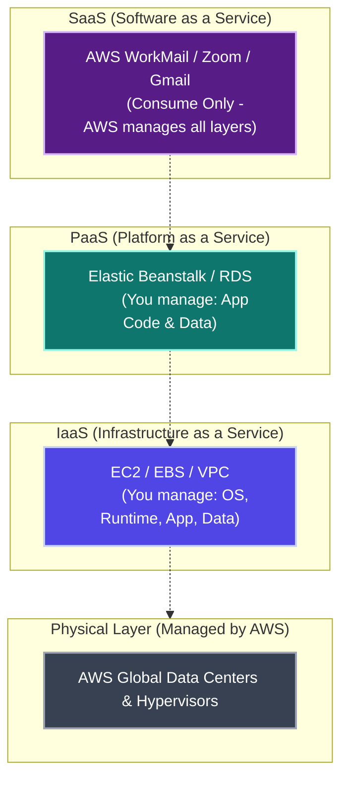

### 3. Interview Questions & Answers

#### Q: What is the difference between IaaS, PaaS, and SaaS?
**A:** 
* **IaaS** gives you raw infrastructure (like EC2). You have full root control and must configure the OS, runtimes, and libraries.
* **PaaS** gives you a managed platform (like Elastic Beanstalk). You upload application code, and the platform handles scaling, patching, and infrastructure provisioning.
* **SaaS** is a ready-to-use software product (like Slack or Zoom) that you access directly via web browser or API.

#### Q: Why would a company choose AWS over on-premises?
**A:** 
1. **No Capital Expense (CapEx):** Shift to Operational Expense (OpEx) by paying only for what you consume.
2. **Infinite Scale:** Instantly scale from 1 to 1,000 instances via Auto Scaling.
3. **Speed to Market:** Deploy code globally in minutes.
4. **Managed Maintenance:** Let AWS maintain hardware, power, cooling, and security compliance (SOC2, PCI-DSS, HIPAA).

#### Q (Scenario): Your company experiences a 10x traffic spike during Black Friday. How does the cloud solve this?
**A:** On-premises requires purchasing hardware to handle peak load, which sits idle for the rest of the year. AWS resolves this through **Auto Scaling** and **Elasticity**. Under normal conditions, you run a minimal fleet (e.g., 2 EC2 instances). When traffic spikes, Auto Scaling launches additional instances to handle the load and terminates them when demand drops. You only pay for compute capacity used during the peak.

### 4. Key Takeaways
* Cloud computing shifts infrastructure management from capital expenditure (CapEx) to operational expenditure (OpEx).
* The Shared Responsibility Model defines security bounds: AWS secures the cloud infrastructure; you secure the application and data.
* Deployments leverage varying levels of abstraction depending on need: IaaS offers maximum control, PaaS offers deployment speed, and SaaS offers zero maintenance.

---

## TOPIC 2: AWS GLOBAL INFRASTRUCTURE

### 1. Concept Explanation

#### Beginner
AWS operates physical data centers globally, structured hierarchically:
* **Regions:** A geographical area containing isolated resource clusters (e.g., Mumbai `ap-south-1`, N. Virginia `us-east-1`).
* **Availability Zones (AZs):** One or more discrete data centers within a Region, separated by distance to minimize damage from local disasters, and connected via high-speed, redundant fiber networks.
* **Edge Locations:** Network endpoints used by Amazon CloudFront (CDN) to cache static content closer to users to reduce latency.

#### Intermediate
* Regions are completely isolated from one another to prevent failure propagation. Data does not travel between regions unless explicitly configured.
* AZs are physically separated by miles (protecting against fires, floods, earthquakes) but are close enough to maintain low single-digit millisecond latency.
* Most AWS services are **Regional** (e.g., S3 bucket metadata, VPC configuration, RDS). Some are **Global** (e.g., IAM, Route 53, CloudFront).

##### Region & AZ Naming Convention Examples:
* `ap-south-1` (Mumbai Region)
  * `ap-south-1a` (Availability Zone A)
  * `ap-south-1b` (Availability Zone B)
  * `ap-south-1c` (Availability Zone C)

#### Advanced
High Availability (HA) deployments leverage Multi-AZ architectures.
* **RDS Multi-AZ:** The active database (Primary) sits in `ap-south-1a` and replicates synchronously to a Standby in `ap-south-1b`. If the primary AZ suffers an outage, AWS updates the DNS record to point to the standby instance within 60–120 seconds.
* **EC2 Multi-AZ:** Instances are distributed across multiple AZs under an Application Load Balancer (ALB). If an AZ goes down, the ALB stops routing traffic to instances in that AZ, while healthy AZ instances handle the traffic.

### 2. Architecture Diagram


### 3. Interview Questions & Answers

#### Q: What is the difference between a Region and an Availability Zone?
**A:** A Region is a global geographic location (e.g., Mumbai, Ireland) hosting multiple independent infrastructure zones. An Availability Zone (AZ) is a group of physical data centers within that region. Each Region contains a minimum of three AZs.

#### Q: How do you choose which AWS Region to deploy your application in?
**A:** Choose a region based on:
1. **Latency:** Deploy near your end users to minimize round-trip network time.
2. **Data Compliance:** Adhere to regional regulations (e.g., GDPR requires EU regions).
3. **Feature Availability:** Not all new AWS services are available in all regions initially.
4. **Cost:** Resource pricing varies slightly by region (e.g., `us-east-1` is typically the cheapest).

#### Q (Scenario): A primary RDS database crashes in production. How does Multi-AZ prevent data loss?
**A:** With Multi-AZ enabled, RDS maintains a synchronous standby instance in a different AZ. All writes to the primary database are replicated to the standby before completing. When the primary crashes, AWS detects the failure, switches the DNS endpoint to point to the standby, and completes the failover within 60–120 seconds. No application code changes are required because the database connection string remains the same.

### 4. Key Takeaways
* Regions are completely isolated failure domains. Availability Zones are physically separated but connected via low-latency networks.
* Edge locations are CDN caching nodes used by CloudFront, distinct from AZ data centers.
* Multi-AZ deployments are the foundation of high availability, automated failover, and disaster recovery.

---

## TOPIC 3: EC2 — ELASTIC COMPUTE CLOUD

### 1. Concept Explanation

#### Beginner
Elastic Compute Cloud (EC2) provides virtual servers (Virtual Machines) in the cloud. You customize the operating system, CPU, memory, and networking properties.

Key Terminology:
* **Instance:** A single running EC2 virtual server.
* **AMI (Amazon Machine Image):** A pre-configured template containing the OS, libraries, and configurations needed to boot an instance.
* **Instance Type:** Defines the hardware capabilities (CPU cores, RAM size, network bandwidth).
* **Security Group:** A virtual firewall controlling inbound and outbound network traffic to your instance.
* **Key Pair (.pem file):** Public/Private keys used for secure SSH terminal authentication.

#### Intermediate
##### EC2 Instance Types
| Family | Purpose | Example | Primary Use Case |
| :--- | :--- | :--- | :--- |
| **t3 / t2** | Burstable General Purpose | `t3.micro`, `t3.medium` | Dev/Test environments, small web servers |
| **m5** | Balanced General Purpose | `m5.large`, `m5.xlarge` | Backend APIs, enterprise Spring Boot apps |
| **c5** | Compute Optimized | `c5.large`, `c5.2xlarge` | High-CPU tasks, batch processors, encoders |
| **r5** | Memory Optimized | `r5.large`, `r5.2xlarge` | In-memory databases (Redis), large caches |
| **i3** | Storage Optimized | `i3.large` | Databases with high direct SSD I/O needs |
| **p3** | GPU/Accelerated Compute | `p3.2xlarge` | Machine Learning training, GPU rendering |

##### IP Types in AWS
* **Private IP:** Internal IP address assigned within the Virtual Private Cloud (VPC). Remains constant for the lifetime of the instance.
* **Public IP:** External IP address allocated dynamically. It changes every time the instance is stopped and started.
* **Elastic IP:** A static, persistent public IPv4 address. It remains attached to the instance through stops and starts.

##### Billing Models
* **On-Demand:** Pay per hour/second with no upfront commitment. Best for developmental, unpredictable, or short-term tasks.
* **Reserved Instances (RI) / Savings Plans:** Commit to 1 or 3 years of usage for a discount up to 72%. Best for stable, baseline production workloads.
* **Spot Instances:** Bid on spare AWS capacity at up to a 90% discount. AWS can reclaim these instances with a 2-minute warning. Best for fault-tolerant workloads like CI/CD runners or batch processing.

##### EC2 Bootstrapping
You can configure **User Data** scripts to execute automatically once during the first launch of the instance:
```bash
#!/bin/bash
sudo yum update -y
sudo yum install httpd -y
sudo systemctl start httpd
sudo systemctl enable httpd
echo "<h1>Hello World from EC2 Bootstrapping</h1>" > /var/www/html/index.html
```

#### Advanced
For automated scaling, attach EC2 instances to an **Auto Scaling Group (ASG)**:
* **Desired/Min/Max Limits:** Define capacity targets (e.g., Min=2, Desired=3, Max=10).
* **Scaling Policies:**
  * *Target Tracking:* Automatically scale out when the target average CPU utilization exceeds 60%.
  * *Scheduled Scaling:* Scale the instance count to 10 ahead of an expected marketing campaign on Friday at 9 AM.

### 2. Architecture Diagram

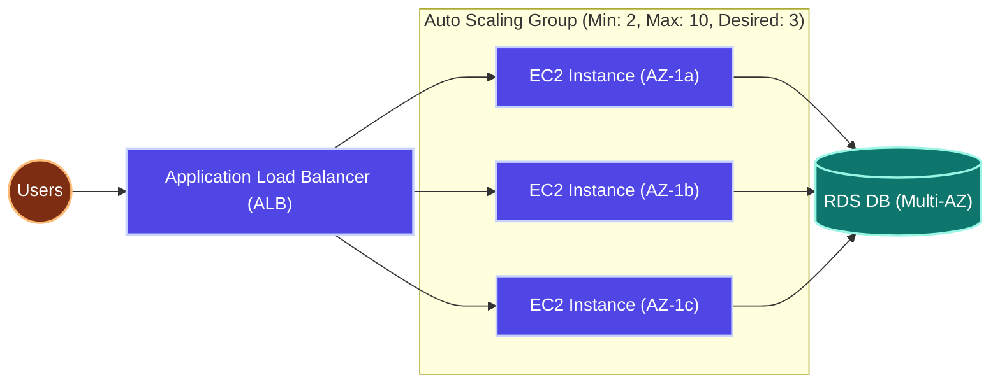

### 3. Interview Questions & Answers

#### Q: What is the difference between stopping and terminating an EC2 instance?
**A:** 
* **Stopping:** Shuts down the operating system. The instance remains in your account, and any data on the root EBS volume is preserved. You only pay for the EBS storage, not compute hours. The public IP address changes when restarted unless using an Elastic IP.
* **Terminating:** Permanently deletes the virtual machine and its root EBS volume (by default). The instance is destroyed and cannot be restarted.

#### Q: How do you deploy a Spring Boot application on an EC2 instance securely?
**A:** 
1. Place the EC2 instance in a **Private Subnet** inside your VPC (so it has no public IP).
2. Deploy an **Application Load Balancer (ALB)** in a Public Subnet to receive traffic from the internet and route it to your EC2 instance on port 8080.
3. Configure the **Security Group** of the EC2 instance to only allow inbound traffic from the ALB's Security Group on port 8080.
4. Attach an **IAM Role** to the EC2 instance to grant it necessary permissions (like reading database credentials from AWS Secrets Manager) without hardcoded credentials in the application files.

#### Q: What is the difference between Security Groups and Network ACLs (NACLs)?
**A:** 
* **Security Groups** act as virtual firewalls at the **instance level**, are **stateful** (allowing return traffic automatically), and support allow-only rules.
* **NACLs** act as firewalls at the **subnet level**, are **stateless** (requiring explicit rule configuration for both inbound and outbound traffic), and support both allow and deny rules.

### 4. Commands & Configuration Examples

#### SSH into EC2
```bash
# Set permissions so key file is not publicly readable
chmod 400 my-key.pem

# SSH using default OS users
ssh -i my-key.pem ec2-user@<public-ip-or-dns>  # Amazon Linux
ssh -i my-key.pem ubuntu@<public-ip-or-dns>    # Ubuntu
```

#### Production systemd Configuration for Spring Boot JAR
Create `/etc/systemd/system/policy-service.service`:
```ini
[Unit]
Description=Spring Boot Policy Service
After=network.target

[Service]
User=ec2-user
WorkingDirectory=/home/ec2-user
ExecStart=/usr/bin/java -jar /home/ec2-user/policy-service.jar --spring.profiles.active=prod
SuccessExitStatus=143
Restart=always
RestartSec=10

[Install]
WantedBy=multi-user.target
```

```bash
# Reload systemd, enable service to start on boot, and start service
sudo systemctl daemon-reload
sudo systemctl enable policy-service
sudo systemctl start policy-service
```

### 5. Best Practices
* **Principle of Least Privilege:** Do not write AWS credential keys inside your application files; always attach an IAM Role to the EC2 instance profile.
* **Network Isolation:** Run EC2 backend apps in private subnets and expose them using an ALB.
* **Secure Access:** Never open port 22 (SSH) to the entire internet (`0.0.0.0/0`); limit access to your corporate network range or use AWS Systems Manager Session Manager.

### 6. Key Takeaways
* EC2 provides customizable, elastic virtual machines.
* Billing models (Reserved, Spot, On-Demand) must be matched to workloads to optimize costs.
* Security groups are stateful, instance-level firewalls; NACLs are stateless, subnet-level firewalls.

---

## TOPIC 4: EBS — ELASTIC BLOCK STORE

### 1. Concept Explanation

#### Beginner
Elastic Block Store (EBS) is a network-attached hard drive (block storage) for EC2 instances. It is used to store the operating system, databases, and application files.

Key Characteristics:
* **Zone-Locked:** An EBS volume must reside in the same Availability Zone as the EC2 instance it attaches to.
* **Detachable:** An EBS volume can be detached from an instance and attached to another in the same AZ, acting as a portable hard drive.
* **One-to-One:** By default, an EBS volume attaches to one EC2 instance at a time.

#### Intermediate
##### EBS Volume Types
| Volume Type | Technology | Throughput / IOPS | Primary Use Cases |
| :--- | :--- | :--- | :--- |
| **gp3** (General Purpose SSD) | SSD | Up to 16,000 IOPS / 1,000 MB/s | System boot volumes, virtual desktops, development environments |
| **gp2** (General Purpose SSD) | SSD | Up to 16,000 IOPS (bursts based on size) | Legacy general workloads |
| **io2** (Provisioned IOPS SSD) | SSD | Up to 256,000 IOPS / 4,000 MB/s | Large, low-latency relational databases (Oracle, SQL Server) |
| **st1** (Throughput Optimized HDD) | HDD | Up to 500 MB/s | Large data streams, log analysis, data warehousing |
| **sc1** (Cold HDD) | HDD | Up to 250 MB/s | Large archives, infrequently accessed backup files |

* **Snapshots:** Point-in-time backups of your EBS volumes, stored in Amazon S3. Snapshots are incremental, storing only changed blocks, and are region-wide (not zone-locked).

#### Advanced
* **EBS Encryption:** Uses AES-256 to encrypt data at rest, snapshots, and data in transit between the EC2 host and the EBS volume. Encryption uses KMS keys and has negligible latency impact.
* **Cross-AZ Migration:** Because EBS volumes are zone-locked, to move data from `us-east-1a` to `us-east-1b`, you must:
  1. Take a snapshot of the EBS volume in `us-east-1a`.
  2. Create a new EBS volume from that snapshot, specifying the target availability zone (`us-east-1b`).
  3. Mount the new volume to an EC2 instance in `us-east-1b`.

### 2. Interview Questions & Answers

#### Q: What is the difference between EBS and Instance Store?
**A:** 
* **EBS** is persistent network-attached storage. The data persists even if the EC2 instance is stopped or restarted.
* **Instance Store** is physical, ephemeral storage attached directly to the host machine. If the instance is stopped, terminated, or suffers a hardware crash, all data in the instance store is permanently lost.

#### Q: What happens to the EBS root volume when an EC2 instance is terminated?
**A:** By default, the root EBS volume is deleted upon instance termination (`DeleteOnTermination` attribute is set to `true`). Additional volumes attached to the instance are preserved by default (`DeleteOnTermination` is set to `false`). You can change this behavior via CLI, CloudFormation, or Console configurations to preserve root volumes.

### 3. Commands

```bash
# List block storage devices
lsblk

# Format a newly attached raw EBS volume with ext4
sudo mkfs -t ext4 /dev/nvme1n1

# Mount the volume to a local folder
sudo mkdir /data
sudo mount /dev/nvme1n1 /data

# Configure /etc/fstab to persist the mount across system reboots
echo '/dev/nvme1n1 /data ext4 defaults,nofail 0 2' | sudo tee -a /etc/fstab

# Create an EBS snapshot via AWS CLI
aws ec2 create-snapshot --volume-id vol-0abc123456789def0 --description "Backup before application patch"
```

### 4. Key Takeaways
* EBS provides network-attached block storage.
* EBS volumes are tied to a single Availability Zone.
* Instance store is ephemeral and fast; EBS is persistent and durable.

---

## TOPIC 5: S3 — SIMPLE STORAGE SERVICE

### 1. Concept Explanation

#### Beginner
Simple Storage Service (S3) is an object storage service designed to store and retrieve any amount of data via HTTP endpoints. Instead of block-level file directory structures, S3 stores files as objects inside container units called buckets.

Key Terminology:
* **Buckets:** Directory containers with a globally unique namespace across all AWS customers.
* **Objects:** Files (keys) containing data, metadata, and a version ID. Single objects range in size from 0 bytes up to 5 TB.
* **Durability:** Designed for 99.999999999% (11 nines) durability by replicating objects across a minimum of three physical AZs.

#### Intermediate
##### S3 Storage Classes
| Storage Class | Availability SLA | Minimum Duration | Use Case |
| :--- | :--- | :--- | :--- |
| **S3 Standard** | 99.99% | None | Frequently accessed files, active application files |
| **S3 Intelligent-Tiering** | 99.9% | None | Files with unknown or changing access patterns |
| **S3 Standard-IA** | 99.9% | 30 Days | Infrequently accessed files, monthly report archives |
| **S3 One Zone-IA** | 99.5% | 30 Days | Non-critical, reproducible files stored in a single AZ |
| **S3 Glacier Instant Retrieval**| 99.9% | 90 Days | Archival data requiring millisecond access times |
| **S3 Glacier Flexible Retrieval**| 99.99% (Vaults) | 90 Days | Archives with retrieval times ranging from minutes to 5 hours |
| **S3 Glacier Deep Archive** | 99.9% | 180 Days | Long-term compliance logs (retrieval time of 12 hours) |

* **Lifecycle Policies:** Automate data storage tier transitions (e.g., transition objects from Standard to Standard-IA after 30 days, then archive to Glacier after 90 days).
* **Versioning:** Keep multiple versions of an object in a bucket to protect against accidental overrides and deletions.
* **Pre-signed URLs:** Generate temporary access links valid for a custom duration (e.g., 15 minutes) to allow users to upload or download files directly from S3 securely.

#### Advanced
S3 access control utilizes multiple resource policy layers:
1. **IAM Policy:** User-level permission configurations.
2. **Bucket Policy:** Resource-level JSON policies attached directly to the bucket.
3. **Block Public Access:** Account-level block settings to prevent accidental exposure of buckets.

##### Direct S3 Upload Architecture
To prevent web servers from running out of network bandwidth and CPU when handling massive uploads (e.g., 2 GB files), the application server generates an **S3 Pre-signed URL** and returns it to the client. The client browser then uploads the file directly to S3 via HTTP PUT:

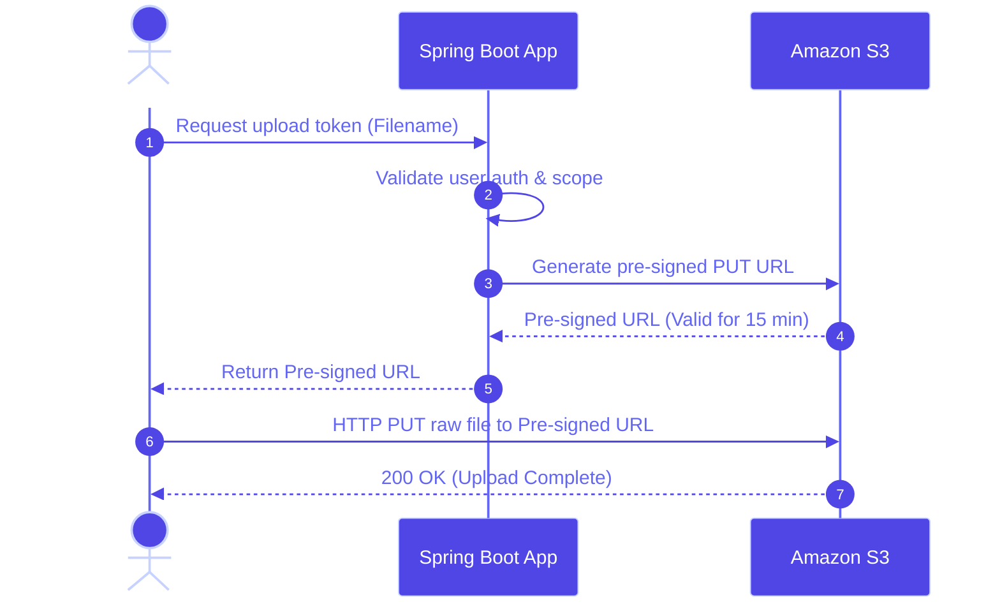

### 2. Spring Boot Integration Examples

#### AWS SDK v2 (Recommended)
This snippet uses the modern AWS SDK v2, which automatically resolves credentials using the EC2 IAM Instance Profile when deployed in AWS.

```java
package com.company.service;

import org.springframework.stereotype.Service;
import org.springframework.web.multipart.MultipartFile;
import software.amazon.awssdk.core.sync.RequestBody;
import software.amazon.awssdk.regions.Region;
import software.amazon.awssdk.services.s3.S3Client;
import software.amazon.awssdk.services.s3.model.GetObjectRequest;
import software.amazon.awssdk.services.s3.model.PutObjectRequest;
import software.amazon.awssdk.services.s3.presigner.S3Presigner;
import software.amazon.awssdk.services.s3.presigner.model.GetObjectPresignRequest;
import software.amazon.awssdk.services.s3.presigner.model.PresignedGetObjectRequest;

import java.io.IOException;
import java.time.Duration;
import java.util.UUID;

@Service
public class S3FileService {

    private final S3Client s3Client;
    private final S3Presigner s3Presigner;
    private final String bucketName = "policy-documents";

    // Rely on Default Credentials Provider Chain (resolves IAM Role automatically)
    public S3FileService() {
        this.s3Client = S3Client.builder()
                .region(Region.AP_SOUTH_1)
                .build();
        this.s3Presigner = S3Presigner.builder()
                .region(Region.AP_SOUTH_1)
                .build();
    }

    public String uploadFile(MultipartFile file) throws IOException {
        String key = UUID.randomUUID() + "/" + file.getOriginalFilename();
        PutObjectRequest putObjectRequest = PutObjectRequest.builder()
                .bucket(bucketName)
                .key(key)
                .contentType(file.getContentType())
                .build();

        s3Client.putObject(putObjectRequest, 
                RequestBody.fromInputStream(file.getInputStream(), file.getSize()));
        return "https://" + bucketName + ".s3.amazonaws.com/" + key;
    }

    public String generatePresignedUrl(String key, int expiryMinutes) {
        GetObjectRequest getObjectRequest = GetObjectRequest.builder()
                .bucket(bucketName)
                .key(key)
                .build();

        GetObjectPresignRequest presignRequest = GetObjectPresignRequest.builder()
                .signatureDuration(Duration.ofMinutes(expiryMinutes))
                .getObjectRequest(getObjectRequest)
                .build();

        PresignedGetObjectRequest presignedRequest = s3Presigner.presignGetObject(presignRequest);
        return presignedRequest.url().toString();
    }
}
```

#### AWS SDK v1 (Legacy / Reference)
For legacy microservices using AWS SDK v1:
```java
package com.company.service;

import com.amazonaws.services.s3.AmazonS3;
import com.amazonaws.services.s3.model.ObjectMetadata;
import com.amazonaws.services.s3.model.S3Object;
import org.springframework.beans.factory.annotation.Autowired;
import org.springframework.stereotype.Service;
import org.springframework.web.multipart.MultipartFile;
import java.io.IOException;
import java.util.UUID;

@Service
public class LegacyS3FileService {

    @Autowired 
    private AmazonS3 s3Client;
    private final String bucket = "policy-documents";

    public String uploadFile(MultipartFile file) throws IOException {
        String key = UUID.randomUUID() + "/" + file.getOriginalFilename();
        ObjectMetadata metadata = new ObjectMetadata();
        metadata.setContentType(file.getContentType());
        metadata.setContentLength(file.getSize());
        
        s3Client.putObject(bucket, key, file.getInputStream(), metadata);
        return s3Client.getUrl(bucket, key).toString();
    }

    public S3Object downloadFile(String key) {
        return s3Client.getObject(bucket, key);
    }
}
```

### 3. Interview Questions & Answers

#### Q: How do you configure a bucket for Static Website Hosting, and what permissions are required?
**A:** 
1. Enable **Static Website Hosting** under the S3 bucket properties and define the entry files (e.g., `index.html` and `error.html`).
2. Disable **Block Public Access** on the bucket.
3. Apply a public read bucket policy to allow public access:
```json
{
  "Version": "2012-10-17",
  "Statement": [
    {
      "Sid": "PublicReadGetObject",
      "Effect": "Allow",
      "Principal": "*",
      "Action": "s3:GetObject",
      "Resource": "arn:aws:s3:::your-bucket-name/*"
    }
  ]
}
```

### 4. CLI Commands

```bash
# List all buckets in the account
aws s3 ls

# Sync a local build directory to an S3 bucket (deleting removed local files in the target bucket)
aws s3 sync ./dist s3://my-static-web-bucket --delete

# Enable versioning on a bucket
aws s3api put-bucket-versioning --bucket my-app-bucket --versioning-configuration Status=Enabled
```

### 5. Key Takeaways
* S3 is a highly durable, globally-available object storage service.
* Storage Classes allow you to optimize storage costs based on file access frequency.
* Pre-signed URLs allow clients to perform secure uploads and downloads directly, reducing application server overhead.

---

## TOPIC 6: IAM — IDENTITY & ACCESS MANAGEMENT

### 1. Concept Explanation

#### Beginner
Identity & Access Management (IAM) controls authentication and authorization for users and services accessing AWS resources.

Core Components:
* **Root Account:** The initial, all-powerful account created with an email address. Best practice is to enable Multi-Factor Authentication (MFA) and lock this account away, using it only for billing.
* **IAM Users:** Identities created within the account for physical developers or external applications, using permanent API Access Keys.
* **IAM Groups:** Collections of IAM Users. You attach authorization policies directly to groups (e.g. `DeveloperGroup`, `SecurityGroup`) rather than individual users.
* **IAM Roles:** Temporary identities that can be assumed by users, applications, or AWS services (like EC2 and Lambda). Roles use temporary security credentials that rotate automatically.
* **Policies:** JSON documents defining allowed actions, resources, and conditions.

#### Intermediate
##### JSON Policy Structure Example
```json
{
  "Version": "2012-10-17",
  "Statement": [
    {
      "Effect": "Allow",
      "Action": [
        "s3:GetObject",
        "s3:PutObject"
      ],
      "Resource": "arn:aws:s3:::policy-documents/*",
      "Condition": {
        "IpAddress": {
          "aws:SourceIp": "192.168.1.0/24"
        }
      }
    }
  ]
}
```

* **IAM Roles for AWS Services:** You assign an IAM Role to an EC2 instance profile. The AWS SDK running inside the instance automatically requests temporary credentials from the **EC2 Instance Metadata Service (IMDS)**, eliminating the need to store static AWS credentials on the server.

#### Advanced
##### IAM Policy Evaluation Engine
When an API request is evaluated:
1. **Explicit Deny:** If any policy statements match a `Deny` action, the request is immediately rejected.
2. **Explicit Allow:** If an `Allow` matches, the request is approved.
3. **Implicit Deny:** If there is no explicit `Allow`, the request is denied by default.

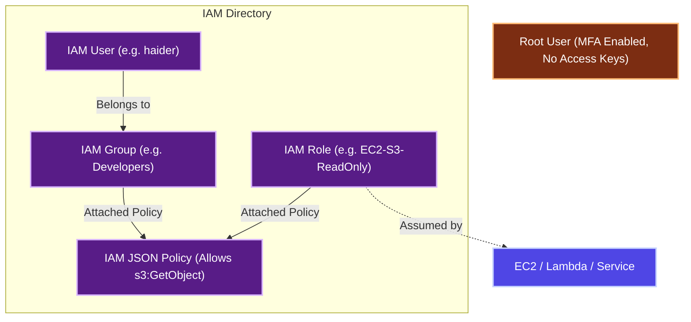

### 2. Interview Questions & Answers

#### Q: What is the difference between IAM Users, Groups, and Roles?
**A:** 
* **Users** represent distinct users or applications with long-term credentials (passwords, access keys).
* **Groups** are logical collections of users used to manage permission structures collectively.
* **Roles** are assigned to resources or federated users to generate temporary access credentials. Roles are assumed dynamically and do not have static passwords or access keys.

#### Q (Scenario): A developer accidentally commits AWS Access Keys to a public GitHub repository. How do you respond?
**A:** 
1. Log into the AWS Console immediately and delete or deactivate the compromised Access Key.
2. Review **AWS CloudTrail** logs to audit all API actions performed using that Access Key.
3. Terminate any unauthorized resources launched during the compromise.
4. Purge the credentials from the Git history.
5. Deploy automated Git credential scanners (like git-secrets or GitHub secret scanning) to prevent future leaks.

### 3. Key Takeaways
* Follow the Principle of Least Privilege: only grant the permissions required for a specific task.
* Use IAM Roles with temporary credentials for applications and AWS services instead of permanent access keys.
* Deny statements always take precedence over Allow statements in policy evaluation.

---

## TOPIC 7: VPC — VIRTUAL PRIVATE CLOUD

### 1. Concept Explanation

#### Beginner
A Virtual Private Cloud (VPC) is a private, logically isolated network partition within AWS. It allows you to define IP ranges, subnets, route tables, and gateways, mirroring a physical corporate network.

Core Terminology:
* **CIDR Block:** Classless Inter-Domain Routing range determining the IP capacity of the VPC (e.g. `10.0.0.0/16` provides 65,536 IPs).
* **Subnet:** A subdivision of the VPC CIDR block.
  * **Public Subnet:** A subnet with a route to an **Internet Gateway (IGW)**, allowing resources inside it to communicate with the public internet.
  * **Private Subnet:** A subnet with no direct route to the internet, isolating databases and application instances from external access.
* **NAT Gateway:** A network address translation gateway placed in a public subnet. It allows instances in private subnets to send outbound traffic to the internet (e.g., for software patches) while blocking inbound connections from the internet.

#### Intermediate
##### Production-Ready VPC Network Design
A standard Multi-AZ VPC design spans three availability zones, splitting the network into public, private, and database tiers:

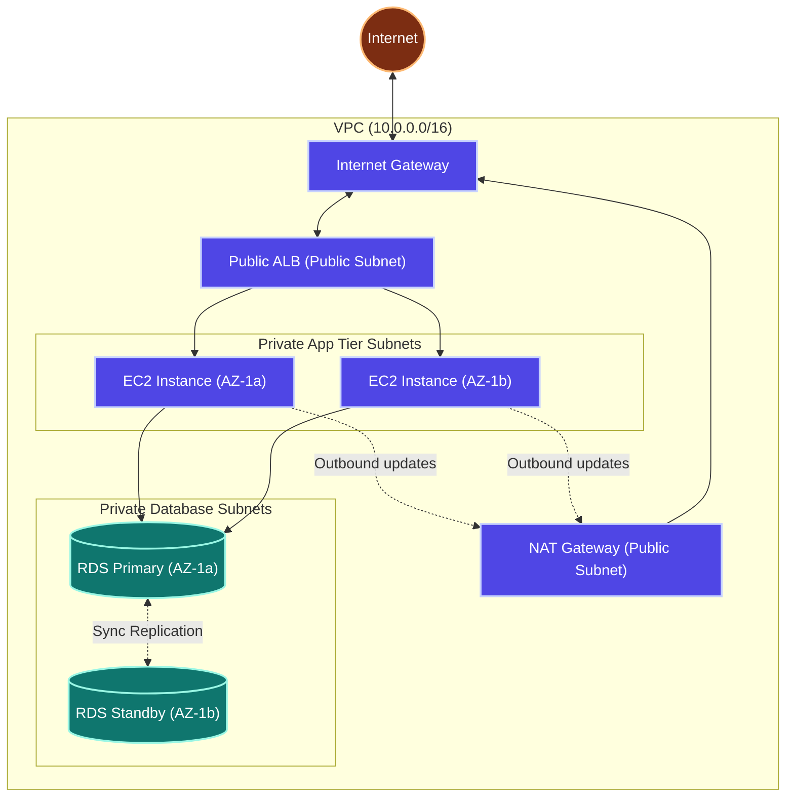

#### Advanced
* **VPC Peering:** Connects two VPCs securely via private IP routing. Peer routing is non-transitive (if VPC A peers with VPC B, and B peers with C, A cannot access C without a direct peer link).
* **VPC Endpoints:** Access AWS services privately without routing traffic through the public internet.
  * **Gateway Endpoints:** Free endpoints routing to Amazon S3 and DynamoDB.
  * **Interface Endpoints (AWS PrivateLink):** Paid network interfaces routing to other AWS services (like SQS, SNS, KMS).
* **VPC Flow Logs:** Captures IP traffic logging metadata on network interfaces to assist with security audits and troubleshooting.

### 2. Interview Questions & Answers

#### Q: How do Security Groups differ from Network Access Control Lists (NACLs)?
**A:** 
| Feature | Security Group | Network ACL (NACL) |
| :--- | :--- | :--- |
| **Operational Level** | Instance level | Subnet level |
| **State** | Stateful (inbound traffic auto-allows return outbound traffic) | Stateless (return traffic must be explicitly allowed) |
| **Rules Support** | Allow rules only | Allow and Deny rules |
| **Rule Execution** | All rules evaluated before granting access | Rules evaluated sequentially (lowest rule number first) |

#### Q: How does an instance in a private subnet access the internet to download a security patch?
**A:** The private instance routes its outbound traffic to a **NAT Gateway** located in a public subnet. The NAT Gateway translates the private source IP to its public elastic IP and forwards the request to the **Internet Gateway (IGW)**. The internet resource responds back through the NAT Gateway, which routes the traffic back to the private instance.

### 3. Key Takeaways
* Public subnets route outbound traffic through an Internet Gateway. Private subnets route outbound traffic through a NAT Gateway.
* Security groups are stateful and act at the instance level. NACLs are stateless and act at the subnet level.
* VPC Endpoints allow you to access AWS services privately without sending traffic over the internet.

---

## TOPIC 8: LOAD BALANCER & AUTO SCALING

### 1. Concept Explanation

#### Beginner
* **Load Balancer:** Distributes incoming application traffic across a fleet of target servers (like EC2 instances) to prevent overload and ensure high availability.
* **Auto Scaling Group (ASG):** Monitors your EC2 instances and automatically adjusts the instance count to maintain target capacities based on traffic demand.

#### Intermediate
AWS Elastic Load Balancing (ELB) supports multiple load balancer types:
* **Application Load Balancer (ALB):** Operates at Layer 7 (HTTP/HTTPS). Supports features like host-based routing, path-based routing, SSL termination, and sticky sessions.
* **Network Load Balancer (NLB):** Operates at Layer 4 (TCP/UDP). Optimized for ultra-high performance, low latency, and static IP allocations.

##### Path-Based Routing Example
An ALB can inspect the HTTP request path and route the request to different target groups:

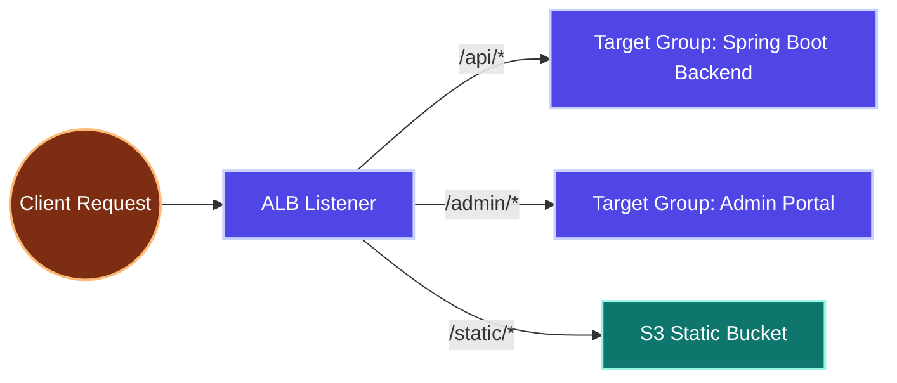

#### Advanced
* **Connection Draining (Deregistration Delay):** When an instance is removed from the load balancer, the ALB keeps the connection open for a period (e.g., 300 seconds) to allow in-flight requests to complete before terminating the instance.
* **ASG Lifecycle Hooks:** Pause instance state changes (e.g., during scale-out or scale-in) to run initialization scripts or retrieve diagnostic logs before the instance is destroyed.

### 2. Interview Questions & Answers

#### Q: How do you achieve zero-downtime deployments using an ALB and an ASG?
**A:** 
1. Define a **Readiness Probe** (`/actuator/health`) so the ALB only routes traffic to healthy instances.
2. Configure a rolling update deployment policy (e.g. `maxSurge = 1`, `maxUnavailable = 0` in Kubernetes, or a rolling update policy in an ASG).
3. The ASG launches a new instance running the updated code.
4. The ALB routes health check requests to the new instance. Once it passes, the ALB registers it into the target group.
5. The ALB deregisters an old instance and begins the connection draining timeout (deregistration delay) to allow active sessions to close.
6. Once drained, the old instance is terminated safely.

#### Q: What are sticky sessions and when would you use them?
**A:** Sticky sessions configure the ALB to route a user's consecutive requests to the same target EC2 instance. This is achieved by generating a cookie on the load balancer. It is used for legacy stateful applications that store user session data locally in the server's memory rather than in a distributed cache like Redis.

### 3. Key Takeaways
* ALBs operate at Layer 7 (HTTP/HTTPS) and support routing rules. NLBs operate at Layer 4 (TCP/UDP) for high-performance networks.
* Connection draining allows active requests to complete gracefully before an instance is terminated during scale-in.
* Sticky sessions tie a user to a specific instance, which can cause uneven load distribution.

---

## TOPIC 9: RDS — RELATIONAL DATABASE SERVICE

### 1. Concept Explanation

#### Beginner
Relational Database Service (RDS) is a managed database service. AWS handles database provisioning, operating system patching, automated backups, and storage scaling, allowing you to focus on schema optimization and queries.

Supported Database Engines:
* Amazon Aurora, PostgreSQL, MySQL, MariaDB, Oracle, Microsoft SQL Server.

#### Intermediate
##### High Availability vs. Scale Comparisons
| Feature | RDS Multi-AZ | RDS Read Replicas |
| :--- | :--- | :--- |
| **Primary Goal** | Disaster Recovery / High Availability | Scalability for read-heavy workloads |
| **Replication Type** | Synchronous | Asynchronous |
| **Active Connections** | Only the primary instance accepts queries. The standby is inactive. | Read replicas accept read-only queries (e.g., reports, searches). |
| **Failover Mechanism** | Automated failover (DNS updates automatically) | Manual promotion to a standalone primary database |
| **AZ Scope** | Spans 2 Availability Zones | Spans multiple AZs or cross-region |

##### Spring Boot Configuration Example (`application.yml`)
```yaml
spring:
  datasource:
    url: jdbc:mysql://database-prod-endpoint.ap-south-1.rds.amazonaws.com:3306/policydb?useSSL=true
    username: ${DB_USER}
    password: ${DB_PASSWORD}
    driver-class-name: com.mysql.cj.jdbc.Driver
    hikari:
      maximum-pool-size: 20
      minimum-idle: 5
      idle-timeout: 300000
      connection-timeout: 20000
      max-lifetime: 1800000
  jpa:
    hibernate:
      ddl-auto: validate
    show-sql: false
```

#### Advanced
* **Amazon Aurora:** A cloud-native database engine. It replicates data 6 ways across 3 availability zones and auto-scales storage up to 128 TB.
* **RDS Proxy:** An intermediate database proxy that pools database connections. This is useful for serverless applications (like Lambda) that open and close connections frequently, preventing connection exhaustion.

### 2. Interview Questions & Answers

#### Q: How do you optimize and debug slow database queries on RDS?
**A:** 
1. Enable **RDS Performance Insights** to identify SQL queries with high CPU load or I/O wait times.
2. Enable the **Slow Query Log** in the RDS parameter group and export it to CloudWatch Logs.
3. Use `EXPLAIN` on slow queries to identify missing indexes or full table scans.
4. Scale reads horizontally by adding **Read Replicas** and routing read-only queries to them.
5. Upgrade storage from `gp3` to `io2` if the database is throttled by IOPS limits.

### 3. Key Takeaways
* RDS Multi-AZ provides synchronous replication and automated failover for disaster recovery. Read Replicas provide asynchronous replication for read scalability.
* RDS Proxy manages connection pooling, preventing serverless functions from overwhelming the database connection limit.
* Enable Performance Insights and slow query logging to identify database bottlenecks.

---

## TOPIC 10: AWS LAMBDA — SERVERLESS COMPUTING

### 1. Concept Explanation

#### Beginner
AWS Lambda is a serverless, event-driven compute service. You upload your application code as a function, and AWS runs and scales it automatically in response to triggers. You pay only for the compute time consumed per millisecond of execution.

Key Characteristics:
* No servers to configure, patch, or maintain.
* Automatically scales from 0 to thousands of concurrent executions.
* Maximum runtime duration is 15 minutes per execution.

#### Intermediate
##### Common Lambda Triggers
* **API Gateway / ALB:** Routes HTTP requests to run serverless REST APIs.
* **Amazon S3:** Triggers processing functions when files are uploaded (e.g., generating image thumbnails).
* **Amazon SQS / Kinesis:** Polls queues and processes incoming messages asynchronously.
* **Amazon EventBridge (CloudWatch Events):** Runs functions on a cron-like schedule.

##### Java Cold Start Problem
When a Lambda function is triggered after being idle, AWS must provision a container, initialize the JVM runtime, and load your code. For Java applications, this "cold start" can take 2–10 seconds.
* **Mitigations:**
  1. **Provisioned Concurrency:** Pre-warms a set number of containers to eliminate cold start latency.
  2. **AWS Lambda SnapStart:** Takes a snapshot of the initialized JVM memory cache and resumes from it on subsequent triggers, reducing cold starts to sub-second levels.
  3. **GraalVM Native Compilation:** Compile Java code into a native binary to reduce memory footprint and startup times.

#### Advanced
##### Lambda Concurrency Models
* **Account Limit:** AWS enforces a default soft limit of 1,000 concurrent executions per region.
* **Reserved Concurrency:** Restricts the maximum concurrency of a specific function, preventing it from consuming the entire account limit and throttling other functions.

##### Serverless Microservice Design
A standard serverless API architecture using API Gateway, Lambda, and database layers:

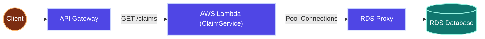

### 2. Spring Boot Lambda Handler Code Example

To run a Spring Boot application within a Lambda container, use the **AWS Serverless Java Container** library to bridge HTTP requests:

```java
package com.company.handler;

import com.amazonaws.serverless.exceptions.ContainerInitializationException;
import com.amazonaws.serverless.proxy.model.AwsProxyRequest;
import com.amazonaws.serverless.proxy.model.AwsProxyResponse;
import com.amazonaws.serverless.proxy.spring.SpringBootLambdaContainerHandler;
import com.amazonaws.services.lambda.runtime.Context;
import com.amazonaws.services.lambda.runtime.RequestStreamHandler;
import com.company.Application;

import java.io.IOException;
import java.io.InputStream;
import java.io.OutputStream;

public class StreamLambdaHandler implements RequestStreamHandler {
    private static SpringBootLambdaContainerHandler<AwsProxyRequest, AwsProxyResponse> handler;

    static {
        try {
            // Load Spring Boot application context during container initialization
            handler = SpringBootLambdaContainerHandler.getAwsProxyHandler(Application.class);
        } catch (ContainerInitializationException e) {
            throw new RuntimeException("Could not initialize Spring Boot application", e);
        }
    }

    @Override
    public void handleRequest(InputStream inputStream, OutputStream outputStream, Context context)
            throws IOException {
        // Route request and response streams through the proxy handler
        handler.proxyStream(inputStream, outputStream, context);
    }
}
```

### 3. Interview Questions & Answers

#### Q: When would you choose Lambda over EC2?
**A:** 
| Feature | AWS Lambda | AWS EC2 |
| :--- | :--- | :--- |
| **Scaling** | Instantly scales based on event frequency | Scales via ASG policies (minutes) |
| **State** | Stateless only | Stateful or Stateless |
| **Cost Model** | Pay per millisecond of execution | Pay per hour for running instances |
| **Runtime Limit** | Maximum 15 minutes per request | No limit |
| **Operational Effort** | None (serverless) | High (patching, OS maintenance) |

Use **Lambda** for short-lived tasks, event processing, S3 triggers, and APIs with variable traffic. Use **EC2** for long-running processes, web sockets, and applications requiring local state.

### 4. Key Takeaways
* AWS Lambda is stateless, event-driven, and scales automatically.
* Use Provisioned Concurrency or SnapStart to mitigate JVM cold start latency in production Java applications.
* Set Reserved Concurrency to prevent a single function from exhausting the account's regional concurrency limit.

---

## TOPIC 11: ECS & EKS — CONTAINER ORCHESTRATION

### 1. Concept Explanation

#### Beginner
When managing dozens or hundreds of containerized applications, container orchestrators handle container scheduling, deployments, scaling, and load balancing.

AWS provides two primary orchestration options:
* **Elastic Container Service (ECS):** An AWS-native container orchestrator. It is simple to configure and integrates deeply with other AWS services.
* **Elastic Kubernetes Service (EKS):** A managed Kubernetes service. It conforms to open-source Kubernetes standards, offering high portability across multiple cloud environments.

#### Intermediate
##### Launch Modes
* **EC2 Launch Type:** You provision and manage the underlying EC2 instances that host the containers.
* **Fargate Launch Type:** A serverless compute engine for containers. AWS manages the underlying servers; you only define CPU and memory limits.

##### ECS Core Concepts
* **Task Definition:** A JSON blueprint configuring the container image, environment variables, storage mounts, and resource allocations.
* **Task:** A running container instance instantiated from a Task Definition.
* **Service:** Manages a specified number of running tasks, handles scaling, and registers tasks with a load balancer.

##### Task Definition Secrets Injection Example
```json
{
  "family": "policy-service-task",
  "networkMode": "awsvpc",
  "requiresCompatibilities": ["FARGATE"],
  "cpu": "512",
  "memory": "1024",
  "containerDefinitions": [
    {
      "name": "policy-service",
      "image": "123456789012.dkr.ecr.ap-south-1.amazonaws.com/policy-service:v2",
      "portMappings": [
        {
          "containerPort": 8080
        }
      ],
      "secrets": [
        {
          "name": "SPRING_DATASOURCE_PASSWORD",
          "valueFrom": "arn:aws:secretsmanager:ap-south-1:123456789012:secret:prod/db-password-xyz:password::"
        }
      ],
      "logConfiguration": {
        "logDriver": "awslogs",
        "options": {
          "awslogs-group": "/ecs/policy-service",
          "awslogs-region": "ap-south-1",
          "awslogs-stream-prefix": "ecs"
        }
      }
    }
  ]
}
```

#### Advanced
* **EKS IAM Roles for Service Accounts (IRSA):** Maps IAM Roles directly to Kubernetes Service Accounts. This allows pods to call AWS resources (like S3 or DynamoDB) using temporary credentials, adhering to the principle of least privilege at the pod level rather than the node level.

### 2. Interview Questions & Answers

#### Q: How do ECS and EKS compare, and how do you choose between them?
**A:** 
| Feature | Elastic Container Service (ECS) | Elastic Kubernetes Service (EKS) |
| :--- | :--- | :--- |
| **Complexity** | Simple, native AWS integrations | High, requires Kubernetes expertise |
| **Portability** | AWS-specific | Open-source Kubernetes (run on any cloud) |
| **Cost** | No charge for the control plane | Control plane costs $0.10 per hour |
| **Resource Model** | Tasks and Services | Pods, Deployments, and Services |

Choose **ECS** for AWS-centric applications that benefit from simple configuration. Choose **EKS** if your organization requires Kubernetes compatibility, multi-cloud portability, or advanced custom configurations.

### 3. Key Takeaways
* Fargate provides serverless compute for both ECS and EKS, eliminating the need to manage EC2 host nodes.
* Reference ARNs inside Task Definitions to inject secrets from AWS Secrets Manager securely at runtime.
* EKS IRSA provides fine-grained IAM security controls at the pod level.

---

## TOPIC 12: CLOUDWATCH — MONITORING & LOGGING

### 1. Concept Explanation

#### Beginner
Amazon CloudWatch provides monitoring, logging, and observability for your AWS resources and applications.

Core Concepts:
* **Metrics:** Numeric data points representing resource health (e.g. EC2 CPU utilization, RDS database connections).
* **Logs:** Text-based logs collected from applications, operating systems, and AWS services.
* **Alarms:** Triggers automated actions (such as sending notifications or scaling resources) when a metric exceeds a defined threshold.
* **Dashboards:** Customizable visual consoles displaying real-time metrics.

#### Intermediate
##### Production CloudWatch Metrics to Monitor
* **EC2:** `CPUUtilization` (Alarm > 80%), `StatusCheckFailed` (indicates hardware or OS issues).
* **RDS:** `CPUUtilization` (Alarm > 75%), `DatabaseConnections` (Alarm if near pool maximum), `FreeStorageSpace` (indicates storage limits).
* **ALB:** `TargetResponseTime` (Alarm if > 2.0s), `HTTPCode_Target_5XX_Count` (indicates application errors).
* **Lambda:** `Errors` (execution failures), `Throttles` (exceeded concurrency limits).

#### Advanced
##### CloudWatch Logs Insights Query Example
To find the top 10 endpoints causing HTTP 500 errors in your application:
```text
fields @timestamp, @message, status
| filter status = 500
| stats count(*) as errorCount by requestPath
| sort errorCount desc
| limit 10
```

### 2. Spring Boot Logback Appender Example

You can configure your application to stream log events directly to CloudWatch using an AWS Logback Appender:

```xml
<?xml version="1.0" encoding="UTF-8"?>
<configuration>
    <!-- Include default Console Logging -->
    <include resource="org/springframework/boot/logging/logback/defaults.xml" />
    <include resource="org/springframework/boot/logging/logback/console-appender.xml" />

    <!-- CloudWatch Log Appender Configuration -->
    <appender name="CLOUDWATCH" class="ca.pjer.logback.AwsLogsAppender">
        <filter class="ch.qos.logback.classic.filter.ThresholdFilter">
            <level>INFO</level>
        </filter>
        <layout>
            <pattern>%d{yyyy-MM-dd HH:mm:ss.SSS} [%thread] %-5level %logger{36} - %msg%n</pattern>
        </layout>
        <logGroupName>/aws/app/policy-service-prod</logGroupName>
        <logStreamName>policy-api-stream</logStreamName>
        <logRegion>ap-south-1</logRegion>
        <maxBatchLogEvents>50</maxBatchLogEvents>
    </appender>

    <root level="INFO">
        <appender-ref ref="CONSOLE" />
        <appender-ref ref="CLOUDWATCH" />
    </root>
</configuration>
```

### 3. Interview Questions & Answers

#### Q: How do you configure scaling based on custom application metrics rather than just CPU?
**A:** 
1. Publish your custom application metric (e.g. `OrdersProcessed`) to CloudWatch using the AWS SDK or Micrometer:
```java
// Push custom metric using software.amazon.awssdk.services.cloudwatch
cloudWatchClient.putMetricData(PutMetricDataRequest.builder()
    .namespace("ECommerceApp")
    .metricData(MetricDatum.builder()
        .metricName("ActiveCartSessions")
        .value(doubleValue)
        .build())
    .build());
```
2. Create a CloudWatch Alarm triggered when `ActiveCartSessions` exceeds 1,000 for 3 consecutive evaluation periods.
3. Configure the Auto Scaling Group scaling policy to launch new EC2 instances when the alarm is triggered.

### 4. Key Takeaways
* CloudWatch handles application metrics, log management, and system alerting.
* Use CloudWatch Logs Insights to run high-performance queries across large log datasets.
* Auto Scaling can be triggered by custom metrics (like queue depths or API request counts) rather than just default CPU metrics.

---

## TOPIC 13: SNS & SQS — MESSAGING SERVICES

### 1. Concept Explanation

#### Beginner
* **Simple Queue Service (SQS):** A message queue service used to decouple applications. SQS is **pull-based** (consumers poll the queue to retrieve messages).
* **Simple Notification Service (SNS):** A pub/sub messaging service. SNS is **push-based** (messages are pushed to all subscribed endpoints instantly).

#### Intermediate
##### SQS Queue Types
* **Standard Queue:** Offers near-infinite throughput, at-least-once message delivery, and best-effort ordering (messages may arrive out of order).
* **FIFO Queue (First-In-First-Out):** Guarantees exactly-once delivery and strict ordering, capped at 300 messages per second (or 3,000 using batching).

##### SQS Dead Letter Queue (DLQ)
A DLQ is a secondary queue used to isolate messages that cannot be processed successfully after a defined number of retries (redrive policy), preventing bad data from blocking the queue.

##### SNS + SQS Fan-Out Pattern
Instead of your application service calling multiple downstream APIs sequentially, publish a single message to an SNS topic. SNS fans the message out to multiple subscribed SQS queues, which are processed independently by different microservices:

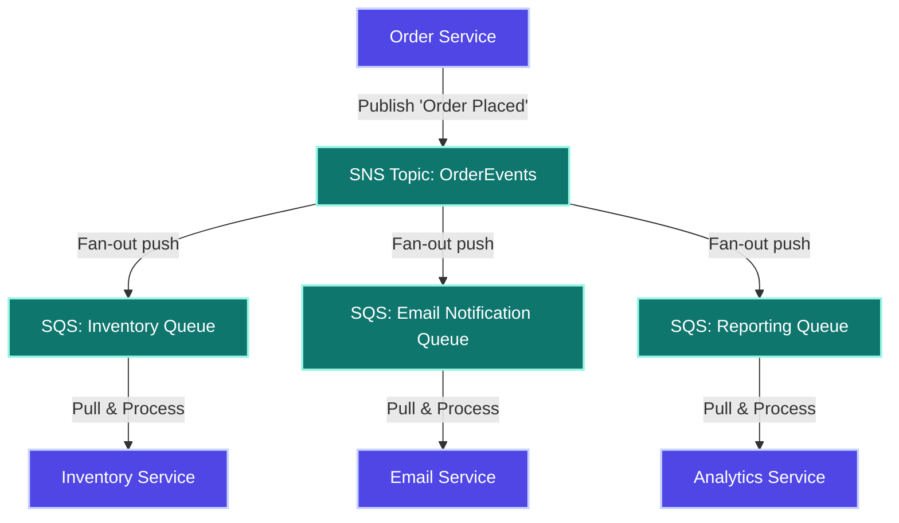

### 2. Spring Boot SQS Integration Example

Configure your application to poll and process SQS messages asynchronously using Spring Cloud AWS:

```java
package com.company.listener;

import com.company.dto.OrderEventDto;
import io.awspring.cloud.sqs.annotation.SqsListener;
import org.slf4j.Logger;
import org.slf4j.LoggerFactory;
import org.springframework.stereotype.Component;

@Component
public class SqsMessageListener {
    private static final Logger log = LoggerFactory.getLogger(SqsMessageListener.class);

    @SqsListener("prod-order-processing-queue")
    public void receiveMessage(OrderEventDto orderEvent) {
        log.info("Received SQS message: {}", orderEvent.getOrderId());
        try {
            // Business Logic: Process order
            processOrder(orderEvent);
        } catch (Exception e) {
            log.error("Failed to process message: {}", orderEvent.getOrderId(), e);
            // Throw exception to prevent SQS from deleting the message
            // SQS will retry processing based on the visibility timeout
            throw e;
        }
    }

    private void processOrder(OrderEventDto order) {
        // Business processing implementation
    }
}
```

### 3. Interview Questions & Answers

#### Q: How do SQS Standard queues differ from FIFO queues?
**A:** 
* **Standard queues** offer near-unlimited throughput and guarantee at-least-once delivery, but messages may arrive out of order or be duplicated.
* **FIFO queues** guarantee strict order and exactly-once delivery, but have a throughput limit of 300 operations per second.

#### Q: What is the SQS Visibility Timeout?
**A:** The visibility timeout is the period during which SQS hides a message from other consumers after it is fetched by one consumer. If the consumer fails to process and delete the message before the timeout expires, the message becomes visible to other consumers again.

### 4. Key Takeaways
* SQS is a pull-based queuing service; SNS is a push-based pub/sub notification service.
* Use the SNS + SQS Fan-Out pattern to decouple microservices and process events asynchronously.
* Set up a Dead Letter Queue (DLQ) to isolate and troubleshoot failed messages.

---

## TOPIC 14: ROUTE 53 — DNS & DOMAIN MANAGEMENT

### 1. Concept Explanation

#### Beginner
Amazon Route 53 is a scalable, highly available Domain Name System (DNS) web service. It translates human-readable domain names (e.g. `api.company.com`) into numeric IP addresses (e.g. `10.0.1.50`).

Common DNS Record Types:
* **A Record:** Maps a domain name directly to an IPv4 address.
* **AAAA Record:** Maps a domain name to an IPv6 address.
* **CNAME Record:** Alias pointing one domain name to another domain name.
* **Alias Record:** An AWS-specific record that routes traffic directly to AWS resources (like ALBs, CloudFront distributions, or S3 websites) without incurring additional DNS query charges.

#### Intermediate
##### Routing Policies
* **Simple Routing:** Directs all traffic for a domain to a single target resource.
* **Weighted Routing:** Distributes traffic across multiple endpoints based on assigned weights (useful for canary testing).
* **Latency Routing:** Routes users to the AWS region that provides the lowest network latency.
* **Failover Routing:** Configures active-passive failover, routing traffic to a backup environment if the primary health check fails.
* **Geolocation Routing:** Routes traffic based on the user's geographic location (e.g., routing European users to an EU-based load balancer).

### 2. Interview Questions & Answers

#### Q: How do CNAME records differ from Alias records in Route 53?
**A:** A CNAME record points a domain name to another domain name, requires an extra DNS lookup step, and cannot be created for the zone apex (root domain, e.g. `company.com`). An Alias record is an AWS-specific extension that points a domain directly to an AWS resource, works for the zone apex, and is resolved natively by Route 53 for free.

#### Q: How do you configure active-passive Disaster Recovery at the DNS level?
**A:** Create a **Failover Routing Policy** in Route 53:
1. Define the Primary record pointing to your active region's ALB, and configure a Route 53 health check.
2. Define the Secondary record pointing to your backup region's static recovery page or secondary ALB.
3. Route 53 regularly polls the primary ALB's health check. If it fails, Route 53 automatically updates DNS records to route user requests to the secondary endpoint.

### 3. Key Takeaways
* Route 53 manages public and private DNS records.
* Use Alias records instead of CNAMEs to map root domains to AWS resources.
* Use failover and latency-based routing policies to build resilient, global architectures.

---

## TOPIC 15: CLOUDFORMATION & TERRAFORM — INFRASTRUCTURE AS CODE

### 1. Concept Explanation

#### Beginner
Infrastructure as Code (IaC) allows you to define, provision, and version your cloud resources using configuration files, eliminating manual configuration in the AWS Console.

Core Benefits:
* **Reproducibility:** Recreate dev, test, and prod environments consistently.
* **Audit Trail:** Track infrastructure changes using Git version control history.
* **Automation:** Integrate infrastructure provisioning directly into your CI/CD pipelines.

#### Intermediate
##### CloudFormation vs. Terraform
* **AWS CloudFormation:** An AWS-native service that uses YAML or JSON templates. State is managed automatically by AWS.
* **HashiCorp Terraform:** An open-source, cloud-agnostic tool using HashiCorp Configuration Language (HCL). State is managed via a state file (`.tfstate`) that you must store and lock securely.

##### Configuration Comparison Example
Here is how you define an EC2 security group in both CloudFormation and Terraform:

###### CloudFormation (YAML)
```yaml
AWSTemplateFormatVersion: '2010-09-09'
Description: App Security Group Stack
Resources:
  AppSecurityGroup:
    Type: AWS::EC2::SecurityGroup
    Properties:
      GroupDescription: Allow inbound application traffic
      SecurityGroupIngress:
        - IpProtocol: tcp
          FromPort: 8080
          ToPort: 8080
          CidrIp: 0.0.0.0/0
```

###### Terraform (HCL)
```hcl
resource "aws_security_group" "app_sg" {
  name        = "app-security-group"
  description = "Allow inbound application traffic"

  ingress {
    from_port   = 8080
    to_port     = 8080
    protocol    = "tcp"
    cidr_blocks = ["0.0.0.0/0"]
  }
}
```

#### Advanced
##### Terraform State Management
In a team environment, you must store your Terraform state file in a central backend (like an S3 bucket) and enable state locking using a DynamoDB table to prevent concurrent executions from corrupting the state file:
```hcl
terraform {
  backend "s3" {
    bucket         = "company-terraform-states"
    key            = "prod/policy-service/terraform.tfstate"
    region         = "ap-south-1"
    dynamodb_table = "terraform-state-lock"
    encrypt        = true
  }
}
```

### 2. Interview Questions & Answers

#### Q: How does CloudFormation handle failures during stack updates?
**A:** If a stack update fails halfway, CloudFormation automatically rolls back all changes, destroying any newly created resources and restoring the infrastructure to its last-known stable configuration (rolling back to `ROLLBACK_COMPLETE`).

#### Q: What is configuration drift, and how do you resolve it?
**A:** Configuration drift occurs when resources are modified manually (e.g. in the console) outside of the IaC code. In CloudFormation, you can detect drift using the Drift Detection feature. In Terraform, running `terraform plan` compares the code against the actual cloud state and highlights discrepancies. To resolve drift, update the IaC code to match the manual changes, or apply the IaC template to overwrite them.

### 3. Key Takeaways
* CloudFormation is AWS-native; Terraform is cloud-agnostic and uses HCL.
* Use a remote backend (like S3) with locking (DynamoDB) to run Terraform safely in a team environment.
* IaC prevents configuration drift and ensures consistent environment deployments.

---

## TOPIC 16: CI/CD PIPELINE — JENKINS, GITHUB ACTIONS, HARNESS

### 1. Concept Explanation

#### Beginner
* **Continuous Integration (CI):** Automates compiling, building, and testing code every time a developer commits changes to the repository, catching bugs early.
* **Continuous Delivery/Deployment (CD):** Automatically deploys the built artifacts to staging or production environments after passing validation checks.

#### Intermediate
##### Production Pipeline Stages
A standard DevSecOps pipeline consists of the following steps:
1. **Source:** Developer pushes code to a branch, opening a Pull Request (PR).
2. **Build:** Maven compiles and packages the code (`mvn clean package`).
3. **Unit Tests:** Executes tests and generates code coverage reports (e.g., JaCoCo target > 80%).
4. **Static Code Analysis:** SonarQube scans code for quality gates, security vulnerabilities, and code smells.
5. **Interactive Security Testing:** Contrast Security agent scans the running JVM during tests.
6. **Containerization:** Docker builds a multi-stage image.
7. **Container Vulnerability Scan:** Twistlock/Trivy scans the image layers for CVEs.
8. **Publish:** Push the Docker image to a private registry (like Harbor or Amazon ECR).
9. **Deployment:** Harness or ArgoCD deploys the image to a Kubernetes cluster.
10. **Validation:** Executes smoke tests and monitors application logs for errors.

### 2. Spring Boot Pipeline & Dockerfile Examples

#### GitHub Actions Workflow (`ci-cd.yml`)
```yaml
name: CI/CD Pipeline - Policy Service

on:
  push:
    branches: [ main, develop ]
  pull_request:
    branches: [ main ]

jobs:
  build-and-test:
    runs-on: ubuntu-latest
    steps:
      - name: Checkout Code
        uses: actions/checkout@v4

      - name: Set up JDK 17
        uses: actions/setup-java@v4
        with:
          java-version: '17'
          distribution: 'temurin'
          cache: maven

      - name: Build and Test with Maven
        run: mvn clean verify -B

      - name: Run SonarQube Scan
        env:
          SONAR_TOKEN: ${{ secrets.SONAR_TOKEN }}
        run: |
          mvn sonar:sonar \
            -Dsonar.projectKey=policy-service \
            -Dsonar.host.url=https://sonarqube.company.com \
            -Dsonar.login=$SONAR_TOKEN

  docker-build-push:
    needs: build-and-test
    if: github.ref == 'refs/heads/main'
    runs-on: ubuntu-latest
    steps:
      - name: Checkout Code
        uses: actions/checkout@v4

      - name: Set up Docker Buildx
        uses: docker/setup-buildx-action@v3

      - name: Log in to Harbor
        uses: docker/login-action@v3
        with:
          registry: harbor.company.com
          username: ${{ secrets.HARBOR_USER }}
          password: ${{ secrets.HARBOR_PASSWORD }}

      - name: Build Docker Image
        run: |
          docker build -t harbor.company.com/apps/policy-service:${{ github.sha }} .

      - name: Scan Image with Trivy
        uses: aquasecurity/trivy-action@master
        with:
          image-ref: 'harbor.company.com/apps/policy-service:${{ github.sha }}'
          exit-code: '1'
          severity: 'CRITICAL'

      - name: Push to Harbor Registry
        run: |
          docker push harbor.company.com/apps/policy-service:${{ github.sha }}
```

#### Multi-Stage Dockerfile (Production Optimized)
This Dockerfile splits the build and run stages to minimize the final container image size and optimize dependency caching:
```dockerfile
# Stage 1: Build & Compile
FROM maven:3.9-eclipse-temurin-17 AS builder
WORKDIR /app
COPY pom.xml .
RUN mvn dependency:go-offline -B
COPY src ./src
RUN mvn package -DskipTests

# Stage 2: Layer Extraction
FROM eclipse-temurin:17-jre AS extractor
WORKDIR /app
COPY --from=builder /app/target/*.jar app.jar
RUN java -Djarmode=layertools -jar app.jar extract

# Stage 3: Final Production Image
FROM eclipse-temurin:17-jre-alpine
WORKDIR /app
RUN addgroup -S spring && adduser -S spring -G spring
USER spring

# Copy Spring Boot layers sequentially to optimize layer caching
COPY --from=extractor /app/dependencies/ ./
COPY --from=extractor /app/snapshot-dependencies/ ./
COPY --from=extractor /app/spring-boot-loader/ ./
COPY --from=extractor /app/application/ ./

EXPOSE 8080
HEALTHCHECK --interval=30s --timeout=3s \
  CMD wget --quiet --tries=1 --spider http://localhost:8080/actuator/health || exit 1

ENTRYPOINT ["java", "org.springframework.boot.loader.JarLauncher"]
```

### 3. Architecture Flow Diagram

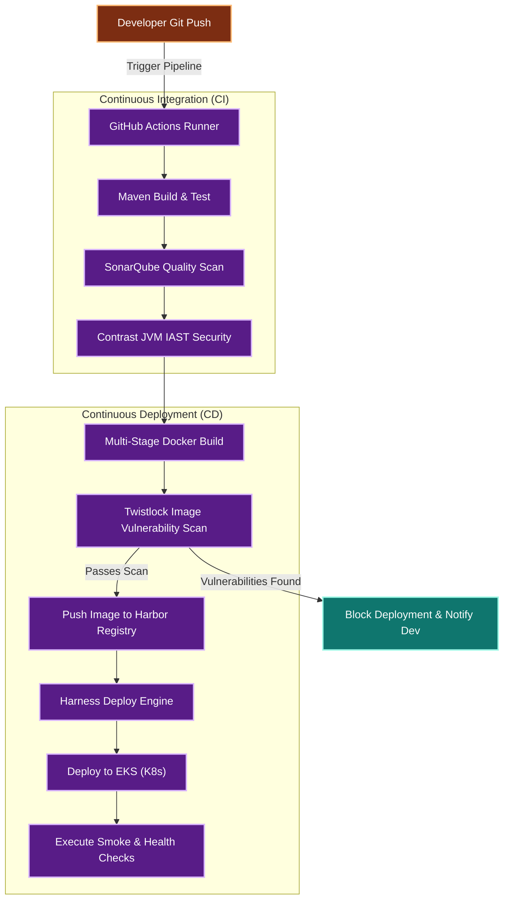

### 4. Interview Questions & Answers

#### Q: How do you handle failed security scans in the deployment pipeline?
**A:** If a vulnerability scanner (like Twistlock or Trivy) detects critical vulnerabilities exceeding the defined threshold (e.g., CVSS score >= 8), the pipeline is configured to fail immediately with exit code 1. This blocks the push to the container registry and prevents deployment to production. Developers are notified of the failed step with a report listing the vulnerable dependency, allowing them to patch it and retrigger the pipeline.

### 5. Key Takeaways
* Use multi-stage Docker builds to reduce image size and improve security.
* Integrate static code analysis (SonarQube) and security scanners (Trivy/Twistlock) to catch vulnerabilities early.
* Set up automated rollbacks in your CD tool (like Harness) triggered by health check failures.

---

## TOPIC 17: DOCKER — CONTAINERIZATION FOR JAVA DEVELOPERS

### 1. Concept Explanation

#### Beginner
Docker packages your application, along with its specific dependencies, libraries, and configurations, into a lightweight, portable container. This ensures that the application runs consistently across local development, staging, and production environments, eliminating the "works on my machine" issue.

Core Concepts:
* **Image:** A read-only template containing the application code and its dependencies (similar to a Java class blueprint).
* **Container:** A running instance of an image (similar to a Java object instance).
* **Registry:** A repository where Docker images are stored and shared (e.g., Docker Hub, Harbor, Amazon ECR).

#### Intermediate
##### Docker Compose
Docker Compose allows you to define and manage multi-container applications (like an API server running alongside database and caching containers) using a single YAML file:

```yaml
version: '3.8'

services:
  policy-service:
    build:
      context: .
      dockerfile: Dockerfile
    ports:
      - "8080:8080"
    environment:
      - SPRING_PROFILES_ACTIVE=docker
      - SPRING_DATASOURCE_URL=jdbc:postgresql://postgres-db:5432/policydb
    depends_on:
      postgres-db:
        condition: service_healthy
    networks:
      - app-network

  postgres-db:
    image: postgres:15-alpine
    environment:
      - POSTGRES_DB=policydb
      - POSTGRES_PASSWORD=secret
    ports:
      - "5432:5432"
    volumes:
      - pgdata:/var/lib/postgresql/data
    healthcheck:
      test: ["CMD-SHELL", "pg_isready -U postgres"]
      interval: 10s
      timeout: 5s
      retries: 5
    networks:
      - app-network

networks:
  app-network:
    driver: bridge

volumes:
  pgdata:
```

#### Advanced
##### Image Optimization Strategies
* **Use JRE instead of JDK:** Run production containers using a lightweight JRE image (like `eclipse-temurin:17-jre-alpine` at ~100 MB) instead of a full JDK image (which can exceed 400 MB).
* **Leverage Layer Caching:** Order the commands in your `Dockerfile` so that rarely changed elements (like dependency downloads) are run before frequently changed elements (like application code compilation).
* **Minimize Layers:** Combine multiple `RUN` commands using `&&` and backslashes to reduce the total number of layers in the final image.

### 2. Java Developer Dockerfile Reference

#### Basic Dockerfile (Legacy/Reference)
```dockerfile
FROM openjdk:17-slim
WORKDIR /app
COPY target/policy-service-1.0.jar app.jar
EXPOSE 8080
ENTRYPOINT ["java", "-jar", "app.jar", "-Xms512m", "-Xmx1024m", "--spring.profiles.active=prod"]
```

### 3. Architecture Diagram

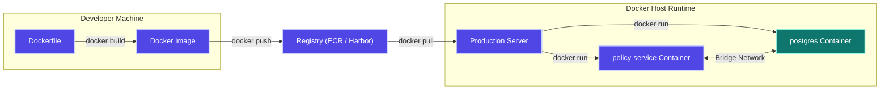

### 4. Interview Questions & Answers

#### Q: How do you pass database credentials to a container securely?
**A:** Do not hardcode credentials in the `Dockerfile` or the image. Instead, inject them at runtime using environment variables (e.g. `docker run -e DB_PASSWORD=secret my-image`), or integrate them with a secrets manager (such as AWS Secrets Manager or Kubernetes Secrets) to inject them directly into the container's memory environment.

#### Q: How do you troubleshoot a container that crashes immediately after starting?
**A:** 
1. Run `docker ps -a` to view the exit code of the stopped container.
2. Run `docker logs <container-id>` to check the application's startup logs and stack traces.
3. Use `docker inspect <container-id>` to check environment variables and command configurations.
4. If needed, run the container overriding the entrypoint to launch a shell for debugging: `docker run -it --entrypoint sh <image-name>`.

### 5. Key Takeaways
* Containers isolate application runtimes, ensuring consistent execution across environments.
* Use multi-stage builds and JRE-specific base images to keep production images small and secure.
* Use Docker Compose to orchestrate multi-container development and testing environments locally.

---

## TOPIC 18: KUBERNETES — CONTAINER ORCHESTRATION

### 1. Concept Explanation

#### Beginner
Kubernetes (K8s) is an open-source platform designed to automate deploying, scaling, and managing containerized applications across a cluster of host nodes.

Core Objects:
* **Pod:** The smallest deployable unit in Kubernetes, hosting one or more containers sharing a network and storage configuration. Pods are ephemeral.
* **Deployment:** Defines the desired state for your application fleet, managing pod replication, rolling updates, and rollbacks.
* **Service:** Provides a stable network IP address and DNS endpoint to route traffic to a dynamic group of pods.
* **ConfigMap / Secret:** Externalizes configuration parameters and sensitive credentials, injecting them into pods without rebuilding container images.

#### Intermediate
##### Spring Boot Kubernetes Deployment Configuration (`deployment.yaml`)
```yaml
apiVersion: apps/v1
kind: Deployment
metadata:
  name: policy-service-deployment
  namespace: production
  labels:
    app: policy-service
spec:
  replicas: 3
  strategy:
    type: RollingUpdate
    rollingUpdate:
      maxSurge: 1
      maxUnavailable: 0
  selector:
    matchLabels:
      app: policy-service
  template:
    metadata:
      labels:
        app: policy-service
    spec:
      containers:
        - name: policy-service
          image: harbor.company.com/apps/policy-service:v2
          ports:
            - containerPort: 8080
          resources:
            requests:
              cpu: "250m"
              memory: "512Mi"
            limits:
              cpu: "500m"
              memory: "1Gi"
          readinessProbe:
            httpGet:
              path: /actuator/health/readiness
              port: 8080
            initialDelaySeconds: 20
            periodSeconds: 10
          livenessProbe:
            httpGet:
              path: /actuator/health/liveness
              port: 8080
            initialDelaySeconds: 40
            periodSeconds: 20
```

#### Advanced
##### Kubernetes Architecture
Kubernetes splits responsibilities between the **Control Plane** (orchestration management) and **Worker Nodes** (hosting execution workloads):

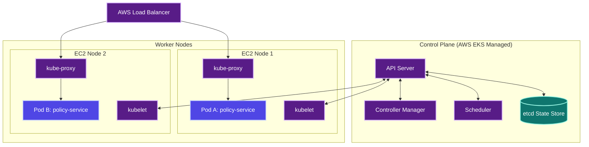

### 2. Interview Questions & Answers

#### Q: What is the difference between a Liveness Probe and a Readiness Probe?
**A:** 
* **Readiness Probes** check if a pod is ready to accept incoming network traffic. If the readiness probe fails, Kubernetes stops routing traffic to the pod via the Service, but leaves the pod running.
* **Liveness Probes** check if the application inside the pod is still running healthily. If the liveness probe fails (indicating a deadlock or crash), Kubernetes terminates the pod and launches a new one.

#### Q: How do you troubleshoot a pod stuck in `CrashLoopBackOff`?
**A:** 
1. Run `kubectl get pods` to identify the crashing pod.
2. Run `kubectl describe pod <pod-name>` to check the events history for OOM (Out Of Memory) flags or exit codes.
3. Check the application logs using `kubectl logs <pod-name>`.
4. If the pod crashed immediately, inspect the logs of the previous crashed instance: `kubectl logs <pod-name> --previous`.
5. Check if dependency configurations, database URLs, or secret values are missing or misconfigured in the deployment file.

### 3. Key Takeaways
* Pods are ephemeral; use Services to provide stable network entry points.
* Set resource requests and limits to ensure fair sharing of compute capacity across the cluster.
* Use readiness and liveness probes to monitor application health and prevent routing traffic to unhealthy containers.

---

## TOPIC 19: SECURITY — SONARQUBE, TWISTLOCK, CONTRAST

### 1. Concept Explanation

#### Beginner
Integrating security tooling directly into the CI/CD pipeline (known as **Shift Left Security**) allows you to detect code quality issues and vulnerabilities before the code is deployed.

Core Tooling:
* **SonarQube (SAST):** Performs static application security testing, scanning source code without executing it to detect bugs, code smells, duplicate code, and potential vulnerabilities.
* **Twistlock / Prisma Cloud (SCA & Container Security):** Scans built container images for known vulnerabilities in OS packages, libraries, and runtime dependencies.
* **Contrast Security (IAST/RASP):** Performs interactive application security testing using a security agent running inside the JVM. It monitors execution flows during tests to detect runtime vulnerabilities (like SQL injection or data exposure).

#### Intermediate
##### SonarQube Quality Gates
To prevent bad code from merging, define a quality gate that must pass in the CI pipeline:
* Code coverage must be greater than or equal to 80%.
* Zero new critical or blocker bugs allowed.
* Code duplication rate must be below 3%.
* Security rating must be 'A'.

#### Advanced
##### SAST vs. DAST vs. IAST
| Feature | SAST (SonarQube) | DAST (OWASP ZAP) | IAST (Contrast Security) |
| :--- | :--- | :--- | :--- |
| **Method** | Scans source code | Attacks running application externally | Monitors runtime JVM execution internally |
| **Pipeline Stage** | Build time | Post-deployment testing | During integration tests |
| **Accuracy** | High false positives (cannot verify if code is reachable) | Medium false positives (black box testing) | High accuracy (traces actual execution paths) |
| **Required State**| Source code files | Running application | Running application with test suites |

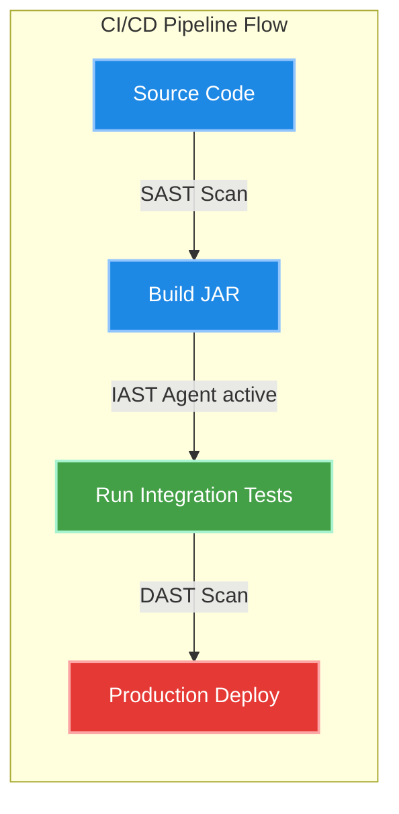

### 2. Interview Questions & Answers

#### Q: How does Contrast Security (IAST) differ from traditional static analysis (SAST)?
**A:** Static analysis (SAST) scans code line-by-line without executing it, checking for syntax patterns that suggest vulnerabilities, which can result in false positives. Contrast Security (IAST) runs inside the JVM using bytecode instrumentation. It monitors data flows in real-time during integration tests, confirming if a vulnerable code path is actually executed and exploitable, resulting in much higher accuracy.

### 3. Key Takeaways
* Static analysis (SAST) runs early on source code files; Dynamic analysis (DAST) tests running applications; Interactive analysis (IAST) uses agent instrumentation inside the runtime.
* Enforce automated quality gates in the build pipeline to reject code that fails quality or coverage targets.
* Twistlock image scanning blocks deployments of container images containing critical CVEs.

---

## TOPIC 20: DEPLOYMENT STRATEGIES

### 1. Concept Explanation

#### Beginner
Deployment strategies define how new versions of an application are rolled out to production while minimizing downtime and testing changes safely.

Common Strategies:
* **Blue-Green:** Two identical production environments. Traffic is switched instantly from one to the other.
* **Canary:** A new version is deployed to a small subset of servers (e.g. 5% of traffic) to test stability before rolling it out to the entire fleet.
* **Rolling Update:** Instances are replaced incrementally one by one, keeping overall capacity stable during the rollout.

#### Intermediate
##### Comparison of Deployment Strategies
| Feature | Blue-Green | Canary | Rolling Update |
| :--- | :--- | :--- | :--- |
| **Infrastructure Cost** | 2x (requires running two full environments during rollout) | 1.1x (requires minor extra capacity) | 1x (uses existing capacity) |
| **Rollback Speed** | Instant (switch load balancer back) | Fast (terminate canary instances) | Slow (incrementally rollback instances) |
| **Real User Testing** | No (pre-testing is done in isolation) | Yes (canary receives real production traffic) | Yes (general users receive traffic) |
| **Database Migrations**| Difficult (both versions must share or sync database schemas) | Difficult (database must support both application versions) | Medium |

#### Advanced
##### Deployment Strategy Routing Diagrams

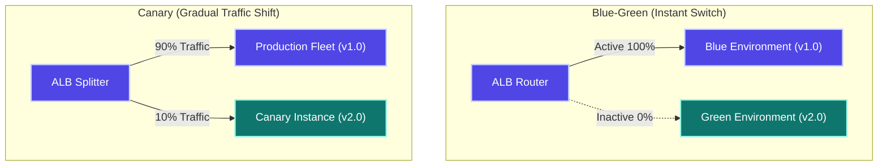

### 2. Interview Questions & Answers

#### Q: How do you implement Canary deployments using Route 53 or an ALB?
**A:** 
* **Using Route 53:** Create two DNS records pointing to your active load balancer (v1.0) and new load balancer (v2.0). Configure a **Weighted Routing Policy**, assigning weight 90 to v1.0 and weight 10 to v2.0. Route 53 will resolve requests accordingly, sending 10% of users to the new version.
* **Using an ALB:** Define a target group for each application version. Configure the listener rule to route traffic across the target groups using weights (e.g. 90% to Target Group A, 10% to Target Group B).

### 3. Key Takeaways
* Blue-Green deployments provide safe, instant rollbacks, but double your compute costs during the rollout.
* Canary deployments allow you to test new features on a small percentage of real production traffic, minimizing the blast radius of errors.
* Database changes must be backward compatible to support both old and new application versions running simultaneously during a deployment.

---

## TOPIC 21: MONITORING & OBSERVABILITY

### 1. Concept Explanation

#### Beginner
Observability allows you to monitor application health and troubleshoot issues using three primary signals:
* **Metrics:** Numeric aggregates showing system resource usage (e.g., memory usage, requests per second).
* **Logs:** Text records of application events and errors.
* **Traces:** Traces following a single request as it travels through a distributed microservices network.

#### Intermediate
##### ELK Stack Logging Pipeline
Logs flow from applications through parsing and indexing engines before becoming queryable:
1. **Spring Boot App:** Writes structured log events (preferably in JSON format).
2. **Logstash:** Gathers, filters, parses, and enriches the log entries.
3. **Elasticsearch:** A search index database that stores and indexes log messages.
4. **Kibana:** A web interface used to search logs, build dashboards, and set alerts.

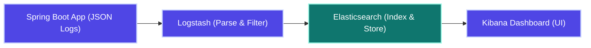

##### Spring Boot Logback JSON Encoder Configuration (`logback-spring.xml`)
Configure your application to write structured JSON logs to standard output, making ingestion by Elasticsearch or Splunk straightforward:
```xml
<configuration>
    <appender name="JSON_CONSOLE" class="ch.qos.logback.core.ConsoleAppender">
        <encoder class="net.logstash.logback.encoder.LoggingEventCompositeJsonEncoder">
            <providers>
                <timestamp/>
                <loggerName/>
                <logLevel/>
                <threadName/>
                <message/>
                <stackTrace/>
                <mdc/> <!-- Injects MDC keys like traceId automatically -->
            </providers>
        </encoder>
    </appender>
    
    <root level="INFO">
        <appender-ref ref="JSON_CONSOLE"/>
    </root>
</configuration>
```

#### Advanced
##### Custom Micrometer Prometheus Registry
Configure Spring Boot Actuator to expose metrics in a Prometheus-compatible format:
```yaml
# application.yml
management:
  endpoints:
    web:
      exposure:
        include: health,info,prometheus
  metrics:
    export:
      prometheus:
        enabled: true
```

Use Micrometer's registry to record custom business metrics (such as completed orders or processing times) in your Java code:
```java
package com.company.metrics;

import io.micrometer.core.instrument.Counter;
import io.micrometer.core.instrument.MeterRegistry;
import io.micrometer.core.instrument.Timer;
import org.springframework.stereotype.Component;

@Component
public class BusinessMetrics {

    private final Counter claimCounter;
    private final Timer processingTimer;

    public BusinessMetrics(MeterRegistry registry) {
        this.claimCounter = Counter.builder("policy.claims.processed")
                .description("Total policy claims processed successfully")
                .tag("tier", "premium")
                .register(registry);

        this.processingTimer = Timer.builder("policy.claims.processing.time")
                .description("Time taken to evaluate policy claims")
                .register(registry);
    }

    public void incrementClaims() {
        this.claimCounter.increment();
    }

    public Timer getTimer() {
        return this.processingTimer;
    }
}
```

### 2. Interview Questions & Answers

#### Q: How do you correlate log messages across a distributed microservices architecture?
**A:** Use a **Correlation ID (Trace ID)** pattern:
1. The API Gateway intercepts incoming requests. If no `X-Trace-Id` header is found, it generates a unique UUID.
2. The gateway passes this UUID as an HTTP header to all downstream microservices.
3. Each service intercepts the header and injects it into its logging **Mapped Diagnostic Context (MDC)**.
4. When logging events occur, the log appender prints the `traceId` alongside the log message.
5. In Kibana or Splunk, querying `traceId = "abc-123"` displays a chronological timeline of logs generated by all services involved in processing that request.

### 3. Key Takeaways
* Structured JSON logging allows centralized log engines (ELK/Splunk) to parse and index log fields automatically.
* Spring Boot Actuator exposes system and custom metrics to Prometheus, which are visualized using Grafana dashboards.
* Use Trace IDs and MDC to track and correlate requests across distributed microservices.

---

## TOPIC 22: COST OPTIMIZATION

### 1. Cost Optimization Strategies

#### EC2 Cost Optimization
* **Purchase RIs or Savings Plans:** Commit to a 1 or 3-year term for constant, baseline production workloads to save up to 72% compared to on-demand pricing.
* **Scale-in During Idle Times:** Set scheduled Auto Scaling policies to shut down development instances outside of business hours (saving up to 50%).
* **Right-Size Instances:** Monitor CPU and memory usage using CloudWatch. If utilization is consistently below 20%, downsize the instance family.
* **Adopt Graviton (ARM) Instances:** Move workloads to AWS Graviton processors (`m6g` families) which offer up to 40% better price-performance than Intel processors.

#### S3 Cost Optimization
* **Enable Intelligent-Tiering:** Automatically transitions files with unknown access patterns to cheaper storage tiers, saving money without retrieval penalties.
* **Set Lifecycle Rules:** Archive cold files to Glacier or delete temporary files automatically after a defined period.
* **Clean Up Incomplete Multipart Uploads:** Configure lifecycle rules to delete incomplete uploads, which otherwise incur storage charges indefinitely.

#### RDS Cost Optimization
* **Reserved DB Instances:** Purchase RIs for production database instances.
* **Avoid Multi-AZ for Non-Production:** Disable Multi-AZ for development and testing environments, reducing database instance costs by 50%.
* **Aurora Serverless v2:** Use Serverless v2 for test environments with sporadic usage, allowing the compute capacity to scale down to 0.5 ACUs when idle.

#### General Optimization
* **Tag All Resources:** Enforce a resource tagging policy (e.g. `Owner`, `Environment`, `CostCenter`) to identify and clean up unallocated or orphaned resources.
* **Run Compute Optimizer:** Use AWS Compute Optimizer's machine learning recommendations to identify over-provisioned resources.
* **Clean Up Idle Resources:** Delete unattached EBS volumes, unused Elastic Load Balancers, and idle Elastic IP addresses.

### 2. Key Takeaways
* Match workloads to the appropriate billing model: Reserved for steady baselines, Spot for flexible tasks, and On-Demand for variable workloads.
* Enable S3 Intelligent-Tiering and lifecycle rules to automate cold data archival.
* Disable Multi-AZ in non-production environments and clean up unattached EBS volumes to reduce waste.

---

## TOPIC 23: REAL-WORLD PRODUCTION SCENARIOS

### SCENARIO 1: Database Connection Pool Exhaustion

#### Symptom
A production Spring Boot application deployed on ECS starts throwing `ConnectionPoolTimeoutException` errors. Users receive HTTP 503 Service Unavailable errors.

#### Diagnosis
1. Check RDS CloudWatch metrics: `DatabaseConnections` shows a vertical line hitting the database engine's maximum allowed connections limit.
2. Check Spring Boot log files: Logs show HikariCP threads waiting to acquire a connection: `connection is not available, request timed out after 30000ms`.
3. Check code changes: A recently deployed feature contains a data export endpoint that opens a connection but fails to release it.

#### Buggy Code (Leaking Connections)
```java
@GetMapping("/export")
public ResponseEntity<List<Policy>> exportData() throws SQLException {
    // Manually opens connection bypassing connection pool lifecycle management
    Connection conn = dataSource.getConnection();
    Statement stmt = conn.createStatement();
    ResultSet rs = stmt.executeQuery("SELECT * FROM policy");
    List<Policy> results = mapResults(rs);
    // Connection is not closed! It leaks and remains open indefinitely.
    return ResponseEntity.ok(results);
}
```

#### Refactored Code (Fixed)
Use Java's **try-with-resources** statement or Spring's `@Transactional` annotation to ensure connections are closed automatically when the execution scope exits:
```java
@GetMapping("/export")
@Transactional(readOnly = true) // Spring manages connection opening and closing automatically
public ResponseEntity<List<Policy>> exportData() {
    List<Policy> results = policyRepository.findAll();
    return ResponseEntity.ok(results);
}
```

#### Recovery Steps
1. Restart the application instances on ECS to force-close leaked connections.
2. Scale up the application containers incrementally while monitoring the database connection metrics.

---

### SCENARIO 2: Out of Memory (OOM) Crash in a Kubernetes Pod

#### Symptom
A Spring Boot application running inside a Kubernetes cluster keeps crashing and restarting. Running `kubectl get pods` shows a status of `CrashLoopBackOff`.

#### Diagnosis
1. Run `kubectl describe pod <pod-name>` to check the termination history:
```text
Last State: Terminated
Reason: OOMKilled
Exit Code: 137
```
This indicates the container process was terminated by the Linux Out-Of-Memory (OOM) killer because it exceeded its container memory limit.
2. Monitor memory usage trends in Grafana: memory usage climbs steadily until it hits the container limit of 1 GB, triggering the crash.
3. Root cause: The application code caches data indefinitely using a static map without an eviction policy, causing a memory leak.

#### Buggy Cache Configuration
```java
@Component
public class CacheService {
    // Static map grows indefinitely without limits, causing a memory leak
    private final Map<String, UserProfile> userCache = new ConcurrentHashMap<>();

    public void cacheUser(UserProfile user) {
        userCache.put(user.getId(), user);
    }
}
```

#### Refactored Code (Fixed)
Configure a cache manager (like Caffeine) with maximum size and time-to-live (TTL) limits:
```java
@Configuration
@EnableCaching
public class CacheConfig {

    @Bean
    public CacheManager cacheManager() {
        CaffeineCacheManager cacheManager = new CaffeineCacheManager();
        cacheManager.setCaffeine(Caffeine.newBuilder()
                .maximumSize(5000) // Caps total cache objects to 5,000 entries
                .expireAfterWrite(15, TimeUnit.MINUTES) // Sets 15-minute TTL eviction
                .recordStats());
        return cacheManager;
    }
}
```

#### Kubernetes Resource Definition Alignment
Configure JVM parameters to respect container memory limits, preventing the heap memory from exceeding the container's physical limit:
```yaml
# deployment.yaml
resources:
  requests:
    memory: "512Mi"
  limits:
    memory: "1Gi" # Container is hard-capped at 1 GB
env:
  - name: JAVA_TOOL_OPTIONS
    value: "-XX:MaxRAMPercentage=75.0 -XX:+UseContainerSupport"
    # Max Heap = 75% of container limit (768 MB), leaving 256 MB for JVM metaspace and system threads.
```

---

### SCENARIO 3: Slow CI/CD Pipeline Builds

#### Symptom
Software delivery is slowed down because the GitHub Actions build pipeline takes 25 minutes to complete.

#### Diagnosis
* The runner downloads all Maven dependencies from Maven Central on every execution (no caching).
* Single-threaded test executions.
* Container builds do not leverage Docker layer caching.

#### Optimizations Applied
1. **Enable GitHub Actions Caching:** Cache the local Maven repository:
```yaml
- name: Cache Maven packages
  uses: actions/cache@v4
  with:
    path: ~/.m2/repository
    key: ${{ runner.os }}-maven-${{ hashFiles('**/pom.xml') }}
    restore-keys: |
      ${{ runner.os }}-maven-
```
2. **Run Tests in Parallel:** Configure Maven Surefire to run tests concurrently:
```xml
<plugin>
    <groupId>org.apache.maven.plugins</groupId>
    <artifactId>maven-surefire-plugin</artifactId>
    <configuration>
        <parallel>methods</parallel>
        <threadCount>4</threadCount>
    </configuration>
</plugin>
```
3. **Multi-Stage Docker caching:** Structure the Dockerfile layers so that dependencies are cached unless `pom.xml` changes.

#### Results
Build execution time reduced from 25 minutes to under 5 minutes.

---

### SCENARIO 4: Auto Scaling Fails During Traffic Spikes

#### Symptom
During a marketing promotion, application response times increase to 10 seconds, but the Auto Scaling Group does not scale out.

#### Diagnosis
* The ASG scale-out policy is configured to trigger when average CPU utilization exceeds 70%.
* The bottleneck is memory leak pressure and network I/O blockages, while CPU utilization remains below 20%.

#### Optimization Applied
Configure scaling based on **ALB Request Count Per Target** or **SQS Queue Depth**, which act as better indicators of traffic pressure for I/O-bound applications:
```bash
aws autoscaling put-scaling-policy \
  --policy-name request-count-scaling \
  --auto-scaling-group-name prod-asg \
  --policy-type TargetTrackingScaling \
  --target-tracking-configuration '{
    "TargetValue": 1000.0,
    "PredefinedMetricSpecification": {
      "PredefinedMetricType": "ALBRequestCountPerTarget",
      "ResourceLabel": "app/prod-alb/12345/targetgroup/prod-targets/54321"
    }
  }'
```

---

### 5. Key Takeaways
* Clean up database connections and resource leaks inside a `try-with-resources` block or use transactional annotations to prevent pool exhaustion.
* Always configure JVM heap limits (`MaxRAMPercentage`) to fit within container limits to prevent OS termination crashes (Exit Code 137).
* Align your scaling policies with your application's actual resource bottlenecks (e.g., Request Count or Queue Depth instead of just CPU).

---

## TOPIC 24: COMPARISON TABLES

### TABLE 1: Compute Options Comparison
| Feature | AWS EC2 | AWS Lambda | AWS ECS (Fargate) |
| :--- | :--- | :--- | :--- |
| **Virtualization Level** | Machine Level (VM) | Function Level | Container Level |
| **Management Effort** | High (you manage OS patches) | Zero (fully managed serverless) | Low (managed container runtime) |
| **Scaling Delay** | Minutes (boots new OS instance) | Milliseconds | Seconds |
| **Execution Limit** | None | 15 Minutes | None |
| **Cost Model** | Hourly rate (billed for idle time) | Billed per execution duration | Billed per container size and run duration |
| **State Support** | Stateful or Stateless | Stateless only | Stateless (can mount EFS for state) |

### TABLE 2: Relational Databases vs. NoSQL
| Feature | Amazon RDS | Amazon Aurora | Amazon DynamoDB |
| :--- | :--- | :--- | :--- |
| **Storage Type** | SQL Relational | SQL Relational | NoSQL Key-Value / Document |
| **Scaling** | Vertical scale-up | Auto-scaling storage up to 128 TB | Infinite horizontal auto-scaling |
| **Replication** | Multi-AZ (1 standby copy) | Replicates 6 ways across 3 AZs | Replicates across multiple AZs (supports Global Tables) |
| **Throughput limits** | Constrained by instance size | Capped by cluster memory/CPU | Infinite (scales read/write capacity units) |
| **Failover time** | 60–120 seconds | Under 30 seconds | Milliseconds (handled transparently) |

### TABLE 3: Messaging Services Comparison
| Feature | Amazon SQS | Amazon SNS | Amazon EventBridge |
| :--- | :--- | :--- | :--- |
| **Messaging Pattern** | Queue (Point-to-Point) | Pub/Sub (Publish/Subscribe) | Event Bus (Router) |
| **Delivery Model** | Pull (consumers poll the queue) | Push (SNS sends message to sub) | Push (routes events to targets) |
| **Message Ordering** | FIFO queues support strict order | Best-effort order | No order guarantees |
| **Data Retention** | Up to 14 days | No retention (pushed instantly) | Up to 24 hours (using archive features) |
| **Rule Filtering** | None | Simple message attributes | Advanced JSON schema filtering |

### TABLE 4: Infrastructure as Code Tooling
| Feature | AWS CloudFormation | HashiCorp Terraform | AWS CDK |
| :--- | :--- | :--- | :--- |
| **Language** | YAML / JSON | HCL | TypeScript, Java, Python, Go |
| **Scope** | AWS resources only | Multi-Cloud | AWS resources only |
| **State Location** | Managed by AWS | State file stored by user | Synthesized to CloudFormation templates |
| **Rollback Capability** | Automatically rolls back on failure | Leaves state partially applied | Automatically rolls back via CloudFormation |
| **Code Completion** | Basic | Good | Native IDE validation and code compilation |

---

## TOPIC 25: INTERVIEW QUICK REFERENCE

### Q1: Explain the AWS Shared Responsibility Model.
**A:** AWS manages security **of** the cloud (guarding hardware, hypervisors, and data centers). The customer manages security **in** the cloud (securing application code, IAM configuration, database schema files, operating systems, and network paths).

### Q2: What is the difference between EBS, S3, and EFS?
**A:**
* **EBS** is a persistent block storage volume attached to a single EC2 instance, restricted to a single Availability Zone.
* **S3** is an object storage service accessible globally via HTTP APIs.
* **EFS** is a shared network file system that can be mounted by multiple EC2 instances concurrently across availability zones.

### Q3: How do you secure an S3 bucket in production?
**A:** Enable Block Public Access, apply a bucket policy allowing access only to specific IAM roles, enable default KMS encryption, enable versioning to prevent accidental deletions, and use VPC Endpoints for private data transfers.

### Q4: Explain the difference between Security Groups and Network ACLs (NACLs).
**A:** Security groups are stateful and act at the instance level. NACLs are stateless, act at the subnet level, and evaluate rules sequentially.

### Q5: How does an EC2 Auto Scaling Group (ASG) work?
**A:** The ASG monitors CPU, memory, or request metrics via CloudWatch. When a metric exceeds the defined threshold, the ASG launches additional instances from a launch template and registers them with the ALB. When traffic decreases, it terminates idle instances.

### Q6: What is an IAM Role, and when should you use it?
**A:** An IAM Role grants temporary security credentials to trusted services or users. Use it to allow applications running on EC2 or Lambda to access AWS resources securely without hardcoding credential keys.

### Q7: How does RDS Multi-AZ replication work?
**A:** Writes to the primary database instance are replicated synchronously to a standby instance in a different AZ. If the primary AZ suffers an outage, RDS automatically updates the DNS record to failover to the standby instance.

### Q8: What is the difference between Horizontal and Vertical Scaling?
**A:** Horizontal scaling (scaling out) adds more instances to your fleet. Vertical scaling (scaling up) upgrades an instance to a larger size (more CPU/memory). Horizontal scaling is preferred because it eliminates single points of failure.

### Q9: Explain the difference between Blue-Green and Canary deployments.
**A:** Blue-Green deploys the new version to an identical environment and switches 100% of traffic over instantly. Canary deploys the new version to a small subset of servers (e.g. 10% of traffic) to test stability before rolling it out to the rest of the fleet.

### Q10: How do you manage database credentials securely in a Spring Boot application on AWS?
**A:** Store credentials in **AWS Secrets Manager**. Use the Spring Cloud AWS Secrets Manager Starter to import the database properties at application startup:
`spring.config.import=aws-secretsmanager:/secrets/prod-db-credentials`
Do not store credentials in your code repository or environment files.

### Q11: What is VPC Peering, and what is its main limitation?
**A:** VPC Peering connects two VPCs using private IPs. Its main limitation is that routing is non-transitive: if VPC A is peered with VPC B, and B is peered with C, VPC A cannot communicate with VPC C without a direct peer link.

### Q12: How do you troubleshoot a Lambda function that times out?
**A:** Check CloudWatch Logs to find the last statement executed before the timeout. Check connection pool limits and verify if the function is blocked waiting for database connections or external API responses. Adjust the execution timeout or allocate more memory if necessary.

### Q13: What is Amazon CloudFront, and how does it optimize web requests?
**A:** CloudFront is a Content Delivery Network (CDN) that caches static assets (images, CSS, JS) at edge locations globally, reducing latency by serving requests closer to the user.

### Q14: How do you implement caching in a Spring Boot application on AWS?
**A:** Deploy **Amazon ElastiCache (Redis)** and integrate it using Spring Boot Starter Data Redis:
```yaml
spring:
  cache:
    type: redis
  redis:
    host: prod-cache.xyz.cache.amazonaws.com
```
Use the `@Cacheable` annotation on service methods to cache database query results.

### Q15: How do you deploy microservices on AWS EKS?
**A:** Package your microservice into a Docker container and push the image to Amazon ECR. Write Kubernetes manifest files (`deployment.yaml` and `service.yaml`), configure liveness and readiness probes, and deploy them using `kubectl`. Route external traffic to the pods using an AWS Load Balancer Controller.

### Q16: How do you scale an EBS volume without downtime?
**A:** Modify the volume size directly using the AWS Console or CLI:
`aws ec2 modify-volume --volume-id vol-xxx --size 100`
Once updated, run OS commands (like `growpart` and `resize2fs` on Linux) to extend the file system partition without restarting the instance.

### Q17: Why should you avoid logging to files inside a container?
**A:** Containers are ephemeral; any files written inside a container are lost when the container is stopped or restarted. Instead, write logs to standard output (`stdout`) and standard error (`stderr`), allowing log collectors (like FluentBit or CloudWatch agents) to capture and forward them to a centralized store.

### Q18: What is AWS X-Ray?
**A:** AWS X-Ray is a distributed tracing service that maps request flows across microservices, databases, and queues, helping you identify performance bottlenecks and track down failures in distributed architectures.

### Q19: When should you use Spot Instances?
**A:** Use Spot Instances for stateless, fault-tolerant, or batch-processing workloads (such as CI/CD runners or background workers) that can handle interruptions with a 2-minute warning.

### Q20: Your Spring Boot application's response time suddenly spikes from 200ms to 5s. How do you diagnose it?
**A:** 
1. Check ALB metrics in CloudWatch: verify if `TargetResponseTime` spiked and check for a corresponding spike in HTTP 5XX errors.
2. Check database metrics: check RDS CPU utilization, active connections, and read/write latency.
3. Check application logs in Kibana or Splunk to search for error spikes or long-running database queries.
4. Run thread dumps (`jstack`) on container instances to identify thread contention or blocked states.

---

## TOPIC 26: EFS — ELASTIC FILE SYSTEM

### 1. Concept Explanation

#### Beginner
Elastic File System (EFS) provides a shared network file system (NFSv4) that can be mounted concurrently by multiple EC2 instances, containers, or on-premises servers across multiple availability zones.

EFS vs. EBS Storage Model:
* **EFS:** Mounted concurrently by multiple EC2 instances across AZs (shared file system).
* **EBS:** Attached to a single EC2 instance within a single AZ (dedicated block storage).

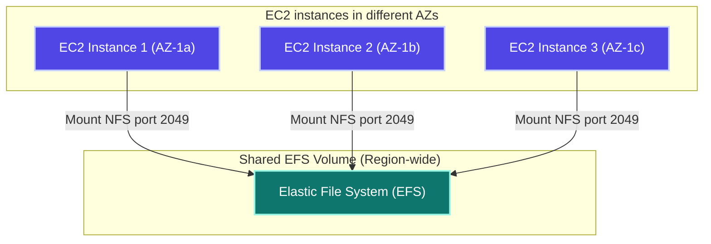

#### Intermediate
##### EFS vs. EBS vs. S3 Comparison
| Feature | EBS | EFS | S3 |
| :--- | :--- | :--- | :--- |
| **Access Pattern** | Single instance (per AZ) | Multiple instances (Multi-AZ) | Globally accessible via HTTP APIs |
| **Protocol** | Block Storage | NFSv4 File System | REST Object Storage |
| **Capacity Scaling** | Fixed size (manual resizing) | Elastic auto-scaling | Infinite auto-scaling |
| **Average Cost** | ~$0.10 per GB-month | ~$0.30 per GB-month | ~$0.023 per GB-month |
| **Primary Use Case** | OS root disks, relational database files | Shared media directories, config folders | Data backups, static assets, data lakes |

* **Performance Modes:**
  * *General Purpose:* Optimized for low latency (best for web servers, content management).
  * *Max I/O:* Optimized for high scale and aggregate throughput (best for big data analysis, media processing).
* **Throughput Modes:**
  * *Elastic:* Automatically scales throughput to match current traffic workloads (default).
  * *Provisioned:* Sets a fixed throughput capacity regardless of storage size.

#### Advanced
* **EFS Lifecycle Management:** Automatically moves infrequently accessed files to the EFS Infrequent Access (EFS-IA) tier after a defined period (e.g. 30 days), reducing storage costs by up to 92%.
* **Security Rules:** Configure Security Groups to restrict traffic to the EFS mount target interfaces, allowing inbound connections on TCP port 2049 (NFS) only from your application servers' security groups.

### 2. EFS Operations Reference

#### Mount EFS on EC2 Linux
```bash
# Install EFS helper utilities
sudo yum install -y amazon-efs-utils

# Create the target mount folder
sudo mkdir -p /mnt/shared-storage

# Mount EFS securely using TLS encryption
sudo mount -t efs -o tls fs-0abc123456789def0:/ /mnt/shared-storage

# Configure /etc/fstab to persist the mount across system reboots
echo 'fs-0abc123456789def0:/ /mnt/shared-storage efs defaults,tls,_netdev 0 0' | sudo tee -a /etc/fstab
```

### 3. Interview Questions & Answers

#### Q: When would you choose EFS over EBS?
**A:** Choose **EFS** when you have multiple compute nodes (EC2 or Fargate containers) that need concurrent read/write access to a shared directory (such as a shared directory for uploads, user home directories, or shared application configurations). Choose **EBS** for single-instance, high-performance database workloads (such as hosting the physical database files of a MySQL or PostgreSQL server).

### 4. Best Practices
* Enable EFS Lifecycle Management to transition old files to the EFS-IA tier and save costs.
* Restrict inbound traffic to the EFS security group to port 2049, allowing access only from the application security group.
* Enable encryption at rest and in transit when mounting the file system.

---

## TOPIC 27: ELASTIC BEANSTALK — PLATFORM AS A SERVICE

### 1. Concept Explanation

#### Beginner
Elastic Beanstalk is a Platform as a Service (PaaS) offering. You upload your application code (JAR, WAR, or ZIP files), and Beanstalk automatically provisions and manages the load balancers, auto scaling groups, EC2 instances, and databases, allowing you to deploy applications without managing infrastructure.

Supported Runtimes:
* Java (Corretto configurations for Spring Boot), Node.js, Python, PHP, Ruby, Go, Docker, and .NET.

#### Intermediate
##### Beanstalk Environment Configuration (`.ebextensions/jvm.config`)
You can customize the environment configuration by adding configuration files in the `.ebextensions` directory at the root of your application package:
```yaml
option_settings:
  aws:elasticbeanstalk:application:environment:
    SPRING_PROFILES_ACTIVE: production
    SERVER_PORT: 5000
  aws:autoscaling:asg:
    MinSize: 2
    MaxSize: 8
  aws:autoscaling:launchconfiguration:
    InstanceType: t3.medium
```

* **Default Port for Java Platform:** Beanstalk's built-in Nginx reverse proxy routes incoming public requests to port 5000 by default. Set `server.port=5000` in your Spring Boot application properties, or set the `SERVER_PORT` environment variable to `5000`.

#### Advanced
##### Deployment Policies
* **All at Once:** Deploys the new version to all instances simultaneously. This is the fastest method but incurs application downtime.
* **Rolling:** Deploys the new version to instances in batches, keeping the remaining instances active to prevent downtime.
* **Rolling with Additional Batch:** Launches a new batch of instances to deploy the update before stopping old instances, maintaining full application capacity during the rollout.
* **Immutable:** Launches a completely new auto-scaling group with new instances, tests their health, and switches traffic over, terminating the old group if successful.
* **Blue-Green:** Deploys the new version to a separate environment, allows you to verify it, and then swaps the environment URLs (CNAMEs) to route traffic to the new version with zero downtime.

### 2. Interview Questions & Answers

#### Q: How do you choose between deploying on EC2 manually, using Elastic Beanstalk, or using ECS/EKS?
**A:** 
| Option | Control Level | Setup Time | Management Effort | Best For |
| :--- | :--- | :--- | :--- | :--- |
| **EC2 Manual** | Full control | Hours/Days | High | Custom OS configurations, legacy systems |
| **Elastic Beanstalk**| Low (managed) | Minutes | Low | Quick prototypes, standard web apps |
| **ECS / EKS** | High control | Hours | Medium | Microservices, containerized architectures |

Deploy on **Elastic Beanstalk** for simple web applications to minimize infrastructure management. Deploy on **ECS/EKS** for complex microservices architectures requiring container orchestration.

### 3. Key Takeaways
* Elastic Beanstalk is a PaaS service that provisions and manages infrastructure automatically based on your uploaded code.
* Use `.ebextensions` configuration files to customize environment parameters and scaling properties.
* Set your Spring Boot application port to 5000 to match Beanstalk's Nginx proxy configuration.

---

## TOPIC 28: AWS CLI — COMMAND LINE INTERFACE

### 1. Concept Explanation

#### Beginner
The AWS Command Line Interface (CLI) is an open-source tool that allows you to manage and automate AWS services directly from your terminal using commands, bypassing the AWS Console.

Configuring the CLI:
`aws configure`
This command prompts you to input your Access Key ID, Secret Access Key, Default Region (e.g. `ap-south-1`), and default output format (`json`).

#### Intermediate
##### Essential CLI Commands
* **EC2:**
```bash
# List all running EC2 instances
aws ec2 describe-instances --filters "Name=instance-state-name,Values=running"

# Start a stopped instance
aws ec2 start-instances --instance-ids i-0123456789abcdef0
```
* **S3:**
```bash
# Upload a file to a bucket
aws s3 cp document.pdf s3://company-reports-bucket/reports/

# Sync a local directory to a bucket
aws s3 sync ./build s3://static-assets-bucket/ --delete
```
* **IAM:**
```bash
# List all IAM users
aws iam list-users
```
* **RDS:**
```bash
# Create a manual database snapshot
aws rds create-db-snapshot --db-instance-identifier prod-db --db-snapshot-identifier prod-db-backup-2026
```

#### Advanced
##### Named Profiles
To manage multiple AWS accounts (e.g., development and production), configure **Named Profiles**:
```bash
# Configure profiles
aws configure --profile dev-account
aws configure --profile prod-account

# Execute commands using a specific profile
aws s3 ls --profile prod-account

# Or set the profile for the current terminal session
export AWS_PROFILE=prod-account
```

##### Output Querying (JMESPath)
Filter JSON output directly in the CLI using the `--query` parameter:
```bash
# Retrieve only the InstanceId, State, and Public IP of EC2 instances in a table format
aws ec2 describe-instances \
  --query 'Reservations[*].Instances[*].[InstanceId, State.Name, PublicIpAddress]' \
  --output table
```

### 2. Interview Questions & Answers

#### Q: How do you authorize the AWS CLI inside a CI/CD runner securely?
**A:** Avoid using permanent IAM User access keys in your CI/CD runner. Instead, configure **OIDC (OpenID Connect)** federation. The runner requests a temporary token from AWS IAM by assuming a designated role (e.g., `GitHubActionsWorkflowRole`) for the duration of the deployment step.

#### Q: What is the `--dry-run` flag in the AWS CLI?
**A:** The `--dry-run` flag checks whether you have the necessary permissions to execute a command without actually performing the action. It is useful for validating IAM policies before running potentially disruptive operations. If you have the required permissions, the command returns a `DryRunOperation` error.

### 3. Key Takeaways
* AWS CLI enables command-line management and scripting of AWS resources.
* Use Named Profiles to switch between different AWS accounts and environments.
* Use the `--query` parameter to parse and filter JSON outputs from AWS CLI commands.

---

## TOPIC 29: STATIC WEBSITE HOSTING ON EC2

### 1. Concept Explanation

#### Beginner
A static website consists of pre-built files (HTML, CSS, JavaScript, and images) served directly to the browser without server-side processing (no database connections or dynamic rendering). You can host a static website on an EC2 instance running a web server like Apache (`httpd`).

Core Web Servers:
* **httpd (Apache):** A widely-used web server.
* **Nginx:** A high-performance web server and reverse proxy.
* **Tomcat:** An application server used to execute Java Servlets and render Java Server Pages (JSP). It is not recommended for serving pure static content.

#### Intermediate
##### Hosting a Static Website on EC2 (Step-by-Step)
1. Launch an EC2 instance running Amazon Linux 2.
2. Configure the **Security Group** to allow inbound traffic on port 80 (HTTP) from anywhere (`0.0.0.0/0`).
3. SSH into the instance and install the web server:
```bash
sudo yum update -y
sudo yum install httpd -y
```
4. Start the Apache service and configure it to launch automatically on reboot:
```bash
sudo systemctl start httpd
sudo systemctl enable httpd
```
5. Deploy your static website files to the Apache document root directory (`/var/www/html`):
```bash
cd /var/www/html
echo "<html><body><h1>Welcome to My EC2 Hosted Website</h1></body></html>" | sudo tee index.html
```
6. Access the website in your browser using the EC2 instance's public IP address: `http://<EC2-Public-IP>`.

#### Advanced
##### Production Web Hosting Architectures
While you can host a static website on EC2, modern production architectures prefer serverless setups to optimize cost and performance:

| Hosting Option | Compute Management | Scalability | Cost Model |
| :--- | :--- | :--- | :--- |
| **EC2 + httpd** | Manual OS maintenance and patching | Requires configuring ALBs and ASGs | Billed hourly based on instance size |
| **Amazon S3 + CloudFront**| Serverless (no OS to maintain) | Auto-scales to handle global traffic | Billed per GB stored and transferred (very cheap) |

For static sites, hosting on **S3 and CloudFront** is the recommended best practice, providing global CDN caching, automatic SSL termination, and low storage costs. For dynamic Java applications, deploy on **EC2, ECS, or EKS**.

### 2. Interview Questions & Answers

#### Q: You deployed a website on EC2, but typing the public IP in a browser returns a connection timeout. What do you troubleshoot?
**A:** 
1. Check the EC2 instance's **Security Group** to verify that inbound traffic on TCP port 80 (HTTP) is allowed from `0.0.0.0/0`.
2. Verify that the web server service is running on the instance: `sudo systemctl status httpd`.
3. Check the VPC's **Network ACL (NACL)** to verify that inbound and outbound traffic on port 80 is not blocked.
4. Verify that you are accessing the IP using `http://` instead of `https://`, as SSL certificates (port 443) are not configured by default.

### 3. Key Takeaways
* Serve static website files from the default web root directory `/var/www/html` when using Apache (`httpd`).
* For production static websites, use S3 static hosting combined with CloudFront instead of hosting on EC2 to reduce costs and management overhead.
* Always check security group rules first if you experience connection timeouts when accessing public endpoints.

---

## TROUBLESHOOTING QUICK REFERENCE

| Problem | Likely Cause | Resolution |
| :--- | :--- | :--- |
| **HTTP 502 Bad Gateway** | The ALB cannot connect to the backend application, or the container health check is failing. | Inspect the application logs inside the EC2 instance or Kubernetes pod to diagnose startup crashes. |
| **HTTP 503 Service Unavailable**| The ALB target group has no healthy instances registered, or the database connection pool is exhausted. | Verify that instances are passing health checks, and check active database connection limits. |
| **HTTP 504 Gateway Timeout** | The backend application took too long to respond, indicating a slow database query or downstream API timeout. | Optimize slow-running database queries, add read replicas, or configure appropriate timeouts for external API calls. |
| **Pod stuck in `CrashLoopBackOff`**| The application crashed during startup (due to database connection failures, missing environment variables, or OOM errors). | Run `kubectl logs <pod-name> --previous` to inspect the logs of the crashed container. |
| **EC2 instance SSH Connection Timeout**| Inbound SSH traffic on port 22 is blocked by the security group or network ACL. | Update the security group rules to allow inbound SSH access from your IP address. |
| **S3 Upload returns 403 Forbidden** | The IAM role, policy, or bucket policy does not grant the required `s3:PutObject` permission. | Verify and update the IAM policies attached to the service role. |
| **Database connection refused** | The database security group does not allow traffic on port 3306 (MySQL) or 5432 (Postgres) from the application server. | Update the database security group to allow inbound traffic from the application server's security group. |
| **Lambda execution times out** | The function runtime exceeded the configured execution timeout, often due to slow queries or cold start delays. | Increase the timeout setting, implement RDS Proxy for connection pooling, or enable SnapStart to mitigate JVM cold starts. |
| **ASG fails to scale during traffic spikes**| The scaling policy is based on CPU utilization, while the application is blocked by memory or I/O bottlenecks. | Configure target tracking scaling policies using metrics like ALB request count or SQS queue depth. |
| **State file locked error in Terraform**| A previous Terraform execution crashed without releasing the lock on the DynamoDB state table. | Force-unlock the state using the command `terraform force-unlock <lock-id>` after verifying no other runs are active. |
| **Slow Maven builds in CI pipeline** | The pipeline runner downloads all dependencies from Maven Central on every execution. | Enable cache steps in your CI runner (e.g. `actions/cache` in GitHub Actions) to cache the local `.m2` repository. |
| **High monthly cloud bill** | Orphaned, idle, or over-provisioned resources are active in the account. | Use AWS Trusted Advisor and AWS Compute Optimizer to identify idle EBS volumes, unused Elastic IPs, and over-provisioned instances. |
