# Angular — Massive Interview Preparation (50 Questions)

> **Target Audience:** 7+ Years Experience | Full Stack Java Developer
>
> **Coverage:** Architecture · RxJS · Routing · Forms · Performance · Security · Enterprise Scenarios

---

## Angular Rendering Cycle — High-Level Flow

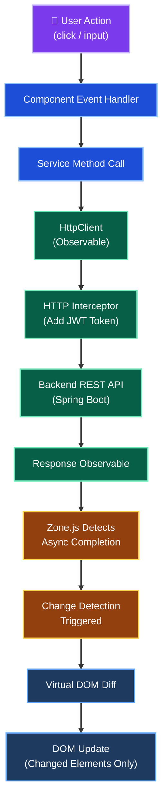

---

## Table of Contents

| Part | Topic | Questions |
|------|-------|-----------|
| [Part 1](#part-1-architecture--fundamentals) | Architecture + Fundamentals | Q1–Q12 |
| [Part 2](#part-2-rxjs--observables) | RxJS + Observables | Q13–Q24 |
| [Part 3](#part-3-routing--guards--http) | Routing + Guards + HTTP | Q25–Q33 |
| [Part 4](#part-4-forms--performance--security) | Forms + Performance + Security | Q34–Q43 |
| [Part 5](#part-5-scenario-based--enterprise) | Scenario-Based + Enterprise | Q44–Q50 |
| [Quick Reference](#quick-reference-all-key-questions) | All Key Questions Index | — |

---

## Part 1: Architecture + Fundamentals

### Q1. Angular Architecture — Core Building Blocks

Angular applications are built from these fundamental constructs:

| Building Block | Decorator | Purpose |
|---|---|---|
| **Module** | `@NgModule` | Groups related components, services, pipes |
| **Component** | `@Component` | UI building block (template + class + styles) |
| **Service** | `@Injectable` | Business logic, HTTP calls, shared state |
| **Directive** | `@Directive` | Modify DOM behavior (structural / attribute) |
| **Pipe** | `@Pipe` | Transform data in templates |
| **Guard** | implements `CanActivate` etc. | Route protection |
| **Interceptor** | implements `HttpInterceptor` | Intercept HTTP requests/responses globally |
| **Resolver** | implements `Resolve` | Pre-fetch data before route activation |

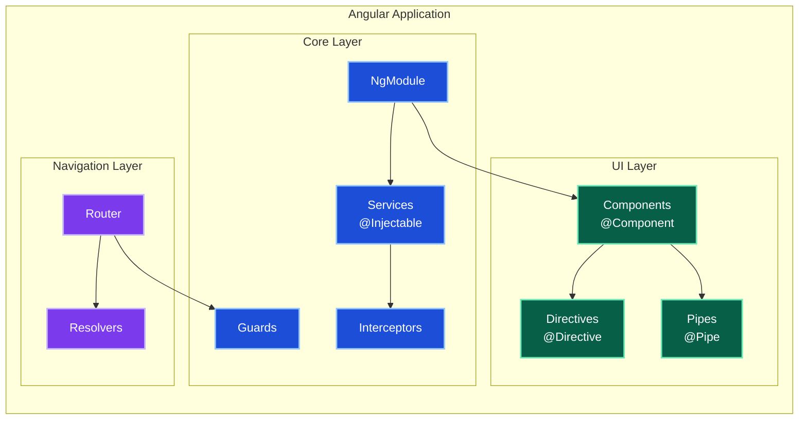

#### Key Takeaways

- Angular uses a modular architecture grouping related features into `@NgModule`s.
- Components are the fundamental UI unit; Services handle business logic.
- Interceptors and Guards provide cross-cutting concerns (auth, security).
- Resolvers ensure data is ready before a route activates.

---

### Q2. Component Lifecycle Hooks — All 8

Angular calls these hooks in strict order during a component's life:

```text
1. ngOnChanges(changes)     → @Input property changed (called BEFORE ngOnInit)
2. ngOnInit()               → Component initialized, inputs available
3. ngDoCheck()              → Custom change detection logic (every CD cycle!)
4. ngAfterContentInit()     → After <ng-content> projected content rendered
5. ngAfterContentChecked()  → After projected content checked
6. ngAfterViewInit()        → After component's view + child views initialized
7. ngAfterViewChecked()     → After view + child views checked
8. ngOnDestroy()            → Cleanup: unsubscribe, clear timers, detach listeners
```

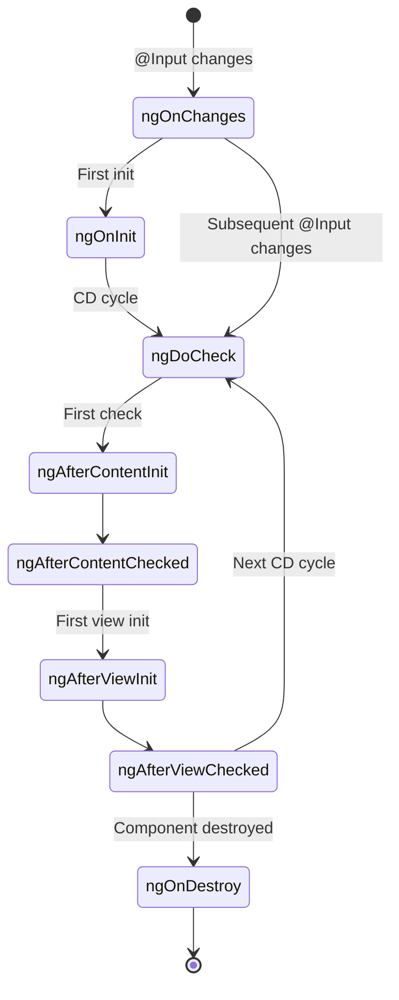

**Most Used:** `ngOnInit` (data loading), `ngOnDestroy` (cleanup), `ngOnChanges` (react to inputs)

```typescript
@Component({...})
export class PolicyListComponent implements OnInit, OnDestroy {
  private sub!: Subscription;

  ngOnInit() {
    this.sub = this.service.getPolicies().subscribe(...);
  }

  ngOnDestroy() {
    this.sub.unsubscribe(); // CRITICAL: prevent memory leak
  }
}
```

#### Key Takeaways

- `ngOnChanges` fires before `ngOnInit` and on every `@Input` reference change.
- `ngOnDestroy` is **mandatory** for cleaning up subscriptions and avoiding memory leaks.
- Avoid heavy logic in `ngDoCheck` — it runs on every change detection cycle.
- Use `ngAfterViewInit` to access child DOM elements via `@ViewChild`.

---

### Q3. Change Detection — Default vs OnPush

| Strategy | Trigger | Performance |
|---|---|---|
| **Default** | ANY change (event, timer, HTTP) in the entire app | Expensive — traverses entire component tree |
| **OnPush** | `@Input` reference changes, internal events, `markForCheck()`, async pipe | Efficient — skips 90%+ of unnecessary checks |

**OnPush triggers change detection when:**
1. `@Input` reference changes (new object, NOT mutation)
2. An event originates within the component
3. Manually triggered via `ChangeDetectorRef.markForCheck()`
4. An Observable emits (when using the `async` pipe)

```typescript
@Component({
  changeDetection: ChangeDetectionStrategy.OnPush,
  ...
})
export class PolicyComponent {
  @Input() policy!: Policy; // Only re-checked if reference changes

  constructor(private cdr: ChangeDetectorRef) {}

  forceUpdate() {
    this.cdr.markForCheck(); // Manual trigger
  }
}
```

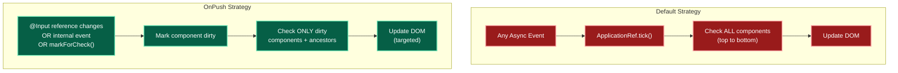

> **Performance:** OnPush can skip 90%+ of unnecessary checks in large apps.

> **Best Practice:** Use `OnPush` + `async` pipe + immutable data for maximum performance.

#### Key Takeaways

- Default strategy checks every component on every async event — avoid for large apps.
- OnPush requires immutable data patterns (spread/Object.assign instead of mutation).
- Combine OnPush with the `async` pipe for the most idiomatic reactive approach.
- Use `markForCheck()` sparingly when working with external libraries that mutate data.

---

### Q4. Zone.js — Internal Working

Zone.js **monkey-patches** ALL async APIs to enable automatic change detection:

- `setTimeout`, `setInterval`
- `Promise.then`
- `addEventListener`
- `XMLHttpRequest`, `fetch`
- `MutationObserver`

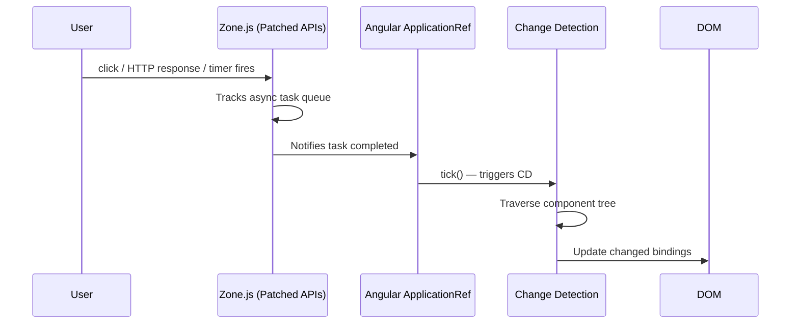

**Angular 16+ Signals (Zone.js-free):**

```typescript
// Without Zone.js — signals notify Angular directly
const count = signal(0);
const doubled = computed(() => count() * 2);

// Update triggers targeted re-render
count.set(count() + 1);
```

> Zone.js can be removed in Angular 16+ for better performance using Signals and `provideExperimentalZonelessChangeDetection()`.

#### Key Takeaways

- Zone.js intercepts all async operations to notify Angular when to run change detection.
- Every `setTimeout`, `Promise`, and `HttpClient` call goes through Zone.js.
- Angular Signals (v16+) offer a Zone.js-free reactive model with fine-grained updates.
- Running code outside Zone.js via `NgZone.runOutsideAngular()` prevents unnecessary CD cycles.

---

### Q5. Dependency Injection in Angular

Angular has its own **hierarchical DI system** (similar to Spring IoC container):

```typescript
@Injectable({ providedIn: 'root' }) // Singleton across entire app
export class PolicyService {
  constructor(private http: HttpClient) {}
}
```

**Injection Scopes:**

| Scope | Configuration | Behavior |
|---|---|---|
| `providedIn: 'root'` | `@Injectable({ providedIn: 'root' })` | App-wide singleton (tree-shakable) |
| Module-level | `providers: [Service]` in `@NgModule` | Module-scoped singleton |
| Component-level | `providers: [Service]` in `@Component` | New instance per component |

**Injection Token (for non-class values):**

```typescript
const API_URL = new InjectionToken<string>('API_URL');

// Provider
providers: [{ provide: API_URL, useValue: 'http://api.company.com' }]

// Consumer
constructor(@Inject(API_URL) private apiUrl: string) {}
```

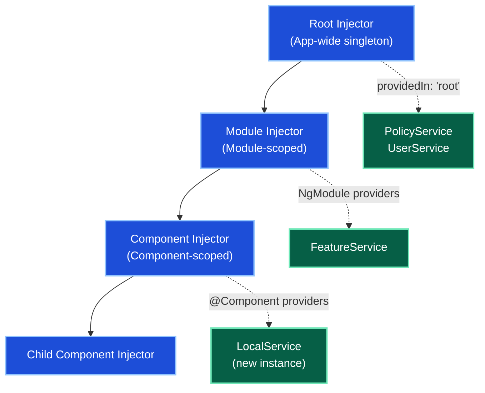

#### Key Takeaways

- `providedIn: 'root'` is preferred — creates a tree-shakable singleton.
- Component-level providers create a new instance per component (useful for stateful UI services).
- `InjectionToken` is used for non-class dependencies like config values, strings, and numbers.
- Angular resolves dependencies by walking up the injector hierarchy.

---

### Q6. @NgModule — imports vs declarations vs providers vs exports

| Property | Contains | Purpose |
|---|---|---|
| `declarations` | Components, Directives, Pipes | Items OWNED by this module |
| `imports` | Other NgModules | Access exported items from other modules |
| `providers` | Services | Register services at this module level |
| `exports` | Components, Directives, Pipes, Modules | Items available to importing modules |
| `bootstrap` | Root component | Only in `AppModule` |

> **Common Mistake:** Declaring the same component in two modules causes a build error.
>
> **Fix:** Create a `SharedModule`, declare + export the shared component there, then import `SharedModule` wherever needed.

```typescript
@NgModule({
  declarations: [SharedButtonComponent, SharedTableComponent],
  imports: [CommonModule, ReactiveFormsModule],
  exports: [SharedButtonComponent, SharedTableComponent, CommonModule]
})
export class SharedModule {}
```

#### Key Takeaways

- `declarations` is exclusive — a component can belong to only ONE module.
- `exports` controls what other modules can use from this module.
- Import `SharedModule` in feature modules instead of re-declaring shared components.
- `bootstrap` is only used in the root `AppModule`.

---

### Q7. Data Binding — All 4 Types

```text
Interpolation:  {{ expression }}              → Component → Template (one-way read)
Property:       [property]="expression"       → Component → Template (one-way)
Event:          (event)="handler($event)"     → Template → Component (one-way)
Two-way:        [(ngModel)]="property"        → Both directions (banana in a box)
```

| Type | Syntax | Direction | Use Case |
|---|---|---|---|
| Interpolation | `{{ value }}` | Component → Template | Display text |
| Property Binding | `[src]="imageUrl"` | Component → Template | Bind DOM properties |
| Event Binding | `(click)="onClick()"` | Template → Component | Handle user events |
| Two-way Binding | `[(ngModel)]="name"` | Bidirectional | Form inputs |

> **Two-way binding** is syntactic sugar for: `[ngModel]="prop" (ngModelChange)="prop = $event"`

```typescript
// Two-way manually expanded
<input [ngModel]="username" (ngModelChange)="username = $event">

// Shorthand (banana in a box)
<input [(ngModel)]="username">
```

#### Key Takeaways

- Prefer property and event binding over two-way binding in reactive forms.
- Two-way binding requires `FormsModule` imported in the module.
- `[property]` binds to DOM properties, not HTML attributes — use `[attr.aria-label]` for attributes.
- `{{ }}` interpolation converts expressions to strings; use `[textContent]` for non-string values.

---

### Q8. Structural vs Attribute Directives

| Type | Effect | Examples |
|---|---|---|
| **Structural** (`*`) | Modify DOM structure — add/remove elements | `*ngIf`, `*ngFor`, `*ngSwitch` |
| **Attribute** | Modify appearance/behavior of existing element | `[ngClass]`, `[ngStyle]`, `[hidden]` |

**Structural Directives:**

```html
<!-- ngIf — removes/adds from DOM -->
<div *ngIf="isLoggedIn">Welcome back!</div>

<!-- ngFor — render a list -->
<tr *ngFor="let emp of employees; trackBy: trackById">

<!-- ngSwitch — conditional rendering -->
<div [ngSwitch]="status">
  <span *ngSwitchCase="'ACTIVE'">Active</span>
  <span *ngSwitchDefault>Inactive</span>
</div>
```

**Attribute Directives:**

```html
<div [ngClass]="{'active': isActive, 'error': hasError}">...</div>
<div [ngStyle]="{'color': textColor, 'font-size': fontSize + 'px'}">...</div>
<div [hidden]="!isVisible">Still in DOM, just hidden</div>
```

**Custom Directive:**

```typescript
@Directive({ selector: '[appHighlight]' })
export class HighlightDirective {
  constructor(private el: ElementRef) {}

  @HostListener('mouseenter') onMouseEnter() {
    this.el.nativeElement.style.backgroundColor = 'yellow';
  }

  @HostListener('mouseleave') onMouseLeave() {
    this.el.nativeElement.style.backgroundColor = '';
  }
}
```

```html
<p appHighlight>Hover to highlight me</p>
```

#### Key Takeaways

- Structural directives use `*` prefix (desugared to `<ng-template>` internally).
- `*ngIf` removes the element from the DOM entirely; `[hidden]` keeps it but hides via CSS.
- Custom directives use `@HostListener` for event handling and `ElementRef` for DOM access.
- Avoid direct DOM manipulation with `ElementRef` in SSR environments — use `Renderer2`.

---

### Q9. *ngIf vs [hidden] — DOM Impact

| | `*ngIf` | `[hidden]` |
|---|---|---|
| DOM Presence | Removed completely | Remains in DOM |
| Lifecycle Hooks | Fire on add/remove | No lifecycle impact |
| Performance | Better for expensive components | Better for frequent toggles |
| CSS | `display: block` when shown | `display: none` when hidden |
| State Preservation | State lost on removal | State preserved |

**Use `*ngIf` when:**
- Component is expensive to render
- You want to reduce DOM size
- The element is rarely shown

**Use `[hidden]` when:**
- Frequent toggle is expected
- You need to preserve component state (form values, scroll position)

#### Key Takeaways

- `*ngIf="false"` completely removes the element, triggering `ngOnDestroy`.
- `[hidden]="true"` keeps the element alive with `display: none`, preserving its state.
- For tabs with complex forms, prefer `[hidden]` to avoid losing user input.

---

### Q10. trackBy in *ngFor — Performance

Without `trackBy`, Angular **destroys and recreates ALL list DOM elements** on any change.
With `trackBy`, Angular only modifies changed items.

```typescript
// Template
<tr *ngFor="let emp of employees; trackBy: trackById">
  <td>{{ emp.name }}</td>
</tr>

// Component
trackById(index: number, emp: Employee): number {
  return emp.id;
}
```

> **Performance Impact:** For a 1,000-item list, `trackBy` reduces re-renders by ~95%.

#### Key Takeaways

- Always use `trackBy` with `*ngFor` for lists that change frequently.
- The tracking function should return a unique, stable identifier (usually `id`).
- Without `trackBy`, re-sorting a list triggers destruction and recreation of ALL elements.
- Combine with `OnPush` change detection for maximum list performance.

---

### Q11. Pipes — Built-in and Custom

**Built-in Pipes:**

| Pipe | Example | Output |
|---|---|---|
| `date` | `{{ date \| date:'dd/MM/yyyy' }}` | `12/06/2026` |
| `currency` | `{{ 1500 \| currency:'INR' }}` | `₹1,500.00` |
| `percent` | `{{ 0.85 \| percent }}` | `85%` |
| `uppercase` | `{{ 'hello' \| uppercase }}` | `HELLO` |
| `json` | `{{ obj \| json }}` | JSON string |
| `async` | `{{ data$ \| async }}` | Resolved value |
| `slice` | `{{ arr \| slice:0:5 }}` | First 5 elements |

**Custom Pure Pipe:**

```typescript
@Pipe({ name: 'statusBadge', pure: true })
export class StatusBadgePipe implements PipeTransform {
  transform(status: string): string {
    return status === 'ACTIVE' ? '✅ Active' : '❌ Inactive';
  }
}

// Template usage
{{ policy.status | statusBadge }}
```

**Pure vs Impure Pipes:**

| | Pure Pipe | Impure Pipe |
|---|---|---|
| `pure` setting | `true` (default) | `false` |
| Re-evaluation | Only when INPUT reference changes | Every change detection cycle |
| Performance | Efficient | Expensive |
| Use case | Stateless transformations | Stateful, side-effecting logic |

#### Key Takeaways

- Always prefer **pure pipes** — they are memoized and cached by Angular.
- The `async` pipe auto-subscribes and unsubscribes from Observables — use it with OnPush.
- Impure pipes run on every CD cycle — use them only when absolutely necessary.
- Avoid calling functions in templates; use pipes instead for computed values.

---

### Q12. ViewChild and ContentChild

**@ViewChild — access child in own template:**

```typescript
@ViewChild('myInput') inputRef!: ElementRef;
@ViewChild(ChildComponent) child!: ChildComponent;

ngAfterViewInit() {
  this.inputRef.nativeElement.focus(); // Available after view init
  this.child.doSomething();
}
```

**@ContentChild — access projected content:**

```typescript
// Parent template: <my-card><h2 #title>Card Title</h2></my-card>
@ContentChild('title') titleRef!: ElementRef;

ngAfterContentInit() {
  console.log(this.titleRef.nativeElement.textContent);
}
```

| | `@ViewChild` | `@ContentChild` |
|---|---|---|
| Source | Component's own template | `<ng-content>` projected content |
| Available | `ngAfterViewInit` | `ngAfterContentInit` |
| Use case | Access child components/elements | Access slotted content |

#### Key Takeaways

- `@ViewChild` is available only from `ngAfterViewInit` onward — never access in `ngOnInit`.
- Use `{ static: true }` option only if the element is not inside `*ngIf` or `*ngFor`.
- `@ContentChild` is for library authors building reusable container components.
- Prefer reactive patterns over `@ViewChild` for data flow; use it for DOM manipulation only.

---

## Part 2: RxJS + Observables

### Q13. Observable vs Promise

| Feature | Promise | Observable |
|---|---|---|
| **Values** | Single value | Multiple values (stream) |
| **Laziness** | Eager (executes immediately) | Lazy (executes on subscribe) |
| **Cancellation** | Not cancellable | Cancellable via `unsubscribe()` |
| **Operators** | `.then()`, `.catch()` | `pipe(map, filter, retry, ...)` |
| **Async/Await** | Native support | `await firstValueFrom(obs$)` |
| **Error handling** | `.catch()` | `catchError()` operator |
| **Retry** | Manual | `retry(3)` operator |

```typescript
// Promise: one HTTP call, executes immediately
fetch('/api/policies').then(res => res.json());

// Observable: lazy, cancellable, composable
this.http.get<Policy[]>('/api/policies')
  .pipe(
    retry(3),
    catchError(err => of([]))
  )
  .subscribe(data => this.policies = data);
```

#### Key Takeaways

- Observables are lazy — no network call until `.subscribe()` is called.
- Use `firstValueFrom()` to convert an Observable to a Promise for async/await.
- Observables support powerful composition with RxJS operators; Promises don't.
- `HttpClient` returns Observables, enabling retry, cancellation, and interception.

---

### Q14. Subject Types — Subject, BehaviorSubject, ReplaySubject, AsyncSubject

| Subject | Initial Value | New Subscriber Gets | Use Case |
|---|---|---|---|
| `Subject` | None | Nothing (future emissions only) | Event bus, simple pub/sub |
| `BehaviorSubject` | Required | Last emitted value immediately | Current user, loading state |
| `ReplaySubject(n)` | None | Last N emitted values | Chat history, event replay |
| `AsyncSubject` | None | Last value on `complete()` | One-shot async result |

```typescript
// Subject — no initial value
const sub = new Subject<string>();
sub.subscribe(v => console.log(v));
sub.next("Hello"); // subscriber receives "Hello"

// BehaviorSubject — has initial value
const user$ = new BehaviorSubject<User | null>(null);
user$.next(currentUser);
user$.subscribe(user => ...); // immediately gets currentUser

// ReplaySubject — buffer last N values
const replay$ = new ReplaySubject<string>(3); // buffer last 3
replay$.next("A"); replay$.next("B"); replay$.next("C"); replay$.next("D");
replay$.subscribe(v => ...); // gets B, C, D (last 3)

// AsyncSubject — only emits last value on complete
const async$ = new AsyncSubject<string>();
async$.next("A"); async$.next("B"); async$.complete();
async$.subscribe(v => ...); // gets "B" only
```

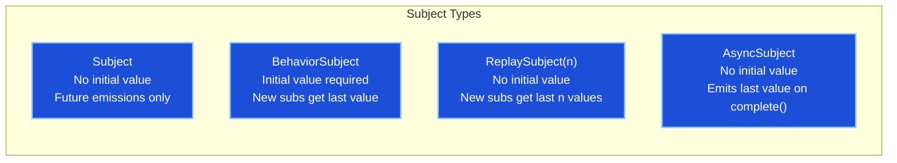

#### Key Takeaways

- `BehaviorSubject` is the most commonly used — ideal for state management in services.
- Always call `.asObservable()` when exposing subjects publicly to prevent external `.next()` calls.
- `ReplaySubject` is great for late subscribers that need historical data.
- `AsyncSubject` mirrors the behavior of a `Promise`.

---

### Q15. Common RxJS Operators for Angular

| Category | Operators | Purpose |
|---|---|---|
| **Transformation** | `map`, `switchMap`, `mergeMap`, `concatMap`, `exhaustMap` | Transform emitted values |
| **Filtering** | `filter`, `distinctUntilChanged`, `debounceTime`, `take`, `first` | Filter emissions |
| **Combination** | `combineLatest`, `forkJoin`, `merge`, `zip` | Combine multiple streams |
| **Error** | `catchError`, `retry`, `retryWhen` | Handle errors |
| **Utility** | `tap`, `delay`, `finalize`, `shareReplay` | Side effects and sharing |

#### Key Takeaways

- `switchMap` is the most important operator for Angular HTTP — it cancels previous requests.
- `debounceTime` + `distinctUntilChanged` is the standard pattern for search inputs.
- `forkJoin` is Angular's equivalent of `CompletableFuture.allOf()` in Java.
- `shareReplay(1)` prevents duplicate HTTP calls when multiple components subscribe.

---

### Q16. switchMap vs mergeMap vs concatMap vs exhaustMap

| Operator | Behavior | Primary Use Case |
|---|---|---|
| `switchMap` | Cancels previous inner Observable when new outer emits | Search typeahead, live filtering |
| `mergeMap` | Runs all inner Observables **concurrently** | Multiple independent HTTP calls |
| `concatMap` | **Queues** inner Observables, runs sequentially | Sequential dependent operations |
| `exhaustMap` | **Ignores** new outer emissions until current inner completes | Login button (prevent double-submit) |

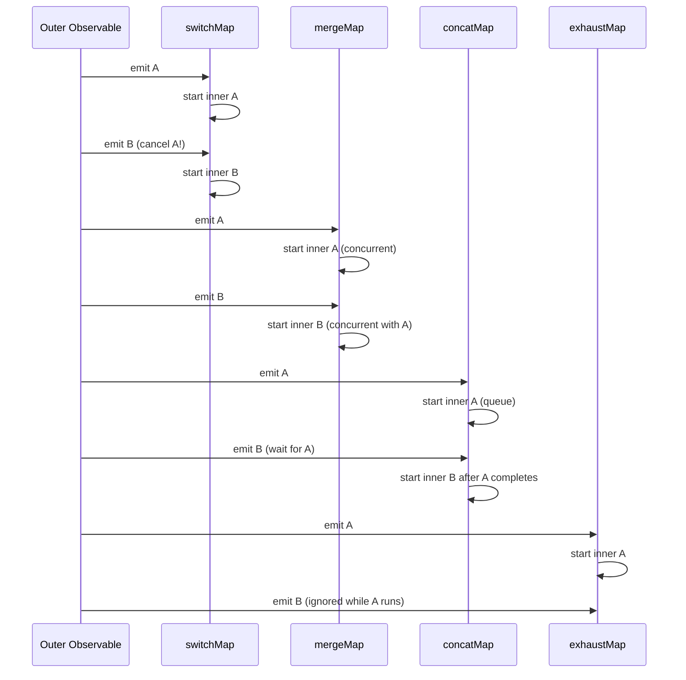

```typescript
// switchMap — search typeahead (cancel old search when user types more)
this.searchControl.valueChanges.pipe(
  debounceTime(300),
  distinctUntilChanged(),
  switchMap(term => this.searchService.search(term))
).subscribe(results => this.results = results);

// exhaustMap — prevent login double submission
this.loginButton.clicks.pipe(
  exhaustMap(() => this.authService.login(this.credentials))
).subscribe(user => this.router.navigate(['/dashboard']));

// concatMap — sequential operations
this.saveActions.pipe(
  concatMap(data => this.api.save(data))
).subscribe();
```

#### Key Takeaways

- `switchMap` is the go-to for search/autocomplete — always cancels stale requests.
- `exhaustMap` prevents duplicate form submissions — the most important for button clicks.
- `concatMap` ensures order — critical for sequential dependent API calls.
- `mergeMap` offers highest throughput but no ordering guarantee.

---

### Q17. Memory Leaks from Observables — Prevention

**Methods to prevent memory leaks:**

| Method | Pattern | Best For |
|---|---|---|
| `unsubscribe()` | Manual call in `ngOnDestroy` | Single subscriptions |
| `async` pipe | Template-level subscription | Template data |
| `takeUntil(destroy$)` | Subject-based unsubscription | Multiple subscriptions |
| `take(1)` | Auto-completes after first emission | One-shot HTTP calls |

```typescript
// Method 1: Manual unsubscribe
@Component({...})
export class MyComponent implements OnInit, OnDestroy {
  private sub!: Subscription;

  ngOnInit() { this.sub = this.service.getData().subscribe(...); }
  ngOnDestroy() { this.sub.unsubscribe(); }
}

// Method 2: takeUntil pattern (best for multiple subscriptions)
@Component({...})
export class MyComponent implements OnInit, OnDestroy {
  private destroy$ = new Subject<void>();

  ngOnInit() {
    this.service.getData()
      .pipe(takeUntil(this.destroy$))
      .subscribe(...);

    this.service.getMore()
      .pipe(takeUntil(this.destroy$))
      .subscribe(...);
  }

  ngOnDestroy() {
    this.destroy$.next();
    this.destroy$.complete();
  }
}

// Method 3: async pipe (cleanest — auto-subscribes and unsubscribes)
policies$ = this.policyService.getPolicies();
// Template: <div *ngFor="let p of policies$ | async">{{ p.name }}</div>
```

#### Key Takeaways

- Always clean up subscriptions in `ngOnDestroy` to prevent memory leaks.
- `async` pipe is the cleanest approach — handles subscribe/unsubscribe automatically.
- `takeUntil` is the most scalable pattern for components with many subscriptions.
- HTTP observables complete automatically — no unsubscription needed for single calls.

---

### Q18. combineLatest vs forkJoin

| | `forkJoin` | `combineLatest` |
|---|---|---|
| **Emits when** | ALL observables complete | ANY observable emits (after all have emitted once) |
| **Emits** | Last values as array | Latest values as array |
| **Ongoing streams** | ❌ Not suitable | ✅ Works great |
| **Use case** | Parallel HTTP calls | Reactive UI filters |

```typescript
// forkJoin — parallel HTTP calls (like CompletableFuture.allOf)
forkJoin([
  this.policyService.getAll(),
  this.userService.getCurrent()
]).subscribe(([policies, user]) => {
  this.policies = policies;
  this.user = user;
});

// combineLatest — reactive filters
combineLatest([
  this.filterControl.valueChanges,
  this.sortControl.valueChanges
]).subscribe(([filter, sort]) => this.refreshList(filter, sort));
```

#### Key Takeaways

- `forkJoin` is for one-shot parallel requests — it requires all streams to complete.
- `combineLatest` is for ongoing reactive state — perfect for filter/sort UIs.
- Both wait for all source observables to emit at least once before emitting.

---

### Q19. debounceTime and distinctUntilChanged

```typescript
// Without operators: every keystroke fires HTTP (50 calls for "interview")
// With operators: only fires after 300ms pause + value changed
this.searchControl.valueChanges.pipe(
  debounceTime(300),         // Wait 300ms after last keystroke
  distinctUntilChanged(),    // Skip if value hasn't changed
  switchMap(term => this.api.search(term))
).subscribe(results => this.results = results);
```

| Operator | Purpose | Analogy |
|---|---|---|
| `debounceTime(ms)` | Wait for inactivity period | Wait for user to stop typing |
| `distinctUntilChanged()` | Skip duplicate consecutive emissions | Don't re-search same term |

#### Key Takeaways

- Always pair `debounceTime` with `distinctUntilChanged` for search inputs.
- `throttleTime` emits the first value then ignores for the period — useful for scroll events.
- 300ms is the standard debounce value for search; 100ms for scroll/resize events.

---

### Q20. tap() — Side Effects Without Modifying Stream

```typescript
// Use tap for logging, debugging, or side effects
this.http.get<Policy[]>('/api/policies').pipe(
  tap(data => console.log('Received:', data)),
  tap(data => this.analyticsService.track('policies-loaded', data.length)),
  map(policies => policies.filter(p => p.isActive))
).subscribe(active => this.activePolicies = active);
```

> `tap` does NOT transform the stream — it's a pure side-effect operator.

---

### Q21. catchError() — Error Handling in Streams

```typescript
this.http.get<Policy[]>('/api/policies').pipe(
  catchError(err => {
    this.error = err.message;
    this.snackBar.open('Failed to load policies', 'Close');
    return of([]); // Return fallback value to keep stream alive
  })
).subscribe(policies => this.policies = policies);
```

---

### Q22. retry(n) — Retry Before Error

```typescript
this.http.get<Policy[]>('/api/policies').pipe(
  retry(3),              // Retry up to 3 times on error
  catchError(this.handleError)
).subscribe(...);

// retryWhen with delay
.pipe(
  retryWhen(errors => errors.pipe(delay(1000), take(3)))
)
```

---

### Q23. first() vs take(1)

| | `first()` | `take(1)` |
|---|---|---|
| **Empty stream** | Throws `EmptyError` | Completes silently |
| **With predicate** | `first(x => x > 0)` | Not supported |
| **Use case** | Guaranteed single emission | Optional single emission |

```typescript
this.route.queryParams.pipe(first()).subscribe(params => ...);
this.route.queryParams.pipe(take(1)).subscribe(params => ...);
```

---

### Q24. shareReplay(1) — Share + Cache Last Value

```typescript
// Without shareReplay: each subscriber makes a separate HTTP call
private policies$ = this.http.get<Policy[]>('/api/policies')
  .pipe(shareReplay(1)); // One HTTP call shared by ALL subscribers

// Multiple subscribers — only ONE HTTP call is made
this.policies$.subscribe(p => this.list = p);
this.policies$.subscribe(p => this.count = p.length);
```

> **Use Case:** Shared API calls, caching configuration data, avoiding duplicate requests.

#### Key Takeaways

- `shareReplay(1)` is essential for shared data in multiple components.
- Combine with `async` pipe in templates for the cleanest reactive pattern.
- `first()` errors on empty streams; prefer `take(1)` for defensive code.
- `tap` is invaluable for debugging RxJS pipelines without altering data flow.

---

## Part 3: Routing + Guards + HTTP

### Q25. Routing — Configuration and Navigation

```typescript
const routes: Routes = [
  { path: '', redirectTo: '/dashboard', pathMatch: 'full' },
  { path: 'dashboard', component: DashboardComponent },
  {
    path: 'policies',
    component: PolicyListComponent,
    canActivate: [AuthGuard]
  },
  {
    path: 'policies/:id',
    component: PolicyDetailComponent,
    resolve: { policy: PolicyResolver }
  },
  {
    path: 'admin',
    loadChildren: () => import('./admin/admin.module').then(m => m.AdminModule)
  },
  { path: '**', component: NotFoundComponent } // Wildcard — must be last
];

// Programmatic navigation
this.router.navigate(['/policies', policyId]);
this.router.navigate(['/policies'], { queryParams: { status: 'active' } });
this.router.navigateByUrl('/policies?status=active');
```

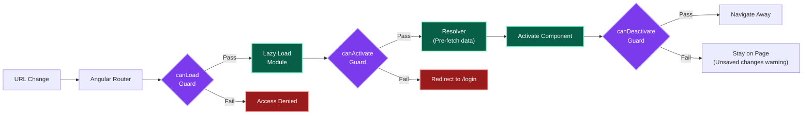

#### Key Takeaways

- Always place the `**` wildcard route **last** — Angular matches routes in order.
- `pathMatch: 'full'` is required for empty path redirects.
- Use `queryParams` for stateless filters; use route params (`:id`) for resource identity.
- `loadChildren` with dynamic `import()` enables lazy loading.

---

### Q26. Route Guards

| Guard | Interface | Purpose |
|---|---|---|
| `canActivate` | `CanActivate` | Allow/deny access to a route |
| `canDeactivate` | `CanDeactivate<T>` | Allow/deny leaving a route (unsaved changes) |
| `canLoad` | `CanLoad` | Allow/deny lazy module loading |
| `resolve` | `Resolve<T>` | Pre-fetch data before activating route |
| `canActivateChild` | `CanActivateChild` | Guard child routes |

```typescript
@Injectable({ providedIn: 'root' })
export class AuthGuard implements CanActivate {
  constructor(private authService: AuthService, private router: Router) {}

  canActivate(): boolean {
    if (this.authService.isLoggedIn()) return true;
    this.router.navigate(['/login']);
    return false;
  }
}

// Unsaved changes guard
@Injectable({ providedIn: 'root' })
export class UnsavedChangesGuard implements CanDeactivate<PolicyFormComponent> {
  canDeactivate(component: PolicyFormComponent): boolean {
    if (component.form.dirty) {
      return confirm('You have unsaved changes. Leave anyway?');
    }
    return true;
  }
}
```

#### Key Takeaways

- Guards return `boolean`, `Observable<boolean>`, or `Promise<boolean>`.
- `canLoad` prevents the lazy module bundle from being downloaded — use for sensitive modules.
- `canDeactivate` is essential for forms with unsaved changes.
- Angular 15+ supports functional guards: `canActivate: [() => inject(AuthService).isLoggedIn()]`.

---

### Q27. Lazy Loading Modules

Lazy loading splits the app into chunks loaded **on demand**, reducing initial bundle size.

```typescript
// Route configuration
{
  path: 'admin',
  loadChildren: () => import('./admin/admin.module').then(m => m.AdminModule)
}
```

**Bundle Size Impact:**

| Scenario | Main Bundle | Admin Bundle |
|---|---|---|
| Before lazy loading | 2 MB | — (merged into main) |
| After lazy loading | 800 KB | 400 KB (loaded on `/admin`) |

**Preloading Strategy:** Load lazy modules in the background after the initial load:

```typescript
imports: [
  RouterModule.forRoot(routes, {
    preloadingStrategy: PreloadAllModules
  })
]
```

#### Key Takeaways

- Lazy loading is the single biggest bundle optimization in Angular.
- Use `PreloadAllModules` to preload in background — best UX for most apps.
- Custom `PreloadingStrategy` can preload only high-priority modules.
- Standalone components (Angular 14+) support lazy loading without modules.

---

### Q28. HTTP Interceptors

Interceptors intercept ALL HTTP requests and responses globally.

```typescript
@Injectable()
export class AuthInterceptor implements HttpInterceptor {
  constructor(private auth: AuthService, private router: Router) {}

  intercept(req: HttpRequest<any>, next: HttpHandler): Observable<HttpEvent<any>> {
    const token = this.auth.getToken();
    const authReq = req.clone({
      setHeaders: { Authorization: `Bearer ${token}` }
    });

    return next.handle(authReq).pipe(
      catchError((error: HttpErrorResponse) => {
        if (error.status === 401) {
          this.auth.logout();
          this.router.navigate(['/login']);
        }
        if (error.status === 0) {
          console.error('Network error — check connection');
        }
        return throwError(() => error);
      })
    );
  }
}

// Register in AppModule
providers: [
  { provide: HTTP_INTERCEPTORS, useClass: AuthInterceptor, multi: true }
]
```

> **Multiple Interceptors** execute in ORDER of registration (chain pattern, like a pipeline).

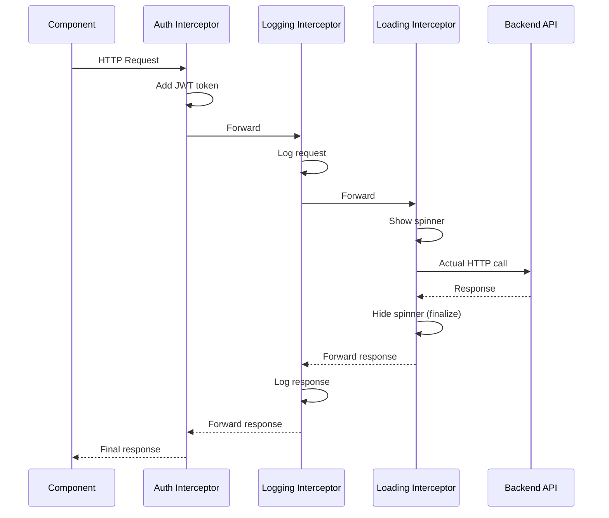

#### Key Takeaways

- Interceptors execute in registration order for requests; reverse order for responses.
- Use `req.clone()` — HTTP requests are immutable.
- Always re-throw errors with `throwError()` after handling; swallowing errors causes silent failures.
- Chain: Auth → Logging → Error Handling → Loading is a common enterprise pattern.

---

### Q29. HttpClient — GET, POST, PUT, DELETE Patterns

```typescript
@Injectable({ providedIn: 'root' })
export class PolicyService {
  private baseUrl = '/api/v1/policies';

  constructor(private http: HttpClient) {}

  getAll(): Observable<Policy[]> {
    return this.http.get<Policy[]>(this.baseUrl);
  }

  getById(id: number): Observable<Policy> {
    return this.http.get<Policy>(`${this.baseUrl}/${id}`);
  }

  create(policy: Policy): Observable<Policy> {
    return this.http.post<Policy>(this.baseUrl, policy);
  }

  update(id: number, policy: Policy): Observable<Policy> {
    return this.http.put<Policy>(`${this.baseUrl}/${id}`, policy);
  }

  patch(id: number, partial: Partial<Policy>): Observable<Policy> {
    return this.http.patch<Policy>(`${this.baseUrl}/${id}`, partial);
  }

  delete(id: number): Observable<void> {
    return this.http.delete<void>(`${this.baseUrl}/${id}`);
  }

  getAllWithParams(status: string, page: number): Observable<Policy[]> {
    const params = new HttpParams()
      .set('status', status)
      .set('page', page.toString());
    return this.http.get<Policy[]>(this.baseUrl, { params });
  }
}
```

#### Key Takeaways

- `HttpClient` methods return **cold Observables** — always subscribe or use `async` pipe.
- Always type your responses: `http.get<Policy[]>(...)` enables compile-time type safety.
- Use `HttpParams` for query parameters — do NOT concatenate to URL strings manually.
- `HttpClient` auto-serializes objects to JSON; no `JSON.stringify()` needed.

---

### Q30. Resolvers — Pre-fetch Data

```typescript
@Injectable({ providedIn: 'root' })
export class PolicyResolver implements Resolve<Policy> {
  constructor(private policyService: PolicyService, private router: Router) {}

  resolve(route: ActivatedRouteSnapshot): Observable<Policy> {
    const id = +route.paramMap.get('id')!;
    return this.policyService.getById(id).pipe(
      catchError(() => {
        this.router.navigate(['/not-found']);
        return EMPTY;
      })
    );
  }
}

// Access resolved data in component
ngOnInit() {
  this.policy = this.route.snapshot.data['policy'];
  // or reactively:
  this.route.data.subscribe(data => this.policy = data['policy']);
}
```

#### Key Takeaways

- Resolvers fetch data **before** the component activates — eliminates loading flicker.
- Return `EMPTY` from `catchError` to prevent navigating to the component on error.
- Route data is available via `ActivatedRoute.snapshot.data['key']` or `.data` observable.

---

### Q31. ActivatedRoute — Accessing Route Params, Query Params, Data

```typescript
export class PolicyDetailComponent implements OnInit {
  constructor(private route: ActivatedRoute) {}

  ngOnInit() {
    // Snapshot (one-time read — use for static routes)
    const id = this.route.snapshot.paramMap.get('id');

    // Observable (reactive — use for same-component navigation)
    this.route.paramMap.subscribe(params => {
      const id = params.get('id');
      this.loadPolicy(+id!);
    });

    // Query params
    this.route.queryParams.subscribe(params => {
      this.status = params['status'];
    });

    // Resolved data
    this.policy = this.route.snapshot.data['policy'];
  }
}
```

---

### Q32. Router Events — NavigationStart, NavigationEnd, NavigationError

```typescript
// Monitor routing events (e.g., global loading indicator)
this.router.events.pipe(
  filter(e => e instanceof NavigationStart || e instanceof NavigationEnd)
).subscribe(event => {
  if (event instanceof NavigationStart) this.isLoading = true;
  if (event instanceof NavigationEnd) this.isLoading = false;
});
```

---

### Q33. Passing Data Between Routes

| Method | Mechanism | Persists After Refresh |
|---|---|---|
| Route params | `/policies/:id` | ✅ Yes |
| Query params | `/policies?status=active` | ✅ Yes |
| Route state | `router.navigate(['/target'], { state: { data } })` | ❌ No (lost on refresh) |
| Route data | Static data in route config | ✅ Yes (static) |

```typescript
// Passing state (ephemeral)
this.router.navigate(['/policies', id], { state: { fromDashboard: true } });

// Reading state
const state = this.router.getCurrentNavigation()?.extras.state;
// OR
const state = history.state;
```

#### Key Takeaways

- Route params and query params survive page refresh and can be bookmarked.
- Router state (`history.state`) is ephemeral — lost on page refresh.
- Use query params for filters/pagination; route params for resource IDs.
- Resolvers are the cleanest way to pass loaded data to a component.

---

## Part 4: Forms + Performance + Security

### Q34. Template-Driven vs Reactive Forms

| Feature | Template-Driven | Reactive |
|---|---|---|
| **Setup** | In HTML template | In component class |
| **Module** | `FormsModule` | `ReactiveFormsModule` |
| **Form model** | Angular creates implicitly | Developer creates explicitly |
| **Validation** | HTML attributes | Validator functions |
| **Testing** | Harder (template-dependent) | Easy (pure TS class) |
| **Dynamic fields** | Difficult | Easy with `FormArray` |
| **Async validation** | Complex | First-class support |
| **When to use** | Simple forms | Complex/dynamic forms |

```typescript
// Reactive Form
export class PolicyFormComponent implements OnInit {
  policyForm!: FormGroup;

  constructor(private fb: FormBuilder) {}

  ngOnInit() {
    this.policyForm = this.fb.group({
      name: ['', [Validators.required, Validators.minLength(3)]],
      email: ['', [Validators.required, Validators.email]],
      premium: [0, [Validators.required, Validators.min(1000), PolicyFormComponent.premiumRange]],
      coverages: this.fb.array([]) // Dynamic FormArray
    });
  }

  // Custom synchronous validator
  static premiumRange(control: AbstractControl): ValidationErrors | null {
    const val = control.value;
    return val >= 1000 && val <= 1000000 ? null : { premiumRange: true };
  }

  // Custom async validator (e.g., check policy name availability)
  policyNameAvailable(control: AbstractControl): Observable<ValidationErrors | null> {
    return this.policyService.checkName(control.value).pipe(
      map(isAvailable => isAvailable ? null : { nameTaken: true }),
      catchError(() => of(null))
    );
  }

  get coverages(): FormArray {
    return this.policyForm.get('coverages') as FormArray;
  }

  addCoverage() {
    this.coverages.push(this.fb.control('', Validators.required));
  }
}
```

#### Key Takeaways

- Prefer Reactive Forms for any non-trivial form — they are more testable and maintainable.
- `FormBuilder` is a convenience wrapper around `FormGroup`, `FormControl`, `FormArray`.
- Custom validators return `null` for valid and an error object for invalid.
- Async validators run after sync validators pass — always return `Observable<ValidationErrors | null>`.

---

### Q35. AOT vs JIT Compilation

| | JIT (Just-in-Time) | AOT (Ahead-of-Time) |
|---|---|---|
| **When** | Runtime (in browser) | Build time |
| **Bundle size** | Larger (includes Angular compiler) | Smaller |
| **Startup speed** | Slower | 30–50% faster |
| **Template errors** | Runtime errors | Build-time errors |
| **Used in** | `ng serve` (development) | `ng build --prod` (production) |
| **Security** | Template HTML exposed | Templates compiled away |

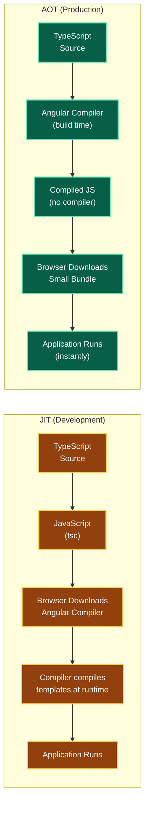

> **AOT Benefits:** 30–50% faster rendering, 50% smaller bundle, catches template errors at build time.

#### Key Takeaways

- AOT is the default for production builds (`ng build`).
- JIT is only used in development for faster rebuilds.
- AOT detects template errors (typos in `[(ngModel)]`, missing directives) at build time.
- Ivy renderer (Angular 9+) uses AOT by default even in development.

---

### Q36. Tree Shaking

Webpack removes unused code from the final bundle automatically:

- `providedIn: 'root'` enables tree-shaking for services.
- If a service is **never injected**, it's removed from the bundle entirely.
- Avoid `providers: [Service]` in `@NgModule` for shared services — it prevents tree-shaking.

```typescript
// Tree-shakable — safe to import everywhere
@Injectable({ providedIn: 'root' })
export class AnalyticsService { ... }

// NOT tree-shakable — always included even if unused
@NgModule({
  providers: [AnalyticsService] // Bundled regardless of injection
})
```

#### Key Takeaways

- Always use `providedIn: 'root'` for singleton services to enable tree-shaking.
- Tree shaking works on ES modules — avoid CommonJS dependencies that block it.
- Use `ng build --stats-json` + `webpack-bundle-analyzer` to inspect what's in your bundle.

---

### Q37. Angular Performance Optimization Checklist

| # | Technique | Impact |
|---|---|---|
| 1 | `OnPush` change detection | ⭐⭐⭐ High |
| 2 | `trackBy` on `*ngFor` | ⭐⭐⭐ High |
| 3 | Lazy loading modules | ⭐⭐⭐ High |
| 4 | `async` pipe (auto-unsubscribe) | ⭐⭐ Medium |
| 5 | Pure pipes (avoid function calls in templates) | ⭐⭐ Medium |
| 6 | Virtual scrolling (CDK `ScrollingModule`) | ⭐⭐⭐ High (large lists) |
| 7 | `PreloadAllModules` preloading strategy | ⭐⭐ Medium |
| 8 | Web Workers for heavy computation | ⭐⭐ Medium |
| 9 | Bundle analysis (`webpack-bundle-analyzer`) | Diagnostic |
| 10 | Image optimization (lazy loading, WebP) | ⭐⭐ Medium |

#### Key Takeaways

- **OnPush + async pipe + trackBy** is the performance trifecta — apply to every list component.
- Avoid function calls in templates — Angular evaluates them on every CD cycle.
- Use `ng build --source-map-explorer` or webpack bundle analyzer to find large dependencies.
- Virtual scrolling is mandatory for lists exceeding 500+ items.

---

### Q38. Virtual Scrolling (CDK)

Virtual scrolling renders only the **visible items** in the DOM, regardless of total list size.

```html
<!-- Only renders ~20 items out of 10,000 -->
<cdk-virtual-scroll-viewport itemSize="50" class="viewport">
  <div *cdkVirtualFor="let item of items; trackBy: trackById">
    {{ item.name }}
  </div>
</cdk-virtual-scroll-viewport>
```

```typescript
// Install: npm install @angular/cdk
// Import in module
import { ScrollingModule } from '@angular/cdk/scrolling';
```

```css
.viewport {
  height: 500px;
  width: 100%;
}
```

> **Impact:** Renders only visible items — for 10,000 items, only ~20 DOM nodes exist at any time.

#### Key Takeaways

- `itemSize` (in px) is required for fixed-height items.
- Use `cdkVirtualFor` instead of `*ngFor` inside the viewport.
- For variable-height items, implement `ItemSizeEstimator`.
- Combine with `trackBy` and `OnPush` for maximum list performance.

---

### Q39. Security — XSS and CSRF Protection

**XSS (Cross-Site Scripting):**

Angular **auto-sanitizes** HTML, style, URL, and resource URL bindings:

```html
<!-- Safe — Angular sanitizes automatically -->
<div [innerHTML]="userContent"></div>

<!-- ONLY bypass when you FULLY trust the source -->
<div [innerHTML]="sanitizer.bypassSecurityTrustHtml(trustedContent)"></div>
```

```typescript
import { DomSanitizer, SafeHtml } from '@angular/platform-browser';

export class PolicyComponent {
  trustedHtml: SafeHtml;
  constructor(private sanitizer: DomSanitizer) {
    this.trustedHtml = sanitizer.bypassSecurityTrustHtml('<b>Safe Content</b>');
  }
}
```

**CSRF (Cross-Site Request Forgery):**

```typescript
// Angular handles XSRF automatically
imports: [
  HttpClientModule,
  HttpClientXsrfModule.withOptions({
    cookieName: 'XSRF-TOKEN',   // Cookie set by server
    headerName: 'X-XSRF-TOKEN' // Header sent by Angular
  })
]
```

| Attack | Angular Protection | Mechanism |
|---|---|---|
| XSS | Auto-sanitization | Escapes HTML in bindings |
| CSRF | `HttpClientXsrfModule` | Reads XSRF-TOKEN cookie, sends as header |
| Clickjacking | Not built-in | Set `X-Frame-Options` header on server |
| Injection | Template compilation | AOT compiles away raw HTML strings |

#### Key Takeaways

- Angular's template compiler prevents most XSS attacks by default.
- **Never use `bypassSecurityTrust*`** unless you fully control the content source.
- XSRF protection works automatically when server sets the `XSRF-TOKEN` cookie.
- Always configure `Content-Security-Policy` headers on the server for defense-in-depth.

---

### Q40. Content Security Policy (CSP) Headers

Configure on the server (NGINX / Spring Boot) to restrict what content browsers execute:

```nginx
# NGINX example
add_header Content-Security-Policy "default-src 'self'; script-src 'self'; style-src 'self' 'unsafe-inline'";
```

```java
// Spring Boot
@Bean
public SecurityFilterChain filterChain(HttpSecurity http) throws Exception {
    http.headers(headers -> headers
        .contentSecurityPolicy(csp -> csp.policyDirectives(
            "default-src 'self'; script-src 'self'; img-src 'self' data:"
        ))
    );
    return http.build();
}
```

---

### Q41. Angular CLI — Essential Commands

| Command | Purpose |
|---|---|
| `ng new my-app` | Create new Angular project |
| `ng serve` | Start dev server (localhost:4200) |
| `ng build --prod` | Production build with AOT |
| `ng generate component name` | Scaffold component |
| `ng generate service name` | Scaffold service |
| `ng generate guard name` | Scaffold guard |
| `ng test` | Run unit tests (Karma/Jest) |
| `ng e2e` | Run end-to-end tests |
| `ng lint` | Run ESLint |
| `ng update` | Update Angular version |

#### Key Takeaways

- Use `ng generate` (alias `ng g`) for all scaffolding — it creates files and updates module declarations.
- `ng build --stats-json` generates bundle stats for analysis with `webpack-bundle-analyzer`.

---

### Q42. Environment Files

```typescript
// src/environments/environment.ts (development)
export const environment = {
  production: false,
  apiUrl: 'http://localhost:8080/api',
  featureFlags: { darkMode: true }
};

// src/environments/environment.prod.ts (production)
export const environment = {
  production: true,
  apiUrl: 'https://api.company.com/api',
  featureFlags: { darkMode: false }
};

// Usage in service
import { environment } from '../environments/environment';
private apiUrl = environment.apiUrl; // Auto-swapped at build time
```

> Angular CLI replaces `environment.ts` with `environment.prod.ts` during `ng build --prod` automatically.

---

### Q43. Angular Testing — TestBed, ComponentFixture, async/fakeAsync

```typescript
// Component testing
describe('PolicyListComponent', () => {
  let component: PolicyListComponent;
  let fixture: ComponentFixture<PolicyListComponent>;
  let mockService: jasmine.SpyObj<PolicyService>;

  beforeEach(async () => {
    mockService = jasmine.createSpyObj('PolicyService', ['getPolicies']);
    mockService.getPolicies.and.returnValue(of([{ id: 1, name: 'Test Policy' }]));

    await TestBed.configureTestingModule({
      declarations: [PolicyListComponent],
      providers: [{ provide: PolicyService, useValue: mockService }]
    }).compileComponents();

    fixture = TestBed.createComponent(PolicyListComponent);
    component = fixture.componentInstance;
    fixture.detectChanges();
  });

  it('should load policies on init', fakeAsync(() => {
    tick(); // Advance virtual time
    fixture.detectChanges();
    expect(component.policies.length).toBe(1);
  }));
});
```

| Testing Utility | Purpose |
|---|---|
| `TestBed` | Configure Angular testing module |
| `ComponentFixture` | Wrapper to access component and DOM |
| `async` / `waitForAsync` | Handle async operations in tests |
| `fakeAsync` + `tick()` | Synchronously advance virtual time |
| `jasmine.SpyObj` | Mock services |
| `DebugElement` | Query DOM in tests |

#### Key Takeaways

- Always mock services with `SpyObj` — never use real HTTP in unit tests.
- `fakeAsync`/`tick()` is the preferred way to test async Angular code.
- Use `fixture.detectChanges()` to trigger change detection in tests.
- Test components in isolation; use integration tests for component interactions.

---

## Part 5: Scenario-Based + Enterprise

### Q44. Angular + Spring Boot Integration Architecture

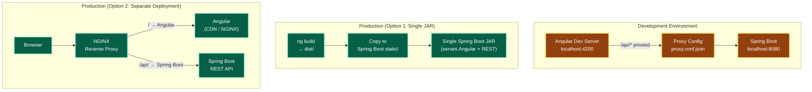

**Development Proxy Configuration:**

```json
// proxy.conf.json
{
  "/api/*": {
    "target": "http://localhost:8080",
    "secure": false,
    "changeOrigin": true
  }
}
```

```json
// angular.json — link proxy config to serve
"serve": {
  "options": {
    "proxyConfig": "proxy.conf.json"
  }
}
```

**CORS Configuration (Spring Boot):**

```java
// Method 1: Annotation
@CrossOrigin(origins = "http://localhost:4200")
@RestController
public class PolicyController { ... }

// Method 2: Global CORS (preferred for production)
@Configuration
public class WebConfig implements WebMvcConfigurer {
  @Override
  public void addCorsMappings(CorsRegistry registry) {
    registry.addMapping("/api/**")
      .allowedOrigins("https://app.company.com")
      .allowedMethods("GET", "POST", "PUT", "DELETE")
      .allowCredentials(true);
  }
}
```

#### Key Takeaways

- Development proxy eliminates CORS during development — no server changes needed.
- Single JAR deployment is simplest; separate deployment scales better.
- Always configure CORS globally in Spring Boot for production — avoid per-controller `@CrossOrigin`.
- In production, NGINX handles SSL termination and routing to both Angular and Spring Boot.

---

### Q45. State Management — When and How

| App Size | Approach | Library |
|---|---|---|
| Small | Service with `BehaviorSubject` | Angular built-in |
| Medium | Signal-based store (Angular 16+) | Angular Signals |
| Large | Redux pattern | NgRx |
| Complex async | Event-driven effects | NgRx Effects |

**Simple Store with BehaviorSubject:**

```typescript
@Injectable({ providedIn: 'root' })
export class PolicyStore {
  private policiesSubject = new BehaviorSubject<Policy[]>([]);
  policies$ = this.policiesSubject.asObservable(); // Expose as Observable

  private loadingSubject = new BehaviorSubject<boolean>(false);
  isLoading$ = this.loadingSubject.asObservable();

  setPolicies(policies: Policy[]) { this.policiesSubject.next(policies); }
  setLoading(loading: boolean) { this.loadingSubject.next(loading); }
  addPolicy(policy: Policy) { this.policiesSubject.next([...this.policiesSubject.value, policy]); }
}
```

**NgRx (Redux Pattern for Large Apps):**

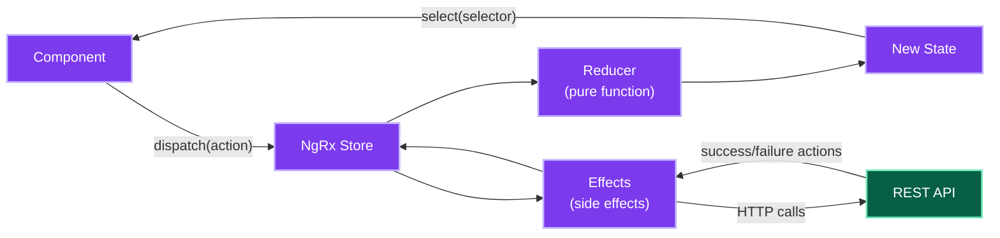

#### Key Takeaways

- Start with `BehaviorSubject` in services — only add NgRx when complexity demands it.
- NgRx provides time-travel debugging, strict unidirectional data flow, and devtools.
- Angular Signals (v16+) offer a lightweight alternative to NgRx for medium-sized apps.
- Always expose `BehaviorSubject` as `.asObservable()` to prevent external mutation.

---

### Q46. Scenario: Debug Slow Angular Application

**Systematic debugging approach:**

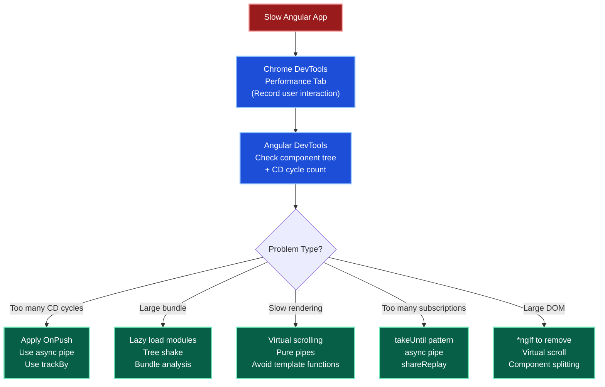

**Debug steps:**
1. Chrome DevTools → Performance tab → record the interaction
2. Angular DevTools → inspect component tree + change detection cycle count
3. Look for: too many CD cycles, large DOM, too many active subscriptions, large bundles
4. Fix: `OnPush`, `trackBy`, lazy loading, virtual scroll, `async` pipe, `shareReplay`

#### Key Takeaways

- Install Angular DevTools Chrome extension — it shows exact CD cycle counts per component.
- A component running CD 100+ times per second indicates a missing `OnPush` or `trackBy`.
- Use `ng.profiler.timeChangeDetection()` in browser console for quick CD timing.

---

### Q47. Scenario: Implement Global Loading Spinner

```typescript
// Loading service
@Injectable({ providedIn: 'root' })
export class LoadingService {
  private activeRequests = 0;
  private loadingSubject = new BehaviorSubject<boolean>(false);
  isLoading$ = this.loadingSubject.asObservable();

  show() { this.activeRequests++; this.loadingSubject.next(true); }
  hide() {
    this.activeRequests = Math.max(0, --this.activeRequests);
    if (this.activeRequests === 0) this.loadingSubject.next(false);
  }
}

// Loading interceptor
@Injectable()
export class LoadingInterceptor implements HttpInterceptor {
  constructor(private loadingService: LoadingService) {}

  intercept(req: HttpRequest<any>, next: HttpHandler): Observable<HttpEvent<any>> {
    this.loadingService.show();
    return next.handle(req).pipe(
      finalize(() => this.loadingService.hide()) // Always hides, even on error
    );
  }
}
```

```html
<!-- App component template -->
<app-spinner *ngIf="loadingService.isLoading$ | async"></app-spinner>
<router-outlet></router-outlet>
```

#### Key Takeaways

- Use `finalize()` — it runs on both success AND error, ensuring the spinner always hides.
- Track active request count to handle parallel requests correctly.
- Use `async` pipe in the template to avoid manual subscription management.

---

### Q48. Scenario: Handle JWT Token Refresh

```typescript
@Injectable()
export class TokenRefreshInterceptor implements HttpInterceptor {
  private isRefreshing = false;
  private refreshToken$ = new BehaviorSubject<string | null>(null);

  constructor(private auth: AuthService) {}

  intercept(req: HttpRequest<any>, next: HttpHandler): Observable<HttpEvent<any>> {
    return next.handle(req).pipe(
      catchError((error: HttpErrorResponse) => {
        if (error.status === 401 && !req.url.includes('/auth/refresh')) {
          return this.handle401(req, next);
        }
        return throwError(() => error);
      })
    );
  }

  private handle401(req: HttpRequest<any>, next: HttpHandler): Observable<HttpEvent<any>> {
    if (!this.isRefreshing) {
      this.isRefreshing = true;
      this.refreshToken$.next(null);

      return this.auth.refreshToken().pipe(
        switchMap(token => {
          this.isRefreshing = false;
          this.refreshToken$.next(token.access);
          return next.handle(this.addToken(req, token.access));
        }),
        catchError(err => {
          this.isRefreshing = false;
          this.auth.logout();
          return throwError(() => err);
        })
      );
    }

    // Queue other requests during refresh
    return this.refreshToken$.pipe(
      filter(token => token !== null),
      take(1),
      switchMap(token => next.handle(this.addToken(req, token!)))
    );
  }

  private addToken(req: HttpRequest<any>, token: string): HttpRequest<any> {
    return req.clone({ setHeaders: { Authorization: `Bearer ${token}` } });
  }
}
```

#### Key Takeaways

- Use `BehaviorSubject` to queue simultaneous 401 requests during token refresh.
- Prevent refresh loop by checking `!req.url.includes('/auth/refresh')`.
- All queued requests resume automatically when `refreshToken$` emits the new token.
- Log out on refresh failure — the refresh token has expired.

---

### Q49. Scenario: Implement Search with Autocomplete

```typescript
export class SearchComponent implements OnInit {
  searchControl = new FormControl('');
  results$!: Observable<SearchResult[]>;

  constructor(private searchService: SearchService) {}

  ngOnInit() {
    this.results$ = this.searchControl.valueChanges.pipe(
      debounceTime(300),           // Wait 300ms after last keystroke
      distinctUntilChanged(),      // Skip if same value
      filter(term => term!.length >= 2), // Minimum search length
      switchMap(term =>            // Cancel previous, start new
        this.searchService.search(term!).pipe(
          catchError(() => of([]))  // Return empty on error
        )
      ),
      shareReplay(1)               // Cache last result
    );
  }
}
```

```html
<input [formControl]="searchControl" placeholder="Search policies...">
<ul>
  <li *ngFor="let result of results$ | async">{{ result.name }}</li>
</ul>
```

#### Key Takeaways

- `switchMap` is **mandatory** for search — it cancels stale HTTP requests.
- Add `filter(term => term.length >= 2)` to avoid trivial searches.
- `catchError(() => of([]))` keeps the stream alive even when search fails.
- Use `async` pipe in template — it auto-unsubscribes when component destroys.

---

### Q50. Standalone Components (Angular 14+)

Standalone components eliminate the need for `NgModule` declarations:

```typescript
// Standalone Component — self-contained
@Component({
  standalone: true,
  selector: 'app-policy-card',
  template: `<div>{{ policy.name }}</div>`,
  imports: [CommonModule, RouterModule] // Import what YOU need
})
export class PolicyCardComponent {
  @Input() policy!: Policy;
}

// Bootstrap with standalone (no AppModule)
// main.ts
bootstrapApplication(AppComponent, {
  providers: [
    provideRouter(routes),
    provideHttpClient(withInterceptors([authInterceptor])),
    provideAnimations()
  ]
});

// Lazy load standalone component
{
  path: 'policies',
  loadComponent: () => import('./policy-list.component').then(c => c.PolicyListComponent)
}
```

**NgModule vs Standalone:**

| | NgModule | Standalone |
|---|---|---|
| **Boilerplate** | High (declare in module) | Low (self-contained) |
| **Available since** | Angular 2 | Angular 14+ |
| **Recommended** | Legacy apps | New apps (Angular 17+) |
| **Lazy loading** | `loadChildren` | `loadComponent` |
| **Testing** | `TestBed.configureTestingModule` | Simpler setup |

#### Key Takeaways

- Standalone components are the **Angular 17+ default** — new projects should use them.
- `bootstrapApplication()` replaces `platformBrowserDynamic().bootstrapModule()`.
- `provideHttpClient()` replaces `HttpClientModule` imports in standalone apps.
- Existing NgModule-based apps can incrementally adopt standalone components.

---

## Quick Reference: All Key Questions

| Q# | Topic | Key Concept |
|---|---|---|
| Q1 | Architecture building blocks | Module, Component, Service, Directive, Pipe, Guard, Interceptor |
| Q2 | Lifecycle hooks | 8 hooks: ngOnInit → ngOnDestroy |
| Q3 | Change Detection | Default (all) vs OnPush (targeted) |
| Q4 | Zone.js | Monkey-patches async APIs; Signals replace it in v16+ |
| Q5 | Dependency Injection | Hierarchical injector; `providedIn: 'root'` for singletons |
| Q6 | NgModule | declarations, imports, providers, exports, bootstrap |
| Q7 | Data Binding | Interpolation, Property, Event, Two-way |
| Q8 | Directives | Structural (`*ngIf`, `*ngFor`) vs Attribute (`[ngClass]`) |
| Q9 | `*ngIf` vs `[hidden]` | DOM removal vs CSS hidden |
| Q10 | `trackBy` | 95% re-render reduction on list changes |
| Q11 | Pipes | Pure vs Impure; `async` pipe for Observables |
| Q12 | ViewChild/ContentChild | Template access vs projected content access |
| Q13 | Observable vs Promise | Lazy, cancellable, multi-value vs eager, single-value |
| Q14 | Subject types | Subject, BehaviorSubject, ReplaySubject, AsyncSubject |
| Q15 | RxJS operators | map, switchMap, mergeMap, catchError, shareReplay |
| Q16 | FlatMap operators | switchMap (search), exhaustMap (login), concatMap (sequential) |
| Q17 | Memory leak prevention | takeUntil, async pipe, unsubscribe in ngOnDestroy |
| Q18 | combineLatest vs forkJoin | Ongoing streams vs one-shot parallel calls |
| Q19 | debounceTime + distinctUntilChanged | Standard search input pattern |
| Q24 | shareReplay | Shared HTTP call, cached result |
| Q25 | Routing | Routes, wildcards, redirects, programmatic navigation |
| Q26 | Route Guards | canActivate, canDeactivate, canLoad, resolve |
| Q27 | Lazy Loading | `loadChildren` reduces initial bundle size |
| Q28 | HTTP Interceptors | JWT injection, error handling, logging chain |
| Q29 | HttpClient | Type-safe GET/POST/PUT/DELETE, HttpParams |
| Q34 | Reactive Forms | FormGroup, FormControl, FormArray, custom validators |
| Q35 | AOT vs JIT | Build-time vs runtime compilation |
| Q36 | Tree Shaking | `providedIn: 'root'` for tree-shakable services |
| Q37 | Performance checklist | OnPush + trackBy + lazy loading + async pipe |
| Q38 | Virtual Scrolling | CDK renders only visible DOM nodes |
| Q39 | XSS + CSRF | Auto-sanitization + `HttpClientXsrfModule` |
| Q44 | Angular + Spring Boot | Proxy (dev) / NGINX (prod) / CORS config |
| Q45 | State Management | BehaviorSubject (small) → NgRx (large) |
| Q47 | Global spinner | `LoadingInterceptor` + `finalize()` |
| Q48 | JWT token refresh | BehaviorSubject queue + switchMap retry |
| Q49 | Search autocomplete | debounceTime + switchMap + catchError |
| Q50 | Standalone Components | Angular 14+ — self-contained, no NgModule needed |

---

> **End of Angular Analysis — 50 Questions**
>
> *Covers Angular 2–17+ | For 7+ Years Full Stack Experience*
