# Java Collections Framework — Comprehensive Interview Preparation Guide

> **Target Audience:** 7+ Years Experience | Java Developer
>
> **Coverage:** List · Set · Map · Queue · Concurrency · Iterators · Generics · Streams · Design Patterns

---

## Table of Contents

| Section | Topic |
|---------|-------|
| [Section 1](#section-1-collections-hierarchy) | Collections Hierarchy |
| [Round 1](#round-1-basic--resume-discussion) | Basic + Resume Discussion (Q1–Q3) |
| [Round 2](#round-2-core-technical-deep-dive) | Core Technical Deep Dive (Q4–Q5) |
| [Round 3](#round-3-advanced--internal-working) | Advanced + Internal Working (Q6–Q7) |
| [Round 4](#round-4-scenario-based--debugging) | Scenario-Based + Debugging (Q8–Q9) |
| [Round 5](#round-5-system-design--architecture) | System Design + Architecture (Q10) |
| [Section 2](#section-2-advanced-collections-deep-dive) | Advanced Collections Deep Dive |
| [Section 3](#section-3-practical-coding-examples) | Practical Coding Examples (25 Snippets) |
| [Section 4](#section-4-interview-edge--senior-level) | Interview Edge — Senior Level |
| [Quick Reference](#quick-reference--cheat-sheets) | Quick Reference + Cheat Sheets |

---

## Section 1: Collections Hierarchy

### Java Collections Framework — Full Hierarchy

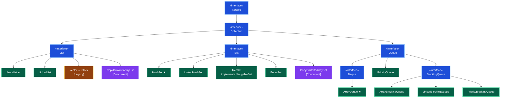

### Map Hierarchy (Separate from Collection)

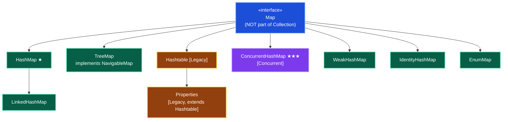

---

## Round 1: Basic + Resume Discussion

### Q1. ArrayList vs LinkedList — Internal Structure

#### Internal Architecture

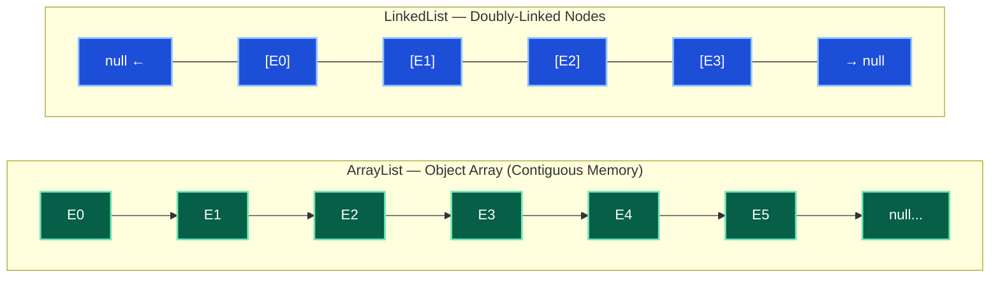

#### Comparison Table

| Feature | ArrayList | LinkedList |
|---|---|---|
| **Backing Structure** | `Object[]` array (contiguous memory) | Doubly-linked nodes (scattered memory) |
| **Default Capacity** | 10 | — (no initial capacity) |
| **Growth Formula** | `oldCapacity + (oldCapacity >> 1)` → 50% growth | N/A |
| **Random Access** | O(1) via index | O(n) — must traverse |
| **Insert at End** | O(1) amortized, O(n) worst (resize) | O(1) |
| **Insert at Middle** | O(n) — shift elements | O(n) find + O(1) insert |
| **Insert at Head/Tail** | O(n) — shift | O(1) |
| **Memory** | Contiguous, CPU cache-friendly | ~40 bytes overhead per node |
| **Implements** | `List` | `List` + `Deque` |
| **Use Case** | Read-heavy (95% of production) | Queue / Deque operations |

#### Code Example

```java
// ArrayList: pre-size for IKEA inventory (50K items, read-heavy)
List<Product> products = new ArrayList<>(500); // pre-size to avoid resizing

// LinkedList: task queue with frequent head/tail operations
Deque<Task> taskQueue = new LinkedList<>();
taskQueue.addFirst(urgentTask);    // O(1)
taskQueue.addLast(normalTask);     // O(1)
Task next = taskQueue.pollFirst(); // O(1)
```

> **Production Scenario:** Loading 50K product items — ArrayList with pre-set capacity outperformed LinkedList by 4x due to cache locality and zero per-element overhead.

#### Key Takeaways

- **ArrayList** is the default choice for 95% of production use cases — cache-friendly and fast for indexed reads.
- **LinkedList** shines only for frequent head/tail insertions — use `ArrayDeque` instead for pure queue/stack needs.
- Pre-size `ArrayList` with `new ArrayList<>(expectedSize)` to avoid costly resizing.
- `LinkedList` implements `Deque` — it doubles as both a list and a queue/stack.

---

### Q2. HashMap vs TreeMap vs LinkedHashMap

| Feature | HashMap | TreeMap | LinkedHashMap |
|---|---|---|---|
| **Order** | No order | Sorted by key (natural/custom) | Insertion order |
| **Null Key** | 1 null key allowed | ❌ No null key | 1 null key allowed |
| **Underlying DS** | Array + LinkedList + Tree | Red-Black Tree | Array + LinkedList + DLL |
| **get / put** | O(1) average | O(log n) | O(1) |
| **Thread-Safe** | ❌ No | ❌ No | ❌ No |
| **Implements** | `Map` | `NavigableMap`, `SortedMap` | `Map` |
| **Use Case** | General-purpose, fastest | Sorted data, range queries | LRU cache, ordered iteration |

**When to use:**
- **HashMap** → General purpose, fastest lookups (policy cache, session store)
- **TreeMap** → Sorted data (date-sorted claims, price range queries)
- **LinkedHashMap** → LRU cache, maintain insertion order

#### LRU Cache with LinkedHashMap

```java
public class LRUCache<K, V> extends LinkedHashMap<K, V> {
    private final int maxSize;

    public LRUCache(int maxSize) {
        super(maxSize, 0.75f, true); // true = access-order (most recent at tail)
        this.maxSize = maxSize;
    }

    @Override
    protected boolean removeEldestEntry(Map.Entry<K, V> eldest) {
        return size() > maxSize; // Auto-evict least recently used
    }
}

// Usage
LRUCache<String, Policy> cache = new LRUCache<>(1000);
```

#### Key Takeaways

- HashMap is O(1) but unordered; TreeMap is O(log n) and sorted; LinkedHashMap is O(1) and ordered.
- TreeMap uses a Red-Black Tree internally — self-balancing BST guaranteeing O(log n).
- `LinkedHashMap(capacity, 0.75f, true)` with `accessOrder=true` enables LRU behavior.
- Neither HashMap nor TreeMap are thread-safe; use `ConcurrentHashMap` for concurrent access.

---

### Q3. HashSet Internals — How It Prevents Duplicates

HashSet is **backed by a HashMap** internally. Set elements are stored as HashMap **keys**; a dummy `PRESENT` object is used as the value.

```java
// Internal implementation (OpenJDK)
private transient HashMap<E, Object> map;
private static final Object PRESENT = new Object();

public boolean add(E e) {
    return map.put(e, PRESENT) == null; // returns null → new entry → no duplicate
}
```

#### Duplicate Prevention Flow

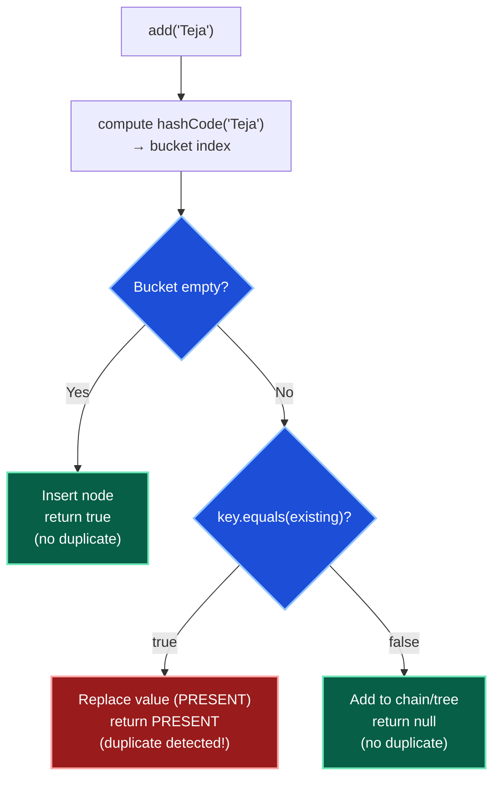

> **CRITICAL:** For custom objects in `HashSet` / as `HashMap` keys, you **MUST** override both `hashCode()` AND `equals()`.

```java
public class Employee {
    private int id;
    private String name;

    @Override
    public int hashCode() {
        return Objects.hash(id); // id-based hash
    }

    @Override
    public boolean equals(Object obj) {
        if (this == obj) return true;
        if (!(obj instanceof Employee)) return false;
        return this.id == ((Employee) obj).id;
    }
}
```

#### Key Takeaways

- `HashSet` is literally a `HashMap` with dummy values — no separate implementation.
- `add()` returns `true` if element was new, `false` if it was a duplicate.
- Without proper `hashCode()`, logically equal objects land in different buckets → HashSet fails.
- Make HashMap keys **immutable** — if key fields change after `put()`, lookups will fail.

---

## Round 2: Core Technical Deep Dive

### Q4. ConcurrentHashMap — Internal Working (Java 8+)

#### Java 7 vs Java 8 Architecture

| | Java 7 | Java 8+ |
|---|---|---|
| **Locking Model** | Segment-based (16 segments) | CAS + synchronized per-bucket-head |
| **Granularity** | Segment (1/16 of table) | Individual bucket node |
| **`get()` locks?** | No | No (volatile reads) |
| **`put()` - empty bucket** | Acquires segment lock | CAS (Compare-And-Swap) — no lock! |
| **`put()` - occupied bucket** | Acquires segment lock | `synchronized` on head node only |
| **Tree conversion** | No | Yes — at `TREEIFY_THRESHOLD` (8) |
| **`size()`** | Sums segment counts | LongAdder-like counter cells |

#### Java 8 put() Operation Flow

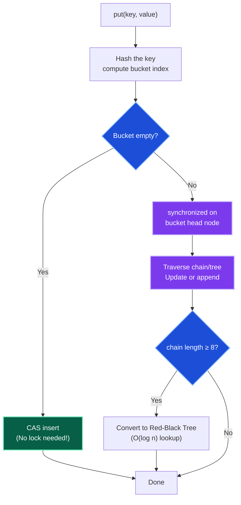

#### Performance Comparison (100 Threads, 1M Operations)

| Implementation | Time | Approach |
|---|---|---|
| `ConcurrentHashMap` | ~120ms | Fine-grained locking (per bucket) |
| `Collections.synchronizedMap` | ~800ms | Full table lock |
| `Hashtable` | ~850ms | Full table lock (legacy) |

#### Why NOT Hashtable or synchronizedMap?

- **Hashtable:** Locks the **entire table** for any operation → bottleneck under concurrency.
- **synchronizedMap:** Same table-level locking issue as Hashtable.
- **ConcurrentHashMap:** Fine-grained CAS/bucket-level locking → high throughput.

```java
// Production usage (Insurance Claims)
ConcurrentHashMap<String, ClaimStatus> activeClaimsMap =
    new ConcurrentHashMap<>(10000);

// Atomic compute — no race condition
activeClaimsMap.computeIfAbsent(claimId, id -> claimService.loadClaimStatus(id));

// Atomic merge (frequency counter)
activeClaimsMap.merge(claimId, 1, Integer::sum);
```

#### Key Takeaways

- `get()` in `ConcurrentHashMap` is **always lock-free** — uses `volatile` reads.
- CAS insert on empty buckets avoids locking for the common case.
- Java 8 eliminated the heavy `Segment` class — lower memory overhead.
- Use `computeIfAbsent`, `merge`, `compute` for atomic updates instead of manual `containsKey`+`put`.

---

### Q5. Comparable vs Comparator — When and Why

| Feature | Comparable | Comparator |
|---|---|---|
| **Package** | `java.lang` | `java.util` |
| **Method** | `compareTo(T o)` | `compare(T o1, T o2)` |
| **Ordering** | Single natural order | Multiple custom orders |
| **Modifies class?** | Yes — class implements interface | No — external to class |
| **Java 8 support** | `default` and `static` methods | Lambda, Method Reference |
| **Used by** | `Collections.sort()`, `Arrays.sort()` | `Collections.sort()`, `TreeMap`, `TreeSet` |

```java
// Comparable — natural ordering by ID (built into class)
public class Employee implements Comparable<Employee> {
    private int id;
    private String name;
    private double salary;

    @Override
    public int compareTo(Employee other) {
        return Integer.compare(this.id, other.id);
    }
}

// Comparator — multiple external orderings (Java 8 style)
Comparator<Employee> byName        = Comparator.comparing(Employee::getName);
Comparator<Employee> bySalaryDesc  = Comparator.comparingDouble(Employee::getSalary).reversed();
Comparator<Employee> byNameThenSal = byName.thenComparingDouble(Employee::getSalary);

// Usage
employees.sort(bySalaryDesc);
TreeMap<Employee, String> sortedMap = new TreeMap<>(byName);
```

#### Multi-Key Sort (3 Fields)

```java
// Sort employees: by department ASC, then salary DESC, then name ASC
employees.sort(
    Comparator.comparing(Employee::getDepartment)
              .thenComparing(Comparator.comparingDouble(Employee::getSalary).reversed())
              .thenComparing(Employee::getName)
);
```

#### Key Takeaways

- Use `Comparable` for the object's **natural order** (e.g., Employee by ID).
- Use `Comparator` for **ad-hoc or multiple orderings** without modifying the class.
- Prefer `Comparator.comparing()` + `.thenComparing()` chains over anonymous class implementations.
- `TreeSet`/`TreeMap` use `Comparable` by default; pass a `Comparator` to override.

---

## Round 3: Advanced + Internal Working

### Q6. Fail-Fast vs Fail-Safe Iterators

| Feature | Fail-Fast | Fail-Safe |
|---|---|---|
| **Exception** | Throws `ConcurrentModificationException` | Never throws CME |
| **Works on** | Original collection | Snapshot / copy |
| **Detection** | `modCount != expectedModCount` | No modCount check |
| **Used by** | `ArrayList`, `HashMap`, `HashSet`, `LinkedList` | `ConcurrentHashMap`, `CopyOnWriteArrayList` |
| **Reflects latest changes?** | Yes | May not (snapshot) |

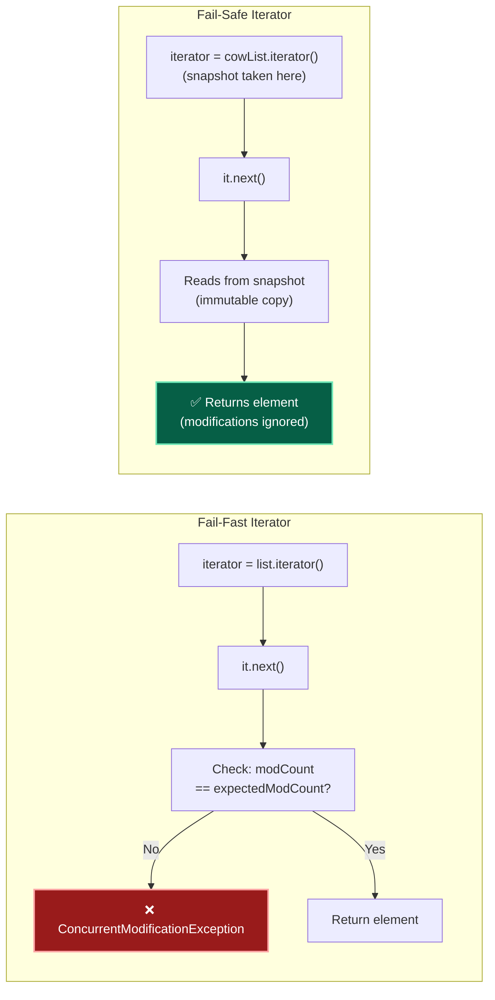

#### Code Examples

```java
// ❌ Fail-Fast — throws ConcurrentModificationException
List<String> list = new ArrayList<>(Arrays.asList("A", "B", "C"));
Iterator<String> it = list.iterator();
while (it.hasNext()) {
    String s = it.next();
    list.add("D"); // structural modification → CME on next it.next()!
}

// ✅ Solution 1: Use iterator.remove()
Iterator<String> it2 = list.iterator();
while (it2.hasNext()) {
    if (it2.next().equals("B")) it2.remove(); // Safe!
}

// ✅ Solution 2: Java 8 removeIf()
list.removeIf(s -> s.equals("B")); // Internally uses iterator.remove()

// ✅ Solution 3: CopyOnWriteArrayList (fail-safe)
List<String> safeList = new CopyOnWriteArrayList<>(list);
for (String s : safeList) {
    safeList.add("D"); // No exception! Iterator works on snapshot.
}
```

> **Production Scenario:** In an event notification system, concurrent modification of a listener list caused CME. Fixed by using `CopyOnWriteArrayList` for the listener registry — listeners change rarely, iteration happens frequently.

#### Key Takeaways

- Never structurally modify (add/remove) a collection inside a `for-each` loop — use `removeIf()` or `iterator.remove()`.
- `CopyOnWriteArrayList` is ideal for listener lists — low write frequency, high read frequency.
- `ConcurrentHashMap`'s iterator is **weakly consistent** — not a strict snapshot but never throws CME.
- `modCount` is an internal counter incremented on every structural modification.

---

### Q7. BlockingQueue — Types and Usage

`BlockingQueue` is a **thread-safe queue** with blocking `put()`/`take()` operations — the backbone of the Producer-Consumer pattern.

| Type | Bounded? | Backing | Best For |
|---|---|---|---|
| `ArrayBlockingQueue` | ✅ Yes | Array | Bounded producer-consumer |
| `LinkedBlockingQueue` | Optional | Linked nodes | High-throughput pipelines |
| `PriorityBlockingQueue` | ❌ No | Binary heap | Priority-ordered processing |
| `SynchronousQueue` | Zero capacity | — | Direct thread handoff |
| `DelayQueue` | ❌ No | Heap | Scheduled task execution |

#### Producer-Consumer Pattern

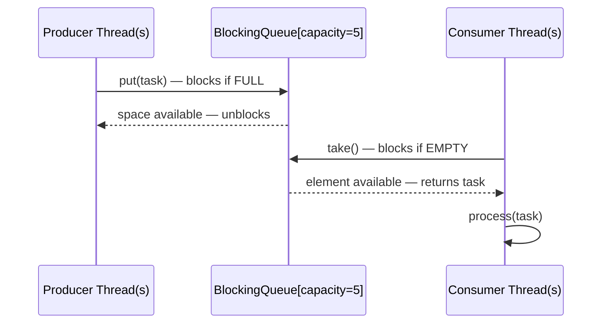

```java
BlockingQueue<Task> queue = new ArrayBlockingQueue<>(100);

// Producer thread
public void produce(Task task) throws InterruptedException {
    queue.put(task); // Blocks if queue is full!
}

// Consumer thread
public void consume() throws InterruptedException {
    Task task = queue.take(); // Blocks if queue is empty!
    task.process();
}

// Full example
public void testProducerConsumer() {
    BlockingQueue<Integer> queue = new ArrayBlockingQueue<>(5);

    Runnable producer = () -> {
        try {
            for (int i = 1; i <= 10; i++) {
                System.out.println("Produced: " + i);
                queue.put(i);       // Blocks at capacity 5
                Thread.sleep(100);
            }
        } catch (InterruptedException e) { Thread.currentThread().interrupt(); }
    };

    Runnable consumer = () -> {
        try {
            while (true) {
                Integer val = queue.take(); // Blocks if empty
                System.out.println("Consumed: " + val);
                Thread.sleep(300);  // Consumer slower than producer
            }
        } catch (InterruptedException e) { Thread.currentThread().interrupt(); }
    };

    new Thread(producer).start();
    new Thread(consumer).start();
}
```

#### Key Takeaways

- `BlockingQueue` eliminates the need for manual `wait()`/`notify()` in producer-consumer patterns.
- `put()` blocks when queue is full; `take()` blocks when queue is empty — backpressure built-in.
- `offer()` and `poll()` are non-blocking alternatives with timeout variants.
- Prefer `ArrayBlockingQueue` when you need to bound memory usage; `LinkedBlockingQueue` for max throughput.

---

## Round 4: Scenario-Based + Debugging

### Q8. Handling 1M Records — Which Collection and Why?

**Strategy: Choose by access pattern.**

| Scenario | Collection | Configuration | Reason |
|---|---|---|---|
| Key-value lookup (cache) | `ConcurrentHashMap` | `new ConcurrentHashMap<>(1_500_000, 0.75f, 16)` | Pre-size to avoid rehashing |
| Sequential processing | `ArrayList` | `new ArrayList<>(1_000_000)` | Cache-friendly, batch-friendly |
| Sorted / range queries | `TreeMap` | Default | O(log n) range operations |
| Unique elements, fast `contains()` | `HashSet` | `new HashSet<>((int)(1_000_000 / 0.75) + 1)` | O(1) contains |

#### Memory Overhead at 1M Records

| Collection | Overhead |
|---|---|
| `ArrayList` | ~4 MB (reference array only) |
| `LinkedList` | ~40 MB (Node objects with prev/next) |
| `HashMap` | ~48 MB (Entry objects + array) |

#### Batch Processing Pattern

```java
List<Policy> policies = loadPolicies(); // 1M records

int batchSize = 10_000;
for (int i = 0; i < policies.size(); i += batchSize) {
    List<Policy> batch = policies.subList(i,
        Math.min(i + batchSize, policies.size()));
    processBatch(batch); // Process in DB batches — avoids OOM
}
```

#### Pre-Sizing Formula

```java
// ConcurrentHashMap: targetSize / loadFactor = initial capacity
// 1_000_000 / 0.75 ≈ 1_333_334 → round up to 1_500_000
ConcurrentHashMap<String, ClaimStatus> map =
    new ConcurrentHashMap<>(1_500_000, 0.75f, 16);

// HashSet: same formula
HashSet<String> uniqueIds = new HashSet<>((int)(1_000_000 / 0.75) + 1);
```

#### Key Takeaways

- **Always pre-size** large collections to avoid expensive resize/rehash operations.
- Use `subList()` + batch processing for large lists to control memory footprint.
- For 1M records sorted, prefer DB indexing + pagination over in-memory `TreeMap`.
- Pre-sizing formula: `initialCapacity = targetSize / loadFactor + 1`.

---

### Q9. Why Must equals() and hashCode() Be Overridden Together?

#### The Contract (Java Specification)

```text
1. If a.equals(b) == true  →  a.hashCode() == b.hashCode()  [MUST be satisfied]
2. If a.hashCode() == b.hashCode()  →  a.equals(b) may or may not be true  [collision OK]
```

#### Breaking the Contract

```java
// ❌ Only equals overridden — hashCode is default (memory-address based)
public class Employee {
    int id; String name;

    @Override
    public boolean equals(Object o) {
        if (!(o instanceof Employee)) return false;
        return this.id == ((Employee) o).id;
    }
    // Missing hashCode override!
}

Employee e1 = new Employee(1, "Teja");
Employee e2 = new Employee(1, "Teja");

e1.equals(e2);          // true — correct

Set<Employee> set = new HashSet<>();
set.add(e1);
set.contains(e2);       // FALSE! e1 and e2 have different default hashCodes
                         // → different buckets → never found
```

#### The Fix

```java
// ✅ Correct — both overridden consistently
public class Employee {
    private final int id;   // Use final for HashMap keys
    private final String name;

    Employee(int id, String name) { this.id = id; this.name = name; }

    @Override
    public boolean equals(Object object) {
        if (this == object) return true;
        if (!(object instanceof Employee)) return false;
        Employee other = (Employee) object;
        return id == other.id && Objects.equals(name, other.name);
    }

    @Override
    public int hashCode() {
        return Objects.hash(id, name); // Consistent with equals
    }
}

// Now works correctly
Set<Employee> set = new HashSet<>();
set.add(new Employee(1, "Teja"));
set.add(new Employee(1, "Teja")); // Detected as duplicate
System.out.println(set.size()); // 1 ✅
```

#### Key Takeaways

- Violating the contract causes silent, hard-to-debug failures in `HashSet`, `HashMap`, `LinkedHashMap`.
- Use `Objects.hash(field1, field2)` — simple, consistent, null-safe.
- Make HashMap keys **immutable** (`final` fields) — mutable keys that change after `put()` make entries unreachable.
- IDE-generated `equals`/`hashCode` (IntelliJ, Eclipse) or Lombok's `@EqualsAndHashCode` are safe alternatives.

---

## Round 5: System Design + Architecture

### Q10. Thread-Safe Bounded LRU Cache — Design

**Implementation: `LinkedHashMap` + `ReentrantReadWriteLock`**

```java
public class ThreadSafeLRUCache<K, V> {
    private final int maxSize;
    private final Map<K, V> cache;
    private final ReadWriteLock lock = new ReentrantReadWriteLock();

    public ThreadSafeLRUCache(int maxSize) {
        this.maxSize = maxSize;
        this.cache = new LinkedHashMap<K, V>(maxSize, 0.75f, true) {
            @Override
            protected boolean removeEldestEntry(Map.Entry<K, V> eldest) {
                return size() > maxSize; // Auto-evict LRU entry
            }
        };
    }

    public V get(K key) {
        lock.readLock().lock();
        try {
            return cache.get(key); // Also moves entry to "most recently used" position
        } finally {
            lock.readLock().unlock();
        }
    }

    public void put(K key, V value) {
        lock.writeLock().lock();
        try {
            cache.put(key, value); // Triggers removeEldestEntry if over capacity
        } finally {
            lock.writeLock().unlock();
        }
    }

    public int size() {
        lock.readLock().lock();
        try { return cache.size(); }
        finally { lock.readLock().unlock(); }
    }
}
```

#### LRU Cache Operation Flow

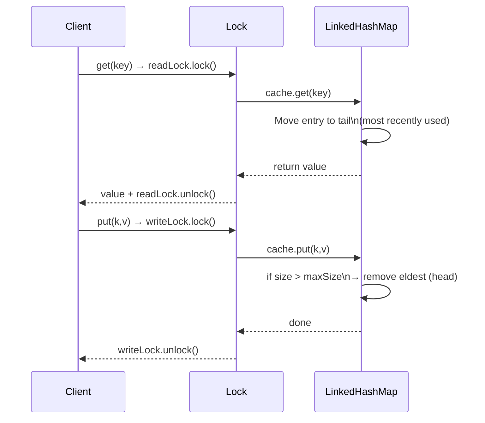

#### Production Alternatives

| Option | Complexity | Thread-Safety | Best For |
|---|---|---|---|
| `LinkedHashMap` + `synchronized` | Low | Full table lock | Low-concurrency |
| `LinkedHashMap` + `ReadWriteLock` | Medium | Read-concurrent | Read-heavy |
| `ConcurrentHashMap` + `ConcurrentLinkedDeque` | High | Lock-free reads | High-concurrency |
| **Caffeine** library | None (use as-is) | Optimal | Production-grade |

#### Key Takeaways

- `ReadWriteLock` allows multiple concurrent readers — use when reads >> writes.
- `LinkedHashMap(cap, 0.75f, true)` with `accessOrder=true` is the key to LRU semantics.
- `removeEldestEntry()` is called by `put()` automatically — no manual eviction needed.
- For true production LRU caches, use **Caffeine** — near-optimal throughput with `W-TinyLFU` eviction.

---

## Section 2: Advanced Collections Deep Dive

### 1. Advanced Map Implementations

#### IdentityHashMap vs HashMap

| Feature | HashMap | IdentityHashMap |
|---|---|---|
| **Key equality** | `equals()` — logical equality | `==` — reference equality |
| **Two logically equal objects** | Treated as same key | Treated as DIFFERENT keys |
| **Use case** | General-purpose | Serialization, deep-copy, topology tracking |

```java
Map<String, Integer> identity = new IdentityHashMap<>();
String a = new String("key");
String b = new String("key");  // Different object, same value

a.equals(b);    // true (same content)
a == b;         // false (different reference)

identity.put(a, 1);
identity.put(b, 2); // Different key! Both entries coexist.
System.out.println(identity.size()); // 2 (not 1!)
```

#### WeakHashMap — GC-Friendly Cache

| | HashMap | WeakHashMap |
|---|---|---|
| **GC behavior** | Key is a strong reference → GC WON'T collect it | Key is a `WeakReference` → GC CAN collect it |
| **Memory leak risk** | Yes — prevents GC of keys | No — keys auto-evicted when unreferenced |
| **Use case** | General purpose | Caches where entries should expire naturally |

```java
// GC dominates WeakHashMap — entries auto-removed when key becomes unreachable
WeakHashMap<Object, String> cache = new WeakHashMap<>();
Object key = new Object(); // strong reference
cache.put(key, "metadata");

key = null; // remove strong reference
System.gc();  // GC may collect the key
// Entry is auto-removed from WeakHashMap after GC
```

> **Memory Leak Warning:** Using a `HashMap` as a cache where keys are no longer referenced externally is a **classic memory leak** — the map's strong reference prevents GC from collecting those objects.

#### Hashtable vs Properties

| | Hashtable | Properties |
|---|---|---|
| **Thread-safe** | Yes (fully synchronized) | Yes (inherits) |
| **Key/Value types** | Any `Object` | `String` only |
| **Null allowed** | ❌ No | ❌ No |
| **Use case** | Avoid — use `ConcurrentHashMap` | Config files (`.properties`) |

```java
// Properties — load config
Properties props = new Properties();
try (InputStream is = getClass().getResourceAsStream("/application.properties")) {
    props.load(is);
}
String dbUrl = props.getProperty("database.url", "jdbc:h2:mem:test");
```

#### Key Takeaways

- `IdentityHashMap` is used by Java serialization frameworks to detect circular references.
- `WeakHashMap` is ideal for metadata caches tied to the lifecycle of their keys.
- **Avoid `Hashtable`** — use `ConcurrentHashMap` for thread-safe maps.
- `Properties` is only for `String`-keyed config data — load from classpath or filesystem.

---

### 2. TreeSet / TreeMap — NavigableSet / NavigableMap Methods

`TreeSet` and `TreeMap` are backed by a **Red-Black Tree (self-balancing BST)** and excel at range-based lookups — all O(log n).

| Method (TreeSet/TreeMap) | Description | Example (Set = [25, 50, 75, 100, 125, 150]) |
|---|---|---|
| `ceiling(e)` | Least element **≥ e** | `ceiling(60)` → 75 |
| `floor(e)` | Greatest element **≤ e** | `floor(60)` → 50 |
| `higher(e)` | Least element **> e** (strict) | `higher(100)` → 125 |
| `lower(e)` | Greatest element **< e** (strict) | `lower(100)` → 75 |
| `headMap(k)` / `headSet(e)` | All entries **< k** | `headMap(75)` → {25, 50} |
| `tailMap(k)` / `tailSet(e)` | All entries **≥ k** | `tailMap(75)` → {75, 100, 125, 150} |
| `subMap(from, to)` | Range: `from` (inclusive) to `to` (exclusive) | `subMap(50, 100)` → {50, 75} |

```java
// TreeMap range queries
TreeMap<Integer, String> map = new TreeMap<>();
map.put(10, "A"); map.put(20, "B"); map.put(30, "C");

System.out.println(map.floorKey(25));    // 20
System.out.println(map.ceilingKey(25));  // 30
System.out.println(map.lowerKey(20));    // 10
System.out.println(map.higherKey(20));   // 30
System.out.println(map.subMap(10, 30));  // {10=A, 20=B}
System.out.println(map.headMap(25));     // {10=A, 20=B}
System.out.println(map.tailMap(20));     // {20=B, 30=C}
```

#### Key Takeaways

- `floor`/`ceiling`/`lower`/`higher` are O(log n) — far faster than iterating.
- `subMap`, `headMap`, `tailMap` return **live views** — modifications reflect in the original.
- Use `TreeMap` for time-series data, price ranges, or any data requiring sorted + range access.

---

### 3. Iterators — Complete Reference

#### Iterator Family

| Iterator | Direction | Supports | Works With |
|---|---|---|---|
| `Enumeration` (legacy) | Forward only | `hasMoreElements()`, `nextElement()` | `Vector`, `Hashtable`, `Stack` |
| `Iterator` | Forward only | `hasNext()`, `next()`, `remove()` | All `Collection` implementations |
| `ListIterator` | **Bidirectional** | + `hasPrevious()`, `previous()`, `add()`, `set()` | `List` implementations only |

```java
// ListIterator — bidirectional + modify during iteration
List<String> list = new ArrayList<>(Arrays.asList("A", "B", "C"));
ListIterator<String> lit = list.listIterator(list.size()); // start at end

// Traverse backwards
while (lit.hasPrevious()) {
    System.out.print(lit.previous() + " "); // C B A
}

// Modify during iteration
ListIterator<String> lit2 = list.listIterator();
while (lit2.hasNext()) {
    String s = lit2.next();
    if (s.equals("B")) lit2.set("MODIFIED"); // Replace in place
}
```

#### Key Takeaways

- `Enumeration` is legacy — never use in new code.
- Only `ListIterator` supports `add()` and `set()` during iteration — `Iterator` only supports `remove()`.
- Use `iterator.remove()` or `list.removeIf()` to safely remove elements during traversal.

---

### 4. Generics and Type Safety

Before Java 1.5, Collections held raw `Object` references. Without compiler-enforced types, developers had to manually cast objects, leading to frequent runtime `ClassCastException` bugs.

```java
// Pre-Generics (Java 1.4) — Unsafe & Error-Prone
List list = new ArrayList();
list.add("Hello");
list.add(42);                        // No compile-time warning/error!
String s = (String) list.get(1);     // Throws ClassCastException at runtime!

// With Generics (Java 5+) — Type-Safe
List<String> typedList = new ArrayList<>();
typedList.add("Hello");
typedList.add(42);                   // ❌ Compile-time error: type-safety caught early!
```

---

### Generic Classes, Interfaces, and Methods

Generics allow classes, interfaces, and methods to operate on parameterized types. This makes code reusable and type-safe.

#### 1. Generic Class & Interface
You can define multiple type parameters (e.g., `<K, V>`, `<T, ID>`) using standard naming conventions:
- `T` for Type, `E` for Element, `K` for Key, `V` for Value, and `N` for Number.

```java
// Generic Interface
public interface Repository<T, ID> {
    void save(T entity);
    T findById(ID id);
}

// Generic Implementation
public class DbRepository<T, ID> implements Repository<T, ID> {
    private final Map<ID, T> storage = new HashMap<>();

    @Override
    public void save(T entity) {
        // Assume entity has an ID mapper
    }

    @Override
    public T findById(ID id) {
        return storage.get(id);
    }
}
```

#### 2. Generic Method
A generic method introduces its own type parameters, declared **before** the method's return type. This is independent of whether the enclosing class is generic.

```java
public class CollectionUtils {
    // Generic static method
    public static <T> void swap(T[] array, int i, int j) {
        T temp = array[i];
        array[i] = array[j];
        array[j] = temp;
    }
}
```

---

### Subtyping and Variance

One of the most common pitfalls in Java Generics is assuming that if `Integer` extends `Number`, then `List<Integer>` is a subtype of `List<Number>`. This is **false**.

#### 1. Invariance
Generic type parameters in Java are **invariant**. They must match exactly.
```java
// ❌ Compile Error: Incompatible Types
List<Number> numbers = new ArrayList<Integer>(); 
```
*Why?* If Java allowed this, you could add a `Double` to `numbers` (since a `Double` is a `Number`), which would corrupt the underlying `ArrayList<Integer>`.

#### 2. Covariance (`? extends T`)
Covariance uses an **upper bound** wildcard. It represents a type that is a subtype of `T` (including `T` itself).
```java
// ✅ Allowed: List of Integer is covariant with ? extends Number
List<? extends Number> numbers = new ArrayList<Integer>();
```
- **Read Semantics**: Safe. Any element read is guaranteed to be at least a `Number` (can be cast to `Number` safely).
- **Write Semantics**: **Read-Only**. You cannot write elements to a covariant list (except `null`) because the compiler cannot verify the exact subtype of `Number` the list contains (e.g., it might be a list of `Double`, so writing an `Integer` is unsafe).

#### 3. Contravariance (`? super T`)
Contravariance uses a **lower bound** wildcard. It represents a type that is a supertype of `T` (including `T` itself).
```java
// ✅ Allowed: List of Number is contravariant with ? super Integer
List<? super Integer> integers = new ArrayList<Number>();
```
- **Read Semantics**: Limited. Elements read from the list are returned as `Object` since the compiler only knows that the list contains some supertype of `Integer` (which could be `Object`).
- **Write Semantics**: Safe. You can safely write `Integer` objects (or subclasses of `Integer`) into this list.

---

### Type Bounds Hierarchy & Wildcards

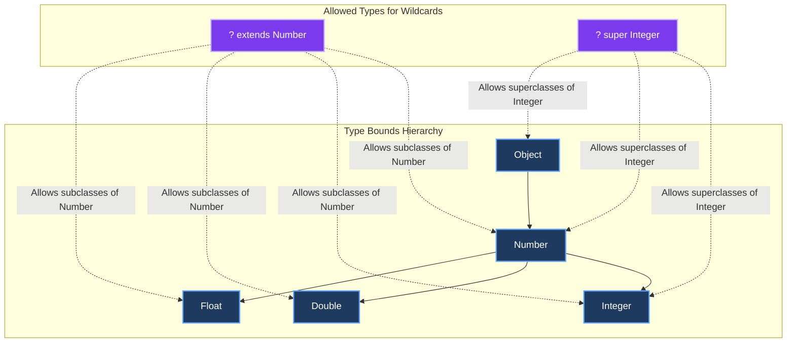

---

### The PECS Rule: Producer Extends, Consumer Super

To decide when to use upper-bound or lower-bound wildcards, remember the **PECS** guideline:
- **Producer Extends (`? extends T`)**: If your collection *produces* data (you read from it), use `? extends`.
- **Consumer Super (`? super T`)**: If your collection *consumes* data (you write to it), use `? super`.

#### PECS Decision Flowchart

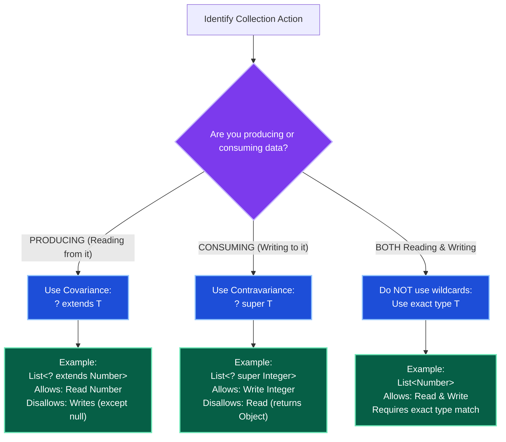

#### Practical PECS Pipeline Example
This utility method copies numbers from a source list (producer) to a destination list (consumer):

```java
public class CollectionsPipeline {
    public static <T extends Number> void copy(List<? extends T> src, List<? super T> dest) {
        for (T element : src) { // src is a PRODUCER -> extends
            dest.add(element);  // dest is a CONSUMER -> super
        }
    }

    public static void main(String[] args) {
        List<Integer> integers = Arrays.asList(1, 2, 3);
        List<Number> numbers = new ArrayList<>();
        
        // Src (List<Integer>) fits ? extends Number
        // Dest (List<Number>) fits ? super Number
        copy(integers, numbers); 
        System.out.println(numbers); // [1, 2, 3]
    }
}
```

---

### Type Erasure and Reification

Java generics are implemented using **Type Erasure** to maintain backward compatibility with legacy raw types (pre-Java 5).

#### The Compilation Lifecycle
1. The compiler checks type constraints at compile-time.
2. The compiler **erases** all type parameters in bytecode (replacing them with their first bound, or `Object` if unbound).
3. The compiler inserts implicit casts back to the original types and generates bridge methods to preserve polymorphism.

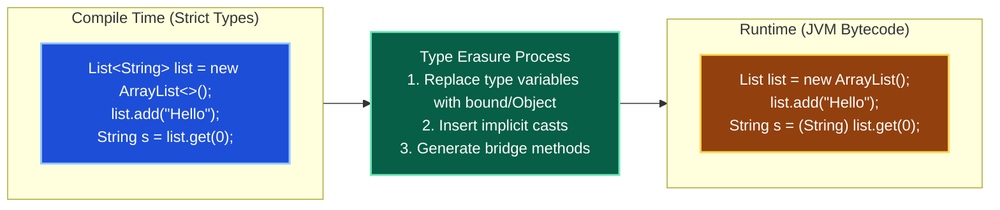

#### Reified vs Non-Reified Types
- **Reified Types**: Fully present at runtime. Arrays (`Integer[]`, `String[]`) are reified — they know their component type at runtime and throw an `ArrayStoreException` if you insert the wrong type.
- **Non-Reified Types**: Erased at runtime. Generics (`List<Integer>`, `List<String>`) are non-reified — the runtime JVM cannot distinguish between `List<Integer>` and `List<String>`.

#### Limitations Caused by Type Erasure
Due to erasure, you **cannot** perform the following actions:
1. **Primitive Parameters**: No `List<int>` is allowed. You must use wrapper classes (`List<Integer>`).
2. **Instantiate Type Parameter**: `new T()` is a compile error because the compiler doesn't know what class constructor to call at runtime.
3. **Instantiate Arrays of Generics**: `new T[10]` or `new List<String>[10]` is illegal because arrays require runtime type knowledge, whereas generics are erased.
4. **Runtime Type Checks**: `list instanceof List<String>` is illegal. Use `list instanceof List<?>`.
5. **Static Contexts**: You cannot use instance-level type parameters in static variables or static methods.

---

### Advanced Generic Concepts

#### 1. Multiple Bounds
A type parameter can have multiple bounds. The bound rules are:
- You use the `&` operator (e.g., `T extends A & B`).
- The first bound **must** be a class (if present); all subsequent bounds **must** be interfaces.

```java
// T must be a subclass of Number AND implement Comparable
public class SortedMetrics<T extends Number & Comparable<T>> {
    private final List<T> values = new ArrayList<>();

    public void addValue(T val) {
        values.add(val);
        Collections.sort(values);
    }
}
```

#### 2. Wildcard Capture & Helper Methods
Sometimes a compiler cannot infer the exact type when dealing with wildcards, resulting in a **capture helper compile error** (e.g., `capture of ?`). You can resolve this using a generic helper method to capture the wildcard type.

```java
public class CaptureHelperPattern {
    public static void reverse(List<?> list) {
        reverseHelper(list); // Wildcard captured as 'T'
    }

    // Generic helper method captures the type parameter
    private static <T> void reverseHelper(List<T> list) {
        int size = list.size();
        for (int i = 0; i < size / 2; i++) {
            T temp = list.get(i);
            list.set(i, list.get(size - i - 1));
            list.set(size - i - 1, temp);
        }
    }
}
```

---

### Key Takeaways

- **Compile-Time Safety Only**: Generics are a compiler feature. At runtime, they are erased, and raw bytecode is executed.
- **PECS Rule**: Use `? extends` when reading elements from a structure. Use `? super` when writing elements to it.
- **Invariance**: A list of subclasses is *not* a subclass of the list (`List<Integer>` is not a `List<Number>`).
- **No Generic Arrays**: You cannot create generic arrays due to the mismatch between reified arrays and erased generic types. Use lists or safe type-casting configurations.

---

## Section 3: Practical Coding Examples

### Collection Sorting & Transformation

#### 1. Sort Map by Value (Java 8+)

```java
public Map<String, Integer> sortMapByValue(Map<String, Integer> unsortedMap) {
    // Sort ASCENDING — collect into LinkedHashMap to preserve order
    return unsortedMap.entrySet().stream()
        .sorted(Map.Entry.comparingByValue())
        // .sorted(Map.Entry.<String, Integer>comparingByValue().reversed()) // DESCENDING
        .collect(Collectors.toMap(
            Map.Entry::getKey,
            Map.Entry::getValue,
            (existing, replacement) -> existing,
            LinkedHashMap::new // MUST use LinkedHashMap to maintain sorted order
        ));
}

// Output for {Apple=50, Orange=20, Banana=80, Grapes=40}:
// {Orange=20, Grapes=40, Apple=50, Banana=80}
```

#### 2. TreeMap with Custom Comparator

```java
// Reverse alphabetical order
TreeMap<String, Integer> reverseMap = new TreeMap<>(Comparator.reverseOrder());
reverseMap.put("Apple", 1); reverseMap.put("Zebra", 2); reverseMap.put("Mango", 3);
System.out.println(reverseMap); // {Zebra=2, Mango=3, Apple=1}

// Custom: sort by String length
TreeMap<String, Integer> lengthMap =
    new TreeMap<>((s1, s2) -> Integer.compare(s1.length(), s2.length()));
lengthMap.put("Programming", 1); lengthMap.put("Java", 2); lengthMap.put("Architecture", 3);
System.out.println(lengthMap.keySet()); // [Java, Programming, Architecture]
```

#### 3. Word Frequency (Three Approaches)

```java
String[] words = {"java", "spring", "java", "kafka", "spring", "java"};

// Approach 1: getOrDefault
Map<String, Integer> freq1 = new HashMap<>();
for (String word : words) {
    freq1.put(word, freq1.getOrDefault(word, 0) + 1);
}

// Approach 2: compute (Java 8) — more expressive
Map<String, Integer> freq2 = new HashMap<>();
for (String word : words) {
    freq2.compute(word, (k, v) -> (v == null) ? 1 : v + 1);
}

// Approach 3: merge — cleanest
Map<String, Integer> freq3 = new HashMap<>();
for (String word : words) {
    freq3.merge(word, 1, Integer::sum);
}

// Approach 4: Streams + groupingBy (best for interview)
Map<String, Long> freq4 = Arrays.stream(words)
    .collect(Collectors.groupingBy(Function.identity(), Collectors.counting()));
// Output: {spring=2, java=3, kafka=1}
```

---

### Concurrent Collections

#### 4. ConcurrentHashMap — Atomic Operations

```java
ConcurrentHashMap<String, Integer> map = new ConcurrentHashMap<>();
map.put("Apple", 10);

// computeIfAbsent: atomic "put if missing"
map.computeIfAbsent("Banana", k -> 50); // {Apple=10, Banana=50}

// computeIfPresent: atomic "update if present"
map.computeIfPresent("Apple", (k, v) -> v + 20); // Apple: 10+20=30

// merge: atomic "compute or initialize"
map.merge("Apple", 15, Integer::sum); // Apple: 30+15=45

System.out.println(map); // {Apple=45, Banana=50}
```

#### 5. Fail-Fast vs Fail-Safe Demo

```java
// Fail-Fast (ArrayList)
List<Integer> failFast = new ArrayList<>(Arrays.asList(10, 20, 30));
try {
    for (Integer value : failFast) {
        if (value == 20) failFast.add(99); // ❌ ConcurrentModificationException
    }
} catch (ConcurrentModificationException e) {
    System.out.println("Fail-fast triggered");
}

// Fail-Safe (CopyOnWriteArrayList)
CopyOnWriteArrayList<Integer> failSafe =
    new CopyOnWriteArrayList<>(Arrays.asList(10, 20, 30));
for (Integer value : failSafe) {
    if (value == 20) failSafe.add(99); // ✅ Safe — iterates on snapshot
}
System.out.println(failSafe); // [10, 20, 30, 99]
```

---

### Data Structure Problems

#### 6. Top-K Largest Elements (Min-Heap)

```java
// O(N log K) time, O(K) space — optimal approach
public List<Integer> topK(int[] input, int k) {
    PriorityQueue<Integer> minHeap = new PriorityQueue<>(); // Min at top

    for (int value : input) {
        minHeap.offer(value);
        if (minHeap.size() > k) {
            minHeap.poll(); // Remove smallest — keep only K largest
        }
    }
    return new ArrayList<>(minHeap); // Contains K largest elements
}

// Usage: topK([10, 4, 3, 20, 15, 8, 30], 3) → [15, 20, 30]
```

#### 7. Most Frequent Element (HashMap + Priority)

```java
public int mostFrequent(int[] input) {
    Map<Integer, Integer> frequency = new HashMap<>();
    for (int value : input) {
        frequency.merge(value, 1, Integer::sum);
    }
    return frequency.entrySet().stream()
        .max(Map.Entry.comparingByValue())
        .map(Map.Entry::getKey)
        .orElseThrow();
}
```

#### 8. First Non-Repeating Character (LinkedHashMap)

```java
// LinkedHashMap preserves insertion order — iterate to find first with count=1
public Character firstNonRepeating(String text) {
    Map<Character, Integer> counts = new LinkedHashMap<>();
    for (char c : text.toCharArray()) {
        counts.merge(c, 1, Integer::sum);
    }
    for (Map.Entry<Character, Integer> entry : counts.entrySet()) {
        if (entry.getValue() == 1) return entry.getKey();
    }
    return null;
}
// firstNonRepeating("aabbcd") → 'c'
```

---

### Stream + Collection Transformations

#### 9. Grouping and Partitioning (Java 8 Streams)

```java
class Student { String name; int score; String division; /* ... */ }

List<Student> students = Arrays.asList(
    new Student("Alice", 85, "A"),
    new Student("Bob", 65, "B"),
    new Student("Charlie", 90, "A")
);

// 1. Group by division
Map<String, List<Student>> byDivision =
    students.stream().collect(Collectors.groupingBy(Student::getDivision));

// 2. Partition by pass/fail (score >= 70)
Map<Boolean, List<Student>> passedOrNot =
    students.stream().collect(Collectors.partitioningBy(s -> s.getScore() >= 70));

// 3. Get names only, grouped by division
Map<String, List<String>> namesByDivision = students.stream()
    .collect(Collectors.groupingBy(
        Student::getDivision,
        Collectors.mapping(Student::getName, Collectors.toList())
    ));
```

#### 10. Flatten a List of Lists

```java
List<List<Integer>> nested = Arrays.asList(Arrays.asList(1, 2), Arrays.asList(3, 4));
List<Integer> flat = nested.stream()
    .flatMap(Collection::stream)
    .collect(Collectors.toList());
System.out.println(flat); // [1, 2, 3, 4]
```

---

### Safe Collection Operations

#### 11. Remove Elements Safely During Iteration

```java
List<String> list = new ArrayList<>(Arrays.asList("A", "B", "C", "D"));

// ✅ Method 1: Iterator.remove()
Iterator<String> it = list.iterator();
while (it.hasNext()) {
    if (it.next().equals("B")) it.remove();
}

// ✅ Method 2: removeIf() — Java 8, cleanest
list.removeIf(val -> val.equals("B"));
System.out.println(list); // [A, C, D]

// ✅ Method 3: collect into new list (non-destructive)
List<String> filtered = list.stream()
    .filter(s -> !s.equals("B"))
    .collect(Collectors.toList());
```

#### 12. Convert Array to Mutable ArrayList

```java
String[] arr = {"X", "Y"};

// ❌ Arrays.asList() → fixed-size (no add/remove)
List<String> fixed = Arrays.asList(arr);
// fixed.add("Z"); // UnsupportedOperationException!

// ✅ Wrap in new ArrayList
List<String> mutable = new ArrayList<>(Arrays.asList(arr));
mutable.add("Z"); // Safe!
```

#### 13. Convert Primitive Array to List

```java
int[] primitives = {1, 2, 3};

// ❌ Arrays.asList(int[]) gives List<int[]>, not List<Integer>
// ✅ Use IntStream.boxed()
List<Integer> list = Arrays.stream(primitives).boxed().collect(Collectors.toList());
// Java 16+: Collectors.toUnmodifiableList() or Stream.toList()
```

#### 14. Convert List to Map (Handle Duplicates)

```java
List<String> list = Arrays.asList("A", "B", "A");
Map<String, Integer> map = list.stream()
    .collect(Collectors.toMap(
        Function.identity(),
        val -> 1,
        (existing, replacement) -> existing + replacement // Merge function for duplicates
    ));
// {A=2, B=1}
```

#### 15. Immutable / Unmodifiable Collections

```java
// Pre-Java 9: unmodifiable view (original list can still be mutated)
List<String> unmodifiable = Collections.unmodifiableList(new ArrayList<>(Arrays.asList("A")));

// Java 9+: List.of() — truly immutable, nulls NOT allowed
List<String> immutable = List.of("A", "B", "C");

// Java 10+: List.copyOf() — immutable copy of existing collection
List<String> copy = List.copyOf(mutableList);
```

#### 16. Set Operations — Intersection, Union, Difference

```java
Set<Integer> s1 = new HashSet<>(Arrays.asList(1, 2, 3));
Set<Integer> s2 = new HashSet<>(Arrays.asList(2, 3, 4));

// Intersection: retainAll() modifies s1
Set<Integer> intersection = new HashSet<>(s1);
intersection.retainAll(s2); // {2, 3}

// Union: addAll()
Set<Integer> union = new HashSet<>(s1);
union.addAll(s2); // {1, 2, 3, 4}

// Difference: removeAll()
Set<Integer> difference = new HashSet<>(s1);
difference.removeAll(s2); // {1}
```

#### 17. Synchronizing a Map Manually (Legacy Pattern)

```java
// Avoid this — use ConcurrentHashMap instead
Map<String, String> syncMap = Collections.synchronizedMap(new HashMap<>());

// CRITICAL: must synchronize externally during iteration!
synchronized (syncMap) {
    for (String key : syncMap.keySet()) {
        // iterate safely
    }
}
```

#### 18. ArrayDeque as Stack (Prefer over Stack class)

```java
// Stack class is legacy — synchronized, slow
// ArrayDeque is faster (non-synchronized, no memory overhead)
Deque<String> stack = new ArrayDeque<>();
stack.push("A"); // add to head
stack.push("B");
System.out.println(stack.pop());  // B (LIFO)
System.out.println(stack.peek()); // A (no removal)
```

#### 19. Check for Duplicates

```java
public boolean hasDuplicates(List<Integer> list) {
    Set<Integer> set = new HashSet<>(list);
    return set.size() < list.size(); // smaller → duplicates existed
}
```

#### 20. Reverse an ArrayList

```java
List<Integer> list = new ArrayList<>(Arrays.asList(1, 2, 3));
Collections.reverse(list);
System.out.println(list); // [3, 2, 1]
```

#### 21. Multi-Field Sort with Comparator

```java
// Sort by name ASC, then age ASC
people.sort(
    Comparator.comparing(Person::getName)
              .thenComparingInt(Person::getAge)
);
```

#### 22. Remove Duplicates Preserving Order

```java
List<Integer> withDupes = Arrays.asList(1, 2, 2, 3, 1, 4);
// LinkedHashSet: removes duplicates AND preserves insertion order
List<Integer> clean = new ArrayList<>(new LinkedHashSet<>(withDupes));
System.out.println(clean); // [1, 2, 3, 4]
```

#### 23. ConcurrentHashMap Safe Update

```java
ConcurrentHashMap<String, Integer> map = new ConcurrentHashMap<>();
map.put("java", 1);

// Atomic increment — no race condition
map.compute("java", (key, value) -> value == null ? 1 : value + 1);

// Put only if missing
map.putIfAbsent("spring", 1);

System.out.println(map); // {java=2, spring=1}
```

#### 24. LRU Cache — Full Implementation

```java
import java.util.*;

class LRUCache<K, V> extends LinkedHashMap<K, V> {
    private final int capacity;

    LRUCache(int capacity) {
        super(capacity, 0.75f, true); // accessOrder = true
        this.capacity = capacity;
    }

    @Override
    protected boolean removeEldestEntry(Map.Entry<K, V> eldest) {
        return size() > capacity; // Auto-evict eldest (LRU)
    }

    public static void main(String[] args) {
        LRUCache<Integer, String> cache = new LRUCache<>(3);
        cache.put(1, "A");
        cache.put(2, "B");
        cache.put(3, "C");
        cache.get(1);      // Key 1 accessed → moves to tail (most recent)
        cache.put(4, "D"); // Cache full → key 2 is eldest → evicted

        System.out.println(cache.keySet()); // [3, 1, 4]
    }
}
```

#### 25. Custom Class as HashMap Key

```java
// Immutable key — safe for use in HashMap
final class UserKey {
    private final int id;
    private final String email;

    UserKey(int id, String email) {
        this.id = id;
        this.email = email;
    }

    @Override
    public boolean equals(Object object) {
        if (this == object) return true;
        if (!(object instanceof UserKey)) return false;
        UserKey that = (UserKey) object;
        return id == that.id && Objects.equals(email, that.email);
    }

    @Override
    public int hashCode() {
        return Objects.hash(id, email);
    }
}

// Works correctly because equals() and hashCode() are overridden
Map<UserKey, String> map = new HashMap<>();
map.put(new UserKey(101, "john@example.com"), "IT");
System.out.println(map.get(new UserKey(101, "john@example.com"))); // IT ✅
```

---

## Section 4: Interview Edge — Senior Level

### HashMap Internals Under Collisions

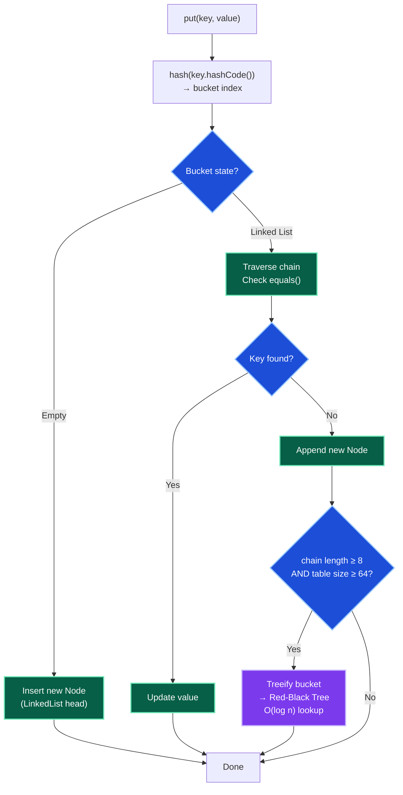

**Key HashMap Facts:**
- Default initial capacity: **16**, load factor: **0.75**
- Resize trigger: `size > capacity * loadFactor` → doubles capacity, rehashes all entries
- Tree conversion: at chain length **8** (if table size ≥ 64) → `O(log n)` lookup
- Tree untreeification: when chain falls below **6** after removal

---

### Interview Rapid-Fire Differences

| Comparison | A | B |
|---|---|---|
| `HashMap` vs `Hashtable` | Not synchronized, allows null key, preferred | Fully synchronized (slow), no null, legacy |
| `HashMap` vs `ConcurrentHashMap` | Not thread-safe | Thread-safe, fine-grained locking, scalable |
| `ArrayList` vs `LinkedList` | Random access O(1), contiguous | O(n) access, O(1) head/tail insert |
| `fail-fast` vs `fail-safe` | Throws CME on modification | Iterates snapshot, never throws CME |
| `Comparable` vs `Comparator` | One natural order in class | Multiple external orderings |
| `unmodifiable` vs `immutable` | Read-only view (original can change) | Truly fixed (no modification possible) |
| `Arrays.asList()` vs `new ArrayList<>()` | Fixed-size (set OK, add/remove ❌) | Fully mutable |
| `List.of()` vs `Collections.unmodifiableList()` | Immutable + no nulls (Java 9+) | Unmodifiable view (backed by original) |

---

### Collection Selection Cheat Sheet

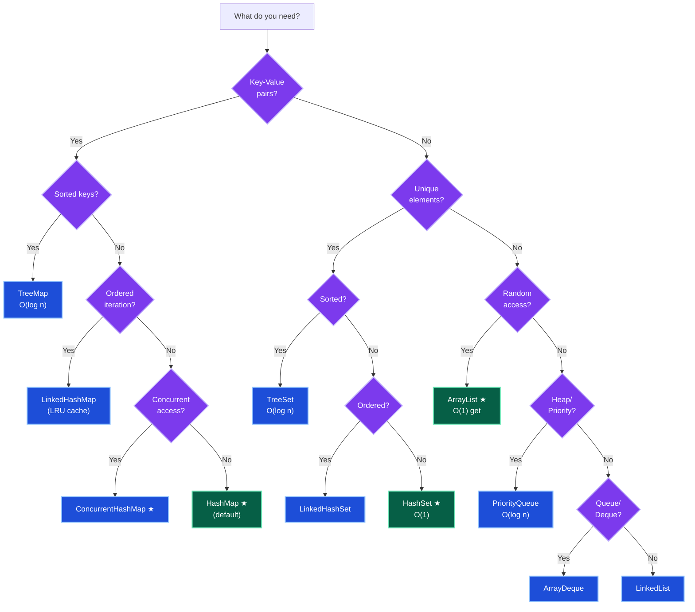

---

### Time Complexity Reference Table

| Collection | `get`/`contains` | `add`/`put` | `remove` | `iteration` |
|---|---|---|---|---|
| `ArrayList` | O(1) by index | O(1) amortized (end) / O(n) middle | O(n) | O(n) |
| `LinkedList` | O(n) | O(1) head/tail | O(1) with iterator | O(n) |
| `HashSet` | O(1) avg | O(1) avg | O(1) avg | O(n) |
| `TreeSet` | O(log n) | O(log n) | O(log n) | O(n) |
| `LinkedHashSet` | O(1) avg | O(1) avg | O(1) avg | O(n) |
| `HashMap` | O(1) avg | O(1) avg | O(1) avg | O(n) |
| `TreeMap` | O(log n) | O(log n) | O(log n) | O(n) |
| `LinkedHashMap` | O(1) avg | O(1) avg | O(1) avg | O(n) |
| `PriorityQueue` | O(1) peek | O(log n) offer | O(log n) poll | O(n) |
| `ConcurrentHashMap` | O(1) avg | O(1) avg | O(1) avg | O(n) |

---

## Quick Reference & Cheat Sheets

### Key Questions Index

| Q# | Topic | Core Concept |
|---|---|---|
| Q1 | ArrayList vs LinkedList | Array (cache-friendly) vs doubly-linked (O(1) head/tail) |
| Q2 | HashMap / TreeMap / LinkedHashMap | No order / sorted / insertion order |
| Q3 | HashSet internals | Backed by HashMap; duplicate = same bucket + equals |
| Q4 | ConcurrentHashMap (Java 8) | CAS + per-bucket sync; get() never locks |
| Q5 | Comparable vs Comparator | Natural order in class vs external, multiple orderings |
| Q6 | Fail-fast vs Fail-safe | CME on modification vs snapshot iteration |
| Q7 | BlockingQueue | put() blocks if full; take() blocks if empty |
| Q8 | 1M records collection choice | Pre-size + match access pattern |
| Q9 | equals/hashCode contract | If equal → same hash (MUST); same hash ≠ equal (OK) |
| Q10 | Thread-safe LRU cache | LinkedHashMap (accessOrder) + ReadWriteLock |

### Top Interview Pitfalls

1. **Mutable HashMap key** — fields used in `hashCode`/`equals` changed after `put()` → entry unreachable.
2. **equals/hashCode contract violation** — breaks `Set`/`Map` correctness silently.
3. **`ConcurrentModificationException`** — structural modification during `for-each` iteration.
4. **`Arrays.asList()` trap** — returns fixed-size list; `add()`/`remove()` throw `UnsupportedOperationException`.
5. **`Collections.unmodifiableList()` is a VIEW** — the backing list can still be mutated; it's not deeply immutable.
6. **`LinkedList` for random access** — O(n) traversal makes it extremely slow for index-based reads.
7. **`HashMap` in multi-threaded code** — use `ConcurrentHashMap`; `HashMap` is not thread-safe.

### 7-Day Collections Prep Plan

| Day | Focus | Practice |
|---|---|---|
| **Day 1** | List/Set/Map decision rules + complexity | Memorize the selection flowchart |
| **Day 2** | HashMap internals + equals/hashCode coding | Write `Employee` with correct `hashCode`/`equals` |
| **Day 3** | Comparable/Comparator + multi-key sorting | Sort employees by 3 fields with `Comparator` chaining |
| **Day 4** | Iterators + fail-fast/fail-safe + safe mutation | Show 3 safe ways to remove during iteration |
| **Day 5** | PriorityQueue + Top-K + frequency problems | Implement `topK()` without looking at notes |
| **Day 6** | TreeMap/TreeSet navigation APIs + range queries | Code floor/ceiling/headMap/subMap from memory |
| **Day 7** | Mock interview — 30 rapid-fire + 5 coding snippets | Full drill from memory, no copy-paste |

### Interview Answer Framework

When answering any collections question, structure it as:

1. **Data shape** — unique? ordered? key-value? sorted? concurrent?
2. **Collection choice** — name it and state the time complexity target.
3. **Edge constraints** — nulls allowed? duplicates allowed? thread-safety required?
4. **Production pitfall** — mention one real-world risk and its mitigation.
5. **API choice** — prefer `merge`/`computeIfAbsent` over manual `containsKey` + `put`.

---

> **End of Collections Framework Analysis**
>
> *Covers Java 8–17+ | For 7+ Years Full Stack Experience | Interview + Certification Ready*
