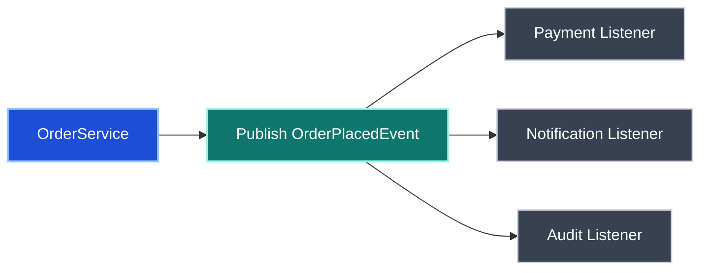
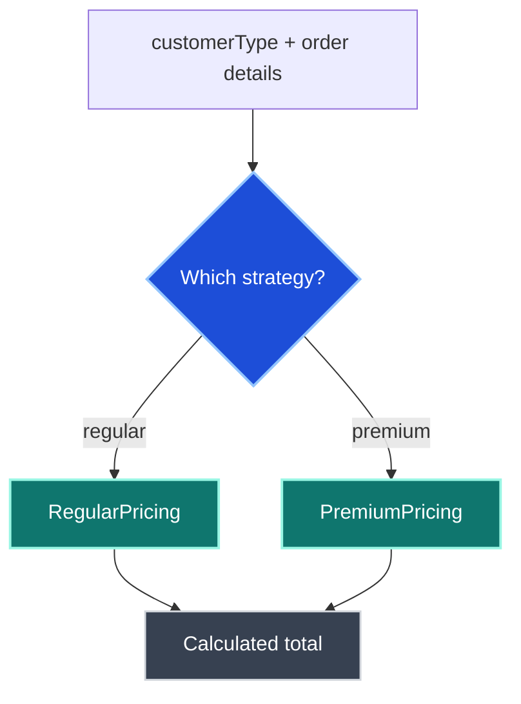
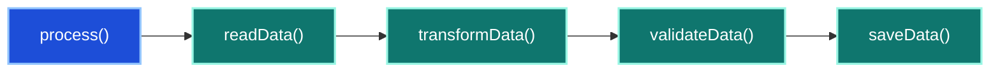

# Design Patterns - Comprehensive Interview Preparation Guide

> **Target Audience:** 7+ Years Experience | Java Developer
>
> **Coverage:** Creational, Structural, Behavioral, Spring Framework, Microservices, SOLID, Scenario-Based Interview Answers

---

## Table of Contents

| Section | Topic |
|---|---|
| [Section 1](#section-1-pattern-categories-and-selection-guide) | Pattern Categories and Selection Guide |
| [Round 1](#round-1-basic-and-resume-discussion) | Basic and Resume Discussion |
| [Round 2](#round-2-core-technical-deep-dive) | Core Technical Deep Dive |
| [Round 3](#round-3-advanced-and-framework-internals) | Advanced and Framework Internals |
| [Round 4](#round-4-scenario-based-interview-answers) | Scenario-Based Interview Answers |
| [Round 5](#round-5-architecture-and-solid-principles) | Architecture and SOLID Principles |
| [Section 2](#section-2-structural-and-supporting-patterns) | Structural and Supporting Patterns |
| [Section 3](#section-3-microservices-and-enterprise-pattern-mapping) | Microservices and Enterprise Pattern Mapping |
| [Quick Reference](#quick-reference-and-cheat-sheet) | Cheat Sheet and Rapid Revision |

---

## Section 1: Pattern Categories and Selection Guide

### Design Pattern Families

- **Creational patterns** focus on object creation.
- **Structural patterns** focus on object composition and relationships.
- **Behavioral patterns** focus on object interaction, workflow, and responsibility.

```mermaid
flowchart TD
    DP["Design Patterns"] --> CRE["Creational"]
    DP --> STR["Structural"]
    DP --> BEH["Behavioral"]

    CRE --> SINGLETON["Singleton"]
    CRE --> FACTORY["Factory"]
    CRE --> ABSTRACT_FACTORY["Abstract Factory"]
    CRE --> BUILDER["Builder"]
    CRE --> PROTOTYPE["Prototype"]

    STR --> ADAPTER["Adapter"]
    STR --> DECORATOR["Decorator"]
    STR --> PROXY["Proxy"]
    STR --> FACADE["Facade"]
    STR --> FLYWEIGHT["Flyweight"]

    BEH --> OBSERVER["Observer"]
    BEH --> STRATEGY["Strategy"]
    BEH --> TEMPLATE["Template Method"]
    BEH --> CHAIN["Chain of Responsibility"]
    BEH --> COMMAND["Command"]
    BEH --> STATE["State"]

    classDef root fill:#1D4ED8,stroke:#93C5FD,color:#FFFFFF,stroke-width:2px
    classDef group fill:#0F766E,stroke:#99F6E4,color:#FFFFFF,stroke-width:2px
    classDef item fill:#374151,stroke:#D1D5DB,color:#FFFFFF,stroke-width:1.5px

    class DP root
    class CRE,STR,BEH group
    class SINGLETON,FACTORY,ABSTRACT_FACTORY,BUILDER,PROTOTYPE,ADAPTER,DECORATOR,PROXY,FACADE,FLYWEIGHT,OBSERVER,STRATEGY,TEMPLATE,CHAIN,COMMAND,STATE item
```



### Pattern Classification Table

| Pattern | Category | Intent | When to Use | Java / Spring Example |
|---|---|---|---|---|
| Singleton | Creational | Ensure one shared instance | Shared configuration, object mapper, pool manager | Spring singleton beans, `ObjectMapper` bean |
| Factory | Creational | Hide creation logic | Create implementations by type or channel | Spring `BeanFactory`, notification factory |
| Abstract Factory | Creational | Create related families of objects | Multiple related product sets | UI toolkit families, cloud provider adapters |
| Builder | Creational | Build complex objects step by step | Immutable DTOs, many optional fields | Lombok `@Builder`, `HttpRequest.newBuilder()` |
| Prototype | Creational | Create by cloning existing object | Expensive object setup, template objects | Copy constructor, `Cloneable` |
| Adapter | Structural | Convert one interface to another | Legacy integration, third-party API bridge | `HandlerAdapter`, payment adapter |
| Decorator | Structural | Add behavior dynamically | Encryption, compression, logging wrappers | Java I/O wrappers |
| Proxy | Structural | Add controlled access to another object | AOP, lazy loading, remote access | Spring AOP, `@Transactional` |
| Facade | Structural | Offer simplified interface | Complex subsystem behind one entry point | API gateway, service facade |
| Flyweight | Structural | Share common state | Memory optimization for repeated values | String pool, integer cache |
| Observer | Behavioral | Notify many dependents on change | Event-driven workflows | Spring events, listeners |
| Strategy | Behavioral | Swap algorithms at runtime | Pricing, payment, validation rules | Spring-injected strategy map |
| Template Method | Behavioral | Define algorithm skeleton | Shared workflow with overridable steps | `JdbcTemplate`, `RestTemplate` |
| Chain of Responsibility | Behavioral | Pass request through handlers | Filter pipelines, interceptors | Servlet filters, Spring interceptors |
| Command | Behavioral | Encapsulate request as object | Task execution, retry, queueing | `Runnable`, `Callable` |
| State | Behavioral | Change behavior based on internal state | Lifecycle-driven behavior | Circuit breaker states |

### How to Choose a Pattern Quickly

| Problem | Best Pattern | Why |
|---|---|---|
| Only one shared object should exist | Singleton | Centralized access and controlled instantiation |
| Need different implementations chosen by input | Factory | Keeps creation logic out of clients |
| Too many constructor arguments | Builder | Improves readability and immutability |
| Business rule changes by customer or mode | Strategy | Replace `if-else` chains with pluggable algorithms |
| One event should trigger many actions | Observer | Loose coupling between publisher and subscribers |
| Need pre/post behavior around method calls | Proxy | Common in AOP, security, caching, transactions |
| Workflow stays same but some steps vary | Template Method | Reuse stable flow while customizing steps |
| Need to integrate incompatible API | Adapter | Wrap legacy system without changing callers |
| Need stacked features around core behavior | Decorator | Add behavior dynamically without subclass explosion |

#### Key Takeaways

- Start by identifying the problem shape before naming the pattern.
- In interviews, explain the tradeoff, not just the definition.
- Spring uses many GoF patterns internally, so connect theory to framework usage.

---

## Round 1: Basic and Resume Discussion

### Q1. Singleton Pattern

**Purpose:** Ensure only one instance exists across the application.

**Common use cases:**

- `ObjectMapper`
- configuration manager
- connection pool manager
- shared caches with centralized access

#### Thread-Safe Singleton Variants

```java
// Double-checked locking: thread-safe and lazy
public class AppConfig {
    private static volatile AppConfig instance;

    private AppConfig() {}

    public static AppConfig getInstance() {
        if (instance == null) {
            synchronized (AppConfig.class) {
                if (instance == null) {
                    instance = new AppConfig();
                }
            }
        }
        return instance;
    }
}
```

```java
// Bill Pugh approach: preferred for lazy, thread-safe singleton
public class AppConfig {
    private AppConfig() {}

    private static class Holder {
        private static final AppConfig INSTANCE = new AppConfig();
    }

    public static AppConfig getInstance() {
        return Holder.INSTANCE;
    }
}
```

```java
// Enum singleton: simplest and serialization-safe
public enum AppConfig {
    INSTANCE
}
```

**Spring note:** All Spring beans are singleton by default unless scope is changed.

**Interview trap:** A singleton is not automatically thread-safe. The instance creation path and internal mutable state both matter.

#### Key Takeaways

- Prefer Bill Pugh or enum singleton in Java.
- Mention `volatile` when discussing double-checked locking.
- In Spring, "singleton scope" means one bean per container, not one object for the entire JVM.

---

### Q2. Factory Pattern

**Purpose:** Create objects without exposing object creation logic to the client.

```java
public interface Notification {
    void send(String message);
}

public class EmailNotification implements Notification {
    @Override
    public void send(String message) {
        System.out.println("EMAIL: " + message);
    }
}

public class SMSNotification implements Notification {
    @Override
    public void send(String message) {
        System.out.println("SMS: " + message);
    }
}

public class PushNotification implements Notification {
    @Override
    public void send(String message) {
        System.out.println("PUSH: " + message);
    }
}

public class NotificationFactory {
    public static Notification create(String type) {
        switch (type) {
            case "EMAIL":
                return new EmailNotification();
            case "SMS":
                return new SMSNotification();
            case "PUSH":
                return new PushNotification();
            default:
                throw new IllegalArgumentException("Unknown type: " + type);
        }
    }
}
```

**Production example:** Multi-channel notification service for email, SMS, and push.

**Spring note:** `BeanFactory` and `ApplicationContext` are strong framework-level examples of factory behavior.

**Interview trap:** Factory centralizes creation, but if every new type requires editing a giant `switch`, discuss moving toward Strategy, registry-based factories, or Spring DI.

#### Key Takeaways

- Factory reduces coupling between client code and concrete implementations.
- It is especially useful when object creation is conditional or expensive.
- Mention Spring `BeanFactory` as a practical answer in Java interviews.

---

### Q3. Builder Pattern

**Purpose:** Construct complex objects step by step, especially when objects have many optional fields or should be immutable.

```java
@Builder
public class PolicyRequest {
    private String policyId;
    private String customerName;
    private double premium;
    private LocalDate startDate;
    private List<String> coverages;
}
```

```java
PolicyRequest request = PolicyRequest.builder()
    .policyId("POL-001")
    .customerName("Teja")
    .premium(15000.0)
    .startDate(LocalDate.now())
    .coverages(List.of("Life", "Health"))
    .build();
```

**Used in:**

- Lombok `@Builder`
- `StringBuilder`
- `Stream.builder()`
- `HttpRequest.newBuilder()`

**When to choose Builder over telescoping constructors:**

- too many constructor parameters
- optional parameters are common
- readability matters
- object should be immutable after construction

#### Key Takeaways

- Builder improves readability and reduces constructor overloads.
- It is ideal for immutable DTOs and request objects.
- Mention Lombok in interviews, but also explain the underlying pattern without Lombok.

---

## Round 2: Core Technical Deep Dive

### Q4. Observer Pattern

**Purpose:** Create a one-to-many dependency so when one object changes state, all dependents are notified.

**Best fit:** Event-driven systems, decoupled workflows, notification pipelines.

#### Spring Event Example

```java
public class OrderPlacedEvent extends ApplicationEvent {
    private final Order order;

    public OrderPlacedEvent(Object source, Order order) {
        super(source);
        this.order = order;
    }

    public Order getOrder() {
        return order;
    }
}
```

```java
@Service
public class OrderService {
    @Autowired
    private ApplicationEventPublisher publisher;

    public void placeOrder(Order order) {
        orderRepo.save(order);
        publisher.publishEvent(new OrderPlacedEvent(this, order));
    }
}
```

```java
@EventListener
public void handleOrderForPayment(OrderPlacedEvent event) {
    paymentService.processPayment(event.getOrder());
}

@EventListener
public void handleOrderForNotification(OrderPlacedEvent event) {
    emailService.sendConfirmation(event.getOrder());
}
```



**Advantages:**

- publisher and subscribers are loosely coupled
- new listeners can be added without changing publisher logic
- useful for audit, notification, analytics, and async extensions

**Interview trap:** Observer can become hard to debug if event flow is implicit and spread across many listeners.

#### Key Takeaways

- Observer is the pattern behind publish-subscribe style workflows.
- Spring events are a clean, interview-friendly example.
- Call out loose coupling, but also mention tracing and debugging complexity.

---

### Q5. Strategy Pattern

**Purpose:** Define a family of algorithms, encapsulate them, and make them interchangeable at runtime.

**Typical uses:**

- pricing rules
- payment modes
- validation logic
- tax calculation
- country-specific business logic

```java
public interface PricingStrategy {
    double calculatePrice(double basePrice, int quantity);
}
```

```java
@Component("regular")
public class RegularPricing implements PricingStrategy {
    @Override
    public double calculatePrice(double basePrice, int quantity) {
        return basePrice * quantity;
    }
}

@Component("premium")
public class PremiumPricing implements PricingStrategy {
    @Override
    public double calculatePrice(double basePrice, int quantity) {
        return basePrice * quantity * 0.85;
    }
}
```

```java
@Service
public class OrderService {
    @Autowired
    private Map<String, PricingStrategy> strategies;

    public double calculateTotal(String customerType, double price, int quantity) {
        return strategies.get(customerType).calculatePrice(price, quantity);
    }
}
```



**Why it is better than `if-else`:**

- easier to extend new behaviors
- follows Open/Closed Principle
- promotes testable, isolated business rules

**Interview trap:** If strategy selection itself becomes a large `if-else`, the pattern is only partially applied.

#### Key Takeaways

- Strategy is one of the best patterns for business-rule variation.
- It maps naturally to Spring DI with `Map<String, Strategy>`.
- Mention Open/Closed Principle when explaining why it matters.

---

### Q6. Template Method Pattern

**Purpose:** Define the skeleton of an algorithm in a base class and let subclasses override specific steps.

**Spring examples:**

- `JdbcTemplate`
- `RestTemplate`
- `JmsTemplate`

```java
public abstract class DataProcessor {
    public final void process() {
        readData();
        transformData();
        validateData();
        saveData();
    }

    protected abstract void readData();

    protected abstract void transformData();

    protected void validateData() {
        // default validation
    }

    protected abstract void saveData();
}
```



**When to use:**

- workflow is stable
- specific steps vary by implementation
- you want common orchestration with controlled customization

**Interview trap:** If subclass variations are too large, Strategy may be better than inheritance-based Template Method.

#### Key Takeaways

- Template Method is about fixing workflow and varying steps.
- `JdbcTemplate` is a strong real-world example because Spring handles boilerplate and leaves the variable part to the user.
- Compare it with Strategy if the interviewer asks inheritance versus composition.

---

## Round 3: Advanced and Framework Internals

### Q7. Proxy Pattern

**Purpose:** Provide a surrogate or placeholder for another object to control access, add behavior, or delay work.

**Types often discussed in interviews:**

- virtual proxy for lazy loading
- protection proxy for authorization
- remote proxy for network calls
- smart proxy for logging, metrics, or caching

**Spring AOP usage:**

- `@Transactional`
- `@Cacheable`
- `@Async`
- `@Retryable`

**Java proxy styles:**

- JDK Dynamic Proxy for interfaces using `InvocationHandler`
- CGLIB proxy for classes by generating subclasses at runtime


**Interview talking points:**

- Proxy adds behavior without changing target business code.
- Spring commonly wraps beans in proxies to apply cross-cutting concerns.
- Self-invocation inside the same Spring bean may bypass proxy-based behavior.

#### Key Takeaways

- Proxy is one of the most important framework-level patterns in Spring.
- Mention JDK proxy versus CGLIB when discussing internals.
- AOP examples make this answer much stronger than a textbook definition.

---

### Q8. Which design patterns have you used in projects?

Use this as a resume-based answer:

1. **Singleton:** Shared `ObjectMapper`, configuration beans, cache managers.
2. **Factory:** Notification or adapter creation based on channel or provider.
3. **Builder:** DTOs, request objects, and immutable payload construction.
4. **Strategy:** Pricing, payment mode, eligibility rules, validation rules.
5. **Observer:** Spring events for order, payment, and notification workflows.
6. **Proxy:** Spring AOP for transactions, caching, retry, and security.
7. **Template Method:** `JdbcTemplate`, `RestTemplate`, common workflow orchestration.
8. **Repository:** Spring Data JPA abstraction over persistence operations.

**Strong interview answer format:**

- name the pattern
- mention where you used it
- explain the business problem it solved
- describe why it was better than the alternative

#### Example Answer

> In my projects, I used Strategy for customer-specific pricing, Builder for immutable request DTOs, Observer through Spring events for decoupled order workflows, and Proxy indirectly through Spring AOP for transaction and caching concerns. I also used Factory to choose notification providers and Singleton-scoped Spring beans for shared infrastructure components.

#### Key Takeaways

- Interviewers value practical usage over memorized definitions.
- Tie each pattern to a business problem, not just a class diagram.
- Mention framework-driven usage where you benefited from the pattern indirectly.

---

## Round 4: Scenario-Based Interview Answers

### Q9. Why Strategy Instead of `if-else`?

**Good answer:**

- `if-else` works for very small cases but becomes hard to maintain when rules keep growing.
- Strategy lets each algorithm live in its own class.
- New rules can be added with minimal impact on tested code.
- It improves testability because each strategy can be unit tested independently.

### Q10. Why Builder Instead of Constructor Overloading?

**Good answer:**

- Too many constructor arguments hurt readability.
- Optional parameters make overloaded constructors hard to understand.
- Builder makes object creation expressive and reduces parameter-order bugs.
- It supports immutable object construction cleanly.

### Q11. When Not to Use Singleton?

**Good answer:**

- when the object has request-specific or user-specific state
- when global shared state creates testability issues
- when dependency injection can manage lifecycle more cleanly

### Q12. Observer vs Direct Method Calls

| Aspect | Observer | Direct Call |
|---|---|---|
| Coupling | Loose | Tight |
| Extensibility | High | Lower |
| Traceability | Harder | Easier |
| Best for | Events and fan-out workflows | Immediate, simple interactions |

### Q13. Template Method vs Strategy

| Aspect | Template Method | Strategy |
|---|---|---|
| Variation mechanism | Inheritance | Composition |
| Workflow control | Fixed in base class | Chosen at runtime |
| Flexibility | Moderate | High |
| Best for | Stable workflow with varying steps | Interchangeable business rules |

### Q14. Factory vs Abstract Factory

| Aspect | Factory | Abstract Factory |
|---|---|---|
| Scope | Create one product type | Create families of related products |
| Complexity | Lower | Higher |
| Best for | Notification channel, parser selection | Multi-provider SDKs, themed UI families |

### Q15. How would you explain Proxy in Spring?

**Good answer:**

- Spring wraps target beans in proxies.
- The proxy intercepts method calls and applies extra behavior like transaction management or caching.
- The target class stays focused on business logic.

#### Key Takeaways

- Scenario answers should sound like production reasoning, not textbook recall.
- Compare patterns directly when interviewers push on design choices.
- Use tradeoffs such as coupling, extensibility, and debugging complexity.

---

## Round 5: Architecture and SOLID Principles

### Q16. SOLID Principles with Pattern Mapping

| Principle | Meaning | Pattern Connection | Java / Spring Example |
|---|---|---|---|
| SRP | One class, one reason to change | Strategy, Factory | Split pricing logic from order service |
| OCP | Open for extension, closed for modification | Strategy, Decorator | Add new pricing strategy without editing existing ones |
| LSP | Subtypes should be substitutable | Template Method, Strategy | Each strategy must honor the same contract |
| ISP | Prefer focused interfaces | Strategy, Adapter | Small interfaces like `PaymentProcessor` |
| DIP | Depend on abstractions, not concretions | Factory, DI, Observer | Inject interfaces into services |

### How to Explain SOLID in an Interview

- Start with one-line definitions.
- Give one practical project example for each principle.
- Map at least one principle to a design pattern you have used.

### Example Architecture Framing

If building an order platform:

- use **Factory** to create the right notification provider
- use **Strategy** for pricing or payment rules
- use **Observer** for post-order workflows
- use **Proxy** for transactions and caching
- use **Builder** for request and response DTOs

#### Key Takeaways

- SOLID principles explain why a pattern is useful.
- Patterns are implementation tools; SOLID is the design mindset behind them.
- In senior interviews, linking both together is more valuable than reciting either separately.

---

## Section 2: Structural and Supporting Patterns

### Q17. Adapter Pattern

**Purpose:** Convert the interface of one class into another interface expected by the client.

```java
class OldPaymentGateway {
    String makePayment(String xml) {
        return "<response>SUCCESS</response>";
    }
}

interface PaymentProcessor {
    Response process(PaymentRequest request);
}

class PaymentAdapter implements PaymentProcessor {
    private final OldPaymentGateway gateway = new OldPaymentGateway();

    @Override
    public Response process(PaymentRequest request) {
        String xml = convertToXml(request);
        String result = gateway.makePayment(xml);
        return parseResponse(result);
    }

    private String convertToXml(PaymentRequest request) {
        return "<payment>" + request.getAmount() + "</payment>";
    }

    private Response parseResponse(String result) {
        return new Response(result);
    }
}
```

**Spring examples:**

- `HandlerAdapter`
- `HttpMessageConverter`

#### Key Takeaways

- Adapter is the best answer when integrating legacy systems without changing the caller contract.
- It is especially useful in external integration layers.
- In interviews, emphasize compatibility and isolation of legacy complexity.

---

### Q18. Decorator Pattern

**Purpose:** Add behavior dynamically without modifying the original class.

```java
interface DataSource {
    String readData();
    void writeData(String data);
}

class FileDataSource implements DataSource {
    @Override
    public String readData() {
        return "raw-data";
    }

    @Override
    public void writeData(String data) {
        System.out.println(data);
    }
}

class EncryptionDecorator implements DataSource {
    private final DataSource wrappee;

    EncryptionDecorator(DataSource wrappee) {
        this.wrappee = wrappee;
    }

    @Override
    public String readData() {
        return decrypt(wrappee.readData());
    }

    @Override
    public void writeData(String data) {
        wrappee.writeData(encrypt(data));
    }

    private String encrypt(String data) {
        return "ENC(" + data + ")";
    }

    private String decrypt(String data) {
        return data.replace("ENC(", "").replace(")", "");
    }
}
```

**Java example:** `BufferedReader(new FileReader("input.txt"))`

#### Key Takeaways

- Decorator adds responsibilities dynamically and avoids subclass explosion.
- It is a great answer for layered I/O, security, and transformation concerns.
- Distinguish it from Proxy: Decorator adds features, Proxy controls access.

---

### Q19. Chain of Responsibility

**Purpose:** Pass a request through a chain of handlers until one or more handlers process it.

**Examples:**

- Servlet filter chain
- Spring interceptor chain
- exception handler chains

**Typical flow:**

1. request enters chain
2. each handler decides whether to process or forward
3. chain ends with final handler or target resource

#### Key Takeaways

- Chain of Responsibility is a pipeline pattern.
- Mention filters and interceptors for a strong Spring answer.
- It improves separation of concerns for validation, auth, logging, and transformation steps.

---

### Q20. Facade Pattern

**Purpose:** Provide a simplified interface to a complex subsystem.

**Examples:**

- service facade over multiple downstream APIs
- API gateway in distributed systems
- payment orchestration facade

#### Key Takeaways

- Facade reduces complexity for clients.
- It is valuable when many internal services should look like one clean entry point.
- In microservices discussions, API Gateway is often described as a Facade-like pattern.

---

### Q21. Flyweight Pattern

**Purpose:** Share common intrinsic state to reduce memory usage.

**Examples:**

- String pool
- Integer cache for `-128` to `127`
- shared metadata objects

#### Key Takeaways

- Flyweight is mainly a memory optimization pattern.
- Use it when many objects share the same immutable internal state.
- Mention JVM-level examples because they are easy to explain.

---

## Section 3: Microservices and Enterprise Pattern Mapping

### Q22. Microservices Patterns Mapped to Design Patterns

| Microservices Concept | Closest Pattern Analogy | Why |
|---|---|---|
| API Gateway | Facade | One entry point over multiple services |
| Service Registry / Discovery | Service Locator style pattern | Find service instances dynamically |
| Circuit Breaker | State | Behavior changes by `CLOSED`, `OPEN`, `HALF_OPEN` |
| Saga Orchestrator | Orchestrator / Command style workflow | Coordinates distributed steps |
| Sidecar / Service Mesh Proxy | Proxy | Intercepts traffic and adds cross-cutting behavior |
| Strangler Fig | Migration pattern | Gradually replace legacy functionality |

### Q23. State Pattern

**Purpose:** Let an object change behavior when its internal state changes.

**Microservices example:** Circuit breaker transitions between `CLOSED`, `OPEN`, and `HALF_OPEN`.

#### Key Takeaways

- State pattern is useful when behavior depends heavily on lifecycle state.
- Circuit breaker is the easiest enterprise example to discuss.
- Do not confuse state-driven behavior with simple flags and `if-else` unless you explain why the pattern is cleaner.

---

### Q24. Command Pattern

**Purpose:** Encapsulate a request as an object.

**Java examples:**

- `Runnable`
- `Callable`
- queued jobs
- retryable task objects

#### Key Takeaways

- Command is useful for queueing, retrying, logging, and scheduling actions.
- It separates the invoker from the actual execution logic.
- This is especially valuable in asynchronous systems.

---

### Q25. Prototype Pattern

**Purpose:** Create new objects by copying an existing object.

**Examples:**

- `Cloneable`
- copy constructors
- preconfigured template objects

#### Key Takeaways

- Prototype is useful when object creation is expensive or initialization is repetitive.
- Prefer copy constructors in modern Java when cloning semantics need clarity.
- Be careful with shallow versus deep copy discussions in interviews.

---

### Q26. Abstract Factory Pattern

**Purpose:** Create families of related objects without specifying concrete classes.

**Good example:** Switching between AWS, Azure, and GCP provider-specific clients through one abstract factory.

#### Key Takeaways

- Abstract Factory is a factory of related factories or products.
- Use it when product families must stay compatible with one another.
- It is a stronger answer than simple Factory when multiple related objects change together.

---

### Q27. Dependency Injection as a Pattern

**Purpose:** Supply dependencies from outside rather than creating them inside a class.

**Why it matters:**

- improves testability
- supports loose coupling
- aligns with Dependency Inversion Principle
- works naturally with Factory and Strategy patterns

**Spring note:** Dependency injection is not only a Spring feature; it is a design pattern that Spring operationalizes.

#### Key Takeaways

- DI is a foundational pattern in enterprise Java.
- It helps classes depend on abstractions instead of concrete implementations.
- In interviews, connect DI to testing, SOLID, and Spring bean wiring.

---

## Quick Reference and Cheat Sheet

### Major Patterns at a Glance

| Pattern | Category | Main Benefit | Common Spring / Java Usage |
|---|---|---|---|
| Singleton | Creational | One shared instance | Singleton beans |
| Factory | Creational | Encapsulated creation | `BeanFactory`, provider selection |
| Builder | Creational | Readable complex object creation | Lombok `@Builder` |
| Observer | Behavioral | Decoupled event notification | Spring events |
| Strategy | Behavioral | Runtime algorithm swap | Injected business rules |
| Proxy | Structural | Cross-cutting interception | AOP, transactions, caching |
| Template Method | Behavioral | Shared workflow skeleton | `JdbcTemplate` |
| Adapter | Structural | Legacy integration | `HandlerAdapter` |
| Decorator | Structural | Dynamic feature addition | Java I/O wrappers |
| Chain of Responsibility | Behavioral | Request pipeline | filters, interceptors |
| Repository | Enterprise pattern | Persistence abstraction | Spring Data JPA repositories |

### Interview Rapid-Fire

| Question | Best Short Answer |
|---|---|
| Best thread-safe singleton? | Bill Pugh or enum singleton |
| Pattern behind Spring events? | Observer |
| Pattern behind `@Transactional`? | Proxy |
| Best pattern for runtime pricing rules? | Strategy |
| Best pattern for immutable DTO creation? | Builder |
| Pattern used by `JdbcTemplate`? | Template Method |
| Wrap old API with new interface? | Adapter |
| Add behavior without changing original class? | Decorator |
| One request passes through multiple handlers? | Chain of Responsibility |

### Top Interview Pitfalls

1. Calling every utility class a Singleton without discussing lifecycle or state.
2. Confusing Factory with Abstract Factory.
3. Treating Strategy as only "interface plus implementations" without runtime selection logic.
4. Forgetting that Spring AOP is proxy-based and can be affected by self-invocation.
5. Explaining Observer without mentioning debugging and tracing complexity.
6. Using inheritance when composition-based Strategy would be simpler.
7. Saying DI is only a Spring concept instead of a broader design pattern.

### Senior-Level Answer Framework

When answering a design pattern question:

1. State the intent in one line.
2. Explain the problem it solves.
3. Give one Java or Spring example.
4. Mention a tradeoff or limitation.
5. Connect it to a real project scenario.

#### Key Takeaways

- Interviewers look for applied design judgment, not memorized pattern names.
- The strongest answers connect patterns, Spring internals, and business use cases.
- Use the cheat sheet for fast revision before interview rounds.

---

> **End of Design Patterns Analysis**
>
> *Interview-focused and production-oriented reference for senior Java developers*
