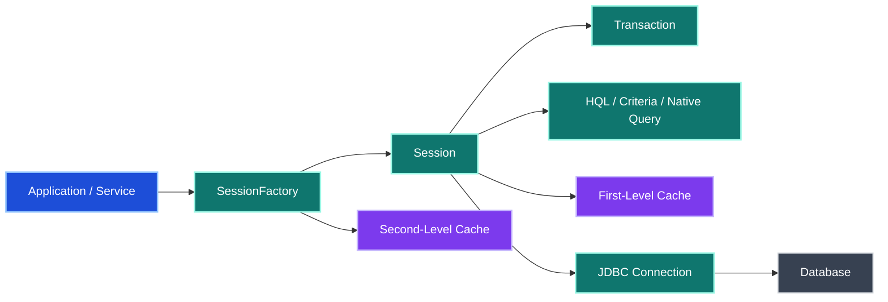
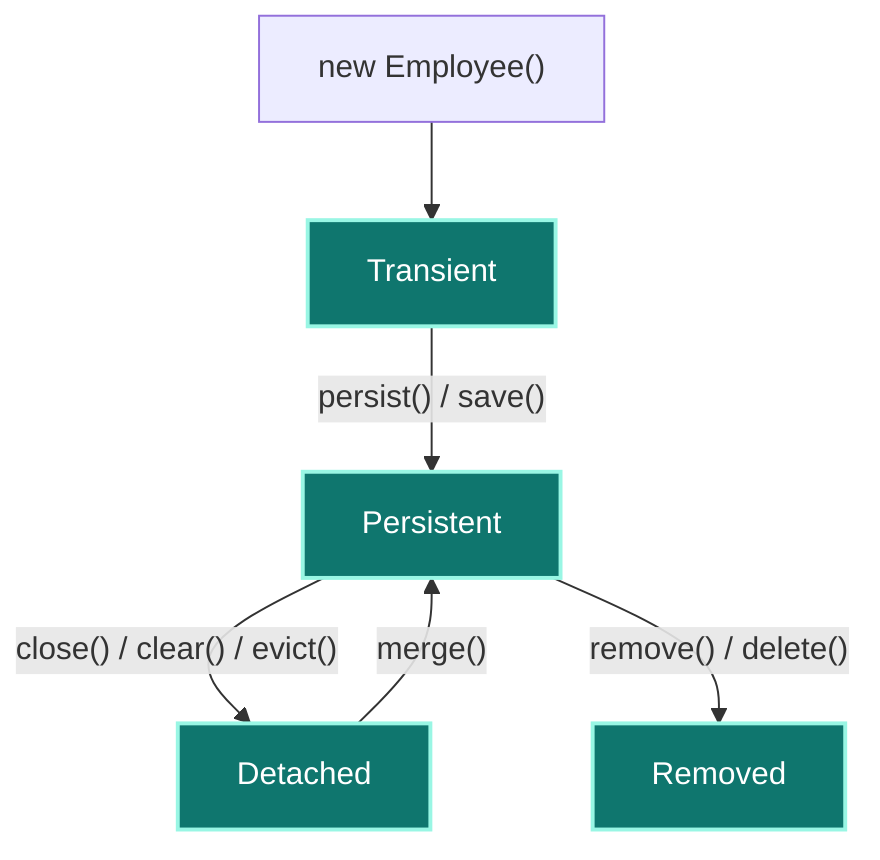
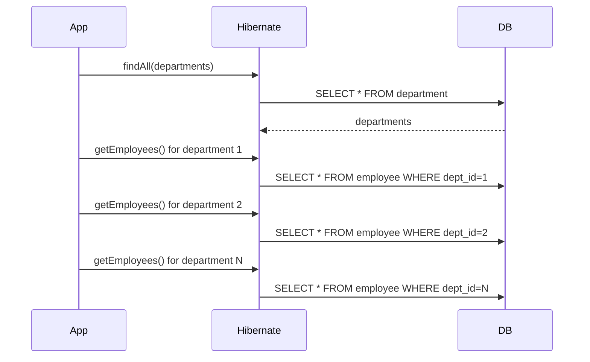
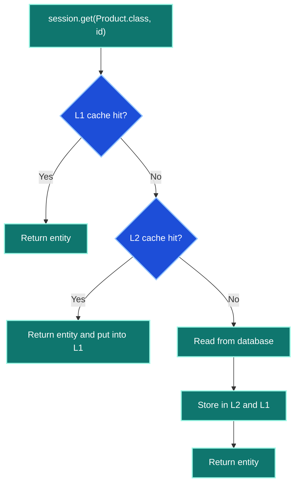
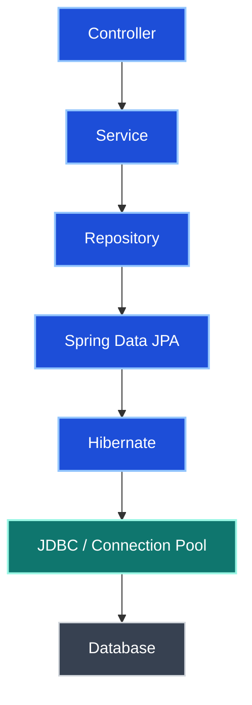

# Hibernate / JPA - Comprehensive Interview Preparation Guide

> **Target Audience:** 7+ Years Experience | Java Developer
>
> **Coverage:** JPA, Hibernate internals, Session lifecycle, entity mapping, HQL, Criteria API, caching, performance tuning, locking, Spring Data JPA, transactions, and troubleshooting

---

## Table of Contents

| Section | Topic |
|---|---|
| [Section 1](#section-1-foundation-and-architecture) | Foundation and Architecture |
| [Round 1](#round-1-basic-and-resume-discussion) | Basic and Resume Discussion |
| [Round 2](#round-2-core-technical-deep-dive) | Core Technical Deep Dive |
| [Round 3](#round-3-advanced-and-internals) | Advanced and Internals |
| [Round 4](#round-4-scenario-based-and-performance) | Scenario-Based and Performance |
| [Round 5](#round-5-architecture-and-spring-data-jpa) | Architecture and Spring Data JPA |
| [Section 2](#section-2-querying-with-hibernate) | Querying with Hibernate |
| [Section 3](#section-3-locking-auditing-and-enterprise-topics) | Locking, Auditing, and Enterprise Topics |
| [Quick Reference](#quick-reference-and-cheat-sheet) | Cheat Sheet and Rapid Revision |

---

## Section 1: Foundation and Architecture

### JPA and Hibernate in One Line

- **JPA** is a specification for object-relational persistence.
- **Hibernate** is a popular implementation of JPA with additional features.
- In Spring applications, the common runtime stack is:
  `Spring Data JPA -> JPA API -> Hibernate -> JDBC -> Database`

### Why Hibernate Exists

- maps Java objects to database tables
- reduces JDBC boilerplate
- manages object lifecycle and dirty checking
- provides caching, query abstraction, and relationship management
- supports HQL, Criteria API, native SQL, and stored procedures

### Hibernate Architecture



### Core Components

| Component | Role | Key Characteristics |
|---|---|---|
| `Configuration` | Reads Hibernate configuration and mappings | Usually built during startup |
| `SessionFactory` | Creates `Session` objects | Heavyweight, thread-safe, usually one per database, effectively immutable after startup |
| `Session` | Main persistence context | Lightweight, short-lived, not thread-safe, wraps persistence context and DB interaction |
| `Transaction` | Manages commit and rollback | Required for reliable write operations |
| `Query` | Executes HQL, JPQL, Criteria, or native SQL | Supports parameters, projections, bulk operations |
| JDBC Connection | Low-level DB communication | Managed by Hibernate / pool |
| Connection Pool | Reuses DB connections | HikariCP commonly used in Spring Boot |

### Standard Hibernate Flow

1. Build `Configuration`.
2. Build `SessionFactory`.
3. Open `Session`.
4. Begin `Transaction` for non-read operations.
5. Perform persistence or query operations.
6. Commit or roll back.
7. Close the `Session`.

```java
Session session = HibernateUtil.getSessionFactory().openSession();
Transaction tx = session.beginTransaction();

Employee employee = new Employee();
employee.setName("Teja");

session.persist(employee);
tx.commit();
session.close();
```

#### Key Takeaways

- `SessionFactory` is expensive and shared; `Session` is cheap and request-scoped.
- Hibernate is not a replacement for SQL knowledge; it is an abstraction over persistence.
- In interviews, explain both the API flow and the object lifecycle behavior.

---

## Round 1: Basic and Resume Discussion

### Q1. JPA vs Hibernate

| Aspect | JPA | Hibernate |
|---|---|---|
| Type | Specification | Implementation |
| Package | `javax.persistence` / `jakarta.persistence` | `org.hibernate.*` |
| Portability | Higher | Lower if using Hibernate-only APIs |
| Features | Standard ORM API | Adds caching, Envers, `@Formula`, `@DynamicUpdate`, `@NaturalId`, and more |
| Recommended usage | Prefer for abstraction | Use provider-specific features only when needed |

**JPA standard annotations:**

- `@Entity`
- `@Table`
- `@Id`
- `@Column`
- `@OneToMany`
- `@ManyToOne`

**Hibernate-specific examples:**

- `@Cache`
- `@DynamicUpdate`
- `@DynamicInsert`
- `@Formula`
- `@NaturalId`

#### Key Takeaways

- JPA defines the contract; Hibernate provides the implementation.
- Use JPA-first APIs for portability, then opt into Hibernate features deliberately.
- Saying "Hibernate is JPA" is inaccurate; Hibernate implements JPA.

---

### Q2. Entity Lifecycle States

| State | Meaning |
|---|---|
| Transient | New object, not linked to session, no DB identity managed |
| Persistent | Attached to session, tracked by Hibernate |
| Detached | Was persistent, but session closed/cleared/evicted |
| Removed | Marked for deletion, delete SQL issued on flush/commit |



**Lifecycle flow:**

```text
new Employee() -> TRANSIENT
session.persist(employee) -> PERSISTENT
session.close() -> DETACHED
session.merge(employee) -> PERSISTENT
session.remove(employee) -> REMOVED
```

#### Key Takeaways

- Most Hibernate behavior questions become easy once lifecycle states are clear.
- Dirty checking works only for persistent entities.
- Detached entities are common in layered applications and API request flows.

---

### Q3. `get()` vs `load()`

| Aspect | `get()` | `load()` |
|---|---|---|
| Loading style | Immediate | Lazy proxy-based |
| DB hit timing | Usually immediate | Often deferred until non-ID field access |
| Missing row behavior | Returns `null` | May throw `ObjectNotFoundException` when proxy initializes |
| Typical usage | Safer and simpler | When proxy/lazy semantics are acceptable |

```java
Employee e1 = session.get(Employee.class, 10L);   // null if missing
Employee e2 = session.load(Employee.class, 10L);  // proxy, may fail later if missing
```

**Interview note:** Older interview material often frames `get()` as eager and `load()` as lazy. The practical distinction to remember is immediate fetch versus proxy-based deferred initialization.

#### Key Takeaways

- Prefer `get()` when you want predictable behavior.
- `load()` is useful when you only need a proxy or expect the row to exist.
- Mention proxy creation when explaining `load()`.

---

## Round 2: Core Technical Deep Dive

### Q4. Lazy Loading vs Eager Loading

| Aspect | LAZY | EAGER |
|---|---|---|
| Load time | Only when accessed | Immediately with parent |
| Performance | Better default for most associations | Can over-fetch |
| Default tendency | Collections often lazy | `@ManyToOne` often eager by default |
| Risk | `LazyInitializationException` | N+1 or heavy query graphs |

```java
@Entity
public class Department {
    @OneToMany(mappedBy = "department", fetch = FetchType.LAZY)
    private List<Employee> employees;

    @ManyToOne(fetch = FetchType.EAGER)
    private Company company;
}
```

### LazyInitializationException

**What it is:** Accessing a lazy association after the session is already closed.

**Common fixes:**

1. Use `JOIN FETCH` in JPQL/HQL.
2. Use `@EntityGraph`.
3. Use DTO projection for read-only screens.
4. Keep transaction boundaries correct.
5. Use Open Session in View only with care, not as a default design answer.

```properties
spring.jpa.open-in-view=true
```

**Note:** Open Session in View can prevent `LazyInitializationException`, but it can also hide query-design problems and extend persistence work into the web layer.

#### Key Takeaways

- Defaulting everything to eager loading is not a real fix.
- DTO projection is often the cleanest answer for APIs.
- In interviews, connect lazy loading to transaction scope and session lifecycle.

---

### Q5. N+1 Problem

**Problem:** One query loads parents, then one additional query runs per child collection or association access.

```java
List<Department> departments = departmentRepository.findAll(); // 1 query
for (Department department : departments) {
    department.getEmployees().size(); // N more queries
}
```



### Solutions

1. `JOIN FETCH`
2. `@EntityGraph`
3. `@BatchSize`
4. DTO projection
5. Query redesign based on actual response shape

```java
@Query("select d from Department d join fetch d.employees")
List<Department> findAllWithEmployees();
```

```java
@EntityGraph(attributePaths = "employees")
List<Department> findAll();
```

```java
@BatchSize(size = 20)
private List<Employee> employees;
```

#### Key Takeaways

- N+1 is one of the most common ORM performance bugs in production.
- `JOIN FETCH` is great for controlled graph loading, but not for every use case.
- Explain both how to detect it and how to fix it.

---

### Q6. First-Level vs Second-Level Cache

| Aspect | First-Level Cache | Second-Level Cache |
|---|---|---|
| Scope | Per session | Across sessions |
| Default | Always enabled | Must be configured |
| Ownership | `Session` | `SessionFactory` |
| Clear mechanism | `clear()`, `evict()` | Provider configuration / eviction APIs |
| Typical use | Identity map and transaction scope reuse | Read-heavy shared entity reuse |

**First-level cache facts:**

- every loaded persistent entity is tracked in the session
- same entity ID is not duplicated inside one session
- `session.get()` for the same ID in one session can reuse the same managed entity
- `session.evict(entity)` removes one object from L1
- `session.clear()` removes all managed entities

**Second-level cache facts:**

- application-wide cache across sessions
- providers include Ehcache, Infinispan, JCache-backed implementations, Redis-based solutions
- useful for stable, read-heavy entities

```properties
spring.jpa.properties.hibernate.cache.use_second_level_cache=true
spring.jpa.properties.hibernate.cache.region.factory_class=org.hibernate.cache.jcache.JCacheRegionFactory
```

```java
@Entity
@Cacheable
@org.hibernate.annotations.Cache(usage = CacheConcurrencyStrategy.READ_WRITE)
public class Product {
}
```



#### Key Takeaways

- L1 cache is mandatory and session-scoped.
- L2 cache should be enabled selectively, not blindly.
- Interviewers like hearing `evict()`, `clear()`, and entity cache suitability.

---

### Q7. Entity Mapping and Relationship Basics

| Mapping | Meaning | Common Use |
|---|---|---|
| `@OneToOne` | One row relates to one row | User and profile |
| `@OneToMany` | One parent to many children | Department to employees |
| `@ManyToOne` | Many children to one parent | Employee to department |
| `@ManyToMany` | Many rows on both sides | Student to course |

**Important mapping rules:**

- use `mappedBy` on the inverse side in bidirectional associations
- avoid unnecessary bidirectional mappings
- collections defaulting to bag semantics can create fetch issues
- be deliberate with cascade and fetch strategy

```java
@OneToMany(mappedBy = "department", cascade = CascadeType.ALL, orphanRemoval = true)
private List<Employee> employees;
```

#### Key Takeaways

- Most performance problems come from relationship design plus fetch strategy.
- Bidirectional mapping is useful, but not free.
- Explain ownership and `mappedBy` clearly in interviews.

---

## Round 3: Advanced and Internals

### Q8. Dirty Checking and Flush Internals

**What it is:** Hibernate automatically detects changes to persistent entities and synchronizes them with the database at flush time.

**Internal flow:**

1. Entity is loaded and becomes persistent.
2. Hibernate keeps a snapshot of original state.
3. On `flush()` or transaction commit, current state is compared with snapshot.
4. Changed fields trigger generated SQL updates.

**Related annotations:**

- `@DynamicUpdate` -> update only changed columns
- `@DynamicInsert` -> insert only non-null columns

```java
@Entity
@DynamicUpdate
public class Policy {
    @Id
    private Long id;
    private String status;
    private String type;
}
```

#### Key Takeaways

- Dirty checking works only for managed entities inside the persistence context.
- You usually do not call `update()` on a managed entity after changing a field.
- `flush()` synchronizes state with DB; commit finalizes the transaction.

---

### Q9. Cascade Types and `orphanRemoval`

| Cascade Type | Effect |
|---|---|
| `PERSIST` | Save child when parent is saved |
| `MERGE` | Merge child when parent is merged |
| `REMOVE` | Delete child when parent is deleted |
| `REFRESH` | Refresh child when parent refreshes |
| `DETACH` | Detach child when parent detaches |
| `ALL` | Apply all cascade operations |

```java
@OneToMany(cascade = CascadeType.ALL, orphanRemoval = true)
private List<Address> addresses;
```

**`orphanRemoval = true`:**

- if a child is removed from the parent collection, Hibernate deletes that orphan row from DB

#### Key Takeaways

- Cascade is about propagating operations from parent to child.
- `orphanRemoval` is not the same thing as `CascadeType.REMOVE`.
- Overusing `CascadeType.ALL` on every association is risky.

---

### Q10. `save()` vs `persist()` vs `merge()` vs `update()` vs `saveOrUpdate()`

| Method | Standard? | Main Use | Return | Notes |
|---|---|---|---|---|
| `save()` | Hibernate-specific | Insert new entity | Generated ID | Legacy/provider-specific |
| `persist()` | JPA standard | Insert new entity | `void` | Preferred JPA-style create |
| `merge()` | JPA standard | Reattach detached state | Managed copy | Safe for detached objects |
| `update()` | Hibernate-specific | Reattach detached entity | `void` | Can fail if same ID already in session |
| `saveOrUpdate()` | Hibernate-specific | Insert or update based on state | `void` | Older Hibernate-centric codebases |

**Best-practice interview answer:**

- use `persist()` for new entities
- use `merge()` for detached entities
- prefer JPA-standard methods unless Hibernate-specific behavior is required

#### Key Takeaways

- `merge()` returns a managed instance; the original detached object remains detached.
- `update()` is stricter and session-conflict-prone.
- Use JPA vocabulary first in senior interviews.

---

### Q11. `@Transactional` with Hibernate

**What Spring does:** Wraps the bean in a proxy and opens transactional boundaries around method execution.

```text
Proxy intercepts call -> opens transaction/session context ->
executes method -> commit on success / rollback on failure
```

**Self-invocation problem:**

```java
public void methodA() {
    this.methodB(); // bypasses proxy
}

@Transactional
public void methodB() {
    // transaction advice may not apply here
}
```

**Fixes:**

- call from another Spring bean
- inject self proxy carefully
- redesign transaction boundaries at service layer

#### Key Takeaways

- `@Transactional` usually works through Spring proxies, not magic.
- Self-invocation is a classic interview trap.
- Tie transaction behavior back to session/persistence-context boundaries.

---

## Round 4: Scenario-Based and Performance

### Q12. Hibernate Performance Tuning Checklist

1. Fix N+1 with `JOIN FETCH`, `@EntityGraph`, or `@BatchSize`.
2. Use DTO projections for read-only use cases.
3. Enable second-level cache only for appropriate entities.
4. Use `@DynamicUpdate` for wide tables when helpful.
5. Configure batch writes with `hibernate.jdbc.batch_size`.
6. Use pagination with `setFirstResult()` and `setMaxResults()`.
7. Avoid loading huge object graphs unnecessarily.
8. Keep transactions short.
9. Use SQL logging and query metrics in development.
10. Index frequently filtered columns.
11. Consider `StatelessSession` for bulk workloads without dirty checking needs.
12. Avoid unnecessary bidirectional associations.

```properties
spring.jpa.show-sql=true
spring.jpa.properties.hibernate.format_sql=true
spring.jpa.properties.hibernate.jdbc.batch_size=30
```

#### Key Takeaways

- Hibernate tuning is mostly about query shape and graph size, not just annotations.
- Logging SQL is essential for diagnosing ORM issues.
- Performance answers are strongest when they mention both ORM-level and DB-level fixes.

---

### Q13. Query Optimization Checklist

- use DTO projections for dashboards and reports
- prefer fetch joins for targeted graph loading
- use `@EntityGraph` for reusable fetch plans
- use `@BatchSize` to reduce one-by-one child loading
- use pagination for large result sets
- consider native SQL for DB-specific reporting
- use read-only transactions for pure reads
- benchmark before enabling broad caching

#### Key Takeaways

- Query optimization is about loading the exact shape you need.
- Hibernate performance issues usually surface as SQL issues underneath.
- Good interview answers mention tradeoffs, not just one favorite tool.

---

### Q14. `LazyInitializationException`

**Cause:** Accessing a lazy association after the session or transactional persistence context is no longer active.

**Bad example:**

```java
Department department = repository.findById(id).orElseThrow();
return department.getEmployees().size(); // fails if session already closed
```

**Better fixes:**

- fetch what you need inside the transaction
- use `JOIN FETCH`
- use DTO projections
- use entity graphs

#### Key Takeaways

- The exception is a symptom of data-access boundary design.
- Avoid solving it by making everything eager.
- DTO projection is often the best answer for API responses.

---

### Q15. `MultipleBagFetchException`

**What it means:** Hibernate cannot simultaneously fetch multiple bag collections in one query in certain mappings.

**Typical fixes:**

- use `Set` instead of `List` when appropriate
- use `@OrderColumn` if ordering is required and semantics fit
- split fetch into multiple queries
- redesign fetch graph

#### Key Takeaways

- This is a mapping and fetch-plan design problem.
- Knowing the exception name itself is useful in senior interviews.
- Avoid blindly fetch-joining every collection.

---

### Q16. `@ManyToMany` Best Practice

**Interview answer:** Avoid direct bidirectional `@ManyToMany` in serious production models when the relationship carries business meaning.

**Prefer an intermediate entity:**

```java
@Entity
public class Enrollment {
    @ManyToOne
    private Student student;

    @ManyToOne
    private Course course;

    private LocalDate enrollDate;
    private String grade;
}
```

**Why this is better:**

- supports extra attributes
- better auditability
- better lifecycle control
- avoids opaque join-table handling

#### Key Takeaways

- Direct `@ManyToMany` is fine for simple models, but limited.
- Join entities are usually better for real business domains.
- This is a favorite senior-level design discussion.

---

## Round 5: Architecture and Spring Data JPA

### Q17. Spring Data JPA Repository Pattern

```java
public interface PolicyRepository extends JpaRepository<Policy, Long> {
    List<Policy> findByStatusAndType(String status, String type);

    @Query("select p from Policy p where p.premium > :min")
    List<Policy> findHighValuePolicies(@Param("min") double min);

    @Modifying
    @Query("update Policy p set p.status = :status where p.id = :id")
    int updateStatus(@Param("id") Long id, @Param("status") String status);
}
```

**Repository hierarchy:**

| Interface | Purpose |
|---|---|
| `CrudRepository` | Basic CRUD |
| `PagingAndSortingRepository` | CRUD + pagination/sorting |
| `JpaRepository` | JPA-specific convenience methods |

### Typical Request Flow



#### Key Takeaways

- Spring Data JPA simplifies repository code, but Hibernate still executes the persistence behavior underneath.
- Derived queries, JPQL queries, and modifying queries are all interview-relevant.
- Repository abstraction does not eliminate the need to understand fetch and transaction behavior.

---

### Q18. Spring Data JPA Specifications

**Purpose:** Build dynamic queries in a composable way.

**Best for:**

- optional search filters
- admin search screens
- dynamic query conditions

```java
public static Specification<Policy> hasStatus(String status) {
    return (root, query, cb) ->
        status == null ? null : cb.equal(root.get("status"), status);
}
```

#### Key Takeaways

- Specifications are a practical alternative to many overloaded repository methods.
- They pair well with Criteria-based dynamic filtering.
- Mention them when interviewers ask about dynamic search APIs.

---

## Section 2: Querying with Hibernate

### Q19. HQL vs JPQL vs Criteria API vs Native SQL

| Option | Best For | Strength | Limitation |
|---|---|---|---|
| HQL | Hibernate-centric object queries | Rich Hibernate support | Provider-specific terminology in some discussions |
| JPQL | Standard entity queries | Portable | Less provider-specific power |
| Criteria API | Dynamic query generation | Type-safe, composable | Verbose |
| Native SQL | DB-specific or complex SQL | Full SQL power | Lower portability |

### HQL Essentials

- HQL uses entity names and property names, not table names and column names.
- HQL is database-independent; Hibernate translates it to SQL.
- It supports select, update, delete, joins, aggregates, projections, and named parameters.

```java
String hql = "from Employee e where e.department = :dept";
List<Employee> employees = session.createQuery(hql, Employee.class)
    .setParameter("dept", "Engineering")
    .getResultList();
```

**Important note from the source material:** HQL supports bulk insert-select style statements, but not normal row-by-row insert values in the same way SQL does for generated-identifier entity persistence. For normal inserts, use `persist()`/`save()`.

#### Key Takeaways

- HQL talks in terms of objects and fields.
- Use named parameters instead of string concatenation.
- Mention bulk update/delete support when asked about HQL depth.

---

### Q20. Named Queries

**Why use them:**

- centralize query definitions
- improve readability
- support reuse across services or DAOs
- help maintainability

```java
@Entity
@NamedQuery(
    name = "Product.findByCategory",
    query = "from Product p where p.category = :category"
)
public class Product {
}
```

```java
List<Product> products = session
    .createNamedQuery("Product.findByCategory", Product.class)
    .setParameter("category", "MOBILE")
    .getResultList();
```

#### Key Takeaways

- Named queries keep query definitions out of scattered service code.
- They are useful when the same query appears in multiple places.
- They can be defined with annotations or XML mapping.

---

### Q21. Native SQL Queries

**When to use:**

- DB-specific features
- complex reporting queries
- stored procedures
- performance-sensitive SQL not expressible cleanly in JPQL/HQL

```java
List<Object[]> rows = session.createNativeQuery(
    "select product_title, brand, offer_price from flipkart_premium_mobile_data where offer_price <= :price"
)
.setParameter("price", 120000)
.getResultList();
```

#### Key Takeaways

- Native SQL is powerful, but reduces portability.
- Prefer it when the SQL itself is the clearest solution.
- In interviews, say you use it selectively, not by default.

---

### Q22. Criteria API

**When to use it:**

- dynamic filters
- optional conditions
- type-safe query construction
- reusable search specifications

```java
CriteriaBuilder cb = session.getCriteriaBuilder();
CriteriaQuery<MobilesProductsEntity> cq = cb.createQuery(MobilesProductsEntity.class);
Root<MobilesProductsEntity> root = cq.from(MobilesProductsEntity.class);

cq.select(root)
  .where(
      cb.and(
          cb.greaterThan(root.get("offerPrice"), 10000),
          cb.lessThan(root.get("offerPrice"), 12000)
      )
  )
  .orderBy(cb.asc(root.get("offerPrice")));

List<MobilesProductsEntity> result = session.createQuery(cq).getResultList();
```

### Tuple Projection Example

```java
CriteriaBuilder cb = session.getCriteriaBuilder();
CriteriaQuery<Tuple> cq = cb.createTupleQuery();
Root<MobilesProductsEntity> root = cq.from(MobilesProductsEntity.class);

cq.multiselect(
    root.get("productTitle").alias("title"),
    root.get("brand").alias("brand"),
    root.get("offerPrice").alias("offerPrice")
);

List<Tuple> rows = session.createQuery(cq).getResultList();
```

### Criteria Update Example

```java
CriteriaBuilder cb = session.getCriteriaBuilder();
CriteriaUpdate<PremiumMobilesProductEntity> cu =
    cb.createCriteriaUpdate(PremiumMobilesProductEntity.class);
Root<PremiumMobilesProductEntity> root = cu.from(PremiumMobilesProductEntity.class);

cu.set(root.get("stockAvailability"), "No");
cu.where(cb.equal(root.get("sid"), 58));

int count = session.createQuery(cu).executeUpdate();
```

#### Key Takeaways

- Criteria API is verbose but strong for dynamic query construction.
- `Tuple` is useful when selecting partial columns instead of full entities.
- Mention Criteria Update/Delete when interviewers ask beyond simple selects.

---

### Q23. Pagination

**Purpose:** Split large result sets into pages.

```java
Query<MobilesProductsEntity> query = session.createQuery(cq);
query.setFirstResult(pageNumber * pageSize);
query.setMaxResults(pageSize);
List<MobilesProductsEntity> result = query.getResultList();
```

| Method | Purpose |
|---|---|
| `setFirstResult(int)` | Offset / starting record |
| `setMaxResults(int)` | Page size / record limit |

#### Key Takeaways

- Pagination is mandatory for large datasets.
- Combine pagination with sorting for stable result sets.
- Large eager graphs plus pagination can be tricky; test query behavior carefully.

---

### Q24. Stored Procedures in Hibernate

**Two common approaches:**

| API | Type | Recommendation |
|---|---|---|
| `StoredProcedureQuery` | JPA standard | Preferred |
| `ProcedureCall` | Hibernate-specific | Use only when needed |

```java
StoredProcedureQuery procedureQuery = session
    .createStoredProcedureQuery("GetAllProductInfo", MobilesProductsEntity.class);

procedureQuery.registerStoredProcedureParameter(1, String.class, ParameterMode.IN);
procedureQuery.setParameter(1, "POCO");

List<MobilesProductsEntity> list = procedureQuery.getResultList();
```

```java
ProcedureCall procedureCall =
    session.createStoredProcedureCall("GET_POLICIES_BY_TENURE", InsurancePolicy.class);
```

#### Key Takeaways

- Prefer `StoredProcedureQuery` for standard JPA-style code.
- Stored procedures are useful for legacy systems and DB-centric business logic.
- Mention parameter modes like `IN`, `OUT`, and `INOUT`.

---

## Section 3: Locking, Auditing, and Enterprise Topics

### Q25. Optimistic vs Pessimistic Locking

| Aspect | Optimistic Locking | Pessimistic Locking |
|---|---|---|
| Mechanism | Version check | DB row lock |
| Annotation/API | `@Version` | `LockModeType.PESSIMISTIC_WRITE` |
| Best for | Low contention | High contention |
| Failure style | `OptimisticLockException` | Blocking / deadlock risk |

```java
@Version
private Integer version;
```

```java
Policy policy = entityManager.find(
    Policy.class,
    id,
    LockModeType.PESSIMISTIC_WRITE
);
```

#### Key Takeaways

- Optimistic locking is the default favorite for most business systems.
- Pessimistic locking is stronger but more expensive and riskier.
- Always mention retry handling for optimistic failures.

---

### Q26. Hibernate Envers

**Purpose:** Audit entity changes over time.

```java
@Audited
@Entity
public class Policy {
}
```

**What Envers does:**

- tracks insert, update, and delete history
- creates revision metadata
- creates audit tables such as `POLICY_AUD`

#### Key Takeaways

- Envers is a good answer for auditing without building everything manually.
- It is especially useful in compliance-heavy domains like insurance and finance.
- Mention revision history tables in interviews.

---

### Q27. `StatelessSession`

**What it is:** A lightweight Hibernate session without first-level cache, dirty checking, or normal persistence-context behavior.

**Best for:**

- large bulk imports
- streaming-like batch processing
- high-throughput write operations where entity lifecycle management is unnecessary

#### Key Takeaways

- `StatelessSession` trades convenience for throughput.
- It is not a drop-in replacement for normal `Session`.
- Mention it for bulk-performance conversations.

---

### Q28. Common Mistakes and Troubleshooting

| Issue | Root Cause | Fix |
|---|---|---|
| `LazyInitializationException` | Accessing lazy relation after session closed | Fetch properly inside transaction, DTO, entity graph |
| N+1 queries | Lazy relation accessed repeatedly | `JOIN FETCH`, `@EntityGraph`, batching |
| `MultipleBagFetchException` | Multiple bag collections fetched together | Use `Set`, `@OrderColumn`, split fetch |
| `OptimisticLockException` | Stale version update | Retry or redesign concurrency flow |
| `NonUniqueObjectException` with update flows | Same entity ID already in session | Prefer `merge()` |
| Slow writes | No batching, too many flushes | Batch size, transaction tuning |
| Large memory usage | Huge persistence context | Clear session periodically, chunk processing |

#### Key Takeaways

- Most Hibernate production issues are predictable once you understand session scope and fetch behavior.
- Troubleshooting answers are strongest when they include both cause and fix.
- ORM exceptions are often symptoms of design choices, not random framework problems.

---

## Quick Reference and Cheat Sheet

### Key Questions Index

| Q# | Topic | Core Concept |
|---|---|---|
| Q1 | JPA vs Hibernate | Spec versus implementation |
| Q2 | Entity lifecycle | Transient, persistent, detached, removed |
| Q3 | `get()` vs `load()` | Immediate fetch versus proxy-based loading |
| Q4 | Lazy vs eager | Transaction-aware data loading |
| Q5 | N+1 problem | One parent query plus N child queries |
| Q6 | L1 vs L2 cache | Session cache versus shared cache |
| Q8 | Dirty checking | Snapshot comparison at flush time |
| Q9 | Cascade types | Operation propagation across associations |
| Q10 | `persist()` / `merge()` / `update()` | Entity-state management choices |
| Q17 | Repository pattern | Spring Data JPA abstraction |
| Q19 | HQL / JPQL / Criteria / Native | Query strategy selection |
| Q25 | Locking | Concurrency control |

### Hibernate Method Cheat Sheet

| Operation | Common Method |
|---|---|
| Insert new entity | `persist()` or `save()` |
| Read by primary key | `get()` / `load()` |
| Update detached state | `merge()` |
| Delete entity | `remove()` / `delete()` |
| Clear session cache | `clear()` |
| Evict one entity from L1 cache | `evict(entity)` |
| Flush pending SQL | `flush()` |

### Best Interview Answers to Memorize

1. Hibernate uses first-level cache per session and optional second-level cache per session factory.
2. Dirty checking works by comparing entity snapshots during flush.
3. `merge()` is safer than `update()` for detached objects in layered applications.
4. The best fix for `LazyInitializationException` is proper fetch design, not making everything eager.
5. `@Transactional` usually works through Spring proxies, so self-invocation can bypass it.
6. For dynamic filters, use Criteria API or Spring Data JPA Specifications.
7. For read-only API payloads, DTO projection is often better than returning full entity graphs.

### Senior-Level Answer Framework

When answering Hibernate questions:

1. Explain the persistence-context behavior.
2. Connect the ORM feature to the SQL it likely generates.
3. Mention one common pitfall.
4. Give a production-oriented fix.
5. Tie it back to Spring transaction or repository usage when relevant.

#### Key Takeaways

- Senior Hibernate interviews test behavior, performance, and tradeoffs more than annotations alone.
- Strong answers connect lifecycle, SQL generation, and transaction boundaries.
- Use this guide as both revision material and an interview-answer framework.

---

> **End of Hibernate / JPA Analysis**
>
> *Interview-focused and production-oriented reference for senior Java developers*
