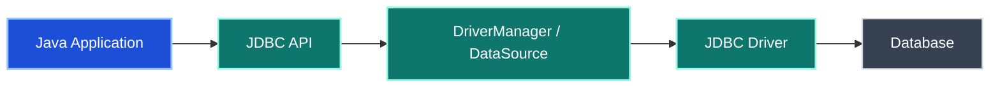
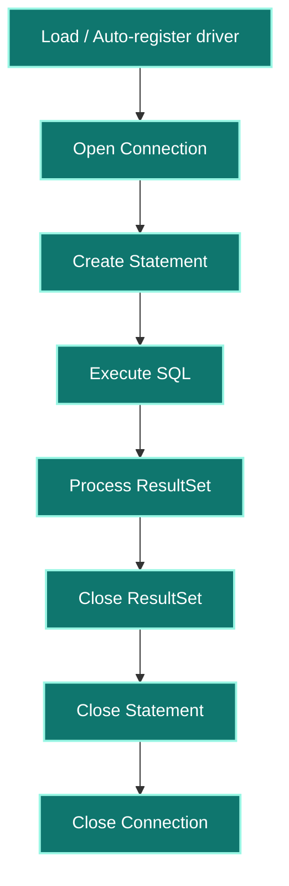
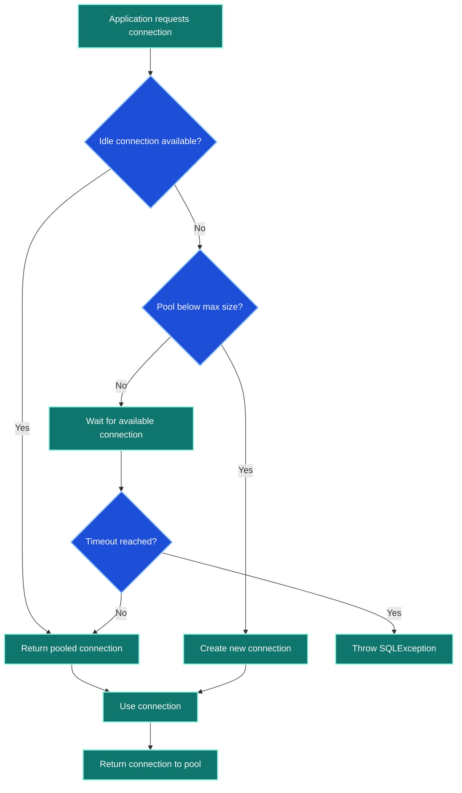

# JDBC - Comprehensive Interview Preparation Guide

> **Target Audience:** 7+ Years Experience | Java Developer
>
> **Coverage:** JDBC architecture, driver loading, `Connection`, `Statement`, `PreparedStatement`, `CallableStatement`, transactions, savepoints, batching, pooling, BLOB/CLOB, `RowSet`, and Spring ecosystem comparisons

---

## Table of Contents

| Section | Topic |
|---|---|
| [Section 1](#section-1-foundation-and-architecture) | Foundation and Architecture |
| [Round 1](#round-1-basic-and-resume-discussion) | Basic and Resume Discussion |
| [Round 2](#round-2-core-technical-deep-dive) | Core Technical Deep Dive |
| [Round 3](#round-3-advanced-and-performance) | Advanced and Performance |
| [Round 4](#round-4-scenario-based-and-troubleshooting) | Scenario-Based and Troubleshooting |
| [Round 5](#round-5-architecture-and-ecosystem-comparison) | Architecture and Ecosystem Comparison |
| [Section 2](#section-2-large-data-stored-procedures-and-rowset) | Large Data, Stored Procedures, and RowSet |
| [Quick Reference](#quick-reference-and-cheat-sheet) | Cheat Sheet and Rapid Revision |

---

## Section 1: Foundation and Architecture

### What JDBC Is

**JDBC** stands for **Java Database Connectivity**. It is the standard Java API used to connect Java applications to relational databases and execute SQL operations such as:

- `SELECT`
- `INSERT`
- `UPDATE`
- `DELETE`
- DDL operations like `CREATE` and `ALTER`

### Standard JDBC Development Steps

1. Import JDBC packages.
2. Load or auto-register the JDBC driver.
3. Establish a `Connection`.
4. Create a `Statement`, `PreparedStatement`, or `CallableStatement`.
5. Execute SQL.
6. Process the `ResultSet` if applicable.
7. Close resources in reverse order.

```java
import java.sql.*;
```

### JDBC Request Flow



### JDBC Architecture

| Component | Role | Notes |
|---|---|---|
| `DriverManager` | Creates connections from a JDBC URL | Simple, but not pooled |
| `DataSource` | Provides connections, often pooled | Preferred in enterprise apps |
| `Connection` | Represents DB session | Used to create statements and manage transactions |
| `Statement` | Executes raw SQL | Vulnerable if SQL is concatenated |
| `PreparedStatement` | Executes parameterized SQL | Safer and faster for repeated queries |
| `CallableStatement` | Calls stored procedures | Supports `IN`, `OUT`, `INOUT` params |
| `ResultSet` | Tabular query result cursor | Read rows returned by queries |

### JDBC Driver Types

| Type | Name | Status | Notes |
|---|---|---|---|
| Type 1 | JDBC-ODBC Bridge | Deprecated | Not used in modern production |
| Type 2 | Native-API Driver | Rare | Requires native libraries |
| Type 3 | Network Protocol Driver | Rare | Uses middleware server |
| Type 4 | Thin Driver | Recommended | Pure Java, common for MySQL/PostgreSQL |

### SQL Categories and JDBC Execution Methods

**Database-side SQL categories:**

- DDL -> `CREATE`, `ALTER`, `DROP`
- DML -> `INSERT`, `UPDATE`, `DELETE`
- DQL -> `SELECT`
- DCL -> `GRANT`, permission changes
- TCL -> `COMMIT`, `ROLLBACK`, `SAVEPOINT`

**From a Java developer perspective, JDBC usually separates work into:**

- **select queries**
- **non-select queries**

| Method | Use Case | Return Type |
|---|---|---|
| `executeQuery()` | `SELECT` statements | `ResultSet` |
| `executeUpdate()` | `INSERT`, `UPDATE`, `DELETE`, many DDL statements | `int` rows affected |
| `execute()` | Generic fallback when statement type may vary | `boolean` |

```java
ResultSet rs = stmt.executeQuery("SELECT * FROM actor");
int rows = stmt.executeUpdate("UPDATE actor SET first_name = 'Sai' WHERE actor_id = 4");
boolean result = stmt.execute("DELETE FROM actor WHERE actor_id = 10");
```

#### Key Takeaways

- JDBC is the foundational Java API for relational database access.
- In real projects, `DataSource` and pooling matter more than raw `DriverManager`.
- Type 4 drivers are the standard answer for modern JDBC usage.
- Know when to use `executeQuery`, `executeUpdate`, and `execute`.

---

## Round 1: Basic and Resume Discussion

### Q1. `Statement` vs `PreparedStatement` vs `CallableStatement`

| API | Best Use | Pros | Risks / Limits |
|---|---|---|---|
| `Statement` | One-off static SQL | Simple | SQL injection risk, query recompiled often |
| `PreparedStatement` | Parameterized SQL | Safer, reusable, usually precompiled | Slightly more setup |
| `CallableStatement` | Stored procedures | Good for DB procedures and mixed in/out params | More DB-coupled |

```java
// Statement - vulnerable if user input is concatenated
Statement stmt = conn.createStatement();
ResultSet rs1 = stmt.executeQuery("SELECT * FROM users WHERE id = " + userId);
```

```java
// PreparedStatement - preferred
PreparedStatement ps = conn.prepareStatement(
    "SELECT * FROM users WHERE id = ?"
);
ps.setInt(1, userId);
ResultSet rs2 = ps.executeQuery();
```

```java
// CallableStatement - stored procedure
CallableStatement cs = conn.prepareCall("{call getEmployeeById(?)}");
cs.setInt(1, empId);
ResultSet rs3 = cs.executeQuery();
```

### Internal PreparedStatement Flow

```text
conn.prepareStatement(sql)
-> SQL sent to DB engine
-> parsed and compiled
-> execution plan cached
-> parameters bound with setXxx(...)
-> executeQuery() / executeUpdate() reuses the prepared plan
```

#### Key Takeaways

- `PreparedStatement` is the default choice in interview and production answers.
- `Statement` is acceptable only for trusted static SQL with no user input.
- `CallableStatement` is important when DB logic lives in stored procedures.

---

### Q2. JDBC Connection Lifecycle



**Lifecycle summary:**

1. Driver is loaded manually or auto-registered.
2. `Connection` is created using URL, username, and password.
3. Statement object is created.
4. SQL is executed.
5. `ResultSet` rows are processed.
6. Resources are closed in reverse order.

```java
try (Connection conn = dataSource.getConnection();
     PreparedStatement ps = conn.prepareStatement("SELECT * FROM actor WHERE actor_id = ?");
     ResultSet rs = ps.executeQuery()) {

    while (rs.next()) {
        System.out.println(rs.getInt("actor_id"));
    }
}
```

#### Key Takeaways

- Always close `ResultSet`, `Statement`, and `Connection`.
- `try-with-resources` is the strongest production answer.
- Resource leaks usually become pool exhaustion or application hangs later.

---

### Q3. Driver Loading History: `registerDriver`, `Class.forName`, and JDBC 4 Auto-Loading

| Approach | Era | Example | Notes |
|---|---|---|---|
| Manual driver object registration | Older JDBC | `DriverManager.registerDriver(new Driver())` | Rare today |
| `Class.forName(...)` | JDBC 3.x era | `Class.forName("com.mysql.cj.jdbc.Driver")` | Still recognized in interviews |
| JDBC 4 auto-loading | Modern | Driver discovered from classpath | Preferred behavior today |

```java
Driver driver = new com.mysql.cj.jdbc.Driver();
DriverManager.registerDriver(driver);
```

```java
Class.forName("com.mysql.cj.jdbc.Driver");
```

### JDBC 4 Auto-Loading

**What happens internally:**

1. JVM scans the driver JAR on the classpath.
2. It checks `META-INF/services`.
3. It finds the `java.sql.Driver` service entry.
4. The driver is loaded automatically.

#### Key Takeaways

- In modern applications, driver auto-loading usually removes the need for `Class.forName`.
- Interviewers still ask about `Class.forName`, so know both old and new behavior.
- Saying "JDBC 4 uses `META-INF/services` for auto-loading" is a strong senior-level detail.

---

## Round 2: Core Technical Deep Dive

### Q4. `DataSource` vs `DriverManager`

| Aspect | `DriverManager` | `DataSource` |
|---|---|---|
| Connection creation | New connection each time | Often reuses pooled connections |
| Pooling support | No | Yes |
| Enterprise suitability | Low | High |
| Configuration style | Direct code/JDBC URL | Configurable bean or provider object |
| Best use | Simple demos | Production systems |

```java
Connection conn = DriverManager.getConnection(url, username, password);
```

```java
MysqlConnectionPoolDataSource ds = new MysqlConnectionPoolDataSource();
ds.setUrl("jdbc:mysql://localhost:3306/testschema");
ds.setUser("root");
ds.setPassword("secret");

Connection conn = ds.getConnection();
```

**Important difference from the notes:**

- `DriverManager.getConnection()` typically creates a new connection.
- `DataSource.getConnection()` often returns an existing connection from a pool.

#### Key Takeaways

- `DataSource` is the right answer for production JDBC.
- `DriverManager` is fine for small examples and interviews about basics.
- Pooling is the key reason `DataSource` wins in enterprise apps.

---

### Q5. Connection Pooling and HikariCP

**Why pooling matters:** Creating a new DB connection is expensive because it includes network setup, authentication, and DB session creation.



### HikariCP Tuning Basics

```properties
spring.datasource.hikari.minimum-idle=5
spring.datasource.hikari.maximum-pool-size=20
spring.datasource.hikari.idle-timeout=300000
spring.datasource.hikari.max-lifetime=1200000
spring.datasource.hikari.connection-timeout=30000
spring.datasource.hikari.leak-detection-threshold=60000
```

### HikariCP Notes

- Spring Boot uses HikariCP by default.
- `maximumPoolSize` controls concurrency capacity.
- `connectionTimeout` limits how long callers wait.
- `maxLifetime` should be lower than DB/network timeouts.
- Metrics can be exposed through JMX or Micrometer.

**Real-world scenario:** A connection leak can exhaust all connections in the pool and make the app appear hung even though the database is healthy.

#### Key Takeaways

- Pooling is mandatory in production JDBC applications.
- HikariCP is the standard Spring Boot answer.
- Most pool failures are caused by leaked or long-held connections.

---

### Q6. Transaction Management in JDBC

By default, JDBC usually runs in **auto-commit mode**, meaning every statement commits immediately.

```java
conn.setAutoCommit(false);
try {
    debitPs.executeUpdate();
    creditPs.executeUpdate();
    conn.commit();
} catch (SQLException e) {
    conn.rollback();
    throw e;
}
```

### Savepoint Example

```java
conn.setAutoCommit(false);
Savepoint sp = conn.setSavepoint("afterDebit");
try {
    creditPs.executeUpdate();
} catch (SQLException e) {
    conn.rollback(sp);
}
conn.commit();
```


#### Key Takeaways

- Disable auto-commit for multi-step business operations.
- `commit()` makes the whole transaction permanent.
- Savepoints allow partial rollback inside one larger transaction.

---

### Q7. Transaction Isolation Levels

| Isolation Level | Dirty Read | Non-Repeatable Read | Phantom Read | Notes |
|---|---|---|---|---|
| `READ_UNCOMMITTED` | Yes | Yes | Yes | Fastest, least safe |
| `READ_COMMITTED` | No | Yes | Yes | Common default in many DBs |
| `REPEATABLE_READ` | No | No | Yes | MySQL InnoDB default |
| `SERIALIZABLE` | No | No | No | Safest, slowest |

```java
conn.setTransactionIsolation(Connection.TRANSACTION_READ_COMMITTED);
```

### Read Anomalies

- **Dirty read:** Read uncommitted data from another transaction.
- **Non-repeatable read:** Same row returns different values in one transaction.
- **Phantom read:** Same condition returns different row counts in one transaction.

#### Key Takeaways

- Isolation is a consistency-versus-concurrency tradeoff.
- `READ_COMMITTED` and `REPEATABLE_READ` are the most practical interview levels to discuss.
- Mention anomalies by name, not just the enum values.

---

### Q8. `ResultSet` Types and Concurrency

| ResultSet Type | Meaning |
|---|---|
| `TYPE_FORWARD_ONLY` | Move only forward |
| `TYPE_SCROLL_INSENSITIVE` | Scrollable, does not reflect DB changes |
| `TYPE_SCROLL_SENSITIVE` | Scrollable, may reflect DB changes |

| Concurrency Mode | Meaning |
|---|---|
| `CONCUR_READ_ONLY` | Read only |
| `CONCUR_UPDATABLE` | Update/delete via result set |

```java
Statement stmt = conn.createStatement(
    ResultSet.TYPE_SCROLL_INSENSITIVE,
    ResultSet.CONCUR_UPDATABLE
);
```

#### Key Takeaways

- Default JDBC usage is usually forward-only and read-only.
- Scrollable and updatable result sets exist, but are less common in modern service code.
- In interviews, explain that `PreparedStatement` and direct DML are usually preferred over updatable result sets.

---

## Round 3: Advanced and Performance

### Q9. Batch Processing

**Why use it:** Without batching, every insert/update is a separate round trip to the database.

```java
String sql = "INSERT INTO employees(name, dept, salary) VALUES (?, ?, ?)";

try (PreparedStatement ps = conn.prepareStatement(sql)) {
    conn.setAutoCommit(false);

    for (int i = 0; i < employees.size(); i++) {
        ps.setString(1, employees.get(i).getName());
        ps.setString(2, employees.get(i).getDept());
        ps.setDouble(3, employees.get(i).getSalary());
        ps.addBatch();

        if ((i + 1) % 1000 == 0) {
            ps.executeBatch();
            ps.clearBatch();
        }
    }

    ps.executeBatch();
    conn.commit();
}
```

```properties
jdbc:mysql://localhost:3306/db?rewriteBatchedStatements=true
```

### Batch Best Practices

- disable auto-commit
- execute in chunks
- clear batch after execution
- commit in controlled sizes
- log failures carefully

#### Key Takeaways

- Batching is one of the easiest JDBC performance wins.
- `PreparedStatement + addBatch() + executeBatch()` is the expected interview answer.
- Chunk size matters; do not batch unbounded data in one huge transaction.

---

### Q10. SQL Injection Prevention

**Unsafe example:**

```java
String sql = "SELECT * FROM users WHERE name = '" + userInput + "'";
Statement stmt = conn.createStatement();
ResultSet rs = stmt.executeQuery(sql);
```

**Safe example:**

```java
PreparedStatement ps = conn.prepareStatement(
    "SELECT * FROM users WHERE name = ?"
);
ps.setString(1, userInput);
ResultSet rs = ps.executeQuery();
```

### Prevention Checklist

1. Use `PreparedStatement` always for user input.
2. Validate input with allow-lists where possible.
3. Use least-privilege DB users.
4. Use stored procedures carefully where appropriate.
5. Avoid manual escaping as the primary defense.

#### Key Takeaways

- `PreparedStatement` is both a security and performance answer.
- String concatenation plus user input is the classic JDBC injection bug.
- Mention least privilege to strengthen the answer beyond code-level defense.

---

### Q11. JDBC Performance Tuning Checklist

1. Use connection pooling.
2. Prefer `PreparedStatement`.
3. Batch bulk DML.
4. Fetch only required columns.
5. Set sensible fetch size when processing many rows.
6. Add proper DB indexes.
7. Use pagination instead of loading full tables.
8. Close resources promptly.
9. Keep transactions short.
10. Measure slow queries from logs and DB tools.

```java
statement.setFetchSize(100);
```

#### Key Takeaways

- JDBC performance is mostly about round trips, query shape, and connection reuse.
- Avoid `SELECT *` in interview and production answers.
- Proper logging and DB-side visibility matter as much as Java-side tuning.

---

### Q12. JDBC-Level Repeated Query / N+1-Style Problem

JDBC does not have ORM lazy loading, but it can still suffer from a **repeated-query problem** similar to N+1 when the application loops and fires a query per parent row.

**Bad pattern:**

1. Query all departments.
2. For each department, query employees separately.

**How to detect it:**

- SQL logs show the same query repeated many times with different IDs
- DB monitoring shows unusually high round-trip counts
- performance degrades as row count grows

**Fixes:**

- join in one SQL query where appropriate
- fetch in chunks
- use `IN (...)` batching
- redesign DAO access pattern

#### Key Takeaways

- Repeated query patterns are not only an ORM problem.
- In plain JDBC, the fix is usually better SQL and fewer round trips.
- Mention log analysis and query counting in detection answers.

---

## Round 4: Scenario-Based and Troubleshooting

### Q13. `CallableStatement` for Stored Procedures

**Procedure call with input parameter:**

```java
CallableStatement cs = conn.prepareCall("{CALL GetStudentDetailsByAge(?)}");
cs.setInt(1, age);
ResultSet rs = cs.executeQuery();
```

**Procedure call with input and output parameters:**

```java
CallableStatement cs = conn.prepareCall("{CALL GetStudentDetailsAndCount(?, ?, ?, ?)}");
cs.setInt(1, age);
cs.registerOutParameter(2, Types.INTEGER);
cs.registerOutParameter(3, Types.INTEGER);
cs.registerOutParameter(4, Types.VARCHAR);

cs.execute();
int total = cs.getInt(2);
```

#### Key Takeaways

- `CallableStatement` is the JDBC API for stored procedures.
- Know `setXxx(...)` for input and `registerOutParameter(...)` for output.
- Stored procedures increase DB coupling, so use them deliberately.

---

### Q14. Connection Leak Detection and Prevention

**Symptoms:**

- app hangs after some time
- pool reaches max size
- requests time out waiting for DB connections

**Root cause:** Connections borrowed but not returned.

**Prevention:**

- use `try-with-resources`
- avoid long-running DB work in one request
- return connections quickly
- enable leak detection in the pool

```properties
spring.datasource.hikari.leak-detection-threshold=60000
```

#### Key Takeaways

- Leaks are a lifecycle bug, not just a database problem.
- Pool exhaustion often points to missing closes or long transactions.
- `try-with-resources` is the best prevention answer.

---

### Q15. Common JDBC Mistakes

| Mistake | Problem | Better Approach |
|---|---|---|
| Using `Statement` with user input | SQL injection | Use `PreparedStatement` |
| Opening a new connection each time | Slow, expensive | Use pooled `DataSource` |
| Forgetting `close()` | Leaks resources | Use `try-with-resources` |
| Auto-commit for multi-step business logic | Partial success bugs | Use manual transaction control |
| Huge result set in memory | Slow and memory-heavy | Paginate or stream carefully |
| Massive single transaction batch | Rollback pain, lock contention | Use chunked batching |

#### Key Takeaways

- Most JDBC production bugs come from lifecycle and transaction mistakes.
- Interviewers like hearing both the bug and the safer pattern.
- Resource handling discipline matters as much as SQL correctness.

---

## Round 5: Architecture and Ecosystem Comparison

### Q16. JDBC vs Spring JDBC vs Spring Data JPA

| Layer | Strength | Tradeoff | Best Use |
|---|---|---|---|
| Raw JDBC | Maximum control | Most boilerplate | Low-level tuning, custom SQL-heavy paths |
| Spring JDBC (`JdbcTemplate`) | Less boilerplate | Still SQL-centric | Service apps wanting SQL control with cleaner code |
| Spring Data JPA | Highest abstraction | Less direct SQL control | Entity-driven applications and repository abstraction |

```text
Raw JDBC -> Spring JDBC -> Spring Data JPA
More control <-----------------------------> More abstraction
More boilerplate <-------------------------> Less boilerplate
```

### DAO / Repository Layer Perspective

- Raw JDBC often uses DAO classes manually mapping `ResultSet` to DTOs.
- Spring JDBC reduces manual resource management.
- ORM layers map rows to objects automatically.

#### Key Takeaways

- JDBC is still the foundation underneath higher abstractions.
- Knowing when to choose raw JDBC versus higher frameworks is a senior-level discussion.
- Control versus boilerplate is the key tradeoff.

---

### Q17. JDBC Backend Execution Flow

**Good interview answer:**

1. Driver is loaded or auto-discovered.
2. Application requests a `Connection`.
3. Driver translates JDBC calls into DB-specific protocol.
4. Database parses and executes SQL.
5. Results are returned as `ResultSet`.
6. Application converts rows into DTOs or domain objects.

#### Key Takeaways

- JDBC is an abstraction over vendor-specific database protocols.
- The driver is the bridge between generic JDBC calls and DB-specific implementation.
- In plain JDBC, row-to-object mapping is manual.

---

## Section 2: Large Data, Stored Procedures, and RowSet

### Q18. BLOB and CLOB Handling

| Type | Meaning | Common Use |
|---|---|---|
| BLOB | Binary Large Object | Images, audio, PDF, binary files |
| CLOB | Character Large Object | Resumes, XML, large text documents |

### Insert BLOB Example

```java
try (Connection conn = dataSource.getConnection();
     PreparedStatement ps =
         conn.prepareStatement("INSERT INTO student_files(name, image_data) VALUES (?, ?)");
     FileInputStream fis = new FileInputStream("photo.png")) {

    ps.setString(1, "Teja");
    ps.setBlob(2, fis);
    ps.executeUpdate();
}
```

### Read BLOB Example

```java
try (Connection conn = dataSource.getConnection();
     PreparedStatement ps =
         conn.prepareStatement("SELECT image_data FROM student_files WHERE id = ?");
     FileOutputStream fos = new FileOutputStream("downloaded.png")) {

    ps.setInt(1, 1);
    try (ResultSet rs = ps.executeQuery()) {
        if (rs.next()) {
            try (InputStream in = rs.getBinaryStream(1)) {
                in.transferTo(fos);
            }
        }
    }
}
```

### Read CLOB Example

```java
try (Connection conn = dataSource.getConnection();
     PreparedStatement ps =
         conn.prepareStatement("SELECT resume_text FROM student_files WHERE id = ?")) {

    ps.setInt(1, 1);
    try (ResultSet rs = ps.executeQuery()) {
        if (rs.next()) {
            try (Reader reader = rs.getCharacterStream(1)) {
                String text = new BufferedReader(reader).lines()
                    .reduce("", (a, b) -> a + b + System.lineSeparator());
                System.out.println(text);
            }
        }
    }
}
```

#### Key Takeaways

- Use `setBlob`, `getBinaryStream`, `setClob`, and `getCharacterStream` for large data.
- Stream large content instead of loading everything into memory blindly.
- BLOB/CLOB questions are common in senior JDBC interviews.

---

### Q19. RowSet Overview

`RowSet` is a richer alternative to plain `ResultSet`. It can be scrollable, updatable, serializable, and in some cases disconnected from the database.

| RowSet Type | Category | Notes |
|---|---|---|
| `JdbcRowSet` | Connected | Needs active DB connection |
| `CachedRowSet` | Disconnected | Can work after connection closes |
| `WebRowSet` | Disconnected | XML-capable rowset |
| `FilteredRowSet` | Disconnected | Filtered view of row data |
| `JoinRowSet` | Disconnected | Join-like combined row views |

### RowSet Creation

```java
RowSetFactory factory = RowSetProvider.newFactory();
JdbcRowSet jdbcRowSet = factory.createJdbcRowSet();
CachedRowSet cachedRowSet = factory.createCachedRowSet();
WebRowSet webRowSet = factory.createWebRowSet();
FilteredRowSet filteredRowSet = factory.createFilteredRowSet();
JoinRowSet joinRowSet = factory.createJoinRowSet();
```

### `JdbcRowSet` Example

```java
RowSetFactory factory = RowSetProvider.newFactory();
try (JdbcRowSet rowSet = factory.createJdbcRowSet()) {
    rowSet.setUrl("jdbc:mysql://localhost:3306/testschema");
    rowSet.setUsername("root");
    rowSet.setPassword("secret");
    rowSet.setCommand("SELECT * FROM accounts");
    rowSet.execute();

    while (rowSet.next()) {
        System.out.println(rowSet.getInt(1) + " " + rowSet.getString(2));
    }
}
```

#### Key Takeaways

- `RowSet` is more flexible than plain `ResultSet`, especially for disconnected usage.
- `JdbcRowSet` is connected; `CachedRowSet` and others support disconnected access.
- Mention serializability and disconnected behavior in interviews.

---

### Q20. JDBC and Database Migration Tools

| Tool | Best For | Style |
|---|---|---|
| Flyway | Simple versioned SQL migrations | Linear, convention-based |
| Liquibase | Complex, structured DB changes | XML/YAML/JSON/SQL changelogs |

**Why this matters for JDBC developers:**

- schema changes should be tracked
- SQL-dependent systems need repeatable DB evolution
- avoids manual production DB drift

#### Key Takeaways

- JDBC-heavy projects still need disciplined schema migration.
- Flyway is simpler; Liquibase is more expressive.
- This is a useful ecosystem-level answer even though it is not a JDBC API itself.

---

## Quick Reference and Cheat Sheet

### Key Questions Index

| Q# | Topic | Core Concept |
|---|---|---|
| Q1 | Statement / Prepared / Callable | Safety, performance, stored procedures |
| Q2 | Connection lifecycle | Open, execute, process, close |
| Q3 | Driver loading | Old manual registration vs JDBC 4 auto-loading |
| Q4 | `DataSource` vs `DriverManager` | Pooling and enterprise usage |
| Q5 | Connection pooling | Reuse expensive DB connections |
| Q6 | Transactions and savepoints | Atomic multi-step operations |
| Q7 | Isolation levels | Consistency tradeoffs |
| Q8 | ResultSet types | Cursor behavior and update mode |
| Q9 | Batch processing | Reduce round trips |
| Q10 | SQL injection | Use `PreparedStatement` |
| Q13 | Stored procedures | `CallableStatement` with IN/OUT params |
| Q18 | BLOB / CLOB | Large data handling |
| Q19 | RowSet | Connected vs disconnected tabular access |

### Rapid-Fire Differences

| Comparison | A | B |
|---|---|---|
| `Statement` vs `PreparedStatement` | raw SQL, risky | parameterized, safer, reusable |
| `DriverManager` vs `DataSource` | no pool | pool-friendly |
| auto-commit vs manual transaction | each statement commits | explicit transaction control |
| `ResultSet` vs `RowSet` | connected cursor | can be richer/disconnected |
| raw JDBC vs Spring JDBC | more control | less boilerplate |
| Spring JDBC vs Spring Data JPA | SQL-focused | ORM/repository-focused |

### Best Practices to Memorize

1. Use `PreparedStatement` for all user-driven SQL.
2. Use `try-with-resources` for every JDBC resource.
3. Use `DataSource` with pooling in production.
4. Disable auto-commit for multi-step business operations.
5. Use batching for bulk inserts and updates.
6. Paginate large reads.
7. Log and analyze repeated queries.

### Common Interview Traps

1. Saying `Class.forName` is always required in modern JDBC.
2. Treating connection creation cost as negligible.
3. Forgetting that `DriverManager` does not provide pooling.
4. Using `Statement` in examples that include user input.
5. Confusing savepoints with full transaction rollback.
6. Claiming JDBC cannot have N+1-like repeated query problems.

### Senior-Level Answer Framework

When answering JDBC questions:

1. Explain the API object involved.
2. Explain the DB behavior behind it.
3. Mention the common bug or risk.
4. Give the production-safe version.
5. If relevant, compare it to Spring JDBC or JPA.

#### Key Takeaways

- JDBC interviews test both low-level API fluency and production judgment.
- Strong answers connect SQL, transactions, and resource lifecycle.
- This guide is designed for both fast revision and deeper interview discussion.

---

> **End of JDBC Analysis**
>
> *Interview-focused and production-oriented reference for senior Java developers*
