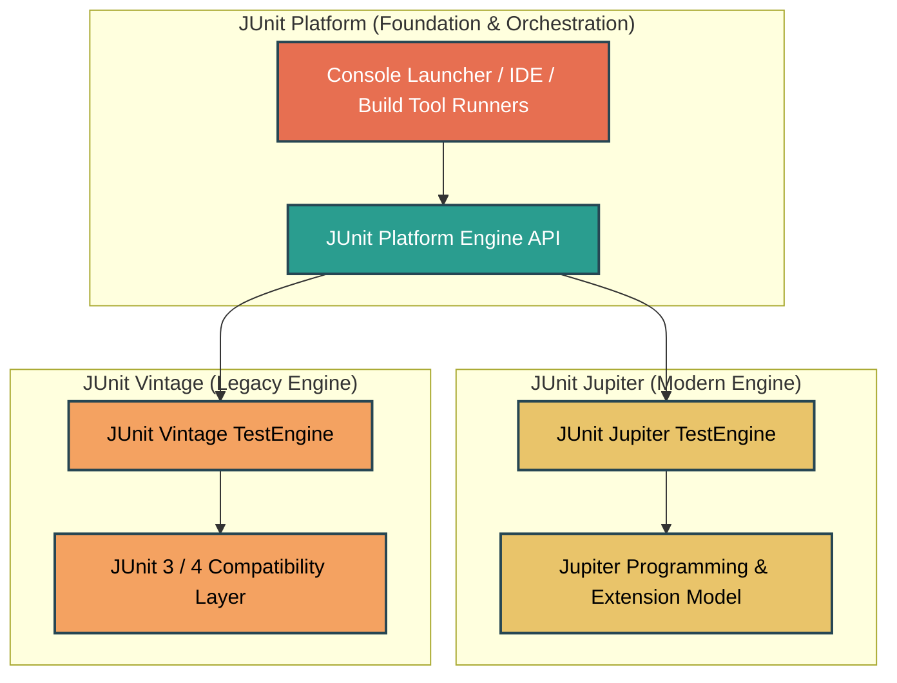
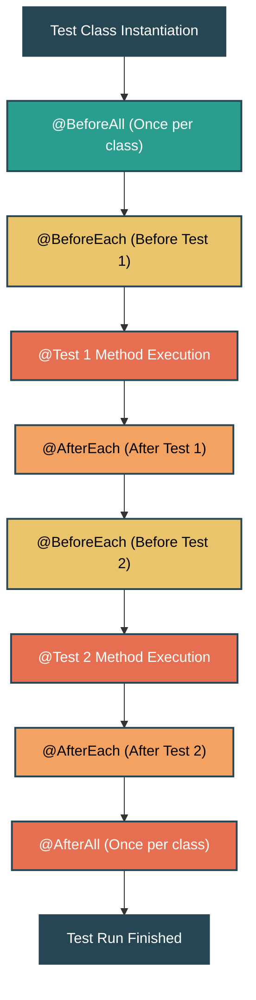
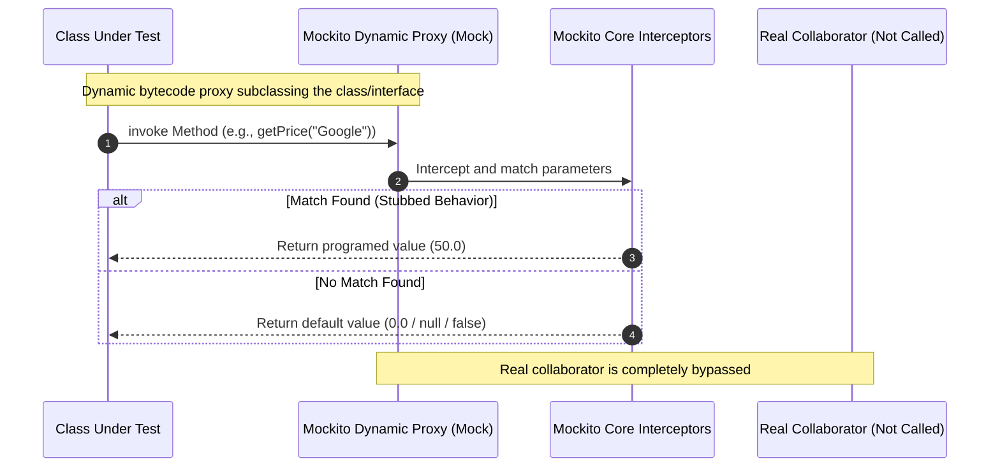
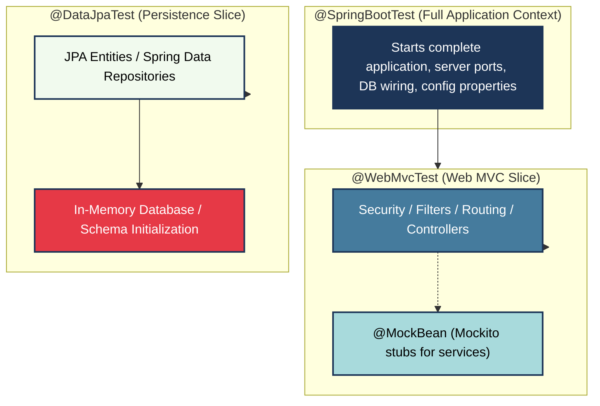

# JUNIT 5 & MOCKITO - COMPREHENSIVE INTERVIEW PREPARATION GUIDE
> *For: 7+ Years Experience Level | Java Developer*

---

## SECTION 1: UNIT TESTING FOUNDATIONS & PHILOSOPHY

### 1.1 Manual vs. Automated Testing
Testing is the process of checking the functionality of an application to ensure it runs as per requirements. Unit testing comes into picture at the developers' level; it is the testing of a single entity (class or method) in isolation.

Unit testing can be performed in two ways: manual testing and automated testing. The following table highlights the critical differences:

| Feature | Manual Testing | Automated Testing |
| :--- | :--- | :--- |
| **Execution** | Done manually by human resources without tool support. | Executed using specialized automation testing tools and frameworks (e.g., JUnit). |
| **Speed & Effort** | Time-consuming, slow, and tedious. | Extremely fast, allowing high-frequency execution (e.g., during builds). |
| **Human Resource Cost** | High investment required due to continuous manual execution needs. | Low investment after initial script creation; tests execute autonomously. |
| **Reliability** | Less reliable; prone to human errors, fatigue, and oversights. | Highly reliable; executes the exact same steps and asserts outcomes precisely. |
| **Programmability** | Non-programmable; cannot write script-based checks to extract hidden states. | Fully programmable; allows writing sophisticated checks and mock behaviors. |

---

### 1.2 The Testing Philosophy: "Test a Little, Code a Little"
JUnit promotes the core Agile practice of **First Testing, Then Coding** (popularized by Test-Driven Development - TDD). 
* **Cycle:** "Test a little, code a little, test a little, code a little."
* **Impact:** 
  1. Setting up test data first forces you to understand the requirements, input constraints, and expected output before writing logic.
  2. Increases developer productivity and stabilizes the codebase.
  3. Reduces debugging time and stress by detecting regressions immediately when code is modified.

---

### 1.3 What is a Unit Test Case?
A **Unit Test Case** is a segment of code that ensures another part of code (specifically a method) works as expected. A formal written unit test case is characterized by:
1. **Precondition (Known Input):** Configured state and inputs before execution.
2. **Post-condition (Expected Output):** Expected behavior and assertions evaluated after execution.

#### The Positive/Negative Test Rule
* For every requirement, there must be at least **two** unit test cases:
  * **Positive Test Case:** Verifies correct system behavior under normal inputs.
  * **Negative Test Case:** Verifies system resilience and exception handling under invalid inputs.
* If a requirement contains sub-requirements, **each sub-requirement** must similarly have at least one positive and one negative test case.

---

### 1.4 Core Framework Components
A unit testing framework provides structural support through four core pillars:
* **Fixtures:** A fixed state of a set of objects used as a baseline for running tests. Fixtures ensure a repeatable, well-known environment (e.g., setting up temporary database tables or stubbing common beans before each test).
* **Test Suites:** A bundle of multiple unit test cases executed together as a single batch.
* **Test Runners:** The underlying engine used to execute test cases and report results.
* **JUnit Classes:** Helper utility classes provided by the framework to perform assertions, hold results, and define test configurations.

#### Key Takeaways

- Automated unit testing is highly reliable, fast, and programmable, reducing human error.
- The "Test a little, code a little" philosophy improves productivity and decreases debugging cycles.
- Every requirement needs at least one positive and one negative test case to ensure full path coverage.

---

## SECTION 2: JUNIT ARCHITECTURE & SETUP

### 2.1 JUnit 5 Architecture
Unlike JUnit 4 which was a single monolithic JAR, **JUnit 5** is completely modular and composed of three distinct sub-projects:

$$\text{JUnit 5} = \text{JUnit Platform} + \text{JUnit Jupiter} + \text{JUnit Vintage}$$

* **JUnit Platform:** Launches testing frameworks on the JVM. It defines the `TestEngine` API for orchestrating execution.
* **JUnit Jupiter:** The modern programming model, extension model, and engine for JUnit 5 tests.
* **JUnit Vintage:** A compatibility layer that allows running JUnit 3 and JUnit 4 tests on the modern platform.



---

### 2.2 Environment Setup (Legacy vs. Modern)

#### Legacy JUnit 4 Manual Setup (Historical Reference)
Historically, projects configured JUnit manually via jar files and environment variables.
* **System Requirements:** JDK 1.5 or above.
* **Core Archives:** `junit-4.10.jar` / `junit-4.11.jar` and `hamcrest-core-1.2.1.jar`.
* **Path Variables:**
  * `JUNIT_HOME` pointing to `C:\JUNIT`.
  * `CLASSPATH` configured to:
    ```text
    %CLASSPATH%;%JUNIT_HOME%\junit4.11.jar;%JUNIT_HOME%\hamcrest-core-1.2.1.jar;.;
    ```
* **Verification:** Compile and run using command line:
  ```powershell
  javac -cp "%CLASSPATH%" TestJunit.java TestRunner.java
  java -cp "%CLASSPATH%" TestRunner
  ```

#### Modern JUnit 5 Maven Setup
In modern projects, dependencies are managed transitively through build tools. You only need to declare the JUnit Jupiter starter in your `pom.xml`:

```xml
<dependencies>
    <!-- JUnit Jupiter API & Engine (Platform resolved transitively) -->
    <dependency>
        <groupId>org.junit.jupiter</groupId>
        <artifactId>junit-jupiter</artifactId>
        <version>5.10.2</version>
        <scope>test</scope>
    </dependency>
    <!-- Mockito Core for Unit Testing Mocks -->
    <dependency>
        <groupId>org.mockito</groupId>
        <artifactId>mockito-core</artifactId>
        <version>5.11.0</version>
        <scope>test</scope>
    </dependency>
    <!-- Mockito JUnit Jupiter Extension -->
    <dependency>
        <groupId>org.mockito</groupId>
        <artifactId>mockito-junit-jupiter</artifactId>
        <version>5.11.0</version>
        <scope>test</scope>
    </dependency>
</dependencies>
```

#### Key Takeaways

- JUnit 5 splits responsibilities into Platform (engine launcher), Jupiter (modern JUnit 5 API), and Vintage (JUnit 3/4 runtime).
- Modern build configurations eliminate manual classpath setup, relying on transient dependency resolution in Maven/Gradle.
- Transitioning to JUnit 5 requires replacing JUnit 4 runner rules with Jupiter Extensions (`@ExtendWith`).

---

## SECTION 3: TEST LIFECYCLE & FIXTURES

### 3.1 JUnit 4 vs. JUnit 5 Lifecycles
JUnit uses lifecycle annotations to manage test setup (fixtures) and teardown.

| Feature | Legacy JUnit 4 | Modern JUnit 5 | Purpose |
| :--- | :--- | :--- | :--- |
| **Class-level Setup** | `@BeforeClass` | `@BeforeAll` | Runs once before all tests in the class (must be static). |
| **Class-level Teardown** | `@AfterClass` | `@AfterAll` | Runs once after all tests in the class (must be static). |
| **Method-level Setup** | `@Before` | `@BeforeEach` | Runs before every individual `@Test` method. |
| **Method-level Teardown** | `@After` | `@AfterEach` | Runs after every individual `@Test` method. |
| **Skip Test** | `@Ignore` | `@Disabled` | Disables a test class or method from execution. |
| **Exception Testing** | `@Test(expected = Ex.class)` | `assertThrows(Ex.class, executable)` | Asserts that a block of code throws a specific exception. |
| **Timeout Testing** | `@Test(timeout = 1000)` | `assertTimeout(duration, executable)` | Asserts that code execution completes within a time threshold. |

---

### 3.2 Test Lifecycle Flow
The following diagram demonstrates the execution order of lifecycle methods. A new instance of the test class is created by default for each test method to maintain test isolation.



---

### 3.3 Test Suites
Test Suites bundle multiple test classes to run them as a single logical unit.

#### Legacy JUnit 4 Suite (Suite Runner)
```java
import org.junit.runner.RunWith;
import org.junit.runners.Suite;

@RunWith(Suite.class)
@Suite.SuiteClasses({
   TestJunit1.class,
   TestJunit2.class
})
public class LegacyTestSuite {
    // Left intentionally empty. Acts as holder for annotations.
}
```

#### Modern JUnit 5 Suite
JUnit 5 provides the platform suite engine using modern annotations:
```java
import org.junit.platform.suite.api.SelectClasses;
import org.junit.platform.suite.api.Suite;

@Suite
@SelectClasses({
    TestJunit1.class,
    TestJunit2.class
})
public class ModernTestSuite {
    // Left intentionally empty.
}
```

---

### 3.4 Test Runners
Runners are responsible for parsing annotations, running test classes, and reporting statistics.

#### Legacy JUnit 4 Console Execution
JUnit 4 uses `JUnitCore` to execute tests from a command-line environment:
```java
import org.junit.runner.JUnitCore;
import org.junit.runner.Result;
import org.junit.runner.notification.Failure;

public class LegacyTestRunner {
    public static void main(String[] args) {
        Result result = JUnitCore.runClasses(TestJunit1.class);
        for (Failure failure : result.getFailures()) {
            System.out.println("Failure: " + failure.toString());
        }
        System.out.println("Was Successful? " + result.wasSuccessful());
    }
}
```

#### Modern JUnit 5 Platform Launcher
In JUnit 5, test runners are integrated directly into your build tools (Maven Surefire, Gradle `test`) or IDE. You can programmatically launch tests using the `LauncherFactory`:
```java
import org.junit.platform.launcher.Launcher;
import org.junit.platform.launcher.LauncherDiscoveryRequest;
import org.junit.platform.launcher.core.LauncherDiscoveryRequestBuilder;
import org.junit.platform.launcher.core.LauncherFactory;
import org.junit.platform.launcher.core.DiscoverySelectors;

public class ModernTestLauncher {
    public static void main(String[] args) {
        LauncherDiscoveryRequest request = LauncherDiscoveryRequestBuilder.request()
            .selectors(DiscoverySelectors.selectClass(TestJunit1.class))
            .build();
        Launcher launcher = LauncherFactory.create();
        launcher.execute(request);
    }
}
```

#### Key Takeaways

- JUnit 5 instantiates a new class instance for each `@Test` method execution to prevent inter-test state contamination.
- `@BeforeAll` and `@AfterAll` must be static methods under default test instance lifecycles.
- Modern test runner engines use `JUnitPlatform` APIs instead of the monolithic `JUnitCore` runner.

---

## SECTION 4: MOCKITO FOUNDATIONS & BENEFITS

### 4.1 What is Mocking?
Unit testing checks a single entity (class/method) in isolation. However, in enterprise code, classes depend on complex collaborators (e.g., external APIs, file servers, databases). 

**Mocking** is a technique that replaces real collaborators with fake, pre-programmed objects (mocks). This ensures:
1. **Isolation:** The class under test is tested independently of its dependencies.
2. **Speed:** No network hops, database connections, or disk reads occur during execution.
3. **Control:** Mocks can be instructed to return specific data, throw exceptions, or introduce delay to test system behavior.

---

### 4.2 Dynamic Proxy Mechanism (How Mockito Works)
Mockito uses Java Reflection and dynamic byte code generation (via ByteBuddy) under the hood. When you request a mock of an interface or class:
1. Mockito generates a dynamic subclass (proxy) of the target at runtime.
2. It overrides all methods to redirect calls to Mockito's internal interceptor handlers.
3. The interceptor matches parameters and returns stubbed values, bypassing the real implementation.



---

### 4.3 Core Benefits of Mockito
* **No Handwriting:** You don't have to write custom stub classes for every scenario.
* **Refactoring Safe:** Mock objects are created dynamically at runtime. If you rename interface methods or reorder parameters, the compiler captures changes and tests will adjust instantly without breaking mock definitions.
* **Exception Support:** Can stub void and non-void methods to throw checked or unchecked exceptions.
* **Order Check Support:** Validates whether methods on single or multiple mocks were invoked in a strict sequence.
* **Annotation Support:** Declares mocks declaratively via `@Mock`, `@Spy`, and `@InjectMocks` clean syntax.

---

### 4.4 Mocks vs. Spies vs. Stubs

| Concept | Definition | Real Method Invoked? | Default Behavior | Best Use Case |
| :--- | :--- | :--- | :--- | :--- |
| **Mock** | A complete double with no real implementation logic. | **No** (unless stubbed). | Returns default values (`null`, `0`, `false`, empty collections). | Verifying mock method calls and stubbing external dependency behaviors. |
| **Spy** | A partial mock wrapped around a real object instance. | **Yes** (calls actual methods). | Performs real logic unless a specific method is stubbed. | Mocking legacy APIs, or testing class methods while mocking other internal methods. |
| **Stub** | A basic test double pre-programmed with canned responses. | **No**. | Hardcoded to return specific predefined values. | Simple state-based testing where you only require mock query data. |

#### Key Takeaways

- Mocks bypass real collaborator execution to enforce strict isolation in unit tests.
- Dynamic proxies intercept collaborator invocations using runtime reflection.
- Spies call real object methods unless explicitly stubbed using `doReturn().when()`.

---

## SECTION 5: PRACTICAL CODE WALKTHROUGHS

### 5.1 Walkthrough 1: MessageUtil Print Message

#### The Class Under Test
```java
public class MessageUtil {
    private String message;

    public MessageUtil(String message) {
        this.message = message;
    }

    public String printMessage() {
        System.out.println(message);
        return message;
    }
}
```

#### Legacy JUnit 4 style test with runner
```java
import org.junit.Test;
import static org.junit.Assert.assertEquals;

public class LegacyMessageUtilTest {
    String message = "Hello World";
    MessageUtil messageUtil = new MessageUtil(message);

    @Test
    public void testPrintMessage() {
        assertEquals(message, messageUtil.printMessage());
    }
}
```

#### Modern JUnit 5 style test with Display Name
```java
import org.junit.jupiter.api.Test;
import org.junit.jupiter.api.DisplayName;
import static org.junit.jupiter.api.Assertions.assertEquals;

class ModernMessageUtilTest {
    private final String message = "Hello World";
    private final MessageUtil messageUtil = new MessageUtil(message);

    @Test
    @DisplayName("Should return matching printed message")
    void testPrintMessage() {
        assertEquals(message, messageUtil.printMessage(), "Message should match the constructor input");
    }
}
```

---

### 5.2 Walkthrough 2: Stock Portfolio

#### Domain Classes & Collaborator Interface
```java
public class Stock {
    private String id;
    private String name;
    private int quantity;

    public Stock(String id, String name, int quantity) {
        this.id = id;
        this.name = name;
        this.quantity = quantity;
    }

    // Getters
    public String getId() { return id; }
    public String getName() { return name; }
    public int getQuantity() { return quantity; }
}

public interface StockService {
    double getPrice(Stock stock);
}

public class Portfolio {
    private StockService stockService;
    private List<Stock> stocks;

    public double getMarketValue() {
        double marketValue = 0.0;
        for (Stock stock : stocks) {
            marketValue += stockService.getPrice(stock) * stock.getQuantity();
        }
        return marketValue;
    }

    // Setters/Getters
    public void setStockService(StockService stockService) { this.stockService = stockService; }
    public void setStocks(List<Stock> stocks) { this.stocks = stocks; }
    public List<Stock> getStocks() { return stocks; }
}
```

#### Legacy JUnit 4 + Manual Mockito Setup
```java
import java.util.ArrayList;
import java.util.List;
import org.junit.Test;
import static org.junit.Assert.assertEquals;
import static org.mockito.Mockito.*;

public class LegacyPortfolioTest {

    @Test
    public void testMarketValueManualMock() {
        // Arrange
        Portfolio portfolio = new Portfolio();
        List<Stock> stocks = new ArrayList<>();
        Stock googleStock = new Stock("1", "Google", 10);
        Stock microsoftStock = new Stock("2", "Microsoft", 100);
        stocks.add(googleStock);
        stocks.add(microsoftStock);
        portfolio.setStocks(stocks);

        // Manual mock instantiation
        StockService stockServiceMock = mock(StockService.class);

        // Behavior stubbing
        when(stockServiceMock.getPrice(googleStock)).thenReturn(50.00);
        when(stockServiceMock.getPrice(microsoftStock)).thenReturn(1000.00);

        portfolio.setStockService(stockServiceMock);

        // Act
        double marketValue = portfolio.getMarketValue();

        // Assert (10 * 50.00 + 100 * 1000.00 = 100500.00)
        assertEquals(100500.00, marketValue, 0.001);
        verify(stockServiceMock, times(1)).getPrice(googleStock);
        verify(stockServiceMock, times(1)).getPrice(microsoftStock);
    }
}
```

#### Modern JUnit 5 + Mockito Extension Style
```java
import java.util.List;
import org.junit.jupiter.api.Test;
import org.junit.jupiter.api.DisplayName;
import org.junit.jupiter.api.extension.ExtendWith;
import org.mockito.Mock;
import org.mockito.InjectMocks;
import org.mockito.junit.jupiter.MockitoExtension;
import static org.junit.jupiter.api.Assertions.assertEquals;
import static org.mockito.BDDMockito.given;
import static org.mockito.Mockito.verify;
import static org.mockito.Mockito.times;

@ExtendWith(MockitoExtension.class)
class ModernPortfolioTest {

    @Mock
    private StockService stockService;

    @InjectMocks
    private Portfolio portfolio;

    @Test
    @DisplayName("Should compute market value from mock stock prices")
    void testMarketValueJUnit5() {
        // Arrange
        Stock google = new Stock("1", "Google", 10);
        Stock microsoft = new Stock("2", "Microsoft", 100);
        portfolio.setStocks(List.of(google, microsoft));

        // BDD Mockito Stubbing
        given(stockService.getPrice(google)).willReturn(50.00);
        given(stockService.getPrice(microsoft)).willReturn(1000.00);

        // Act
        double marketValue = portfolio.getMarketValue();

        // Assert
        assertEquals(100500.00, marketValue, 0.001);
        verify(stockService, times(1)).getPrice(google);
        verify(stockService, times(1)).getPrice(microsoft);
    }
}
```

#### Key Takeaways

- Manual mock creation (`mock(Service.class)`) is replaced in JUnit 5 with declaration-driven annotation configurations `@Mock`.
- `@InjectMocks` instantiates the test target and injects declared mocks automatically into fields, constructor arguments, or setter methods.
- Assert comparisons in JUnit 5 place the assertion message parameter at the end (`assertEquals(expected, actual, message)`), unlike JUnit 4.

---

## SECTION 6: ADVANCED MOCKITO TECHNIQUES

### 6.1 Exception Testing
JUnit 5 handles expected exceptions using `assertThrows()`. Mocks can be stubbed to throw exceptions:

```java
@Test
void shouldAssertExceptionThrown() {
    // Stubbing a method to throw exception
    when(stockService.getPrice(any(Stock.class)))
        .thenThrow(new IllegalArgumentException("Price Unavailable"));

    Stock badStock = new Stock("99", "BadStock", 1);
    portfolio.setStocks(List.of(badStock));

    IllegalArgumentException ex = assertThrows(IllegalArgumentException.class, 
        () -> portfolio.getMarketValue()
    );

    assertEquals("Price Unavailable", ex.getMessage());
}
```

---

### 6.2 Argument Matchers
Mockito provides argument matchers (`any()`, `eq()`, `argThat()`) to stub/verify dynamically.
> [!WARNING]
> If you use an argument matcher for one argument of a method call, **all** arguments must be provided by matchers. You cannot mix raw values and matchers. Use `eq()` to specify exact values within mixed calls.

```java
// Correct
when(client.send(anyString(), eq(5))).thenReturn(true);

// Incorrect (Throws InvalidUseOfMatchersException)
when(client.send(anyString(), 5)).thenReturn(true);
```

#### Custom Matcher via `argThat`
```java
@Test
void shouldMatchCustomCriteria() {
    given(stockService.getPrice(argThat(stock -> stock.getName().startsWith("G"))))
        .willReturn(100.0);
}
```

---

### 6.3 Verification Modes
Verification checks interaction behavior:
```java
// Verify exact invocations
verify(mock, times(2)).method();

// Verify zero interactions occur
verifyNoInteractions(mock);

// Verify no more interactions occurred after previous verifications
verify(mock).firstCall();
verifyNoMoreInteractions(mock);

// Verify exact call ordering
InOrder inOrder = inOrder(mockA, mockB);
inOrder.verify(mockA).initialize();
inOrder.verify(mockB).execute();
```

---

### 6.4 Argument Captor
Captors are used to capture arguments passed to mocks for post-execution assertions:
```java
@Test
void shouldCaptureSavedEntity() {
    // Act
    userService.create("Teja");

    // Capture
    ArgumentCaptor<User> captor = ArgumentCaptor.forClass(User.class);
    verify(userRepository).save(captor.capture());

    // Assert captured object properties
    User captured = captor.getValue();
    assertEquals("Teja", captured.getName());
    assertEquals("ACTIVE", captured.getStatus());
}
```

---

### 6.5 Answers & Callbacks
`Answer` allows you to calculate returns dynamically based on the parameters passed:
```java
@Test
void shouldCalculateDynamicResponse() {
    when(stockService.getPrice(any(Stock.class)))
        .thenAnswer(invocation -> {
            Stock arg = invocation.getArgument(0);
            return arg.getQuantity() * 5.0; // Dynamic price based on quantity
        });
}
```

---

### 6.6 Timeouts & Async Execution
JUnit 5 allows asserting time thresholds:
```java
@Test
void shouldCompleteWithinTimeout() {
    // Asserts complete execution takes less than 2 seconds
    assertTimeout(Duration.ofSeconds(2), () -> {
        service.heavyComputation();
    });
}
```

#### Testing CompletableFuture Async Callbacks
```java
@Test
void shouldProcessAsyncCallback() throws Exception {
    CompletableFuture<String> future = asyncService.runTask("test");
    // Block thread with timeout limits
    String result = future.get(5, TimeUnit.SECONDS);
    assertEquals("SUCCESS-test", result);
}
```

#### Key Takeaways

- Mixing matchers and raw values throws an `InvalidUseOfMatchersException`. Use `eq()` for literals.
- `verifyNoMoreInteractions()` should be used sparingly, primarily in security or critical transactional pathways, as it makes tests brittle.
- `ArgumentCaptor` is preferred over complex inline custom matcher assertions to keep assertions clean.

---

## SECTION 7: SPRING BOOT PERSISTENCE & MVC SLICE TESTING

### 7.1 Spring Boot Testing Annotations Comparison
Integration testing needs varying application context size depending on coverage requirements.

| Annotation | Loaded Context Scope | Target Component | Default DB Behavior | Exec. Speed |
| :--- | :--- | :--- | :--- | :--- |
| **`@SpringBootTest`** | Full application context (starts all bean definitions, configurations). | E2E Integration tests. | Operates on actual database configuration properties. | **Slow** |
| **`@WebMvcTest`** | Minimal MVC slice context (loads controllers, filters, interceptors). | Controllers / Routing. | None (No Database Components initialized). | **Fast** |
| **`@DataJpaTest`** | Database slice context (loads repositories, Hibernate, transactional components). | Repository / Custom Queries. | Launches embedded database (H2); auto-rolls back transactions. | **Fast** |

---

### 7.2 Slice Architecture Map
The following diagram showcases how Spring Boot slice tests partition the application context:



---

### 7.3 Controller Slicing (`@WebMvcTest`)
Loads only the web tier. Collaborators are mocked using Spring Boot's `@MockBean`:
```java
import org.junit.jupiter.api.Test;
import org.springframework.beans.factory.annotation.Autowired;
import org.springframework.boot.test.autoconfigure.web.servlet.WebMvcTest;
import org.springframework.boot.test.mock.mockito.MockBean;
import org.springframework.http.MediaType;
import org.springframework.test.web.servlet.MockMvc;

import static org.mockito.BDDMockito.given;
import static org.springframework.test.web.servlet.request.MockMvcRequestBuilders.get;
import static org.springframework.test.web.servlet.result.MockMvcResultMatchers.status;
import static org.springframework.test.web.servlet.result.MockMvcResultMatchers.jsonPath;

@WebMvcTest(UserController.class)
class UserControllerSliceTest {

    @Autowired
    private MockMvc mockMvc;

    @MockBean
    private UserService userService;

    @Test
    void shouldReturnUserById() throws Exception {
        given(userService.getById(1L)).willReturn(new User(1L, "Teja"));

        mockMvc.perform(get("/api/users/1")
                .accept(MediaType.APPLICATION_JSON))
                .andExpect(status().isOk())
                .andExpect(jsonPath("$.name").value("Teja"));
    }
}
```

---

### 7.4 Repository Slicing (`@DataJpaTest`)
Enables transactional database testing with rollback by default:
```java
import org.junit.jupiter.api.Test;
import org.springframework.beans.factory.annotation.Autowired;
import org.springframework.boot.test.autoconfigure.orm.jpa.DataJpaTest;
import org.springframework.boot.test.autoconfigure.orm.jpa.TestEntityManager;

import java.util.Optional;
import static org.junit.jupiter.api.Assertions.assertTrue;

@DataJpaTest
class UserRepositorySliceTest {

    @Autowired
    private UserRepository userRepository;

    @Autowired
    private TestEntityManager entityManager;

    @Test
    void shouldFindUserByEmail() {
        // Arrange
        User user = new User(null, "Teja", "teja@mail.com");
        entityManager.persistAndFlush(user);

        // Act
        Optional<User> found = userRepository.findByEmail("teja@mail.com");

        // Assert
        assertTrue(found.isPresent());
    }
}
```

#### Key Takeaways

- `@MockBean` is used under `@WebMvcTest` to inject Mockito mocks into the Spring ApplicationContext.
- `@DataJpaTest` uses transactional rollbacks by default to clean database states between executions.
- Use slice tests instead of `@SpringBootTest` to keep developer feedback cycles fast.

---

## SECTION 8: BUILD PIPELINES & CODE QUALITY

### 8.1 Surefire vs. Failsafe Plugins
Maven isolates testing types using separate plugins:
* **Maven Surefire Plugin:** Executes unit tests. Standard convention includes files matching `**/*Test.java` or `**/*Tests.java`.
* **Maven Failsafe Plugin:** Executes integration tests. Runs during the `integration-test` and `verify` phases. Matches files named `**/*IT.java` or `**/*ITCase.java`. Failsafe does not halt the build immediately on test failures to allow the `post-integration-test` phase (e.g., stopping Docker containers) to clean up resources first.

---

### 8.2 Code Coverage & JaCoCo Quality Gates
JaCoCo generates execution coverage statistics. You can configure builds to fail if code coverage falls below a specified target (e.g., 80% line coverage, 75% branch coverage):

```xml
<plugin>
    <groupId>org.jacoco</groupId>
    <artifactId>jacoco-maven-plugin</artifactId>
    <version>0.8.11</version>
    <executions>
        <execution>
            <goals>
                <goal>prepare-agent</goal>
            </goals>
        </execution>
        <execution>
            <id>check</id>
            <goals>
                <goal>check</goal>
            </goals>
            <configuration>
                <rules>
                    <rule>
                        <element>BUNDLE</element>
                        <limits>
                            <limit>
                                <counter>LINE</counter>
                                <value>COVEREDRATIO</value>
                                <minimum>0.80</minimum> <!-- Fail build if < 80% -->
                            </limit>
                        </limits>
                    </rule>
                </rules>
            </configuration>
        </execution>
    </executions>
</plugin>
```

---

### 8.3 Flaky Tests
A test is **flaky** if it fails or passes intermittently without any underlying code modifications. 

#### Common Causes & Mitigations:
1. **Shared State:** Previous tests leave static variables or database records modified.
   * *Mitigation:* Use `@DirtiesContext` or database cleanup scripts during `@BeforeEach` or `@AfterEach`.
2. **System Time Dependency:** Tests checking logic using `LocalDateTime.now()`.
   * *Mitigation:* Inject a `java.time.Clock` into your beans and stub it in your tests.
3. **Asynchronous/Race Conditions:** Assertions running before async tasks complete.
   * *Mitigation:* Avoid `Thread.sleep()`. Use await libraries like **Awaitility** or block via `CompletableFuture.get()`.
4. **Non-deterministic Iteration:** Asserting list output ordering derived from unsorted collection maps (`HashMap`).
   * *Mitigation:* Enforce sort keys or assert collections using order-agnostic containment matchers (e.g., `containsInAnyOrder`).

#### Key Takeaways

- Failsafe runs during integration testing phases, delaying build failure to guarantee execution of teardown steps.
- Set quality metrics via JaCoCo to verify minimum coverage limits in the build lifecycle.
- Flaky tests reduce developer trust; prevent them by avoiding shared states, race conditions, and system-time calls.

---

## SECTION 9: CHEAT SHEET & BEST PRACTICES

### 9.1 Test Selection Matrix
Use this cheat sheet to choose the correct testing approach for a class:

```text
+-----------------------+      No Mocking Required
|  Pure Business Logic  |----------------------------> JUnit Jupiter Unit Test
+-----------------------+

+-----------------------+      Inject Collaborators
| Class with Repos/APIs |----------------------------> JUnit + Mockito (@Mock, @InjectMocks)
+-----------------------+

+-----------------------+      Web Routing/Endpoints
|   Rest Controller     |----------------------------> @WebMvcTest Slice + MockMvc
+-----------------------+

+-----------------------+      Database queries/behavior
|   JPA Repositories    |----------------------------> @DataJpaTest Slice + In-Memory DB
+-----------------------+

+-----------------------+      Full System Verification
| Integrated Workflow  |----------------------------> @SpringBootTest + Testcontainers
+-----------------------+
```

---

### 9.2 Unit Testing Best Practices
1. **Assert Behavior, Not Implementation:** Focus on testing public inputs and outputs, not private internal methods or execution details.
2. **Arrange-Act-Assert (AAA):** Structure tests visually with blank line dividers between blocks to improve readability.
3. **Keep Tests Clean and Non-Conditional:** Do not write loops, `if-else` branches, or complex calculations in your tests. Keep tests straightforward.
4. **Use `@Nested`:** Organize long test files by grouping related scenarios (e.g., nested class for authorization errors, success cases).
5. **Use AssertAll:** Bundle related property assertions into `assertAll()` so all properties are checked even if one fails.
6. **Prefer BDD Semantics:** Write stubbing using BDD-style (`given/willReturn`) for better readability.
7. **Isolate Test Databases:** Run integration tests against clean database instances (e.g., with Testcontainers) instead of shared local or staging databases.
8. **Keep Execution Fast:** Aim for unit tests to execute in under 100 milliseconds.

#### Key Takeaways

- Pure business logic tests should remain free of Spring contexts to maximize execution speed.
- The AAA model clarifies intent and makes test verification straightforward.
- Grouping tests under `@Nested` classes structure reports logically in test outputs.

---

## SECTION 10: FAQs, COMMON MISTAKES & TROUBLESHOOTING

### 10.1 Frequently Asked Questions (FAQs)
* **Q: Can we mock private or static methods in Mockito?**
  * **Private:** No. Mocking private methods breaks encapsulation. Refactor the code or test private methods through the public API.
  * **Static:** Yes, using `mockStatic(Class.class)`. Use this feature sparingly (e.g., for legacy utilities), as it can be a sign of tight coupling.
* **Q: Why does my mock return `null` or `0`?**
  * You likely haven't stubbed the method call with matching arguments. Check if parameters are dynamic (e.g., timestamps). If so, use `any()` instead of literal values.
* **Q: What is the difference between `@Mock` and `@MockBean`?**
  * `@Mock` is a native Mockito annotation. It creates a mock instance independent of Spring.
  * `@MockBean` is a Spring Boot annotation. It creates a mock and registers it within the Spring `ApplicationContext`, replacing any matching bean.

---

### 10.2 Common Mistakes
1. **Unused Mock Stubbing:** Stubbing methods that are never called under the executed logic pathways.
   * *Symptoms:* Mockito throws `UnnecessaryStubbingException` in strict stubbing mode.
2. **Missing Extension Registration:** Forgetting to declare `@ExtendWith(MockitoExtension.class)`.
   * *Symptoms:* Mock fields evaluate to `null` during execution, causing `NullPointerException`.
3. **Modifying Real Collections on Spies Directly:**
   * *Correct Pattern:* Use `doReturn().when()` for partial mocks to avoid calling real methods.
   ```java
   List<String> list = new ArrayList<>();
   List<String> spyList = spy(list);

   // Safe: doesn't call real list.get()
   doReturn("mocked").when(spyList).get(0); 

   // Throws IndexOutOfBoundsException (calls real get() on empty list before stubbing)
   when(spyList.get(0)).thenReturn("mocked"); 
   ```

---

### 10.3 Troubleshooting Guide
* **Issue:** `InvalidUseOfMatchersException`
  * *Fix:* Ensure all method parameters use matchers if at least one parameter does. Wrap literal values in `eq(value)`.
* **Issue:** `MockitoCanNotMockException`
  * *Fix:* Verify you are not trying to mock `final` classes or `final` methods in older Mockito versions (Mockito 2 does not support final class mocking without explicit opt-in; Mockito 5 supports final class mocking by default).

#### Key Takeaways

- Private method testing should be avoided; test them via public API pathways.
- `@MockBean` registers a mock inside the Spring context, while `@Mock` is managed by Mockito.
- Unnecessary stubbing causes compiler warnings and exceptions; keep mocks clean and aligned with the test logic.

---

## SECTION 11: 20 INTERVIEW LEVEL CODING QUESTIONS & SOLUTIONS

The following coding solutions demonstrate modern JUnit 5, Mockito 5, and Spring Boot testing practices:

### Q1: Fetch Entity By ID (Success Path)
```java
import org.junit.jupiter.api.Test;
import org.junit.jupiter.api.DisplayName;
import org.junit.jupiter.api.extension.ExtendWith;
import org.mockito.Mock;
import org.mockito.InjectMocks;
import org.mockito.junit.jupiter.MockitoExtension;
import java.util.Optional;
import static org.junit.jupiter.api.Assertions.assertEquals;
import static org.mockito.BDDMockito.given;
import static org.mockito.Mockito.verify;

@ExtendWith(MockitoExtension.class)
class UserServiceTest {

    @Mock
    private UserRepository userRepository;

    @InjectMocks
    private UserService userService;

    @Test
    @DisplayName("Should successfully retrieve User when ID exists")
    void shouldGetUserById() {
        // Arrange
        given(userRepository.findById(1L)).willReturn(Optional.of(new User(1L, "Teja")));

        // Act
        User result = userService.getById(1L);

        // Assert
        assertEquals("Teja", result.getName());
        verify(userRepository).findById(1L);
    }
}
```

---

### Q2: Exception Assertions
```java
import org.junit.jupiter.api.Test;
import org.junit.jupiter.api.DisplayName;
import org.junit.jupiter.api.extension.ExtendWith;
import org.mockito.Mock;
import org.mockito.InjectMocks;
import org.mockito.junit.jupiter.MockitoExtension;
import java.util.Optional;
import static org.junit.jupiter.api.Assertions.assertThrows;
import static org.junit.jupiter.api.Assertions.assertTrue;
import static org.mockito.BDDMockito.given;

@ExtendWith(MockitoExtension.class)
class UserExceptionTest {

    @Mock
    private UserRepository userRepository;

    @InjectMocks
    private UserService userService;

    @Test
    @DisplayName("Should throw UserNotFoundException with correct message when ID missing")
    void shouldThrowWhenUserNotFound() {
        given(userRepository.findById(99L)).willReturn(Optional.empty());

        UserNotFoundException ex = assertThrows(UserNotFoundException.class, 
            () -> userService.getById(99L)
        );

        assertTrue(ex.getMessage().contains("99"));
    }
}
```

---

### Q3: Parameterized CSV Test
```java
import org.junit.jupiter.params.ParameterizedTest;
import org.junit.jupiter.params.provider.CsvSource;
import org.junit.jupiter.api.DisplayName;
import static org.junit.jupiter.api.Assertions.assertEquals;

class DiscountCalculatorTest {

    @ParameterizedTest(name = "Price: {0}, Discount: {1}% -> Expected Price: {2}")
    @CsvSource({
        "1000, 10, 900",
        "500,  20, 400",
        "200,   0, 200"
    })
    @DisplayName("Should calculate correct final price after applying discount")
    void shouldCalculateDiscount(double price, int percent, double expected) {
        assertEquals(expected, DiscountCalculator.finalPrice(price, percent), 0.001);
    }
}
```

---

### Q4: Nested Group Testing
```java
import org.junit.jupiter.api.Nested;
import org.junit.jupiter.api.Test;
import org.junit.jupiter.api.DisplayName;
import static org.junit.jupiter.api.Assertions.assertTrue;
import static org.junit.jupiter.api.Assertions.assertFalse;

class SignupValidatorTest {

    private final SignupValidator validator = new SignupValidator();

    @Nested
    @DisplayName("Email Validation Tests")
    class EmailValidation {

        @Test
        @DisplayName("Accept valid email formats")
        void validEmail() {
            assertTrue(validator.isValidEmail("a@b.com"));
        }

        @Test
        @DisplayName("Reject missing domain formats")
        void invalidEmail() {
            assertFalse(validator.isValidEmail("ab.com"));
        }
    }
}
```

---

### Q5: Exact Invocations Verification
```java
import org.junit.jupiter.api.Test;
import org.junit.jupiter.api.DisplayName;
import org.junit.jupiter.api.extension.ExtendWith;
import org.mockito.Mock;
import org.mockito.InjectMocks;
import org.mockito.junit.jupiter.MockitoExtension;
import static org.mockito.Mockito.verify;
import static org.mockito.Mockito.times;

@ExtendWith(MockitoExtension.class)
class CacheServiceTest {

    @Mock
    private UserRepository userRepository;

    @InjectMocks
    private UserService userService;

    @Test
    @DisplayName("Should load from database exact number of times on cache refresh calls")
    void shouldCallRepositoryTwice() {
        userService.refreshCache();
        userService.refreshCache();

        verify(userRepository, times(2)).loadAll();
    }
}
```

---

### Q6: Capturing Arguments
```java
import org.junit.jupiter.api.Test;
import org.junit.jupiter.api.DisplayName;
import org.junit.jupiter.api.extension.ExtendWith;
import org.mockito.Mock;
import org.mockito.InjectMocks;
import org.mockito.ArgumentCaptor;
import org.mockito.junit.jupiter.MockitoExtension;
import static org.junit.jupiter.api.Assertions.assertEquals;
import static org.mockito.Mockito.verify;

@ExtendWith(MockitoExtension.class)
class CreateUserTest {

    @Mock
    private UserRepository userRepository;

    @InjectMocks
    private UserService userService;

    @Test
    @DisplayName("Should capture saved user object and assert status value")
    void shouldSaveUserWithActiveStatus() {
        userService.create("Teja");

        ArgumentCaptor<User> captor = ArgumentCaptor.forClass(User.class);
        verify(userRepository).save(captor.capture());

        assertEquals("ACTIVE", captor.getValue().getStatus());
    }
}
```

---

### Q7: Call Sequencing Verification
```java
import org.junit.jupiter.api.Test;
import org.junit.jupiter.api.DisplayName;
import org.junit.jupiter.api.extension.ExtendWith;
import org.mockito.Mock;
import org.mockito.InjectMocks;
import org.mockito.InOrder;
import org.mockito.junit.jupiter.MockitoExtension;
import static org.mockito.Mockito.inOrder;
import static org.mockito.ArgumentMatchers.any;

@ExtendWith(MockitoExtension.class)
class AuditServiceTest {

    @Mock private UserRepository userRepository;
    @Mock private AuditService auditService;

    @InjectMocks private UserService userService;

    @Test
    @DisplayName("Should call repository save before auditing is performed")
    void shouldCallAuditAfterSave() {
        userService.create("Teja");

        InOrder inOrder = inOrder(userRepository, auditService);
        inOrder.verify(userRepository).save(any(User.class));
        inOrder.verify(auditService).log("USER_CREATED");
    }
}
```

---

### Q8: Zero Interactions Validation
```java
import org.junit.jupiter.api.Test;
import org.junit.jupiter.api.DisplayName;
import org.junit.jupiter.api.extension.ExtendWith;
import org.mockito.Mock;
import org.mockito.InjectMocks;
import org.mockito.junit.jupiter.MockitoExtension;
import static org.junit.jupiter.api.Assertions.assertThrows;
import static org.mockito.Mockito.verifyNoInteractions;

@ExtendWith(MockitoExtension.class)
class InputValidationTest {

    @Mock private PaymentGateway paymentGateway;
    @InjectMocks private PaymentService paymentService;

    @Test
    @DisplayName("Should verify payment gateway is not invoked when input is invalid")
    void shouldNotCallGatewayWhenInvalid() {
        assertThrows(IllegalArgumentException.class, () -> paymentService.pay(null));
        verifyNoInteractions(paymentGateway);
    }
}
```

---

### Q9: Spies & Partial Mocking
```java
import org.junit.jupiter.api.Test;
import org.junit.jupiter.api.DisplayName;
import java.util.ArrayList;
import java.util.List;
import static org.junit.jupiter.api.Assertions.assertEquals;
import static org.mockito.Mockito.spy;
import static org.mockito.Mockito.doReturn;

class SpyTest {

    @Test
    @DisplayName("Should use spy for partial mocking and stubbing specific methods")
    void shouldUseSpyForPartialMock() {
        List<String> list = spy(new ArrayList<>());
        doReturn(100).when(list).size();

        list.add("A");

        assertEquals("A", list.get(0)); // Executes real method implementation
        assertEquals(100, list.size()); // Executes stubbed configuration
    }
}
```

---

### Q10: Void Exception Handling
```java
import org.junit.jupiter.api.Test;
import org.junit.jupiter.api.DisplayName;
import org.junit.jupiter.api.extension.ExtendWith;
import org.mockito.Mock;
import org.mockito.InjectMocks;
import org.mockito.junit.jupiter.MockitoExtension;
import static org.junit.jupiter.api.Assertions.assertThrows;
import static org.mockito.Mockito.doThrow;
import static org.mockito.ArgumentMatchers.anyString;

@ExtendWith(MockitoExtension.class)
class VoidMethodExceptionTest {

    @Mock private EmailService emailService;
    @InjectMocks private NotificationService notificationService;

    @Test
    @DisplayName("Should throw custom exception when mail server throws SMTP error")
    void shouldHandleEmailFailure() {
        doThrow(new RuntimeException("SMTP down")).when(emailService).send(anyString());

        assertThrows(NotificationException.class, 
            () -> notificationService.notifyUser("u1")
        );
    }
}
```

---

### Q11: Dynamic Answer Generation
```java
import org.junit.jupiter.api.Test;
import org.junit.jupiter.api.DisplayName;
import org.junit.jupiter.api.extension.ExtendWith;
import org.mockito.Mock;
import org.mockito.InjectMocks;
import org.mockito.junit.jupiter.MockitoExtension;
import static org.junit.jupiter.api.Assertions.assertEquals;
import static org.mockito.Mockito.when;
import static org.mockito.ArgumentMatchers.anyString;

@ExtendWith(MockitoExtension.class)
class DynamicTokenTest {

    @Mock private TokenClient tokenClient;
    @InjectMocks private SecurityService securityService;

    @Test
    @DisplayName("Should generate token dynamically depending on method input arguments")
    void shouldGenerateTokenDynamically() {
        when(tokenClient.issue(anyString()))
            .thenAnswer(invocation -> "TKN-" + invocation.getArgument(0));

        assertEquals("TKN-user1", securityService.createToken("user1"));
    }
}
```

---

### Q12: Asserting Timeout
```java
import org.junit.jupiter.api.Test;
import org.junit.jupiter.api.DisplayName;
import java.time.Duration;
import static org.junit.jupiter.api.Assertions.assertTimeout;

class PerformanceTest {

    private final HeavyComputationService service = new HeavyComputationService();

    @Test
    @DisplayName("Should execute task within 2 seconds threshold")
    void shouldCompleteWithinTwoSeconds() {
        assertTimeout(Duration.ofSeconds(2), () -> {
            service.heavyComputation();
        });
    }
}
```

---

### Q13: CompletableFuture Testing
```java
import org.junit.jupiter.api.Test;
import org.junit.jupiter.api.DisplayName;
import java.util.concurrent.CompletableFuture;
import java.util.concurrent.TimeUnit;
import static org.junit.jupiter.api.Assertions.assertEquals;

class AsyncProcessTest {

    private final AsyncService service = new AsyncService();

    @Test
    @DisplayName("Should await asynchronous results and verify return messages")
    void shouldProcessAsyncRequest() throws Exception {
        CompletableFuture<String> future = service.processAsync("input");
        assertEquals("OK-input", future.get(3, TimeUnit.SECONDS));
    }
}
```

---

### Q14: Web Slice Successful Controller Request
```java
import org.junit.jupiter.api.Test;
import org.junit.jupiter.api.DisplayName;
import org.springframework.beans.factory.annotation.Autowired;
import org.springframework.boot.test.autoconfigure.web.servlet.WebMvcTest;
import org.springframework.boot.test.mock.mockito.MockBean;
import org.springframework.test.web.servlet.MockMvc;
import static org.mockito.BDDMockito.given;
import static org.springframework.test.web.servlet.request.MockMvcRequestBuilders.get;
import static org.springframework.test.web.servlet.result.MockMvcResultMatchers.status;
import static org.springframework.test.web.servlet.result.MockMvcResultMatchers.jsonPath;

@WebMvcTest(UserController.class)
class UserControllerWebTest {

    @Autowired private MockMvc mockMvc;
    @MockBean private UserService userService;

    @Test
    @DisplayName("Should return 200 OK along with requested User resource payload")
    void shouldReturnUser() throws Exception {
        given(userService.getById(1L)).willReturn(new User(1L, "Teja"));

        mockMvc.perform(get("/users/1"))
           .andExpect(status().isOk())
           .andExpect(jsonPath("$.name").value("Teja"));
    }
}
```

---

### Q15: Web Slice 404 Response
```java
import org.junit.jupiter.api.Test;
import org.junit.jupiter.api.DisplayName;
import org.springframework.beans.factory.annotation.Autowired;
import org.springframework.boot.test.autoconfigure.web.servlet.WebMvcTest;
import org.springframework.boot.test.mock.mockito.MockBean;
import org.springframework.test.web.servlet.MockMvc;
import static org.mockito.BDDMockito.given;
import static org.springframework.test.web.servlet.request.MockMvcRequestBuilders.get;
import static org.springframework.test.web.servlet.result.MockMvcResultMatchers.status;

@WebMvcTest(UserController.class)
class UserControllerNotFoundTest {

    @Autowired private MockMvc mockMvc;
    @MockBean private UserService userService;

    @Test
    @DisplayName("Should return 404 Not Found response when requested user resource is absent")
    void shouldReturnNotFound() throws Exception {
        given(userService.getById(99L)).willThrow(new UserNotFoundException("not found"));

        mockMvc.perform(get("/users/99"))
            .andExpect(status().isNotFound());
    }
}
```

---

### Q16: Data JPA Slicing Queries
```java
import org.junit.jupiter.api.Test;
import org.junit.jupiter.api.DisplayName;
import org.springframework.beans.factory.annotation.Autowired;
import org.springframework.boot.test.autoconfigure.orm.jpa.DataJpaTest;
import java.util.Optional;
import static org.junit.jupiter.api.Assertions.assertTrue;

@DataJpaTest
class UserRepositoryQueryTest {

    @Autowired private UserRepository userRepository;

    @Test
    @DisplayName("Should query and fetch User by email matching domain criteria")
    void shouldFindByEmail() {
        userRepository.save(new User(null, "Teja", "teja@mail.com"));
        Optional<User> found = userRepository.findByEmail("teja@mail.com");

        assertTrue(found.isPresent());
    }
}
```

---

### Q17: Full End-to-End Integration
```java
import org.junit.jupiter.api.Test;
import org.junit.jupiter.api.DisplayName;
import org.springframework.beans.factory.annotation.Autowired;
import org.springframework.boot.test.context.SpringBootTest;
import org.springframework.boot.test.autoconfigure.web.servlet.AutoConfigureMockMvc;
import org.springframework.test.web.servlet.MockMvc;
import static org.springframework.test.web.servlet.request.MockMvcRequestBuilders.get;
import static org.springframework.test.web.servlet.result.MockMvcResultMatchers.status;
import static org.springframework.test.web.servlet.result.MockMvcResultMatchers.jsonPath;

@SpringBootTest
@AutoConfigureMockMvc
class ApplicationHealthTest {

    @Autowired private MockMvc mockMvc;

    @Test
    @DisplayName("Should check application status from actuator endpoint and evaluate UP status")
    void healthEndpointShouldReturnUp() throws Exception {
        mockMvc.perform(get("/actuator/health"))
           .andExpect(status().isOk())
           .andExpect(jsonPath("$.status").value("UP"));
    }
}
```

---

### Q18: Verification With ArgThat Custom Matcher
```java
import org.junit.jupiter.api.Test;
import org.junit.jupiter.api.DisplayName;
import org.junit.jupiter.api.extension.ExtendWith;
import org.mockito.Mock;
import org.mockito.InjectMocks;
import org.mockito.junit.jupiter.MockitoExtension;
import static org.mockito.Mockito.verify;
import static org.mockito.ArgumentMatchers.argThat;

@ExtendWith(MockitoExtension.class)
class HighPriorityAlertTest {

    @Mock private AlertClient alertClient;
    @InjectMocks private AlertService alertService;

    @Test
    @DisplayName("Should verify dynamic alert target is flagged with HIGH priority parameters")
    void shouldSendOnlyHighPriorityAlerts() {
        alertService.alert("PAYMENT_FAILED");

        verify(alertClient).send(argThat(message -> message.contains("HIGH")));
    }
}
```

---

### Q19: BDD-style Test Structure
```java
import org.junit.jupiter.api.Test;
import org.junit.jupiter.api.DisplayName;
import org.junit.jupiter.api.extension.ExtendWith;
import org.mockito.Mock;
import org.mockito.InjectMocks;
import org.mockito.junit.jupiter.MockitoExtension;
import java.util.Optional;
import static org.junit.jupiter.api.Assertions.assertEquals;
import static org.mockito.BDDMockito.given;
import static org.mockito.BDDMockito.then;
import static org.mockito.Mockito.times;

@ExtendWith(MockitoExtension.class)
class BddStyleTest {

    @Mock private UserRepository userRepository;
    @InjectMocks private UserService userService;

    @Test
    @DisplayName("Should arrange, act and assert using BDD step patterns")
    void shouldUseBddStyle() {
        // Given
        given(userRepository.findById(1L)).willReturn(Optional.of(new User(1L, "Teja")));

        // When
        User user = userService.getById(1L);

        // Then
        then(userRepository).should(times(1)).findById(1L);
        assertEquals("Teja", user.getName());
    }
}
```

---

### Q20: Mocking Consecutive Invocations (Retries)
```java
import org.junit.jupiter.api.Test;
import org.junit.jupiter.api.DisplayName;
import org.junit.jupiter.api.extension.ExtendWith;
import org.mockito.Mock;
import org.mockito.InjectMocks;
import org.mockito.junit.jupiter.MockitoExtension;
import static org.junit.jupiter.api.Assertions.assertEquals;
import static org.mockito.Mockito.when;
import static org.mockito.Mockito.verify;
import static org.mockito.Mockito.times;

@ExtendWith(MockitoExtension.class)
class RetryVerificationTest {

    @Mock private NetworkClient networkClient;
    @InjectMocks private ClientService clientService;

    @Test
    @DisplayName("Should succeed on the second attempt after recovering from a temporary network failure")
    void shouldRetryOnceAndSucceed() {
        // Mocking consecutive behaviors
        when(networkClient.fetch())
            .thenThrow(new RuntimeException("temporary connection timeout"))
            .thenReturn("SUCCESS");

        String result = clientService.fetchWithRetry();

        assertEquals("SUCCESS", result);
        verify(networkClient, times(2)).fetch();
    }
}
```

---

## SECTION 12: ROADMAP & INTERVIEW PREPARATION CHECKLIST

### 12.1 Project Context Alignment (Nationwide & IKEA Projects)
When referencing JUnit and Mockito in interviews, align them with your project experience:
* **IKEA Project:** Focus on writing slice tests (`@DataJpaTest`) for inventory and catalog database entities. Discuss using Testcontainers to integration test JPA repositories against clean Postgres database instances.
* **Nationwide Project:** Focus on writing controller slice tests (`@WebMvcTest`) to verify REST routing, security headers, and request mapping validations for financial services APIs. Discuss how Mockito was used to stub external client integrations (e.g., payment gateways).

---

### 12.2 Action Plan & Next Steps
1. **Understand modern JUnit 5 engines:** Be prepared to explain how JUnit Platform discovers and schedules test classes.
2. **Contrast mocks vs. spies:** Have one clear, real-world scenario ready for each (e.g., "I used `@Mock` for my payment gateway interface, and `@Spy` for a legacy date calculator utility where I needed to stub only the holiday calculation method").
3. **Practice exception assertions:** Always check both the exception class type and details of the error messages returned.
4. **Learn build lifecycle split:** Know the difference between Surefire and Failsafe integration plugins in Maven configurations.
5. **Prepare for flakiness questions:** Be ready to talk about strategies to solve flaky tests, focusing on time stubs, shared state cleanup, and test isolation.

#### Practice Checkpoint
Use the 20 coding questions above to run mock coding interviews. Ensure you can write clean, compilating JUnit 5 and Mockito tests on a whiteboard or online editor without IDE support.
