# JAVA CORE — COMPREHENSIVE INTERVIEW PREPARATION GUIDE
> *For: Akula Venkata Sai Teja | Target: 7+ Years Experience Level*

---

## Concept Coverage Summary

```mermaid
flowchart TD
    Root["Java Core Mastery"] --> Sec1["JVM & Runtime"]
    Root --> Sec2["Core OOP & Patterns"]
    Root --> Sec3["Data & Collections"]
    Root --> Sec4["Concurrency & Modern Java"]

    Sec1 --> P1["JVM Architecture"]
    Sec1 --> P2["Garbage Collection"]
    Sec1 --> P3["Exceptions & Generics"]

    Sec2 --> P4["OOP Pillars"]
    Sec2 --> P5["SOLID Principles"]
    Sec2 --> P6["Design Patterns"]

    Sec3 --> P7["Strings & Arrays"]
    Sec3 --> P8["Collections Framework"]
    Sec3 --> P9["Advanced Concepts"]

    Sec4 --> P10["Multithreading"]
    Sec4 --> P11["Java 8+ Features"]
    Sec4 --> P12["Top 50 Q&A"]

    classDef main fill:#1E293B,stroke:#475569,color:#F8FAFC,stroke-width:3px;
    classDef module1 fill:#1E3A8A,stroke:#3B82F6,color:#EFF6FF,stroke-width:1px;
    classDef module2 fill:#064E3B,stroke:#10B981,color:#ECFDF5,stroke-width:1px;
    classDef module3 fill:#78350F,stroke:#F59E0B,color:#FEF3C7,stroke-width:1px;
    classDef module4 fill:#7F1D1D,stroke:#EF4444,color:#FEF2F2,stroke-width:1px;

    class Root main;
    class Sec1,P1,P2,P3 module1;
    class Sec2,P4,P5,P6 module2;
    class Sec3,P7,P8,P9 module3;
    class Sec4,P10,P11,P12 module4;
```

### Core Study Roadmap & Navigation

| Topic Pillar | Core Focus / Key Sub-topics | Status | Navigation Link |
|:---|:---|:---:|:---:|
| **JVM Architecture** | JDK vs JRE vs JVM, ClassLoader subsystem, JVM memory areas | ✅ Complete | [Section 1](#section-1-jvm-architecture--memory-model) |
| **Garbage Collection** | GC algorithms (Serial, Parallel, G1GC, ZGC, Shenandoah), diagnostics | ✅ Complete | [Section 1.4](#14-object-lifecycle--garbage-collection-gc) |
| **OOP Pillars** | Encapsulation, Inheritance, Polymorphism, Abstraction, Composition | ✅ Complete | [Section 2](#section-2-object-oriented-programming-oop) |
| **static / final / this / super** | Keyword deep-dives, JVM memory, constructor chaining, access modifiers | ✅ Complete | [Section 2.4–2.9](#24-static-keyword--deep-dive) |
| **SOLID Principles** | SRP, OCP, LSP, ISP, DIP with production Spring Boot examples | ✅ Complete | [Section 3](#section-3-solid-principles) |
| **Strings, Arrays & Wrapper Classes** | SCP, immutability, Integer Cache, StringBuilder, 1D/2D/Jagged | ✅ Complete | [Section 4](#section-4-data-types-arrays-and-strings) |
| **Generics & Exceptions** | PECS rule, type erasure, checked/unchecked exceptions, custom exceptions | ✅ Complete | [Section 5](#section-5-generics--exception-handling) |
| **Collections Framework** | ArrayList vs LinkedList, HashMap internals, Set types, Comparable/Comparator | ✅ Complete | [Section 6](#section-6-collections-framework--concurrency) |
| **Multithreading** | Thread lifecycle, locks, wait/notify, `volatile`, thread-safe pools | ✅ Complete | [Section 6.7](#67-multithreading--thread-safety) |
| **Layered Caching** | L1/L2 caching architecture, Spring Cache + Redis configuration | ✅ Complete | [Section 7](#section-7-high-performance-caching) |
| **Java 8+ Features** | Lambdas, Streams, Optional API, `CompletableFuture`, Records, Sealed Classes | ✅ Complete | [Section 8](#section-8-java-8-features--functional-programming) |
| **Design Patterns** | Thread-safe Singleton, Factory, Builder pattern implementations | ✅ Complete | [Section 9](#section-9-design-patterns) |
| **Advanced Concepts** | equals/hashCode, Enum, Annotations, Reflection, Immutable Design, Object methods | ✅ Complete | [Section 10](#section-10-advanced-java-concepts) |
| **Performance Best Practices** | Auto-boxing overhead, String concat, Stream vs Loop performance | ✅ Complete | [Section 11](#section-11-performance-best-practices) |
| **Top 50 Q&A** | 50 essential interview questions with interactive self-testing cards | ✅ Complete | [Section 12](#section-12-top-50-interview-questions--quick-reference) |
| **File I/O & Serialization** | InputStream/Reader hierarchies, NIO.2, ObjectOutputStream, transient, Externalizable | ✅ Complete | [File I/O](#section-10-file-io--serialization) |

---


## SECTION 1: JVM ARCHITECTURE & MEMORY MODEL

### 1.1 Core Components (JDK vs JRE vs JVM)

- **JDK (Java Development Kit)**: Complete development environment. Contains the JRE, compiler (`javac`), archiver (`jar`), documentation generator (`javadoc`), and other tools.
- **JRE (Java Runtime Environment)**: Environment to **run** Java programs. Contains: JVM + Runtime Libraries (`java.lang`, `java.util`, etc.).
- **JVM (Java Virtual Machine)**: Abstract engine that loads, verifies, and executes Java bytecode. Platform-specific implementation that provides platform independence for Java code.

> **Hierarchy**: `JDK ⊃ JRE ⊃ JVM`

> **Production Tip**: Your production server only needs JRE to run the Spring Boot JAR. Your developer laptop needs JDK to compile and run the code.

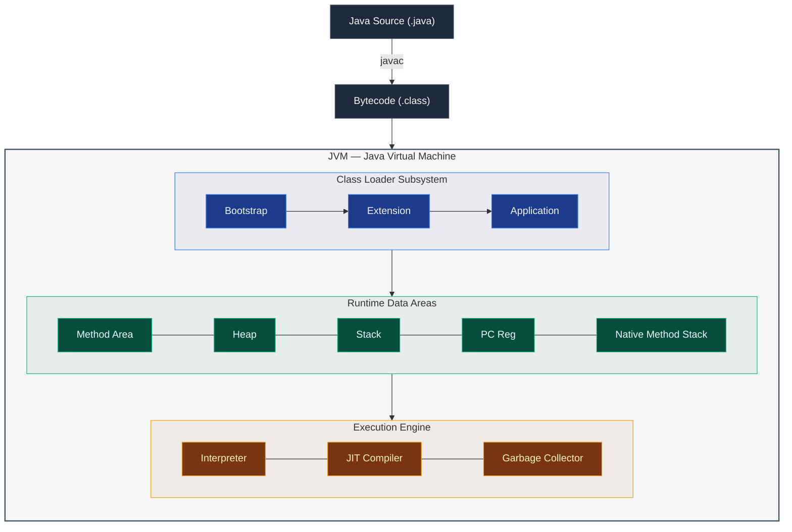

---

### 1.2 ClassLoader Subsystem

The ClassLoader loads classes dynamically into memory during runtime. It has three phases:

1. **Loading**: Reads the binary `.class` file and creates a corresponding `java.lang.Class` object in the Method Area.
2. **Linking**:
   - *Verification*: Validates that bytecode is safe and complies with JVM guidelines.
   - *Preparation*: Allocates memory for static variables and initializes them to default values.
   - *Resolution*: Resolves symbolic references in the constant pool to actual memory addresses.
3. **Initialization**: Executes static initializers and assigns explicit initial values to static variables.

#### ClassLoader Hierarchy (Delegation Model)

ClassLoader uses a delegation model — it delegates class-loading requests to its parent before loading itself:

- **Bootstrap ClassLoader**: Loads core classes from `rt.jar` (e.g., `java.lang.*`). Written in native C/C++.
- **Extension/Platform ClassLoader**: Loads extension libraries from `jre/lib/ext`.
- **Application ClassLoader**: Loads classes defined in the application's classpath.

---

### 1.3 JVM Memory Areas

JVM divides its runtime data areas into thread-shared and per-thread regions:

| Area | Access Scope | Stores |
|:---|:---|:---|
| **Method Area** | Shared | Class structures, metadata, constant pools, static variables, method bytecode. (Metaspace since Java 8) |
| **Heap** | Shared | Instantiated objects and instance variables. Primary target for Garbage Collection |
| **JVM Stack** | Per-Thread | Stack frames containing local variables, operand stacks, and method execution metadata. LIFO — `StackOverflowError` on infinite recursion |
| **PC Registers** | Per-Thread | Address of the JVM instruction currently executing |
| **Native Method Stack** | Per-Thread | Holds state for native methods executed via JNI (C/C++) |

> **PermGen vs Metaspace**: Before Java 8, class metadata lived in PermGen (fixed-size, frequent `OutOfMemoryError`). Java 8+ replaced it with **Metaspace** which uses native memory and auto-grows, eliminating `OutOfMemoryError: PermGen`.

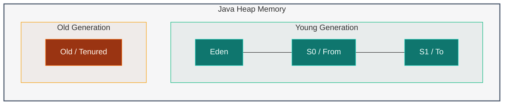

---

### 1.4 Object Lifecycle & Garbage Collection (GC)

An object is eligible for GC when it is no longer reachable through any active references (e.g., reference set to `null`, reference out of scope, or only circular references remain in an isolated island).

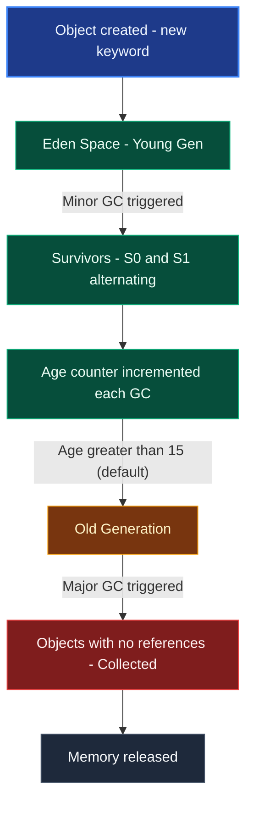

#### GC Types:
- **Minor GC** → Young Generation (Eden + Survivor). Fast, frequent.
- **Major GC** → Old Generation. Slower, less frequent.
- **Full GC** → Entire Heap. Most expensive, causes Stop-The-World pause.

#### Code Example — GC in Action:
```java
class Resource {
    @Override
    protected void finalize() { // Called before GC destroys object (deprecated)
        System.out.println("Resource cleaned up by GC");
    }
}

public class GCDemo {
    public void executeDemo() {
        Resource r = new Resource();
        r = null;       // Eligible for GC
        System.gc();    // Request JVM to run GC (not guaranteed instantly)
    }
}
```

#### GC Algorithms:

| Algorithm | Release | Focus |
|:---|:---|:---|
| **Serial GC** | Legacy | Single-threaded STW collector. Best for small apps |
| **Parallel GC** | Java 9 default | Multi-threaded, throughput-focused |
| **CMS** | Deprecated | Low-pause concurrent marking |
| **G1GC** | Java 9+ default | Region-based, balanced pause/throughput. Divides heap into equal-sized regions (~2MB) |
| **ZGC** | Java 15+ | Ultra-low latency (<10ms), even for multi-TB heaps |
| **Shenandoah** | Java 12+ | Low-pause concurrent evacuations (RedHat) |

---

### 1.5 GC Diagnostics & Memory Leaks

**Production Tuning Flags (G1GC)**:
```text
-XX:+UseG1GC
-Xms4g -Xmx8g
-XX:MaxGCPauseMillis=200
-XX:G1HeapRegionSize=8m
-XX:InitiatingHeapOccupancyPercent=45
-XX:G1ReservePercent=10
```

> **Production Scenario**: In Nationwide Insurance project, processing millions of policy claims caused frequent GC pauses. Tuning Young Gen size with G1GC: `-XX:+UseG1GC -Xms4g -Xmx8g -XX:NewRatio=3` reduced GC pause times from 2s to 200ms.

**Memory Leak Detection Process**:
1. **Enable GC Logging**: `-XX:+PrintGCDetails -XX:+PrintGCDateStamps -Xloggc:/var/log/myapp-gc.log`
2. **Take Heap Dump**: `jmap -dump:format=b,file=heap.hprof <PID>` or via Spring Actuator: `/actuator/heapdump`
3. **Analyze with Eclipse MAT**: Find Leak Suspects report → Look for objects with large retained heap
4. **Common Causes**:
   - Static collections growing without bounds
   - Unclosed connections (JDBC, HTTP)
   - Event listeners not removed
   - Caches without eviction policy
   - ThreadLocal variables not cleared

**Production Fix Example (IKEA Project)**:
```java
// BAD - creates new ObjectMapper per request (memory leak!)
public String serialize(Object obj) {
    return new ObjectMapper().writeValueAsString(obj);
}

// GOOD - singleton bean (reusable)
@Bean
public ObjectMapper objectMapper() {
    return new ObjectMapper();
}
```

#### Key Takeaways
* JDK includes JRE and development tools; JRE includes JVM and standard libraries.
* Heap memory is shared across all threads; local variables are isolated inside the per-thread JVM Stack.
* The ClassLoader relies on a delegation hierarchy to prevent namespace clashes and security threats.
* Metaspace (Java 8+) replaced PermGen, using native memory that auto-grows.
* Memory leaks require profiling the retained heap usage path (Eclipse MAT) to identify static leaks or unclosed resources.

---

## SECTION 2: OBJECT-ORIENTED PROGRAMMING (OOP)

### 2.1 The Four Pillars of OOP


**1. Encapsulation** — Binding data and methods together. Hiding state using access modifiers.

```java
public class BankAccount {
    private double balance; // Hidden state

    public double getBalance() { return balance; } // Controlled access

    public void deposit(double amount) {
        if (amount > 0) balance += amount; // Validation logic
    }
}
```

**2. Inheritance** — "IS-A" relationship. Code reuse via `extends` / `implements`.

```java
public class Vehicle {
    protected String brand;
    public void startEngine() { System.out.println("Engine started"); }
}
public class Car extends Vehicle {
    private int numDoors;
    @Override
    public void startEngine() {
        super.startEngine();
        System.out.println("Car ready to drive");
    }
}
```

> **Overriding Rules**: Cannot reduce visibility (`public` → `private` not allowed). Return type can be covariant (subtype of parent). Cannot override `static` / `final` methods.

**3. Polymorphism** — One interface, many implementations.
- *Compile-Time (Overloading)*: Different parameter signatures.
- *Runtime (Overriding)*: Subclass replaces parent method. Resolved via Dynamic Method Dispatch.

```java
class Animal {
    public String speak() { return "Some sound"; }
}
class Dog extends Animal {
    @Override
    public String speak() { return "Woof!"; } // Runtime Polymorphism
}
// Animal ref = new Dog(); ref.speak(); → "Woof!" (Dynamic dispatch)
```

**4. Abstraction** — Hiding complexity, showing only essential features via abstract classes and interfaces.

```java
public abstract class Shape {
    public abstract double area(); // Force subclasses to implement
}
public class Circle extends Shape {
    private double radius;
    @Override
    public double area() { return Math.PI * radius * radius; }
}
```

---

### 2.2 Abstract Class vs Interface

| Feature | Abstract Class | Interface |
|:---|:---|:---|
| **Methods** | Abstract + Concrete | Abstract + Default + Static (Java 8+) |
| **Variables** | Any type (instance vars allowed) | `public static final` constants only |
| **Constructors** | Yes | No |
| **Multiple Inheritance** | No (single `extends`) | Yes (multiple `implements`) |
| **Access Modifiers** | Any | `public` (default) |
| **Relationship** | Strong IS-A | CAN-DO / HAS-ABILITY-TO |
| **Use Case** | Template pattern / shared base behavior | Contract / capability definition |

```java
interface Flyable {
    void fly();                                              // Abstract
    default void land() { System.out.println("Landing..."); } // Java 8
    static void rules() { System.out.println("Federal Air Rules"); } // Java 8
}
```

> **Production Scenario**: In Insurance project — `PaymentProcessor` is an interface implemented by `CreditCardProcessor`, `WireTransferProcessor`. Base validation logic is in an abstract `AbstractPaymentProcessor` class.

---

### 2.3 Composition over Inheritance (Delegation)

Prefer HAS-A over IS-A when behavior can change at runtime.

```java
class Engine {
    void start() { System.out.println("Engine started"); }
}
class Car {
    private final Engine engine; // Composition (HAS-A)
    Car(Engine e) { this.engine = e; }
    void drive() { engine.start(); System.out.println("Car moving"); }
}
```

#### Key Takeaways
* Encapsulation guards data validity by restricting direct variable access.
* Runtime polymorphism is resolved via Dynamic Method Dispatch.
* Abstract classes allow constructors and instance state; interfaces define behavioral contracts.
* Prefer composition when behavior varies at runtime; use inheritance for strict IS-A hierarchies.

---

### 2.4 `static` Keyword — Deep Dive

> **JVM Perspective**: `static` members belong to the **Class** (stored in the Method Area / Metaspace), NOT to any object instance. They are loaded into memory exactly once when the class is first loaded by the ClassLoader.

#### static Variable

```java
class Counter {
    static int count = 0;    // shared across ALL instances — Method Area
    String name;             // per-instance — Heap

    Counter(String name) {
        this.name = name;
        count++;             // incremented by every constructor call
    }
}

Counter c1 = new Counter("A");
Counter c2 = new Counter("B");
System.out.println(Counter.count); // 2 — accessed via class name (best practice)
System.out.println(c1.count);      // 2 — same value (discouraged style)
```

#### static Method

```java
class MathUtils {
    // ✅ static — no instance state needed, utility method
    public static int square(int n) { return n * n; }

    // ❌ Cannot access instance fields from static method
    int value;
    public static void wrongMethod() {
        // System.out.println(value); // Compile error: non-static field 'value'
    }
}

// Called via class name — no object required
int result = MathUtils.square(5); // 25
```

**Rules for static methods**:
- Can access only static fields and call only static methods directly.
- Cannot use `this` or `super`.
- Cannot be overridden (hidden instead — compile-time resolution).
- Can be called before any object is created.

#### static Block (Static Initializer)

Runs **once** when the class is loaded into JVM. Used for complex static initialization.

```java
class DatabaseConfig {
    static final String DRIVER;
    static final int MAX_CONNECTIONS;

    static {
        // Runs once at class loading time
        DRIVER = System.getenv("DB_DRIVER");
        MAX_CONNECTIONS = Integer.parseInt(System.getenv().getOrDefault("DB_POOL", "10"));
        System.out.println("DatabaseConfig loaded: driver=" + DRIVER);
    }
}
```

**Multiple static blocks** — execute in **top-to-bottom** declaration order:

```java
class Order {
    static int id;
    static { id = 100; System.out.println("Block 1: id=" + id); }
    static { id = 200; System.out.println("Block 2: id=" + id); }
    // Output: Block 1: id=100 → Block 2: id=200
}
```

#### static Nested Class

```java
class Outer {
    private static int outerStaticVal = 10;  // accessible
    private int outerInstanceVal = 20;       // NOT accessible

    static class StaticNested {
        void display() {
            System.out.println(outerStaticVal);    // ✅ OK
            // System.out.println(outerInstanceVal); // ❌ Compile error
        }
    }
}
// No Outer instance needed to create StaticNested
Outer.StaticNested sn = new Outer.StaticNested();
```

#### static import

```java
import static java.lang.Math.PI;
import static java.lang.Math.sqrt;

double area = PI * sqrt(radius); // no Math. prefix needed
```

**Class Loading Order** (JVM sequence):


**Interview Q&A — `static`**:
- **Q: Can we override a static method?** No — static methods are bound at compile time (static binding). Subclasses can only *hide* them, not override. Dynamic dispatch does NOT apply.
- **Q: Why is `main()` static?** JVM calls `main()` before creating any object. If it were instance, JVM wouldn't know which object to use.
- **Q: Can a static method call a non-static method?** Only by first creating an object: `new MyClass().instanceMethod()`.
- **Q: What is a static factory method?** A static method returning a new/cached instance, e.g., `Integer.valueOf(5)`. Preferred over constructors for caching and naming.

---

### 2.5 `final` Keyword — Deep Dive

`final` restricts modification — applied to variables, methods, and classes.

#### final Variable

```java
// Primitive final — value cannot change
final int MAX_SIZE = 100;
// MAX_SIZE = 200; // Compile error

// Reference final — reference cannot change, but object state CAN
final List<String> list = new ArrayList<>();
list.add("A");   // ✅ OK — modifying object
list.add("B");   // ✅ OK
// list = new ArrayList<>(); // ❌ Compile error — re-assigning reference

// Blank final — must be initialized before constructor ends
class Circle {
    final double radius; // blank final
    Circle(double r) { this.radius = r; } // ✅ initialized in constructor
}
```

**JVM Optimization**: The JIT compiler aggressively inlines `static final` constants — they become compile-time constants embedded directly in bytecode, eliminating field lookups.

#### final Method

```java
class Base {
    public final void display() { System.out.println("Base display"); }
}

class Derived extends Base {
    // @Override void display() { } // ❌ Compile error — cannot override final
}
```

> **Use Case**: `final` methods in security-sensitive classes prevent subclasses from altering critical behavior (e.g., `String.equals()`).

#### final Class

```java
public final class SSN {  // Cannot be subclassed
    private final String value;
    public SSN(String value) { this.value = value; }
    public String getValue() { return value; }
}

// class ExtendedSSN extends SSN { } // ❌ Compile error
```

Famous `final` classes in JDK: `String`, `Integer`, `Long`, `Double`, all wrapper types.

**`final` vs `immutable`**:
| Concept | Means | Example |
|:---|:---|:---|
| `final` reference | Cannot **reassign** the reference | `final List<T> list` |
| Immutable object | Object **state** cannot change | `String`, `Integer` |
| Fully immutable | Both final reference AND immutable object | `final String s = "abc"` |

**Interview Q&A — `final`**:
- **Q: Can a final variable be initialized later?** Yes — blank finals must be assigned in every constructor before use.
- **Q: Is String final?** Yes — `String` is `final class` for immutability, security (class loading), and SCP optimization.
- **Q: Can we serialize a final field?** Yes — `final` fields are serialized normally.
- **Q: Difference between final method and private method?** Private methods aren't inherited, so they can't be overridden anyway. Final methods ARE inherited but cannot be overridden.

---

### 2.6 `this` Keyword

`this` is a reference to the **current object instance** within instance methods and constructors.

#### 1. Resolve Variable Shadowing

```java
class Student {
    String name;
    int age;

    Student(String name, int age) {
        this.name = name;  // 'this.name' = instance field; 'name' = parameter
        this.age  = age;
    }
}
```

#### 2. Constructor Chaining (`this()`)

Call another constructor in the same class. Must be the **first statement**.

```java
class Rectangle {
    int width, height;

    Rectangle() { this(1, 1); }                    // calls Rectangle(int, int)
    Rectangle(int side) { this(side, side); }       // calls Rectangle(int, int)
    Rectangle(int width, int height) {
        this.width  = width;
        this.height = height;
    }
}

// All three constructors ultimately set width and height:
new Rectangle();       // 1×1
new Rectangle(5);      // 5×5
new Rectangle(3, 7);   // 3×7
```

#### 3. Pass Current Object as Argument

```java
class Chain {
    Chain doFirst()  { System.out.println("first"); return this; }
    Chain doSecond() { System.out.println("second"); return this; }
}

// Method chaining — builder-like pattern
new Chain().doFirst().doSecond();
```

#### 4. Return Current Object

Enables **fluent/builder API** style (used by StringBuilder, Spring's BeanDefinitionBuilder, etc.).

```java
class Builder {
    String name; int age;
    Builder name(String name)  { this.name = name; return this; }
    Builder age(int age)       { this.age = age;   return this; }
    void build() { System.out.println(name + " (" + age + ")"); }
}

new Builder().name("Teja").age(30).build(); // Fluent API
```

**Interview Q&A — `this`**:
- **Q: Can `this` be used in static methods?** No — `this` refers to the current instance; static context has no instance.
- **Q: Can we pass `this` from a constructor?** Yes, but dangerous — the object may not be fully initialized yet (partially constructed object reference).
- **Q: What is `this()` used for?** Constructor delegation — reduces duplicate initialization logic.

---

### 2.7 `super` Keyword

`super` refers to the **parent class** — used to access parent fields, methods, and constructor.

#### 1. Access Parent Constructor (`super()`)

```java
class Animal {
    String name;
    Animal(String name) {
        this.name = name;
        System.out.println("Animal constructor: " + name);
    }
}

class Dog extends Animal {
    String breed;
    Dog(String name, String breed) {
        super(name);         // ✅ Must be FIRST statement — calls Animal(String)
        this.breed = breed;
        System.out.println("Dog constructor: " + breed);
    }
}

new Dog("Rex", "Labrador");
// Output:
// Animal constructor: Rex
// Dog constructor: Labrador
```

> **Rule**: If you don't call `super()` explicitly, Java inserts `super()` (no-arg) automatically. If the parent has NO no-arg constructor, you MUST call a specific `super(...)` or you get a compile error.

#### 2. Access Parent Fields and Methods

```java
class Vehicle {
    String type = "Vehicle";
    void describe() { System.out.println("I am a " + type); }
}

class Car extends Vehicle {
    String type = "Car";       // hides parent field

    void showTypes() {
        System.out.println(type);        // Car (local field)
        System.out.println(super.type);  // Vehicle (parent field)
    }

    @Override
    void describe() {
        super.describe();                // calls parent's describe()
        System.out.println("Specifically, I am a " + type);
    }
}
```

**Interview Q&A — `super`**:
- **Q: Can `super()` and `this()` both appear in the same constructor?** No — both must be the first statement, so only one is allowed.
- **Q: Can we access grandparent methods via `super.super`?** No — Java doesn't support chained super. You'd need to restructure the class hierarchy.
- **Q: When is `super()` automatically inserted?** When the subclass constructor doesn't explicitly call `this()` or `super()`.

---

### 2.8 Access Modifiers

Control the visibility of classes, fields, methods, and constructors across packages and inheritance.

| Modifier | Same Class | Same Package | Subclass (diff pkg) | Everywhere |
|:---|:---:|:---:|:---:|:---:|
| `private` | ✅ | ❌ | ❌ | ❌ |
| *(default/package-private)* | ✅ | ✅ | ❌ | ❌ |
| `protected` | ✅ | ✅ | ✅ | ❌ |
| `public` | ✅ | ✅ | ✅ | ✅ |

```java
public class BankAccount {
    private double balance;              // only this class
    double interestRate;                 // package-private (default)
    protected String accountType;       // subclasses + same package
    public String accountHolder;        // everyone

    // private getter — full encapsulation
    private double getBalance() { return balance; }

    // public API — controlled access
    public void deposit(double amount) {
        if (amount > 0) this.balance += amount;
    }
}
```

**Key Rules**:
- Class can only be `public` or package-private (default). Never `private`/`protected` at top level.
- `private` methods cannot be overridden (not inherited).
- `protected` members are accessible in subclass via inheritance (not via object reference of parent type).
- Overriding cannot **reduce** visibility: `protected` → `public` OK; `public` → `protected` ❌.


**Interview Q&A — Access Modifiers**:
- **Q: What is package-private?** No modifier — visible only within the same package. Useful for internal implementation classes.
- **Q: Can a private method be overridden?** No — private methods are not inherited, so no overriding. A subclass can define a method with the same name, but it's a new method (not an override).
- **Q: What modifier should I use for production code fields?** Always `private` with getters/setters for full encapsulation.

---

### 2.9 Constructors — Complete Guide

#### Default Constructor

If you define **no constructor**, Java provides a **default no-arg constructor** automatically. If you define **any** constructor, Java removes the default — you must define no-arg explicitly if needed.

```java
class Blank { }                    // compiler adds Blank() { super(); }
class HasParam { HasParam(int x) { } }  // NO default constructor!

// HasParam hp = new HasParam(); // ❌ Compile error
```

#### Constructor Overloading

```java
class Product {
    String name;
    double price;
    String category;

    Product(String name) {
        this(name, 0.0);                  // delegates to Product(String, double)
    }

    Product(String name, double price) {
        this(name, price, "General");     // delegates to Product(String, double, String)
    }

    Product(String name, double price, String category) {
        this.name     = name;             // canonical constructor
        this.price    = price;
        this.category = category;
    }
}
```

#### Constructor vs Method

| Feature | Constructor | Method |
|:---|:---|:---|
| Name | Same as class | Any valid identifier |
| Return type | None (not even void) | Must declare (void or type) |
| Called by | `new` keyword / `this()` / `super()` | Explicit call / JVM |
| Inherited | Not inherited | Inherited (unless private/static) |
| Purpose | Initialize object state | Define behavior |

#### Constructor Chaining Flow

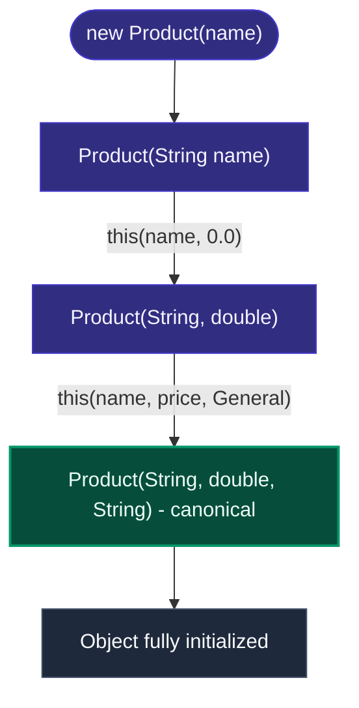

**Interview Q&A — Constructors**:
- **Q: Can a constructor be private?** Yes — used in Singleton pattern and static factory methods to prevent direct instantiation.
- **Q: Can a constructor return a value?** No — constructors have no return type. The `new` keyword returns the reference.
- **Q: What is a copy constructor?** A constructor taking another object of the same type as argument: `Point(Point other) { this.x = other.x; }`.
- **Q: What happens if a constructor throws an exception?** The object is not created. The JVM partially allocated it, but GC will reclaim it. The `finally` block (if any) still runs.
- **Q: When does Java call `super()` automatically?** When the first line of a subclass constructor is neither `this(...)` nor `super(...)`.

---

## SECTION 3: SOLID PRINCIPLES

> SOLID is an acronym coined by Robert C. Martin ("Uncle Bob"). These 5 principles build software that is **Maintainable**, **Scalable**, **Testable**, and **Decoupled**.

---

### S — Single Responsibility Principle (SRP)

> *"A class should have ONLY ONE reason to change."*

**Real-World Analogy**: A doctor treats patients. A doctor should NOT also manage billing, appointments, and housekeeping.

```java
// BAD — EmployeeService doing too much (4 reasons to change)
class EmployeeService {
    public Employee findById(int id) { ... }         // Business logic
    public void saveToDatabase(Employee e) { ... }   // DB concern
    public void sendWelcomeEmail(Employee e) { ... } // Notification concern
    public String generateReport(Employee e) { ... } // Reporting concern
}

// GOOD — Each class has one job
class EmployeeRepository    { public void save(Employee e) { ... } }
class EmailService          { public void sendWelcomeEmail(Employee e) { ... } }
class EmployeeReportService { public String generateReport(Employee e) { ... } }

class EmployeeService {
    private final EmployeeRepository repo;
    private final EmailService email;
    public EmployeeService(EmployeeRepository repo, EmailService email) {
        this.repo = repo; this.email = email;
    }
    public void onboardEmployee(Employee e) {
        repo.save(e); email.sendWelcomeEmail(e);
    }
}
```

> **Interview Tip**: "SRP reduces coupling. Each class is focused, easy to test in isolation, and changes don't ripple across unrelated code."

---

### O — Open/Closed Principle (OCP)

> *"Software entities should be OPEN for extension but CLOSED for modification."*

**Real-World Analogy**: A USB port is "open for extension" (plug any USB device) but "closed for modification" (you don't rewire your laptop for each new device).

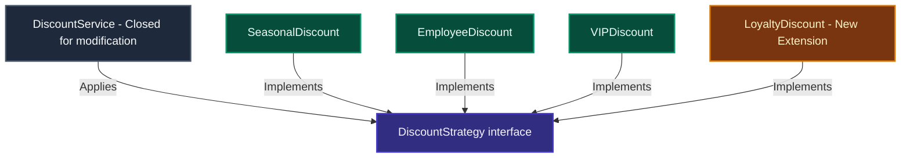

```java
// BAD — Adding new type = modifying this method → OCP violation!
class DiscountService {
    public double applyDiscount(String type, double price) {
        if (type.equals("SEASONAL")) return price * 0.90;
        else if (type.equals("EMPLOYEE")) return price * 0.80;
        else if (type.equals("VIP")) return price * 0.70;
        return price;
    }
}

// GOOD — New discount type? Just add a new class!
interface DiscountStrategy { double apply(double price); }
class SeasonalDiscount implements DiscountStrategy { public double apply(double p) { return p * 0.90; } }
class EmployeeDiscount implements DiscountStrategy { public double apply(double p) { return p * 0.80; } }
class VIPDiscount implements DiscountStrategy { public double apply(double p) { return p * 0.70; } }
class LoyaltyDiscount implements DiscountStrategy { public double apply(double p) { return p * 0.85; } }

class DiscountService {
    public double applyDiscount(DiscountStrategy strategy, double price) {
        return strategy.apply(price); // Closed for modification
    }
}
```

> **Interview Tip**: "OCP is achieved through Strategy Pattern, Template Method, or Spring's polymorphism via `@Component` + interface injection."

---

### L — Liskov Substitution Principle (LSP)

> *"Objects of a superclass should be replaceable with objects of its subclasses WITHOUT breaking the application."* — Barbara Liskov, 1987

```java
// BAD — Classic Square/Rectangle problem (LSP violation)
class Rectangle {
    protected int width, height;
    public void setWidth(int w)  { this.width = w; }
    public void setHeight(int h) { this.height = h; }
    public int area() { return width * height; }
}
class Square extends Rectangle {
    @Override public void setWidth(int w)  { this.width = w; this.height = w; }
    @Override public void setHeight(int h) { this.height = h; this.width = h; }
    // Square forces width == height → breaks Rectangle's contract!
}
// Rectangle r = new Square(); r.setWidth(5); r.setHeight(10);
// r.area() → Expected 50, Got 100 → BROKEN!

// GOOD — Separate hierarchy
interface Shape { int area(); }
class Rectangle implements Shape { int width, height; public int area() { return width * height; } }
class Square implements Shape { int side; public int area() { return side * side; } }
```

```java
// BAD — Penguin throws UnsupportedOperationException → LSP violation
class Bird { public void fly() { System.out.println("Flying"); } }
class Penguin extends Bird {
    @Override public void fly() { throw new UnsupportedOperationException("Can't fly!"); }
}

// GOOD — Segregated interfaces
interface Bird     { void eat(); }
interface FlyingBird extends Bird { void fly(); }
class Sparrow implements FlyingBird { public void eat() {} public void fly() {} }
class Penguin implements Bird { public void eat() {} } // No fly() needed
```

> **Interview Tip**: "LSP ensures true IS-A relationships. Watch for overridden methods that throw exceptions or weaken behavior — these signal LSP violations."

---

### I — Interface Segregation Principle (ISP)

> *"Clients should NOT be forced to depend on interfaces they do not use."*

**Real-World Analogy**: A Printer interface with `print()`, `scan()`, `fax()`. A basic printer only prints — why should it implement `scan`/`fax`?

```java
// BAD — Fat Interface (Robot forced to implement eat/sleep)
interface Worker { void work(); void eat(); void sleep(); void attendMeetings(); }
class Robot implements Worker {
    public void work() { ... }
    public void eat()  { /* Robots don't eat! Forced empty impl */ }
    public void sleep(){ /* Robots don't sleep! */ }
    public void attendMeetings() { ... }
}

// GOOD — Small, focused interfaces
interface Workable    { void work(); }
interface Feedable    { void eat(); }
interface Sleepable   { void sleep(); }
interface MeetingGoer { void attendMeetings(); }

class Human implements Workable, Feedable, Sleepable, MeetingGoer { ... }
class Robot implements Workable, MeetingGoer { ... } // No eat()/sleep() → clean!
```

> **Production Scenario (Spring Boot)**: Split service interfaces by read vs write (CQRS pattern) — `PolicyQueryService` and `PolicyCommandService` instead of one fat `PolicyService`.

---

### D — Dependency Inversion Principle (DIP)

> *"High-level modules should NOT depend on low-level modules. Both should depend on abstractions."*

**Real-World Analogy**: Your TV remote (high-level) communicates via IR protocol (abstraction) — you can swap the TV (low-level) without changing the remote.

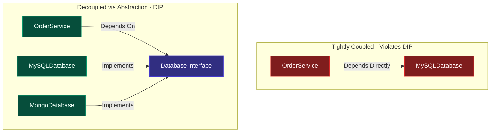

```java
// Abstraction
interface Database { void save(Object data); }

// Low-level modules depend on the abstraction
class MySQLDatabase implements Database { public void save(Object data) { ... } }
class MongoDatabase implements Database { public void save(Object data) { ... } }

// High-level module depends on abstraction (not concrete class)
class OrderService {
    private final Database db;
    public OrderService(Database db) { this.db = db; } // Injected
    public void placeOrder(Order o) { db.save(o); }    // Works with any impl
}
```

> **DIP vs DI vs IoC**:
> - **DIP** = PRINCIPLE → "Depend on abstractions"
> - **DI** = PATTERN → Mechanism to supply dependencies from outside
> - **IoC** = FRAMEWORK → Spring container manages object creation & wiring

> **Interview Tip**: "DIP is what makes Spring's IoC container powerful. By injecting interfaces instead of concrete classes, we can swap implementations (e.g., for testing with mocks) without touching business logic."

---

### SOLID Quick Cheat Sheet

| Code | Principle | One-line Rule | Supported By |
|:---:|:---|:---|:---|
| **S** | Single Responsibility | One class = one job | Facade, Service Layer, CQRS |
| **O** | Open/Closed | Extend with new code, don't edit | Strategy, Decorator, Template Method |
| **L** | Liskov Substitution | Subtypes must honor parent contract | Proper Inheritance + Interfaces |
| **I** | Interface Segregation | Many small interfaces > one fat | Role Interfaces, CQRS |
| **D** | Dependency Inversion | Depend on abstractions, not impls | DI, Factory, IoC Container |

#### Key Takeaways
* SRP keeps classes focused and testable; changes don't ripple across unrelated code.
* OCP is implemented using interfaces and the Strategy Pattern — add new behavior without editing existing code.
* LSP ensures subclass contracts honor parent assumptions; watch for `UnsupportedOperationException`.
* ISP splits fat interfaces into granular role-based contracts.
* DIP + IoC decouples high-level business logic from low-level infrastructure.

---

## SECTION 4: DATA TYPES, ARRAYS, AND STRINGS

### 4.1 Static vs Instance Members, Wrapper Classes & Autoboxing

- **Static members**: Shared across all instances. Stored in the Method Area.
- **Instance members**: Unique to each instantiated object. Stored in the Heap.
- **Autoboxing**: Automatic conversion of primitive → wrapper (e.g., `int` → `Integer`). **Unboxing**: wrapper → primitive.

```java
class Config {
    static int instanceCount = 0; // Shared across instances (Method Area)
    String name;                  // Per-instance (Heap)
    Config(String name) { this.name = name; instanceCount++; }
}
```

#### Wrapper Classes — Full Reference

Every Java primitive has a corresponding Wrapper class in `java.lang`:

| Primitive | Wrapper | Cache Range |
|:---|:---|:---|
| `byte` | `Byte` | -128 to 127 |
| `short` | `Short` | -128 to 127 |
| `int` | `Integer` | **-128 to 127** |
| `long` | `Long` | -128 to 127 |
| `float` | `Float` | None |
| `double` | `Double` | None |
| `char` | `Character` | 0 to 127 |
| `boolean` | `Boolean` | true, false |

```java
// Utility methods on wrapper classes
Integer.parseInt("42");          // String → int
Integer.toBinaryString(255);     // "11111111"
Integer.MAX_VALUE;               // 2147483647
Integer.MIN_VALUE;               // -2147483648
Integer.compare(5, 10);          // -1 (negative = first is smaller)
Integer.bitCount(255);           // 8 (number of 1-bits)
```

#### 🔥 Integer Cache — Most Tricky Interview Topic

`Integer.valueOf(n)` caches Integer objects for values **-128 to 127** (JVM internal optimization).

```java
// ✅ Using Integer.valueOf() — cached range
Integer a = Integer.valueOf(100);
Integer b = Integer.valueOf(100);
System.out.println(a == b);      // true  — same cached object!
System.out.println(a.equals(b)); // true

// ❌ Outside cache range — new objects created
Integer c = Integer.valueOf(200);
Integer d = Integer.valueOf(200);
System.out.println(c == d);      // false — different objects!
System.out.println(c.equals(d)); // true  — always use .equals()

// Autoboxing uses Integer.valueOf() internally:
Integer x = 127;  // same as Integer.valueOf(127) — cached
Integer y = 127;
System.out.println(x == y); // true  (within cache)

Integer p = 128;  // same as Integer.valueOf(128) — NOT cached
Integer q = 128;
System.out.println(p == q); // false (outside cache)
```

> **Interview Key Point**: This is one of the most common trick questions. **Always use `.equals()` to compare wrapper objects**, never `==`. The cache exists because values -128 to 127 are extremely common in code and caching them saves memory.

> ⚠️ **Avoid autoboxing inside loops** — creates massive wrapper object overhead:
```java
// BAD: Creates 1M wrapper objects → GC pressure
Integer sum = 0;
for (int i = 0; i < 1000000; i++) sum += i;  // 1M boxing/unboxing

// GOOD: Primitive types (zero allocations)
int sum = 0;
for (int i = 0; i < 1000000; i++) sum += i;  // No boxing
```

**Interview Q&A — Wrapper Classes**:
- **Q: `Integer i = null; int x = i;` — what happens?** `NullPointerException` — unboxing a null wrapper throws NPE.
- **Q: Why use wrapper classes?** Required for Collections (e.g., `List<Integer>`), generics, null representation, utility methods.
- **Q: What's the difference between `new Integer(5)` and `Integer.valueOf(5)`?** `new Integer(5)` always creates a new heap object (deprecated since Java 9). `Integer.valueOf(5)` uses the cache pool.

---


### 4.2 Arrays

- Fixed size, contiguous memory blocks in the Heap.
- Type-safe at compile-time. Cannot grow after creation.

```java
// 1D Array
int[] arr = {10, 20, 30};

// 2D Matrix
int[][] matrix = new int[3][4]; // 3 rows, 4 columns

// Jagged Array (rows have different lengths)
int[][] jagged = new int[3][];
jagged[0] = new int[2]; // Row 0 has 2 columns
jagged[1] = new int[4]; // Row 1 has 4 columns
jagged[2] = new int[3]; // Row 2 has 3 columns

// Sorting & Searching
int[] nums = {5, 3, 1, 4, 2};
Arrays.sort(nums);                       // [1, 2, 3, 4, 5]
int pos = Arrays.binarySearch(nums, 3);  // returns index 2
```

#### Array ↔ List Conversions:
```java
String[] fruits = {"Apple", "Banana", "Cherry"};

// Array → List:
List<String> list1 = Arrays.asList(fruits);                   // Fixed-size wrapper (set OK, add/remove NOT)
List<String> list2 = new ArrayList<>(Arrays.asList(fruits));  // Fully mutable ArrayList
List<String> list3 = List.of(fruits);                         // Java 9+ Immutable List (no nulls allowed)

// List → Array:
List<String> list = Arrays.asList("Apple", "Banana", "Cherry");
String[] strArray1 = list.toArray(new String[0]);             // Type-safe (preferred)
String[] strArray2 = list.toArray(String[]::new);             // Java 11+ method reference
```

---

### 4.3 String Constant Pool (SCP) & Immutability

- **Immutability**: Strings cannot be modified after creation. Modifications create new String objects.
  - *Why?* Security (connection strings can't be tampered), Thread-Safety (multiple threads can share safely), Hashcode Caching (`hashCode` computed once).
- **String Constant Pool (SCP)**: Special area inside the Heap that caches unique string literals. SCP objects are NOT eligible for GC until JVM shutdown.
- **`intern()`**: Moves a Heap string reference into the SCP, returning the cached pool reference.

```java
String s1 = "Hello";              // Created in String Pool
String s2 = "Hello";              // Reuses same reference from pool
String s3 = new String("Hello");  // New object in Heap (NOT in pool)
String s4 = new String("Hello");  // Another new object in Heap

// Comparisons:
s1 == s2;                         // true  (same SCP reference)
s1 == s3;                         // false (SCP vs Heap)
s1.equals(s3);                    // true  (same content)

// intern() forces SCP reference:
String s5 = s3.intern();          // s5 points to pool reference
s1 == s5;                         // true
```

> **Internal Representation (Java 9+)**: Before Java 9: `char[]` (2 bytes/char). Java 9+: `byte[]` with Compact Strings — Latin-1 (1 byte/char) for ASCII, UTF-16 for others. Saves ~30-40% memory.

#### String vs StringBuilder vs StringBuffer:

| Feature | String | StringBuilder | StringBuffer |
|:---|:---|:---|:---|
| **Mutable** | No | Yes | Yes |
| **Thread-Safe** | Yes (immutable) | No | Yes (synchronized methods) |
| **Performance** | Low (if modified) | High | Medium (lock overhead) |
| **Use Case** | Constants / Literals | Single-thread concatenation | Multi-thread concatenation |

```java
public void stringDemo() {
    String s = "Hello";
    s += " World"; // Creates NEW object, old "Hello" stays in SCP

    StringBuilder sb = new StringBuilder("Hello");
    sb.append(" World"); // Modifies SAME object
    sb.insert(5, ",");   // "Hello, World"
    sb.reverse();        // "dlroW ,olleH"
}
```

#### Key String Methods:
```text
s.length()            → Length of string
s.charAt(i)           → Character at index i
s.substring(from,to)  → Extracts substring [from, to)
s.indexOf("x")        → First index of x
s.toUpperCase()       → Uppercase version
s.trim()              → Strips leading/trailing whitespace
s.split(",")          → Splits into array
s.replace("a","b")    → Replaces all occurrences
```

#### Key Takeaways
* Static variables reside in the Method Area; instance variables are stored in the Heap.
* Autoboxing inside loops creates unnecessary wrapper objects, increasing GC load.
* Strings are immutable to ensure safety in hash keys, database connections, and multithreading.
* `String.intern()` caches strings in the SCP to save heap space.
* Use `char[]` instead of `String` for passwords — you can explicitly zero it out after use.

---

## SECTION 5: GENERICS & EXCEPTION HANDLING

### 5.1 Generics & Bounded Wildcards

Generics provide compile-time type safety. The compiler uses **Type Erasure** to remove type parameters after compile-time checks, ensuring backward compatibility (`List<String>` becomes `List` in bytecode).

- **PECS Rule (Producer Extends, Consumer Super)**:
  - `<? extends T>` — read from a collection (Upper Bound / Producer)
  - `<? super T>` — write into a collection (Lower Bound / Consumer)

```java
// Generic Class
class Pair<A, B> {
    private final A first;
    private final B second;
    public Pair(A first, B second) { this.first = first; this.second = second; }
    public A getFirst()  { return first; }
    public B getSecond() { return second; }
}

// Bounded Wildcards:
public double sumList(List<? extends Number> numbers) { // Upper Bound (Producer)
    return numbers.stream().mapToDouble(Number::doubleValue).sum();
}
public void copyInto(List<Integer> src, List<? super Integer> dest) { // Lower Bound (Consumer)
    dest.addAll(src);
}
```

#### Real-Time Generic Use Cases:

```java
// 1. Generic Repository Pattern
interface GenericRepository<T, ID> {
    void save(T entity);
    Optional<T> findById(ID id);
    List<T> findAll();
    void delete(ID id);
}
class UserRepository implements GenericRepository<User, Long> { /* ... */ }
class OrderRepository implements GenericRepository<Order, Integer> { /* ... */ }

// 2. Generic API Response
class ApiResponse<T> {
    private T data;
    public ApiResponse(T data) { this.data = data; }
    public T getData() { return data; }
}

// 3. Generic Result Wrapper (Success / Failure)
class Result<T> {
    private final T value;
    private final String error;
    private final boolean success;
    private Result(T v, String e, boolean s) { this.value = v; this.error = e; this.success = s; }
    public static <T> Result<T> success(T val) { return new Result<>(val, null, true); }
    public static <T> Result<T> failure(String err) { return new Result<>(null, err, false); }
}

// 4. Generic Cache
class GenericCache<K, V> {
    private final Map<K, V> store = new ConcurrentHashMap<>();
    public void put(K key, V value) { store.put(key, value); }
    public Optional<V> get(K key) { return Optional.ofNullable(store.get(key)); }
}

// 5. Generic Event Bus
interface EventListener<E> { void onEvent(E event); }
class EventBus<E> {
    private final List<EventListener<E>> listeners = new ArrayList<>();
    public void subscribe(EventListener<E> l) { listeners.add(l); }
    public void publish(E event) { listeners.forEach(l -> l.onEvent(event)); }
}

// 6. Generic Typed Configuration Holder
class ConfigProperty<T> {
    private final String key;
    private final T defaultValue;
    private T value;
    public ConfigProperty(String key, T defaultValue) { this.key = key; this.defaultValue = defaultValue; }
    public T getValue() { return value != null ? value : defaultValue; }
    public void setValue(T value) { this.value = value; }
}
```

| # | Use Case | Benefit |
|:---:|:---|:---|
| 1 | Generic Repository | One CRUD interface for all entities |
| 2 | ApiResponse\<T\> | Unified REST response structure |
| 3 | Result\<T\> Wrapper | Type-safe success/failure return |
| 4 | GenericCache\<K,V\> | Reusable cache for any types |
| 5 | EventBus\<E\> | Decoupled typed event publishing |
| 6 | ConfigProperty\<T\> | Type-safe configuration holding |

---

### 5.2 Exception Handling in Java — Deep Dive

> **Real-World Analogy**: Think of a method call stack as an airline check-in queue. An exception is like a passenger's passport issue — the agent (method) can't fix it alone, so it escalates (throws) up the chain until a supervisor (catch block) handles it. The `finally` block is the cleanup crew that always tidies the desk regardless of outcome.

---

#### Exception Hierarchy (Visual)

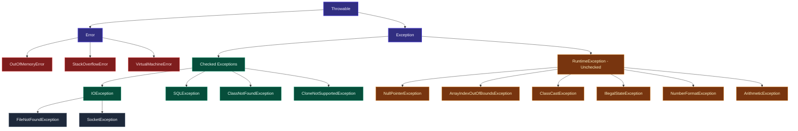

---

#### Checked vs Unchecked Exceptions

| Aspect | Checked Exception | Unchecked Exception |
|:---|:---|:---|
| **Superclass** | `Exception` (not RuntimeException) | `RuntimeException` |
| **Compile-time enforcement** | Yes — must catch or declare with `throws` | No — optional handling |
| **Common examples** | `IOException`, `SQLException`, `FileNotFoundException` | `NullPointerException`, `ArrayIndexOutOfBoundsException`, `ClassCastException` |
| **When to use** | Recoverable errors (file missing, network timeout) | Programming bugs (null access, bad cast) |
| **Spring Framework** | Converts JDBC checked → `DataAccessException` (unchecked) | — |

> **Interview Insight**: Spring chose unchecked exceptions for its data access layer to avoid forcing callers to handle or declare exceptions they can't meaningfully handle.

---

#### Exception Keywords: `try`, `catch`, `finally`, `throw`, `throws`

```java
// ✅ Full try-catch-finally demonstration
public int divide(int a, int b) throws ArithmeticException {
    try {
        return a / b;                          // may throw ArithmeticException
    } catch (ArithmeticException e) {
        log.error("Division error", e);        // log with full stack trace
        throw new RuntimeException("Division failed", e); // wrap and re-throw
    } finally {
        System.out.println("Finally ALWAYS runs"); // even with return or throw
    }
}

// ⚠️ Tricky: return in finally OVERRIDES return in try!
public int tricky() {
    try {
        return 1;   // Will NOT be returned!
    } finally {
        return 2;   // This return wins — ALWAYS avoid return in finally
    }
}  // returns 2
```

**`throw` vs `throws`**:
- `throw` — creates and throws an exception instance at runtime inside a method body.
- `throws` — declares in the method signature that this method MAY throw a specific exception.

```java
// throw — action (creates instance)
throw new IllegalArgumentException("ID must be positive");

// throws — declaration (signals callers)
public void processOrder(int id) throws OrderNotFoundException { ... }
```

---

#### try-with-resources (Java 7+)

Automatically closes resources implementing `AutoCloseable`. Eliminates the need for `finally` blocks just for closing.

```java
// ✅ try-with-resources — resources closed even if exception occurs
try (Connection conn = dataSource.getConnection();
     PreparedStatement ps = conn.prepareStatement("SELECT * FROM users WHERE id=?")) {
    ps.setInt(1, userId);
    ResultSet rs = ps.executeQuery();
    while (rs.next()) {
        System.out.println(rs.getString("name"));
    }
} catch (SQLException e) {
    throw new DataAccessException("Failed to fetch user", e);
}
// conn, ps are closed in reverse order automatically

// ✅ Custom AutoCloseable resource
class ManagedConnection implements AutoCloseable {
    public ManagedConnection() { System.out.println("Opened connection"); }

    @Override
    public void close() {
        System.out.println("Connection closed automatically"); // called by JVM
    }
}

try (ManagedConnection mc = new ManagedConnection()) {
    // use mc
} // mc.close() called automatically here
```

> **Key Rule**: Resources are closed in **reverse declaration order**. If multiple resources declared, the last declared is closed first.

---

#### Multi-Catch (Java 7+)

Capture multiple unrelated exception types in a single catch block.

```java
try {
    Class.forName("com.Foo");
    new FileReader("config.txt");
} catch (ClassNotFoundException | IOException e) { // multi-catch — pipe-separated
    log.error("Startup failed", e);               // 'e' is effectively final here
    throw new ApplicationException("Init failed", e);
}
```

> **Restriction**: Cannot catch exceptions with an inheritance relationship in one multi-catch (compiler error). E.g., `catch (Exception | IOException e)` is invalid since `IOException extends Exception`.

---

#### Exception Chaining (Wrapping)

Preserve the original cause when translating/wrapping exceptions across layers.

```java
// ✅ Good: root cause preserved
public User findUser(int id) {
    try {
        return userRepo.findById(id);
    } catch (SQLException e) {
        // Wrap SQLException as domain exception — root cause preserved
        throw new UserNotFoundException("User " + id + " not found", e); // passes cause
    }
}

// Retrieving the original cause
try {
    findUser(-1);
} catch (UserNotFoundException e) {
    Throwable rootCause = e.getCause(); // returns the original SQLException
    log.error("Root cause: " + rootCause.getMessage());
}

// ❌ Bad: root cause swallowed — impossible to debug
catch (SQLException e) {
    throw new RuntimeException("Error"); // e is lost!
}
```

---

#### Custom Exception — Best Practices

```java
// ✅ Best-practice custom exception
public class InsufficientFundsException extends RuntimeException {

    private static final long serialVersionUID = 1L;
    private final double requestedAmount;
    private final double availableBalance;

    // 4 constructors — mirror RuntimeException pattern
    public InsufficientFundsException(String message) {
        super(message);
        this.requestedAmount = 0;
        this.availableBalance = 0;
    }

    public InsufficientFundsException(String message, Throwable cause) {
        super(message, cause); // ✅ preserves root cause
        this.requestedAmount = 0;
        this.availableBalance = 0;
    }

    public InsufficientFundsException(double requestedAmount, double availableBalance) {
        super(String.format("Requested: %.2f, Available: %.2f", requestedAmount, availableBalance));
        this.requestedAmount = requestedAmount;
        this.availableBalance = availableBalance;
    }

    public double getRequestedAmount() { return requestedAmount; }
    public double getAvailableBalance() { return availableBalance; }
}

// Usage in service layer
public void withdraw(Account account, double amount) {
    if (account.getBalance() < amount) {
        throw new InsufficientFundsException(amount, account.getBalance());
    }
    account.debit(amount);
}
```

**Custom Exception Naming Conventions**:
| Scenario | Exception Type | Example Name |
|:---|:---|:---|
| Business rule violation | `RuntimeException` (unchecked) | `InsufficientFundsException` |
| Resource not found | `RuntimeException` | `UserNotFoundException` |
| Invalid input | `RuntimeException` | `InvalidOrderStateException` |
| External system failure | `RuntimeException` | `PaymentGatewayException` |
| Recoverable I/O issue | `Exception` (checked) | `ConfigurationLoadException` |

---

#### StackTrace API

```java
try {
    riskyOperation();
} catch (Exception e) {
    // Print full stack trace (for development / debug)
    e.printStackTrace();

    // Programmatic stack trace access
    StackTraceElement[] elements = e.getStackTrace();
    for (StackTraceElement ste : elements) {
        System.out.printf("Class: %s, Method: %s, Line: %d%n",
            ste.getClassName(), ste.getMethodName(), ste.getLineNumber());
    }

    // Get just the top frame
    StackTraceElement top = e.getStackTrace()[0];
    log.error("Exception at: " + top.getMethodName() + ":" + top.getLineNumber());
}
```

---

#### Suppressed Exceptions (Java 7+)

When an exception occurs inside a `try-with-resources` **and** the `close()` method also throws, the close-exception is _suppressed_ (attached) rather than lost.

```java
class BrokenResource implements AutoCloseable {
    public void use()  { throw new RuntimeException("Primary exception"); }
    public void close() { throw new RuntimeException("Close exception"); }
}

try (BrokenResource br = new BrokenResource()) {
    br.use(); // throws primary
} catch (RuntimeException e) {
    System.out.println("Primary: " + e.getMessage());  // Primary exception
    for (Throwable suppressed : e.getSuppressed()) {
        System.out.println("Suppressed: " + suppressed.getMessage()); // Close exception
    }
}
```

---

#### Exception Flow Control Diagram

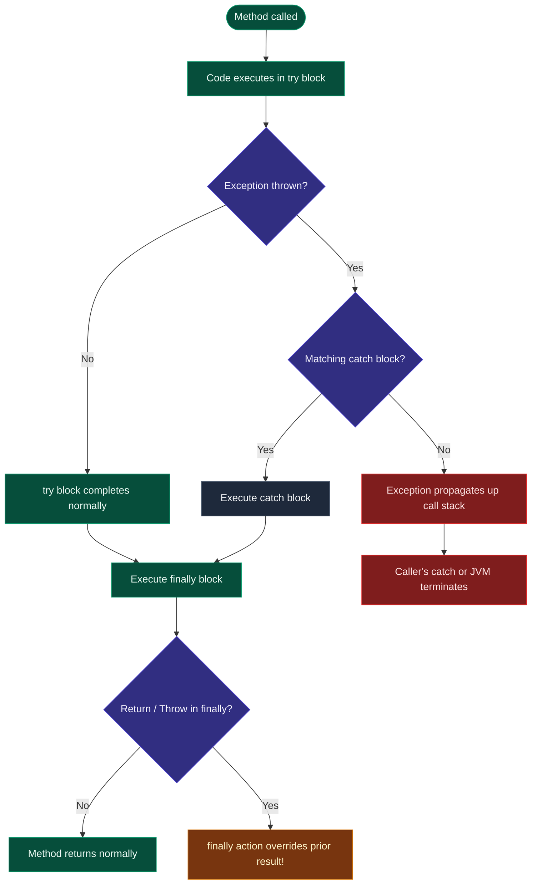

---

#### Exception Handling Anti-Patterns

| ❌ Anti-Pattern | Why It's Bad | ✅ Fix |
|:---|:---|:---|
| `catch (Exception e) {}` | Silently swallows all exceptions | At least log the exception |
| `e.printStackTrace()` in prod | Unstructured output, security risk | Use SLF4J `log.error("msg", e)` |
| Catching `Throwable` | Catches JVM `Error`s like OOM | Only catch `Exception` |
| Returning `null` on exception | Callers not forced to handle absence | Return `Optional<T>` or throw |
| Using exceptions for flow control | Extremely expensive (stack generation) | Use conditional checks instead |
| Swallowing cause on rethrow | `throw new Ex("msg")` — cause lost | Always `throw new Ex("msg", originalCause)` |
| Generic custom exceptions | `AppException` for everything | Specific names, e.g., `UserNotFoundException` |

---

#### Key Takeaways — Exception Handling
* **Checked** = must handle/declare; **Unchecked** = optional; **Error** = never catch.
* `try-with-resources` automatically closes `AutoCloseable` resources in reverse order.
* `finally` **always** runs — avoid `return`/`throw` inside it.
* **Exception chaining**: always pass `cause` to preserve root cause for debugging.
* Multi-catch `(A | B e)` requires A and B are not in the same inheritance chain.
* **Suppressed exceptions**: extra exceptions from `close()` are attached to the primary via `getSuppressed()`.
* **Production logging**: always use `log.error("message", exception)` — never swallow silently.

---

## SECTION 6: COLLECTIONS FRAMEWORK & CONCURRENCY

### 6.1 Collections Hierarchy

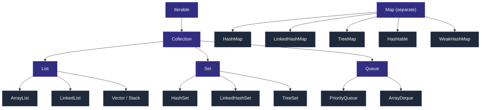

---

### 6.2 List Implementations

| Feature | ArrayList | LinkedList |
|:---|:---|:---|
| **Backing Structure** | Dynamic array | Doubly-linked list |
| **Random Access** | O(1) | O(n) |
| **Insert/Delete (middle)** | O(n) | O(1) once positioned |
| **Default Capacity** | 10 (grows by 50%) | N/A |
| **Thread-Safe** | No | No |
| **Best For** | Read-heavy workloads | Write-heavy / Queue operations |

```java
List<String> al = new ArrayList<>(Arrays.asList("C", "A", "B"));
al.sort(Comparator.naturalOrder()); // ["A", "B", "C"]
System.out.println(al.get(0));      // Random access O(1)
```

---

### 6.3 HashMap Internals (Java 8+)

- Backed by an array of `Node<K,V>[]` (bucket array).
- **Default capacity**: 16 buckets. **Load factor**: 0.75 (resize at 75% full → threshold = 12).
- Uses `hashCode()` and `equals()` to place and find key-value pairs.
- **Hash Spreading**: `hash = (key == null) ? 0 : (h = key.hashCode()) ^ (h >>> 16)` — reduces collisions.
- **Collision Resolution**: LinkedList → **Red-Black Tree** when chain ≥ 8 AND capacity ≥ 64.
- **Untreeification**: Tree → LinkedList when bucket drops below 6 during resize.

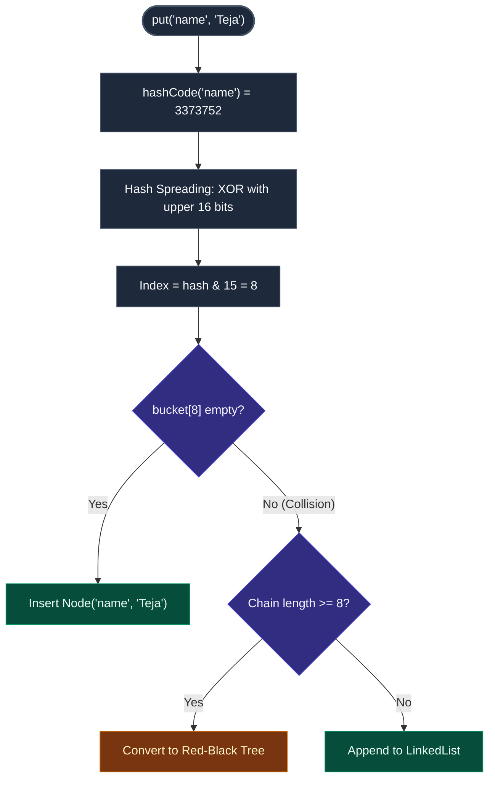

#### HashMap vs ConcurrentHashMap vs synchronizedMap:

| Feature | HashMap | synchronizedMap | ConcurrentHashMap |
|:---|:---|:---|:---|
| **Thread-safe** | No | Yes | Yes |
| **Lock granularity** | N/A | Whole map | Bucket-level (CAS) |
| **Null key/value** | Yes | Yes | **No** |
| **Performance (multi-thread)** | Unsafe | Low | High |
| **Atomic ops (merge, compute)** | No | No | Yes |
| **Iteration safety** | Fail-fast | Fail-fast | Weakly consistent |

```java
ConcurrentHashMap<String, Integer> concurrentMap = new ConcurrentHashMap<>();
concurrentMap.put("Alice", 1);
concurrentMap.putIfAbsent("Alice", 99);                           // Ignored (exists)
concurrentMap.computeIfAbsent("Eve", k -> k.length());            // Eve=3
concurrentMap.compute("Alice", (k, v) -> (v == null) ? 1 : v + 10); // Alice=11
concurrentMap.merge("Bob", 5, Integer::sum);                      // Atomic merge
```

---

### 6.4 Set Implementations & Operations

| Set Type | Backing | Ordering | Null | Time Complexity |
|:---|:---|:---|:---|:---|
| **HashSet** | HashMap | Unordered | 1 null | O(1) |
| **LinkedHashSet** | LinkedHashMap | Insertion order | 1 null | O(1) |
| **TreeSet** | Red-Black Tree | Sorted (natural) | No null | O(log n) |

> **How does HashSet guarantee uniqueness?** HashSet is backed by a HashMap — elements are stored as map **keys**, and a constant dummy object is the value. HashMap key uniqueness prevents duplicates.

```java
Set<Integer> s1 = new HashSet<>(Arrays.asList(1, 2, 3, 4));
Set<Integer> s2 = new HashSet<>(Arrays.asList(3, 4, 5, 6));

Set<Integer> union     = new HashSet<>(s1); union.addAll(s2);         // {1,2,3,4,5,6}
Set<Integer> intersect = new HashSet<>(s1); intersect.retainAll(s2);  // {3,4}
Set<Integer> diff      = new HashSet<>(s1); diff.removeAll(s2);       // {1,2}
```

---

### 6.5 Comparable vs Comparator & Fail-Fast vs Fail-Safe

| Concept | Comparable | Comparator |
|:---|:---|:---|
| **Defined In** | Object itself | External class/lambda |
| **Method** | `compareTo()` | `compare()` |
| **Ordering** | Natural order (one per class) | Custom (multiple strategies) |

```java
class Student implements Comparable<Student> {
    String name; int score;
    @Override public int compareTo(Student o) { return this.name.compareTo(o.name); }
}

// External Comparators
Comparator<Student> byScore = Comparator.comparingInt(s -> s.score);
Comparator<Student> byNameThenScore = Comparator.comparing(Student::getName)
                                                .thenComparingInt(Student::getScore);
students.sort(byScore.reversed()); // Reversed order
```

| Iteration Type | Behavior | Example Collections |
|:---|:---|:---|
| **Fail-Fast** | Throws `ConcurrentModificationException` if modified during iteration | ArrayList, HashMap, HashSet |
| **Fail-Safe** | Iterates over snapshot; safe modifications during iteration | CopyOnWriteArrayList, ConcurrentHashMap |

```java
List<String> list = new CopyOnWriteArrayList<>(Arrays.asList("A", "B", "C"));
for (String s : list) {
    if (s.equals("B")) list.add("D"); // No CME thrown (fail-safe)
}
System.out.println(list); // [A, B, C, D]
```

---

### 6.6 LRU Cache using LinkedHashMap

```java
public class LRUCache<K, V> extends LinkedHashMap<K, V> {
    private final int capacity;

    public LRUCache(int capacity) {
        super(capacity, 0.75f, true); // accessOrder = true
        this.capacity = capacity;
    }

    @Override
    protected boolean removeEldestEntry(Map.Entry<K, V> eldest) {
        return size() > capacity;
    }
}

// Usage:
LRUCache<Integer, String> cache = new LRUCache<>(3);
cache.put(1, "A"); cache.put(2, "B"); cache.put(3, "C");
cache.get(1);       // Access 1 (now Most Recently Used)
cache.put(4, "D");  // Evicts 2 (Least Recently Used)
System.out.println(cache.keySet()); // [3, 1, 4]
```

---

### 6.7 Multithreading & Thread-Safety

#### Thread Creation:
```java
// 1. extends Thread
class MyThread extends Thread { public void run() { System.out.println("Thread run"); } }
new MyThread().start();

// 2. implements Runnable (Preferred — allows extending other classes)
Runnable task = () -> System.out.println("Lambda Thread");
new Thread(task).start();

// 3. ExecutorService (Best Practice)
ExecutorService pool = Executors.newFixedThreadPool(4);
pool.submit(() -> System.out.println("Thread pool task"));
pool.shutdown();
```

#### Thread Lifecycle:

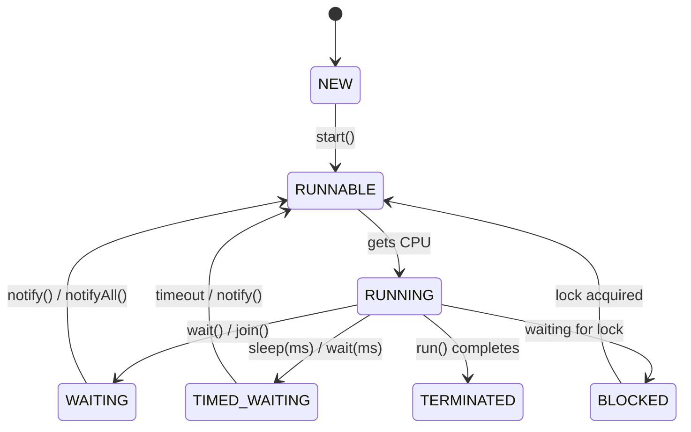

#### Synchronization:
```java
class Counter {
    private int count = 0;

    public synchronized void increment() { count++; } // Method-level lock

    public void safeIncrement() {
        synchronized(this) { count++; } // Block-level lock (finer granularity)
    }
}
```

#### wait(), notify(), notifyAll() — Producer-Consumer:
```java
class SharedBuffer {
    private Queue<Integer> queue = new LinkedList<>();
    private final int MAX = 5;

    public synchronized void produce(int val) throws InterruptedException {
        while (queue.size() == MAX) wait(); // Buffer full, wait
        queue.add(val);
        notifyAll(); // Wake consumers
    }

    public synchronized int consume() throws InterruptedException {
        while (queue.isEmpty()) wait(); // Buffer empty, wait
        int val = queue.poll();
        notifyAll(); // Wake producers
        return val;
    }
}
```

#### volatile Keyword:
Guarantees cross-thread visibility (reads/writes go to main memory). Does NOT guarantee atomicity.

```java
class TaskRunner {
    private volatile boolean running = true; // Visible to all threads

    public void run()  { while (running) { /* work */ } }
    public void stop() { running = false; } // Seen immediately by run()
}
```

#### BlockingQueue Producer-Consumer:
```java
BlockingQueue<Integer> queue = new ArrayBlockingQueue<>(5);

Thread producer = new Thread(() -> {
    try {
        for (int i = 1; i <= 10; i++) {
            queue.put(i); // Blocks if full
            System.out.println("Produced: " + i);
        }
    } catch (InterruptedException e) { Thread.currentThread().interrupt(); }
});

Thread consumer = new Thread(() -> {
    try {
        while (true) {
            int val = queue.take(); // Blocks if empty
            System.out.println("Consumed: " + val);
        }
    } catch (InterruptedException e) { Thread.currentThread().interrupt(); }
});

producer.start(); consumer.start();
```

#### Key Takeaways
* HashMap collision resolution shifts to Red-Black Tree (O(log N)) at threshold ≥ 8.
* ConcurrentHashMap uses CAS + bucket-level locking — far superior to `synchronizedMap`.
* Fail-safe collections iterate over snapshots; fail-fast throw `ConcurrentModificationException`.
* `volatile` ensures visibility but NOT atomicity — use `AtomicInteger` for atomic operations.
* Prefer `ExecutorService` over raw `Thread` creation for production code.

---

## SECTION 7: HIGH-PERFORMANCE CACHING

### 7.1 Layered Caching Architecture

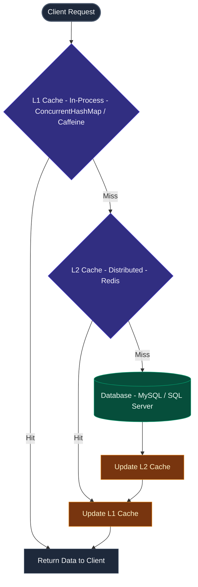

### 7.2 Spring Cache + Redis Configuration

```xml
<!-- pom.xml dependencies -->
<dependency>
    <groupId>org.springframework.boot</groupId>
    <artifactId>spring-boot-starter-data-redis</artifactId>
</dependency>
<dependency>
    <groupId>org.springframework.boot</groupId>
    <artifactId>spring-boot-starter-cache</artifactId>
</dependency>
```

```java
@Configuration
@EnableCaching
public class CacheConfig {
    @Bean
    public RedisCacheManager cacheManager(RedisConnectionFactory f) {
        RedisCacheConfiguration config = RedisCacheConfiguration
            .defaultCacheConfig()
            .entryTtl(Duration.ofMinutes(30))
            .serializeValuesWith(
                RedisSerializationContext.SerializationPair
                    .fromSerializer(new GenericJackson2JsonRedisSerializer()));
        return RedisCacheManager.create(f);
    }
}
```

```java
@Service
public class PolicyService {
    @Cacheable(value = "policies", key = "#policyId", unless = "#result == null")
    public Policy getPolicy(String policyId) {
        return policyRepository.findById(policyId).orElse(null);
    }

    @CacheEvict(value = "policies", key = "#policy.id")
    public Policy updatePolicy(Policy policy) {
        return policyRepository.save(policy);
    }

    @CachePut(value = "policies", key = "#policy.id")
    public Policy savePolicy(Policy policy) {
        return policyRepository.save(policy);
    }
}
```

**Cache Eviction Strategies**: TTL (Time-To-Live), LRU (Least Recently Used), LFU (Least Frequently Used).

**Production Considerations**: Cache stampede prevention (Caffeine async loading), Cache coherency (`@CacheEvict` on update/delete), Distributed locks (Redis SETNX for cache warming).

#### Key Takeaways
* Use a layered cache (L1 in-process + L2 distributed) to minimize database load.
* Spring's `@Cacheable`, `@CacheEvict`, `@CachePut` abstract caching behind annotations.
* Always set TTL to prevent stale data; use `@CacheEvict` on mutating operations.

---

## SECTION 8: JAVA 8+ FEATURES & FUNCTIONAL PROGRAMMING

### 8.1 Functional Interfaces & Lambdas

A **Functional Interface** has exactly one abstract method. Can have multiple `default`/`static` methods. Lambda expressions are NOT anonymous inner classes — JVM uses `invokedynamic` + `LambdaMetafactory` (more efficient, no extra `.class` files).

| Interface | Method | Use Case |
|:---|:---|:---|
| `Predicate<T>` | `boolean test(T t)` | Filtering |
| `Function<T,R>` | `R apply(T t)` | Transformation |
| `Consumer<T>` | `void accept(T t)` | Side effects |
| `Supplier<T>` | `T get()` | Lazy generation |
| `BiFunction<T,U,R>` | `R apply(T t, U u)` | Two args → result |
| `UnaryOperator<T>` | `T apply(T t)` | Same type in/out |
| `BinaryOperator<T>` | `T apply(T t1, T t2)` | Two same type args |

```java
// Lambda Syntax: (parameters) -> expression OR (parameters) -> { statements; }

@FunctionalInterface
interface MathOp { int operate(int a, int b); }

MathOp add = (a, b) -> a + b;
MathOp mul = (a, b) -> a * b;
System.out.println(add.operate(3, 5)); // 8

// Predicate example (Insurance domain)
Predicate<Policy> isActive = policy -> policy.getStatus().equals("ACTIVE");
List<Policy> activePolicies = policies.stream()
    .filter(isActive)
    .collect(Collectors.toList());

// Method References (shorthand for lambdas)
// Static:      ClassName::methodName   → String::valueOf
// Instance:    obj::methodName         → System.out::println
// Unbound:     ClassName::methodName   → String::toLowerCase
// Constructor: ClassName::new          → ArrayList::new
```

---

### 8.2 Streams API

Streams allow declarative pipeline transformations on collections (filter → map → collect).

```java
List<String> names = Arrays.asList("Alice", "Bob", "Charlie", "David", "Anna");

List<String> result = names.stream()
    .filter(n -> n.startsWith("A"))          // Intermediate: filter
    .map(String::toUpperCase)                 // Intermediate: transform
    .sorted()                                 // Intermediate: sort
    .collect(Collectors.toList());            // Terminal: collect
// Result: [ALICE, ANNA]

// Statistics
IntSummaryStatistics stats = List.of(10, 20, 30, 40)
    .stream().mapToInt(Integer::intValue).summaryStatistics();
System.out.println("Max: " + stats.getMax() + " Avg: " + stats.getAverage());

// Grouping & Partitioning
Map<String, Long> wordCounts = Arrays.stream("java spring java kafka".split(" "))
    .collect(Collectors.groupingBy(w -> w, Collectors.counting()));
// {java=2, spring=1, kafka=1}

Map<Boolean, List<Integer>> parts = List.of(1,2,3,4,5,6).stream()
    .collect(Collectors.partitioningBy(n -> n % 2 == 0));
// {false=[1,3,5], true=[2,4,6]}
```

> **Performance Note**: Parallel streams only worth it for large data + CPU-intensive operations. Sequential stream has overhead vs for-loop for small data. For I/O-bound operations, use `CompletableFuture` instead.

---

### 8.3 Optional Class

A type-safe container representing the presence or absence of a value, replacing risky `null` returns.

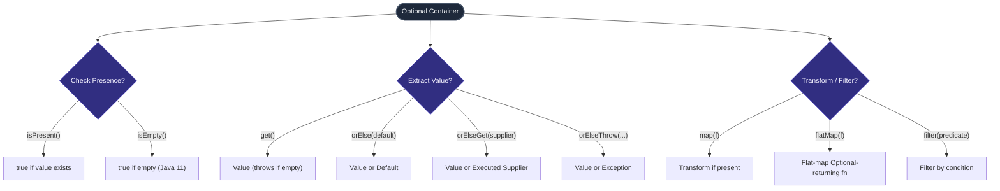

```java
// Safe navigation avoiding NullPointerExceptions
// Before Optional:
if (user != null && user.getAddress() != null && user.getAddress().getCity() != null) {
    return user.getAddress().getCity();
}

// With Optional:
return Optional.ofNullable(user)
    .map(User::getAddress)
    .map(Address::getCity)
    .orElse("Unknown City");
```

> **When NOT to use Optional**: As method parameter type (use overloading), as collection element (use empty collection), as field type in a class (serialization issues).

---

### 8.4 CompletableFuture & Async Programming

Implements asynchronous computation by chaining stages using completion events.

**Key Methods**:

| Method | Description |
|:---|:---|
| `supplyAsync(Supplier)` | Async computation returning value |
| `runAsync(Runnable)` | Async computation, no return |
| `thenApply(Function)` | Transform result (sync) |
| `thenAccept(Consumer)` | Consume result |
| `thenCombine(CF, BiFunc)` | Combine two futures |
| `allOf(CF...)` | Wait for all to complete |
| `anyOf(CF...)` | Wait for any one |
| `exceptionally(Function)` | Error handling fallback |
| `handle(BiFunction)` | Handle result or exception |

```java
// Production Example (Nationwide Insurance) — Parallel API calls
public ClaimSummaryDTO getClaimSummary(String claimId) {
    CompletableFuture<ClaimDetails> detailsFuture =
        CompletableFuture.supplyAsync(() -> claimService.getDetails(claimId));

    CompletableFuture<List<Document>> docsFuture =
        CompletableFuture.supplyAsync(() -> documentService.getDocuments(claimId));

    CompletableFuture<PolicyInfo> policyFuture =
        CompletableFuture.supplyAsync(() -> policyService.getPolicy(claimId));

    // Wait for all 3 to complete (parallel execution)
    return CompletableFuture.allOf(detailsFuture, docsFuture, policyFuture)
        .thenApply(v -> new ClaimSummaryDTO(
            detailsFuture.join(),
            docsFuture.join(),
            policyFuture.join()))
        .exceptionally(ex -> {
            logger.error("Failed to get claim summary", ex);
            return new ClaimSummaryDTO(); // fallback
        })
        .join();
}
```

**Latency Performance Comparison**:
- **Before (Sequential)**: 300ms + 200ms + 150ms = **650ms**
- **After (Parallel)**: max(300ms, 200ms, 150ms) = **300ms**
- **Latency Reduction**: **~54% improvement** 🚀

---

### 8.5 Java Records (Java 14+) & Sealed Classes (Java 17)

**Records** — Compact, immutable data carriers. Auto-generate: constructor, getters (no `get` prefix), `equals()`, `hashCode()`, `toString()`. Cannot extend other classes but can implement interfaces.

```java
public record Employee(int id, String name, double salary) {}

Employee e = new Employee(101, "John", 75000.0);
System.out.println(e.name());  // Getter (no "get" prefix)
System.out.println(e);         // Employee[id=101, name=John, salary=75000.0]
```

**Sealed Classes (Java 17)** — Restrict which classes can extend/implement. Enables exhaustive pattern matching.

```java
public sealed interface Shape permits Circle, Rectangle, Triangle {}
```

#### Key Takeaways
* Functional Interfaces define exactly one abstract method and enable lambda syntax.
* Optionals model presence/absence to avoid NullPointerExceptions.
* `CompletableFuture` executes async tasks and coordinates parallel API calls with significant latency reduction.
* Java Records eliminate boilerplate for immutable data carriers.
* Sealed classes enable exhaustive `switch` pattern matching.

---

## SECTION 9: DESIGN PATTERNS

### 9.1 Singleton — Thread-Safe Double-Checked Locking

Ensures a class has only one instance and provides a global access point:

```java
public class DatabaseConnection {
    private static volatile DatabaseConnection instance;
    private DatabaseConnection() {} // Private constructor

    public static DatabaseConnection getInstance() {
        if (instance == null) {                             // First check (no lock)
            synchronized (DatabaseConnection.class) {
                if (instance == null) {                     // Second check (with lock)
                    instance = new DatabaseConnection();
                }
            }
        }
        return instance;
    }
}
```

---

### 9.2 Factory Pattern

Defines an interface for creating objects, letting subclasses decide which class to instantiate:

```java
interface Notification { void send(String msg); }
class EmailNotification implements Notification {
    public void send(String msg) { System.out.println("Email: " + msg); }
}
class SMSNotification implements Notification {
    public void send(String msg) { System.out.println("SMS: " + msg); }
}

class NotificationFactory {
    public static Notification create(String type) {
        return switch (type) {
            case "EMAIL" -> new EmailNotification();
            case "SMS"   -> new SMSNotification();
            default -> throw new IllegalArgumentException("Unknown: " + type);
        };
    }
}
```

---

### 9.3 Builder Pattern

Separates construction of complex objects from their representation:

```java
public class Person {
    private final String name;
    private final int age;
    private final String email;

    private Person(Builder b) { this.name = b.name; this.age = b.age; this.email = b.email; }

    public static class Builder {
        private String name;
        private int age;
        private String email;
        public Builder name(String name)   { this.name = name;   return this; }
        public Builder age(int age)         { this.age = age;     return this; }
        public Builder email(String email) { this.email = email; return this; }
        public Person build()              { return new Person(this); }
    }
}

Person p = new Person.Builder().name("Alice").age(30).email("a@b.com").build();
```

#### Key Takeaways
* Singleton uses `volatile` + double-checked locking for thread-safe lazy instantiation.
* Factory Pattern removes hardcoded creation dependencies — decisions move to factory classes.
* Builder Pattern constructs complex objects step-by-step with fluent API.

---

## SECTION 10: ADVANCED JAVA CONCEPTS

### 10.1 equals() and hashCode() Contract

**Rules**:
1. **Reflexive**: `x.equals(x)` is true.
2. **Symmetric**: `x.equals(y)` ⟹ `y.equals(x)`.
3. **Transitive**: `x.equals(y) && y.equals(z)` ⟹ `x.equals(z)`.
4. **Consistent**: Multiple calls return the same result.
5. If `equals()` is true, `hashCode()` **must** be the same.
6. If `equals()` is false, `hashCode()` **may** differ (collisions allowed).

> ⚠️ If you override `equals()` but NOT `hashCode()`, HashMap/HashSet will store duplicate objects or fail to locate existing entries.

```java
class Point {
    int x, y;
    Point(int x, int y) { this.x = x; this.y = y; }

    @Override
    public boolean equals(Object o) {
        if (!(o instanceof Point)) return false;
        Point p = (Point) o;
        return x == p.x && y == p.y;
    }

    @Override
    public int hashCode() { return Objects.hash(x, y); }
}
```

---

### 10.2 Cloning: Shallow vs Deep

| Clone Type | Behavior |
|:---|:---|
| **Shallow** | Copies top-level fields. Nested objects share same references |
| **Deep** | Copies everything recursively. Nested objects are new copies |

```java
// Deep Copy via Serialization
public <T extends Serializable> T deepCopy(T object) throws Exception {
    ByteArrayOutputStream bos = new ByteArrayOutputStream();
    new ObjectOutputStream(bos).writeObject(object);
    ByteArrayInputStream bis = new ByteArrayInputStream(bos.toByteArray());
    return (T) new ObjectInputStream(bis).readObject();
}
```

---

### 10.3 Frequently Missed Concepts — Deep Dives

---

#### `var` Keyword (Java 10+ — Local Variable Type Inference)

```java
// ✅ var — compiler infers type from right-hand side
var list    = new ArrayList<String>();   // inferred as ArrayList<String>
var map     = new HashMap<String, Integer>();
var stream  = list.stream();

// ✅ Works in enhanced for-loops (Java 10+)
for (var entry : map.entrySet()) {
    System.out.println(entry.getKey() + "=" + entry.getValue());
}

// ✅ Works in try-with-resources
try (var conn = dataSource.getConnection()) { /* ... */ }

// ❌ Cannot use in:
// var field;                   // instance/class fields
// public var myMethod() { }    // method return type
// void method(var param) { }   // method parameters
// var x = null;                // cannot infer from null
```

> **Interview Key**: `var` is a **reserved type name** (not a keyword like `int`). The variable is still statically typed — just inferred by the compiler. It does NOT make Java dynamically typed.

---

#### Marker Interface

An interface with **no methods** — signals a capability/intent to the JVM or framework.

```java
// Built-in marker interfaces
public class Employee implements Serializable, Cloneable { ... }

// Custom marker interface
interface Auditable { }
interface Archivable { }

class Order implements Auditable, Archivable { ... }

// Framework checks it at runtime via instanceof
if (entity instanceof Auditable) {
    auditLog.record(entity);
}
```

| Marker Interface | Purpose |
|:---|:---|
| `Serializable` | Allows object to be serialized by `ObjectOutputStream` |
| `Cloneable` | Allows `Object.clone()` to perform shallow copy |
| `RandomAccess` | Signals `List` supports O(1) index access (ArrayList) |
| `Remote` | Marks objects for Java RMI remote method invocation |

---

#### Enums — Complete Guide

Enums are **type-safe named constants** — more powerful than `static final int` constants.

```java
// Basic enum
enum Day { MONDAY, TUESDAY, WEDNESDAY, THURSDAY, FRIDAY, SATURDAY, SUNDAY }

// Enum with fields and methods
enum Planet {
    MERCURY(3.303e+23, 2.4397e6),
    VENUS  (4.869e+24, 6.0518e6),
    EARTH  (5.976e+24, 6.37814e6);

    private final double mass;    // in kilograms
    private final double radius;  // in meters

    Planet(double mass, double radius) {
        this.mass   = mass;
        this.radius = radius;
    }

    static final double G = 6.67300E-11;

    double surfaceGravity() { return G * mass / (radius * radius); }
    double surfaceWeight(double otherMass) { return otherMass * surfaceGravity(); }
}

// Usage
System.out.println(Planet.EARTH.surfaceWeight(75)); // weight on Earth
```

**Enum with Abstract Method** (each constant provides its own implementation):

```java
enum Operation {
    ADD    { @Override public int apply(int a, int b) { return a + b; } },
    SUBTRACT { @Override public int apply(int a, int b) { return a - b; } },
    MULTIPLY { @Override public int apply(int a, int b) { return a * b; } };

    public abstract int apply(int a, int b);
}

System.out.println(Operation.ADD.apply(5, 3)); // 8
```

**EnumSet and EnumMap** (specialized, highly efficient collections):

```java
// EnumSet — bit-vector backed, O(1) operations
EnumSet<Day> weekdays = EnumSet.range(Day.MONDAY, Day.FRIDAY);
EnumSet<Day> weekend  = EnumSet.complementOf(weekdays);

// EnumMap — array-backed map, faster than HashMap for enum keys
EnumMap<Day, String> schedule = new EnumMap<>(Day.class);
schedule.put(Day.MONDAY, "Team standup");
schedule.put(Day.FRIDAY, "Sprint review");
```

**Built-in Enum Methods**:

```java
Day d = Day.valueOf("MONDAY");   // String → Enum (throws IllegalArgumentException if invalid)
Day[] days = Day.values();       // All constants as array
int ordinal = Day.MONDAY.ordinal(); // 0 (zero-based position)
String name = Day.MONDAY.name(); // "MONDAY"
```

**Interview Q&A — Enum**:
- **Q: Can enum extend a class?** No — all enums implicitly extend `java.lang.Enum`. Java has single inheritance.
- **Q: Can enum implement an interface?** Yes — commonly used for strategy pattern.
- **Q: Are enum instances singleton?** Yes — each enum constant is a single guaranteed instance. Enum-based Singleton is the safest thread-safe Singleton.
- **Q: Can enum have a constructor?** Yes — but it must be `private` or package-private (not public/protected).
- **Q: How is enum thread-safe?** Enum constants are loaded once at class-loading time, before any thread uses them. Thread-safe by design.

---

#### Annotations — Built-in & Custom

Annotations provide metadata about code — readable at compile-time, class-load time, or runtime.

**Built-in Annotations**:

```java
// @Override — compiler checks overriding contract
@Override
public String toString() { return "My class"; }

// @Deprecated — marks API as outdated
@Deprecated(since = "3.0", forRemoval = true)
public void oldMethod() { }

// @SuppressWarnings — silences compiler warnings
@SuppressWarnings("unchecked")
List list = new ArrayList();

// @FunctionalInterface — ensures exactly one abstract method
@FunctionalInterface
interface Transformer { String transform(String input); }

// @SafeVarargs — suppresses heap pollution warning on varargs
@SafeVarargs
public static <T> List<T> asList(T... elements) { return Arrays.asList(elements); }
```

**Custom Annotation**:

```java
import java.lang.annotation.*;

// Define annotation
@Retention(RetentionPolicy.RUNTIME) // available at runtime
@Target(ElementType.METHOD)          // only on methods
public @interface AuditLog {
    String action() default "UNKNOWN";
    String entity() default "";
    boolean logResponse() default false;
}

// Use annotation
@AuditLog(action = "CREATE", entity = "Order", logResponse = true)
public Order createOrder(OrderRequest request) { ... }

// Read annotation via Reflection
Method method = OrderService.class.getMethod("createOrder", OrderRequest.class);
AuditLog audit = method.getAnnotation(AuditLog.class);
System.out.println(audit.action()); // "CREATE"
```

**Retention Policies**:

| RetentionPolicy | When Available | Use Case |
|:---|:---|:---|
| `SOURCE` | Compile-time only | `@Override`, `@SuppressWarnings` |
| `CLASS` | In bytecode, NOT at runtime (default) | Bytecode tools, build tools |
| `RUNTIME` | At runtime via Reflection | Spring, JUnit, Hibernate annotations |

---

#### Reflection API

Reflection allows **inspecting and manipulating** classes, methods, and fields at **runtime** — even private ones.

```java
import java.lang.reflect.*;

class Person {
    private String name;
    private int age;

    private Person(String name, int age) {
        this.name = name;
        this.age = age;
    }

    private String greet() { return "Hello, I'm " + name; }
}

// ---- Reflection Usage ----

// 1. Get Class object
Class<?> clazz = Class.forName("com.example.Person");
// Or:  Person.class  or  person.getClass()

// 2. Access private constructor and create object
Constructor<?> ctor = clazz.getDeclaredConstructor(String.class, int.class);
ctor.setAccessible(true);  // bypass private access
Object person = ctor.newInstance("Teja", 30);

// 3. Access private field
Field nameField = clazz.getDeclaredField("name");
nameField.setAccessible(true);
String name = (String) nameField.get(person);  // "Teja"
nameField.set(person, "Sai");                  // modify private field

// 4. Invoke private method
Method greetMethod = clazz.getDeclaredMethod("greet");
greetMethod.setAccessible(true);
String result = (String) greetMethod.invoke(person); // "Hello, I'm Sai"

// 5. Get all methods and fields
for (Method m : clazz.getDeclaredMethods()) {
    System.out.println(m.getName() + " returns " + m.getReturnType().getSimpleName());
}
```

**Reflection Use Cases**:
| Use Case | Example |
|:---|:---|
| Dependency Injection | Spring creates beans, injects fields via `@Autowired` |
| ORM | Hibernate reads fields to map to DB columns |
| Serialization | Jackson reads/writes JSON by inspecting fields |
| Testing | JUnit invokes `@Test` methods |
| Plugin Systems | Load and invoke unknown classes at runtime |

**Performance Warning**: Reflection bypasses JVM optimizations. Avoid in hot code paths. Spring caches reflected metadata to mitigate this.

---

#### Immutable Class Design

An **immutable object** cannot be modified after creation. Thread-safe by nature — no synchronization needed.

**Rules for designing an immutable class**:

```java
// ✅ Production-grade immutable class
public final class Money {                          // 1. Declare class final (no subclassing)

    private final String currency;                  // 2. All fields final
    private final double amount;
    private final List<String> tags;                // 3. Mutable fields need defensive copying

    public Money(String currency, double amount, List<String> tags) {
        this.currency = currency;
        this.amount   = amount;
        this.tags     = List.copyOf(tags);          // 4. Deep copy on construction
    }

    public String getCurrency() { return currency; }
    public double  getAmount()  { return amount; }

    public List<String> getTags() {
        return Collections.unmodifiableList(tags);  // 5. Return defensive copy from getters
    }

    // No setters — no mutation allowed

    // Provide "wither" methods returning new instances
    public Money add(double extra) {
        return new Money(this.currency, this.amount + extra, this.tags); // returns NEW object
    }

    @Override
    public boolean equals(Object o) {
        if (!(o instanceof Money)) return false;
        Money m = (Money) o;
        return Double.compare(amount, m.amount) == 0 && currency.equals(m.currency);
    }

    @Override
    public int hashCode() { return Objects.hash(currency, amount); }

    @Override
    public String toString() { return amount + " " + currency; }
}
```

**Immutable Class Checklist**:
1. ✅ Class is `final`
2. ✅ All fields are `private final`
3. ✅ No setters
4. ✅ Defensive copy of mutable inputs (Collections, arrays, Date)
5. ✅ Return unmodifiable/copied views from getters
6. ✅ `equals()`, `hashCode()`, `toString()` implemented

**Why Immutability?**
- **Thread-safe**: No shared mutable state — no locks needed.
- **Cache-friendly**: `hashCode` computed once, reused.
- **Safe HashMap keys**: Immutable objects' hash stays constant.
- Famous immutable classes: `String`, `Integer`, `LocalDate`, `BigDecimal`, `Path`.

---

#### Object Class Methods — Deep Dive

Every Java class implicitly extends `java.lang.Object`. Key methods to know:

```java
// 1. toString() — default: "ClassName@hexHashCode"
@Override
public String toString() {
    return String.format("User{id=%d, name='%s'}", id, name);
}

// 2. equals() — default: reference equality (==)
@Override
public boolean equals(Object o) {
    if (this == o) return true;
    if (!(o instanceof User)) return false;
    User user = (User) o;
    return id == user.id && Objects.equals(name, user.name);
}

// 3. hashCode() — default: based on memory address
@Override
public int hashCode() { return Objects.hash(id, name); }

// 4. clone() — creates shallow copy (requires implementing Cloneable)
@Override
protected Object clone() throws CloneNotSupportedException {
    return super.clone(); // shallow copy
}

// 5. finalize() — DEPRECATED in Java 9+, removed in Java 18
// Called by GC before collecting — unreliable timing, avoid!
// Use Cleaner API or try-with-resources instead.

// 6. getClass() — returns runtime Class object
System.out.println(obj.getClass().getName()); // "com.example.User"
System.out.println(obj.getClass().getSimpleName()); // "User"

// 7. wait() / notify() / notifyAll() — inter-thread communication
// Must be called inside synchronized block
synchronized (lock) {
    while (!condition) lock.wait();  // releases lock, waits
}
synchronized (lock) {
    condition = true;
    lock.notifyAll(); // wakes all waiting threads
}
```

| Method | Default Behavior | When to Override |
|:---|:---|:---|
| `toString()` | `ClassName@hexHash` | Always — for logging, debugging |
| `equals()` | Reference equality (`==`) | When value equality is needed |
| `hashCode()` | Memory-address based | Always when overriding equals() |
| `clone()` | Shallow copy | When deep copy needed (use copy constructor instead) |
| `finalize()` | Nothing (deprecated) | Never — use AutoCloseable instead |
| `getClass()` | Returns runtime Class | Non-overridable (final method) |

---

#### Comparable vs Comparator — Summary

```java
// Comparable — natural ordering (built-in, one per class)
class Employee implements Comparable<Employee> {
    String name; int salary;
    @Override
    public int compareTo(Employee o) { return Integer.compare(this.salary, o.salary); }
}
Collections.sort(employees); // uses compareTo

// Comparator — external, multiple orderings
Comparator<Employee> byName   = Comparator.comparing(e -> e.name);
Comparator<Employee> bySalary = Comparator.comparingInt(e -> e.salary);
Comparator<Employee> byNameThenSalary = byName.thenComparingInt(e -> e.salary);

employees.sort(byNameThenSalary);
employees.sort(Comparator.reverseOrder());
```

---

#### Instanceof Pattern Matching (Java 16+) & `var`

```java
// Old way
if (obj instanceof String) {
    String s = (String) obj; // manual cast
    System.out.println(s.length());
}

// New way (Java 16+) — pattern variable
if (obj instanceof String s) { // auto-cast + binding
    System.out.println(s.length());
}

// In switch (Java 21+ — Pattern Matching for Switch)
String result = switch (obj) {
    case Integer i -> "int: " + i;
    case String  s -> "str: " + s.length();
    case null      -> "null";
    default        -> "other";
};
```

---

#### Static Nested Class vs Inner Class vs Anonymous Class

```java
// Static Nested — no outer instance needed
class Outer {
    static class StaticNested {
        void go() { System.out.println("static nested"); }
    }
}
Outer.StaticNested sn = new Outer.StaticNested(); // no Outer needed

// Inner Class — tied to outer instance
class Outer {
    int x = 10;
    class Inner {
        void go() { System.out.println(x); } // accesses outer's x
    }
}
Outer.Inner inner = new Outer().new Inner(); // needs Outer instance

// Anonymous Class — inline subclass/interface implementation
Runnable r = new Runnable() {
    @Override
    public void run() { System.out.println("anonymous class"); }
};
```

---

#### Key Takeaways — Advanced Concepts
* Always override both `equals()` and `hashCode()` to maintain hash-based collection integrity.
* Deep cloning via serialization creates fully independent copies of object graphs.
* Java Records (14+) and Sealed Classes (17) are modern additions that reduce boilerplate and enable exhaustive pattern matching.
* Enums provide type-safe constants with built-in methods; use EnumSet/EnumMap for high-performance enum collections.
* Annotations with `@Retention(RUNTIME)` are processed via Reflection — the foundation of Spring and Hibernate.
* Reflection is powerful but slow — use only for framework code, not business logic hot paths.
* Immutable classes require: `final` class, `final` fields, defensive copies, no setters.
* `var` is type-inferred but statically typed — use for readability in local variables with obvious types.
* Integer cache covers -128 to 127 — always use `.equals()` to compare Integer objects.

---


## SECTION 11: PERFORMANCE BEST PRACTICES

| # | Optimization | Details |
|:---:|:---|:---|
| 1 | **String Concatenation** | Use `StringBuilder.append()` instead of `+` in loops (avoids creating intermediate objects) |
| 2 | **ArrayList vs LinkedList** | ArrayList for read-heavy (`O(1)` get); LinkedList for write-heavy (rare, prefer ArrayDeque) |
| 3 | **Auto-boxing overhead** | Use primitives (`int`, `long`) in loops; avoid `Integer`, `Long` wrapper types |
| 4 | **Streams vs for-loop** | Parallel streams only for large data + CPU-intensive. Use `CompletableFuture` for I/O-bound |
| 5 | **Close resources** | Always use try-with-resources for JDBC, HTTP, File I/O |
| 6 | **Prefer composition** | Over inheritance when behavior varies at runtime |
| 7 | **Program to interfaces** | Not implementations — enables DI and testing |
| 8 | **Use Optional** | Instead of null returns for method return types |
| 9 | **Meaningful exceptions** | Custom domain exceptions instead of generic RuntimeException |
| 10 | **final for constants** | `static final` for compile-time constants |

---

## SECTION 12: TOP 50 INTERVIEW QUESTIONS — QUICK REFERENCE

### 12.1 Quick-Scan Q&A Index

| Q# | Category | Question | Key Takeaway / Core Concept |
|:---:|:---|:---|:---|
| 1 | `JVM & Memory` | Difference between JDK, JRE, and JVM? | JDK (Tools + JRE) ⊃ JRE (JVM + Libs) ⊃ JVM (Runs bytecode). |
| 2 | `JVM & Memory` | Why is Java platform-independent but JVM is platform-dependent? | Code compiles to neutral bytecode (`.class`); each OS requires its specific JVM. |
| 3 | `Strings & Data` | Difference between `==` and `equals()`? | `==` compares references/primitives; `equals()` compares values (when overridden). |
| 4 | `Collections` | What happens if you override `equals()` but not `hashCode()`? | Violates contract; causes duplicates or search failures in hash-based collections. |
| 5 | `OOP Concepts` | Can an abstract class have constructors? | Yes, initialized via `super()` inside subclass constructors. |
| 6 | `JVM & Memory` | Difference between final, finally, and finalize? | `final` (modifier), `finally` (try-catch cleanup block), `finalize` (deprecated GC hook). |
| 7 | `OOP Concepts` | What is a Marker Interface? | An empty interface (e.g. `Serializable`) acting as metadata for the JVM. |
| 8 | `Java 8+ Features` | What is `var` in Java 10+? | Local variable type inference; resolved at compile-time. |
| 9 | `Strings & Data` | Why is String immutable in Java? | Security, thread-safety, string pooling caching, hashcode caching. |
| 10 | `Exceptions` | Difference between `throw` and `throws`? | `throw` (instantiates/fires exception), `throws` (method signature declaration). |
| 11 | `OOP Concepts` | Explain method hiding vs method overriding. | Overriding (runtime polymorphism on instances), Hiding (static methods resolved at compile-time). |
| 12 | `OOP Concepts` | Can a constructor be private? | Yes, standard for Singletons and static utility classes. |
| 13 | `OOP Concepts` | Explain covariant return types. | Subclass overriding method can return a subtype of the parent method's return type. |
| 14 | `Collections` | Difference between ArrayList and LinkedList? | ArrayList (dynamic array, `O(1)` random read), LinkedList (doubly-linked, fast ends insert). |
| 15 | `Collections` | How does HashMap resolve hash collisions? | Bucket chaining; converts chain to Red-Black Tree if length ≥ 8 and capacity ≥ 64. |
| 16 | `Collections` | How does ConcurrentHashMap achieve concurrency? | CAS for lock-free reads, bucket-level synchronization for writes. |
| 17 | `Collections` | What is fail-fast vs fail-safe iteration? | Fail-fast throws `ConcurrentModificationException` on write; fail-safe reads snapshot. |
| 18 | `Collections` | How does HashSet guarantee uniqueness? | Backed internally by a HashMap, storing elements as keys with dummy values. |
| 19 | `Generics` | What is type erasure in Generics? | Compiler replaces generic types with raw type/bounds for backward compatibility. |
| 20 | `Concurrency` | Difference between Callable and Runnable? | Runnable (`run()`, no return/checked exceptions), Callable (`call()`, returns value/throws). |
| 21 | `Concurrency` | Difference between `sleep()` and `wait()`? | `sleep()` (pauses without releasing lock), `wait()` (releases lock, waits for notify). |
| 22 | `Concurrency` | What happens if you call `start()` twice on a Thread? | Throws `IllegalThreadStateException`. |
| 23 | `Concurrency` | What is the volatile keyword? | Guarantees visibility across threads; bypasses CPU cache to read/write main memory. |
| 24 | `JVM & Memory` | Explain Metaspace vs PermGen. | PermGen (fixed-size heap space), Metaspace (dynamic native memory, Java 8+). |
| 25 | `JVM & Memory` | What is a ForkJoinPool? | Parallel work-stealing pool used by parallel streams. |
| 26 | `Collections` | Difference between `List.of()` and `Arrays.asList()`? | `List.of()` is truly immutable & null-hostile; `Arrays.asList()` is fixed-size view. |
| 27 | `Java 8+ Features` | What is a functional interface? | Interface with exactly one abstract method (e.g. `Predicate`, `Consumer`). |
| 28 | `Java 8+ Features` | Difference between `stream()` and `parallelStream()`? | `stream()` is sequential; `parallelStream()` leverages ForkJoinPool for multi-core. |
| 29 | `Java 8+ Features` | What are Records in Java 14? | Immutable, boilerplate-free data carriers. |
| 30 | `Strings & Data` | Explain String vs char[] for passwords. | Strings stay in pool/memory; `char[]` can be zeroed out immediately for security. |
| 31 | `Java 8+ Features` | What is a method reference? | Lambda shorthand (e.g. `System.out::println`). |
| 32 | `Collections` | Difference between Iterable and Iterator? | `Iterable` (allows for-each loop), `Iterator` (traversal object with `next()`). |
| 33 | `Java 8+ Features` | What is the Optional class? | Container representing optional value to prevent NullPointerExceptions. |
| 34 | `OOP Concepts` | What is a default method in an interface? | Concrete method within interface (Java 8+) for backward-compatible evolution. |
| 35 | `Collections` | What is Comparable vs Comparator? | Comparable (natural ordering via `compareTo`), Comparator (custom external strategy). |
| 36 | `Collections` | What is a WeakHashMap? | Map with weak keys; entries collected when key is no longer strongly referenced. |
| 37 | `Collections` | What is CopyOnWriteArrayList? | Thread-safe list copying backing array on write; best for read-heavy use cases. |
| 38 | `Exceptions` | Difference between checked and unchecked exceptions? | Checked (compile-time enforced), Unchecked (runtime, subclass of `RuntimeException`). |
| 39 | `Exceptions` | What is a static initializer block? | Code block run once when class is loaded by JVM. |
| 40 | `Strings & Data` | What is autoboxing and unboxing? | Autoboxing (`int` → `Integer`), Unboxing (`Integer` → `int`); watch out for NPEs. |
| 41 | `Java 8+ Features` | What is the `instanceof` operator? | Dynamic type checking; Java 16+ supports pattern matching. |
| 42 | `OOP Concepts` | What is a static nested class vs inner class? | Static nested (no outer reference), Inner (holds implicit reference to outer instance). |
| 43 | `OOP Concepts` | What is the diamond problem and its resolution? | Multiple inheritance conflict on default methods; solved by explicit override. |
| 44 | `OOP Concepts` | What is a sealed class (Java 17)? | Class restricting its subtypes; enables compiler-checked exhaustive switch. |
| 45 | `Strings & Data` | What is `String.intern()`? | Forces string cache lookup in String Constant Pool; returns pool reference. |
| 46 | `Concurrency` | Difference between notify() and notifyAll()? | `notify()` wakes a random thread; `notifyAll()` wakes all threads (safest choice). |
| 47 | `Concurrency` | What is a daemon thread? | Background helper thread (e.g. GC) that doesn't block JVM shutdown. |
| 48 | `Collections` | How does ConcurrentHashMap work internally? | Segment/bucket level synchronization and CAS operations. |
| 49 | `OOP Concepts` | What is the `super()` keyword? | Calls parent constructor; must be first statement in child constructor. |
| 50 | `Strings & Data` | What are default values in Java? | Primitives (0, false, 0.0), Objects (`null`). Local variables have no default! |

---

### 12.2 Interactive Self-Study Cards

<details>
<summary><b>Q1. What is the difference between JDK, JRE, and JVM?</b> <code>JVM & Memory</code></summary>

* **JDK (Java Development Kit)**: Complete development toolkit containing JRE, compiler (`javac`), archiver (`jar`), and documentation tools.
* **JRE (Java Runtime Environment)**: Runtime environment to execute Java applications. Consists of JVM + Runtime Class Libraries.
* **JVM (Java Virtual Machine)**: Platform-dependent engine executing compiled bytecode.
* **Key Takeaway**: `JDK ⊃ JRE ⊃ JVM`.
</details>

<details>
<summary><b>Q2. Why is Java platform-independent but JVM is platform-dependent?</b> <code>JVM & Memory</code></summary>

* **Java Source**: Compiles to platform-neutral bytecode (`.class` files) containing JVM instructions.
* **JVM**: Translates bytecode to machine-specific instructions for the target OS. Each OS has its specific JVM implementation.
* **Key Takeaway**: Write once (neutral bytecode), run anywhere (via OS-specific JVMs).
</details>

<details>
<summary><b>Q3. What is the difference between `==` and `equals()` in Java?</b> <code>Strings & Data</code></summary>

* **`==` Operator**: Compares primitives for value equality, and objects for reference/memory location equality.
* **`equals()` Method**: Compares object contents for logical equivalence. Must be overridden (by default in `Object`, it behaves like `==`).
* **Key Takeaway**: Always use `.equals()` for strings and object comparisons.
</details>

<details>
<summary><b>Q4. What happens if you override `equals()` but not `hashCode()`?</b> <code>Collections</code></summary>

* **Contract Violation**: If `x.equals(y) == true`, then `x.hashCode() == y.hashCode()` must hold.
* **Collection Failure**: In hash-based collections (`HashMap`, `HashSet`), objects are placed in buckets based on `hashCode()`. Without consistent hashes, two equal objects can reside in different buckets, resulting in duplicates or lookup failures.
* **Key Takeaway**: Always override both in tandem.
</details>

<details>
<summary><b>Q5. Can an abstract class have constructors?</b> <code>OOP Concepts</code></summary>

* **Initialization**: Yes. Although you cannot instantiate an abstract class directly, its constructor is called when subclass instances are created to initialize shared base fields.
* **Invocation**: Subclass constructors invoke the base constructor implicitly or explicitly via `super()`.
</details>

<details>
<summary><b>Q6. What is the difference between final, finally, and finalize?</b> <code>JVM & Memory</code></summary>

* **`final`**: Keyword. Variables are constants; methods cannot be overridden; classes cannot be extended.
* **`finally`**: Block in try-catch-finally structure that guarantees execution (for resource cleanup) unless JVM exits abruptly.
* **`finalize()`**: Deprecated method in `Object` called by GC before object reclamation. Never rely on it.
</details>

<details>
<summary><b>Q7. What is a Marker Interface?</b> <code>OOP Concepts</code></summary>

* **Definition**: An interface with no declared methods or fields (e.g. `Serializable`, `Cloneable`, `RandomAccess`).
* **Purpose**: Acts as metadata or a "tag" informing the JVM or compilation compiler of special capabilities or behaviors.
</details>

<details>
<summary><b>Q8. What is `var` in Java 10+?</b> <code>Java 8+ Features</code></summary>

* **Description**: Local Variable Type Inference. Allows declaring local variables without specifying type: `var list = new ArrayList<String>();`.
* **Scope**: Restricts type inference to local variables inside methods. Cannot be used for class fields, method arguments, or return types.
* **Key Takeaway**: Reduces boilerplate without sacrificing type-safety (type is resolved at compile time).
</details>

<details>
<summary><b>Q9. Why is String immutable in Java?</b> <code>Strings & Data</code></summary>

* **Security**: Essential for sharing parameters like db credentials, socket addresses, and file paths safely.
* **Thread-Safety**: Immutable instances are inherently thread-safe and can be shared among threads without synchronization.
* **String Pool (SCP)**: Caching literals saves massive heap space, which requires immutable strings to prevent corruption.
* **Hashcode Caching**: The hash is computed once and cached, speeding up key lookups in maps.
</details>

<details>
<summary><b>Q10. What is the difference between throw and throws?</b> <code>Exceptions</code></summary>

* **`throw`**: Keyword used inside method body to explicitly throw a single exception instance (e.g., `throw new IllegalArgumentException();`).
* **`throws`**: Keyword in method signature declaring that the method might throw the specified checked exceptions, forcing callers to handle them.
</details>

<details>
<summary><b>Q11. Explain method hiding vs method overriding.</b> <code>OOP Concepts</code></summary>

* **Method Overriding**: Subclass defines an **instance** method with same signature as parent. Resolved at runtime (Runtime Polymorphism).
* **Method Hiding**: Subclass defines a **static** method with same signature as parent. Resolved at compile-time based on reference type.
</details>

<details>
<summary><b>Q12. Can a constructor be private?</b> <code>OOP Concepts</code></summary>

* **A**: Yes. Private constructors prevent instantiation from outside the class.
* **Use Cases**: Implementing the Singleton design pattern, creating builder subclasses, or structuring utility classes containing only static methods (e.g., `java.lang.Math`).
</details>

<details>
<summary><b>Q13. Explain covariant return types.</b> <code>OOP Concepts</code></summary>

* **Definition**: Allows an overriding method in a subclass to return a subtype of the return type declared in the parent method.
* **Utility**: Prevents redundant type casting. For example, `ShapeFactory.create()` returns `Shape`, while `CircleFactory.create()` returns `Circle`.
</details>

<details>
<summary><b>Q14. What is the difference between ArrayList and LinkedList?</b> <code>Collections</code></summary>

* **ArrayList**: Backed by a dynamic array. Fast `O(1)` random access. Resizing or middle insertions are slow (`O(n)`).
* **LinkedList**: Backed by a doubly-linked list. Fast insertion/deletion at nodes (`O(1)`), but slow sequential search (`O(n)`) to find nodes.
* **Key Takeaway**: Use `ArrayList` by default unless you have frequent head/tail structural mutations.
</details>

<details>
<summary><b>Q15. How does HashMap resolve hash collisions?</b> <code>Collections</code></summary>

* **Algorithm**: Chaining. Colliding keys are appended to a linked list inside the target bucket.
* **Treeification (Java 8+)**: If a bucket's linked list grows to `≥ 8` nodes AND map capacity is `≥ 64`, the list converts into a self-balancing Red-Black Tree.
* **Performance**: Improves worst-case lookups from `O(n)` to `O(log n)`.
</details>

<details>
<summary><b>Q16. How does ConcurrentHashMap achieve concurrency?</b> <code>Collections</code></summary>

* **Locking Strategy**: Unlike `synchronizedMap` which locks the entire collection, `ConcurrentHashMap` uses bucket-level locking.
* **CAS**: Reads are lock-free. Writes lock only the head node of the target bucket.
* **Constraints**: Does not allow `null` keys or values.
</details>

<details>
<summary><b>Q17. What is fail-fast vs fail-safe iteration?</b> <code>Collections</code></summary>

* **Fail-Fast**: Iterators throw `ConcurrentModificationException` immediately if the collection is structurally modified during iteration (e.g., `ArrayList`, `HashMap`).
* **Fail-Safe / Weakly Consistent**: Iterators traverse a snapshot or write-copy of the collection, allowing concurrent writes without throwing exceptions (e.g., `CopyOnWriteArrayList`, `ConcurrentHashMap`).
</details>

<details>
<summary><b>Q18. How does HashSet guarantee uniqueness?</b> <code>Collections</code></summary>

* **Implementation**: `HashSet` is built on top of a `HashMap` instance.
* **Mechanism**: When you add element `E` to the `HashSet`, it puts `E` as a key in the backing `HashMap` alongside a constant dummy object (`PRESENT`) as the value.
* **Key Takeaway**: HashMap key uniqueness guarantees HashSet uniqueness.
</details>

<details>
<summary><b>Q19. What is type erasure in Generics?</b> <code>Generics</code></summary>

* **Definition**: Compiler type check enforcement mechanism where generic type parameters are removed and replaced by their bound (or `Object`) in compiled bytecode.
* **Rationale**: Maintains backward compatibility with legacy non-generic pre-Java 5 bytecode.
* **Runtime**: JVM is unaware of the generic type parameters (e.g., `List<String>` is simply seen as `List`).
</details>

<details>
<summary><b>Q20. What is the difference between Callable and Runnable?</b> <code>Concurrency</code></summary>

* **Runnable**: Declares `void run()`. Cannot return a value or throw checked exceptions.
* **Callable**: Declares `V call()`. Can return a value of type `V` and throws checked exceptions.
* **Key Takeaway**: Use `Callable` for tasks where you need asynchronous results wrapped in a `Future`.
</details>

<details>
<summary><b>Q21. Explain the difference between `sleep()` and `wait()`.</b> <code>Concurrency</code></summary>

* **`Thread.sleep(ms)`**: Pauses thread execution for a duration. **Keeps** all acquired locks/monitors.
* **`object.wait()`**: Releases lock on the object monitor, putting thread to sleep until another thread calls `notify()`/`notifyAll()` on that same object.
* **Context**: `wait()` must be called from a synchronized context.
</details>

<details>
<summary><b>Q22. What happens if you call `start()` twice on a Thread?</b> <code>Concurrency</code></summary>

* **Result**: Throws an `IllegalThreadStateException` at runtime.
* **Rationale**: A thread can only be executed once. After completion, it transitions to the `TERMINATED` state and cannot be restarted.
</details>

<details>
<summary><b>Q23. What is the volatile keyword?</b> <code>Concurrency</code></summary>

* **Memory Visibility**: Instructs the JVM and CPU to read and write variables directly to main memory, skipping CPU registers/caches.
* **Order Enforcement**: Prevents instruction reordering around the volatile field.
* **Atomicity**: Does not guarantee atomicity (e.g. `count++` is still unsafe). Use `AtomicInteger` or locks for atomic operations.
</details>

<details>
<summary><b>Q24. Explain Metaspace vs PermGen.</b> <code>JVM & Memory</code></summary>

* **PermGen (pre-Java 8)**: Fixed-size allocation on the Java Heap for class definitions, static constants. Susceptible to `java.lang.OutOfMemoryError: PermGen space`.
* **Metaspace (Java 8+)**: Relocated out of the heap into native memory. It grows dynamically based on OS memory availability unless limited via `-XX:MaxMetaspaceSize`.
</details>

<details>
<summary><b>Q25. What is a ForkJoinPool?</b> <code>JVM & Memory</code></summary>

* **Definition**: Specialized executor service using a work-stealing algorithm to run parallelized tasks.
* **Work-stealing**: Idle threads steal sub-tasks from busy threads' queues, maximizing CPU utilization.
* **Core engine**: Powers the Java 8+ parallel streams API.
</details>

<details>
<summary><b>Q26. What is the difference between `List.of()` and `Arrays.asList()`?</b> <code>Collections</code></summary>

* **`List.of()`**: Returns a truly immutable list. Adding, setting, or removing elements throws `UnsupportedOperationException`. Does not allow `null` elements.
* **`Arrays.asList()`**: Returns a fixed-size wrapper view of the backing array. Element updates (`set()`) are allowed and propagate to the array, but `add`/`remove` throw exceptions. Allows `null` elements.
</details>

<details>
<summary><b>Q27. What is a functional interface?</b> <code>Java 8+ Features</code></summary>

* **Definition**: An interface with exactly one abstract method (e.g., `Runnable`, `Callable`, `Comparator`). Can contain any number of default or static methods.
* **Annotation**: Optional `@FunctionalInterface` forces compiler validation.
* **Key Takeaway**: Enables lambda expression instantiation.
</details>

<details>
<summary><b>Q28. What is the difference between `stream()` and `parallelStream()`?</b> <code>Java 8+ Features</code></summary>

* **`stream()`**: Processes collection items sequentially in a single thread.
* **`parallelStream()`**: Splits the collection into segments and processes elements concurrently using the common `ForkJoinPool`.
* **Heuristics**: Use parallel streams only for huge datasets combined with computationally intense CPU operations.
</details>

<details>
<summary><b>Q29. What are Records in Java 14?</b> <code>Java 8+ Features</code></summary>

* **Purpose**: Compact data carrier objects representing immutable data.
* **Boilerplate-free**: Auto-generates public getters (matching field names), `equals()`, `hashCode()`, `toString()`, and constructor.
* **Restrictions**: Immutability is enforced. Cannot extend other classes, nor declare instance fields (other than constructor arguments).
</details>

<details>
<summary><b>Q30. Explain String vs char[] for passwords.</b> <code>Strings & Data</code></summary>

* **String**: Immutable. Stored inside the String Constant Pool (SCP) and remains in memory until garbage collected, leaving a window for memory dump security exploits.
* **`char[]`**: Mutable. Arrays can be explicitly wiped clean (e.g., `Arrays.fill(pwd, '0')`) immediately after verification, eliminating sensitive data exposure.
</details>

<details>
<summary><b>Q31. What is method reference? Give types.</b> <code>Java 8+ Features</code></summary>

Shorthand notation for lambdas that call existing methods.
* **Static method**: `ClassName::methodName` (e.g., `String::valueOf`)
* **Instance method (specific object)**: `instance::methodName` (e.g., `System.out::println`)
* **Instance method (arbitrary object)**: `ClassName::methodName` (e.g., `String::toLowerCase`)
* **Constructor**: `ClassName::new` (e.g., `ArrayList::new`)
</details>

<details>
<summary><b>Q32. What is the difference between Iterable and Iterator?</b> <code>Collections</code></summary>

* **`Iterable`**: Interface exposing the `iterator()` method. Implementing it allows an object to be targeted by the enhanced for-each loop.
* **`Iterator`**: Traversal helper interface with `hasNext()`, `next()`, and `remove()` methods used to iterate through a collection sequentially.
</details>

<details>
<summary><b>Q33. What is the Optional class? Why use it?</b> <code>Java 8+ Features</code></summary>

* **Definition**: A container object which may or may not contain a non-null value.
* **Purpose**: Avoids nested null checks and `NullPointerException` (NPE) bugs by providing a functional way to handle absent values (e.g., `.orElse("default")` or `.ifPresent()`).
* **Design Guideline**: Use strictly as a method return type. Do not use as class fields or method parameters.
</details>

<details>
<summary><b>Q34. What is a default method in an interface?</b> <code>OOP Concepts</code></summary>

* **Definition**: Interface method declaring a default implementation using the `default` keyword (Java 8+).
* **Rationale**: Enables adding new methods to interfaces without breaking existing implementing classes.
* **Resolution**: If a class implements two interfaces sharing identical default methods, the class is forced to override the method to resolve the conflict.
</details>

<details>
<summary><b>Q35. What is a Comparable vs Comparator?</b> <code>Collections</code></summary>

* **`Comparable`**: Implemented by the class itself via `compareTo()`. Defines the natural ordering of objects (e.g., alphabetical order for Strings).
* **`Comparator`**: External strategy class or lambda via `compare()`. Allows defining multiple custom sorting orderings without modifying the target class.
</details>

<details>
<summary><b>Q36. What is a WeakHashMap?</b> <code>Collections</code></summary>

* **Description**: Map implementation where keys are stored using `WeakReference` objects.
* **GC Interaction**: If a key is no longer strongly referenced, the entry is eligible for garbage collection and automatically removed from the map.
* **Use Case**: Thread-safe caching and metadata storage.
</details>

<details>
<summary><b>Q37. What is CopyOnWriteArrayList? When to use it?</b> <code>Collections</code></summary>

* **Description**: Thread-safe list where all mutative operations (`add`, `set`) create a fresh copy of the underlying backing array.
* **Read performance**: `O(1)` reads are extremely fast and lock-free.
* **Use Case**: Best for read-heavy, rarely mutated shared lists (e.g., event listener arrays).
</details>

<details>
<summary><b>Q38. What is the difference between checked and unchecked exceptions?</b> <code>Exceptions</code></summary>

* **Checked Exceptions**: Subclasses of `Exception` (excluding `RuntimeException`). Enforced at compile time; must be caught or declared in the method signature.
* **Unchecked Exceptions**: Subclasses of `RuntimeException`. Occur at runtime; handling is optional.
</details>

<details>
<summary><b>Q39. What is a static initializer block?</b> <code>Exceptions</code></summary>

* **Definition**: A block of code inside a class marked with `static { ... }`.
* **Execution**: Executed exactly once when the class is loaded by the ClassLoader, prior to constructors or object instantiation.
* **Use Case**: Initializing complex static constants.
</details>

<details>
<summary><b>Q40. What is autoboxing and unboxing?</b> <code>Strings & Data</code></summary>

* **Autoboxing**: Compiler-assisted conversion of primitives to wrapper objects (e.g., `int` → `Integer`).
* **Unboxing**: Automatic conversion of wrapper objects to primitives (e.g., `Integer` → `int`).
* **Warning**: Heavy looping with wrapper objects creates massive GC memory pressure. Unboxing `null` values throws a `NullPointerException`.
</details>

<details>
<summary><b>Q41. What is the `instanceof` operator?</b> <code>Java 8+ Features</code></summary>

* **Definition**: Relational operator checking if an object reference is an instance of a specific type.
* **Pattern Matching (Java 16+)**: Casts type automatically: `if (obj instanceof String s) { System.out.println(s.length()); }`, removing manual typecasting.
</details>

<details>
<summary><b>Q42. What is a static nested class vs inner class?</b> <code>OOP Concepts</code></summary>

* **Static Nested Class**: Independent class nested within an outer class. Declared static, it has no access to instance variables/methods of the outer class.
* **Inner Class**: Non-static nested class. Holds an implicit reference to the enclosing outer object, allowing direct access to all outer instance fields.
</details>

<details>
<summary><b>Q43. What is the diamond problem and how does Java solve it?</b> <code>OOP Concepts</code></summary>

* **Problem**: Class implements two interfaces containing default methods with identical signatures, creating ambiguity.
* **Solution**: Compiler forces class to explicitly override the conflicting method. The overridden method can call a specific parent's method using: `ParentInterface.super.methodName();`.
</details>

<details>
<summary><b>Q44. What is a sealed class (Java 17)?</b> <code>OOP Concepts</code></summary>

* **Definition**: Classes/interfaces restricting which subclasses can extend/implement them via the `permits` clause.
* **Benefit**: Allows defining closed hierarchies, enabling compiler validation for exhaustive pattern-matching switches.
</details>

<details>
<summary><b>Q45. What is `String.intern()`?</b> <code>Strings & Data</code></summary>

* **Description**: Method checking if the String is already in the String Constant Pool.
* **Result**: If present, returns the pooled instance. If absent, adds the String to the pool and returns its reference.
* **Purpose**: Saves memory by deduplicating identical String values dynamically.
</details>

<details>
<summary><b>Q46. What is the difference between notify() and notifyAll()?</b> <code>Concurrency</code></summary>

* **`notify()`**: Wakes up a single arbitrary thread waiting on this object's monitor. Can lead to deadlocks if the wrong thread is woken.
* **`notifyAll()`**: Wakes up all threads waiting on this object's monitor.
* **Best Practice**: Always use `notifyAll()` to avoid missed signals.
</details>

<details>
<summary><b>Q47. What is a daemon thread?</b> <code>Concurrency</code></summary>

* **Definition**: A low-priority background thread providing auxiliary services (e.g., Garbage Collection, log writing).
* **JVM Lifecycle**: The JVM exits automatically once all active user threads complete, terminating any active daemon threads.
* **Usage**: Set using `thread.setDaemon(true)` prior to calling `start()`.
</details>

<details>
<summary><b>Q48. How does ConcurrentHashMap work internally (Java 8)?</b> <code>Collections</code></summary>

* **Concurrency**: CAS operations for lock-free node placement in empty buckets, combined with `synchronized` locks targeting only the bucket's head node during collisions.
* **Granularity**: Extremely high write concurrency, as threads writing to different buckets do not block each other.
</details>

<details>
<summary><b>Q49. What is the `super()` keyword?</b> <code>OOP Concepts</code></summary>

* **Definition**: Reference keyword invoking the parent class constructor.
* **Restriction**: Must be the very first statement executed in the subclass constructor.
</details>

<details>
<summary><b>Q50. What are the default values in Java?</b> <code>Strings & Data</code></summary>

* **Instance Fields**: `int`/`byte`/`short` = `0`, `long` = `0L`, `float` = `0.0f`, `double` = `0.0d`, `char` = `\u0000`, `boolean` = `false`, Object references = `null`.
* **Local Variables**: No default values! Must be explicitly initialized prior to compilation, or it will throw a compile-time error.
</details>

---

## SECTION 10: FILE I/O & SERIALIZATION

> **Real-World Analogy**: File I/O in Java is like a postal system. Streams are the conveyor belts moving parcels (bytes/chars). Readers/Writers handle letters (text). Buffered wrappers add a sorting room to batch items for efficiency. Serialization is packing your object into a box to ship (persist) it.

---

### 10.1 Java I/O Class Hierarchy

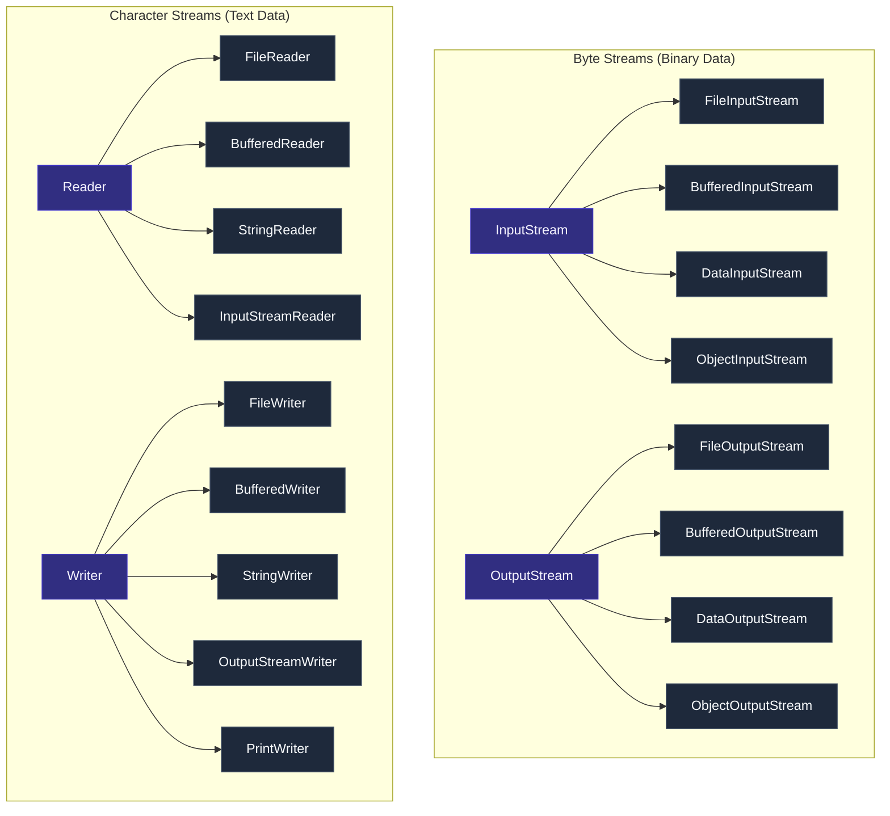

| Class | Purpose | Encoding-aware? |
|:---|:---|:---|
| `FileInputStream` / `FileOutputStream` | Raw byte read/write (images, binaries) | No |
| `BufferedInputStream` / `BufferedOutputStream` | Buffered byte I/O (reduces syscalls) | No |
| `DataInputStream` / `DataOutputStream` | Reads/writes Java primitives (`readInt`, `writeDouble`) | No |
| `ObjectInputStream` / `ObjectOutputStream` | Object serialization / deserialization | No |
| `FileReader` / `FileWriter` | Text file read/write (default charset) | Yes |
| `BufferedReader` / `BufferedWriter` | Buffered text I/O — line-by-line reading | Yes |
| `InputStreamReader` / `OutputStreamWriter` | Byte ↔ char bridge with explicit charset | Yes |
| `PrintWriter` | Convenient formatted text writing (`println`, `printf`) | Yes |

---

### 10.2 Common File I/O Patterns

#### Reading a Text File (Line by Line)

```java
// ✅ Modern way — try-with-resources ensures BufferedReader is always closed
try (BufferedReader br = new BufferedReader(
        new InputStreamReader(new FileInputStream("data.txt"), StandardCharsets.UTF_8))) {
    String line;
    while ((line = br.readLine()) != null) {
        System.out.println(line);
    }
} catch (IOException e) {
    throw new RuntimeException("Failed to read file", e);
}

// ✅ Java 8 Streams API approach — elegant & concise
try (Stream<String> lines = Files.lines(Path.of("data.txt"), StandardCharsets.UTF_8)) {
    lines.filter(l -> l.startsWith("ERROR"))
         .forEach(System.out::println);
} catch (IOException e) {
    log.error("Error reading file", e);
}

// ✅ Read all lines into a List (small files only)
List<String> allLines = Files.readAllLines(Path.of("config.txt"), StandardCharsets.UTF_8);
```

#### Writing to a Text File

```java
// ✅ BufferedWriter — efficient text writing
try (BufferedWriter bw = new BufferedWriter(
        new OutputStreamWriter(new FileOutputStream("output.txt"), StandardCharsets.UTF_8))) {
    bw.write("Hello, World!");
    bw.newLine();
    bw.write("Line 2");
} catch (IOException e) {
    throw new RuntimeException("Failed to write file", e);
}

// ✅ NIO Files utility (simplest for small outputs)
Files.writeString(Path.of("output.txt"), "Hello!", StandardCharsets.UTF_8);

// ✅ Appending to existing file
try (PrintWriter pw = new PrintWriter(new FileWriter("log.txt", true))) { // true = append
    pw.printf("%s: %s%n", LocalDateTime.now(), "Application started");
}
```

#### Binary File I/O

```java
// Copy a binary file (image, PDF) using buffered streams
try (BufferedInputStream  bis = new BufferedInputStream(new FileInputStream("in.jpg"));
     BufferedOutputStream bos = new BufferedOutputStream(new FileOutputStream("out.jpg"))) {
    byte[] buffer = new byte[8192];  // 8 KB buffer
    int bytesRead;
    while ((bytesRead = bis.read(buffer)) != -1) {
        bos.write(buffer, 0, bytesRead);
    }
} catch (IOException e) {
    throw new RuntimeException("File copy failed", e);
}

// ✅ Simplest: Java NIO (Java 7+)
Files.copy(Path.of("source.jpg"), Path.of("target.jpg"), StandardCopyOption.REPLACE_EXISTING);
```

---

### 10.3 Java NIO.2 — Modern File API (java.nio.file)

```java
Path path = Path.of("data", "config.properties");  // platform-independent

// File operations
Files.exists(path);                              // check existence
Files.createDirectories(path.getParent());        // create all missing directories
Files.delete(path);                              // delete (throws if missing)
Files.deleteIfExists(path);                      // safe delete
Files.move(src, dest, StandardCopyOption.REPLACE_EXISTING);
Files.copy(src, dest, StandardCopyOption.COPY_ATTRIBUTES);

// Directory listing
try (DirectoryStream<Path> entries = Files.newDirectoryStream(Path.of("./"), "*.java")) {
    entries.forEach(System.out::println);
}

// Walk directory tree
try (Stream<Path> walk = Files.walk(Path.of("./src"))) {
    walk.filter(Files::isRegularFile)
        .filter(p -> p.toString().endsWith(".java"))
        .forEach(System.out::println);
}

// File metadata
BasicFileAttributes attrs = Files.readAttributes(path, BasicFileAttributes.class);
System.out.println("Size: " + attrs.size());
System.out.println("Last Modified: " + attrs.lastModifiedTime());
```

---

### 10.4 Serialization & Deserialization

Serialization converts a Java object into a byte stream for storage or network transmission. Deserialization reconstructs the object from bytes.


#### Making a Class Serializable

```java
import java.io.Serializable;

public class Employee implements Serializable {

    // ✅ ALWAYS declare serialVersionUID to control version compatibility
    private static final long serialVersionUID = 1L;

    private String name;
    private int    employeeId;
    private String department;
    private transient String password;    // ✅ transient — excluded from serialization
    private static  String  company = "Acme Corp"; // static — never serialized

    // Constructors, getters, setters...
    public Employee(String name, int id, String dept, String password) {
        this.name = name; this.employeeId = id;
        this.department = dept; this.password = password;
    }

    @Override
    public String toString() {
        return String.format("Employee{name='%s', id=%d, dept='%s', password='%s'}",
            name, employeeId, department, password);
    }
}
```

#### Serialize & Deserialize

```java
// ✅ Serialization — write to file
try (ObjectOutputStream oos = new ObjectOutputStream(
        new BufferedOutputStream(new FileOutputStream("employee.ser")))) {
    Employee emp = new Employee("Teja", 101, "Engineering", "secret123");
    oos.writeObject(emp);
    System.out.println("Serialized: " + emp);
} catch (IOException e) {
    throw new RuntimeException("Serialization failed", e);
}

// ✅ Deserialization — read from file
try (ObjectInputStream ois = new ObjectInputStream(
        new BufferedInputStream(new FileInputStream("employee.ser")))) {
    Employee emp = (Employee) ois.readObject(); // cast required
    System.out.println("Deserialized: " + emp);
    // Output: Employee{name='Teja', id=101, dept='Engineering', password='null'}
    //         ↑ password=null because it was transient!
} catch (IOException | ClassNotFoundException e) {
    throw new RuntimeException("Deserialization failed", e);
}
```

---

### 10.5 `transient`, `serialVersionUID`, and `Externalizable`

#### `transient` Keyword

```java
private transient String password;       // excluded from serialization
private transient Connection dbConn;     // DB connections can't be serialized
private transient Logger logger;         // loggers not serializable
```

> **Rule**: Mark fields as `transient` when they contain sensitive data, non-serializable types, or data that should be recomputed on deserialization.

#### `serialVersionUID`

```java
private static final long serialVersionUID = 1L;
```

- Acts as a **version fingerprint** for the class.
- If you add/remove fields without updating `serialVersionUID`, Java throws `InvalidClassException` during deserialization.
- If not declared, JVM auto-computes one based on class structure — **any field change breaks deserialization**.

| Action | `serialVersionUID` Declared | `serialVersionUID` NOT Declared |
|:---|:---|:---|
| Add non-critical field | Compatible (old data works) | **Breaks deserialization** |
| Remove field | Compatible | **Breaks deserialization** |
| Rename field | Incompatible — data lost | **Breaks deserialization** |

#### `Externalizable` — Fine-Grained Control

```java
import java.io.Externalizable;
import java.io.ObjectInput;
import java.io.ObjectOutput;

public class OptimizedEmployee implements Externalizable {

    private String name;
    private int    employeeId;
    private String department;  // we'll skip this in externalization

    // ✅ REQUIRED: no-arg constructor for deserialization
    public OptimizedEmployee() {}

    public OptimizedEmployee(String name, int id, String department) {
        this.name = name; this.employeeId = id; this.department = department;
    }

    @Override
    public void writeExternal(ObjectOutput out) throws IOException {
        out.writeUTF(name);          // only serialize what we choose
        out.writeInt(employeeId);
        // deliberately skipping 'department'
    }

    @Override
    public void readExternal(ObjectInput in) throws IOException, ClassNotFoundException {
        name       = in.readUTF();
        employeeId = in.readInt();
        department = "Unknown";      // default for skipped field
    }
}
```

**`Serializable` vs `Externalizable`**:

| Feature | `Serializable` | `Externalizable` |
|:---|:---|:---|
| **Control** | JVM handles everything automatically | Developer controls what/how to serialize |
| **Performance** | Slower (reflects all fields) | Faster (only writes chosen data) |
| **No-arg constructor** | Not required | **Required** |
| **Custom logic** | Via `readObject` / `writeObject` callbacks | Via `readExternal` / `writeExternal` |
| **Use Case** | Simple POJOs, configuration objects | High-performance, protocol-sensitive objects |

---

### 10.6 Serialization Security Warning

> [!CAUTION]
> **Never deserialize untrusted byte streams!** Attackers can craft malicious byte streams that execute arbitrary code during `readObject()`. This is the root cause of many critical Java vulnerabilities (e.g., Apache Commons Collections exploit).

```java
// ❌ Dangerous — never do this with untrusted input
ObjectInputStream ois = new ObjectInputStream(untrustedInputStream);
Object obj = ois.readObject(); // Can execute attacker's code!

// ✅ Safe alternatives:
// 1. Use JSON (Jackson, Gson) instead of Java serialization
// 2. Whitelist allowed classes with ObjectInputFilter (Java 9+)
ObjectInputFilter filter = ObjectInputFilter.Config.createFilter(
    "com.myapp.model.*;java.base/*;!*");
ois.setObjectInputFilter(filter); // reject anything outside whitelist
```

---

### 10.7 Key Takeaways — File I/O & Serialization

* Use **byte streams** (`InputStream`/`OutputStream`) for binary data; **char streams** (`Reader`/`Writer`) for text.
* Always **wrap with `Buffered*`** variants to reduce system calls and improve performance.
* Prefer **`java.nio.file.Files`** utility methods for modern, concise file operations.
* Implement `Serializable` on POJOs; always declare `serialVersionUID` explicitly.
* Use `transient` for sensitive (passwords), non-serializable (connections, loggers) fields.
* Prefer `Externalizable` over `Serializable` for performance-critical, versioned protocols.
* **Never deserialize untrusted data** — use `ObjectInputFilter` or switch to JSON.
* `try-with-resources` is mandatory for all I/O — prevents resource leaks.

---

## END OF JAVA CORE COMPREHENSIVE GUIDE
