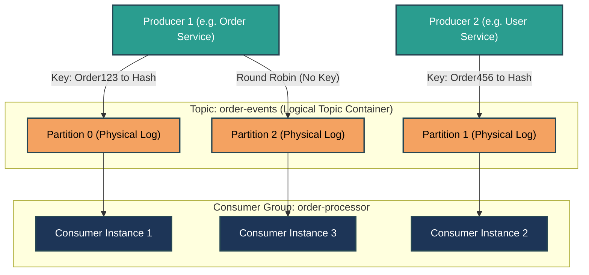
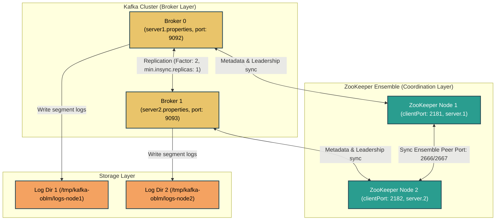
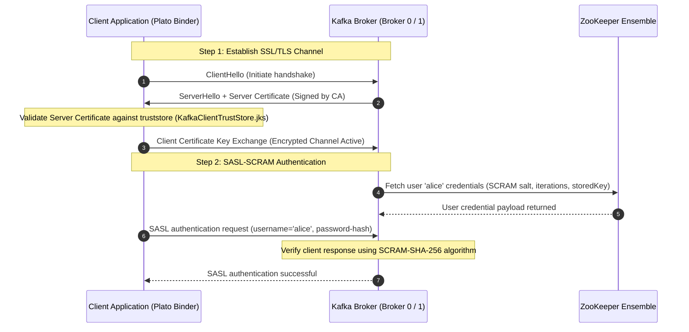
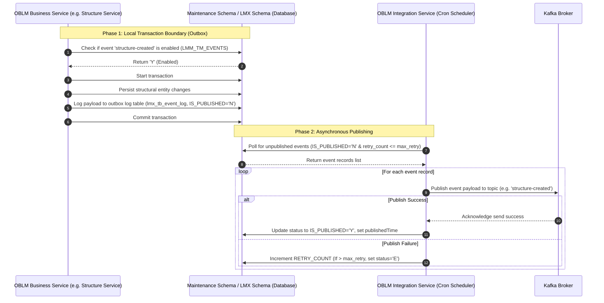

# APACHE KAFKA - COMPREHENSIVE INTERVIEW PREPARATION GUIDE
> *For: 7+ Years Experience Level | Java Developer*

---

## SECTION 1: EVENT-DRIVEN ARCHITECTURE & KAFKA TOPOLOGY

### 1.1 Kafka Architecture & Core Concepts
Apache Kafka is a distributed event streaming platform built for high-throughput, fault-tolerant, and low-latency data pipelines. To understand Kafka, it is critical to grasp how its components coordinate to achieve data streaming at scale:

* **Broker:** A single Kafka server instance. A group of brokers forms a Kafka cluster.
* **Topic:** A logical channel or category to which producers publish messages.
* **Partition:** A physical log division of a topic. Topics are partitioned to enable horizontal scaling, parallelism, and fault tolerance across brokers.
* **Offset:** A unique, sequential integer assigned to each message within a partition. It serves as the local identifier for message positioning.
* **Producer:** An application that publishes records to Kafka topics. The producer determines which partition a message goes to (using round-robin or hash-based routing on message keys).
* **Consumer:** An application that subscribes to topics and processes feed records.
* **Consumer Group:** A logical grouping of consumers that cooperate to consume messages from a set of partitions. Each partition is assigned to exactly one consumer inside a consumer group at any given time.
* **ZooKeeper / KRaft:** Cluster coordinators that manage cluster metadata, monitor broker health, elect partition leaders, and store configuration information.



---

### 1.2 Message Ordering Guarantee
> [!IMPORTANT]
> Kafka guarantees message ordering **only within a single partition**. There is no global ordering guarantee across multiple partitions in a topic. 
* To ensure sequential ordering of related messages (e.g., all state updates for `OrderID-1002`), write those messages with the same **Message Key**. Kafka hashes the key to route the messages to the same partition, ensuring ordered processing by consumers.

---

### 1.3 Technology Comparison: Kafka vs. RabbitMQ vs. ActiveMQ

| Feature | Apache Kafka | RabbitMQ | ActiveMQ |
| :--- | :--- | :--- | :--- |
| **Architecture** | Distributed commit log (pull-based consumers). | Smart broker, dumb consumer (push-based model). | Traditional message broker (JMS compliant). |
| **Throughput** | **Very High** (1M+ events/sec via sequential disk I/O & zero-copy transfer). | **Moderate** (around 50K msgs/sec, restricted by queue size & routing overhead). | **Moderate** (JMS message processing structures). |
| **Ordering Guarantees** | Guaranteed per partition. | Guaranteed per queue. | Guaranteed per queue. |
| **Data Retention** | Configurable retention period (retains messages after consumption). | Messages are deleted immediately upon consumer acknowledgment. | Messages are deleted immediately upon consumer acknowledgment. |
| **Protocols Supported** | Custom binary TCP protocol. | AMQP 0-9-1, AMQP 1.0, MQTT, STOMP. | JMS, AMQP, STOMP, OpenWire. |
| **Primary Use Cases** | Real-time event streaming, log aggregation, event-driven architectures. | Task queues, complex message routing, request-reply patterns. | Legacy enterprise systems integration, JMS-compliant message broker. |

#### Key Takeaways

- Kafka utilizes a pull-based consumer model with sequential disk write-logs, enabling high-volume event throughput.
- Partitioning provides horizontal scalability but restricts ordering guarantees to messages within the same partition.
- Key-based routing is the standard pattern to ensure related messages process in strict sequence.

---

## SECTION 2: ENTERPRISE MIDDLEWARE CLUSTER SETUP

### 2.1 Cluster Sizing Prerequisites (OBLM Standards)
For a resilient enterprise deployment (such as Oracle Banking Liquidity Management - OBLM), minimum cluster setups require redundant instances to eliminate single points of failure (SPOF):

* **Minimum Brokers:** 2 Kafka Brokers
* **Minimum Coordination Nodes:** 2 ZooKeeper Nodes (Typically 3 nodes are recommended to achieve a quorum).
* **Minimum Physical Servers:** 2 Servers (placing 1 broker + 1 ZooKeeper node on each server).
* **Topic Sizing Configurations:**
  * Minimum Partition Count: 2
  * Minimum Replication Factor: 2

---

### 2.2 ZooKeeper Setup (2-Node Ensemble)
ZooKeeper manages broker metadata and handles leadership election.
1. Extract the installation files to `/tools/zookeeper` on both servers.
2. Navigate to configuration directory `/tools/zookeeper/conf`.
3. Create `zookeeper1.cfg` on Server 1 and `zookeeper2.cfg` on Server 2 (renamed from `zoo_sample.cfg`).
4. Configure properties as follows:

#### Server 1 Config (`zookeeper1.cfg`):
```properties
tickTime=2000
initLimit=10
syncLimit=5
dataDir=/tmp/zookeeper-oblm/zookeeper-node1
clientPort=2181
server.1=server1-IP:2666:3666
server.2=server2-IP:2667:3667
```

#### Server 2 Config (`zookeeper2.cfg`):
```properties
tickTime=2000
initLimit=10
syncLimit=5
dataDir=/tmp/zookeeper-oblm/zookeeper-node2
clientPort=2182
server.1=server1-IP:2666:3666
server.2=server2-IP:2667:3667
```
> [!NOTE]
> The ports `2666` and `2667` are peer communication ports; `3666` and `3667` are leader election ports. Update the server IP values with the actual machine IPs.

5. **Establish Node Identifiers (`myid`):**
   * On Server 1, create `/tmp/zookeeper-oblm/zookeeper-node1/myid` containing the text: `1`
   * On Server 2, create `/tmp/zookeeper-oblm/zookeeper-node2/myid` containing the text: `2`
6. **Start ZooKeeper Nodes:**
   * Server 1: `nohup ./bin/zkServer.sh start conf/zookeeper1.cfg &`
   * Server 2: `nohup ./bin/zkServer.sh start conf/zookeeper2.cfg &`

---

### 2.3 Kafka Setup (2-Broker Cluster)
1. Extract the installation archive into `/tools/kafka`.
2. Navigate to configuration directory `/tools/kafka/config`.
3. Configure `server1.properties` on Server 1 and `server2.properties` on Server 2.

#### Broker 0 Config (`server1.properties`):
```properties
broker.id=0
listeners=PLAINTEXT://server1-IP:9092
log.dirs=/tmp/kafka-oblm/logs-node1
zookeeper.connect=server1-IP:2181,server2-IP:2182
num.partitions=2
min.insync.replicas=1
default.replication.factor=2
offsets.topic.replication.factor=2
transaction.state.log.replication.factor=2
transaction.state.log.min.isr=1
message.max.bytes=1000012
compression.type=none
```

#### Broker 1 Config (`server2.properties`):
```properties
broker.id=1
listeners=PLAINTEXT://server2-IP:9093
log.dirs=/tmp/kafka-oblm/logs-node2
zookeeper.connect=server1-IP:2181,server2-IP:2182
num.partitions=2
min.insync.replicas=1
default.replication.factor=2
offsets.topic.replication.factor=2
transaction.state.log.replication.factor=2
transaction.state.log.min.isr=1
message.max.bytes=1000012
compression.type=none
```

4. **Start Kafka Brokers:**
   * Server 1: `nohup ./bin/kafka-server-start.sh config/server1.properties &`
   * Server 2: `nohup ./bin/kafka-server-start.sh config/server2.properties &`



---

### 2.4 Sizing & Tuning Parameters
* **`min.insync.replicas`:** Specifies the minimum number of replicas that must acknowledge a write for the write to be considered successful when a producer sets `acks=all` (or `acks=-1`).
* **`message.max.bytes`:** Configures the maximum size of a message the broker can receive (default `1000012` bytes, ~1MB). You can increase this to accommodate larger XML/JSON payloads.
* **`compression.type`:** Sets the compression codec for message topics. Valid options: `none`, `gzip`, `snappy`, `lz4`, `zstd`. Using `snappy` reduces network utilization with minimal CPU overhead.

#### Key Takeaways

- Enterprise environments require a minimum of 2 Zookeeper nodes and 2 Kafka brokers to achieve high availability.
- A cluster ID (`myid`) is required for each ZooKeeper instance to establish a quorum.
- The `min.insync.replicas` setting defines write availability. Combined with `acks=all`, it prevents message loss in the event of broker failures.

---

## SECTION 3: ADMINISTRATIVE CLI OPERATIONS

Here is a quick reference guide for Kafka administrative commands:

### 3.1 Manual Topic Creation
To create a new topic manually:
```bash
./kafka-topics.sh --create --bootstrap-server localhost:9092 --replication-factor 2 --partitions 2 --topic structure-closed
```

### 3.2 View Topic Configurations (Describe)
To view metadata, partition layouts, and in-sync replicas (ISR) for a topic:
```bash
./kafka-topics.sh --describe --zookeeper localhost:2181 --topic structure-closed
```
* **Sample Output:**
  ```text
  Topic: structure-closed PartitionCount: 2 ReplicationFactor: 2 Configs:
  Topic: structure-closed Partition: 0 Leader: 1 Replicas: 1,0 Isr: 1,0
  Topic: structure-closed Partition: 1 Leader: 0 Replicas: 0,1 Isr: 0,1
  ```

### 3.3 CLI Consumer Execution
To verify messages by reading from a topic:
```bash
./kafka-console-consumer.sh --bootstrap-server localhost:9092 --topic structure-closed --from-beginning
```

---

### 3.4 Increasing Replication Factor (Partition Reassignment)
To increase the replication factor of an existing topic (e.g., from `1` to `2` for topic `structure-closed`):

1. **Write the Reassignment JSON Configuration:**
   Save the following JSON layout to `D:\kafka\config\increase-replication-factor.json`. This instructs Kafka to replicate partition logs across brokers `0` and `1`:
   ```json
   {
     "version": 1,
     "partitions": [
       { "topic": "structure-closed", "partition": 0, "replicas": [0, 1], "log_dirs": ["any", "any"] },
       { "topic": "structure-closed", "partition": 1, "replicas": [0, 1], "log_dirs": ["any", "any"] }
     ]
   }
   ```

2. **Execute Reassignment Plan:**
   Run the reassignment tool using the `--execute` flag:
   ```bash
   ./kafka-reassign-partitions.sh --zookeeper localhost:2181 --reassignment-json-file D:\kafka\config\increase-replication-factor.json --execute
   ```

3. **Verify Execution Status:**
   Run the tool using the `--verify` flag to ensure the partition logs replicated successfully:
   ```bash
   ./kafka-reassign-partitions.sh --zookeeper localhost:2181 --reassignment-json-file D:\kafka\config\increase-replication-factor.json --verify
   ```
   * **Expected Output:**
     ```text
     Status of partition reassignment:
     Reassignment of partition structure-closed-0 completed successfully.
     Reassignment of partition structure-closed-1 completed successfully.
     ```

#### Key Takeaways

- Manual topic creation allows you to customize partition counts and replication factors before microservice deployment.
- The `describe` command is the main tool used to check partition leadership and ISR status.
- Increasing the replication factor of a live topic requires a partition reassignment process using a JSON configuration file.

---

## SECTION 4: ENTERPRISE SECURITY (SSL & SASL-SCRAM)

Enterprise environments secure Kafka traffic by combining **SSL/TLS Encryption** (securing data in transit) and **SASL-SCRAM Authentication** (verifying client credentials via username/password hashes).

### 4.1 Keytool Cryptographic Generation
1. **Generate the Server Keystore:**
   Create a Java Keystore (JKS) containing a new private key and self-signed certificate:
   ```bash
   keytool -genkeypair -alias OBLMcert -keyalg RSA -keysize 1024 -sigalg SHA512withRSA -validity 365 -keystore D:\kafka\securityKeys\KafkaServerKeystore.jks
   ```
   * *Required Attributes:*
     * `alias`: String to identify the keypair (e.g., `OBLMcert`).
     * `keysize`: Key pair size (1024 or higher recommended).
     * `sigalg`: Signature algorithm compatibility match (e.g., `SHA512withRSA`).
     * `validity`: Days the certificate remains active (e.g., `365`).
     * Certificate Distinguished Name (DN) values: CN (domain name of OBLM client, e.g. www.example.com), OU (organizational unit, e.g. OBLM), O (organization name, e.g. Oracle Financial Services), L (city, e.g. Bengaluru), ST (state, e.g. Karnataka), C (country code, e.g. IN).

2. **Export Certificate:**
   Export the self-signed certificate to a file:
   ```bash
   keytool -export -alias OBLMcert -file D:\kafka\securityKeys\KafkaCert.cer -keystore D:\kafka\securityKeys\KafkaServerKeystore.jks -keypass oracle123 -storepass oracle123
   ```

3. **Generate Truststores (Server and Client):**
   Import the certificate to generate truststore trust keys:
   ```bash
   # Server Truststore
   keytool -import -alias OBLMcert -file D:\kafka\securityKeys\KafkaCert.cer -keystore D:\kafka\securityKeys\KafkaServerTrustStore.jks -storepass oracle123
   # Client Truststore
   keytool -import -alias OBLMcert -file D:\kafka\securityKeys\KafkaCert.cer -keystore D:\kafka\securityKeys\KafkaClientTrustStore.jks -storepass oracle123
   ```

---

### 4.2 Creating Credentials in ZooKeeper
SASL-SCRAM (Salted Challenge Response Authentication Mechanism) users are created and managed directly in ZooKeeper:
```bash
# Admin User Creation (For Broker intercommunication authentication)
./kafka-configs.sh --zookeeper localhost:2181,localhost:2182 --alter --add-config "SCRAM-SHA-256=[password=admin-secret],SCRAM-SHA-512=[password=admin-secret]" --entity-type users --entity-name admin

# Client User Creation (For Service publisher/consumer authentication)
./kafka-configs.sh --zookeeper localhost:2181,localhost:2182 --alter --add-config "SCRAM-SHA-256=[iterations=8192,password=alice-secret],SCRAM-SHA-512=[password=alice-secret]" --entity-type users --entity-name alice
```

---

### 4.3 Broker Configurations
Add the following properties to `server.properties` on your brokers to enable SSL encryption and SASL-SCRAM authentication:
```properties
ssl.endpoint.identification.algorithm=
ssl.truststore.location=D:\\kafka\\securityKeys\\KafkaServerTrustStore.jks
ssl.truststore.password=oracle123
ssl.keystore.location=D:\\kafka\\securityKeys\\KafkaServerKeystore.jks
ssl.keystore.password=oracle123
ssl.key.password=oracle123

sasl.enabled.mechanisms=SCRAM-SHA-256
sasl.mechanism.inter.broker.protocol=SCRAM-SHA-256
security.inter.broker.protocol=SASL_SSL

listeners=SASL_SSL://HOSTNAME:9092
advertised.listeners=SASL_SSL://IP:9091

listener.name.sasl_ssl.scram-sha-256.sasl.jaas.config=org.apache.kafka.common.security.scram.ScramLoginModule required \
  username="admin" \
  password="admin-secret";
```

---

### 4.4 Client Config & PLATO Configuration Integration
Microservices (using Spring Cloud Stream) must register connection and security details in the PLATO Schema's properties table:

| Property Key | Value Description | Example Value |
| :--- | :--- | :--- |
| `plato.services.kafka.brokers` | Comma-separated broker hostnames and ports. | `server1-IP:9092,server2-IP:9093` |
| `plato.services.zknodes` | Comma-separated ZooKeeper hostnames and ports. | `server1-IP:2181,server2-IP:2182` |
| `plato.services.kafka.security.protocol` | Protocol identifier. | `SASL_SSL` |
| `plato.services.kafka.truststore.location` | Absolute path to the truststore file. | `D:\kafka\securityKeys\KafkaClientTrustStore.jks` |
| `plato.services.kafka.truststore.password`| Decrypted runtime password. | `{cipher}7ec1250634259a1af12f74...` |
| `spring.cloud.stream.kafka.binder.configuration.sasl.mechanism` | SASL Authentication mechanism. | `SCRAM-SHA-256` |
| `spring.cloud.stream.kafka.binder.jaas.loginModule` | JAAS config class. | `org.apache.kafka.common.security.scram.ScramLoginModule` |
| `spring.cloud.stream.kafka.binder.jaas.options.username` | JAAS credential username. | `alice` |
| `spring.cloud.stream.kafka.binder.jaas.options.password` | JAAS credential password. | `{cipher}2f32dc1770acec08510...` |

#### Config Service Password Encryption
For security, passwords must be encrypted using the OBLM Config Service API:
* **Endpoint:** `POST http://hostname:port/config-service/encrypt` (accepts plain text, returns encrypted cipher hashes).
* **Usage:** Prefix encrypted values with the `{cipher}` keyword when inserting them into the databases. This tells the Config Service to decrypt the values at runtime:
```sql
-- Injecting Encrypted Truststore Password
INSERT INTO PROPERTIES (ID, APPLICATION, PROFILE, LABEL, KEY, VALUE) 
VALUES (10114, 'oblm-structure-services', 'jdbc', 'jdbc', 'plato.services.kafka.truststore.password', '{cipher}7ec1250634259a1af12f74a7e4705ade7493a4695cc1efd3b713571453fda266');

-- Injecting Encrypted SASL Client Password
INSERT INTO PROPERTIES (ID, APPLICATION, PROFILE, LABEL, KEY, VALUE) 
VALUES (10118, 'oblm-structure-services', 'jdbc', 'jdbc', 'spring.cloud.stream.kafka.binder.jaas.options.password', '{cipher}2f32dc1770acec085105e3ba585cc44c71534451b88b6047504f11191ad8cc1f');
```

---

### 4.5 Console Consumer Configuration (`ssl.properties`)
To consume messages from a secure broker using the CLI, save the following configuration to `D:\kafka\config\ssl.properties`:
```properties
ssl.truststore.location=D:\\kafka\\securityKeys\\KafkaClientTrustStore.jks
ssl.truststore.password=oracle123
security.protocol=SASL_SSL
ssl.endpoint.identification.algorithm=
sasl.mechanism=SCRAM-SHA-256
sasl.jaas.config=org.apache.kafka.common.security.scram.ScramLoginModule required \
  username="alice" \
  password="alice-secret";
```
Then run the consumer using the config file:
```bash
./kafka-console-consumer.sh --bootstrap-server localhost:9092 --topic oblm-structure-closed --consumer.config D:\kafka\config\ssl.properties --from-beginning
```



#### Key Takeaways

- SSL provides communication channel encryption; SASL-SCRAM provides user verification.
- Truststores contain certificates of trusted authorities; Keystores contain a node's private identity key.
- The config service decrypts configurations dynamically at runtime when keys are prefixed with `{cipher}`.

---

## SECTION 5: MICROSERVICES TRANSACTIONAL OUTBOX PATTERN

Enterprise systems use the **Transactional Outbox Pattern** to guarantee eventual consistency between databases and Kafka topics. This avoids data loss or inconsistency if a database write succeeds but the Kafka publish fails (or vice versa).



---

### 5.1 Outbox Schema Structures

#### 1. Configured Event Registry (`LMM_TM_EVENTS` in Maintenance Schema)
Stores all supported events. If `EVT_ISENABLED` is set to `Y`, the business microservice will write events to the outbox log when they occur.
```sql
CREATE TABLE LMM_TM_EVENTS (
    ID VARCHAR2(36 BYTE) NOT NULL,
    EVT_CODE VARCHAR2(50 BYTE) NOT NULL,
    EVT_CATEGORY VARCHAR2(20 BYTE) NOT NULL,
    EVT_DESC VARCHAR2(100 BYTE) NOT NULL,
    EVT_TOPIC VARCHAR2(50 BYTE) NOT NULL,
    EVT_ISENABLED CHAR(1 BYTE) NOT NULL,
    MAKER_ID VARCHAR2(12 BYTE),
    MAKER_DT_STAMP DATE,
    CHECKER_ID VARCHAR2(12 BYTE),
    CHECKER_DT_STAMP DATE,
    RECORD_STAT CHAR(1 BYTE),
    AUTH_STAT CHAR(1 BYTE),
    ONCE_AUTH CHAR(1 BYTE),
    MOD_NO NUMBER(4,0),
    PRIMARY KEY (ID)
);
```

#### 2. Service Outbox Table (`LMX_TB_EVENT_LOG` in LMX/LMX2 Schema)
Stores outgoing event payloads. The Integration Service polls this table to publish messages to Kafka.
```sql
CREATE TABLE LMX_TB_EVENT_LOG (
    ID VARCHAR2(36 BYTE) NOT NULL,
    EVT_CODE VARCHAR2(50 BYTE) NOT NULL,
    EVT_TOPIC VARCHAR2(50 BYTE) NOT NULL,
    EVT_KEY VARCHAR2(50 BYTE),
    LOG_TYPE VARCHAR2(20 BYTE),
    LOG_DESCRIPTION VARCHAR2(500 BYTE),
    LOG_TIME TIMESTAMP(6),
    SERVICE_DATA CLOB,
    PUBLISHED_TIME TIMESTAMP(6),
    IS_PUBLISHED CHAR(1 BYTE) DEFAULT 'N',
    RETRY_COUNT NUMBER DEFAULT 0,
    PRIMARY KEY (ID)
);
```

#### 3. Core Event Hub Outbox Log (`PLATO_EVENTHUB_OUT_LOG` in LMX Schema)
Used by `plato-event-hub-core` to track event delivery details and status across publishers.
```sql
CREATE TABLE PLATO_EVENTHUB_OUT_LOG (
    ID VARCHAR2(36 BYTE) NOT NULL,
    TOPIC_NAME VARCHAR2(255 BYTE) NOT NULL,
    MESSAGE_KEY VARCHAR2(36 BYTE),
    EVENT_TYPE VARCHAR2(25 BYTE),
    PAYLOAD CLOB,
    EXCEPTION VARCHAR2(512 BYTE),
    STATUS VARCHAR2(33 BYTE),
    RETRY_COUNT NUMBER,
    RETRY_DATETIME DATE,
    CREATED_BY VARCHAR2(12 BYTE),
    CREATED_DATE DATE,
    UPDATED_BY VARCHAR2(12 BYTE),
    UPDATED_DATE DATE,
    CORRELATION_ID VARCHAR2(256 BYTE),
    APPLICATION_NAME VARCHAR2(120 BYTE),
    ACK_COUNT NUMBER(38,0) DEFAULT 0,
    HEADER CLOB,
    CONSUMER_APPL VARCHAR2(512 BYTE),
    PRIMARY KEY (ID)
);
```

#### 4. Core Event Hub Inbox Log (`PLATO_EVENTHUB_IN_LOG` in LMX Schema)
Tracks consumed events to prevent duplicate processing (idempotency checks).
```sql
CREATE TABLE PLATO_EVENTHUB_IN_LOG (
    ID VARCHAR2(36 BYTE) NOT NULL,
    TOPIC_NAME VARCHAR2(100 BYTE),
    MESSAGE_KEY VARCHAR2(255 BYTE),
    EVENT_TYPE VARCHAR2(36 BYTE),
    EVENT_PAYLOAD CLOB,
    STATUS VARCHAR2(36 BYTE),
    EXCEPTION VARCHAR2(500 BYTE),
    MSG_DT_STAMP DATE,
    CORRELATION_ID VARCHAR2(256 BYTE),
    APPLICATION_NAME VARCHAR2(100 BYTE),
    PRIMARY KEY (ID)
);
```

---

### 5.2 Microservice Event Registry & Schedulers
The microservices use the following event codes and scheduling models:

* **`oblm-maintenance-services` (Maintenance Events):**
  * Event Codes: `bank-pref`, `branch-pref`, `pricing-map`.
  * Logs actions in `LMX_TB_EVENT_LOG` if enabled.
* **`oblm-sweep-services` (Account Balance Sweeps):**
  * Event Codes: `sweep-success` (S), `sweep-error` (E), `sweep-pending` (P), `sweep-handOff` (H).
* **`oblm-structure-services` (Account Pooling Structures):**
  * Event Codes: `structure-created`, `structure-createdAndAuthorized`, `structure-modified`, `structure-modifiedAndAuthorized`, `structure-closed`, `structure-closedAndAuthorized`, `structure-reopen`, `structure-reopenAndAuthorized`, `structure-charge`.
  * **Structure Expiry Scheduler:** A daily cron job (`0 40 20 * * ?` at 8:40 PM) checks for pooling structures expiring within $N$ days and logs `structure-expiry` events.
* **`oblm-integration-service` (Integration Outbox Publisher):**
  * Runs a scheduler (e.g., `0 0/10 * * * ?` every 10 minutes) that fetches unpublished events from `LMX_TB_EVENT_LOG`. It publishes events where `IS_PUBLISHED = 'N'` and `RETRY_COUNT <= retryCount`. If a publish fails $N$ times, the event is marked as error (`E`) and skipped.

---

### 5.3 Payload Schemas

#### 1. Generic Event Payload (Sweep & Structure Events)
```json
{
  "id": "String (UUID)",
  "evtCode": "String (e.g. structure-created)",
  "logTime": "String (Timestamp ISO)",
  "logType": "String (Originating microservice, e.g. oblm-structure-services)",
  "logDescription": "String",
  "serviceData": "String (CLOB serialization)",
  "publishedTime": "String"
}
```

#### 2. Bank Preference Event Payload
```json
{
  "id": "String",
  "modNo": "String",
  "recordStat": "String",
  "authStat": "String",
  "makerId": "String",
  "makerDateStamp": "String",
  "checkerId": "String",
  "checkerDateStamp": "String",
  "onceAuth": "String",
  "applicationCode": "String",
  "bankCode": "String",
  "chargeCalcPref": "String",
  "chargeCollPref": "String",
  "chgIncludeClosedVa": "String"
}
```

#### 3. Common Kafka Header structure
Every published record contains metadata in the header:
```json
{
  "userId": "String",
  "branchCode": "String",
  "sourceSystem": "String",
  "event": "String (Event Code)",
  "ackRequired": "Boolean (Default: false)",
  "kafka_messageKey": "String",
  "messageId": "String",
  "entityId": "String"
}
```

#### Key Takeaways

- The Transactional Outbox Pattern ensures database updates and message publishing occur atomically.
- Outbox event logs are saved locally inside the business service schema before publishing.
- Schedulers poll local outbox logs, publish to Kafka, and handle retries and error states (`E`).

---

## SECTION 6: ADVANCED EVENT STREAMING SCENARIOS

For senior engineering roles, you must understand advanced event streaming scenarios:

### 6.1 Message Delivery Guarantees
* **At-most-once:** Producer sends messages without waiting for acknowledgments (`acks=0`). If a broker fails, messages may be lost.
* **At-least-once:** Producer retries until an acknowledgment is received (`acks=all` or `acks=1`). This prevents message loss, but can introduce duplicate messages on the consumer side if a network partition occurs.
* **Exactly-once (EOS):** Achieved by enabling idempotent producers and using transactional boundaries:
  ```properties
  enable.idempotence=true
  acks=all
  retries=2147483647
  ```
  The broker uses a unique Producer ID (PID) and sequence numbers to deduplicate retried messages.

---

### 6.2 Consumer Group Rebalancing
When a consumer joins or leaves a consumer group, partition ownership is reassigned among the group's active members.
* **Common Rebalance Protocols:**
  * *Eager Protocol:* All consumers revoke their partitions and stop consuming. They rejoin the group, receive new partition assignments, and resume consumption. This causes a brief stop-the-world pause.
  * *Cooperative Sticky Protocol:* Only partitions moving from one consumer to another are revoked. Unaffected consumers continue processing messages without interruption, minimizing rebalance latency.

---

### 6.3 Kafka Streams Stateful Architecture
Kafka Streams allows you to perform real-time, stateful transformations (e.g., joins, windowed aggregations) on event streams.
* **State Stores:** Local state is saved in rocksDB instances on the processing node and backed up to a compacted changelog topic in Kafka for fault tolerance.
```java
StreamsBuilder builder = new StreamsBuilder();
KStream<String, String> sourceStream = builder.stream("input-topic");

KTable<String, Long> wordCounts = sourceStream
    .flatMapValues(value -> Arrays.asList(value.toLowerCase().split("\\W+")))
    .groupBy((key, word) -> word)
    .count(Materialized.as("counts-store")); // Stateful store definition

wordCounts.toStream().to("output-topic", Produced.with(Serdes.String(), Serdes.Long()));
```

---

### 6.4 Schema Registry & Compatibility
The Schema Registry coordinates message schemas between producers and consumers (often using Apache Avro or Protobuf).
```text
Producer -> Validates Schema -> Schema Registry -> Serializes (with Schema ID) -> Kafka Topic
Consumer -> Reads Schema ID -> Schema Registry -> Deserializes -> Processes Entity
```
* **Compatibility Modes:**
  * `BACKWARD` (Default): Consumers using the new schema can read data written using the old schema.
  * `FORWARD`: Consumers using the old schema can read data written using the new schema.
  * `FULL`: Both forward and backward compatible.
  * `NONE`: Schema validation is disabled.

---

### 6.5 Consumer Lag Monitoring
**Consumer Lag** is the difference between the latest offset written to a partition and the offset committed by the consumer group. If lag grows, the consumer is falling behind.
* **Troubleshooting Steps:**
  1. Monitor lag using `kafka-consumer-groups.sh --describe --group my-group`.
  2. If lag is increasing, check thread logs for `CommitFailedException` (which can indicate that message processing is taking longer than `max.poll.interval.ms`).
  3. Scale consumption by adding consumers (up to the partition count) or partitioning the topic.

#### Key Takeaways

- Exactly-once semantics (EOS) prevent data corruption and duplicate messages across transaction boundaries.
- Cooperative Sticky Assignors avoid stop-the-world pauses during consumer group rebalances.
- Stateful Stream processors use RocksDB for local lookups, backed by compacted Kafka topics.

---

## SECTION 7: 20 INTERVIEW LEVEL CODING QUESTIONS & SOLUTIONS

The following coding solutions demonstrate modern Spring Boot and Spring Kafka integration practices:

### Q1: Spring Boot Configured Kafka Producer
```java
import org.apache.kafka.clients.producer.ProducerConfig;
import org.apache.kafka.common.serialization.StringSerializer;
import org.springframework.context.annotation.Bean;
import org.springframework.context.annotation.Configuration;
import org.springframework.kafka.core.DefaultKafkaProducerFactory;
import org.springframework.kafka.core.KafkaTemplate;
import org.springframework.kafka.core.ProducerFactory;
import org.springframework.kafka.support.serializer.JsonSerializer;
import java.util.HashMap;
import java.util.Map;

@Configuration
class KafkaProducerConfig {

    @Bean
    public ProducerFactory<String, Object> producerFactory() {
        Map<String, Object> configProps = new HashMap<>();
        configProps.put(ProducerConfig.BOOTSTRAP_SERVERS_CONFIG, "localhost:9092");
        configProps.put(ProducerConfig.KEY_SERIALIZER_CLASS_CONFIG, StringSerializer.class);
        configProps.put(ProducerConfig.VALUE_SERIALIZER_CLASS_CONFIG, JsonSerializer.class);
        return new DefaultKafkaProducerFactory<>(configProps);
    }

    @Bean
    public KafkaTemplate<String, Object> kafkaTemplate() {
        return new KafkaTemplate<>(producerFactory());
    }
}
```

---

### Q2: Publishing Messages with Callback Actions
```java
import org.slf4j.Logger;
import org.slf4j.LoggerFactory;
import org.springframework.beans.factory.annotation.Autowired;
import org.springframework.kafka.core.KafkaTemplate;
import org.springframework.kafka.support.SendResult;
import org.springframework.stereotype.Service;
import java.util.concurrent.CompletableFuture;

@Service
class EventPublisher {
    private static final Logger log = LoggerFactory.getLogger(EventPublisher.class);

    @Autowired
    private KafkaTemplate<String, Object> kafkaTemplate;

    public void sendEvent(String topic, String key, Object payload) {
        CompletableFuture<SendResult<String, Object>> future = kafkaTemplate.send(topic, key, payload);
        
        future.whenComplete((result, ex) -> {
            if (ex == null) {
                log.info("Sent message key={} offset={}", key, result.getRecordMetadata().offset());
            } else {
                log.error("Failed to publish message key={}", key, ex);
            }
        });
    }
}
```

---

### Q3: Configured Consumer Listener
```java
import org.slf4j.Logger;
import org.slf4j.LoggerFactory;
import org.springframework.kafka.annotation.KafkaListener;
import org.springframework.kafka.support.KafkaHeaders;
import org.springframework.messaging.handler.annotation.Header;
import org.springframework.messaging.handler.annotation.Payload;
import org.springframework.stereotype.Service;

@Service
class EventConsumer {
    private static final Logger log = LoggerFactory.getLogger(EventConsumer.class);

    @KafkaListener(topics = "order-events", groupId = "order-processors")
    public void consume(@Payload String message,
                        @Header(KafkaHeaders.RECEIVED_PARTITION) int partition,
                        @Header(KafkaHeaders.OFFSET) long offset) {
        log.info("Received event: {} from partition: {} at offset: {}", message, partition, offset);
    }
}
```

---

### Q4: Parallel Multi-Threaded Consumer Configuration
```java
import org.apache.kafka.clients.consumer.ConsumerConfig;
import org.apache.kafka.common.serialization.StringDeserializer;
import org.springframework.context.annotation.Bean;
import org.springframework.context.annotation.Configuration;
import org.springframework.kafka.config.ConcurrentKafkaListenerContainerFactory;
import org.springframework.kafka.core.ConsumerFactory;
import org.springframework.kafka.core.DefaultKafkaConsumerFactory;
import java.util.HashMap;
import java.util.Map;

@Configuration
class KafkaConsumerConfig {

    @Bean
    public ConsumerFactory<String, String> consumerFactory() {
        Map<String, Object> props = new HashMap<>();
        props.put(ConsumerConfig.BOOTSTRAP_SERVERS_CONFIG, "localhost:9092");
        props.put(ConsumerConfig.KEY_DESERIALIZER_CLASS_CONFIG, StringDeserializer.class);
        props.put(ConsumerConfig.VALUE_DESERIALIZER_CLASS_CONFIG, StringDeserializer.class);
        return new DefaultKafkaConsumerFactory<>(props);
    }

    @Bean
    public ConcurrentKafkaListenerContainerFactory<String, String> kafkaListenerContainerFactory() {
        ConcurrentKafkaListenerContainerFactory<String, String> factory = 
            new ConcurrentKafkaListenerContainerFactory<>();
        factory.setConsumerFactory(consumerFactory());
        // Parallel execution matching partition scale
        factory.setConcurrency(3); 
        return factory;
    }
}
```

---

### Q5: Spring Boot DLT & Retryable Topics
```java
import org.slf4j.Logger;
import org.slf4j.LoggerFactory;
import org.springframework.kafka.annotation.DltHandler;
import org.springframework.kafka.annotation.KafkaListener;
import org.springframework.kafka.annotation.RetryableTopic;
import org.springframework.retry.annotation.Backoff;
import org.springframework.stereotype.Service;

@Service
class OrderProcessingService {
    private static final Logger log = LoggerFactory.getLogger(OrderProcessingService.class);

    @RetryableTopic(
        attempts = "3",
        backoff = @Backoff(delay = 2000, multiplier = 2.0),
        dltTopicSuffix = "-dead-letter"
    )
    @KafkaListener(topics = "customer-orders", groupId = "order-group")
    public void processOrder(String orderPayload) {
        log.info("Processing order: {}", orderPayload);
        if (orderPayload.contains("INVALID")) {
            throw new IllegalArgumentException("Invalid order payload structure");
        }
    }

    @DltHandler
    public void handleDeadLetter(String payload) {
        log.error("Routing failed message to DLT: {}", payload);
    }
}
```

---

### Q6: Manual Offset Acknowledgment Configuration
```java
import org.springframework.context.annotation.Bean;
import org.springframework.context.annotation.Configuration;
import org.springframework.kafka.config.ConcurrentKafkaListenerContainerFactory;
import org.springframework.kafka.core.ConsumerFactory;
import org.springframework.kafka.listener.ContainerProperties;

@Configuration
class ManualAckConfig {

    @Bean
    public ConcurrentKafkaListenerContainerFactory<String, String> manualAckListenerContainerFactory(
            ConsumerFactory<String, String> consumerFactory) {
        ConcurrentKafkaListenerContainerFactory<String, String> factory = 
            new ConcurrentKafkaListenerContainerFactory<>();
        factory.setConsumerFactory(consumerFactory);
        // Set manual acknowledgment mode
        factory.getContainerProperties().setAckMode(ContainerProperties.AckMode.MANUAL_IMMEDIATE);
        return factory;
    }
}
```

---

### Q7: Manual Offset Acknowledgment Consumer Implementation
```java
import org.slf4j.Logger;
import org.slf4j.LoggerFactory;
import org.springframework.kafka.annotation.KafkaListener;
import org.springframework.kafka.support.Acknowledgment;
import org.springframework.stereotype.Service;

@Service
class ManualAckConsumer {
    private static final Logger log = LoggerFactory.getLogger(ManualAckConsumer.class);

    @KafkaListener(
        topics = "payments", 
        groupId = "payment-group", 
        containerFactory = "manualAckListenerContainerFactory"
    )
    public void consume(String paymentPayload, Acknowledgment ack) {
        try {
            log.info("Processing payment: {}", paymentPayload);
            // Commit offset manually upon successful processing
            ack.acknowledge(); 
        } catch (Exception e) {
            log.error("Failed processing payment payload", e);
        }
    }
}
```

---

### Q8: Transactional Spring Boot Kafka Publisher
```java
import org.springframework.beans.factory.annotation.Autowired;
import org.springframework.kafka.core.KafkaTemplate;
import org.springframework.stereotype.Service;
import org.springframework.transaction.annotation.Transactional;

@Service
class TransactionalPublisher {

    @Autowired
    private KafkaTemplate<String, String> kafkaTemplate;

    @Transactional // Executes within an atomic database transaction
    public void executeTransactionalPublish(String orderId, String payload) {
        kafkaTemplate.send("order-created", orderId, payload);
        // If an exception occurs, the transaction rolls back and the message is not committed to Kafka
        if (payload.contains("ROLLBACK")) {
            throw new RuntimeException("Forced transactional rollback");
        }
    }
}
```

---

### Q9: Embedded Kafka Integration Test Case
```java
import org.junit.jupiter.api.Test;
import org.springframework.beans.factory.annotation.Autowired;
import org.springframework.boot.test.context.SpringBootTest;
import org.springframework.kafka.core.KafkaTemplate;
import org.springframework.kafka.test.context.EmbeddedKafka;
import static org.junit.jupiter.api.Assertions.assertDoesNotThrow;

@SpringBootTest
@EmbeddedKafka(partitions = 1, brokerProperties = { "listeners=PLAINTEXT://localhost:9092", "port=9092" })
class EmbeddedKafkaIntegrationTest {

    @Autowired
    private KafkaTemplate<String, String> kafkaTemplate;

    @Test
    void verifyEventPublishSuccess() {
        assertDoesNotThrow(() -> 
            kafkaTemplate.send("order-created", "test-key", "test-payload").get()
        );
    }
}
```

---

### Q10: Custom JSON Deserializer
```java
import org.apache.kafka.common.serialization.Deserializer;
import com.fasterxml.jackson.databind.ObjectMapper;
import java.io.IOException;

class CustomJsonDeserializer<T> implements Deserializer<T> {
    private final Class<T> targetType;
    private final ObjectMapper mapper = new ObjectMapper();

    public CustomJsonDeserializer(Class<T> targetType) {
        this.targetType = targetType;
    }

    @Override
    public T deserialize(String topic, byte[] data) {
        if (data == null) return null;
        try {
            return mapper.readValue(data, targetType);
        } catch (IOException e) {
            throw new RuntimeException("Error deserializing message bytes", e);
        }
    }
}
```

---

### Q11: Log Compaction Verification Logic
```java
import org.apache.kafka.clients.admin.AdminClient;
import org.apache.kafka.clients.admin.Config;
import org.apache.kafka.common.config.ConfigResource;
import java.util.Collections;
import java.util.concurrent.ExecutionException;

class CompactedTopicVerifier {
    public static boolean isCompacted(AdminClient admin, String topic) 
            throws ExecutionException, InterruptedException {
        ConfigResource resource = new ConfigResource(ConfigResource.Type.TOPIC, topic);
        Config config = admin.describeConfigs(Collections.singleton(resource))
                             .all().get().get(resource);
                             
        return "compact".equalsIgnoreCase(config.get("cleanup.policy").value());
    }
}
```

---

### Q12: Custom Header Mapping
```java
import org.apache.kafka.clients.producer.ProducerRecord;
import org.apache.kafka.common.header.internals.RecordHeader;
import org.springframework.beans.factory.annotation.Autowired;
import org.springframework.kafka.core.KafkaTemplate;
import org.springframework.stereotype.Service;

@Service
class HeaderMappingPublisher {

    @Autowired
    private KafkaTemplate<String, String> kafkaTemplate;

    public void sendWithHeaders(String topic, String key, String payload, String correlationId) {
        ProducerRecord<String, String> record = new ProducerRecord<>(topic, key, payload);
        // Inject a custom tracking correlation ID into the header
        record.headers().add(new RecordHeader("X-Correlation-Id", correlationId.getBytes()));
        kafkaTemplate.send(record);
    }
}
```

---

### Q13: Stream Topology Filters
```java
import org.apache.kafka.common.serialization.Serdes;
import org.apache.kafka.streams.StreamsBuilder;
import org.apache.kafka.streams.kstream.KStream;
import org.apache.kafka.streams.kstream.Consumed;
import org.apache.kafka.streams.kstream.Produced;
import org.springframework.context.annotation.Bean;
import org.springframework.context.annotation.Configuration;

@Configuration
class StreamsTopologyConfig {

    @Bean
    public KStream<String, String> filterStream(StreamsBuilder builder) {
        KStream<String, String> source = builder.stream("incoming-raw", 
            Consumed.with(Serdes.String(), Serdes.String()));
        
        KStream<String, String> filtered = source.filter((key, value) -> 
            value != null && value.contains("PRIORITY_HIGH")
        );
        
        filtered.to("priority-events", Produced.with(Serdes.String(), Serdes.String()));
        return filtered;
    }
}
```

---

### Q14: Handling Publish Timeouts
```java
import org.apache.kafka.clients.producer.ProducerConfig;
import org.springframework.context.annotation.Bean;
import org.springframework.context.annotation.Configuration;
import org.springframework.kafka.core.DefaultKafkaProducerFactory;
import org.springframework.kafka.core.KafkaTemplate;
import org.springframework.kafka.core.ProducerFactory;
import java.util.HashMap;
import java.util.Map;

@Configuration
class ProducerTimeoutConfig {

    @Bean
    public ProducerFactory<String, String> customProducerFactory() {
        Map<String, Object> config = new HashMap<>();
        config.put(ProducerConfig.BOOTSTRAP_SERVERS_CONFIG, "localhost:9092");
        config.put(ProducerConfig.KEY_SERIALIZER_CLASS_CONFIG, "org.apache.kafka.common.serialization.StringSerializer");
        config.put(ProducerConfig.VALUE_SERIALIZER_CLASS_CONFIG, "org.apache.kafka.common.serialization.StringSerializer");
        
        // Timeout configurations
        config.put(ProducerConfig.MAX_BLOCK_MS_CONFIG, 3000); // Fail fast after 3 seconds
        config.put(ProducerConfig.DELIVERY_TIMEOUT_MS_CONFIG, 5000);
        return new DefaultKafkaProducerFactory<>(config);
    }

    @Bean
    public KafkaTemplate<String, String> fastFailKafkaTemplate() {
        return new KafkaTemplate<>(customProducerFactory());
    }
}
```

---

### Q15: Custom Key Partition Routing
```java
import org.apache.kafka.clients.producer.Partitioner;
import org.apache.kafka.common.Cluster;
import java.util.Map;

class CustomTenantPartitioner implements Partitioner {

    @Override
    public int partition(String topic, Object key, byte[] keyBytes, Object value, byte[] valueBytes, Cluster cluster) {
        int numPartitions = cluster.partitionsForTopic(topic).size();
        if (key instanceof String && ((String) key).startsWith("VIP-")) {
            return 0; // Route VIP customers to partition 0
        }
        return Math.abs(key.hashCode()) % numPartitions;
    }

    @Override public void close() {}
    @Override public void configure(Map<String, ?> configs) {}
}
```

---

### Q16: Awaitility Async Integration Test
```java
import org.awaitility.Awaitility;
import org.junit.jupiter.api.Test;
import org.springframework.beans.factory.annotation.Autowired;
import org.springframework.boot.test.context.SpringBootTest;
import org.springframework.kafka.core.KafkaTemplate;
import java.time.Duration;
import static org.junit.jupiter.api.Assertions.assertEquals;

@SpringBootTest
class AsyncIntegrationTest {

    @Autowired private KafkaTemplate<String, String> kafkaTemplate;
    @Autowired private TestEventListener testListener;

    @Test
    void verifyAsyncConsumption() {
        kafkaTemplate.send("orders", "key", "ASYNC_TEST");

        // Wait for consumer thread processing to complete
        Awaitility.await()
            .atMost(Duration.ofSeconds(5))
            .untilAsserted(() -> assertEquals("ASYNC_TEST", testListener.getLastMessage()));
    }
}
```

---

### Q17: Dynamic Routing Consumer
```java
import org.slf4j.Logger;
import org.slf4j.LoggerFactory;
import org.springframework.beans.factory.annotation.Autowired;
import org.springframework.kafka.annotation.KafkaListener;
import org.springframework.kafka.core.KafkaTemplate;
import org.springframework.stereotype.Service;

@Service
class DynamicRoutingConsumer {
    private static final Logger log = LoggerFactory.getLogger(DynamicRoutingConsumer.class);

    @Autowired
    private KafkaTemplate<String, String> kafkaTemplate;

    @KafkaListener(topics = "incoming-events", groupId = "routing-group")
    public void routeEvent(String payload) {
        log.info("Routing payload: {}", payload);
        if (payload.contains("SWEEP")) {
            kafkaTemplate.send("sweep-events", payload);
        } else {
            kafkaTemplate.send("generic-events", payload);
        }
    }
}
```

---

### Q18: Stateful Stream Joins
```java
import org.apache.kafka.common.serialization.Serdes;
import org.apache.kafka.streams.StreamsBuilder;
import org.apache.kafka.streams.kstream.Consumed;
import org.apache.kafka.streams.kstream.JoinWindows;
import org.apache.kafka.streams.kstream.KStream;
import org.apache.kafka.streams.kstream.StreamJoined;
import java.time.Duration;

class StreamJoinTopology {
    public static void buildJoinTopology(StreamsBuilder builder) {
        KStream<String, String> orders = builder.stream("order-stream", 
            Consumed.with(Serdes.String(), Serdes.String()));
        KStream<String, String> payments = builder.stream("payment-stream", 
            Consumed.with(Serdes.String(), Serdes.String()));

        // Join streams based on matching correlation key
        KStream<String, String> enrichedOrders = orders.join(payments,
            (order, payment) -> "Order: " + order + " paid by: " + payment,
            JoinWindows.ofTimeDifferenceWithNoGrace(Duration.ofMinutes(5)),
            StreamJoined.with(Serdes.String(), Serdes.String(), Serdes.String())
        );

        enrichedOrders.to("enriched-orders");
    }
}
```

---

### Q19: Topic Admin Bean Configuration
```java
import org.apache.kafka.clients.admin.NewTopic;
import org.springframework.context.annotation.Bean;
import org.springframework.context.annotation.Configuration;
import org.springframework.kafka.config.TopicBuilder;

@Configuration
class KafkaTopicConfiguration {

    @Bean
    public NewTopic structureClosedTopic() {
        return TopicBuilder.name("structure-closed")
                .partitions(2)
                .replicas(2)
                .build();
    }
}
```

---

### Q20: Dead Letter Queue (DLQ) Fallback
```java
import org.slf4j.Logger;
import org.slf4j.LoggerFactory;
import org.springframework.beans.factory.annotation.Autowired;
import org.springframework.kafka.annotation.KafkaListener;
import org.springframework.kafka.core.KafkaTemplate;
import org.springframework.stereotype.Service;

@Service
class FallbackDlqService {
    private static final Logger log = LoggerFactory.getLogger(FallbackDlqService.class);

    @Autowired
    private KafkaTemplate<String, String> kafkaTemplate;

    @KafkaListener(topics = "transactions", groupId = "transaction-processors")
    public void processTransaction(String payload) {
        try {
            log.info("Processing transaction payload: {}", payload);
            if (payload.contains("FAIL")) {
                throw new RuntimeException("Payment processor is offline");
            }
        } catch (Exception ex) {
            log.error("Failed transaction processing; routing to DLQ", ex);
            // Route message manually to DLQ
            kafkaTemplate.send("transactions-dlq", payload);
        }
    }
}
```

---

## SECTION 8: RESUME ALIGNMENT & INTERVIEW ROADS

### 8.1 Project Integration Context
When discussing your Kafka experience, align it with your project history:
* **IKEA Project:**
  * Highlight how you built Kafka streaming pipelines to handle real-time inventory and catalog updates. Mention using log-compacted topics to maintain the latest status of item quantities across store locations.
* **Nationwide Project:**
  * Focus on the transactional event outbox pattern you built to ensure financial records were published to Kafka. Mention using SSL encryption and SASL-SCRAM authentication to meet bank compliance policies, encrypting passwords in the PLATO schema, and configuring spring-kafka binders.

---

### 8.2 Interview Checklist
1. Explain how **Partitioning** enables scalability in Kafka, and how partition rebalancing works.
2. Outline the difference between **At-least-once** and **Exactly-once** delivery guarantees, and how to enable idempotent producers.
3. Be prepared to walk through the **Transactional Outbox Pattern**, detailing database logs (`LMX_TB_EVENT_LOG`) and asynchronous publishing schedulers.
4. Detail the **SSL/SASL-SCRAM** security workflow, including keytool keystore/truststore generation and user setup in ZooKeeper.
5. Contrast **Kafka Streams** stateful transformations (e.g., RockDB stores) with the low-level Consumer API.
6. Explain what **Consumer Lag** is, how to monitor it using CLI commands, and strategies to resolve it (e.g., scaling concurrency).
