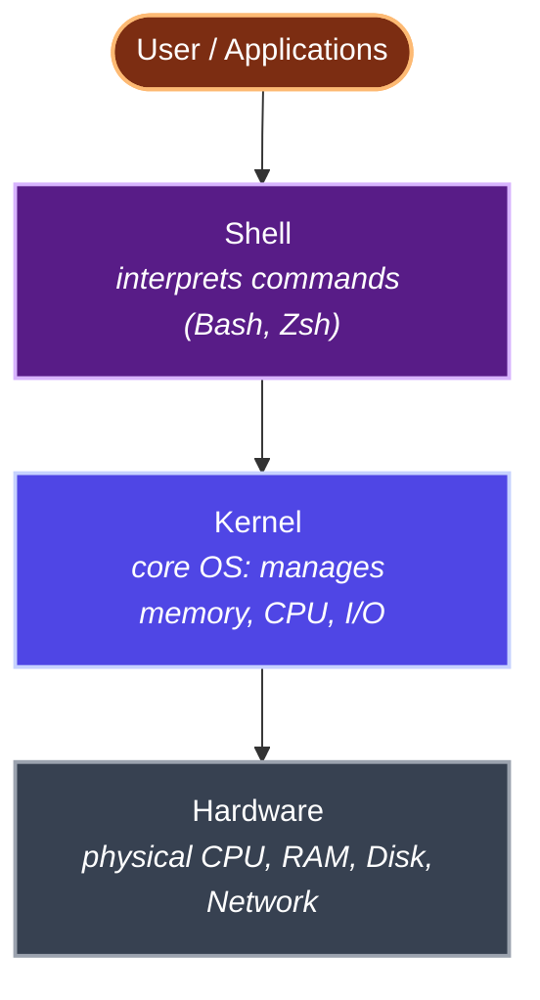
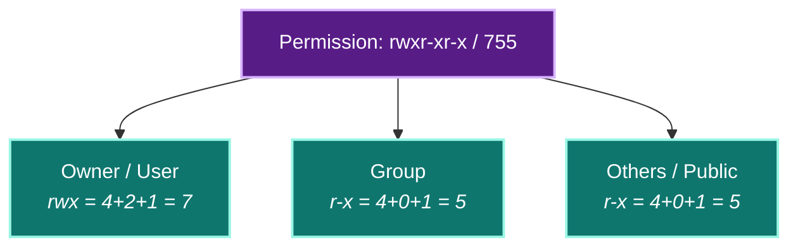
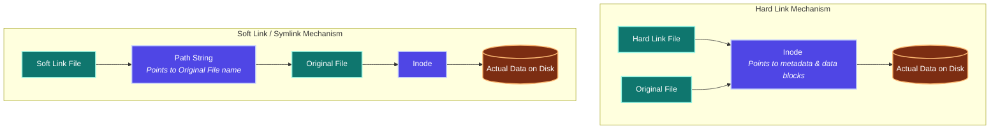
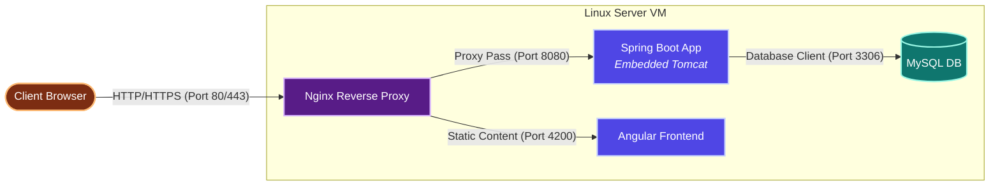

# Linux Commands: Comprehensive Interview & Revision Guide

> [!NOTE]
> **Extracted & Refactored from:** `Linux and Shell Scripting.txt`
> **Target Audience:** DevOps Engineers | System Administrators | Java Developers

---

## 1. Linux System Architecture

Linux follows a layered design to abstract hardware access from users and applications.



#### Key Takeaways
* Everything in Linux is managed through the Kernel-Hardware abstraction.
* The Shell interprets commands, acting as the interface between the User and the Kernel.

---

## 2. File & Directory Operations

| Command / Concept | Description | Real-Time Usage Scenario | Priority |
| :--- | :--- | :--- | :--- |
| `pwd` | Print current working directory | Verify deployment path before running scripts on EC2 | High (⭐⭐⭐) |
| `ls` | List files in current directory | Quick check of deployed JARs/configs on server | High (⭐⭐⭐) |
| `ls -l` | Long listing with permissions, owner, size, date | Verify file ownership and permissions after deployment | High (⭐⭐⭐) |
| `ls -lt` | List sorted by modification time (newest first) | Identify latest log files or recently deployed artifacts | Medium (⭐⭐) |
| `ls -ltr` | List sorted by time (oldest first) | Find oldest backup files for cleanup | Medium (⭐⭐) |
| `ls -lr` | List in reverse alphabetical order | Reverse sort for review | Low (⭐) |
| `ls -li` | List with inode numbers | Debug hard link / soft link issues | Low (⭐) |
| `cd <dir>` | Change directory | Navigate to `/var/log`, `/opt/app`, `/etc/nginx` on servers | High (⭐⭐⭐) |
| `cd ..` | Go up one directory level | Navigate between nested deployment directories | High (⭐⭐⭐) |
| `cd ~` | Go to home directory of current user | Return to user home after deep navigation | Medium (⭐⭐) |
| `mkdir <dir>` | Create a new directory | Create log directories, deployment folders on EC2 | High (⭐⭐⭐) |
| `rmdir <dir>` | Remove empty directory | Clean up empty temp directories | Low (⭐) |
| `rm <file>` | Delete a file | Remove old deployment artifacts and temp files | High (⭐⭐⭐) |
| `rm *.txt` | Delete all `.txt` files using wildcard | Bulk cleanup of log rotation files | Medium (⭐⭐) |
| `rm -rf <dir>` | Force delete directory and all contents (DANGEROUS) | Clean up failed deployments, old Docker volumes | High (⭐⭐⭐) |
| `touch <file>` | Create empty file or update timestamp | Create placeholder config files, lock files | High (⭐⭐⭐) |
| `cp <src> <dest>` | Copy file from source to destination | Backup config before editing: `cp nginx.conf nginx.conf.bak` | High (⭐⭐⭐) |
| `mv <old> <new>` | Move or rename file/directory | Rename releases: `mv app-v1.jar app-v2.jar`, move files between dirs | High (⭐⭐⭐) |

#### Key Takeaways
* `pwd` and `ls -l` are critical for verifying deployment directories and file attributes.
* `rm -rf` is extremely powerful and dangerous; always double-check target paths.

---

## 3. File Viewing & Inspection

| Command / Concept | Description | Real-Time Usage Scenario | Priority |
| :--- | :--- | :--- | :--- |
| `cat <file>` | Display entire file content | View small config files: `cat application.yml` | High (⭐⭐⭐) |
| `cat > <file>` | Create file and write from stdin (Ctrl+D to save) | Quick config file creation on fresh server | Medium (⭐⭐) |
| `cat >> <file>` | Append data to existing file | Add new entries to `/etc/hosts` or environment files | High (⭐⭐⭐) |
| `cat -n <file>` | Display file with line numbers | Reference specific lines when debugging config files | Medium (⭐⭐) |
| `cat f1 f2 > f3` | Merge multiple files into one | Combine split log files for analysis | Low (⭐) |
| `tac <file>` | Display file content in reverse (bottom to top) | View latest entries first in append-only logs | Low (⭐) |
| `rev <file>` | Reverse characters in each line | Rarely used, text manipulation edge cases | Low (⭐) |
| `head <file>` | Show first 10 lines of file | Quick peek at log file headers or config structure | High (⭐⭐⭐) |
| `head -n N <file>` | Show first N lines | View top N error entries: `head -n 20 error.log` | High (⭐⭐⭐) |
| `tail <file>` | Show last 10 lines of file | Check latest log entries for errors after deployment | High (⭐⭐⭐) |
| `tail -n N <file>` | Show last N lines | Review last N lines of `application.log` | High (⭐⭐⭐) |
| `tail -f <file>` | Follow file in real-time (live tail) | Monitor live app logs: `tail -f /var/log/app/spring.log` | High (⭐⭐⭐) |
| `wc <file>` | Count lines, words, bytes in file | Check log file size before transferring: `wc -l error.log` | Medium (⭐⭐) |
| `diff <f1> <f2>` | Compare two files line by line | Compare config files between environments (dev vs prod) | Medium (⭐⭐) |

#### Key Takeaways
* Use `tail -f` to monitor log outputs in real-time during application startup or runtime errors.
* Use `head` and `tail` with `-n N` to quickly check the boundary contents of large logs.

---

## 4. Advanced Text Processing (grep, sed, awk)

### Command Reference

| Command / Concept | Description | Real-Time Usage Scenario | Priority |
| :--- | :--- | :--- | :--- |
| `grep 'pattern' <file>` | Search for pattern in file (case sensitive) | Find errors: `grep 'Exception' app.log` | High (⭐⭐⭐) |
| `grep -i 'pattern' <file>` | Case-insensitive search | Search warnings: `grep -i 'warning' app.log` | High (⭐⭐⭐) |
| `grep -n 'pattern' <file>` | Search with line numbers | Locate exact line of error: `grep -n 'NullPointer' app.log` | High (⭐⭐⭐) |
| `grep -c 'pattern' <file>` | Count matching lines | Count exceptions: `grep -c 'Exception' error.log` | Medium (⭐⭐) |
| `grep -w 'word' <file>` | Match exact word only | Find "fail" but not "failed": `grep -w 'fail' results.txt` | Medium (⭐⭐) |
| `grep -i 'pattern' *` | Search across all files in directory | Search all logs for keyword: `grep -i 'OutOfMemory' *.log` | High (⭐⭐⭐) |
| `grep -r 'pattern' <dir>` | Recursive search in directories | Find config across nested dirs: `grep -r 'db.url' /opt/app/` | High (⭐⭐⭐) |
| `sed 's/old/new/' <file>` | Replace first occurrence per line (preview only) | Test replacement before saving | High (⭐⭐⭐) |
| `sed -i 's/old/new/' <file>` | Replace first occurrence per line (in-place edit) | Patch config: `sed -i 's/8080/9090/' application.yml` | High (⭐⭐⭐) |
| `sed -i 's/old/new/g' file` | Replace ALL occurrences (global, in-place) | Bulk find-replace across config files in CI/CD pipeline | High (⭐⭐⭐) |
| `sed -i '5d' <file>` | Delete 5th line in file | Remove unwanted header line from CSV data | Medium (⭐⭐) |
| `sed -i '$d' <file>` | Delete last line in file | Remove trailing empty line from config | Medium (⭐⭐) |
| `sed -i '/pattern/d' file` | Delete all lines matching pattern | Remove debug lines: `sed -i '/DEBUG/d' app.log` | Medium (⭐⭐) |
| `sed -n '2,4p' <file>` | Print only lines 2 to 4 | Extract specific config block from large file | Medium (⭐⭐) |
| `sed -i '5i\ text' <file>` | Insert text before line 5 | Add environment var before line in script | Low (⭐) |
| `sed -i '$a\ text' <file>` | Append text after last line | Add new config entry to end of file | Low (⭐) |
| `awk '{print $1,$4}' file` | Extract specific columns from structured text | Parse `access.log` (IP + status code) | High (⭐⭐⭐) |
| `awk '/pattern/{print}'` | Print lines matching pattern | Filter log entries by keyword | Medium (⭐⭐) |
| `awk '{print NR, $0}' file` | Print with line numbers | Add line numbers to CSV for debugging | Low (⭐) |

### 💡 Text Processing Examples

#### 1. Log Parsing with `grep`
Find all warnings and error lines in an application log ignoring case:
```bash
grep -iE "warning|error" application.log
```

#### 2. In-Place Config Patching with `sed`
Suppose you have a configuration file `application.properties`:
```properties
server.port=8080
spring.datasource.url=jdbc:mysql://localhost:3306/db
```
To change the port to `9090` in-place:
```bash
sed -i 's/server.port=8080/server.port=9090/g' application.properties
```

#### 3. Structured Data Extraction with `awk`
Suppose you have an access log `access.log` with the format:
`[IP Address] - - [Date] "Request" [Status Code] [Bytes Sent]`
```text
192.168.1.100 - - [09/Jun/2026:00:15:30 +0000] "GET /api/v1/users HTTP/1.1" 200 452
192.168.1.101 - - [09/Jun/2026:00:16:12 +0000] "POST /api/v1/login HTTP/1.1" 401 120
```
To extract only the IP address (column 1) and status code (column 9):
```bash
awk '{print $1, $9}' access.log
```
Output:
```text
192.168.1.100 200
192.168.1.101 401
```

#### Key Takeaways
* `grep` is the primary tool for locating exceptions or trace statements in logs.
* `sed -i` performs in-place replacements, which is essential for configuring parameters in CI/CD.
* `awk` excels at parsing column-oriented text, such as access logs and process lists.

---

## 5. Text Editors

| Tool | Mode | Key Functions | Real-Time Usage Scenario | Priority |
| :--- | :--- | :--- | :--- | :--- |
| `vi <file>` | Text Editor | `i` = Insert Mode<br>`Esc` = Command Mode<br>`:wq` = Save & Quit<br>`:q!` = Quit without saving | Edit config files on servers: `vi /etc/nginx/nginx.conf` | High (⭐⭐⭐) |

---

## 6. Find & Locate Utilities

| Command / Concept | Description | Real-Time Usage Scenario | Priority |
| :--- | :--- | :--- | :--- |
| `find /path -name "file"` | Search for file by name in directory tree | Find config: `find /opt -name "application.yml"` | High (⭐⭐⭐) |
| `find /path -type f -empty` | Find empty files | Cleanup empty placeholder files | Low (⭐) |
| `find /path -type d -empty` | Find empty directories | Cleanup empty directories after old deployments | Low (⭐) |
| `locate <file>` | Fast file lookup using pre-built database | Quickly locate file: `locate nginx.conf` (run `sudo updatedb` first) | Medium (⭐⭐) |

#### Key Takeaways
* `find` searches the directory tree in real time and is highly flexible (can search by type, size, modified time).
* `locate` is faster because it uses a pre-built database, but requires `updatedb` to be run for recent changes.

---

## 7. User & Group Management

| Command / Concept | Description | Real-Time Usage Scenario | Priority |
| :--- | :--- | :--- | :--- |
| `sudo useradd <user>` | Create new user account | Create service accounts for apps: `sudo useradd appuser` | High (⭐⭐⭐) |
| `sudo passwd <user>` | Set/change password for user | Reset password for team member on shared server | High (⭐⭐⭐) |
| `sudo userdel <user>` | Delete user account | Remove departed team member's access | Medium (⭐⭐) |
| `sudo userdel --remove <user>` | Delete user with home directory | Full cleanup of user data | Medium (⭐⭐) |
| `sudo usermod -l new old` | Rename user account | Rename user after name change | Low (⭐) |
| `sudo su <user>` | Switch to another user account | Switch to app service account for deployment | High (⭐⭐⭐) |
| `whoami` | Display current logged-in user name | Verify which user is running deployment scripts | High (⭐⭐⭐) |
| `id <user>` | Display user ID, group ID, and groups | Verify user group membership for permissions | Medium (⭐⭐) |
| `exit` | Exit current shell/user session | Return to original user after `su` | Medium (⭐⭐) |
| `sudo groupadd <group>` | Create new user group | Create groups for team access: `sudo groupadd devops-team` | Medium (⭐⭐) |
| `sudo usermod -aG grp user` | Add user to group | Add dev to docker group: `sudo usermod -aG docker devuser` | High (⭐⭐⭐) |
| `sudo gpasswd -d user grp` | Remove user from group | Revoke access when team member changes role | Low (⭐) |
| `sudo visudo` | Safely edit sudoers file | Grant sudo access to new DevOps team members | High (⭐⭐⭐) |

---

## 8. Service Management (systemctl)

| Command / Concept | Description | Real-Time Usage Scenario | Priority |
| :--- | :--- | :--- | :--- |
| `systemctl start <svc>` | Start a service | Start app: `sudo systemctl start docker` | High (⭐⭐⭐) |
| `systemctl stop <svc>` | Stop a service | Stop old version before deploying new | High (⭐⭐⭐) |
| `systemctl restart <svc>` | Restart a service | Restart after config change: `systemctl restart nginx` | High (⭐⭐⭐) |
| `systemctl status <svc>` | Check service status | Verify service running: `systemctl status jenkins` | High (⭐⭐⭐) |
| `systemctl enable <svc>` | Enable auto-start at boot | Ensure Docker starts on reboot: `systemctl enable docker` | High (⭐⭐⭐) |
| `systemctl disable <svc>` | Disable auto-start at boot | Disable unused services for security hardening | Medium (⭐⭐) |
| `systemctl reload <svc>` | Reload config without restart | Reload nginx after config update (zero downtime) | Medium (⭐⭐) |
| `systemctl list-units` | List all active services | Audit running services on server | Low (⭐) |
| `service <svc> start` | Legacy command to start service | Older systems: `service httpd start` | Low (⭐) |

#### Key Takeaways
* Switch users securely using `su - <user>` or run privileged operations using `sudo`.
* `systemctl` is the modern daemon manager; always use it to ensure services start automatically at boot.

---

## 9. File Permissions, Ownership & Links

### Permissions Breakdown

Permissions are divided into three scopes: **Owner (User)**, **Group**, and **Others (Public)**.



#### Numeric Permission Mapping

| Number | Permission | Symbol |
| :--- | :--- | :--- |
| **0** | No permission | `---` |
| **1** | Execute | `--x` |
| **2** | Write | `-w-` |
| **3** | Write + Execute | `-wx` |
| **4** | Read | `r--` |
| **5** | Read + Execute | `r-x` |
| **6** | Read + Write | `rw-` |
| **7** | Read + Write + Execute | `rwx` |

#### Linux File Types

| Symbol | Type | Example |
| :---: | :--- | :--- |
| `-` | Regular file | `-rw-r--r-- app.jar` |
| `d` | Directory | `drwxr-xr-x config/` |
| `l` | Symbolic link | `lrwxrwxrwx current -> v2` |

### Permission & Ownership Commands

| Command / Concept | Description | Real-Time Usage Scenario | Priority |
| :--- | :--- | :--- | :--- |
| `chmod u+x <file>` | Add execute permission for user (symbolic) | Make deployment script executable: `chmod u+x deploy.sh` | High (⭐⭐⭐) |
| `chmod 755 <file>` | `rwxr-xr-x` (owner: all, group/others: read/exec) | Standard permission for shell scripts | High (⭐⭐⭐) |
| `chmod 644 <file>` | `rw-r--r--` (default file permission) | Standard permission for config files | Medium (⭐⭐) |
| `chmod 400 <file>` | `r--------` (read-only for owner) | Secure SSH key: `chmod 400 mykey.pem` (AWS requirement) | High (⭐⭐⭐) |
| `chmod 777 <file>` | `rwxrwxrwx` (all permissions — AVOID in production!) | NEVER use on production servers — security risk | Low (⭐) |
| `chown user:group <file>` | Change file ownership | Fix ownership: `sudo chown appuser:appgroup app.jar` | High (⭐⭐⭐) |

---

## 10. Links (Hard Links vs. Soft/Symbolic Links)



### Concept Comparison

| Feature | Hard Link | Soft / Symbolic Link |
| :--- | :--- | :--- |
| **Inode** | Shares the same Inode number as the original | Gets a unique Inode number |
| **Deletion of Original** | Link remains valid; contents are still accessible | Link breaks (pointing to a non-existent path) |
| **Cross-Filesystem** | Cannot cross different filesystems | Can span across different filesystems |
| **Directory Linking** | Cannot link directories | Can link both files and directories |

### Link Commands

| Command / Concept | Description | Real-Time Usage Scenario | Priority |
| :--- | :--- | :--- | :--- |
| `ln <orig> <link>` | Create hard link | Create backup reference to important config | Low (⭐) |
| `ln -s <orig> <link>` | Create soft/symbolic link | Link current release: `ln -s /opt/app-v2.jar /opt/app/current.jar` | High (⭐⭐⭐) |

#### Key Takeaways
* Use `chmod 400` to secure SSH private keys, a strict requirement for AWS connectivity.
* Hard links point to the same underlying inode and share data; soft links are path shortcuts that break if the original is deleted.

---

## 11. Archiving & Compression

| Command / Concept | Description | Real-Time Usage Scenario | Priority |
| :--- | :--- | :--- | :--- |
| `zip <name> <files>` | Create zip archive | Archive logs: `zip backup-logs *.log` | Medium (⭐⭐) |
| `zip -sf <file.zip>` | Show contents of zip file | Verify archive contents before transfer | Low (⭐) |
| `unzip <file.zip>` | Extract zip archive | Unzip downloaded artifacts on server | Medium (⭐⭐) |
| `tar -cvf name.tar dir/` | Create tar archive | Archive application directory: `tar -cvf app-backup.tar /opt/app/` | High (⭐⭐⭐) |
| `tar -xvf name.tar` | Extract tar archive | Extract deployment bundle on target server | High (⭐⭐⭐) |
| `tar -czvf name.tar.gz dir/` | Create compressed tar.gz archive | Compress and transfer logs between servers | High (⭐⭐⭐) |

#### Key Takeaways
* `tar -czvf` is the industry standard for compressing entire directories on Linux.
* `zip` and `unzip` are useful for cross-platform compatibility with Windows systems.

---

## 12. Networking & Package Management

### Networking Utilities

| Command / Concept | Description | Real-Time Usage Scenario | Priority |
| :--- | :--- | :--- | :--- |
| `ping <host>` | Check network connectivity to host | Verify connectivity: `ping db-server.internal` | High (⭐⭐⭐) |
| `curl <url>` | Send HTTP request and display response | Test API endpoints: `curl http://localhost:8080/actuator/health` | High (⭐⭐⭐) |
| `wget <url>` | Download file from internet | Download JDK: `wget https://download.oracle.com/java17.tar.gz` | High (⭐⭐⭐) |
| `netstat` | Display network connections and listening ports | Check port 8080: `netstat -tlnp | grep 8080` | High (⭐⭐⭐) |

### Package Manager Mapping

| OS Family / Distro | Package Manager | Common Usage Context |
| :--- | :--- | :--- |
| **Ubuntu / Debian** | `apt` (Advanced Package Tool) | Default for Ubuntu cloud VMs on AWS/GCP |
| **Amazon Linux / RHEL** | `yum` (Yellowdog Updater Modified) | Default on Amazon Linux AMI / older RHEL VMs |
| **CentOS / Red Hat** | `yum` or `dnf` | `dnf` is the modern replacement for `yum` in RHEL 8+ |
| **Fedora** | `dnf` (Dandified YUM) | Faster dependency resolution |

### Package Commands

| Command / Concept | Description | Real-Time Usage Scenario | Priority |
| :--- | :--- | :--- | :--- |
| `sudo yum install <pkg>` | Install package on RHEL/CentOS/Amazon Linux | Primary installer on Amazon EC2 instances | High (⭐⭐⭐) |
| `sudo apt install <pkg>` | Install package on Ubuntu/Debian | Primary installer on Ubuntu cloud VMs | High (⭐⭐⭐) |
| `sudo dnf install <pkg>` | Install package on newer RHEL/Fedora | Modern alternative: `sudo dnf install maven` | Medium (⭐⭐) |
| `sudo yum update -y` | Update all packages (RHEL family) | Regular security patching on production servers | High (⭐⭐⭐) |
| `sudo apt update` | Refresh package index (Ubuntu) | Always run before `apt install` to sync indices | High (⭐⭐⭐) |
| `sudo apt upgrade -y` | Upgrade all installed packages (Ubuntu) | Security patching on Ubuntu servers | High (⭐⭐⭐) |
| `sudo yum remove <pkg>` | Uninstall a package (RHEL family) | Remove unwanted software for server hardening | Medium (⭐⭐) |
| `sudo apt remove <pkg>` | Uninstall a package (Ubuntu) | Clean up unused services | Medium (⭐⭐) |
| `yum list installed` | List all installed packages (RHEL) | Audit installed software on server | Medium (⭐⭐) |
| `dpkg -l` | List all installed packages (Ubuntu/Debian) | Audit installed packages for compliance | Medium (⭐⭐) |
| `yum search <keyword>` | Search for available packages by name | Find correct Java package: `yum search java` | Low (⭐) |
| `apt search <keyword>` | Search for packages on Ubuntu | Find nginx version: `apt search nginx` | Low (⭐) |
| `rpm -qa` | List all installed RPM packages (low-level, RHEL) | Quick audit: `rpm -qa | grep java` | Low (⭐) |

#### Key Takeaways
* Use `netstat -tlnp` to debug port conflicts (e.g. if Spring Boot port 8080 is already bound).
* Always run `sudo apt update` before `sudo apt install` on Ubuntu to get the latest indices.

---

## 13. Process & System Monitoring

| Command / Concept | Description | Real-Time Usage Scenario | Priority |
| :--- | :--- | :--- | :--- |
| `ps aux` | List all running processes | Find Java process: `ps aux | grep java` | High (⭐⭐⭐) |
| `top` | Real-time process monitor (CPU, memory) | Monitor server load during deployment or load testing | High (⭐⭐⭐) |
| `kill <PID>` | Terminate process by PID | Kill stuck Java process: `sudo kill 12345` | High (⭐⭐⭐) |
| `free` | Display memory usage (RAM + swap) | Check available memory before deploying new service | Medium (⭐⭐) |
| `uname -r` | Show kernel version | Verify kernel compatibility for Docker/container runtime | Medium (⭐⭐) |
| `cat /etc/os-release` | Show OS distribution and version | Identify OS for package manager compatibility | Medium (⭐⭐) |
| `history` | Show command history | Review what was done on server for audit/troubleshooting | Medium (⭐⭐) |

---

## 14. SSH & System Configuration

| Command / Concept | Description | Real-Time Usage Scenario | Priority |
| :--- | :--- | :--- | :--- |
| `cat /etc/ssh/sshd_config` | View SSH server configuration | Verify PasswordAuthentication setting for security | Medium (⭐⭐) |
| `sudo vi /etc/hostname` | Change hostname permanently | Set meaningful hostname for server identification | Low (⭐) |
| `cat /etc/passwd` | Display all user accounts | Audit user accounts on shared server | Medium (⭐⭐) |
| `cat /etc/sudoers` | View sudoers file (who has root access) | Security audit: verify who has sudo privileges | Medium (⭐⭐) |
| `man <command>` | Display manual page for a command | Learn command options: `man grep` | Medium (⭐⭐) |

#### Key Takeaways
* Monitor memory with `free -m` and CPU threads using `top` to prevent application Out-Of-Memory (OOM) errors.
* Sudo configuration should always be edited safely via `sudo visudo` to prevent locking out the admin user.

---

## 15. DevOps Software Installation Cheat Sheet

### 1. Git
* **Amazon Linux / RHEL:**
  ```bash
  sudo yum install git -y
  ```
* **Ubuntu / Debian:**
  ```bash
  sudo apt install git -y
  ```
* **Verify:**
  ```bash
  git --version
  ```

### 2. Java Development Kit (JDK 17)
* **Amazon Linux:**
  ```bash
  sudo yum install java-17-amazon-corretto-devel -y
  ```
* **Ubuntu / Debian:**
  ```bash
  sudo apt install openjdk-17-jdk -y
  ```
* **RHEL / CentOS:**
  ```bash
  sudo yum install java-17-openjdk-devel -y
  ```
* **Verify:**
  ```bash
  java -version
  ```
* **Set Environment Variables:**
  Add the following lines to your persistent config (e.g., `~/.bashrc`):
  ```bash
  export JAVA_HOME=/usr/lib/jvm/java-17
  echo 'export JAVA_HOME=/usr/lib/jvm/java-17' >> ~/.bashrc
  source ~/.bashrc
  ```

### 3. Apache Maven
* **Amazon Linux / RHEL / CentOS:**
  ```bash
  sudo dnf install maven -y
  # Fallback: sudo yum install maven -y
  ```
* **Ubuntu / Debian:**
  ```bash
  sudo apt install maven -y
  ```
* **Verify:**
  ```bash
  mvn -version
  ```
* **Set Environment Variables:**
  ```bash
  export M2_HOME=/usr/share/maven
  echo 'export M2_HOME=/usr/share/maven' >> ~/.bashrc
  source ~/.bashrc
  ```

### 4. Docker Engine
* **Amazon Linux 2023:**
  ```bash
  sudo yum install docker -y
  sudo systemctl start docker
  sudo systemctl enable docker
  sudo usermod -aG docker ec2-user  # Allows running docker commands without sudo
  ```
* **Ubuntu:**
  ```bash
  sudo apt update
  sudo apt install docker.io -y
  sudo systemctl start docker && sudo systemctl enable docker
  sudo usermod -aG docker $USER
  ```
* **Verify:**
  ```bash
  docker --version
  docker run hello-world
  ```

### 5. Jenkins CI/CD Server
* **Amazon Linux / RHEL:**
  ```bash
  sudo wget -O /etc/yum.repos.d/jenkins.repo https://pkg.jenkins.io/redhat-stable/jenkins.repo
  sudo rpm --import https://pkg.jenkins.io/redhat-stable/jenkins.io-2023.key
  sudo yum install jenkins -y
  sudo systemctl start jenkins
  sudo systemctl enable jenkins
  ```
* **Access Configuration:**
  - URL: `http://<server-ip>:8080` (ensure Port 8080 is open in AWS security groups)
  - Initial Administrator Password:
    ```bash
    sudo cat /var/lib/jenkins/secrets/initialAdminPassword
    ```

### 6. Node.js
* **Amazon Linux (via Node Version Manager):**
  ```bash
  curl -o- https://raw.githubusercontent.com/nvm-sh/nvm/v0.39.5/install.sh | bash
  source ~/.bash_profile
  nvm install 18
  ```
* **Ubuntu:**
  ```bash
  sudo apt install nodejs npm -y
  ```
* **Verify:**
  ```bash
  node -v && npm -v
  ```

### 7. Kubernetes CLI (kubectl)
* **Any Linux Distribution:**
  ```bash
  curl -LO "https://dl.k8s.io/release/$(curl -L -s https://dl.k8s.io/release/stable.txt)/bin/linux/amd64/kubectl"
  chmod +x kubectl
  sudo mv kubectl /usr/local/bin/
  ```
* **Verify:**
  ```bash
  kubectl version --client
  ```

### 8. HashiCorp Terraform
* **Amazon Linux / RHEL:**
  ```bash
  sudo yum install -y yum-utils
  sudo yum-config-manager --add-repo https://rpm.releases.hashicorp.com/RHEL/hashicorp.repo
  sudo yum install terraform -y
  ```
* **Verify:**
  ```bash
  terraform -version
  ```

---

## 16. Web Servers in Linux

Web servers run software hosting applications and resources, serving user requests over the network via HTTP/HTTPS.

### Apache HTTP Daemon (httpd)

Apache HTTPD is a highly customizable, process-based web server.

* **Installation:**
  - Amazon Linux / RHEL: `sudo yum install httpd -y`
  - Ubuntu / Debian: `sudo apt install apache2 -y`
* **Service Lifecycle:**
  - Start: `sudo systemctl start httpd`
  - Auto-start at Boot: `sudo systemctl enable httpd`
  - Check Status: `sudo systemctl status httpd`
  - Apply config changes without dropping connections: `sudo systemctl reload httpd`
* **Configuration & Paths:**
  - Default Port: `80` (HTTP), `443` (HTTPS)
  - Document Root directory: `/var/www/html/` (place static index.html here)
  - Configuration File: `/etc/httpd/conf/httpd.conf` (RHEL), `/etc/apache2/apache2.conf` (Ubuntu)
  - Access Logs: `/var/log/httpd/access_log` (or `access.log` on Ubuntu)
  - Error Logs: `/var/log/httpd/error_log` (or `error.log` on Ubuntu)

#### Quick Setup Flow
1. Install Apache: `sudo yum install httpd -y`
2. Start and enable Apache: `sudo systemctl start httpd && sudo systemctl enable httpd`
3. Update AWS Security Group (Add Inbound Rule for Port 80 / HTTP).
4. Create an index page: `echo "Hello World" | sudo tee /var/www/html/index.html`
5. Test live website via the EC2 Public IP: `http://<EC2-Public-IP>`

---

### Nginx (Engine X)

Nginx uses an asynchronous, event-driven loop, making it lightweight and highly performant as a web server, reverse proxy, or load balancer.

* **Installation:**
  - Amazon Linux: `sudo yum install nginx -y`
  - Ubuntu: `sudo apt install nginx -y`
* **Service Lifecycle:**
  - Start & Enable: `sudo systemctl start nginx && sudo systemctl enable nginx`
* **Configuration Paths:**
  - Configuration File: `/etc/nginx/nginx.conf`
  - Document Root: `/usr/share/nginx/html/` (default)
  - Configuration Syntax Test: `sudo nginx -t` (run this BEFORE restarting Nginx)

#### Nginx as a Reverse Proxy for Spring Boot
To route external traffic from Port 80 to a Spring Boot service listening on Port 8080:

1. Create a custom server block configuration file at `/etc/nginx/conf.d/spring-app.conf`:
   ```nginx
   server {
       listen 80;
       server_name myapp.com;

       location / {
           proxy_pass http://localhost:8080;
           proxy_set_header Host $host;
           proxy_set_header X-Real-IP $remote_addr;
           proxy_set_header X-Forwarded-For $proxy_add_x_forwarded_for;
       }
   }
   ```
2. Test validation and apply reload:
   ```bash
   sudo nginx -t && sudo systemctl reload nginx
   ```

---

### Apache Tomcat (Servlet Container)

Tomcat is a dedicated Java application server hosting Java Web Applications (WAR files).

* **Manual Installation:**
  ```bash
  wget https://downloads.apache.org/tomcat/tomcat-9/v9.0.89/bin/apache-tomcat-9.0.89.tar.gz
  tar -xzvf apache-tomcat-9.0.89.tar.gz
  cd apache-tomcat-9.0.89/bin
  ```
* **Tomcat Lifecycle:**
  - Start Tomcat: `./startup.sh` (defaults to port `8080`)
  - Stop Tomcat: `./shutdown.sh`
* **Deployment:**
  - Copy `.war` files to the `webapps/` directory. Tomcat auto-extracts and deploys them on startup.

---

### Web Server Comparison

| Metric | Apache HTTPD | Nginx | Apache Tomcat |
| :--- | :--- | :--- | :--- |
| **Architecture** | Process/Thread-based | Event-driven, non-blocking | Thread-pool for Java Servlets |
| **Primary Use Case** | Multi-purpose server | Reverse Proxy, Load Balancer, Static Assets | Java Web Apps (Servlets / JSP / Spring Boot WARs) |
| **Performance** | Resource-heavy under load | Extremely lightweight, fast concurrent connections | Medium (Optimized specifically for JVM tasks) |
| **Dynamic Content** | Yes (Built-in modules) | No (Delegates to app backends) | Yes (Executes Java classes natively) |

---

### Real-Time Application Deployment Architecture

A classic production standard for deploying enterprise Java Full Stack projects:



#### AWS Security Group Port Access Rules

| Port | Protocol / Service | Destination Context |
| :---: | :--- | :--- |
| **22** | SSH | Remote server management / CLI access |
| **80** | HTTP | General web traffic (Nginx/Apache proxy) |
| **443** | HTTPS | Secured web traffic with SSL/TLS configurations |
| **8080** | HTTP-ALT | Default Spring Boot / Standalone Tomcat listener |
| **8443** | HTTPS-ALT | Secure JVM SSL configuration |
| **3306** | MySQL | Relational database access |
| **5432** | PostgreSQL | Enterprise relational database access |
| **27017** | MongoDB | Document database access |
| **6379** | Redis | Cache database access |
| **9092** | Kafka | Distributed event streaming broker |
| **9090** | SonarQube | Source code inspection metrics server |

#### Key Takeaways
* Nginx is highly efficient and serves as the preferred reverse proxy/load balancer in microservices architecture.
* Tomcat is a dedicated servlet container for deploying WAR files, whereas Apache HTTPD is a general-purpose web server.

---

## 17. Final Summary & Key Takeaways

### Top 10 DevOps Commands for Rapid Troubleshoot
1. `grep` — Log searching, error finding, pattern matching.
2. `tail -f` — Live monitoring of application logs.
3. `chmod` — Securing files, making scripts executable.
4. `systemctl` — Managing system services (Docker, Jenkins, Nginx).
5. `find` — Locating config files and deployment artifacts.
6. `sed` — In-place configuration file edits in CI/CD pipelines.
7. `curl` — Testing API health endpoints and internal REST services.
8. `ps aux` / `kill` — Process monitoring, thread management, and troubleshooting.
9. `tar` / `zip` — Compressing/archiving log files and deployment packages.
10. `usermod` — Granting user execution groups (e.g., adding user to docker group).

### Fundamental Linux Concepts
1. **Linux is the OS of choice** for modern servers, cloud infrastructures, and DevOps automation tooling.
2. **Everything in Linux is represented as a file** (regular files, directories, device files, link files).
3. **Strict permissions (`chmod`) and ownership (`chown`) rules** represent the fundamental layer of Linux security hardening.
4. **The Text Power Trio:** Combine `grep`, `sed`, and `awk` to parse, filter, and write complex configs and log files.
5. `systemctl` represents the modern systemd tool to interact with host-level services, deprecating the older `service` system.
6. **Hard links share the same Inode** (meaning data remains if original filename is deleted), whereas **Soft links are path-bound pointers** that break upon deleting the target source.
7. **Production standard:** Route port 80/443 (HTTP/S) through Nginx to forward traffic internally to Spring Boot (port 8080), optimizing performance and safety.

---
## END OF LINUX COMMANDS ANALYSIS
