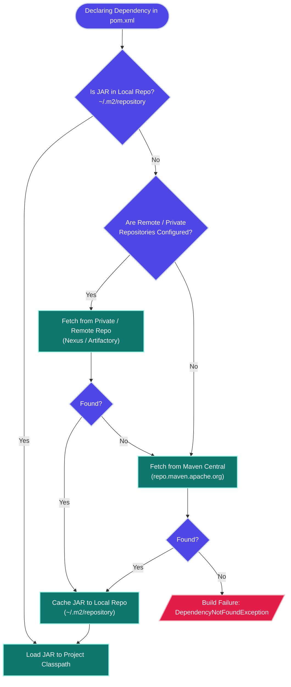
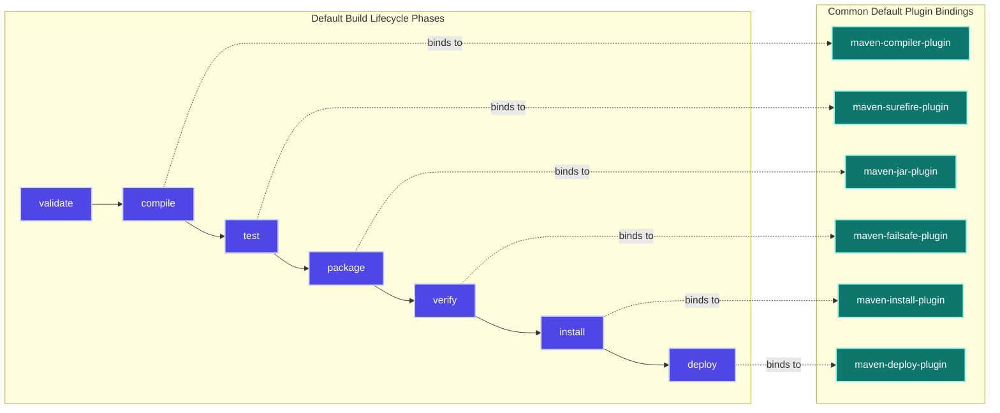
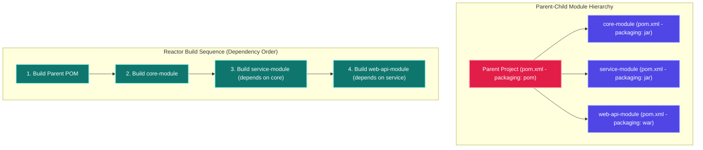

# MAVEN - COMPREHENSIVE TECHNICAL ANALYSIS & MASTER STUDY GUIDE
> *Interview Preparation | 7+ Years Java Full Stack · Structured Technical Documentation*

---

## SECTION 1: OVERVIEW & EVOLUTION OF BUILD TOOLS

Apache Maven is a declarative software project management and build automation tool primarily used for Java applications. Operating on the core philosophy of **"Convention over Configuration"**, Maven standardizes the build lifecycle, project structure, and dependency resolution processes.

Instead of writing custom scripts to handle compilation, resource copying, testing, and packaging, developers declare project properties, dependencies, and plugin requirements in a structured XML file (`pom.xml`). Maven takes care of the rest by automatically downloading resources, validating configurations, and executing the steps in a predefined sequence.

### The Build Tool Evolution Spectrum

The evolution of build tools reflects a progression from manual, error-prone workflows to procedural scripting, declarative management, and modern DSL-based build environments:

| Build System / Tool | Configuration Format | Dependency Management | Extensibility & Customization | Build Speed & Performance | Primary Limitations / Drawbacks |
| :--- | :--- | :--- | :--- | :--- | :--- |
| **Manual Builds** | None | Manual JAR downloading and copying to a local `lib/` classpath directory. | Extremely low; commands must be typed manually on terminal windows. | Highly inefficient; slow, non-repeatable, and prone to developer mistakes. | Highly repetitive, platform-dependent classpath paths, scales poorly. |
| **Batch / Shell Scripts** | `.bat` or `.sh` script files | Manual downloading; script automates copies to classpath. | Low; requires scripting conditional statements per OS platform. | Fast for small setups; slow if scripting network requests. | Lack of portability (OS-dependent), no standard structure, hard to debug. |
| **Apache Ant** | XML (Procedural syntax) | No native dependency resolution (requires Apache Ivy plugin integration). | High; allows arbitrary target definitions but requires manual XML scripting. | Fast execution once XML configuration is parsed and loaded. | Highly verbose XML, lacks a standard directory layout, hard to reuse build logic. |
| **Apache Maven** | XML (Declarative syntax) | Fully automated transitively from Local, Central, and Remote repositories. | High; extensible via standard build plugins and goal-binding. | Moderate; requires dependency analysis and initialization overhead. | Highly verbose XML structure; rigid conventions make non-standard layouts difficult. |
| **Gradle** | Groovy or Kotlin DSL | Automated transitive resolution compatible with Maven repositories. | Extremely high; build logic can be dynamically written in clean code. | Very fast; leverages background daemons, incremental compilation, and cache. | Steeper learning curve; dynamic build scripts can become complex to maintain. |

#### Key Takeaways
- **Convention over Configuration**: Maven defines standard project layouts and lifecycles so developers do not need to configure them manually.
- **Transitive Resolution**: Maven automates library lookup and download, including resolving nesting dependency paths automatically.
- **Tool Evolution**: Maven moved the Java ecosystem away from procedural scripting (Ant) toward declarative metadata (POM).

---

## SECTION 2: CORE CONCEPTS IN MAVEN

To understand Maven, you must master the fundamental building blocks that coordinate the build lifecycle and manage project health:

| # | Core Concept | Technical Description | Priority / Relevance |
| :--- | :--- | :--- | :--- |
| **1** | **POM (`pom.xml`)** | *Project Object Model*. The central XML configuration file containing metadata, dependencies, plugins, profiles, and properties. | ⭐⭐⭐⭐⭐ |
| **2** | **GAV Coordinates** | *GroupId + ArtifactId + Version*. The unique coordinates that identify a specific Maven artifact in any repository. | ⭐⭐⭐⭐⭐ |
| **3** | **Dependencies** | External libraries required by the project to compile, test, or run. Declared inside `<dependencies>`. | ⭐⭐⭐⭐⭐ |
| **4** | **Repositories** | The directories (local, central, remote) where Maven retrieves and caches library dependencies. | ⭐⭐⭐⭐ |
| **5** | **Build Lifecycle** | A sequence of named execution phases (e.g., `compile`, `test`, `package`) that define the order of operations. | ⭐⭐⭐⭐⭐ |
| **6** | **Plugins** | Executable modules that perform actual build tasks. Bound to specific lifecycle phases to perform compiler or testing tasks. | ⭐⭐⭐⭐ |
| **7** | **Archetypes** | Reusable project templates containing standard directory structures and base configurations. | ⭐⭐⭐⭐ |
| **8** | **POM Inheritance** | Mechanism where child POMs inherit configurations, properties, and dependencies from a parent POM. | ⭐⭐⭐⭐ |
| **9** | **Transitive Dependencies** | Automatically resolving libraries required by your direct dependencies, eliminating manual JAR hunting. | ⭐⭐⭐⭐⭐ |
| **10** | **Profiles** | Custom configuration blocks activated dynamically to compile code for different environments (e.g., dev, test, prod). | ⭐⭐⭐ |
| **11** | **Super POM** | The absolute parent POM built into the Maven installation. All project POMs implicitly inherit its defaults. | ⭐⭐⭐⭐ |
| **12** | **BOM (Bill of Materials)** | A POM file that declares a curated list of dependency versions to align libraries across microservices. | ⭐⭐⭐⭐⭐ |
| **13** | **Resource Filtering** | Replacing placeholders (e.g., `${db.url}`) in configuration files during the packaging process. | ⭐⭐⭐⭐ |
| **14** | **Dependency Scopes** | Configuration determining where a JAR is placed on the classpath (e.g., `compile`, `test`, `provided`). | ⭐⭐⭐⭐⭐ |

#### Key Takeaways
- **GAV is Unique**: The combination of `groupId`, `artifactId`, and `version` guarantees that an artifact can be uniquely identified and retrieved.
- **Extensible via Plugins**: Maven is essentially a plugin-execution engine; phases are empty shells until plugins bind to them.
- **Inheritance vs Composition**: Reuse build config via parent POM inheritance, or use a BOM (Bill of Materials) for library versions.

---

## SECTION 3: MAVEN REPOSITORIES & RESOLUTION LIFE CYCLE

Maven manages dependencies by downloading them from registries and caching them locally. The environment utilizes three repository types:

1. **Local Repository**:
   - Located on the developer's local machine (Default path: `~/.m2/repository`).
   - Caches previously downloaded remote dependencies to prevent redundant network lookups.
   - Hosts local builds installed using `mvn install`.
2. **Central Repository**:
   - The default remote registry hosted by the Apache Maven community (`https://repo.maven.apache.org/maven2`).
   - Contains millions of verified, open-source libraries.
3. **Remote / Private Repository**:
   - Custom repositories hosted by organizations (e.g., Sonatype Nexus, JFrog Artifactory, or AWS CodeArtifact).
   - Used for hosting private business libraries and proxying public libraries inside corporate firewalls.

### Dependency Resolution Sequence Flow

When a project references an artifact, Maven executes the following sequence to locate the file:



### Enterprise Repository & Credential Configuration

Rather than exposing server URLs and private access tokens inside public `pom.xml` configurations, standard enterprise setups declare repositories in the `pom.xml` and secure access credentials inside the developer's machine-specific `settings.xml` file.

#### Global Config: `~/.m2/settings.xml`
```xml
<settings xmlns="http://maven.apache.org/SETTINGS/1.0.0"
          xmlns:xsi="http://www.w3.org/2001/XMLSchema-instance"
          xsi:schemaLocation="http://maven.apache.org/SETTINGS/1.0.0 
                              https://maven.apache.org/xsd/settings-1.0.0.xsd">
  
  <servers>
    <server>
      <id>company-private-repo</id>
      <username>deployment_user</username>
      <password>{encrypted_master_password}</password>
    </server>
  </servers>

  <mirrors>
    <mirror>
      <id>internal-repository-proxy</id>
      <mirrorOf>*</mirrorOf>
      <name>Internal Enterprise Proxy Repository</name>
      <url>https://nexus.mycompany.com/repository/maven-public/</url>
    </mirror>
  </mirrors>
</settings>
```

#### Project Config: `pom.xml`
```xml
<project>
  <!-- ... GAV Coordinates ... -->
  <repositories>
    <repository>
      <id>company-private-repo</id>
      <url>https://nexus.mycompany.com/repository/maven-releases/</url>
      <releases>
        <enabled>true</enabled>
      </releases>
      <snapshots>
        <enabled>false</enabled>
      </snapshots>
    </repository>
  </repositories>
</project>
```

#### Key Takeaways
- **Settings Isolation**: Never commit security credentials inside `pom.xml` files; always configure authentication inside the local user's `settings.xml`.
- **Mirroring**: A mirror overrides the default repositories and redirects all downloads to a central enterprise cache, optimizing proxying.
- **Resolution Order**: Local Cache -> Private Repositories -> Maven Central.

---

## SECTION 4: MAVEN BUILD LIFECYCLES & PHASES

Maven defines three distinct build lifecycles. Running a specific phase automatically executes **every preceding phase** within that lifecycle.

### The Three Built-in Lifecycles

1. **Clean Lifecycle**: Prepares the project workspace for a fresh build.
   - Phases: `pre-clean` -> `clean` (deletes the `target/` directory) -> `post-clean`
2. **Default (Build) Lifecycle**: Compiles, validates, tests, packages, and deploys the application code.
   - Key Phases: `validate` -> `compile` -> `test` -> `package` -> `verify` -> `install` -> `deploy`
3. **Site Lifecycle**: Generates HTML documentation pages and reporting sites for the project.
   - Phases: `pre-site` -> `site` -> `post-site` -> `site-deploy`

### Default Build Lifecycle Phases and Plugin Bindings

The default lifecycle is a pipeline of sequential phases. Each phase relies on a bound plugin goal to execute its technical steps:



### Detailed Breakdown of Key Phases

| Phase Name | Lifecycle | Bound Default Plugin Goal | Operational Description |
| :--- | :--- | :--- | :--- |
| **validate** | Default | None (Built-in validation) | Verifies that project information is correct and all required dependencies are available. |
| **compile** | Default | `compiler:compile` | Compiles Java source files located in `src/main/java` to output `.class` files in `target/classes`. |
| **test** | Default | `surefire:test` | Executes unit tests located in `src/test/java` using frameworks like JUnit or Mockito. |
| **package** | Default | `jar:jar` or `war:war` | Bundles the compiled code into its distributable format (e.g., JAR, WAR, or EAR). |
| **verify** | Default | `failsafe:integration-test` | Runs integration tests to confirm the packaged binary meets quality requirements. |
| **install** | Default | `install:install` | Installs the generated package into the Local Repository (`~/.m2/repository`) for local consumption. |
| **deploy** | Default | `deploy:deploy` | Copies the final package to a remote repository (e.g., Nexus or Artifactory) to share with team members. |

#### Key Takeaways
- **Phase Ordering**: If you execute `mvn install`, Maven will execute `validate`, `compile`, `test`, `package`, `verify`, and `install` in that exact sequence.
- **Goal Autonomy**: You can execute standalone plugin goals directly using the syntax `mvn plugin-prefix:goal` (e.g., `mvn dependency:tree`).
- **Target Cleanliness**: Always execute `mvn clean` before compiling a production package to avoid cached classes corrupting builds.

---

## SECTION 5: MAVEN COMMANDS REFERENCE & ADVANCED FLAGS

In professional development and CI/CD pipelines, Maven is controlled through command-line executions.

### Common Maven Commands

| CLI Command | Lifecycle Focus | Target Operation |
| :--- | :--- | :--- |
| `mvn clean` | Clean | Deletes the `target/` directory containing all previous build artifacts. |
| `mvn compile` | Default | Compiles production source code into the `target/classes` folder. |
| `mvn test` | Default | Compiles test source files and executes unit tests. |
| `mvn package` | Default | Compiles, tests, and packs the code into a JAR/WAR file inside the `target/` folder. |
| `mvn verify` | Default | Runs integration tests and checks quality metrics (e.g., Checkstyle, Jacoco). |
| `mvn install` | Default | Installs the compiled package to the local developer cache (`~/.m2/repository`). |
| `mvn deploy` | Default | Builds and uploads the final artifact to the configured remote artifact manager. |
| `mvn clean install` | Clean + Default | Cleans the target folder, runs a complete build process, and installs it locally. |
| `mvn dependency:tree` | Diagnostics | Prints a hierarchical tree of all resolved direct and transitive dependencies. |
| `mvn dependency:analyze` | Diagnostics | Identifies used-but-undeclared and declared-but-unused dependencies. |
| `mvn exec:java` | Plugins | Runs a specified Java class directly within the Maven classpath environment. |

### Advanced CLI Flags & Options

- **`-DskipTests`**: Compiles both source and test classes, but skips executing the test suite.
  ```bash
  mvn clean package -DskipTests
  ```
- **`-Dmaven.test.skip=true`**: Skips compiling tests and skips executing tests entirely (reduces package times but hides test syntax errors).
  ```bash
  mvn clean package -Dmaven.test.skip=true
  ```
- **`-U` (Force Update)**: Forces Maven to check remote repositories for updated SNAPSHOT and release libraries.
  ```bash
  mvn clean compile -U
  ```
- **`-B` / `--batch-mode`**: Disables interactive input prompts. Recommended for execution inside CI/CD runners (GitHub Actions, Jenkins).
  ```bash
  mvn clean deploy -B
  ```
- **`-pl` / `--projects`**: Instructs Maven to build only the specified sub-module.
  ```bash
  mvn clean package -pl core-module
  ```
- **`-am` / `--also-make`**: Used alongside `-pl` to build the specified module and all the dependencies it requires.
  ```bash
  mvn clean install -pl web-api-module -am
  ```
- **`-T` (Thread Control)**: Configures parallel compilation to utilize multiple CPU cores.
  ```bash
  mvn clean install -T 1C   # Allocates 1 execution thread per available CPU core
  mvn clean install -T 4    # Force allocates 4 parallel processing threads
  ```

### Programmatic Project Initialization
Generate a new Java project template directly from the CLI:
```bash
mvn archetype:generate \
  -DgroupId=com.mycompany.app \
  -DartifactId=my-maven-app \
  -DarchetypeArtifactId=maven-archetype-quickstart \
  -Dpackage=com.mycompany.app \
  -Dversion=1.0.0-SNAPSHOT \
  -DinteractiveMode=false
```

#### Key Takeaways
- **Surefire Control**: Prefer `-DskipTests` over `-Dmaven.test.skip=true` because compile checks on test sources prevent API drift bugs.
- **CI Pipelines**: Always include `-B` in CI pipelines to prevent runners from hanging when wait prompts occur.
- **Multithreading**: Using `-T` can cut packaging times in half for larger, modular codebases.

---

## SECTION 6: STANDARD DIRECTORY LAYOUT

Maven enforces a strict **Standard Directory Layout**. This consistency ensures any developer can navigate any Maven project immediately:

```text
my-project/
├── pom.xml                                 # Central Project Object Model configuration
├── src/
│   ├── main/                               # Production source code files
│   │   ├── java/                           # Java source files (*.java)
│   │   ├── resources/                      # Configuration files, properties, database schema XMLs
│   │   ├── filters/                        # Resource filter property files for build replacement
│   │   └── webapp/                         # Web applications directories (WEB-INF, index.jsp)
│   ├── test/                               # Testing code and suites
│   │   ├── java/                           # Test cases (JUnit, Mockito source files)
│   │   ├── resources/                      # Configurations, mocks, and properties used during test phases
│   │   └── filters/                        # Resource filter files applied specifically to test configurations
│   └── assembly/                           # Custom assembly descriptors for deployment packaging
└── target/                                 # Build output directory (Created dynamically)
    ├── classes/                            # Compiled class files
    ├── test-classes/                       # Compiled test class files
    ├── surefire-reports/                   # Test execution logs and XML/HTML reports
    └── my-project-1.0.0.jar                # Final packaged binary (Created during package phase)
```

#### Key Takeaways
- **No Classpath Guessing**: Build processes expect files in these precise paths. Deviating requires overriding directory configs in `pom.xml`.
- **Packaging Isolation**: The `target` folder is ephemeral; running `mvn clean` safe-deletes it completely.

---

## SECTION 7: ANNOTATED PRODUCTION-GRADE `POM.XML`

Here is a structured, production-ready `pom.xml` configured for a Spring Boot application, containing properties, exclusions, plugin bindings, resource filtering, and active profiles:

```xml
<?xml version="1.0" encoding="UTF-8"?>
<project xmlns="http://maven.apache.org/POM/4.0.0" 
         xmlns:xsi="http://www.w3.org/2001/XMLSchema-instance"
         xsi:schemaLocation="http://maven.apache.org/POM/4.0.0 
                             https://maven.apache.org/xsd/maven-4.0.0.xsd">
  <modelVersion>4.0.0</modelVersion>

  <!-- GAV Coordinates defining this project's unique repository identity -->
  <groupId>com.company.service</groupId>
  <artifactId>order-processing-api</artifactId>
  <version>1.0.0-SNAPSHOT</version>
  <packaging>jar</packaging>

  <name>Order Processing API</name>
  <description>Production grade order management API with Maven optimizations</description>

  <!-- Parent POM inheritance to default dependency versions -->
  <parent>
    <groupId>org.springframework.boot</groupId>
    <artifactId>spring-boot-starter-parent</artifactId>
    <version>3.2.5</version>
    <relativePath/> <!-- Look up parent from repository -->
  </parent>

  <!-- Version properties for central upgrades -->
  <properties>
    <java.version>17</java.version>
    <maven.compiler.source>17</maven.compiler.source>
    <maven.compiler.target>17</maven.compiler.target>
    <project.build.sourceEncoding>UTF-8</project.build.sourceEncoding>
    <mapstruct.version>1.5.5.Final</mapstruct.version>
    <lombok.version>1.18.30</lombok.version>
  </properties>

  <!-- Dependencies section containing libraries required by this project -->
  <dependencies>
    <!-- Web Starter -->
    <dependency>
      <groupId>org.springframework.boot</groupId>
      <artifactId>spring-boot-starter-web</artifactId>
    </dependency>

    <!-- JPA Starter with exclusion of default connection pool to prevent JAR hell -->
    <dependency>
      <groupId>org.springframework.boot</groupId>
      <artifactId>spring-boot-starter-data-jpa</artifactId>
      <exclusions>
        <exclusion>
          <groupId>com.zaxxer</groupId>
          <artifactId>HikariCP</artifactId>
        </exclusion>
      </exclusions>
    </dependency>

    <!-- Custom DBCP Pool alternative -->
    <dependency>
      <groupId>org.apache.commons</groupId>
      <artifactId>commons-dbcp2</artifactId>
      <version>2.12.0</version>
    </dependency>

    <!-- Lombok (Scope provided, needed during compilation only) -->
    <dependency>
      <groupId>org.projectlombok</groupId>
      <artifactId>lombok</artifactId>
      <version>${lombok.version}</version>
      <scope>provided</scope>
    </dependency>

    <!-- Mapstruct for bean mapping -->
    <dependency>
      <groupId>org.mapstruct</groupId>
      <artifactId>mapstruct</artifactId>
      <version>${mapstruct.version}</version>
    </dependency>

    <!-- JUnit Engine for unit testing -->
    <dependency>
      <groupId>org.springframework.boot</groupId>
      <artifactId>spring-boot-starter-test</artifactId>
      <scope>test</scope>
    </dependency>
  </dependencies>

  <!-- Configurations defining build process, resource filtering and plugins -->
  <build>
    <resources>
      <!-- Enable resource filtering for application properties -->
      <resource>
        <directory>src/main/resources</directory>
        <filtering>true</filtering>
        <includes>
          <include>**/application.yml</include>
          <include>**/application.properties</include>
        </includes>
      </resource>
    </resources>

    <plugins>
      <!-- Compiler plugin configuration -->
      <plugin>
        <groupId>org.apache.maven.plugins</groupId>
        <artifactId>maven-compiler-plugin</artifactId>
        <configuration>
          <annotationProcessorPaths>
            <path>
              <groupId>org.projectlombok</groupId>
              <artifactId>lombok</artifactId>
              <version>${lombok.version}</version>
            </path>
            <path>
              <groupId>org.mapstruct</groupId>
              <artifactId>mapstruct-processor</artifactId>
              <version>${mapstruct.version}</version>
            </path>
          </annotationProcessorPaths>
        </configuration>
      </plugin>

      <!-- Executable packaging plugin -->
      <plugin>
        <groupId>org.springframework.boot</groupId>
        <artifactId>spring-boot-maven-plugin</artifactId>
      </plugin>
    </plugins>
  </build>

  <!-- Environment profiles for build targeting -->
  <profiles>
    <profile>
      <id>dev</id>
      <activation>
        <activeByDefault>true</activeByDefault>
      </activation>
      <properties>
        <environment.label>Development Server</environment.label>
        <db.url>jdbc:h2:mem:devdb</db.url>
      </properties>
    </profile>
    <profile>
      <id>prod</id>
      <properties>
        <environment.label>Production Cluster</environment.label>
        <db.url>jdbc:postgresql://rds.company.com:5432/proddb</db.url>
      </properties>
    </profile>
  </profiles>
</project>
```

#### Key Takeaways
- **Filtering Scope**: The `<resources>` block can filter property variables into YAML/properties files at package time.
- **Processor Binding**: The compiler plugin can configure MapStruct and Lombok annotation processing during compilation.
- **Clean Inherit**: Spring Boot starter parent eliminates version definitions on key Spring Boot dependencies.

---

## SECTION 8: POM INHERITANCE & MULTI-MODULE REACTOR PROJECTS

In complex, enterprise-level architectures, projects are divided into multiple sub-modules to enforce clean separations of concern.

### Multi-Module Structure Architecture

A parent project acts as the coordinator. It defines general properties and coordinates compilation order. The actual business logic resides inside individual child sub-modules:



### Parent POM Configurations
The Parent POM contains a `<packaging>` type of `pom` and declares its children in a `<modules>` list. It coordinates dependency configurations globally via `<dependencyManagement>`.

```xml
<!-- parent-project/pom.xml -->
<project>
  <modelVersion>4.0.0</modelVersion>
  <groupId>com.company.retail</groupId>
  <artifactId>retail-parent</artifactId>
  <version>2.0.0</version>
  <packaging>pom</packaging>

  <modules>
    <module>core-module</module>
    <module>service-module</module>
    <module>web-api-module</module>
  </modules>

  <properties>
    <spring.core.version>6.1.5</spring.core.version>
  </properties>

  <!-- Centralized versions definitions. Child modules can inherit without declaring version tags -->
  <dependencyManagement>
    <dependencies>
      <dependency>
        <groupId>org.springframework</groupId>
        <artifactId>spring-core</artifactId>
        <version>${spring.core.version}</version>
      </dependency>
    </dependencies>
  </dependencyManagement>
</project>
```

### Child Module Config
A child POM references its parent via a `<parent>` tag. It inherits all properties, compiler configurations, and repository definitions.

```xml
<!-- parent-project/service-module/pom.xml -->
<project>
  <modelVersion>4.0.0</modelVersion>
  <parent>
    <groupId>com.company.retail</groupId>
    <artifactId>retail-parent</artifactId>
    <version>2.0.0</version>
    <relativePath>../pom.xml</relativePath>
  </parent>

  <artifactId>service-module</artifactId>
  <packaging>jar</packaging>

  <dependencies>
    <!-- Resolves to Spring Core 6.1.5 automatically from Parent POM DependencyManagement -->
    <dependency>
      <groupId>org.springframework</groupId>
      <artifactId>spring-core</artifactId>
    </dependency>
  </dependencies>
</project>
```

#### Key Takeaways
- **The Reactor Engine**: When packaging from the root directory, the Maven Reactor analyzes internal dependencies (e.g., `web-api-module` depends on `service-module`) and sorts compile order to ensure dependencies build first.
- **DependencyManagement vs Dependencies**: `<dependencyManagement>` does not install JARs; it merely dictates versions when they are imported. Standard `<dependencies>` directly imports the JAR.
- **Parent Packaging**: A Parent POM must always have `<packaging>pom</packaging>`.

---

## SECTION 9: DEPENDENCY SCOPES & CONFLICT RESOLUTION

Understanding scopes and conflicts is critical to debugging class loader issues and optimizing production image sizes.

### Dependency Scopes Breakdown

| Scope Type | Classpath Availability (Compile / Test / Runtime) | Transitive? | Professional Use Case Example |
| :--- | :--- | :--- | :--- |
| **`compile`** | Available on all classpaths (Compile, Test, Runtime). Default scope. | **Yes** | Standard framework libraries like Spring Core, Jackson, Apache Commons. |
| **`provided`** | Available on Compile and Test classpaths. Omitted from packaging. | **No** | Servlet API, Lombok, or dependencies provided by an application server. |
| **`runtime`** | Omitted from Compile classpath. Available on Test and Runtime. | **Yes** | JDBC database drivers (PostgreSQL, MySQL connector) and logging engines. |
| **`test`** | Available only on Test compile and execution classpaths. | **No** | JUnit 5, Mockito, AssertJ, Spring Boot Test starter. |
| **`system`** | Similar to `provided` but requires a local absolute hardcoded path. | **No** | Legacy JAR files stored on local disks outside repositories (Deprecated). |
| **`import`** | Only valid inside `<dependencyManagement>` with `pom` packaging. | **No** | Importing Spring Boot BOM, Spring Cloud BOM, or Quarkus versions. |

### Transitive Conflicts & Resolution

Transitive dependency resolution resolves complex dependency chains automatically. When conflict versions occur, Maven applies the **"Nearest Definition Wins"** rule.

#### Case Study: Conflict Path
```text
Project A (My App)
├── Dependency B (Direct)
│   └── Shared-Library v1.2 (Transitive)  [Path length: 2]
└── Dependency C (Direct)
    └── Dependency D (Direct)
        └── Shared-Library v1.5 (Transitive) [Path length: 3]
```

- **Maven's Resolution**: Maven selects **`Shared-Library v1.2`** because its path length is shorter (2 hops away compared to 3 hops).
- **Potential Issue**: If `Dependency D` requires methods added in `v1.5`, it will crash at runtime with a `NoSuchMethodError`.
- **Manual Overrides**:
  1. Add a direct dependency block on `Shared-Library v1.5` inside your project's POM (making it hop length 1).
  2. Declare `exclusions` on `Dependency B`.
  3. Declare version control globally in `<dependencyManagement>`.

#### Key Takeaways
- **Nearest Wins**: Path distance in the dependency tree takes precedence over version numbers.
- **Provided Optimization**: Mark Lombok and servlet APIs as `provided` to keep distribution JAR sizes clean.
- **Import Scope**: Import scope is useful for bringing in Spring Cloud BOMs without forcing inheritance constraints.

---

## SECTION 10: NON-CENTRAL ARTIFACT INSTALLATION

When integrating private libraries, legacy vendor JARs, or local assemblies not hosted on public artifact servers, developers must install files manually.

### Installing Artifacts Locally

To install a legacy jar file into the local developer repository cache (`~/.m2/repository`), run:
```bash
mvn install:install-file \
  -Dfile=libs/ojdbc8-19.3.0.jar \
  -DgroupId=com.oracle.database.jdbc \
  -DartifactId=ojdbc8 \
  -Dversion=19.3.0 \
  -Dpackaging=jar
```

Refer to this installed GAV coordinate in `pom.xml` as a standard dependency:
```xml
<dependency>
  <groupId>com.oracle.database.jdbc</groupId>
  <artifactId>ojdbc8</artifactId>
  <version>19.3.0</version>
</dependency>
```

### Deploying Artifacts to Remote repositories

For shared teams, running local installs is inefficient because every developer must repeat the command locally. Instead, developers push artifacts to a shared organization server (e.g. Nexus/Artifactory):

```bash
mvn deploy:deploy-file \
  -Dfile=libs/corporate-auth-1.4.2.jar \
  -DgroupId=com.company.security \
  -DartifactId=corporate-auth \
  -Dversion=1.4.2 \
  -Dpackaging=jar \
  -DrepositoryId=company-private-repo \
  -Durl=https://nexus.mycompany.com/repository/maven-releases/
```

#### Key Takeaways
- **Deploy vs Install**: Install targets your local development environment; deploy uploads artifacts globally to external servers.
- **Repository Id Matching**: The `-DrepositoryId` in your deploy command must match the Server ID defined in your local `settings.xml` credentials file.

---

## SECTION 11: JUNIT TESTING & TEST PLUGIN BINDINGS

Maven coordinates and automates testing via two primary execution plugins inside the lifecycle:

1. **Surefire Plugin**: Bound to the default `test` phase to execute Unit Tests.
2. **Failsafe Plugin**: Bound to the default `integration-test` and `verify` phases to run Integration Tests.

### Execution Boundaries & Conventions

| Plugin | Target Tests | File Naming Conventions | Default Phase Binding | Behavior on Failure |
| :--- | :--- | :--- | :--- | :--- |
| **Surefire** | Unit Tests | `*Test.java`, `Test*.java`, `*TestCase.java` | `test` | Fails the build immediately; terminates subsequent phases. |
| **Failsafe** | Integration Tests | `*IT.java`, `IT*.java`, `*ITCase.java` | `integration-test` & `verify` | Allows phase execution to continue, ensuring resource cleanup runs; fails build during `verify`. |

### Advanced Testing Configuration (Parallel Execution)

Configure parallel test executions, thread allocations, and integration-test configurations inside your `pom.xml` build block:

```xml
<build>
  <plugins>
    <!-- Surefire Plugin for Unit Testing -->
    <plugin>
      <groupId>org.apache.maven.plugins</groupId>
      <artifactId>maven-surefire-plugin</artifactId>
      <version>3.2.5</version>
      <configuration>
        <parallel>methods</parallel>
        <threadCount>4</threadCount>
        <redirectTestOutputToFile>true</redirectTestOutputToFile>
      </configuration>
    </plugin>

    <!-- Failsafe Plugin for Integration Testing -->
    <plugin>
      <groupId>org.apache.maven.plugins</groupId>
      <artifactId>maven-failsafe-plugin</artifactId>
      <version>3.2.5</version>
      <executions>
        <execution>
          <goals>
            <goal>integration-test</goal>
            <goal>verify</goal>
          </goals>
        </execution>
      </executions>
    </plugin>
  </plugins>
</build>
```

#### Key Takeaways
- **Failsafe Cleanups**: Use Failsafe instead of Surefire for integration testing because Failsafe ensures containers or servers are clean-stopped during post-integration phases even if test assertions fail.
- **Conventions matter**: Name unit tests `*Test.java` and integration tests `*IT.java` to prevent Surefire from running slow integration suites during fast unit compilations.

---

## SECTION 12: PROFILES & RESOURCE FILTERING

Maven profiles customize target configurations dynamically based on environmental requirements (e.g. testing databases vs production databases).

### Active Profile Definition
Configure target variables inside properties files using tokens. During packaging, Maven replaces these tokens with values defined in the active profile.

#### Properties Template File (`src/main/resources/application.properties`)
```properties
app.environment.label=@environment.label@
spring.datasource.url=@db.url@
```

#### Maven Profile Configuration in `pom.xml`
```xml
<profiles>
  <!-- Development Target Profile -->
  <profile>
    <id>dev</id>
    <activation>
      <activeByDefault>true</activeByDefault>
    </activation>
    <properties>
      <environment.label>dev-environment</environment.label>
      <db.url>jdbc:postgresql://localhost:5432/devdb</db.url>
    </properties>
  </profile>

  <!-- Production Target Profile -->
  <profile>
    <id>prod</id>
    <properties>
      <environment.label>prod-cluster</environment.label>
      <db.url>jdbc:postgresql://prod-postgres-db:5432/company_prod</db.url>
    </properties>
  </profile>
</profiles>
```

### Executing Target Profiles
To package your application with active production settings, append the `-P` parameter:
```bash
mvn clean package -Pprod
```

#### Key Takeaways
- **ActiveByDefault**: Ensure a low-risk profile (e.g., `dev`) is active by default to prevent accidental executions against production databases.
- **Resource Filtering Activation**: Remember to set `<filtering>true</filtering>` on your project resource paths for placeholder swapping to execute.

---

## SECTION 13: ADVANCED MAVEN TROUBLESHOOTING & DIAGNOSTICS

Here is a troubleshooting reference table mapping common Maven compilation failures and runtime issues to their solutions:

| Common Maven Error / Exception | Primary Root Cause | Resolution Strategy |
| :--- | :--- | :--- |
| **`DependencyResolutionException`** | A declared dependency JAR cannot be found in the local or remote repositories. | 1. Check spelling of GAV coordinates.<br>2. Confirm repository configurations in the POM.<br>3. Force download updates using `mvn clean compile -U`. |
| **`PluginResolutionException`** | A compiler or utility build plugin is unavailable or download was interrupted. | 1. Delete the corrupted plugin cache located in `~/.m2/repository/org/apache/maven/plugins/`.<br>2. Run compile with `-U` flag. |
| **`Non-resolvable parent POM`** | Maven is unable to find the declared `<parent>` GAV in local repository or remote servers. | 1. Check relative path mappings inside the child POM (`<relativePath>../pom.xml</relativePath>`).<br>2. Ensure the parent project is packaged first using `mvn install` at the root folder. |
| **`Cyclic dependency detected`** | Module A depends on Module B, which simultaneously depends back on Module A. | 1. Refactor the dependency direction.<br>2. Extract shared classes from Module A and B into a new `Module C` which both target. |
| **`OutOfMemoryError (Java Heap Space)`**| The JVM running Maven runs out of allocated system memory during large multi-module packages. | Configure system environment variables to increase memory allocation limits:<br>`$env:MAVEN_OPTS="-Xms512m -Xmx2048m -XX:MaxMetaspaceSize=512m"` |
| **`NoSuchMethodError` or `ClassCastException`** | Version conflict at runtime caused by incompatible library versions (JAR Hell). | 1. Execute `mvn dependency:tree` to locate duplicate libraries.<br>2. Add exclusions on conflicting transitives.<br>3. Centralize version management. |
| **`Plugin execution not covered by lifecycle`** | An eclipse/IntelliJ m2e mapping issue with custom execution goals. | Configure the `<pluginManagement>` wrapper or add m2e lifecycle mappings inside the POM build configs. |

#### Key Takeaways
- **Force Updates**: A high percentage of Maven errors related to corrupted caches can be fixed by executing `mvn clean compile -U` or clearing the `~/.m2/repository` subfolder.
- **Memory Options**: For large codebases, configure `MAVEN_OPTS` to scale the build pipeline's memory threshold.

---

## SECTION 14: COMPREHENSIVE INTERVIEW QUESTIONS & ANSWERS (SENIOR/LEAD ROLE)

#### Q1) What is Apache Maven?
**A:** Apache Maven is a build automation and project management tool for Java applications. It uses a declarative Project Object Model (`pom.xml`) configuration file to manage project builds, dependency resolution pipelines, and plugin bindings, operating on the philosophy of "Convention over Configuration".

#### Q2) Explain the difference between Ant, Maven, and Gradle.
**A:** 
- **Ant**: Procedural build tool using XML. Every build step (compiling, copying files) must be manually written as procedural targets. It lacks standard directory layouts and has no native dependency management.
- **Maven**: Declarative build tool using XML. It defines standard directory structures and preconfigured lifecycles. Dependencies are resolved transitively from remote servers.
- **Gradle**: A modern build system using a Groovy or Kotlin DSL. It combines the declarative strength of Maven with the scripting flexibility of Ant and is optimized for speed using build caching and a background build daemon.

#### Q3) What is the "Super POM"?
**A:** The Super POM is Maven’s default configuration file. All Maven POMs implicitly inherit from the Super POM, which defines default repository locations (like Maven Central), standard directory paths, and default plugin versions. You can run `mvn help:effective-pom` to view the combination of the Super POM and your project POM.

#### Q4) Describe the three standard Maven build lifecycles and their default phases.
**A:** 
1. **clean**: Prepares the workspace by removing target folder output. Key phases: `pre-clean`, `clean`, `post-clean`.
2. **default (build)**: Orchestrates the compilation and packaging of applications. Key phases: `validate`, `compile`, `test`, `package`, `verify`, `install`, `deploy`.
3. **site**: Generates project documentation and reports. Key phases: `pre-site`, `site`, `post-site`, `site-deploy`.

#### Q5) What happens when you run the command `mvn package`?
**A:** Because Maven executes all preceding phases in a lifecycle when targeting a specific phase, executing `mvn package` runs the phases `validate`, `initialize`, `generate-sources`, `process-sources`, `generate-resources`, `process-resources`, `compile`, `process-classes`, `generate-test-sources`, `process-test-sources`, `generate-test-resources`, `process-test-resources`, `test-compile`, `process-test-classes`, `test`, `prepare-package`, and finally `package`.

#### Q6) What is the difference between `mvn install` and `mvn deploy`?
**A:** 
- **`install`**: Installs the packaged artifact (JAR/WAR) into the **local developer cache** (`~/.m2/repository`) for use in other projects on the same machine.
- **`deploy`**: Uploads the finished artifact to a **remote repository** (e.g., Nexus or Artifactory) to make it available to the rest of the team and deployment pipelines.

#### Q7) How does Maven resolve dependency conflicts? Explain "Nearest Definition Wins".
**A:** Maven resolves conflicts using the "Nearest Definition Wins" rule. If a project pulls in different versions of the same library transitively, Maven uses the version closest to the project root in the dependency tree. If two versions are declared at the exact same depth, Maven selects the version declared first in the configuration.

#### Q8) What is the difference between `<dependencyManagement>` and `<dependencies>`?
**A:** 
- **`<dependencies>`**: Directly pulls the declared libraries into the classpath.
- **`<dependencyManagement>`**: Declares library versions and configurations without actually importing them. It is used in parent POMs to control versions. Child POMs can then declare the dependency **without defining a version tag**, automatically inheriting the parent's version.

#### Q9) Explain the various dependency scopes in Maven.
**A:**
- **`compile`** (default): Available on all classpaths; packaged into the final JAR.
- **`provided`**: Used for compile and test phases; omitted from the final package because the runtime environment (like a Web container) already provides it.
- **`runtime`**: Required for execution but not compilation (e.g., JDBC drivers); packaged into the final bundle.
- **`test`**: Only used for compile and execution of test classes (e.g., JUnit); omitted from final packaging.
- **`system`**: Deprecated; references a local absolute path.
- **`import`**: Used to import a BOM (Bill of Materials) inside dependency management.

#### Q10) What is a Bill of Materials (BOM) POM?
**A:** A BOM is a POM file that defines version configurations for a suite of related dependencies in its `<dependencyManagement>` block. By importing the BOM, you can align library versions across microservices without manually defining versions for every single dependency.
```xml
<dependencyManagement>
  <dependencies>
    <dependency>
      <groupId>org.springframework.cloud</groupId>
      <artifactId>spring-cloud-dependencies</artifactId>
      <version>2023.0.0</version>
      <type>pom</type>
      <scope>import</scope>
    </dependency>
  </dependencies>
</dependencyManagement>
```

#### Q11) How do you exclude a transitive dependency in Maven?
**A:** You exclude transitive dependencies by adding an `<exclusions>` block inside the target `<dependency>` tag, listing the specific `groupId` and `artifactId` you want to omit.
```xml
<dependency>
  <groupId>com.company</groupId>
  <artifactId>reporting-service</artifactId>
  <version>1.0.0</version>
  <exclusions>
    <exclusion>
      <groupId>log4j</groupId>
      <artifactId>log4j</artifactId>
    </exclusion>
  </exclusions>
</dependency>
```

#### Q12) What is the difference between the Surefire and Failsafe plugins?
**A:**
- **Surefire**: Runs Unit Tests (`*Test.java`). If a test fails, Surefire aborts the build immediately in the `test` phase.
- **Failsafe**: Runs Integration Tests (`*IT.java`). Failsafe runs in two phases (`integration-test` and `verify`). If integration tests fail, it allows post-integration cleanup phases to complete before failing the build in the `verify` phase.

#### Q13) How do you run tests in parallel using Maven?
**A:** You configure the `maven-surefire-plugin` or `maven-failsafe-plugin` inside your POM by adding parallel configurations, setting the thread count, and defining the parallel target (e.g., methods or classes).
```xml
<configuration>
  <parallel>methods</parallel>
  <threadCount>10</threadCount>
</configuration>
```

#### Q14) Explain Resource Filtering in Maven.
**A:** Resource filtering is the process of replacing configuration properties inside static source files (like `application.properties`) during build packaging. By enabling `<filtering>true</filtering>` on resource folders, Maven replaces placeholders like `${db.url}` or `@db.url@` with values defined in your POM or active profile.

#### Q15) What is a Maven Profile, and how do you activate one?
**A:** A Maven Profile allows you to customize build configurations for different environments (e.g., local, dev, production) by defining profile-specific dependencies, properties, or plugins. They are activated via the CLI using the `-P` flag:
```bash
mvn clean package -Pprod
```
They can also be activated automatically based on JDK version, OS, system properties, or environment files.

#### Q16) What is the difference between a SNAPSHOT version and a RELEASE version?
**A:**
- **`SNAPSHOT`**: Represents a development version of an artifact (`1.0.0-SNAPSHOT`). Maven check remote repositories for snapshot updates on every build, downloading updates even if a version is already in the local cache.
- **`RELEASE`**: Represents a stable version (`1.0.0`). Once cached locally, Maven will not check for updates again unless forced (`-U`).

#### Q17) How do you install an external JAR into your local `.m2` repository if it isn't in Maven Central?
**A:** Run the `install:install-file` goal, passing the path to the local JAR, custom GAV coordinates, and target packaging:
```bash
mvn install:install-file -Dfile=custom-lib.jar -DgroupId=com.local -DartifactId=custom-lib -Dversion=1.0 -Dpackaging=jar
```

#### Q18) What is a Maven reactor, and how does it calculate build order?
**A:** The Reactor is the engine that manages multi-module projects. It analyzes all module POMs, builds a Dependency Graph, and determines the correct compilation sequence (the Reactor Build Order). If module B depends on module A, the Reactor ensures module A is compiled before module B.

#### Q19) How do you resolve a "Cyclic Dependency Detected" error?
**A:** A circular dependency occurs when Module A depends on Module B, and Module B also depends back on Module A. To resolve this, you must refactor the architecture:
1. Extract the shared code into a new **Module C**, making both Module A and Module B depend on Module C.
2. Merge Module A and Module B if they are tightly coupled.
3. Use interfaces to decouple dependencies.

#### Q20) What is a "Fat JAR" or "Uber JAR", and how do you build one?
**A:** A Fat/Uber JAR is a self-contained executable jar file that bundles both the application code and all its dependency libraries inside the single file. In Spring Boot, this is handled by the `spring-boot-maven-plugin`. For standard Java applications, it can be built using the `maven-shade-plugin` or `maven-assembly-plugin`.

#### Q21) How can you check for unused dependencies in your Maven configuration?
**A:** Run the command:
```bash
mvn dependency:analyze
```
This lists dependencies that are declared in the POM but are not used in code (potential bloat), as well as dependencies used in source files but not declared directly (relying on transitive resolution, which is unsafe).

#### Q22) What are Maven Plug-in Goals? How do they differ from Phases?
**A:**
- **Phase**: A step in the build lifecycle (e.g., `compile`, `test`).
- **Goal**: A specific task executed by a plugin (e.g., `compiler:compile`).
Phases are logical steps, while goals are the actual executable tasks. You can bind one or more plugin goals to a phase. When Maven reaches that phase, it runs the bound goals.

#### Q23) What is the Maven Daemon (`mvnd`)?
**A:** The Maven Daemon (`mvnd`) is a wrapper tool that speeds up Maven builds. It runs a long-lived background daemon process that caches JVM information, classloaders, and project models, preventing the overhead of launching a new JVM on every execution. It also runs builds in parallel by default.

#### Q24) How do you write a simple custom Maven Plugin?
**A:** To write a custom Maven plugin, you:
1. Create a Maven project with packaging `<packaging>maven-plugin</packaging>`.
2. Add dependencies for `maven-plugin-api` and `maven-plugin-annotations`.
3. Create a Java class that extends `AbstractMojo`.
4. Annotate the class with `@Mojo(name = "myGoal")`.
5. Implement the `public void execute() throws MojoExecutionException` method.
6. Build and install your plugin, then run it using `mvn groupId:artifactId:version:myGoal`.

#### Q25) What is the difference between `-DskipTests` and `-Dmaven.test.skip=true`?
**A:**
- **`-DskipTests`**: Compiles the test classes but skips running the tests.
- **`-Dmaven.test.skip=true`**: Skips compile operations on test classes and skips running the tests entirely.

#### Q26) What is the effective POM, and how can you view it?
**A:** The effective POM is the final configuration resulting from merging the project POM, all parent POMs, the global `settings.xml`, and the default Super POM. You can view it by running the command:
```bash
mvn help:effective-pom
```

#### Q27) How can you speed up Maven builds in a CI/CD pipeline?
**A:**
1. Enable runner caching to preserve the `.m2/repository` folder between runs.
2. Use multi-threaded building flags: `mvn clean install -T 1C`.
3. Skip integration tests if only unit checks are required: `mvn package -DskipTests`.
4. Use incremental build flags.

---

## SECTION 15: BEST PRACTICES

To keep your builds clean, repeatable, and fast, follow these industry-standard best practices:

### 1. Dependency Management
- **Centralize Versions**: Always define dependency versions inside properties tags (`<properties>`) or manage them in a parent POM using `<dependencyManagement>`.
- **Use Exclusions**: Exclude transitive logging frameworks (like `log4j` or `commons-logging`) to prevent library conflicts with newer slf4j/logback engines.
- **Avoid Dynamic Versions**: Never use range versions (e.g. `[1.0,)` or `LATEST`) in production builds. Always declare static versions to ensure builds are repeatable.

### 2. Plugin & Build Configurations
- **Define Compiler Versions**: Always define the compiler source and target versions explicitly using properties or compiler plugin configurations.
- **Pin Plugin Versions**: Always define versions on your build plugins. Leaving versions unpinned lets Maven download the latest version from Central, which can break your build.

### 3. Profiles & Security
- **Secure Credentials**: Never write API keys, database passwords, or server credentials in a `pom.xml`. Always write authentication details in the local environment's `settings.xml`.
- **Environment Isolation**: Use active-by-default profiles for low-impact environments (like `dev`) to prevent developers from accidentally pointing to production databases.

### 4. Performance & CI/CD
- **Enable CI Caching**: Cache the local Maven cache (`.m2/repository`) in your CI/CD runner environments to avoid downloading all dependencies from Central on every run.
- **Parallel Builds**: Use multithreading options (`-T 1C`) for large projects to reduce build times.

---

## SECTION 16: TOPIC SUMMARIES & REVISION CHECKLISTS

### Overview & Evolution
#### Key Takeaways
- Apache Maven operates on **Convention over Configuration**, eliminating the need for manual script configurations.
- The evolution of build tools progressed from manual copying of JARs, to procedural scripting (Ant), to declarative XML structure (Maven), and modern DSL scripting (Gradle).
- Pre-defined directories and standard structures make projects portable and easy to maintain.

### Repositories & Dependency Management
#### Key Takeaways
- Maven searches for dependencies in a sequential lookup: **Local Cache -> Private Repositories -> Maven Central**.
- Credential details should be stored securely in `settings.xml`, keeping public `pom.xml` configurations free of sensitive information.
- Transitive conflicts are resolved using the **Nearest Definition Wins** rule.

### Build Lifecycles & Phases
#### Key Takeaways
- Maven defines three built-in lifecycles: **clean**, **default**, and **site**.
- Running a specific phase automatically executes all preceding phases in that lifecycle.
- Phases are abstract steps; actual work is performed by **goals** bound to those phases.

### Advanced Multi-Module Reactor Builds
#### Key Takeaways
- Multi-module projects centralize configuration inside a Parent POM using `<packaging>pom</packaging>` and listing child subfolders under `<modules>`.
- The Maven **Reactor** automatically determines the correct build order based on inter-module dependencies.
- Use `<dependencyManagement>` to align library versions across modules without forcing installation.

---
## END OF DOCUMENT - Maven Comprehensive Analysis
