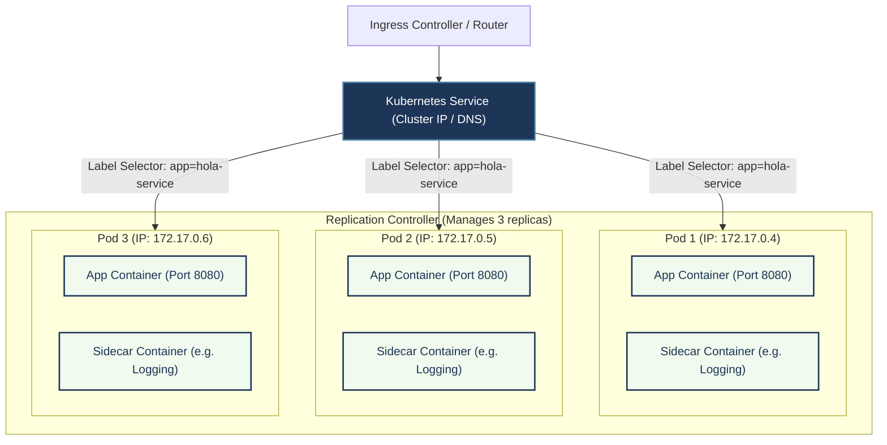
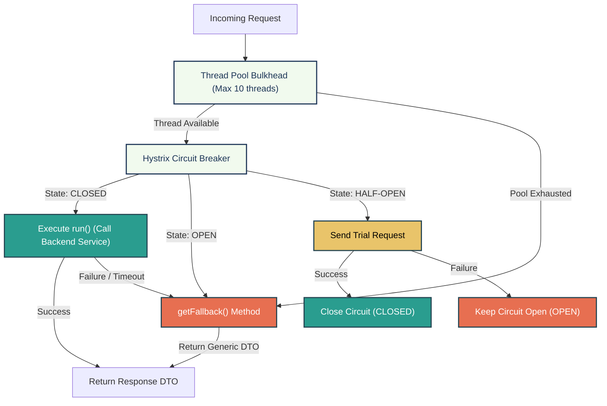
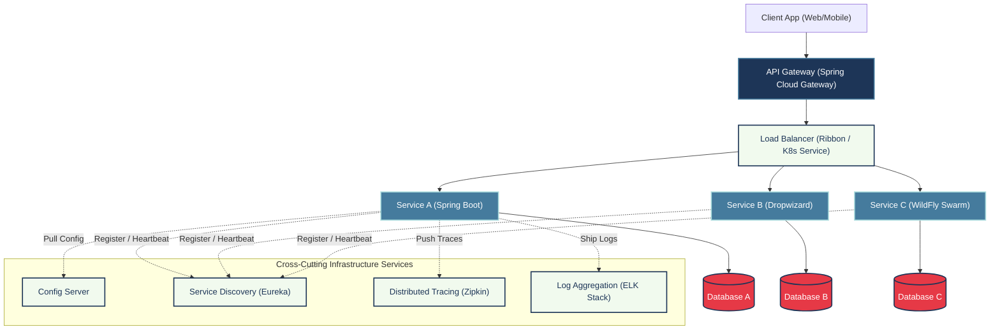

# MICROSERVICES - COMPREHENSIVE INTERVIEW PREPARATION GUIDE
> *For: 7+ Years Experience Level | Java Developer*

---

## SECTION 1: MICROSERVICES DESIGN PHILOSOPHIES

A microservices architecture (MSA) is not merely a collection of lightweight runtime frameworks. It is a distributed systems paradigm rooted in organizational design, communication models, and domain modeling. For senior roles, understanding these theoretical foundations is essential.

### 1. Conway's Law
First articulated by Melvin Conway in 1967, the law states:
> "Organizations which design systems are constrained to produce designs which are copies of the communication structures of these organizations."

*   **Monolithic Teams vs. Monolithic Codebases**: In traditional organizations, teams are organized by technical function (e.g., DBA team, UI team, Backend team). This functional alignment creates communication silos, forcing a highly coupled architecture (monolith) with expensive synchronization points.
*   **The Inverse Conway Maneuver**: To achieve a decoupled, modular microservices architecture, an organization must first restructure its teams into autonomous, cross-functional units (possessing product management, UI, backend, QA, and operations capabilities) that align directly with specific business capabilities.

### 2. Promise Theory (Mark Burgess)
Promise Theory is a model for analyzing autonomous systems (people, computers, and services) that interact with one another.
*   **Autonomous Agent Relationships**: An autonomous agent cannot place direct obligations or requirements on another autonomous agent. A service provider can only publish **promises** regarding its behavior or interface.
*   **Decoupled Commitments**: Service consumers must choose whether or not to trust these promises. If a downstream dependency fails, the service provider cannot force it to recover; instead, the provider must utilize fallback logic to uphold its own promises to its upstream clients.
*   **Consumer-Driven Contracts (CDC)**: To prevent service providers from breaking promises implicitly, consumers document their expectations in contracts. The provider runs these contracts as automated tests to verify that its promises are upheld.

### 3. Dependency-Oriented Thinking (Ganesh Prasad)
A major barrier to organizational agility is the presence of tightly coupled dependencies.
*   **Dropping Constraints**: Agility is achieved when constraints are systematically dropped. If a team must coordinate deployment with database administrators, security teams, and network administrators, deployment velocity is constrained. Incorporating these skills directly into the product team drops these dependencies.
*   **Insulating Core Domains from Legacy Systems**: Legacy components (e.g., COBOL systems or archaic SOAP APIs) expose highly coupled data formats. Dependency-oriented thinking mandates the implementation of an **Anti-Corruption Layer (ACL)** to convert legacy payloads into clean, model-driven structures, isolating downstream microservices from breaking database schema or field length changes.

### 4. Bounded Contexts in Domain-Driven Design (Eric Evans)
Microservices require carving a complex business domain into semantic boundaries.
*   **The Myth of the Canonical Data Model**: Monoliths attempt to define a single, enterprise-wide schema (e.g., a single `Part` or `Order` object). This creates semantic ambiguity because different sub-domains use these terms differently.
*   **Bounded Context Isolation**: In Domain-Driven Design (DDD), a domain model is explicit and unambiguous only within a bounded context.
    *   *Inventory Bounded Context*: A `Part` object represents a catalogued component (`PartType`) with SKU and dimensions.
    *   *Quality Assurance Bounded Context*: A `Part` object represents a specific physical component with a serial number, material batch, and test results.
*   By separating these concepts into distinct bounded contexts, each microservice can maintain its own database, schemas, and models, allowing them to evolve independently.

#### Key Takeaways
*   **Organizational Restructuring**: Team design dictates software design; build cross-functional teams before writing decoupled microservices.
*   **Autonomous Assurances**: Rely on published promises and fallbacks rather than downstream runtime assumptions.
*   **Semantic Segmentation**: Bounded Contexts eliminate the coupling caused by shared canonical enterprise schemas.

---

## SECTION 2: MICROSERVICES INFRASTRUCTURE & RUNTIME FRAMEWORKS

Deploying autonomous services requires selecting a runtime framework. For Java developers, the choice spans Spring Boot, Dropwizard, and WildFly Swarm (Thorntail).

### Framework Comparison Table

| Category | Spring Boot | Dropwizard | WildFly Swarm (Thorntail) |
| :--- | :--- | :--- | :--- |
| **Primary Philosophy** | Opinionated, automatic configurations, and starter dependencies. | Minimalist, prescriptive stack, with no magic or DI containers. | "Just Enough Application Server" using modular Java EE fractions. |
| **Dependency Injection**| Spring Framework (BeanFactory, ApplicationContext). | None by default (supports manual registry and wiring). | CDI (Contexts and Dependency Injection). |
| **Embedded Server** | Tomcat (default), Jetty, or Undertow. | Jetty (hardcoded). | Undertow (hardcoded JBoss WildFly web container). |
| **REST Implementation** | Spring MVC / WebFlux. | Jersey (JAX-RS). | RestEasy (JAX-RS). |
| **Configuration Model** | `application.properties` / `application.yml` + `@ConfigurationProperties`. | Single YAML file bound to POJO via Jackson + Environment substitutors. | Apache DeltaSpike Configuration (`@ConfigProperty`) / JBoss properties. |
| **Monitoring Tooling** | Spring Boot Actuator (HTTP/JMX). | Dropwizard Metrics (Core library, admin port 8081). | WildFly Swarm `monitor` fraction (/node, /heap, /threads). |
| **Production Packaging** | Executable Uber JAR with flat classloader. | Executable Uber JAR with flat classloader. | Executable Uber JAR with `-swarm.jar` suffix. |

---

### Three Frameworks Runtime Architectures

```mermaid
graph TD
    classDef sb fill:#2a9d8f,stroke:#264653,stroke-width:2px,color:#fff;
    classDef dw fill:#e76f51,stroke:#264653,stroke-width:2px,color:#fff;
    classDef wf fill:#e9c46a,stroke:#264653,stroke-width:2px,color:#000;
    classDef common fill:#e7c169,stroke:#1d3557,stroke-width:1px,color:#000;

    subgraph SpringBoot["Spring Boot Architecture"]
        SB_App["Application Entrypoint"]:::sb
        SB_AutoConfig["Auto-Configuration Engine"]:::sb
        SB_DI["Spring BeanFactory / DI"]:::sb
        SB_Embedded["Tomcat / Jetty / Undertow (8080)"]:::sb
        SB_Actuator["Actuator Endpoints (/health, /metrics)"]:::sb
        SB_App --> SB_AutoConfig --> SB_DI --> SB_Embedded
        SB_DI --> SB_Actuator
    end

    subgraph Dropwizard["Dropwizard Architecture"]
        DW_App["Application Entrypoint"]:::dw
        DW_Manual["Manual Wiring / Register Resources"]:::dw
        DW_Stack["Jetty / Jersey / Jackson Stack"]:::dw
        DW_NoDI["No DI Container (No Magic)"]:::dw
        DW_Ports["App Port (8080) & Admin Port (8081)"]:::dw
        DW_App --> DW_NoDI --> DW_Manual --> DW_Stack
        DW_Manual --> DW_Ports
    end

    subgraph WildFlySwarm["WildFly Swarm Architecture"]
        WF_App["WAR / Programmatic main()"]:::wf
        WF_Fractions["Fractions (CDI, JAX-RS, JPA, Servlet)"]:::wf
        WF_DeltaSpike["Apache DeltaSpike Config Injection"]:::wf
        WF_Server["Embedded JBoss WildFly Container"]:::wf
        WF_Offset["swarm.port.offset (8080 + offset)"]:::wf
        WF_App --> WF_Fractions --> WF_Server
        WF_Fractions --> WF_DeltaSpike
        WF_Server --> WF_Offset
    end
```



---

### 1. Spring Boot
Spring Boot streamlines Java development through standard configurations.
*   **Simplified Configuration**: Historically, Spring applications required verbose XML configurations. Spring Boot eliminates this boilerplate using auto-configuration (e.g., `@EnableAutoConfiguration` or `@SpringBootApplication`), dynamically loading beans based on the classes present on the classpath.
*   **Starter Dependencies**: Curated sets of transitive dependencies that ensure compatible library versions (e.g., `spring-boot-starter-web`, `spring-boot-starter-data-jpa`).
*   **Actuator**: Exposes operational endpoints `/health`, `/metrics`, `/env`, `/mappings`, and `/beans` over HTTP or JMX.
*   **Config Binding**: Leverages `@ConfigurationProperties` to map hierarchical configurations to type-safe POJOs.

### 2. Dropwizard
Dropwizard was developed by Coda Hale at Yammer in 2011 to build high-performance, minimalist REST web services.
*   **Prescriptive Stack**: Dropwizard pre-packages stable libraries: Jetty for the servlet container, Jersey for JAX-RS, Jackson for JSON parsing, Hibernate Validator, Guava, and Logback.
*   **No Dependency Injection**: Dropwizard purposely omits a DI container (such as Spring or Guava Guice). By forcing developers to construct objects and register them manually in the `Environment` class, it removes the "magic" of dynamic classpaths, making debugging straightforward since stack traces map directly to code.
*   **Separate Admin Port**: Out of the box, Dropwizard runs Jetty with two application connectors: the application port (default `8080`) and the admin port (default `8081`). Sensitive tools like thread dumps, metrics, and health checks are exposed only on the admin port, allowing operations to keep it behind a firewall.
*   **Metrics First**: Monitoring annotations like `@Timed` (latency statistics), `@Metered` (call rates), and `@ExceptionMetered` are natively integrated.

### 3. WildFly Swarm (Thorntail)
WildFly Swarm is designed to migrate existing Java EE applications to a microservices architecture.
*   **Just Enough Application Server**: Instead of running applications inside a bloated, shared JBoss EAP container, WildFly Swarm examines your `pom.xml` build configuration to extract modular components called **fractions** (e.g., CDI, JAX-RS, JPA). It compiles these fractions alongside your business code into an executable Uber JAR.
*   **Programmatic Bootstrapping**: Allows customization of the JBoss server lifecycle programmatically via a custom `main()` class.
*   **Apache DeltaSpike Configuration**: Uses DeltaSpike Extensions (`@ConfigProperty`) to bind configurations from properties files, environment variables, or JNDI source files with CDI-based injection.
*   **Port Offsetting**: Configured dynamically at runtime with `-Dswarm.port.offset=1`, which increments all ports in use by 1 to prevent local server collisions.

#### Key Takeaways
*   **Spring Boot**: Best for rapid development using a comprehensive ecosystem and automatic DI wiring.
*   **Dropwizard**: Best for high-performance REST APIs where explicit wiring, low overhead, and straightforward debugging are priorities.
*   **WildFly Swarm**: Best for leveraging legacy Java EE investments without introducing the overhead of a full application server.

---

## SECTION 3: CONTAINERIZATION & CLUSTER ORCHESTRATION (DOCKER & KUBERNETES)

Scaling and deploying a large fleet of microservices on physical or virtual hosts introduces configuration drift, port collisions, and resource allocation conflicts.

### 1. Container Virtualization Primitives
Linux containers achieve isolation at the OS level without the overhead of a hypervisor or guest OS:
*   **namespaces**: Provides isolation for specific system resources.
    *   `PID`: Isolates process IDs (the container process believes it is PID 1).
    *   `NET`: Isolates network interfaces, IP addresses, and routing tables.
    *   `MNT`: Isolates filesystem mount points.
    *   `IPC`: Isolates Inter-Process Communication channels.
    *   `UTS`: Isolates hostnames.
*   **cgroups (Control Groups)**: Enforces physical resource limits on containers (allocating CPU shares, memory caps, and disk I/O bandwidth).
*   **chroot**: Changes the root directory for a process, restricting directory access to the container image root.

### 2. Kubernetes Primitives
Kubernetes is a declarative container orchestration engine that matches actual cluster states to desired configurations.



*   **Pods**: The smallest deployable unit in Kubernetes. A Pod hosts one or more containers that share the same network namespace (same IP and port space), IPC, and storage volumes. Pods are **fungible** and ephemeral; they can be terminated or rescheduled at any time.
*   **Labels and Selectors**: Simple key-value metadata attached to Pods (e.g., `app=hola-service`, `env=prod`). Kubernetes services and controllers query these labels using selectors to route traffic or execute commands.
*   **ReplicationControllers / ReplicaSets**: Monitors the cluster state to maintain a target number of running Pod replicas. If a Pod crashes, the replication controller starts a replacement.
*   **Services**: Exposes a stable virtual IP address and DNS name (e.g., `http://hola-service`) to proxy and load-balance requests across matching Pods. Since Pod IPs are ephemeral, the Service acts as a static entry point.
*   **Cluster DNS Integration**: Kubernetes includes a cluster-wide DNS server (CoreDNS). When a service is created, a DNS record is registered (e.g., `my-service.my-namespace.svc.cluster.local`). This maps to the Service's stable virtual IP, preventing stale DNS records.

#### Key Takeaways
*   **Isolation**: Docker containers leverage kernel-level `namespaces` and `cgroups` to provide lightweight process isolation.
*   **Declarative Scaling**: Kubernetes uses replication loops to maintain the desired pod count.
*   **Decoupled Discovery**: Kubernetes Services use label selectors to abstract ephemeral Pods behind a stable DNS name and virtual IP.

---

## SECTION 4: RESILIENCE & FAULT TOLERANCE PATTERNS

Distributed systems fail. Network drops, high latency, and crashing hardware can propagate failures and lead to cascading system outages.

### 1. Kubernetes Self-Healing Probes
*   **Readiness Probes**: Periodically queries the container to verify if it is ready to receive traffic (e.g., waiting for connection pools to warm up). If the probe fails, the Pod is removed from the Service load balancer.
*   **Liveness Probes**: Periodically checks the container's health. If the probe fails, Kubernetes assumes the process is deadlocked or in a degraded state and restarts the container.

### 2. Resiliency with Hystrix / Resilience4j
When a downstream microservice is unavailable or slow, upstream services must protect their own resource pools.



*   **Circuit Breaker States**:
    *   `CLOSED`: Requests pass through. If the failure rate remains below a configured threshold, the circuit remains closed.
    *   `OPEN`: If failures exceed the threshold (e.g., 50% failures over a 5-second window), the circuit opens. Upstream requests fail fast and execute the fallback method immediately, bypassing the downstream call.
    *   `HALF-OPEN`: After a wait duration (e.g., 30 seconds), the circuit allows a limited number of trial requests. If all succeed, the circuit closes. If any fail, the circuit returns to the `OPEN` state.
*   **Bulkhead Pattern**: Named after partition walls in ships that prevent the entire vessel from sinking. It isolates resource pools (e.g., thread pools or semaphores) dedicated to calling specific downstream services. If a downstream service slows down, only its isolated thread pool is exhausted, allowing other requests to proceed.
*   **Client-Side Load Balancing (Ribbon)**: Intercepts outgoing requests on the client side, queries a discovery registry (or the Kubernetes API using `KubernetesServerList`), and applies load balancing algorithms (round-robin, weighted response time) to dispatch requests directly to specific service instances.

#### Key Takeaways
*   **Health Probes**: Use readiness probes to route traffic safely and liveness probes to recover from deadlocks automatically.
*   **Circuit Protection**: Open circuits quickly on failure to protect upstream resource pools.
*   **Resource Isolation**: Implement bulkheads to isolate downstream failures and prevent them from exhausting thread resources.

---

## SECTION 5: DISTRIBUTED TRANSACTIONS & SAGA PATTERN

In a microservices architecture, each service possesses its own database. Standard database ACID transactions are constrained within local databases. For multi-service transactions, two-phase commits (2PC) introduce locking latency, resource hogging, and single points of failure. The **Saga Pattern** manages distributed transactions using a sequence of local transactions.

### 1. Conceptual Breakdown
A Saga executes local transactions sequentially. Each local transaction updates the database and publishes an event or message.
*   **Compensating Transactions**: If a local transaction fails, the Saga runs a series of compensating transactions in reverse order to undo the changes.
*   **Compensations must be Idempotent**: Because network retries are common, a compensating transaction (e.g., `refundPayment` or `cancelOrder`) must be capable of executing multiple times with the same input without changing the final state.
*   **Lack of Isolation**: Sagas lack the "Isolation" parameter of ACID (eventual consistency). To prevent dirty reads or lost updates, semantic locks must be implemented at the application level (e.g., setting an order status to `PENDING` until the Saga finishes).

### 2. Saga Approaches: Choreography vs. Orchestration

*   **Choreography-Based Saga**: Decentralized workflow. Participant services listen to events from other services and execute local transactions independently without a central coordinator.
*   **Orchestration-Based Saga**: Centralized workflow. A central coordinator (the Orchestrator) commands participant services on which local transactions to execute and coordinates compensation flows if any step fails.

```mermaid
graph TD
    classDef service fill:#4F46E5,stroke:#C7D2FE,color:#FFFFFF,stroke-width:2px;
    classDef comp fill:#E11D48,stroke:#FECDD3,color:#FFFFFF,stroke-width:2px;
    classDef orch fill:#0F766E,stroke:#99F6E4,color:#FFFFFF,stroke-width:2px;

    subgraph Choreography["Choreography-Based Saga (Event-Driven)"]
        OrderService1["Order Service: Create Order"]:::service -->|"Event: OrderCreated"| PaymentService1["Payment Service: Process Payment"]:::service
        PaymentService1 -->|"Event: PaymentSuccess"| InventoryService1["Inventory Service: Reserve Stock"]:::service
        InventoryService1 -->|"Event: StockSuccess"| NotificationService1["Notification Service: Send Email"]:::service
        
        %% Compensation Path
        InventoryService1 -.->|"Event: StockFailed"| PaymentService1_Comp["Compensate: Refund Payment"]:::comp
        PaymentService1_Comp -.->|"Event: RefundSuccess"| OrderService1_Comp["Compensate: Cancel Order"]:::comp
    end

    subgraph Orchestration["Orchestration-Based Saga (Central Coordinator)"]
        Orchestrator["Saga Orchestrator (OrderSagaManager)"]:::orch
        
        Orchestrator -->|"1. Command: Process Payment"| PaymentService2["Payment Service"]:::service
        PaymentService2 -->|"2. Reply: Payment Success"| Orchestrator
        
        Orchestrator -->|"3. Command: Reserve Stock"| InventoryService2["Inventory Service"]:::service
        InventoryService2 -->|"4. Reply: Stock Reserve Failed"| Orchestrator
        
        Orchestrator -.->|"5. Compensate: Refund Payment"| PaymentService2
        Orchestrator -.->|"6. Compensate: Cancel Order"| OrderService2["Order Service"]:::comp
    end
```



---

### 3. Orchestrator Implementation Example
Below is a production-grade Spring Boot implementation of an Orchestration-based Saga using local transactions, simulated callbacks, and compensating executors.

```java
package com.example.service.saga;

import org.slf4j.Logger;
import org.slf4j.LoggerFactory;
import org.springframework.stereotype.Service;
import org.springframework.transaction.annotation.Transactional;
import java.util.UUID;

@Service
public class OrderSagaOrchestrator {

    private static final Logger log = LoggerFactory.getLogger(OrderSagaOrchestrator.class);

    private final PaymentServiceClient paymentClient;
    private final InventoryServiceClient inventoryClient;
    private final OrderRepository orderRepository;

    public OrderSagaOrchestrator(PaymentServiceClient paymentClient, 
                                 InventoryServiceClient inventoryClient, 
                                 OrderRepository orderRepository) {
        this.paymentClient = paymentClient;
        this.inventoryClient = inventoryClient;
        this.orderRepository = orderRepository;
    }

    public void executeOrderSaga(OrderSagaState state) {
        String txId = UUID.randomUUID().toString();
        log.info("Starting Order Saga [{}] for Order ID: {}", txId, state.getOrderId());
        
        // Step 1: Set state to processing
        updateSagaStatus(state.getOrderId(), "PROCESSING");

        // Step 2: Payment Execution
        boolean paymentSuccess = paymentClient.charge(state.getOrderId(), state.getAmount());
        if (!paymentSuccess) {
            log.error("Payment failed for Saga [{}]. Initiating compensation.", txId);
            compensateSaga(state, 1);
            return;
        }

        // Step 3: Inventory Reservation
        boolean stockReserved = inventoryClient.reserveStock(state.getOrderId(), state.getProductId(), state.getQuantity());
        if (!stockReserved) {
            log.error("Inventory reservation failed for Saga [{}]. Initiating compensation.", txId);
            compensateSaga(state, 2);
            return;
        }

        // Step 4: Complete Saga
        updateSagaStatus(state.getOrderId(), "COMPLETED");
        log.info("Saga [{}] executed successfully.", txId);
    }

    private void compensateSaga(OrderSagaState state, int stepFailed) {
        log.warn("Executing compensating transactions for Order ID: {}", state.getOrderId());
        
        // Rollback step 2 if step 3 failed
        if (stepFailed >= 2) {
            log.info("Refunding payment for Order ID: {}", state.getOrderId());
            paymentClient.refund(state.getOrderId(), state.getAmount());
        }
        
        // Rollback step 1 (Cancel Order)
        log.info("Cancelling order with ID: {}", state.getOrderId());
        updateSagaStatus(state.getOrderId(), "FAILED_CANCELLED");
    }

    @Transactional
    protected void updateSagaStatus(String orderId, String status) {
        orderRepository.updateStatus(orderId, status);
    }
}
```

---

### 4. Real-time Corporate Interview Questions (Big Four & Product-Based)

*   **Q: How do you handle compensating transaction failure in production? (Asked by Amazon & Google)**
    *   *Answer*: Compensating transactions must be idempotent and retriable. If a compensation fails (e.g., network drop, database down), the orchestrator must retry it using exponential backoff. If it fails repeatedly, the transaction must be flagged, placed into a Dead Letter Queue (DLQ), and escalated to a manual reconciliation system or human-in-the-loop dashboard.
*   **Q: How do you prevent write anomalies (lost updates, dirty reads) in Saga since it lacks Isolation? (Asked by PwC & Deloitte)**
    *   *Answer*: Apply application-level isolation countermeasures:
        1. *Semantic Lock*: Mark the status of the entity as `PENDING` (e.g., `ORDER_PENDING`) to block other operations from changing it until the Saga completes.
        2. *Commutative Updates*: Design APIs such that operations can run in any order (e.g., balance updates).
        3. *Pessimistic View*: Force the API to read the latest state from the database or show a warning to the user that processing is ongoing.
*   **Q: What is the Outbox Pattern's role in a Choreography Saga? (Asked by EY & Microsoft)**
    *   *Answer*: To ensure atomic event publishing, a microservice must update its local database and publish an event to Kafka/RabbitMQ in a single transaction. The service writes the event to a local `OUTBOX` table in the database. An asynchronous log-tailing service (like Debezium) reads the outbox records and publishes them to the message broker, guaranteeing "at-least-once" delivery.

#### Key Takeaways
*   **ACID Alternative**: Sagas swap blocking locks (2PC) for eventual consistency and compensating logic.
*   **Idempotency Requirement**: All participants and compensating actions must support duplicate invocations safely.
*   **Semantic Isolations**: Application-level locks must be used to prevent write anomalies.

---

## SECTION 6: MICROSERVICES HIGH-LEVEL ARCHITECTURE

For enterprise environments, combining these runtime components, service registries, and resilience configurations yields a robust architecture.



#### Key Takeaways
*   **Decoupled Components**: Services maintain individual databases and do not share runtime dependencies.
*   **Edge Routing**: The API Gateway handles edge concerns like SSL termination, routing, and rate limiting.
*   **Cross-Cutting Services**: Logging, configuration management, tracing, and service registries are offloaded to dedicated infrastructure components.

---

## SECTION 7: 20 ADVANCED INTERVIEW CODING QUESTIONS & SOLUTIONS

### Q1. Implement a custom Spring Cloud Gateway filter to append correlation IDs to request headers and register a Resilience4j circuit breaker programmatically.

#### Solution
```java
package com.example.gateway.config;

import org.springframework.cloud.gateway.filter.GatewayFilter;
import org.springframework.cloud.gateway.filter.factory.AbstractGatewayFilterFactory;
import org.springframework.cloud.gateway.route.RouteLocator;
import org.springframework.cloud.gateway.route.builder.RouteLocatorBuilder;
import org.springframework.context.annotation.Bean;
import org.springframework.context.annotation.Configuration;
import org.springframework.http.server.reactive.ServerHttpRequest;
import java.util.UUID;

@Configuration
public class GatewayConfiguration extends AbstractGatewayFilterFactory<GatewayConfiguration.Config> {

    public GatewayConfiguration() {
        super(Config.class);
    }

    public static class Config {
        // Configuration parameters can go here
    }

    @Bean
    public RouteLocator customRouteLocator(RouteLocatorBuilder builder) {
        return builder.routes()
            .route("policy-service", r -> r
                .path("/api/v1/policies/**")
                .filters(f -> f
                    .filter(correlationIdFilter())
                    .circuitBreaker(c -> c
                        .setName("policyCircuitBreaker")
                        .setFallbackUri("forward:/fallback/policies")))
                .uri("lb://POLICY-SERVICE"))
            .build();
    }

    private GatewayFilter correlationIdFilter() {
        return (exchange, chain) -> {
            String correlationId = UUID.randomUUID().toString();
            ServerHttpRequest request = exchange.getRequest().mutate()
                .header("X-Correlation-Id", correlationId)
                .build();
            return chain.filter(exchange.mutate().request(request).build());
        };
    }

    @Override
    public GatewayFilter apply(Config config) {
        return correlationIdFilter();
    }
}
```

---

### Q2. Implement configuration mapping in Spring Boot using `@ConfigurationProperties` to validate property structures with Hibernate Validator.

#### Solution
```yaml
# src/main/resources/application.yml
app:
  settings:
    saying: "Guten Tag"
    timeout-ms: 5000
    retry-count: 3
```

```java
package com.example.service.config;

import org.springframework.boot.context.properties.ConfigurationProperties;
import org.springframework.context.annotation.Configuration;
import org.springframework.validation.annotation.Validated;
import jakarta.validation.constraints.Max;
import jakarta.validation.constraints.Min;
import jakarta.validation.constraints.NotEmpty;
import jakarta.validation.constraints.NotNull;

@Configuration
@ConfigurationProperties(prefix = "app.settings")
@Validated
public class AppSettingsConfig {

    @NotEmpty(message = "Saying cannot be empty")
    private String saying;

    @Min(value = 1000, message = "Timeout must be at least 1000ms")
    @Max(value = 10000, message = "Timeout cannot exceed 10000ms")
    @NotNull
    private Integer timeoutMs;

    @Min(0)
    @Max(5)
    private int retryCount;

    // Getters and Setters
    public String getSaying() { return saying; }
    public void setSaying(String saying) { this.saying = saying; }

    public Integer getTimeoutMs() { return timeoutMs; }
    public void setTimeoutMs(Integer timeoutMs) { this.timeoutMs = timeoutMs; }

    public int getRetryCount() { return retryCount; }
    public void setRetryCount(int retryCount) { this.retryCount = retryCount; }
}
```

---

### Q3. Write a custom Actuator `HealthIndicator` in Spring Boot to monitor database connections and return a degraded status.

#### Solution
```java
package com.example.service.actuator;

import org.springframework.boot.actuate.health.Health;
import org.springframework.boot.actuate.health.HealthIndicator;
import org.springframework.boot.actuate.health.Status;
import org.springframework.stereotype.Component;
import javax.sql.DataSource;
import java.sql.Connection;
import java.sql.Statement;

@Component("customDbHealth")
public class CustomDatabaseHealthIndicator implements HealthIndicator {

    private final DataSource dataSource;

    public CustomDatabaseHealthIndicator(DataSource dataSource) {
        this.dataSource = dataSource;
    }

    @Override
    public Health health() {
        long startTime = System.currentTimeMillis();
        try (Connection connection = dataSource.getConnection();
             Statement statement = connection.createStatement()) {
            
            statement.execute("SELECT 1 FROM SYSTEM_VAL"); // Lightweight query
            long responseTime = System.currentTimeMillis() - startTime;

            if (responseTime > 800) {
                return Health.status(new Status("DEGRADED", "High DB Latency"))
                    .withDetail("latencyMs", responseTime)
                    .withDetail("maxThresholdMs", 800)
                    .build();
            }
            return Health.up()
                .withDetail("latencyMs", responseTime)
                .build();
        } catch (Exception ex) {
            return Health.down(ex)
                .withDetail("error", ex.getMessage())
                .build();
        }
    }
}
```

---

### Q4. Implement a Resilience4j Circuit Breaker and Fallback method in a Spring Boot REST Service.

#### Solution
```java
package com.example.service.client;

import io.github.resilience4j.circuitbreaker.annotation.CircuitBreaker;
import org.slf4j.Logger;
import org.slf4j.LoggerFactory;
import org.springframework.stereotype.Service;
import org.springframework.web.client.RestTemplate;

@Service
public class PolicyClientService {

    private static final Logger log = LoggerFactory.getLogger(PolicyClientService.class);
    private final RestTemplate restTemplate;

    public PolicyClientService(RestTemplate restTemplate) {
        this.restTemplate = restTemplate;
    }

    @CircuitBreaker(name = "backendPolicyService", fallbackMethod = "fetchPoliciesFallback")
    public String fetchPolicies(String clientDetails) {
        String url = "http://POLICY-SERVICE/api/v1/policies?details=" + clientDetails;
        return restTemplate.getForObject(url, String.class);
    }

    public String fetchPoliciesFallback(String clientDetails, Throwable ex) {
        log.error("Downstream call failed for policy client details {}. Triggering fallback. Error: {}", 
            clientDetails, ex.getMessage());
        return "{\"status\": \"FALLBACK\", \"message\": \"Service is temporarily degraded. Showing cached policies.\"}";
    }
}
```

---

### Q5. Configure a thread-pool bulkhead using Resilience4j configuration for a latency-prone microservice dependency.

#### Solution
```yaml
# application.yml
resilience4j.threadpoolbulkhead:
  instances:
    policyBulkheadService:
      maxThreadPoolSize: 15
      coreThreadPoolSize: 8
      queueCapacity: 10
      keepAliveDuration: 20ms
```

```java
package com.example.service.client;

import io.github.resilience4j.bulkhead.annotation.Bulkhead;
import org.springframework.stereotype.Service;
import org.springframework.web.client.RestTemplate;
import java.util.concurrent.CompletableFuture;

@Service
public class BulkheadClientService {

    private final RestTemplate restTemplate;

    public BulkheadClientService(RestTemplate restTemplate) {
        this.restTemplate = restTemplate;
    }

    @Bulkhead(name = "policyBulkheadService", type = Bulkhead.Type.THREADPOOL)
    public CompletableFuture<String> callHighLatencyEndpoint() {
        return CompletableFuture.supplyAsync(() -> 
            restTemplate.getForObject("http://LATENCY-SERVICE/api/heavy", String.class)
        );
    }
}
```

---

### Q6. Implement a Spring Cloud Feign Client using fallback factories to extract exceptions, and configure a custom `ErrorDecoder`.

#### Solution
```java
package com.example.service.client;

import org.springframework.cloud.openfeign.FeignClient;
import org.springframework.web.bind.annotation.GetMapping;
import org.springframework.web.bind.annotation.PathVariable;

@FeignClient(name = "CLAIM-SERVICE", fallbackFactory = ClaimClientFallbackFactory.class)
public interface ClaimClient {
    @GetMapping("/api/v1/claims/{id}")
    String getClaimById(@PathVariable("id") String id);
}
```

```java
package com.example.service.client;

import org.slf4j.Logger;
import org.slf4j.LoggerFactory;
import org.springframework.cloud.openfeign.FallbackFactory;
import org.springframework.stereotype.Component;

@Component
public class ClaimClientFallbackFactory implements FallbackFactory<ClaimClient> {

    private static final Logger log = LoggerFactory.getLogger(ClaimClientFallbackFactory.class);

    @Override
    public ClaimClient create(Throwable cause) {
        return id -> {
            log.error("Feign request failed for claim ID {}. Cause: {}", id, cause.getMessage());
            return "{\"claimId\": \"" + id + "\", \"status\": \"UNKNOWN\", \"reason\": \"Service Unavailable\"}";
        };
    }
}
```

```java
package com.example.service.config;

import feign.Response;
import feign.codec.ErrorDecoder;
import org.springframework.context.annotation.Configuration;

@Configuration
public class CustomFeignConfig implements ErrorDecoder {

    @Override
    public Exception decode(String methodKey, Response response) {
        int status = response.status();
        if (status >= 400 && status < 500) {
            return new IllegalArgumentException("Client side exception occurred: Status " + status);
        }
        if (status >= 500) {
            return new RuntimeException("Downstream server failure occurred: Status " + status);
        }
        return new ErrorDecoder.Default().decode(methodKey, response);
    }
}
```

---

### Q7. Implement the Transactional Outbox Pattern to save business state and queue events within a single database transaction.

#### Solution
```java
package com.example.service.outbox;

import com.fasterxml.jackson.databind.ObjectMapper;
import org.springframework.stereotype.Service;
import org.springframework.transaction.annotation.Transactional;
import java.time.LocalDateTime;
import java.util.UUID;

@Service
public class ClaimProcessingService {

    private final ClaimRepository claimRepository;
    private final OutboxRepository outboxRepository;
    private final ObjectMapper objectMapper;

    public ClaimProcessingService(ClaimRepository claimRepository, 
                                  OutboxRepository outboxRepository, 
                                  ObjectMapper objectMapper) {
        this.claimRepository = claimRepository;
        this.outboxRepository = outboxRepository;
        this.objectMapper = objectMapper;
    }

    @Transactional
    public Claim processClaim(ClaimRequest request) throws Exception {
        // 1. Process and save business state
        Claim claim = new Claim();
        claim.setId(UUID.randomUUID().toString());
        claim.setAmount(request.getAmount());
        claim.setStatus("APPROVED");
        claimRepository.save(claim);

        // 2. Build and save the event payload to the Outbox table
        OutboxEvent event = new OutboxEvent();
        event.setId(UUID.randomUUID().toString());
        event.setEventType("CLAIM_APPROVED");
        event.setAggregateId(claim.getId());
        event.setPayload(objectMapper.writeValueAsString(claim));
        event.setCreatedAt(LocalDateTime.now());
        event.setProcessed(false);
        
        outboxRepository.save(event);

        return claim;
    }
}
```

---

### Q8. Write code to execute the Idempotent Consumer Pattern, using an event log table to block duplicate event execution.

#### Solution
```java
package com.example.service.consumer;

import org.springframework.jdbc.core.JdbcTemplate;
import org.springframework.stereotype.Service;
import org.springframework.transaction.annotation.Transactional;

@Service
public class IdempotentEventConsumer {

    private final JdbcTemplate jdbcTemplate;

    public IdempotentEventConsumer(JdbcTemplate jdbcTemplate) {
        this.jdbcTemplate = jdbcTemplate;
    }

    @Transactional
    public void consumeEvent(String eventId, String payload) {
        // Attempt to insert the unique event ID into an event log table
        String insertQuery = "INSERT INTO PROCESSED_EVENTS (EVENT_ID, PROCESSED_TIME) VALUES (?, CURRENT_TIMESTAMP)";
        try {
            jdbcTemplate.update(insertQuery, eventId);
        } catch (org.springframework.dao.DuplicateKeyException ex) {
            // Deduplicate: Event has already been processed
            System.out.println("Deduplicating event. Event ID: " + eventId + " has already been processed.");
            return;
        }

        // Process the event logic
        processBusinessLogic(payload);
    }

    private void processBusinessLogic(String payload) {
        System.out.println("Processing business logic for payload: " + payload);
    }
}
```

---

### Q9. Construct a Dropwizard Application class, Configuration class, and REST resource without utilizing DI.

#### Solution
```java
package com.example.dropwizard;

import io.dropwizard.Configuration;
import com.fasterxml.jackson.annotation.JsonProperty;
import org.hibernate.validator.constraints.NotEmpty;

public class AppConfig extends Configuration {
    @NotEmpty
    private String greeting = "Hola";

    @JsonProperty
    public String getGreeting() { return greeting; }
    
    @JsonProperty
    public void setGreeting(String greeting) { this.greeting = greeting; }
}
```

```java
package com.example.dropwizard.resources;

import jakarta.ws.rs.GET;
import jakarta.ws.rs.Path;
import jakarta.ws.rs.Produces;
import jakarta.ws.rs.core.MediaType;

@Path("/api")
@Produces(MediaType.TEXT_PLAIN)
public class HolaResource {
    private final String greeting;

    public HolaResource(String greeting) {
        this.greeting = greeting;
    }

    @GET
    @Path("/hola")
    public String getGreeting() {
        return greeting + " from Dropwizard";
    }
}
```

```java
package com.example.dropwizard;

import io.dropwizard.Application;
import io.dropwizard.setup.Environment;
import com.example.dropwizard.resources.HolaResource;

public class DropwizardApp extends Application<AppConfig> {

    public static void main(String[] args) throws Exception {
        new DropwizardApp().run(args);
    }

    @Override
    public void run(AppConfig config, Environment env) {
        // Explicit instantiation and wiring in Dropwizard
        HolaResource resource = new HolaResource(config.getGreeting());
        env.jersey().register(resource);
    }
}
```

---

### Q10. Implement a custom health check in Dropwizard and register it with the Environment registry.

#### Solution
```java
package com.example.dropwizard.health;

import com.codahale.metrics.health.HealthCheck;
import java.net.Socket;

public class DatabaseHealthCheck extends HealthCheck {

    private final String dbHost;
    private final int dbPort;

    public DatabaseHealthCheck(String dbHost, int dbPort) {
        this.dbHost = dbHost;
        this.dbPort = dbPort;
    }

    @Override
    protected Result check() {
        // Attempt a basic socket connection check
        try (Socket socket = new Socket(dbHost, dbPort)) {
            return Result.healthy();
        } catch (Exception ex) {
            return Result.unhealthy("Cannot reach database at " + dbHost + ":" + dbPort);
        }
    }
}
```

```java
// Registering health check in DropwizardApp run() method
@Override
public void run(AppConfig config, Environment env) {
    DatabaseHealthCheck dbCheck = new DatabaseHealthCheck("localhost", 5432);
    env.healthChecks().register("postgres-db", dbCheck);
}
```

---

### Q11. Configure Dropwizard variable substitution to parse configuration properties from environment variables with defaults.

#### Solution
```yaml
# conf/application.yml
helloapp:
  saying: ${HELLOAPP_SAYING:-Guten Tag aus config}
```

```java
package com.example.dropwizard;

import io.dropwizard.Application;
import io.dropwizard.configuration.EnvironmentVariableSubstitutor;
import io.dropwizard.configuration.SubstitutingSourceProvider;
import io.dropwizard.setup.Bootstrap;

public class ConfigurationSubApp extends Application<AppConfig> {

    @Override
    public void initialize(Bootstrap<AppConfig> bootstrap) {
        // Wrap the standard source provider with an environment variable substitutor
        bootstrap.setConfigurationSourceProvider(
            new SubstitutingSourceProvider(
                bootstrap.getConfigurationSourceProvider(),
                new EnvironmentVariableSubstitutor(false) // strict = false
            )
        );
    }

    @Override
    public void run(AppConfig configuration, io.dropwizard.setup.Environment environment) {
        // Logic goes here
    }
}
```

---

### Q12. Write a Dropwizard REST resource that uses metrics annotations for latency and call rate logging.

#### Solution
```java
package com.example.dropwizard.resources;

import com.codahale.metrics.annotation.Metered;
import com.codahale.metrics.annotation.Timed;
import jakarta.ws.rs.GET;
import jakarta.ws.rs.Path;
import jakarta.ws.rs.Produces;
import jakarta.ws.rs.core.MediaType;

@Path("/metrics-demo")
@Produces(MediaType.TEXT_PLAIN)
public class MetricsResource {

    @GET
    @Path("/timed")
    @Timed(name = "timed-get-endpoint") // Tracks execution duration histogram
    public String getTimed() throws InterruptedException {
        Thread.sleep(500); // Simulate network latency
        return "Call was timed!";
    }

    @GET
    @Path("/metered")
    @Metered(name = "metered-call-rate") // Tracks request throughput over time
    public String getMetered() {
        return "Call was metered!";
    }
}
```

---

### Q13. Implement programmatic configuration injection in WildFly Swarm using Contexts and Dependency Injection (CDI) and Apache DeltaSpike.

#### Solution
```java
package com.example.wfswarm.rest;

import org.apache.deltaspike.core.api.config.ConfigProperty;
import jakarta.inject.Inject;
import jakarta.ws.rs.GET;
import jakarta.ws.rs.Path;
import jakarta.ws.rs.Produces;
import jakarta.ws.rs.core.Response;

@Path("/api/wildfly")
public class SwarmResource {

    @Inject
    @ConfigProperty(name = "SWARM_SAYING", defaultValue = "Guten Tag de Swarm")
    private String saying;

    @GET
    @Produces("text/plain")
    public Response getGreeting() {
        return Response.ok(saying).build();
    }
}
```

---

### Q14. Write a custom `main()` class to programmatically configure Java EE fractions inside WildFly Swarm.

#### Solution
```java
package com.example.wfswarm;

import org.wildfly.swarm.Swarm;
import org.wildfly.swarm.jaxrs.JAXRSFraction;
import org.wildfly.swarm.undertow.UndertowFraction;

public class ProgrammaticMain {

    public static void main(String[] args) throws Exception {
        Swarm swarm = new Swarm(args);

        // Customize the Undertow fraction programmatically
        UndertowFraction undertow = new UndertowFraction();
        swarm.fraction(undertow);

        // Customize JAX-RS Fraction
        JAXRSFraction jaxrs = new JAXRSFraction();
        swarm.fraction(jaxrs);

        swarm.start();
        swarm.deploy();
    }
}
```

---

### Q15. Implement a custom thread-isolated `HystrixCommand` with execution timeouts and dynamic configurations.

#### Solution
```java
package com.example.wfswarm.rest;

import com.netflix.hystrix.HystrixCommand;
import com.netflix.hystrix.HystrixCommandGroupKey;
import com.netflix.hystrix.HystrixCommandProperties;
import com.netflix.hystrix.HystrixThreadPoolProperties;
import java.net.HttpURLConnection;
import java.net.URL;

public class HttpCallCommand extends HystrixCommand<String> {

    private final String serviceUrl;

    public HttpCallCommand(String serviceUrl) {
        super(Setter.withGroupKey(HystrixCommandGroupKey.Factory.asKey("HttpGroup"))
            .andCommandPropertiesDefaults(HystrixCommandProperties.Setter()
                .withExecutionTimeoutInMilliseconds(1500)
                .withCircuitBreakerEnabled(true)
                .withCircuitBreakerRequestVolumeThreshold(5))
            .andThreadPoolPropertiesDefaults(HystrixThreadPoolProperties.Setter()
                .withCoreSize(10)
                .withMaxQueueSize(5)));
        this.serviceUrl = serviceUrl;
    }

    @Override
    protected String run() throws Exception {
        URL url = new URL(serviceUrl);
        HttpURLConnection conn = (HttpURLConnection) url.openConnection();
        conn.setRequestMethod("GET");
        conn.setConnectTimeout(1000);
        conn.setReadTimeout(1000);
        
        int responseCode = conn.getResponseCode();
        if (responseCode == 200) {
            return "SUCCESS";
        }
        throw new RuntimeException("Http failure status code: " + responseCode);
    }

    @Override
    protected String getFallback() {
        return "FALLBACK_VALUE";
    }
}
```

---

### Q16. Configure Ribbon to use Kubernetes service list discovery dynamically in Java.

#### Solution
```java
package com.example.ribbon.config;

import com.netflix.loadbalancer.DynamicServerListLoadBalancer;
import com.netflix.loadbalancer.LoadBalancerBuilder;
import com.netflix.loadbalancer.Server;
import com.netflix.client.config.DefaultClientConfigImpl;
import io.fabric8.kubernetes.client.DefaultKubernetesClient;
import io.fabric8.kubernetes.client.KubernetesClient;
import io.fabric8.kubeflix.ribbon.KubernetesServerList;

public class RibbonK8sConfig {

    public DynamicServerListLoadBalancer<Server> buildLoadBalancer(String namespace, String serviceName) {
        DefaultClientConfigImpl config = new DefaultClientConfigImpl();
        config.setClientName(serviceName);

        KubernetesClient client = new DefaultKubernetesClient();
        
        // Use Kubeflix's KubernetesServerList to fetch endpoints from the K8s API
        KubernetesServerList serverList = new KubernetesServerList(client, namespace, serviceName, "http");

        return LoadBalancerBuilder.<Server>newBuilder()
            .withDynamicServerList(serverList)
            .buildDynamicServerListLoadBalancer();
    }
}
```

---

### Q17. Write a Kubernetes Deployment and Service configuration manifest mapping container port 8080 to service port 80.

#### Solution
```yaml
apiVersion: apps/v1
kind: Deployment
metadata:
  name: policy-deployment
  labels:
    app: policy-service
spec:
  replicas: 3
  selector:
    matchLabels:
      app: policy-service
  template:
    metadata:
      labels:
        app: policy-service
    spec:
      containers:
        - name: policy-container
          image: fabric8/policy-service:1.0
          ports:
            - containerPort: 8080
---
apiVersion: v1
kind: Service
metadata:
  name: policy-service
spec:
  type: ClusterIP
  selector:
    app: policy-service
  ports:
    - name: http
      port: 80
      targetPort: 8080
```

---

### Q18. Configure a Kubernetes Deployment manifest with separate Liveness and Readiness probes mapping to Actuator HTTP health endpoints.

#### Solution
```yaml
apiVersion: apps/v1
kind: Deployment
metadata:
  name: order-deployment
spec:
  replicas: 2
  selector:
    matchLabels:
      app: order-service
  template:
    metadata:
      labels:
        app: order-service
    spec:
      containers:
        - name: order-container
          image: fabric8/order-service:1.0
          ports:
            - containerPort: 8080
          readinessProbe:
            httpGet:
              path: /actuator/health
              port: 8080
            initialDelaySeconds: 10
            periodSeconds: 5
            timeoutSeconds: 3
          livenessProbe:
            httpGet:
              path: /actuator/health
              port: 8080
            initialDelaySeconds: 20
            periodSeconds: 10
            timeoutSeconds: 3
            failureThreshold: 3
```

---

### Q19. Write Java helper utilities to manually inject and extract distributed trace context in HTTP headers using W3C Trace Context specifications.

#### Solution
```java
package com.example.service.tracing;

import java.net.HttpURLConnection;
import java.util.UUID;

public class ManualTracingContextUtility {

    public static class TraceContext {
        private final String traceId;
        private final String spanId;

        public TraceContext(String traceId, String spanId) {
            this.traceId = traceId;
            this.spanId = spanId;
        }

        public String getTraceId() { return traceId; }
        public String getSpanId() { return spanId; }
        
        public String toTraceParentHeader() {
            return String.format("00-%s-%s-01", traceId, spanId);
        }
    }

    public static TraceContext createNewContext() {
        // Trace ID: 32 hex characters, Span ID: 16 hex characters
        return new TraceContext(
            UUID.randomUUID().toString().replace("-", ""),
            UUID.randomUUID().toString().replace("-", "").substring(0, 16)
        );
    }

    public static void injectContext(HttpURLConnection conn, TraceContext context) {
        // Traceparent format: 00-traceid-spanid-traceflags
        conn.setRequestProperty("traceparent", context.toTraceParentHeader());
    }

    public static TraceContext extractContext(String traceParentHeader) {
        if (traceParentHeader == null || !traceParentHeader.startsWith("00-")) {
            return createNewContext(); // Fallback
        }
        String[] parts = traceParentHeader.split("-");
        if (parts.length >= 3) {
            String traceId = parts[1];
            String spanId = parts[2];
            return new TraceContext(traceId, spanId);
        }
        return createNewContext();
    }
}
```

---

### Q20. Write a Spring Cloud Gateway configuration to apply the Strangler Fig Pattern, routing requests to legacy monolith and new microservice systems based on version headers.

#### Solution
```java
package com.example.gateway.config;

import org.springframework.cloud.gateway.route.RouteLocator;
import org.springframework.cloud.gateway.route.builder.RouteLocatorBuilder;
import org.springframework.context.annotation.Bean;
import org.springframework.context.annotation.Configuration;

@Configuration
public class StranglerFigRoutingConfig {

    @Bean
    public RouteLocator stranglerRoutes(RouteLocatorBuilder builder) {
        return builder.routes()
            // New Claim Service - matched if version header specifies V2
            .route("new-claim-service", r -> r
                .path("/api/claims/**")
                .and()
                .header("X-Api-Version", "v2")
                .uri("http://CLAIM-MICROSERVICE"))
            
            // Legacy Monolith Service - fallback route for all unmatched requests
            .route("legacy-monolith-service", r -> r
                .path("/api/claims/**")
                .uri("http://legacy-monolith:8080"))
            .build();
    }
}
```

#### Key Takeaways
*   **Edge Operations**: Spring Cloud Gateway provides flexible routing mechanics to throttle, trace, and inspect requests before they reach backend instances.
*   **Idempotency**: Logging unique event identifiers in databases is an effective way to implement idempotent processing.
*   **Tracing Context**: distributed tracing relies on propagating trace contexts across process boundaries.

---

## SECTION 8: SUMMARY & KEY TAKEAWAYS

*   **Design & Philosophy**: Microservices require restructuring teams into cross-functional units aligned with explicit, bounded domain contexts rather than shared relational schemas.
*   **Runtime Selection**: Choose Spring Boot for extensive ecosystems, Dropwizard for low latency and minimal runtime magic, and WildFly Swarm for utilizing existing JAX-RS / CDI frameworks.
*   **Cluster Management**: Kubernetes handles container scheduling, declarative replicas, virtual cluster routing, and self-healing.
*   **Resiliency Architecture**: Implement liveness probes for service self-healing, Hystrix/Resilience4j circuit breakers to fail fast, bulkheads to isolate threads, and clients with fallback mechanisms to uphold promises.
