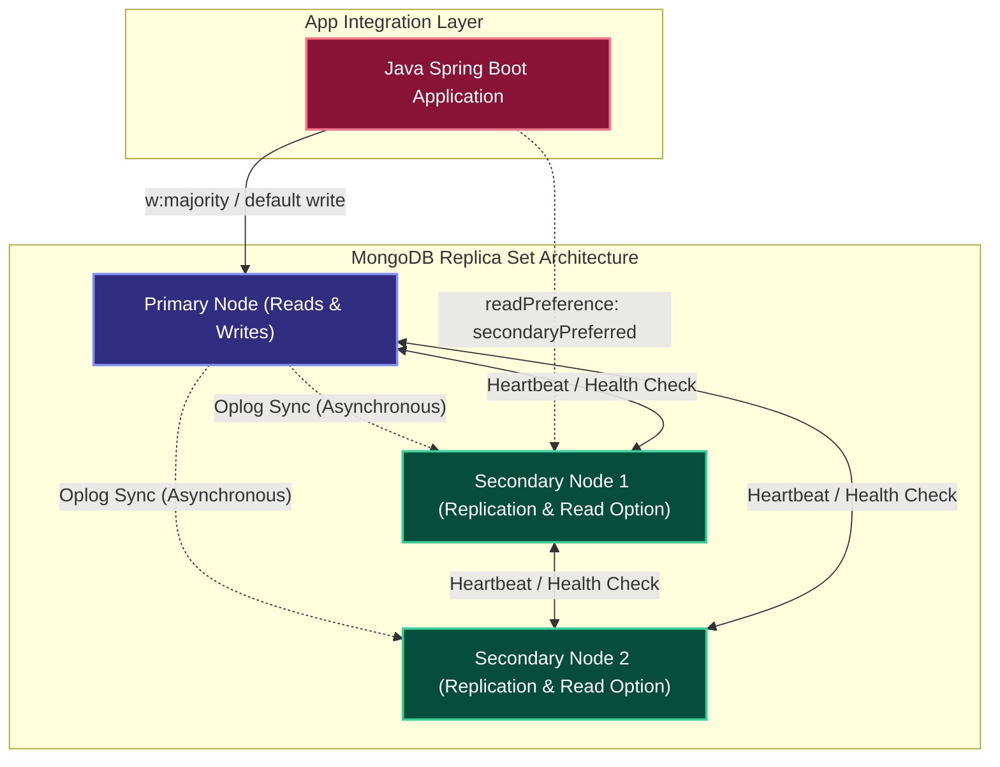
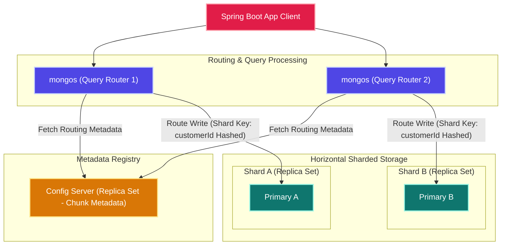
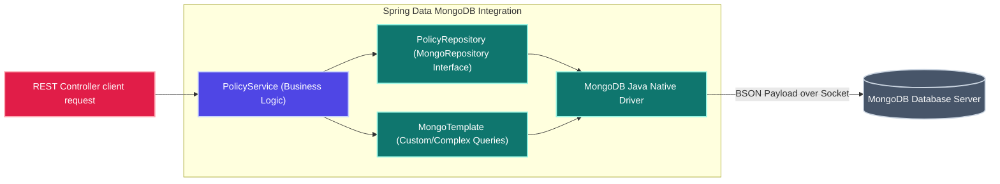

# MONGODB - COMPREHENSIVE TECHNICAL ANALYSIS & MASTER STUDY GUIDE
> *Interview Preparation | 7+ Years Java Full Stack · Structured Technical Documentation*

---

## SECTION 1: MONGODB ARCHITECTURE & STRUCTURAL MAPPING

MongoDB is a high-performance, open-source, document-oriented NoSQL database designed to store large volumes of semi-structured data. Rather than using rows and columns in relational tables, MongoDB stores data in collections of self-describing **BSON (Binary JSON)** documents.

Operating on a schema-flexible model, each document in a MongoDB collection can maintain a unique structure. This architecture eliminates the need for schema migrations when adding new fields, aligning MongoDB with fast-iterating microservice architectures.

### Relational Database (SQL) vs. MongoDB Mapping

Understanding the conceptual mapping between relational databases and MongoDB is essential for system integration and migrations:

| Relational Database (RDBMS) | MongoDB Document Store | Conceptual Equivalency / Operations |
| :--- | :--- | :--- |
| **Database** | **Database** | Logical container for datasets. |
| **Table** | **Collection** | Group of records/documents (no schema enforced). |
| **Row** | **Document** | Individual data record (encoded in BSON). |
| **Column** | **Field** | Key-value attribute within a document. |
| **Primary Key** | **`_id`** | Unique index identifier (implicitly generated ObjectId). |
| **Index** | **Index** | B-Tree index structured to accelerate field queries. |
| **JOIN** | **Embedded Document / `$lookup`** | Linking data (referencing or nesting documents). |
| **GROUP BY** | **Aggregation Pipeline** | Multi-stage transformation and grouping framework. |

### Microservices Use-Cases for MongoDB

NoSQL document structures are highly suited for specific microservice boundaries:
- **Product Catalog Services**: Products maintain widely varied attributes (e.g., electronics have screen sizes; clothing has dimensions). Document schemas support nesting these distinct attributes directly within a single document.
- **Audit Logging & Event Sourcing**: High write throughput requirements are easily met by MongoDB's lockless document-level writing mechanics, serving as an append-only event store.
- **Session State & User Profiles**: User logins and dynamic checkout sessions fit naturally into flexible JSON documents that can expire automatically using Time-To-Live (TTL) indexes.
- **Content Management Systems (CMS)**: Storing rich text, media links, and comment arrays together in one document avoids relational link tables.

#### Key Takeaways
- **BSON Storage**: BSON extends JSON by supporting binary serialization and richer data types (e.g., `Date`, `Decimal128`, and `BinData`).
- **Flexible Schema**: Documents in the same collection do not need to share the same fields, enabling rapid feature rollouts.
- **Aggregations**: Complex joins and calculations are offloaded to MongoDB's memory-optimized aggregation pipeline stages rather than server-side application logic.

---

## SECTION 2: PART 1 - FUNDAMENTALS (Q1-Q12)

#### Q1. What is MongoDB? When to use it over RDBMS?
**A:** MongoDB is a document-oriented NoSQL database that stores data as flexible BSON documents. It should be used when you require:
- A flexible, dynamic schema where fields vary between records.
- High-throughput write capabilities (e.g., event streaming, IoT, log analytics).
- Nested, hierarchical data representations that avoid complex SQL JOIN operations.
- Horizontal scalability out-of-the-box (via sharding).
- Rapid development cycles without database migrations.

Conversely, choose an RDBMS (like PostgreSQL or SQL Server) when the system requires:
- Strict ACID transactions spanning multiple tables (e.g., core financial ledger balances).
- Strict database-level schema constraints and foreign key referential integrity.
- Complex multi-table reporting queries.

#### Q2. BSON vs JSON — what's the difference?
**A:** 
- **JSON (JavaScript Object Notation)**: A text-based, human-readable data interchange format. It supports limited types: String, Number, Boolean, Null, Array, and Object.
- **BSON (Binary JSON)**: A binary serialization format used to store documents in MongoDB. 
- **Key differences**: BSON is optimized for space and scanning speed (using size prefixes to skip fields during queries). BSON supports additional data types, including `ObjectId`, `Date`, `BinData` (binary files), `Decimal128` (arbitrary-precision decimals for monetary values), and `Int64`.
- **Size Limit**: The maximum size of a single BSON document in MongoDB is **16 Megabytes** to prevent excessive RAM usage during operations.

#### Q3. ObjectId structure — how is `_id` generated?
**A:** Every MongoDB document requires a unique `_id` field acting as its primary key. If not provided, MongoDB automatically generates a 12-byte `ObjectId` composed of:
1. **Timestamp (4 bytes)**: Represents the seconds elapsed since the Unix epoch, ensuring natural time-based sorting.
2. **Random Value (5 bytes)**: A random value generated once per machine and process, ensuring uniqueness across servers.
3. **Counter (3 bytes)**: An incrementing counter started with a random value.

```text
ObjectId("507f1f77bcf86cd799439011")
 ├─ 507f1f77 ── [4 Bytes] Timestamp
 ├─ bcf86cd799 ── [5 Bytes] Machine/Process Identifier
 └─ 439011 ── [3 Bytes] Incremental Counter
```
Because of this structure, clients can generate ObjectIds locally without talking to a central coordinator. You can extract the creation date directly in MongoDB:
```javascript
db.collection.findOne()._id.getTimestamp()
```

#### Q4. Document design — embedded vs referenced.
**A:**
- **Embedded Documents (Denormalized)**: Nesting child documents or arrays inside a single parent document (e.g., a customer object inside a policy document).
  - *Pros*: Fast single-key reads; atomic updates (since changes to a single document are atomic).
  - *Cons*: Duplicate data across records; risk of hitting the 16MB document size limit.
- **Referenced Documents (Normalized)**: Storing references to other collections via unique IDs (similar to foreign keys).
  - *Pros*: No duplicate data; independent records; eliminates document growth concerns.
  - *Cons*: Requires server-side `$lookup` aggregations or client-side round-trips to resolve references.
- **Rule of Thumb**:
  - Use **embedding** for $1:1$ or $1:few$ relationships where child data is read and updated with the parent.
  - Use **references** for $1:many$ (unbounded) relationships (e.g., log entries) or $many:many$ mappings.

#### Q5. Collections — capped vs regular.
**A:**
- **Regular Collections**: The default model. They dynamically scale to accommodate any amount of data and persist documents indefinitely unless explicitly deleted.
- **Capped Collections**: Fixed-size collections that behave like circular buffers. Once the maximum storage size or document count is reached, MongoDB automatically deletes the oldest documents to make room for new ones.
  - *Creation*: `db.createCollection("logs", { capped: true, size: 1048576, max: 5000 })`
  - *Use Case*: Log systems, temporary session caches, and message streams.
  - *Restrictions*: Documents cannot be deleted manually; updates that increase document size are prohibited; they cannot be sharded.

#### Q6. Data types in MongoDB.
**A:** BSON supports numerous data types:
- **String**: UTF-8 encoded text.
- **Double / Int32 / Int64**: Numerical representation.
- **Decimal128**: High-precision decimal for monetary computations.
- **Date**: 64-bit integer representing milliseconds since epoch.
- **Array**: List of values (can contain mixed data types).
- **Object**: Embedded sub-document.
- **ObjectId**: 12-byte primary key.
- **Binary Data (`BinData`)**: Raw binary storage (e.g., UUIDs, small files).
- **Timestamp**: Special internal type used for tracking operations (like replica set oplog).

> [!IMPORTANT]
> Always use `Decimal128` (represented as `NumberDecimal("100.50")` in mongosh) for financial calculations. Using standard float/double types introduces precision errors during math operations.

#### Q7. Schema validation in MongoDB.
**A:** MongoDB allows you to enforce schema rules using JSON Schema validation during inserts and updates:
```javascript
db.createCollection("policies", {
  validator: {
    $jsonSchema: {
      bsonType: "object",
      required: ["policyNumber", "status", "premium"],
      properties: {
        policyNumber: { bsonType: "string", description: "Must be a unique string" },
        status: { enum: ["ACTIVE", "LAPSED", "CANCELLED"] },
        premium: { bsonType: "decimal", minimum: 0 }
      }
    }
  },
  validationLevel: "strict",   // Options: off, moderate, strict
  validationAction: "error"    // Options: warn, error
});
```
This guarantees basic data structures are valid without sacrificing NoSQL's flexible schema benefits.

#### Q8. Describe the core commands inside `mongosh`.
**A:** `mongosh` is the interactive JavaScript shell for MongoDB. Common administration commands include:
```javascript
show dbs                        // List all databases
use insurance                   // Switch current context to "insurance" database
show collections                // List collections in current database
db.createCollection("audit")    // Explicitly create a collection
db.audit.insertOne({msg: "OK"}) // Write a single document
db.audit.find()                 // Read all documents
db.audit.drop()                 // Drop the audit collection
db.dropDatabase()               // Delete the active database
```

#### Q9. MongoDB Atlas vs. Self-Hosted MongoDB.
**A:**
- **MongoDB Atlas**: A fully managed Database-as-a-Service (DBaaS) cloud database. It automates server provisioning, multi-cloud replication, automated security patches, point-in-time backups, horizontal auto-scaling, and provides advanced search capabilities (Atlas Search).
- **Self-Hosted MongoDB**: MongoDB deployed on-premises or on VMs (e.g., AWS EC2). It offers full configuration control and avoids licensing fees (under SSPL license limits). However, it introduces significant operational overhead for configuring sharded clusters, replica failover, backup scripts, and hardware provisioning.

#### Q10. What is Write Concern in MongoDB? Compare `{ w: 1 }` vs. `{ w: "majority" }`.
**A:** Write Concern configures the level of durability feedback MongoDB provides for write operations.
- **`{ w: 1 }`**: The write is acknowledged as soon as it is written to the memory buffer of the **Primary** node. Fast execution, but if the Primary crashes before replicating to Secondaries, data is lost.
- **`{ w: "majority" }`**: The write is acknowledged only after it is written to a **majority** of replica set members (e.g., 2 out of 3 nodes). Protects against rollbacks during a primary failover.
- **`j: true`**: Forces acknowledgement only after the operation is committed to the disk journal (Write-Ahead Log), ensuring persistence against power outages.

#### Q11. Explain Read Concerns: `"local"`, `"majority"`, and `"linearizable"`.
**A:** Read Concern controls the isolation level and consistency of the read data:
- **`"local"`**: Returns the node's most recent data. The read does not check if the data has been committed to a majority of nodes. High speed, but data could be rolled back if the primary crashes.
- **`"majority"`**: Returns data that has been acknowledged by a majority of replica set members. Prevents dirty reads.
- **`"linearizable"`**: The primary queries a majority of secondaries in real-time to verify it is still the actual primary before returning the document. Guarantees linearizability, but significantly increases query latency.

#### Q12. Explain Read Preferences: `primary`, `primaryPreferred`, `secondary`, and `secondaryPreferred`.
**A:** Read Preference determines which replica set member the driver routes read operations to:
- **`primary`** (Default): All reads are routed to the Primary. Ensures strong consistency.
- **`primaryPreferred`**: Reads are routed to the Primary; if the Primary is down, reads are routed to Secondaries.
- **`secondary`**: All reads are routed to Secondaries. Good for distributing analytical workloads, but can return stale data due to asynchronous replication delay.
- **`secondaryPreferred`**: Reads are routed to Secondaries; if all secondaries are down, reads are routed to the Primary.
- **`nearest`**: Reads are routed to the node with the lowest network latency, regardless of primary/secondary status.

---

### Replica Set High Availability Layout

A minimum replica set requires a Primary node and two Secondaries to establish quorum and support automatic failovers:



#### Key Takeaways
- **No Split Brains**: Replica sets require an odd number of members (minimum 3) to prevent partition ties (split-brain scenarios) during primary elections.
- **Write Safety**: Always write with `{ w: "majority" }` and read with `"majority"` read concern for transactional safety in microservices.
- **Oplog Power**: Replication works via the `oplog`, a capped collection recording all writes applied to the primary.

---

## SECTION 3: PART 2 - CRUD & QUERIES (Q13-Q24)

#### Q13. Provide a complete syntax reference for CRUD operations.
**A:** Here is a list of the core CRUD statements in `mongosh`:
- **Insert**:
  ```javascript
  db.policies.insertOne({ policyNumber: "P-101", premium: NumberDecimal("250.75"), status: "ACTIVE" })
  db.policies.insertMany([{ policyNumber: "P-102", status: "PENDING" }, { policyNumber: "P-103", status: "ACTIVE" }])
  ```
- **Read**:
  ```javascript
  db.policies.find({ status: "ACTIVE" })                                      // Find all active records
  db.policies.find({ premium: { $gt: 100 } }, { policyNumber: 1, _id: 0 })     // Project only policyNumber
  db.policies.find().sort({ premium: -1 }).limit(5)                           // Top 5 highest premiums
  ```
- **Update**:
  ```javascript
  db.policies.updateOne({ policyNumber: "P-101" }, { $set: { status: "LAPSED" } })
  db.policies.updateMany({ status: "PENDING" }, { $inc: { premium: NumberDecimal("10.00") } })
  ```
- **Delete**:
  ```javascript
  db.policies.deleteOne({ policyNumber: "P-103" })
  db.policies.deleteMany({ status: "LAPSED" })
  ```

#### Q14. Detail standard query operators in MongoDB.
**A:** Operators are split into three categories:
- **Comparison**: `$eq` (equals), `$ne` (not equal), `$gt` (greater than), `$gte` (greater than or equal), `$lt` (less than), `$lte` (less than or equal), `$in` (matches array values), `$nin` (not in array).
  ```javascript
  db.policies.find({ premium: { $gte: 200, $lte: 500 } })
  ```
- **Logical**: `$or`, `$and`, `$not`, `$nor`.
  ```javascript
  db.policies.find({ $or: [{ status: "ACTIVE" }, { premium: { $lt: 50 } }] })
  ```
- **Array**: `$all` (matches arrays containing all query elements), `$size` (matches array length), `$elemMatch` (checks if an array element matches all query conditions).
  ```javascript
  db.policies.find({ coverages: { $elemMatch: { type: "HEALTH", amount: { $gt: 50000 } } } })
  ```

#### Q15. Explain the Aggregation Pipeline.
**A:** The Aggregation Pipeline is a multi-stage framework that transforms and groups documents. Documents flow sequentially through stages:
```javascript
db.policies.aggregate([
  // Stage 1: Filter active policies
  { $match: { status: "ACTIVE" } },
  
  // Stage 2: Group by customer city and sum premium
  { $group: {
      _id: "$customer.city",
      totalPremium: { $sum: "$premium" },
      averagePremium: { $avg: "$premium" },
      policyCount: { $sum: 1 }
  }},
  
  // Stage 3: Sort by total premium descending
  { $sort: { totalPremium: -1 } },
  
  // Stage 4: Limit output to top 3 cities
  { $limit: 3 }
]);
```
> [!TIP]
> Always place `$match` stages at the very beginning of your aggregation pipeline. This uses indexes to filter documents early, reducing the data volume processed in downstream memory stages.

#### Q16. What does `$unwind` do?
**A:** The `$unwind` stage deconstructs an array field from input documents, outputting one document for each element of the target array.
- *Input Document*: `{ "_id": 1, "name": "Teja", "skills": ["Java", "Mongo"] }`
- *Command*: `db.users.aggregate([{ $unwind: "$skills" }])`
- *Output*:
  ```json
  { "_id": 1, "name": "Teja", "skills": "Java" }
  { "_id": 1, "name": "Teja", "skills": "Mongo" }
  ```
This is useful for running aggregations on specific array values (e.g., counting instances of each skill across all user documents).

#### Q17. Explain the `$project` stage.
**A:** The `$project` stage reshapes documents by specifying which fields to include, exclude, or compute.
- **Inclusion/Exclusion**: `1` to include, `0` to exclude.
- **Computed Fields**: Creates new fields by applying functions or referencing existing paths:
```javascript
db.policies.aggregate([
  { $project: {
      _id: 0,
      policyId: "$policyNumber", // Rename
      premiumUSD: { $multiply: ["$premium", 1.08] }, // Calculate field
      hasOverdue: { $cond: { if: { $eq: ["$status", "LAPSED"] }, then: true, else: false } }
  }}
]);
```

#### Q18. How does `$addFields` differ from `$project`?
**A:** 
- **`$project`**: Requires you to explicitly declare all fields you want to retain in the output document. Any unlisted fields are discarded.
- **`$addFields`**: Appends new fields or modifies existing ones while retaining all other fields in the input document. It is cleaner when you only want to add a calculated property to a large document:
```javascript
db.policies.aggregate([
  { $addFields: {
      doublePremium: { $multiply: ["$premium", 2] }
  }}
]);
```

#### Q19. How do `$bucket` and `$bucketAuto` work?
**A:**
- **`$bucket`**: Groups documents into user-defined ranges (buckets) based on a specified expression:
  ```javascript
  db.policies.aggregate([
    { $bucket: {
        groupBy: "$premium",
        boundaries: [0, 100, 500, 1000], // Ranges: [0-99], [100-499], [500-999]
        default: "PremiumPlus",          // Fallback bucket for value >= 1000
        output: { count: { $sum: 1 } }
    }}
  ]);
  ```
- **`$bucketAuto`**: Automatically determines boundaries to distribute documents evenly across a specified number of buckets:
  ```javascript
  db.policies.aggregate([
    { $bucketAuto: { groupBy: "$premium", buckets: 5 } }
  ]);
  ```

#### Q20. What is `$facet`?
**A:** The `$facet` stage allows you to run multiple aggregation pipelines in parallel on the same set of input documents within a single query. This is ideal for generating faceted navigation or multi-widget dashboard metrics in a single roundtrip:
```javascript
db.policies.aggregate([
  { $facet: {
      "byStatus": [
        { $group: { _id: "$status", count: { $sum: 1 } } }
      ],
      "topPremiums": [
        { $sort: { premium: -1 } },
        { $limit: 5 }
      ]
  }}
]);
```

#### Q21. Explain Text Search in MongoDB.
**A:** MongoDB supports text indexes to run searches across string content.
1. Create a text index on one or more fields:
   ```javascript
   db.policies.createIndex({ description: "text", clause: "text" })
   ```
2. Search using the `$text` query operator:
   ```javascript
   db.policies.find({ $text: { $search: "liability water damage" } })
   ```
3. Project and sort by search relevance:
   ```javascript
   db.policies.find(
     { $text: { $search: "liability" } },
     { score: { $meta: "textScore" } }
   ).sort({ score: { $meta: "textScore" } })
   ```
> [!WARNING]
> While MongoDB's native text index supports basic text matching, it can impact write performance. For advanced requirements (fuzzy search, synonyms, spelling correction), use **MongoDB Atlas Search** (Lucene-based) or deploy **Elasticsearch** alongside MongoDB.

#### Q22. Explain Regex queries.
**A:** MongoDB uses Perl-Compatible Regular Expressions (PCRE) to match strings in queries:
```javascript
db.policies.find({ policyNumber: { $regex: /^POL-\d+/, $options: "i" } })
```
> [!CAUTION]
> Regular expression queries that do not start with a caret anchor (`^`) cannot use indexes efficiently, resulting in full collection scans (`COLLSCAN`).

#### Q23. How do you run Geospatial queries in MongoDB?
**A:** MongoDB supports location queries using GeoJSON coordinate pairs (`[longitude, latitude]`).
1. Store location data using GeoJSON format:
   ```json
   { "name": "NY Office", "location": { "type": "Point", "coordinates": [-73.98513, 40.75889] } }
   ```
2. Create a `2dsphere` index:
   ```javascript
   db.places.createIndex({ location: "2dsphere" })
   ```
3. Run geospatial queries (e.g., finding points within 5 kilometers):
   ```javascript
   db.places.find({
     location: {
       $nearSphere: {
         $geometry: { type: "Point", coordinates: [-73.98513, 40.75889] },
         $maxDistance: 5000 // In meters
       }
     }
   })
   ```

#### Q24. How do you execute Date queries and Date aggregation operators?
**A:** MongoDB stores dates as 64-bit UTC integers.
- **Querying by Date**:
  ```javascript
  db.policies.find({ createdAt: { $gte: ISODate("2026-01-01T00:00:00Z") } })
  ```
- **Date aggregation operators**: You can extract date components or perform date math inside aggregations:
  ```javascript
  db.policies.aggregate([
    { $project: {
        year: { $year: "$createdAt" },
        month: { $month: "$createdAt" },
        dayOfWeek: { $dayOfWeek: "$createdAt" },
        gracePeriodEnd: { $dateAdd: { startDate: "$createdAt", unit: "day", amount: 30 } }
    }}
  ]);
  ```

#### Key Takeaways
- **Match First**: Filter out documents using `$match` early to prevent downstream memory overhead.
- `$unwind` memory warning: Unwinding large arrays can lead to exponential document growth in the pipeline. Use filtering before unwinding.
- **Decimal128 Precision**: Always project monetary values explicitly using `Decimal128` format.

---

## SECTION 4: PART 3 - INDEXES & PERFORMANCE (Q25-Q35)

#### Q25. Identify and describe the index types available in MongoDB.
**A:** Indexes improve read performance. MongoDB supports several index configurations:
- **Single Field**: Indexes a single field (e.g., `db.policies.createIndex({ policyNumber: 1 })`).
- **Compound Index**: Indexes multiple fields. The field order is critical for query matching (ESR rule).
- **Multikey Index**: Automatically created when you index an array field, creating index entries for each element in the array.
- **Hashed Index**: Stores the hash of a field's value. Used for hashed shard keys to distribute writes evenly.
- **TTL Index**: Time-to-Live index. Automatically deletes documents after a specified duration:
  ```javascript
  db.sessions.createIndex({ createdAt: 1 }, { expireAfterSeconds: 3600 })
  ```
- **Partial Index**: Only indexes documents that match a filter expression, reducing index size:
  ```javascript
  db.orders.createIndex({ customerId: 1 }, { partialFilterExpression: { status: "ACTIVE" } })
  ```
- **Sparse Index**: Only indexes documents that contain the target field, skipping null entries.

#### Q26. Explain the `explain()` method and how to analyze its output.
**A:** The `explain()` method helps analyze how MongoDB executes a query. Use the `"executionStats"` verbosity mode for performance troubleshooting:
```javascript
db.policies.find({ status: "ACTIVE" }).explain("executionStats")
```
Key properties to analyze:
- **`winningPlan.stage`**: Look for **`IXSCAN`** (Index Scan) or **`PROJECTION_COVERED`** (Index-only query). Avoid **`COLLSCAN`** (Collection Scan), which indicates a full table scan.
- **`totalKeysExamined`**: The number of index entries scanned.
- **`totalDocsExamined`**: The number of documents read from disk.
- **`nReturned`**: The number of documents returned by the query.
- **Ideal Metric**: `totalKeysExamined` should match `nReturned`, and `totalDocsExamined` should be `0` (for covered queries) or match `nReturned`. If `totalDocsExamined` is significantly higher than `nReturned`, the query is scanning too many documents.

#### Q27. What is the Compound Index Prefix rule? Explain the ESR rule.
**A:**
- **Prefix Rule**: A compound index `{ status: 1, city: 1, date: -1 }` can optimize queries filtering on:
  - `status`
  - `status` + `city`
  - `status` + `city` + `date`
  It **cannot** optimize queries filtering on `city` or `date` alone because they do not match the index prefix.
- **ESR Rule (Equality, Sort, Range)**: When designing compound indexes, order the fields as follows:
  1. **Equality (`E`)**: Fields evaluated with exact matching (`$eq`, `status: "ACTIVE"`).
  2. **Sort (`S`)**: Fields used for sorting (`sort({ date: -1 })`).
  3. **Range (`R`)**: Fields evaluated with range filters (`$gt`, `$in`, `premium: { $gt: 100 }`).

#### Q28. What is a Covered Query?
**A:** A covered query is a query where all requested fields are satisfied by the index alone, without reading the document from disk. To write a covered query:
1. Index all fields evaluated in the query criteria and returned in the projection.
2. Explicitly exclude the `_id` field in the projection (unless it is part of the index).
```javascript
// Index: { policyNumber: 1, status: 1 }
db.policies.find({ policyNumber: "P-101" }, { status: 1, _id: 0 })
```
The explain plan for a covered query shows a stage of **`PROJECTION_COVERED`**, which is the fastest read operation in MongoDB.

#### Q29. Explain Index Intersection.
**A:** Index Intersection allows MongoDB to combine two separate single-field indexes to satisfy a query:
- *Query*: `db.policies.find({ status: "ACTIVE", type: "LIFE" })`
- *Indexes*: `{ status: 1 }` and `{ type: 1 }`
- *Behavior*: MongoDB scans both indexes, intersects the matching ObjectIds, and fetches the documents.
> [!NOTE]
> While index intersection is useful, designing a compound index `{ status: 1, type: 1 }` is almost always faster because it avoids merging index key sets in memory.

#### Q30. What is a TTL (Time-to-Live) index?
**A:** A TTL index is a single-field index applied to a Date field that automatically deletes documents after a specified number of seconds:
```javascript
db.tokens.createIndex({ expiresAt: 1 }, { expireAfterSeconds: 0 }) // Expire at date value
```
- **Mechanism**: A background thread running every 60 seconds reads the index and deletes expired documents.
- **Limitation**: Cannot be created on compound keys, non-date fields, capped collections, or sharded collections.

#### Q31. Explain the WiredTiger Storage Engine internals.
**A:** WiredTiger has been MongoDB's default storage engine since version 3.2. Key features:
- **Document-Level Concurrency**: Uses optimistic concurrency control. Multiple threads can write to the same collection simultaneously without blocking each other.
- **Data Compression**: Compresses data using Snappy (default) or Zlib, reducing disk I/O and storage footprints.
- **Checkpointing**: Every 60 seconds (or after 2GB of journal data), WiredTiger flushes cache data to disk, creating consistent restore points.
- **Journaling**: A Write-Ahead Log (WAL) that records write operations before applying them to data files. Ensures durability.
- **Write Flow**: Write -> Journal File -> WiredTiger Cache -> Checkpoint (flushed to disk every 60s).

#### Q32. How does WiredTiger manage Cache Memory?
**A:** WiredTiger caches uncompressed data and index keys in memory.
- **Default Cache Allocation**: The larger of:
  - 50% of (Total System RAM - 1 Gigabyte)
  - 256 Megabytes
- **Configuring Cache**: Configured in `mongod.conf`:
  ```yaml
  storage:
    wiredTiger:
      engineConfig:
        cacheSizeGB: 4
  ```
- **Page Caching**: System RAM outside the WiredTiger cache is used by the operating system's page cache to hold compressed database files, maximizing I/O efficiency.

#### Q33. Explain Lock Granularity in MongoDB.
**A:** MongoDB uses a multi-granularity locking system:
- **Global Lock (`w` / `r`)**: Locks the entire database instance.
- **Database Lock (`W` / `R`)**: Locks a specific database.
- **Collection Lock (`IX` / `IS`)**: Locks a collection.
- **Document Lock**: Handled by WiredTiger's optimistic concurrency model. Write operations lock only the targeted documents, enabling high concurrency.

#### Q34. How does a Replica Set achieve High Availability?
**A:** A replica set consists of a Primary node and multiple Secondaries.
- **Replication**: The primary writes operations to its `oplog`. Secondaries replicate and apply these changes asynchronously.
- **Heartbeats**: Replica set members send heartbeats to each other every 2 seconds.
- **Failover**: If the Primary node goes offline, the secondaries detect the failure within 10 seconds and initiate an election. The secondary with the most up-to-date `oplog` is elected as the new Primary.

#### Q35. Explain Sharding and how to select a Shard Key.
**A:** Sharding distributes data across multiple servers (shards) to scale horizontally:
- **Components**:
  - **`mongos`**: Routers that direct queries from clients to the correct shards.
  - **Config Servers**: Replicated instances that store cluster configuration and routing metadata.
  - **Shards**: Nodes that store partitions of the data. Each shard is configured as a replica set.
- **Shard Key selection**: The field used to partition data across shards.
  - **Ranged Sharding**: Distributes data based on ranges of the shard key. Good for range queries, but can create write hotspots (e.g., if using auto-incrementing IDs or timestamps).
  - **Hashed Sharding**: Distributes data based on the MD5 hash of the shard key. Ensures even write distribution, but makes range queries inefficient.
- **Good Shard Key**: High cardinality + even write distribution (e.g., a hashed `customerId` or `tenantId`). Avoid using monotonically increasing values (like `createdAt` or `ObjectId`) as a direct range-based shard key.

---

### MongoDB Sharding Cluster Architecture

In a sharded cluster, the configuration metadata directs traffic through stateless routers down to partition clusters:



#### Key Takeaways
- **ESR Rule Order**: Compounds must be structured as Equality first, Sort second, and Range third.
- **WiredTiger Memory**: Never allocate 100% of system RAM to WiredTiger cache; leave space for the OS page cache and connection threads.
- **Shard Key Cardinality**: Low-cardinality fields (like `status`) create large, un-splittable chunks of data on a single shard, defeating the purpose of sharding.

---

## SECTION 5: PART 4 - SPRING BOOT INTEGRATION (Q36-Q42)

#### Q36. Explain Spring Data MongoDB Integration.
**A:** Spring Data MongoDB provides repository support and template abstractions to interact with MongoDB.
- **Entity Definition**:
  ```java
  @Document(collection = "policies")
  public class Policy {
      @Id
      private String id; // Maps to MongoDB _id
      
      @Indexed(unique = true)
      private String policyNumber;
      
      private String status;
      private BigDecimal premium;
      
      @CreatedDate
      private LocalDateTime createdAt;
  }
  ```
- **Repository Interface**:
  ```java
  public interface PolicyRepository extends MongoRepository<Policy, String> {
      List<Policy> findByStatus(String status);
      
      @Query("{ 'premium' : { $gt: ?0 } }")
      List<Policy> findExpensivePolicies(BigDecimal threshold);
  }
  ```

#### Q37. What is `MongoTemplate`? When should you use it over Repositories?
**A:** `MongoTemplate` implements the core set of data operations on MongoDB. You should use it over standard repositories when building complex queries, dynamic aggregations, or bulk operations:
```java
@Autowired
private MongoTemplate mongoTemplate;

public List<Policy> findActiveHighValuePolicies(BigDecimal threshold, int limitNum) {
    Query query = new Query();
    query.addCriteria(Criteria.where("status").is("ACTIVE")
                             .and("premium").gte(threshold));
    query.with(Sort.by(Sort.Direction.DESC, "premium"));
    query.limit(limitNum);
    return mongoTemplate.find(query, Policy.class);
}
```

#### Q38. Compare `@DBRef` vs. Manual References in Spring Data.
**A:**
- **`@DBRef`**: Declares a structured reference to a document in another collection:
  ```java
  @DBRef
  private Customer customer;
  ```
  Spring Data automatically resolves the reference by executing additional queries. This can cause **$N+1$ query problems** when fetching lists.
- **Manual References**: Storing only the ID of the related document:
  ```java
  private String customerId;
  ```
  This requires manual resolution in application code or using `$lookup` aggregation stages. This approach is recommended for high-throughput microservices.

#### Q39. What are MongoDB Change Streams? How do you implement them in Spring Boot?
**A:** Change Streams allow applications to listen for real-time changes (inserts, updates, deletes) in a collection, database, or cluster without polling:
```java
@Autowired
private MongoTemplate mongoTemplate;

public void listenToPolicyChanges() {
    MessageListenerContainer container = new DefaultMessageListenerContainer(mongoTemplate);
    container.start();
    
    ChangeStreamRequest<Policy> request = ChangeStreamRequest.builder()
        .collection("policies")
        .publishTo(event -> {
            Policy updatedPolicy = event.getBody();
            System.out.println("Policy Updated: " + updatedPolicy.getPolicyNumber());
        })
        .build();
        
    container.register(request, Policy.class);
}
```

#### Q40. How do you implement Transactions in MongoDB using Spring Boot?
**A:** MongoDB supports multi-document transactions in replica sets.
1. Configure a `MongoTransactionManager` bean:
   ```java
   @Configuration
   public class MongoConfig {
       @Bean
       MongoTransactionManager transactionManager(MongoDatabaseFactory dbFactory) {
           return new MongoTransactionManager(dbFactory);
       }
   }
   ```
2. Annotate transactional methods with `@Transactional`:
   ```java
   @Service
   public class PolicyService {
       @Autowired
       private PolicyRepository policyRepository;
       
       @Transactional
       public void createPolicyAndAudit(Policy policy, AuditLog audit) {
           policyRepository.save(policy);
           mongoTemplate.save(audit); // Both operations execute in a transaction
       }
   }
   ```

#### Q41. How do you implement Auditing in Spring Data MongoDB?
**A:**
1. Enable auditing on your configuration class:
   ```java
   @Configuration
   @EnableMongoAuditing
   public class MongoAuditingConfig {}
   ```
2. Annotate metadata fields in your entity class:
   ```java
   public class Policy {
       @CreatedDate
       private Instant createdAt;
       
       @LastModifiedDate
       private Instant updatedAt;
       
       @CreatedBy
       private String createdBy;
   }
   ```

#### Q42. How do you manage Database Migrations in MongoDB?
**A:** MongoDB does not use SQL files for migrations. Instead, you can use **Mongock**, a Java-based migration framework:
```java
@ChangeUnit(id="migration-v1", order="001", author="teja")
public class DatabaseMigration {
    
    @Execution
    public void execute(MongoDatabase db) {
        db.createCollection("policies");
        db.getCollection("policies").createIndex(new Document("policyNumber", 1));
    }
    
    @RollbackExecution
    public void rollback(MongoDatabase db) {
        db.getCollection("policies").drop();
    }
}
```

---

### Spring Data MongoDB Integration Flow

Data flows from REST endpoints through Spring Data repositories down to the database using BSON over sockets:



#### Key Takeaways
- **Avoid DBRef**: DBRefs trigger implicit, synchronous database queries that degrade performance under load. Use manual references instead.
- **Replica Set Dependency**: Multi-document transactions require MongoDB replica sets or sharded clusters; they cannot run on standalone database nodes.
- **Change Streams**: Use Change Streams to keep read caches (e.g., Redis) in sync with MongoDB writes in real-time.

---

## SECTION 6: PART 5 - SCENARIOS & PRODUCTION (Q43-Q50)

#### Q43. When would you use MongoDB alongside SQL Server in a Microservices architecture?
**A:** In a polyglot persistence architecture:
- Use **SQL Server** for the core transactional services where relational constraints, audits, and ACID compliance are critical (e.g., General Ledgers, claims payments, and regulatory accounting).
- Use **MongoDB** for services that handle flexible schemas, high write rates, or nested data structures (e.g., Product Catalogs, user preferences, dynamic audit trails, and event stores).

#### Q44. How do you implement MongoDB within the Saga Distributed Transaction Pattern?
**A:** Each microservice maintains its own database (which can be MongoDB). When a step in a transaction completes, the service publishes an integration event (e.g., to Kafka or RabbitMQ) to trigger the next step in the Saga.
- **Outbox Pattern**: To write to MongoDB and publish an integration event atomically, write both the business document and an Outbox event document to the same database **inside a multi-document transaction**. A separate publisher service tails the Outbox collection (using Change Streams) and publishes events to the message broker.

#### Q45. Provide a MongoDB performance tuning checklist.
**A:** 
1. Use `explain()` to verify queries are executing index scans (`IXSCAN`).
2. Build compound indexes following the **ESR rule** (Equality, Sort, Range).
3. Use projections to return only required fields.
4. Avoid regex queries that do not start with a caret anchor (`^`).
5. Ensure the active working set (indexes + hot documents) fits within the **WiredTiger cache**.
6. Set the connection pool size appropriately (MongoClient default is `100` connections).
7. Offload read traffic to replica set secondaries using `secondaryPreferred` read preferences.

#### Q46. Detail the steps to migrate an application database from SQL to MongoDB.
**A:**
1. **Schema Design**: Analyze the relational database schema and denormalize tables where appropriate, embedding $1:1$ or $1:few$ relationships into single documents.
2. **Setup Cluster**: Deploy a MongoDB Replica Set and create indexes matching application query patterns.
3. **Data Export/Import**: Export SQL tables to CSV/JSON and import them to MongoDB collections using migration scripts.
4. **Dual Write Strategy**: Configure the application to write to both databases simultaneously during the transition phase, validating write consistency.
5. **Switch Reads**: Route read operations to MongoDB.
6. **Switch Writes**: Route write operations to MongoDB and decommission the legacy SQL database.

#### Q47. MongoDB vs. Elasticsearch — when to use which?
**A:**
- **MongoDB**: A general-purpose transactional database. Excellent for CRUD operations, updates, complex aggregations, and transactional workloads.
- **Elasticsearch**: A specialized search engine built on Apache Lucene. Excellent for full-text search, fuzzy search, synonyms, and large-scale log analytics.
- **Common Pattern**: Use MongoDB as the primary source of truth, and synchronize data to Elasticsearch using Change Streams to power search interfaces.

#### Q48. Explain security configurations in MongoDB: Authentication, Authorization, and Encryption.
**A:**
- **Authentication**: Authenticate clients using **SCRAM-SHA-256** (default password authentication), x.509 client certificates, LDAP, or Kerberos.
- **Authorization**: Enforce access control via Role-Based Access Control (RBAC). Use built-in roles (e.g., `readWrite`, `dbAdmin`) or create custom roles to enforce least privilege.
- **Encryption in Transit**: Enforce TLS/SSL for all network connections.
- **Encryption at Rest**: Encrypt storage files using AES-256 via the WiredTiger encryption engine.
- **Queryable Encryption**: Encrypt fields client-side before sending them to the database while keeping them searchable (introduced in MongoDB 7.0).

#### Q49. Describe MongoDB Backup options.
**A:**
- **`mongodump` / `mongorestore`**: CLI tools that export data to BSON files. Good for small databases, but can impact performance on large production databases.
- **File System Snapshots**: Taking volume-level snapshots (e.g., AWS EBS snapshots) after pausing writes to ensure consistency.
- **MongoDB Atlas Backups**: Automated, continuous cloud backups with point-in-time recovery (PITR) options.

#### Q50. Detail key features introduced in MongoDB 7.0.
**A:**
- **Queryable Encryption**: Search encrypted fields without decrypting the data on the database server.
- **Performance Improvements**: Optimized aggregation pipelines, faster execution of `$group` and `$lookup` stages, and enhanced query execution plans.
- **Cluster-to-Cluster Sync**: Continuous unidirectional data synchronization between distinct MongoDB clusters.
- **Timeseries Collections**: Improved storage compression and faster query execution for time-series data.

#### Key Takeaways
- **Atomic Outbox**: Use MongoDB multi-document transactions to write business documents and Outbox events atomically.
- **WiredTiger Tuning**: Configure WiredTiger cache size to leave room for the operating system page cache.
- **Atlas Backups**: Use MongoDB Atlas continuous backups for production environments.

---

## SECTION 7: ADVANCED MONGODB TROUBLESHOOTING & DIAGNOSTICS

Here is a troubleshooting reference table mapping common MongoDB operational issues to their solutions:

| Common MongoDB Error / Issue | Primary Root Cause | Resolution Strategy |
| :--- | :--- | :--- |
| **COLLSCAN in slow query logs** | Query is executing a full collection scan because there is no matching index. | Create a single-field or compound index matching the query criteria. |
| **`WriteConflictException`** | Multiple concurrent threads are trying to write to the same document, causing optimistic lock conflict. | 1. Implement retry logic in the application.<br>2. Optimize query filters to reduce write overlap. |
| **High CPU usage on mongod instance** | 1. Missing indexes.<br>2. Too many concurrent connection threads.<br>3. Aggregations sorting in memory (no index). | 1. Check `db.currentOp()` to find slow operations.<br>2. Create indexes to support sorting.<br>3. Verify connection pool sizes. |
| **`OutOfMemory` (OOM) crash** | The system ran out of RAM because the WiredTiger cache size was set too high. | Configure `cacheSizeGB` to leave at least 50% of system RAM free for the operating system page cache. |
| **`WriteConcernFailed`** | The write operation timed out before replicating to a majority of replica set nodes. | 1. Check replication lag on secondaries using `rs.printSecondaryReplicationInfo()`.<br>2. Increase `wtimeout` parameter. |
| **Replica set split-brain** | Network partition divided nodes, preventing members from achieving a voting majority. | Ensure replica sets have an odd number of members (minimum 3). Use an Arbiter node if you only have 2 data nodes. |

#### Key Takeaways
- **No COLLSCAN**: Regularly check query plans using `explain()` to identify and resolve collection scans.
- **Replication Lag**: Monitor replication lag to ensure secondaries are healthy and write concerns are met quickly.
- **OCC Retries**: WiredTiger handles write conflicts automatically; ensure your Spring Boot services have transient transaction retry configurations.

---
## END OF DOCUMENT - MongoDB Comprehensive Analysis
