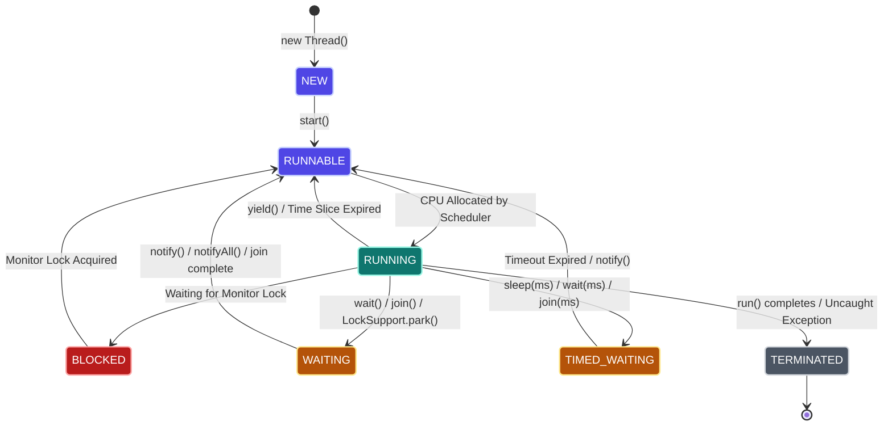
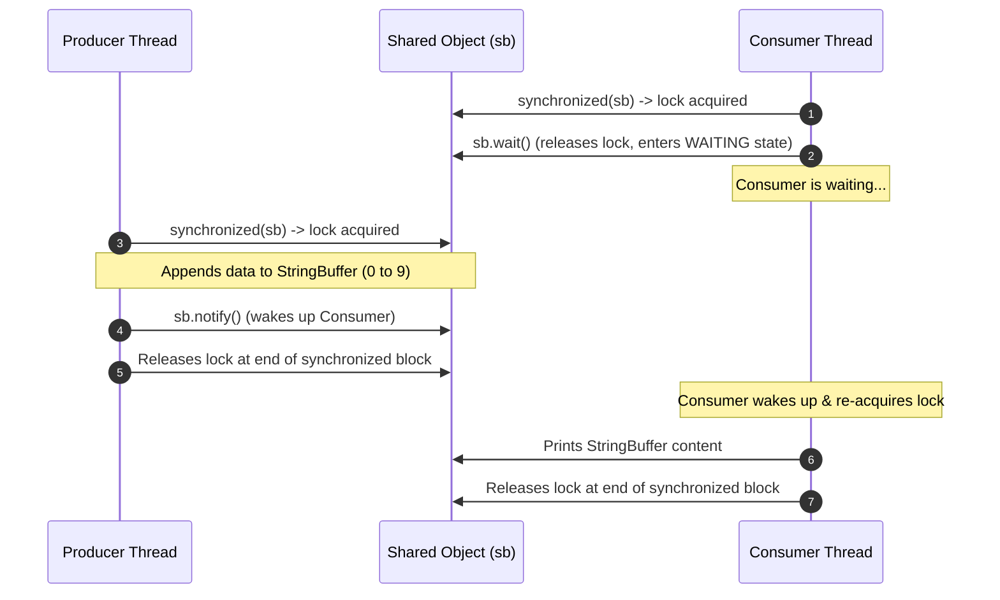
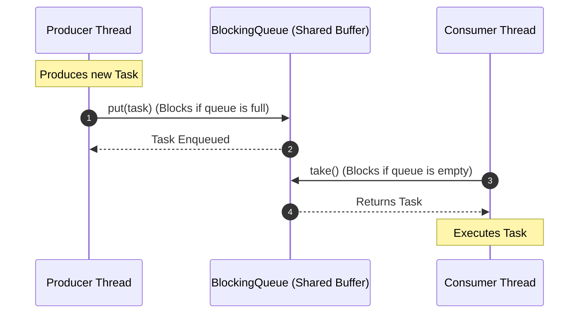
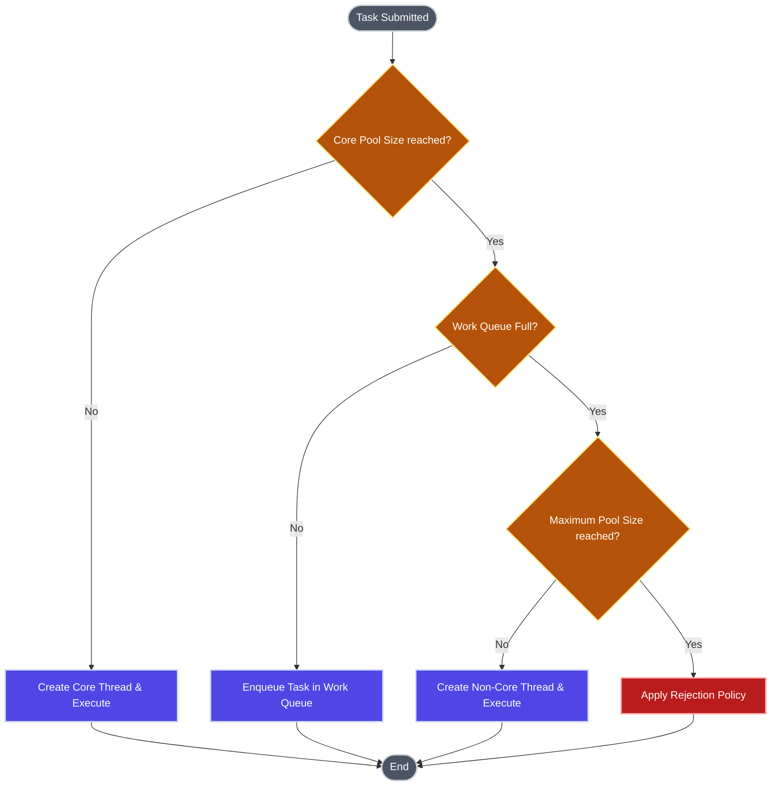
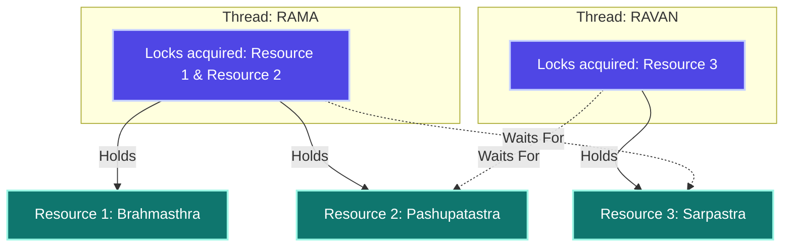
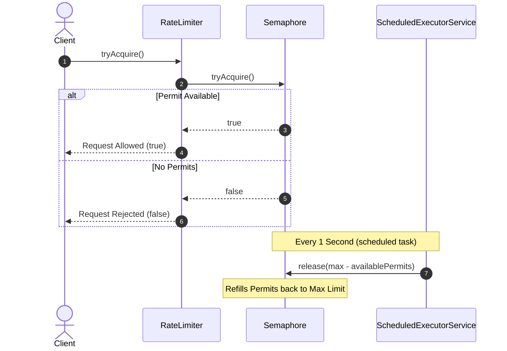

# MULTITHREADING & CONCURRENCY - ADVANCED INTERVIEW & CERTIFICATION GUIDE
> *Target Level: 7+ Years Experience | Senior Java Developer / Technical Architect*

---

## SECTION 1: SOURCE SYNC & COVERAGE ANALYSIS

This guide synchronizes notes from [Java_Notes.txt](file:///e:/Teja_Interview_preparation/My_Interview_Preparation/Java_jdbc_hibernate_SpringBoot/Java_Notes.txt) (lines 6747 to 8283) with advanced enterprise concurrency practices.

| Source Material | Concepts Synthesized | Coverage Status |
| :--- | :--- | :--- |
| **Java_Notes.txt** | Thread Creation, Lifecycle, Priorities, Thread Names, Scheduler, `join()`, `isAlive()`, `synchronized` locks, Thread Groups, Daemon Threads, Inter-thread Communication (`wait`/`notify`/`notifyAll`), `IllegalMonitorStateException`, `IllegalThreadStateException`. | Fully Integrated (100%) |
| **Advanced Concurrency** | Executor Framework, ThreadPoolExecutor Internals, ReentrantLock, volatile memory barriers, Fork/Join work-stealing, CountDownLatch, CyclicBarrier, Semaphores, CompletableFuture pipelines, ThreadLocal leaks, Virtual Threads (Project Loom). | Fully Integrated (100%) |

---

## SECTION 2: CONCURRENCY FOUNDATIONS & THREAD LIFE CYCLES

### Thread Lifecycle States

A thread in Java progresses through various states. While the JVM utilizes the standard `Thread.State` enum states, conceptual models often distinguish between a thread being ready to run (`RUNNABLE`) and actively executing on a CPU core (`RUNNING`).



### Thread vs Runnable vs Callable

These three options represent the progression of thread definition in Java.

| Metric | Thread (Class) | Runnable (Interface) | Callable\<V\> (Interface) |
| :--- | :--- | :--- | :--- |
| **Source Version** | JDK 1.0 | JDK 1.0 | JDK 1.5 |
| **Inheritance** | Single inheritance block (limits extending other classes). | Flexible. Allows extending other classes. | Flexible. Allows extending other classes. |
| **Return Value** | No (`void run()`). | No (`void run()`). | Yes (`V call()`). |
| **Exceptions** | Only unchecked exceptions can be thrown. | Only unchecked exceptions can be thrown. | Can throw checked exceptions directly. |
| **Retrieval Tool** | N/A | N/A | `Future<V>` or `CompletableFuture<V>`. |

#### Code Implementation
```java
import java.util.concurrent.*;

// 1. Thread Extension
class CustomThread extends Thread {
    @Override
    public void run() {
        System.out.println("Executing inside CustomThread: " + Thread.currentThread().getName());
    }
}

// 2. Runnable Implementation
class CustomRunnable implements Runnable {
    @Override
    public void run() {
        System.out.println("Executing inside CustomRunnable: " + Thread.currentThread().getName());
    }
}

// 3. Callable Implementation
class CustomCallable implements Callable<Integer> {
    @Override
    public Integer call() throws Exception {
        System.out.println("Executing inside CustomCallable: " + Thread.currentThread().getName());
        return 42;
    }
}

public class MainDemo {
    public static void main(String[] args) throws Exception {
        // Run Thread
        CustomThread t1 = new CustomThread();
        t1.start();

        // Run Runnable
        Thread t2 = new Thread(new CustomRunnable());  
        t2.start();

        // Run Callable
        ExecutorService executor = Executors.newFixedThreadPool(1);
        Future<Integer> future = executor.submit(new CustomCallable());
        Integer result = future.get(); // Blocks main thread until complete
        System.out.println("Callable Returned Value: " + result);
        executor.shutdown();
    }
}
```

### Thread Priorities & The Thread Scheduler

The **Thread Scheduler** is a JVM component that schedules runnable threads on available CPUs based on two main factors:
1. **Priority**: A relative value between `1` (`Thread.MIN_PRIORITY`) and `10` (`Thread.MAX_PRIORITY`), with a default of `5` (`Thread.NORM_PRIORITY`). Higher-priority threads receive preferential CPU allocation.
2. **Time of Arrival**: If priorities match, threads are processed in a First-In-First-Out (FIFO) queue style based on arrival order in the `RUNNABLE` queue.

> [!WARNING]
> Thread priorities are host-OS dependent. The JVM maps priorities to underlying OS levels, meaning priorities are not guaranteed to enforce execution order. Avoid using thread priorities to manage application logic flow.

### Main Thread Execution & Thread Property Manipulation

When a Java program starts, the JVM launches the **Main Thread**. The `main()` method serves as its entry point. You can dynamically query and update properties of the active thread (like its name and priority).

#### Code Example: Accessing and Renaming the Main Thread
```java
public class MainThreadDemo {
    public static void main(String[] args) {
        System.out.println("Execution starts in Main Method.");
        
        // Retrieve current executing thread reference
        Thread current = Thread.currentThread();
        System.out.println("Default Thread Status: " + current); // Format: Thread[ID,Name,Priority,GroupName]
        
        // Modify thread name and priority
        current.setName("<----Teja Custom Thread---->");
        current.setPriority(7);
        
        System.out.println("Modified Thread Status: " + current);
        System.out.println("Modified Thread Name: " + current.getName());
    }
}
```
**Output:**
```text
Execution starts in Main Method.
Default Thread Status: Thread[#1,main,5,main]
Modified Thread Status: Thread[#1,<----Teja Custom Thread---->,7,main]
Modified Thread Name: <----Teja Custom Thread---->
```

---

## SECTION 3: THREAD CREATION STYLES & CONTROL MECHANISMS

There are several ways to instantiate and invoke threads in Java.

### Four Ways to Define and Launch Threads

```java
public class ThreadCreationStyles {
    public static void main(String[] args) {
        // 1. Class Extension
        Thread t1 = new CustomThread();
        t1.start();

        // 2. Runnable Interface Implementation
        Thread t2 = new Thread(new CustomRunnable());
        t2.start();

        // 3. Anonymous Inner Class
        Thread t3 = new Thread(new Runnable() {
            @Override
            public void run() {
                System.out.println("Anonymous Inner Class execution.");
            }
        });
        t3.start();

        // 4. Lambda Expression (Cleanest syntax for functional interface Runnable)
        Thread t4 = new Thread(() -> System.out.println("Lambda Thread execution."));
        t4.start();
    }
}
```

### Thread Control Methods

* **`Thread.sleep(long millis)`**: Enters the `TIMED_WAITING` state, suspending execution temporarily. It does **not** release locks.
* **`Thread.yield()`**: Suggests to the scheduler that the current thread is willing to yield its current CPU time slice. The scheduler can ignore this hint.
* **`Thread.isAlive()`**: Tests if a thread has started but has not yet terminated.
* **`Thread.join()`**: Pauses the calling thread until the target thread finishes execution.

#### Code Example: Single vs. Multithreaded Execution Sequence
When executing sequential tasks on a single thread (like the main thread), each task blocks the next. In a multithreaded design, tasks run concurrently, but you can synchronize them using `join()`.

```java
// Thread representing sequential or synchronized task execution
class Alpha extends Thread {
    @Override
    public void run() {
        String name = Thread.currentThread().getName();
        if (name.equals("BANKING")) {
            executeTask("Banking Task");
        } else if (name.equals("PRINTING")) {
            executeTask("Printing Task");
        } else {
            executeTask("Calculation Task");
        }
    }

    private void executeTask(String taskName) {
        try {
            System.out.println("******** " + taskName + " Started ********");
            for (int i = 0; i < 3; i++) {
                Thread.sleep(1000);
                System.out.println(taskName + " running step " + i);
            }
            System.out.println("******** " + taskName + " Completed ********");
        } catch (InterruptedException e) {
            System.out.println("Task Interrupted: " + e.getMessage());
        }
    }
}

public class ThreadControlDemo {
    public static void main(String[] args) throws InterruptedException {
        Thread bank = new Alpha();
        Thread print = new Alpha();
        Thread calc = new Alpha();

        bank.setName("BANKING");
        print.setName("PRINTING");
        calc.setName("CALCULATE");

        // Concurrent execution sequence managed with join()
        bank.start();
        bank.join(); // Main thread blocks until 'bank' completes execution

        print.start();
        print.join(); // Main thread blocks until 'print' completes execution

        calc.start(); // Runs concurrently with main thread now
    }
}
```

#### Code Example: Polling with `isAlive()`
```java
class WorkerThread extends Thread {
    @Override
    public void run() {
        try {
            Thread.sleep(1000);
        } catch (InterruptedException ignored) {}
    }
}

public class PollingDemo {
    public static void main(String[] args) throws InterruptedException {
        WorkerThread worker = new WorkerThread();
        worker.start();

        while (worker.isAlive()) {
            System.out.println("Main thread: Worker is still alive. Waiting...");
            Thread.sleep(200);
        }
        System.out.println("Main thread: Worker finished. Continuing main logic.");
    }
}
```

### Uncaught Exceptions in Threads

In Java multithreading, each thread is independent. If an uncaught exception occurs within one thread, it terminates that specific thread. Other threads continue executing unaffected.

#### Code Example: Exception Isolation
```java
public class ExceptionIsolationDemo {
    public static void main(String[] args) {
        Thread worker1 = new Thread(() -> {
            System.out.println("Worker 1 running normally.");
            try { Thread.sleep(500); } catch (InterruptedException e) {}
            System.out.println("Worker 1 finished.");
        });

        Thread worker2 = new Thread(() -> {
            System.out.println("Worker 2 running. Encountering an division by zero error...");
            int result = 10 / 0; // Throws ArithmeticException
            System.out.println("This statement will not execute.");
        });

        worker1.start();
        worker2.start();
    }
}
```

> [!TIP]
> You can handle uncaught exceptions globally or per-thread by defining an implementation of `Thread.UncaughtExceptionHandler`:
> ```java
> worker2.setUncaughtExceptionHandler((thread, throwable) -> {
>     System.err.printf("Exception caught in thread %s: %s%n", thread.getName(), throwable.getMessage());
> });
> ```

#### Key Takeaways
- Threads can be declared by extending `Thread` or implementing `Runnable` / `Callable`. Implementing interfaces is preferred to avoid single inheritance limits.
- Call `start()` to launch a thread. Calling `run()` directly executes it synchronously in the caller thread, bypassing the Thread Scheduler.
- `join()` enforces synchronous boundaries by blocking the caller thread until the target thread finishes execution.

---

## SECTION 4: CONCURRENCY CONTROL & SYNCHRONIZATION

When multiple threads access shared mutable data, synchronization is required to prevent race conditions and guarantee memory consistency.

### Standard Object Monitors vs. ReentrantLock

| Feature | `synchronized` (Keyword) | `ReentrantLock` (API Class) |
| :--- | :--- | :--- |
| **Lock Type** | Implicit (automatically acquired and released). | Explicit (programmer calls `.lock()` and `.unlock()`). |
| **Timeout Support** | No. Threads block indefinitely. | Yes. Supports `.tryLock(timeout, unit)`. |
| **Interruptible Lock** | No. Blocks until lock is acquired. | Yes. Supports `.lockInterruptibly()`. |
| **Fairness Allocation** | No (JVM chooses next thread arbitrarily). | Optional (`new ReentrantLock(true)` enforces FIFO). |
| **Condition Variables** | Single condition queue per object (via `wait()`/`notify()`). | Multiple condition queues per lock instance via `Condition`. |
| **Lock Scope** | Structured block or method. | Unstructured. Can cross method boundaries. |

### Lock Mechanism Differences: `join()` vs. `synchronized`

While both mechanisms control execution flow, they serve distinct synchronization purposes:

| Aspect | `join()` (Method) | `synchronized` (Block/Keyword) |
| :--- | :--- | :--- |
| **Core Purpose** | Wait for the physical lifecycle completion of another thread. | Control mutual exclusion to a shared resource among active threads. |
| **Lock Mechanism** | Uses low-level `wait()` on the target thread object. | Acquires the monitor lock associated with the specified object wrapper. |
| **Execution Flow** | Pauses caller until target thread enters the `TERMINATED` state. | Sequentially controls access to a code block for active threads. |

### The volatile Keyword

The `volatile` keyword guarantees **thread visibility** and prevents **instruction reordering** around volatile writes.

```text
CPU Core 1 Cache (volatile write) ----> [ MAIN MEMORY ] ----> CPU Core 2 Cache (volatile read)
```

1. **Memory Visibility**: Writes to a volatile variable are immediately flushed to main memory, making the change visible to all other CPU cores. Reads are fetched directly from main memory.
2. **Instruction Reordering Prevention**: The compiler and CPU are prohibited from reordering reads and writes around a volatile variable (using memory barriers).
3. **No Atomicity**: `volatile` does **not** provide mutual exclusion. Compound operations (like `count++`) are not atomic and require locks or atomic variables.

#### Code Example: Volatile Flag with Double-Check Locking
```java
// Thread-safe Singleton utilizing volatile to prevent half-initialized object exposure
public class DoubleCheckLockingSingleton {
    private static volatile DoubleCheckLockingSingleton instance;

    private DoubleCheckLockingSingleton() {}

    public static DoubleCheckLockingSingleton getInstance() {
        if (instance == null) { // First Check (No Lock)
            synchronized (DoubleCheckLockingSingleton.class) {
                if (instance == null) { // Second Check (With Lock)
                    instance = new DoubleCheckLockingSingleton();
                }
            }
        }
        return instance;
    }
}
```

### ReentrantLock in Action

```java
import java.util.concurrent.locks.ReentrantLock;
import java.util.concurrent.TimeUnit;

class Account {
    private double balance;
    public Account(double bal) { this.balance = bal; }
    public void debit(double val) { balance -= val; }
    public void credit(double val) { balance += val; }
}

public class AccountTransferService {
    private final ReentrantLock lock = new ReentrantLock(true); // Fair allocation lock

    public void transferFunds(Account source, Account destination, double amount) {
        try {
            // Attempt to acquire lock with a 2-second timeout
            if (lock.tryLock(2, TimeUnit.SECONDS)) {
                try {
                    source.debit(amount);
                    destination.credit(amount);
                    System.out.println("Transfer successful of: " + amount);
                } finally {
                    lock.unlock(); // Ensure lock is released in finally block
                }
            } else {
                System.out.println("Failed to acquire lock. Retrying later.");
            }
        } catch (InterruptedException e) {
            Thread.currentThread().interrupt();
            System.err.println("Thread interrupted during transfer lock attempt.");
        }
    }
}
```

### ReadWriteLock for Read-Heavy Caching

```java
import java.util.concurrent.locks.ReadWriteLock;
import java.util.concurrent.locks.ReentrantReadWriteLock;
import java.util.HashMap;
import java.util.Map;

public class CacheService {
    private final Map<String, String> cache = new HashMap<>();
    private final ReadWriteLock rwLock = new ReentrantReadWriteLock();

    public String getValue(String key) {
        rwLock.readLock().lock(); // Multiple threads can read concurrently
        try {
            return cache.get(key);
        } finally {
            rwLock.readLock().unlock();
        }
    }

    public void putValue(String key, String value) {
        rwLock.writeLock().lock(); // Exclusive lock; blocks readers and other writers
        try {
            cache.put(key, value);
        } finally {
            rwLock.writeLock().unlock();
        }
    }
}
```

### Key Takeaways
- Synchronization prevents race conditions by enforcing **mutual exclusion** (ensuring only one thread can access a code block at a time) and **visibility** (ensuring modifications to shared data are visible to other threads).
- `volatile` solves memory visibility issues but does not provide thread safety for non-atomic operations (like incrementing a counter).
- Always release explicit locks (`ReentrantLock`) in a `finally` block to prevent thread lock leaks.

---

## SECTION 5: ADVANCED CONCURRENCY MECHANISMS & INTER-THREAD COMMUNICATION

### ThreadGroups

A `ThreadGroup` is a JVM component that lets you organize multiple threads into a single unit. It allows you to monitor threads and perform administrative operations, like stopping or interrupting all threads in the group.

```java
public class ThreadGroupDemo {
    public static void main(String[] args) {
        ThreadGroup paymentGroup = new ThreadGroup("Payments");

        Thread t1 = new Thread(paymentGroup, () -> {
            try { Thread.sleep(2000); } catch (InterruptedException ignored) {}
        }, "VisaTask");

        Thread t2 = new Thread(paymentGroup, () -> {
            try { Thread.sleep(2000); } catch (InterruptedException ignored) {}
        }, "MastercardTask");

        t1.start();
        t2.start();

        // Print Group details
        paymentGroup.list();
        System.out.println("Active Threads in Group: " + paymentGroup.activeCount());
        
        // Interrupt all threads in the group
        paymentGroup.interrupt();
    }
}
```

### Daemon Threads

A **Daemon Thread** is a background service thread (such as JVM Garbage Collection). 
- **JVM Exit Behavior**: The JVM terminates automatically when all non-daemon threads finish, even if daemon threads are still running.
- **Rules**: You must call `setDaemon(true)` on a thread **before** calling `start()`.

> [!CAUTION]
> Calling `setDaemon(true)` on an active, running thread throws an `IllegalThreadStateException`.

#### Code Example: Daemon Thread Violation
```java
public class DaemonThreadExample {
    public static void main(String[] args) {
        Thread worker = new Thread(() -> {
            while (true) {
                System.out.println("Daemon processing background tasks...");
                try { Thread.sleep(1000); } catch (InterruptedException ignored) {}
            }
        });

        worker.start();
        try {
            // Attempting to set daemon status after start
            worker.setDaemon(true); 
        } catch (IllegalThreadStateException ex) {
            System.err.println("CRITICAL ERROR: Cannot set daemon status after thread start: " + ex);
        }
    }
}
```

### Inter-Thread Communication: wait(), notify(), and notifyAll()

Inter-thread communication allows threads to coordinate actions using shared monitor locks.



#### Why are wait/notify defined in Object instead of Thread?
These methods coordinate access to shared state. Since lock ownership is associated with the **object monitor** (which wraps any shared data structure like `StringBuffer`, `Account`, etc.), these methods must be accessible on every object. Placing them in `Object` allows any instance to serve as a synchronization lock.

> [!IMPORTANT]
> - `wait()`, `notify()`, and `notifyAll()` must only be called from within a **synchronized block or method**.
> - Calling these methods without holding the monitor lock throws an `IllegalMonitorStateException`.

#### Low-Level Inter-Thread Communication with a Shared Buffer
The following example demonstrates coordinating two threads using a shared `StringBuffer` buffer.

```java
class Producer extends Thread {
    final StringBuffer sb;
    public Producer(StringBuffer sb) { this.sb = sb; }

    @Override
    public void run() {
        synchronized (sb) {
            for (int i = 0; i < 5; i++) {
                try {
                    sb.append(i).append(" : ");
                    Thread.sleep(100);
                    System.out.println("Producer appended: " + i);
                } catch (InterruptedException e) {
                    Thread.currentThread().interrupt();
                }
            }
            // Notify the consumer thread waiting on this monitor
            sb.notify();
        }
    }
}

class Consumer extends Thread {
    final Producer producer;
    public Consumer(Producer producer) { this.producer = producer; }

    @Override
    public void run() {
        // Must synchronize on the shared monitor object
        synchronized (producer.sb) {
            try {
                System.out.println("Consumer waiting for producer data...");
                producer.sb.wait(); // Yields lock and enters WAITING state
                
                System.out.println("Consumer resumed. Buffer Content: " + producer.sb);
            } catch (InterruptedException e) {
                Thread.currentThread().interrupt();
            }
        }
    }
}

public class LowLevelCommsDemo {
    public static void main(String[] args) {
        StringBuffer sharedBuffer = new StringBuffer();
        Producer prod = new Producer(sharedBuffer);
        Consumer cons = new Consumer(prod);

        cons.start(); // Start consumer first to ensure it is waiting
        try { Thread.sleep(50); } catch (InterruptedException ignored) {}
        prod.start();
    }
}
```

#### Key Takeaways
- Use `setDaemon(true)` to mark background threads. They run as long as at least one user thread is active.
- `wait()` pauses the current thread and releases its lock. This allows other threads to acquire the lock and perform operations on the shared resource.
- Use `notifyAll()` instead of `notify()` if multiple threads are waiting on the same resource, ensuring all waiting threads are notified.

---

## SECTION 6: CONCURRENCY UTILITIES & ADVANCED DATASTRUCTURES

### CountDownLatch vs. CyclicBarrier vs. Semaphore

| Parameter | `CountDownLatch` | `CyclicBarrier` | `Semaphore` |
| :--- | :--- | :--- | :--- |
| **Purpose** | Forces one or more threads to wait until N tasks complete. | Forces a group of threads to wait until they all reach a common barrier point. | Controls access to a resource pool by maintaining a set of permits. |
| **Reusability** | One-time use. The count cannot be reset once it reaches 0. | Reusable. The barrier can be reset using `.reset()`. | Reusable. Permits are returned via release calls. |
| **Principal Methods** | `countDown()`, `await()` | `await()` | `acquire()`, `release()` |
| **Thread Control** | Unbalanced. Workers decrease count; supervisors wait. | Balanced. All threads wait at the barrier. | Flexible. Permits can be acquired and released by any thread. |

#### CountDownLatch in Action
```java
import java.util.concurrent.CountDownLatch;

class MicroserviceLoader implements Runnable {
    private final String name;
    private final CountDownLatch latch;

    public MicroserviceLoader(String name, CountDownLatch latch) {
        this.name = name;
        this.latch = latch;
    }

    @Override
    public void run() {
        try {
            System.out.println("Initializing Service Component: " + name);
            Thread.sleep(1000); // Simulate startup time
            System.out.println("Component ready: " + name);
        } catch (InterruptedException ignored) {
        } finally {
            latch.countDown(); // Decrease initialization count
        }
    }
}

public class ServiceBootstrap {
    public static void main(String[] args) throws InterruptedException {
        CountDownLatch bootstrapLatch = new CountDownLatch(3);

        new Thread(new MicroserviceLoader("DatabaseConnection", bootstrapLatch)).start();
        new Thread(new MicroserviceLoader("MessagingEngine", bootstrapLatch)).start();
        new Thread(new MicroserviceLoader("CacheStore", bootstrapLatch)).start();

        // Main thread waits until initialization count reaches 0
        bootstrapLatch.await();
        System.out.println("All services initialized. Application bootstrap complete.");
    }
}
```

#### Semaphore in Action (Thread Pool Limit)
```java
import java.util.concurrent.Semaphore;

public class DatabaseConnectionPool {
    private final Semaphore permits = new Semaphore(3); // Allow up to 3 concurrent connections

    public void executeQuery(String query) {
        try {
            permits.acquire(); // Acquire permit; blocks if no permits are available
            try {
                System.out.println(Thread.currentThread().getName() + " executing query: " + query);
                Thread.sleep(1000);
            } finally {
                System.out.println(Thread.currentThread().getName() + " finished query. Releasing permit.");
                permits.release(); // Release permit back to the pool
            }
        } catch (InterruptedException e) {
            Thread.currentThread().interrupt();
        }
    }
}
```

### ForkJoinPool & Work-Stealing Algorithm

The `ForkJoinPool` is designed for recursive, divide-and-conquer tasks. It is also the default execution pool for Java Parallel Streams.

```text
ForkJoinPool Work Queue Structure:

Thread 1 Deque:  [Task A] [Task B] [Task C] <--- Owner Push/Pop (Tail)
                               ^
Thread 2 Deque:  [Task D]      | <-------------- Idle Thread Steals Task (Head)
```

- **Double-Ended Queues (Deques)**: Each worker thread maintains its own deque of tasks.
- **LIFO Processing**: The thread owner pushes and pops tasks from the tail of its deque.
- **Work-Stealing (FIFO)**: Idle threads steal tasks from the head of other threads' deques to maximize CPU core utilization.

### ThreadLocal: Thread-Scoped Variables

`ThreadLocal` provides thread-local variables. Each thread holds a separate, independent copy of the variable, which is accessible via `get()` and `set()`.

> [!CAUTION]
> **Memory Leak Risk**: ThreadLocal instances are stored in ThreadLocalMap fields of the underlying `Thread` object. When using thread pools (like `ExecutorService`), threads are reused, meaning they are never garbage collected. If you do not call `.remove()` after a transaction, the ThreadLocal reference is leaked.

#### Code Example: Secure ThreadLocal Lifecycle
```java
import java.text.SimpleDateFormat;
import java.util.UUID;

public class UserSessionContextHolder {
    // Thread-safe formatter instance scoped per thread
    private static final ThreadLocal<SimpleDateFormat> dateFormatter = 
        ThreadLocal.withInitial(() -> new SimpleDateFormat("yyyy-MM-dd HH:mm:ss"));

    private static final ThreadLocal<String> traceIdHolder = new ThreadLocal<>();

    public static void setTraceId(String traceId) {
        traceIdHolder.set(traceId);
    }

    public static String getTraceId() {
        return traceIdHolder.get();
    }

    public static String formatTimestamp(long epoch) {
        return dateFormatter.get().format(new java.util.Date(epoch));
    }

    // Always clear the variable inside a finally block to prevent memory leaks
    public static void clear() {
        traceIdHolder.remove();
        dateFormatter.remove();
    }
}
```

### Producer-Consumer Implementation: `BlockingQueue`

While low-level synchronization can be implemented using `wait()` and `notify()`, using a thread-safe `BlockingQueue` is preferred for modern applications.



#### Code Example: BlockingQueue Implementation
```java
import java.util.concurrent.ArrayBlockingQueue;
import java.util.concurrent.BlockingQueue;

class Task {
    private final int id;
    public Task(int id) { this.id = id; }
    @Override
    public String toString() { return "Task#" + id; }
}

public class ProducerConsumerModern {
    public static void main(String[] args) {
        BlockingQueue<Task> taskBuffer = new ArrayBlockingQueue<>(10);

        // Producer Thread
        Thread producer = new Thread(() -> {
            int count = 0;
            try {
                while (true) {
                    Task task = new Task(++count);
                    taskBuffer.put(task); // Blocks if the queue is full
                    System.out.println("Produced and enqueued: " + task);
                    Thread.sleep(100);
                }
            } catch (InterruptedException e) {
                Thread.currentThread().interrupt();
            }
        });

        // Consumer Thread
        Thread consumer = new Thread(() -> {
            try {
                while (true) {
                    Task task = taskBuffer.take(); // Blocks if the queue is empty
                    System.out.println("Consumed and processed: " + task);
                    Thread.sleep(300); // Simulate slower consumption
                }
            } catch (InterruptedException e) {
                Thread.currentThread().interrupt();
            }
        });

        producer.start();
        consumer.start();
    }
}
```

#### Key Takeaways
- Use **CountDownLatch** to coordinate startup processes (wait for initialization tasks to finish before starting).
- Use **CyclicBarrier** to coordinate phase-based computations (like cyclic algorithm steps).
- Always clean up **ThreadLocal** variables using `.remove()` when working with thread pools to prevent memory leaks.

---

## SECTION 7: MODERN ASYNCHRONOUS API & CONCURRENCY

### ThreadPoolExecutor Core Internals

The JVM provides `ThreadPoolExecutor` to manage thread lifecycles and execute incoming tasks.



#### The Seven Construction Parameters
```java
import java.util.concurrent.*;

public class ThreadPoolFactory {
    public static ExecutorService createCustomPool() {
        return new ThreadPoolExecutor(
            10,                                       // 1. corePoolSize (minimum active threads kept alive)
            50,                                       // 2. maximumPoolSize (maximum pool allocation limit)
            60L,                                      // 3. keepAliveTime (idle thread timeout before termination)
            TimeUnit.SECONDS,                         // 4. timeUnit (time unit for idle timeout)
            new LinkedBlockingQueue<>(100),           // 5. workQueue (holds pending tasks)
            Executors.defaultThreadFactory(),         // 6. threadFactory (creates new thread wrappers)
            new ThreadPoolExecutor.CallerRunsPolicy() // 7. rejectedExecutionHandler (handles tasks when queue is full)
        );
    }
}
```

#### Task Rejection Policies
- **`AbortPolicy`** (Default): Throws `RejectedExecutionException`.
- **`CallerRunsPolicy`**: The thread submitting the task executes it. This slows down task submission (applying back-pressure).
- **`DiscardPolicy`**: Silently drops the task.
- **`DiscardOldestPolicy`**: Drops the oldest task in the work queue and retries the submission.

---

### CompletableFuture Advanced Pipelines

`CompletableFuture` supports asynchronous, non-blocking task execution and task composition.

#### Chaining API Calls
```java
import java.util.concurrent.CompletableFuture;
import java.util.concurrent.ExecutorService;
import java.util.concurrent.Executors;

class OrderDetails {
    private final String id;
    public OrderDetails(String id) { this.id = id; }
    public String getId() { return id; }
}

class Invoice {
    private final String details;
    public Invoice(String details) { this.details = details; }
    @Override
    public String toString() { return "InvoiceDetails[" + details + "]"; }
}

public class OrderWorkflowPipeline {
    private final ExecutorService pool = Executors.newFixedThreadPool(10);

    public void processOrder(String orderId) {
        CompletableFuture.supplyAsync(() -> fetchOrder(orderId), pool)
            .thenApply(this::validateOrder)                     // Synchronous transformation
            .thenCompose(order -> fetchInvoiceAsync(order, pool)) // Asynchronous chaining
            .thenAccept(invoice -> System.out.println("Processing complete: " + invoice))
            .exceptionally(ex -> {
                System.err.println("Pipeline failed: " + ex.getMessage());
                return null;
            });
    }

    private OrderDetails fetchOrder(String id) {
        return new OrderDetails(id);
    }

    private OrderDetails validateOrder(OrderDetails order) {
        System.out.println("Order validated: " + order.getId());
        return order;
    }

    private CompletableFuture<Invoice> fetchInvoiceAsync(OrderDetails order, ExecutorService exec) {
        return CompletableFuture.supplyAsync(() -> new Invoice("INV-" + order.getId()), exec);
    }
}
```

#### Methods for combining Futures
- **`allOf(cf1, cf2, ...)`**: Returns a future that completes when **all** input futures complete.
- **`anyOf(cf1, cf2, ...)`**: Returns a future that completes when **any** input future completes.

---

### Virtual Threads (Project Loom - Java 21+)

Virtual threads are lightweight threads managed by the JVM rather than the host operating system.

- **Scale**: You can run millions of virtual threads concurrently, whereas operating system thread pools are typically limited to thousands.
- **Mounting and Unmounting**: The JVM mounts virtual threads onto carrier OS threads. When a virtual thread encounters a blocking operation (like database calls or network requests), the JVM unmounts it and assigns the carrier thread to another task.

```text
Virtual Threads (V1, V2, V3...) ----> [ JVM Scheduler ] ----> OS Carrier Thread ----> Physical CPU Core
```

> [!WARNING]
> **Thread Pinning**: If a virtual thread runs inside a `synchronized` block or method, or calls a Native Method (JNI), it gets "pinned" to its carrier thread. This prevents the carrier thread from executing other virtual threads during blocking operations, reducing throughput. 
> To prevent this, use `ReentrantLock` instead of `synchronized`.

#### Key Takeaways
- **ThreadPoolExecutor** avoids thread creation overhead by reusing existing threads to process incoming tasks.
- **CompletableFuture** supports asynchronous, non-blocking pipelines with built-in error handling.
- **Virtual Threads** are optimized for I/O-bound workloads. Avoid thread pinning by using `ReentrantLock` instead of `synchronized` for operations that perform I/O.

---

## SECTION 8: SCENARIO-BASED CONCURRENCY & SYSTEM DESIGN

### Deadlocks

A deadlock occurs when two or more threads block indefinitely, each waiting for a lock held by the other.



#### The Four Deadlock Conditions
1. **Mutual Exclusion**: Only one thread can hold a resource at a time.
2. **Hold and Wait**: A thread holding a resource can request additional resources.
3. **No Preemption**: Resources cannot be forcibly taken from a thread holding them.
4. **Circular Wait**: A closed chain of threads exists where each thread waits for a resource held by the next.

#### Code Example: Classic Deadlock (Opposing Lock Order)
This example simulates a deadlock when RAMA and RAVAN try to acquire weapons in opposite orders.
```java
class Immortal weapons implements Runnable {
    public final String resourceA = "Brahmasthra";
    public final String resourceB = "Pashupatastra";
    public final String resourceC = "Sarpastra";

    @Override
    public void run() {
        String name = Thread.currentThread().getName();
        if (name.equals("RAMA")) {
            acquireRama();
        } else {
            acquireRavan();
        }
    }

    private void acquireRama() {
        synchronized (resourceA) {
            System.out.println("RAMA acquired: " + resourceA);
            try { Thread.sleep(100); } catch (InterruptedException ignored) {}
            synchronized (resourceB) {
                System.out.println("RAMA acquired: " + resourceB);
                synchronized (resourceC) {
                    System.out.println("RAMA acquired: " + resourceC);
                }
            }
        }
    }

    private void acquireRavan() {
        // RAVAN acquires resources in the opposite order
        synchronized (resourceC) {
            System.out.println("RAVAN acquired: " + resourceC);
            try { Thread.sleep(100); } catch (InterruptedException ignored) {}
            synchronized (resourceB) {
                System.out.println("RAVAN acquired: " + resourceB);
                synchronized (resourceA) {
                    System.out.println("RAVAN acquired: " + resourceA);
                }
            }
        }
    }
}

public class DeadlockSimulation {
    public static void main(String[] args) {
        Immortal weapons = new Immortal();
        Thread t1 = new Thread(weapons, "RAMA");
        Thread t2 = new Thread(weapons, "RAVAN");
        t1.start();
        t2.start();
    }
}
```

#### Deadlock Detection
1. **JStack**: Run `jstack <pid>` to analyze thread dumps. The utility will print details if a deadlock is detected:
   ```text
   Found 1 deadlock.
   "RAMA": waiting to lock monitor 0x000001 (held by "RAVAN")
   "RAVAN": waiting to lock monitor 0x000002 (held by "RAMA")
   ```
2. **JConsole**: Connect JConsole to the running JVM instance and click "Detect Deadlock" under the Threads tab.

#### Deadlock Prevention Strategies
- **Lock Ordering**: Force all threads to acquire locks in the same order.
- **Lock Timeouts**: Use `tryLock(timeout, unit)` to release held locks if a new lock cannot be acquired within the timeout.

#### Code Example: Fixed Lock Order
```java
public class SafeLockOrder {
    private static final Object lock1 = new Object();
    private static final Object lock2 = new Object();

    public void safeMethod() {
        // Both methods must acquire lock1 first, then lock2
        synchronized (lock1) {
            synchronized (lock2) {
                System.out.println("Locks acquired safely in global order.");
            }
        }
    }
}
```

---

### Designing a Thread-Safe Rate Limiter

This design uses a `Semaphore` to limit execution counts and a `ScheduledExecutorService` to periodically reset available permits.



#### Code Implementation
```java
import java.util.concurrent.Executors;
import java.util.concurrent.ScheduledExecutorService;
import java.util.concurrent.Semaphore;
import java.util.concurrent.TimeUnit;

public class ConcurrencyRateLimiter {
    private final Semaphore permits;
    private final ScheduledExecutorService scheduler;
    private final int maxLimit;

    public ConcurrencyRateLimiter(int requestsPerSecond) {
        this.maxLimit = requestsPerSecond;
        this.permits = new Semaphore(requestsPerSecond);
        this.scheduler = Executors.newScheduledThreadPool(1);
        
        // Schedule permit refill task every second
        this.scheduler.scheduleAtFixedRate(() -> {
            int currentPermits = permits.availablePermits();
            int permitsToRelease = maxLimit - currentPermits;
            if (permitsToRelease > 0) {
                permits.release(permitsToRelease);
            }
        }, 1, 1, TimeUnit.SECONDS);
    }

    public boolean tryAcquire() {
        return permits.tryAcquire();
    }

    public void stop() {
        scheduler.shutdown();
    }
}
```

#### Key Takeaways
- Prevent deadlocks by enforcing a consistent lock acquisition order across all threads.
- Implement rate limiters using concurrency primitives like `Semaphore` and `ScheduledExecutorService`.

---

## SECTION 9: MASTER TECHNICAL FAQ & COMMON PITFALLS

### Q1. Why does calling `start()` create a new thread, while calling `run()` does not?
Calling `start()` instructs the JVM to allocate thread stack space and invoke the underlying OS thread creation process. This schedules the `run()` method to execute on a separate call stack. Calling `run()` directly executes the method synchronously on the caller's thread, bypassing thread scheduling.

### Q2. What happens if you call `setDaemon(true)` after a thread has started?
The JVM throws an `IllegalThreadStateException`. A thread's daemon status must be configured before calling `start()` to ensure the JVM can properly track active user threads.

### Q3. Why should you avoid synchronization inside Virtual Threads?
If a virtual thread executes inside a `synchronized` block or method, it gets **pinned** to its carrier OS thread. During blocking I/O operations, the carrier thread remains blocked and cannot process other virtual threads, reducing throughput. Use `ReentrantLock` instead of `synchronized` inside virtual threads to prevent pinning.

### Q4. What is the danger of not calling `remove()` on a `ThreadLocal` variable?
Thread pool threads (like those in `ExecutorService`) are reused across tasks and are never garbage collected. If you do not call `remove()` after a task completes, the value remains bound to the thread, leaking memory and potentially leaking security context information to subsequent tasks.

### Q5. What is the difference between `notify()` and `notifyAll()`?
`notify()` wakes up a single thread waiting on the object monitor, chosen arbitrarily by the JVM scheduler. `notifyAll()` wakes up all threads waiting on the monitor. Woken threads compete to re-acquire the monitor lock. Using `notifyAll()` is generally safer as it prevents threads from missing signals due to arbitrary scheduler decisions.
