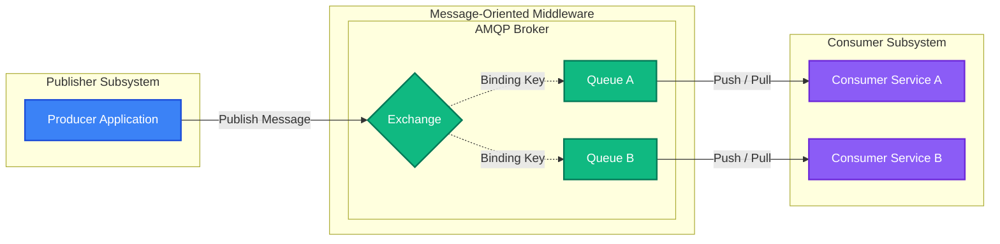
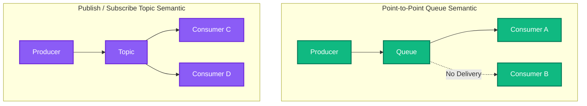
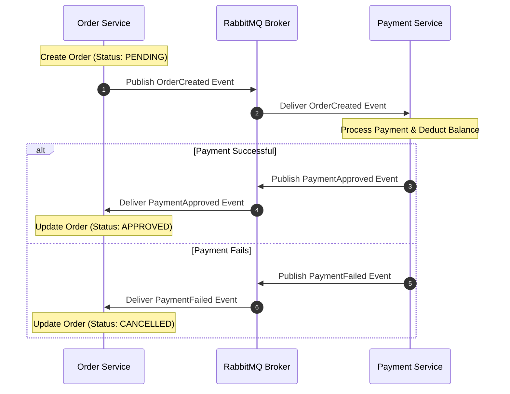
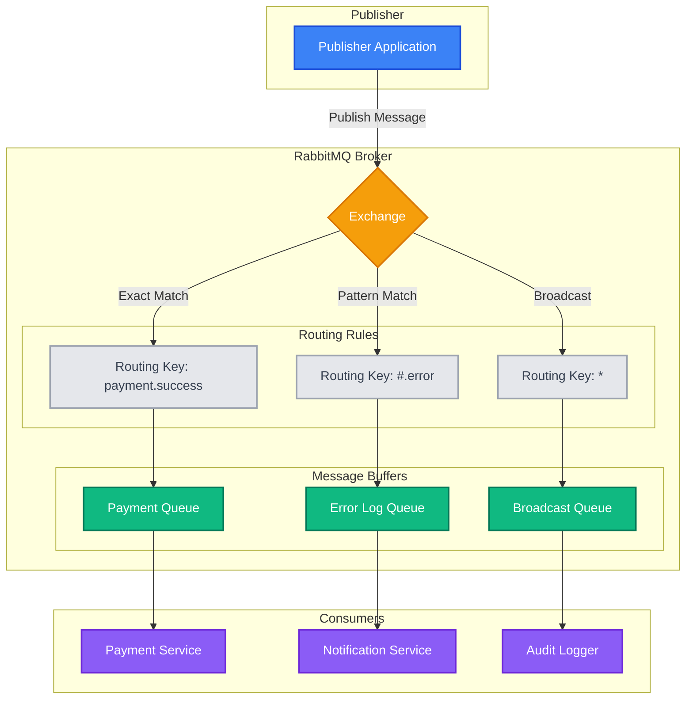
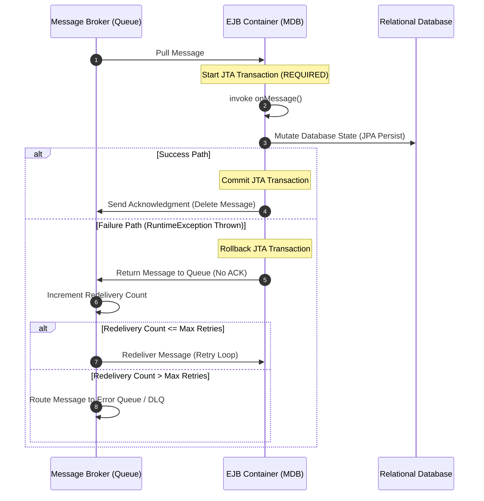
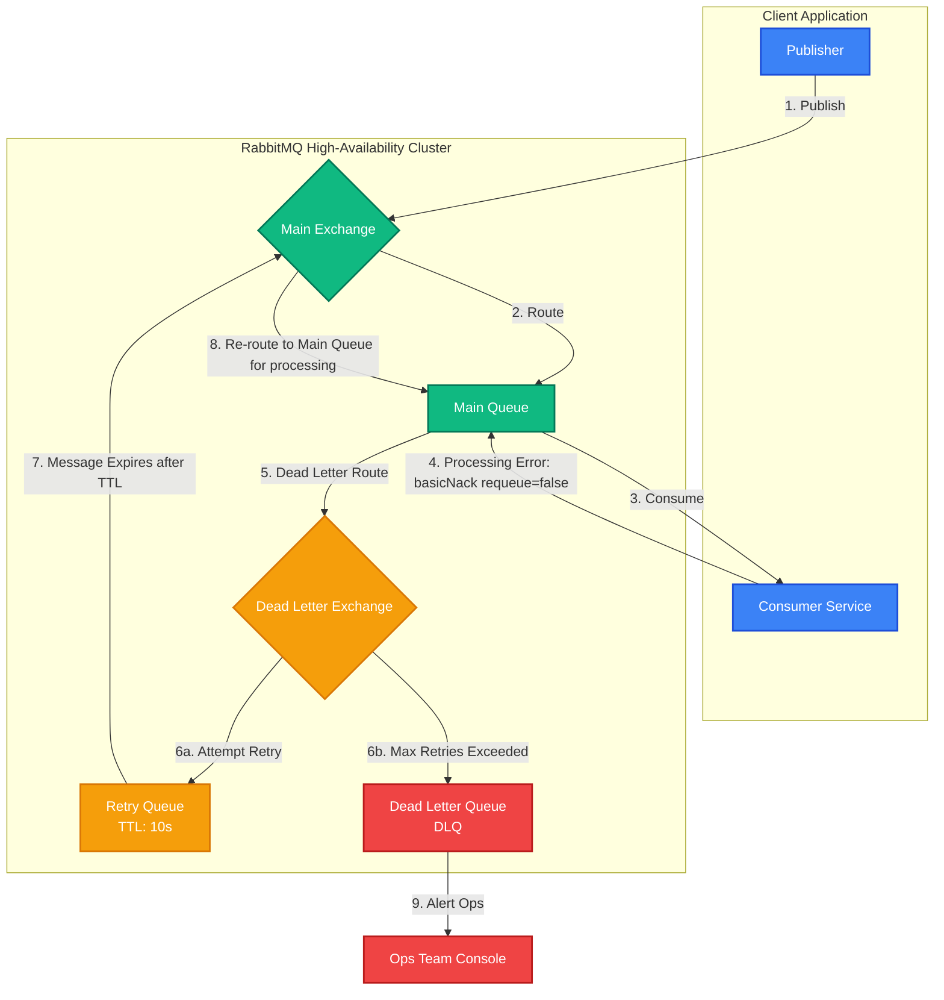
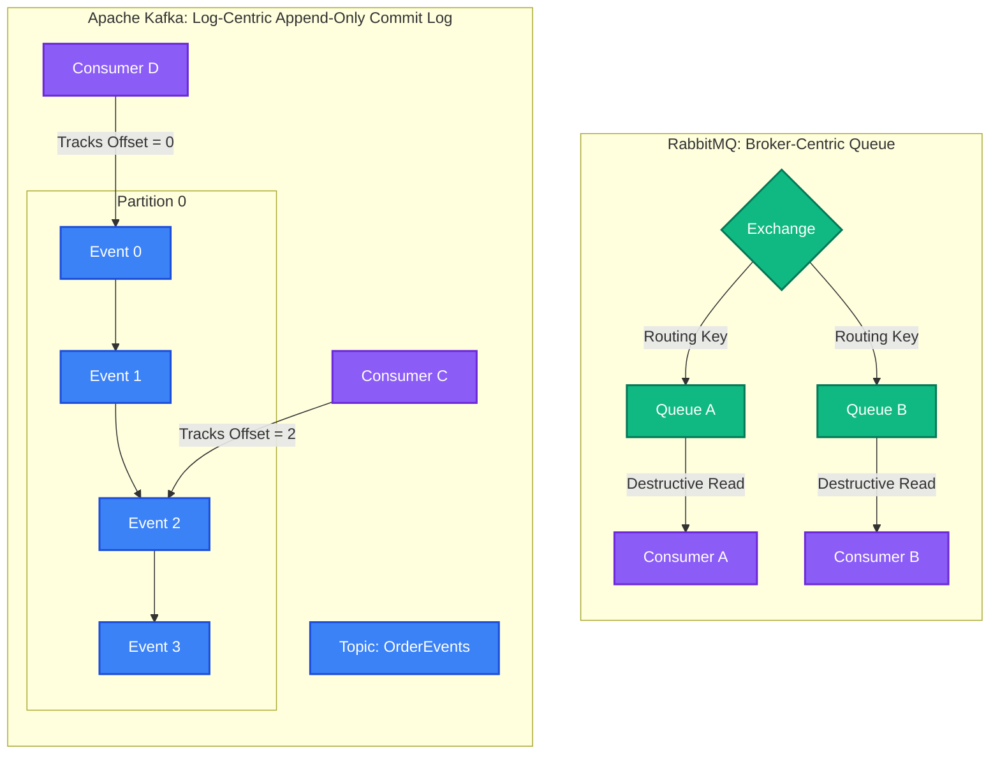

# RabbitMQ & Enterprise Messaging - Comprehensive Interview Preparation Guide
> **For: 7+ Years Experience Level | Lead Java & Microservices Developer**

---

## Section 1: Message-Oriented Middleware (MOM) & Protocols

### 1.1 What is Message-Oriented Middleware?
Message-Oriented Middleware (MOM) is a software or hardware infrastructure that supports sending and receiving messages between distributed systems. It acts as an intermediary, insulating application developers from the underlying complexities of diverse operating systems, network protocols, and hardware architectures.

MOM introduces a **distributed communications layer** that enables applications to interact asynchronously, meaning the sender does not need to wait for the receiver to process the message or even be online at the time of transmission.



---

### 1.2 Protocol and Standards Comparison
In distributed Java architectures, three primary messaging systems are encountered: **AMQP**, **JMS**, and **MQTT**.

| Feature | AMQP (Advanced Message Queuing Protocol) | JMS (Java Message Service) | MQTT (Message Queuing Telemetry Transport) |
| :--- | :--- | :--- | :--- |
| **Standard Type** | Wire-level Protocol (ISO/IEC 19464) | Java API Specification (JCP Standard) | Wire-level Protocol (OASIS Standard) |
| **Interoperability** | Multi-language and vendor agnostic. Any client can talk to any AMQP broker. | Restricted to JVM-based languages unless vendor-specific adapters are used. | Multi-language, highly interoperable across IoT/mobile networks. |
| **Routing Model** | Highly flexible via Exchanges (Direct, Fanout, Topic, Headers) and Bindings. | Basic models: Point-to-Point (Queues) and Publish/Subscribe (Topics). | Hierarchical topic paths (e.g., `sensor/livingroom/temp`). |
| **Payload Size** | Optimized for medium to large payloads (JSON, XML, binary). | Any Java object type (Text, Object, Bytes, Map, Stream). | Extremely small footprint; binary header is only 2 bytes. |
| **Target Use Case** | Enterprise application integration, microservices orchestration. | Legacy Java EE / Jakarta EE enterprise systems. | IoT, mobile devices, remote telemetry, low bandwidth networks. |

---

### 1.3 Messaging Semantics: Queue vs. Topic



*   **Queue (Point-to-Point)**:
    *   Each message is processed by **exactly one consumer**.
    *   If multiple consumers listen to the same queue, messages are distributed (usually round-robin).
    *   Messages are typically deleted from the queue immediately upon consumer acknowledgment.
*   **Topic (Publish/Subscribe)**:
    *   Messages are broadcasted to **all active subscribers** bound to the topic.
    *   Each subscriber receives its own copy of the message.
    *   Useful for event-driven systems where multiple downstream services need to react to the same event.

#### Key Takeaways
- **MOM** decouples systems in space and time, supporting robust asynchronous communications.
- **AMQP** is a wire protocol, ensuring language interoperability, whereas **JMS** is a Java-specific API.
- Use **Queues** for task distribution (one worker receives the task) and **Topics** for notification broadcasting (all subscribers receive the update).

---

## Section 2: Event-Driven Architectures & Design Patterns

### 2.1 The Fallacies of Distributed Computing in Cloud Native Systems
Cloud-native applications are composed of small, independent services. Building these architectures requires addressing the **Eight Fallacies of Distributed Computing**:
1. The network is reliable.
2. Latency is zero.
3. Bandwidth is infinite.
4. The network is secure.
5. Topology doesn’t change.
6. There is one administrator.
7. Transport cost is zero.
8. The network is homogeneous.

Because these assumptions are false, services must expect failures to occur at any time. Tight network coupling (synchronous HTTP/REST calls) cascades failures: if Service A calls Service B synchronously, and Service B is experiencing latency, Service A runs out of connection threads, causing a cascade of failures across the system.

---

### 2.2 Eventual Consistency and the Saga Pattern
To maintain database consistency without using slow, locking distributed transactions (2-Phase Commit), microservices use **Event-Driven Architecture (EDA)** to achieve **Eventual Consistency**.

#### Relational Data Store Separation
Database sharing between microservices is an anti-pattern. If two microservices share tables, changes in schema by one service break the other, coupling their deployments. Strategies include:
1.  **Schema per microservice**: Separate database schemas on the same server, with access controlled by database grants.
2.  **Database per microservice**: Distinct databases on a shared database server.
3.  **Database server per microservice**: The highest degree of isolation, ideal for independent scaling.

Because database sharing is forbidden, transactions cannot span database servers using classic JTA/2PC. Instead, the system uses an event-driven Saga pattern.



#### CQRS & Event Sourcing
*   **Command Query Responsibility Segregation (CQRS)**: Splits data access into two models: **Commands** (Write operations that mutate state but return no data) and **Queries** (Read operations that retrieve data without mutating state).
*   **Event Sourcing**: Stores every state change as an immutable sequence of events in an event store, rather than saving only the current state of an entity. The query model is synchronized by consuming these events. Specialized databases like Elasticsearch are often used to power the query side.

---

### 2.3 Service Merging Heuristics
If two microservices constantly exchange high volumes of synchronous or asynchronous messages to complete a single business function, it indicates their **bounded contexts** are incorrectly drawn. They are tightly coupled on wire-level events.
*   **Heuristic**: Merge them into a single service if the overhead of distributed network communication and eventual consistency handling outweighs the benefits of separate deployments, provided it does not break core domain-driven boundaries.

#### Key Takeaways
- **2-Phase Commit (2PC)** is acceptable between a microservice and its own local backing stores (e.g., database and messaging provider), but must never be used across network boundaries between distinct microservices.
- **Eventual consistency** uses a publish/subscribe model where coupling is limited to the schema of the exchanged messages.
- **CQRS** optimizes performance by decoupling write-heavy databases from read-optimized data stores (e.g., Elasticsearch).

---

## Section 3: RabbitMQ Architecture & Core Mechanics

RabbitMQ is an open-source message broker that natively implements the AMQP 0-9-1 protocol.



### 3.1 Core Components
1.  **Producer**: The client application that publishes messages to the exchange.
2.  **Exchange**: Receives messages from producers and determines routing to queues based on routing keys and bindings.
3.  **Binding**: A link or routing rule established between an exchange and a queue.
4.  **Routing Key**: An address attribute attached to the message metadata by the producer.
5.  **Queue**: A buffer that stores messages in memory/disk until consumed.
6.  **Consumer**: The client application that subscribes to queues and processes messages.

---

### 3.2 Exchange Types and Routing Logic

#### Direct Exchange
Routes messages to queues based on an **exact match** between the message's routing key and the binding key.
*   **Example**: 
    *   Exchange: `payment-exchange`
    *   Routing Key: `payment.success`
    *   Queue Bound with Key: `payment.success` -> Receives message.
    *   Queue Bound with Key: `payment.failed` -> Ignores message.

#### Fanout Exchange
Routes messages to **all queues** bound to it, ignoring the routing key. It functions as a classic broadcast mechanism.
*   **Example**: 
    *   Exchange: `marketing-broadcast`
    *   Queues bound: `email-service-queue`, `sms-service-queue`, `push-notification-queue`.
    *   All three queues receive every published message.

#### Topic Exchange
Routes messages based on a wildcard match between the routing key and the binding pattern. The routing key must be a list of words delimited by dots (`.`).
*   **Wildcard Characters**:
    *   `*` (star) matches **exactly one word**.
    *   `#` (hash) matches **zero or more words**.
*   **Example**:
    *   Routing Key: `order.eu.premium.created`
    *   Binding `order.*.premium.created` -> Matches (matches `eu`).
    *   Binding `order.#` -> Matches (matches all words after `order`).
    *   Binding `order.*.created` -> Does not match (expects 3 words, got 4).

#### Headers Exchange
Routes messages based on header attributes within the message arguments rather than the routing key. Bindings specify headers and matching criteria using the `x-match` argument:
*   `x-match: all`: All specified headers must match.
*   `x-match: any`: At least one specified header must match.

---

### 3.3 Core Configuration Schema
When declaring queues in RabbitMQ, standard arguments control performance and behavior:
*   **Durable**: If set to `true`, the queue metadata and state survive broker restarts.
*   **Exclusive**: If set to `true`, the queue is restricted to the connection that declared it and is deleted when that connection closes.
*   **Auto-delete**: The queue is deleted when its last consumer unsubscribes.
*   **x-message-ttl**: Set in milliseconds. Defines how long a message can remain in the queue before being discarded or routed to a Dead Letter Exchange.
*   **x-dead-letter-exchange**: Name of the exchange to which expired or rejected messages are routed.

#### Key Takeaways
- **Topic exchanges** support flexible routing based on dot-separated hierarchical routing keys using `*` (one word) and `#` (zero or more words).
- **Fanout exchanges** ignore routing keys completely to perform high-performance message broadcasting.
- For production environments, configure **Durable** queues to prevent data loss on broker restarts.

---

## Section 4: Spring AMQP Integration & Code Patterns

### 4.1 Spring AMQP Configuration
Configure connection properties in `application.properties`:

```properties
spring.rabbitmq.host=localhost
spring.rabbitmq.port=5672
spring.rabbitmq.username=guest
spring.rabbitmq.password=guest

# Publisher-side reliability configurations
spring.rabbitmq.publisher-confirm-type=correlated
spring.rabbitmq.publisher-returns=true
```

---

### 4.2 RabbitMQ Infrastructure Declaration
Create a Java configuration class to programmatically declare exchanges, queues, and bindings:

```java
package com.example.rabbitmq.config;

import org.springframework.amqp.core.*;
import org.springframework.context.annotation.Bean;
import org.springframework.context.annotation.Configuration;

import java.util.HashMap;
import java.util.Map;

@Configuration
public class RabbitMQConfig {

    public static final String MAIN_EXCHANGE = "order-exchange";
    public static final String DLX_EXCHANGE = "order-dlx-exchange";
    
    public static final String PAYMENT_QUEUE = "payment-queue";
    public static final String PAYMENT_DLQ = "payment-dlq";
    
    public static final String PAYMENT_ROUTING_KEY = "order.payment.*";
    public static final String DLQ_ROUTING_KEY = "payment.dead.letter";

    // 1. Declare Main Topic Exchange
    @Bean
    public TopicExchange mainExchange() {
        return new TopicExchange(MAIN_EXCHANGE, true, false);
    }

    // 2. Declare Dead Letter Exchange (DLX)
    @Bean
    public TopicExchange deadLetterExchange() {
        return new TopicExchange(DLX_EXCHANGE, true, false);
    }

    // 3. Declare Durable Queue with DLX configuration
    @Bean
    public Queue paymentQueue() {
        Map<String, Object> arguments = new HashMap<>();
        // Configure DLX: Route dead messages to our dead-letter exchange
        arguments.put("x-dead-letter-exchange", DLX_EXCHANGE);
        // Configure DLX Routing Key: Routing key used when sending to the DLX
        arguments.put("x-dead-letter-routing-key", DLQ_ROUTING_KEY);
        // Configure Message TTL: Messages expire after 60 seconds of inactivity
        arguments.put("x-message-ttl", 60000);
        
        return QueueBuilder.durable(PAYMENT_QUEUE)
                .withArguments(arguments)
                .build();
    }

    // 4. Declare Dead Letter Queue (DLQ)
    @Bean
    public Queue paymentDeadLetterQueue() {
        return QueueBuilder.durable(PAYMENT_DLQ).build();
    }

    // 5. Bind Main Queue to Main Exchange
    @Bean
    public Binding paymentBinding() {
        return BindingBuilder.bind(paymentQueue())
                .to(mainExchange())
                .with(PAYMENT_ROUTING_KEY);
    }

    // 6. Bind DLQ to DLX
    @Bean
    public Binding dlqBinding() {
        return BindingBuilder.bind(paymentDeadLetterQueue())
                .to(deadLetterExchange())
                .with(DLQ_ROUTING_KEY);
    }
}
```

---

### 4.3 Message Producer with Publisher Confirms
Implementing publisher reliability ensures that messages are successfully written to the broker's exchange and routed to queues:

```java
package com.example.rabbitmq.producer;

import com.example.rabbitmq.dto.OrderEvent;
import jakarta.annotation.PostConstruct;
import lombok.extern.slf4j.Slf4j;
import org.springframework.amqp.rabbit.connection.CorrelationData;
import org.springframework.amqp.rabbit.core.RabbitTemplate;
import org.springframework.beans.factory.annotation.Autowired;
import org.springframework.stereotype.Service;

import java.util.UUID;

@Slf4j
@Service
public class OrderProducer {

    @Autowired
    private RabbitTemplate rabbitTemplate;

    @PostConstruct
    public void setupCallbacks() {
        // Confirm callback: Invoked when the broker acknowledges receipt of the message
        rabbitTemplate.setConfirmCallback((correlationData, ack, cause) -> {
            String id = correlationData != null ? correlationData.getId() : "unknown";
            if (ack) {
                log.info("Message successfully delivered to exchange. Correlation ID: {}", id);
            } else {
                log.error("Failed to deliver message. Correlation ID: {}. Reason: {}", id, cause);
                // Handle publisher retry logic here
            }
        });

        // Returns callback: Invoked if a message is successfully routed to an exchange, 
        // but no bound queue matches the routing key (requires spring.rabbitmq.publisher-returns=true)
        rabbitTemplate.setReturnsCallback(returned -> {
            log.warn("Message returned from exchange. Routing Key: {}, Code: {}, Reason: {}, Body: {}",
                    returned.getRoutingKey(), returned.getReplyCode(), returned.getReplyText(), new String(returned.getMessage().getBody()));
            // Handle unroutable message fallback
        });
    }

    public void sendOrderEvent(OrderEvent event) {
        String correlationId = UUID.randomUUID().toString();
        CorrelationData correlationData = new CorrelationData(correlationId);
        
        log.info("Publishing order event to exchange. ID: {}", correlationId);
        
        rabbitTemplate.convertAndSend(
                "order-exchange",
                "order.payment.created",
                event,
                message -> {
                    // Inject correlation header for tracing
                    message.getMessageProperties().setCorrelationId(correlationId);
                    return message;
                },
                correlationData
        );
    }
}
```

---

### 4.4 Consumer with Manual Acknowledgment (Manual ACK)
By default, Spring Boot acknowledges messages automatically. To ensure zero message loss during processing failures, manual acknowledgments should be used:

```java
package com.example.rabbitmq.consumer;

import com.example.rabbitmq.dto.OrderEvent;
import com.rabbitmq.client.Channel;
import lombok.extern.slf4j.Slf4j;
import org.springframework.amqp.rabbit.annotation.RabbitListener;
import org.springframework.amqp.support.AmqpHeaders;
import org.springframework.messaging.handler.annotation.Header;
import org.springframework.stereotype.Service;

import java.io.IOException;

@Slf4j
@Service
public class PaymentConsumer {

    // Configured for MANUAL acknowledgment mode
    @RabbitListener(queues = "payment-queue", ackMode = "MANUAL")
    public void handlePaymentEvent(OrderEvent event, Channel channel, 
                                   @Header(AmqpHeaders.DELIVERY_TAG) long deliveryTag) throws IOException {
        log.info("Processing payment for order ID: {}", event.getOrderId());
        
        try {
            // Business Logic Simulation
            processPayment(event);
            
            // Acknowledge the message: basicAck(deliveryTag, multiple)
            // multiple=false acknowledges only this message
            channel.basicAck(deliveryTag, false);
            log.info("Successfully acknowledged message with tag: {}", deliveryTag);
            
        } catch (Exception e) {
            log.error("Payment processing failed for order {}. Requeuing...", event.getOrderId(), e);
            
            // Nack the message: basicNack(deliveryTag, multiple, requeue)
            // requeue=true places the message back in the main queue for retry
            // requeue=false routes it to the configured Dead Letter Exchange (DLX)
            boolean shouldRequeue = determineRetryStatus(event);
            channel.basicNack(deliveryTag, false, shouldRequeue);
        }
    }

    private void processPayment(OrderEvent event) {
        if ("INVALID".equals(event.getPaymentMethod())) {
            throw new IllegalArgumentException("Unsupported payment type");
        }
    }

    private boolean determineRetryStatus(OrderEvent event) {
        // Business logic to prevent infinite retry loops on poison pills
        return !"INVALID".equals(event.getPaymentMethod());
    }
}
```

#### Key Takeaways
- **Publisher Confirms** verify that a message reached the exchange. **Publisher Returns** detect if a message was lost because it couldn't be routed to a queue.
- Use **Manual Acks** to prevent messages from being deleted from the queue if the consumer crashes or throws an exception mid-processing.
- Set `requeue=false` on a negative acknowledgment (`basicNack`) to route failed messages to a **Dead Letter Queue (DLQ)**, preventing poison pill infinite retry loops.

---

## Section 5: Enterprise JMS & EJB Message-Driven Beans

### 5.1 JMS 2.0 API Features
The Java Message Service (JMS) 2.0 specification (JSR 343) introduced significant improvements to simplify the development boilerplate required by JMS 1.1:
*   **Automatic Resource Management**: Implemented `AutoCloseable` on connection resources.
*   **JMSContext**: Combines the legacy `Connection` and `Session` interfaces into a single object.
*   **Simplified Message Producers**: Replaces `MessageProducer` with `JMSProducer`, supporting method chaining for configurations like delay and delivery mode.

#### Boilerplate Comparison
*   **JMS 1.1**: Requires declaring a `ConnectionFactory`, creating a `Connection`, creating a `Session`, creating a `MessageProducer`, creating a `TextMessage` object, and using a try-catch-finally block to close resources manually.
*   **JMS 2.0**: Uses injection and implicit context management, reducing code overhead:

```java
// JMS 2.0 API execution
jmsContext.createProducer().send(queue, "JSON_Payload_String");
```

---

### 5.2 Transactional JMS Message Producer with EJB

```java
package com.example.jms;

import jakarta.annotation.Resource;
import jakarta.ejb.LocalBean;
import jakarta.ejb.Stateless;
import jakarta.inject.Inject;
import jakarta.jms.ConnectionFactory;
import jakarta.jms.JMSConnectionFactory;
import jakarta.jms.JMSContext;
import jakarta.jms.Queue;
import java.util.UUID;

@Stateless
@LocalBean
public class OrderSenderEJB {

    // Inject container-managed JMSContext
    @Inject
    @JMSConnectionFactory("jms/myConnectionFactory")
    private JMSContext jmsContext;

    // Look up physical JMS Queue via JNDI resource mapping
    @Resource(mappedName = "jms/PaymentQueue")
    private Queue queue;

    public void sendPaymentMessage(String jsonPayload) {
        String correlationId = UUID.randomUUID().toString();
        
        // JMSContext is bound to the container's active JTA Transaction context.
        // The message is sent to the queue only when the surrounding EJB transaction commits.
        jmsContext.createProducer()
                .setJMSCorrelationID(correlationId)
                .send(queue, jsonPayload);
    }
}
```

---

### 5.3 Consumer implementation: Message-Driven Bean (MDB)

```java
package com.example.jms;

import jakarta.ejb.ActivationConfigProperty;
import jakarta.ejb.MessageDriven;
import jakarta.ejb.TransactionAttribute;
import jakarta.ejb.TransactionAttributeType;
import jakarta.jms.JMSException;
import jakarta.jms.Message;
import jakarta.jms.MessageListener;
import jakarta.jms.TextMessage;
import lombok.extern.slf4j.Slf4j;

@Slf4j
// Declare this class as an EJB Message-Driven Bean
@MessageDriven(
    name = "PaymentMDB",
    activationConfig = {
        // Specifies the MessageListener API interface implementation
        @ActivationConfigProperty(propertyName = "messagingType", propertyValue = "jakarta.jms.MessageListener"),
        // Specifies queue destination mapping
        @ActivationConfigProperty(propertyName = "destinationType", propertyValue = "jakarta.jms.Queue"),
        // Target physical Queue mapped inside the application server
        @ActivationConfigProperty(propertyName = "destination", propertyValue = "PaymentQueue"),
        // Flag to lookup destination configuration via JNDI
        @ActivationConfigProperty(propertyName = "useJNDI", propertyValue = "true")
    }
)
public class PaymentMDB implements MessageListener {

    // Enforce container-managed transaction execution
    @TransactionAttribute(TransactionAttributeType.REQUIRED)
    @Override
    public void onMessage(Message message) {
        try {
            if (message instanceof TextMessage) {
                TextMessage textMessage = (TextMessage) message;
                String jsonPayload = textMessage.getText();
                String correlationId = message.getJMSCorrelationID();
                
                log.info("MDB received message. Correlation ID: {}. Payload: {}", correlationId, jsonPayload);
                
                // Technical class delegation: Pass work to a testable POJO business service
                processPayment(jsonPayload);
            } else {
                log.warn("Unsupported message format received: {}", message.getClass().getName());
            }
        } catch (JMSException e) {
            log.error("JMS Provider failure occurred while parsing message", e);
            // Throwing a RuntimeException triggers a JTA transaction rollback.
            // The JMS provider will requeue and redeliver the message.
            throw new RuntimeException("Rollback transaction to trigger redelivery loop", e);
        } catch (Exception e) {
            log.error("Business processing exception. Triggering rollback...", e);
            throw new RuntimeException(e);
        }
    }

    private void processPayment(String payload) {
        if (payload.contains("FAIL")) {
            throw new IllegalArgumentException("Transaction refused");
        }
    }
}
```

---

### 5.4 MDB Transactional Lifecycle & Redelivery Flow



#### Key Takeaways
- Legacy **MDB configurations** rely on XML deployment descriptors or `@ActivationConfigProperty` annotation properties mapping JNDI names.
- If `onMessage()` throws a `RuntimeException`, the EJB container rolls back the current JTA transaction, causing the JMS provider to requeue and redeliver the message.
- Always use **Correlation IDs** (propagated via `JMSCorrelationID`) to trace requests as they move across asynchronous service boundaries.

---

## Section 6: RabbitMQ Advanced Reliability & High Availability

### 6.1 Dead Letter Exchange (DLX) & Retry Lifecycle



#### Dead Letter Routing Conditions
A message is classified as dead and routed to the DLX in three scenarios:
1.  **Rejection**: A consumer rejects the message (`basicReject` or `basicNack`) with the `requeue` argument set to `false`.
2.  **Expiration**: The message's Time-To-Live (TTL) expires.
3.  **Queue Overflow**: The queue's maximum length limit is exceeded.

---

### 6.2 Clustering & Replicated Consensus Queues

#### Classic Mirror Queues (Deprecated)
*   **Architecture**: Operates on a master-replica model across nodes. If the node hosting the master queue fails, an older replica is promoted to master.
*   **Limitations**: Relies on a non-standard synchronization protocol. It is non-transactional and can suffer from message loss or split-brain scenarios during network partitions.

#### Quorum Queues (Raft Consensus - Recommended)
*   **Architecture**: A modern, durable queue type implementing the **Raft Consensus Protocol**.
*   **Mechanics**:
    *   Consists of one leader replica and multiple follower replicas distributed across cluster nodes.
    *   Writes must be agreed upon by a quorum (majority) of nodes before being acknowledged to the publisher.
    *   Protects against network partitions and node failures without losing data.
    *   Provides higher throughput and safer replication than legacy mirror queues.

| Feature | Quorum Queues | Legacy Mirror Queues |
| :--- | :--- | :--- |
| **Replication Protocol** | Raft Consensus Protocol | Custom Active-Passive Synchronization |
| **Data Safety** | Very High. Written to write-ahead logs on disk before ACK. | Low. Prone to data loss during split-brain scenarios. |
| **Network Partition Recovery** | Automatic leader election via Raft quorum votes. | Manual recovery or prone to synchronization failures. |
| **Performance Overhead** | Higher write latency due to disk writes and network consensus. | Lower latency, but unsafe (relies on memory sync). |
| **Status** | Standard for production environments. | Deprecated. |

#### Key Takeaways
- Implement **Quorum Queues** using Raft consensus for all high-availability production workloads.
- Avoid using legacy **Mirror Queues** as they are deprecated and prone to message loss during network partitions.
- Configure dead letter routing to **Retry Queues** with a TTL to handle transient processing errors gracefully.

---

## Section 7: RabbitMQ vs. Apache Kafka

### 7.1 Architecture Comparison



---

### 7.2 Detailed Comparison Table

| Dimension | RabbitMQ | Apache Kafka |
| :--- | :--- | :--- |
| **Core Architecture** | Smart broker, dumb consumer. The broker manages message state, delivery, and deletion. | Dumb broker, smart consumer. The broker stores messages sequentially; consumers track their read positions (offsets). |
| **Throughput** | Moderate (~50K messages/sec per queue). | High (~1M+ messages/sec via parallel partitioning). |
| **Message Deletion** | Destructive reads. Messages are deleted once acknowledged by the consumer. | Non-destructive reads. Messages are retained on disk according to configuration. |
| **Message Routing** | Complex routing configurations via exchanges and bindings. | Simple routing. Messages are written directly to topics and partitions. |
| **Ordering Guarantees** | Guaranteed within a single queue, but lost if messages are requeued or distributed. | Strict ordering within a partition, regardless of scale. |
| **Consumer Scalability** | Competing consumers model. Scaled by adding listeners to a queue. | Consumer Groups. Scaled by mapping consumers to partitions (capped by partition count). |
| **Replays** | Not natively supported. Messages cannot be re-read after deletion. | Supported. Consumers can seek back to any offset to replay events. |

---

### 7.3 Guidelines: When to Choose Which?

#### Choose RabbitMQ When:
1.  **Complex Routing**: You need to route messages based on header values or wildcard patterns.
2.  **Request-Reply (RPC)**: You are using the request-response pattern to communicate between services asynchronously.
3.  **Low Latency**: You need low, sub-millisecond latencies per message.
4.  **Tracking State**: You want the broker to track message delivery state automatically.

#### Choose Kafka When:
1.  **High Scale**: Your system handles high volumes of log aggregation, telemetry, or real-time event ingestion.
2.  **Event Sourcing**: You are storing history as a sequence of events that needs to be replayed.
3.  **Stream Processing**: You are using frameworks like Kafka Streams or Spark Streaming to transform data in real time.
4.  **Data Retention**: Downstream consumers need to re-read historical messages.

#### Key Takeaways
- **RabbitMQ** is a transactional queue broker optimized for flexible routing, where messages are deleted upon consumption.
- **Kafka** is a distributed append-only log optimized for high-throughput stream processing and event replaying.
- Choose **RabbitMQ** for task execution flows and **Kafka** for historical event logging and stream processing pipelines.

---

## Section 8: Design Guidelines & Troubleshooting

### 8.1 Best Practices
1.  **Keep Queues Short**: Queues are designed to buffer transient load, not store data permanently. Long queues consume memory and reduce broker performance.
2.  **Separate Connection and Channels**: Connections are TCP sockets that require significant system resources. Channels are multiplexed virtual connections inside a single TCP socket. Use one connection per application process and one channel per thread.
3.  **Configure Pre-fetch Count**: Prevent consumers from running out of memory by configuring the pre-fetch limit (`basicQos`). This limits the number of unacknowledged messages sent to a consumer at one time.
4.  **Use Durable Queues**: Always declare queues and exchanges as durable to prevent data loss on broker restarts.
5.  **Use Quorum Queues for HA**: Implement quorum queues using Raft consensus for replicated configurations. Avoid deprecated classic mirror queues.

---

### 8.2 Common Mistakes
1.  **Infinite Requeue Loops (Poison Pills)**: Rejecting a message with `requeue=true` when the error is caused by invalid data format.
    *   *Correction*: Check if the exception is transient (e.g., database timeout) or permanent (e.g., parsing exception). Use `requeue=false` for permanent failures to route them to a DLQ.
2.  **Sharing Connections Across Threads**: Sharing a channel or connection across multiple threads can cause synchronization issues.
    *   *Correction*: Ensure each thread uses its own channel.
3.  **Declaring Queues with Matching Names but Different Arguments**: Trying to redeclare an existing queue with different parameters (e.g., changing `x-message-ttl`) throws a channel-level exception.
    *   *Correction*: Delete the existing queue first, or declare the new queue with a different name.

---

### 8.3 Troubleshooting Notes

#### Symptom: High CPU or Memory Usage on the Broker
*   **Possible Causes**:
    *   Queues are growing too long, forcing RabbitMQ to page messages to disk.
    *   Producers are opening a new TCP connection for every published message instead of using a single connection.
*   **Resolution**:
    *   Scale consumers to process messages faster.
    *   Configure a Message TTL or maximum queue length to drop old messages.
    *   Refactor applications to share a single connection and multiplex channels.

#### Symptom: Messages Are Disappearing Upon Publish
*   **Possible Causes**:
    *   Messages are published to an exchange that has no bound queues matching the routing key.
*   **Resolution**:
    *   Configure Publisher Returns (`spring.rabbitmq.publisher-returns=true`) and implement a return callback to log unroutable messages.
    *   Bind a fallback queue with a wildcard binding to catch unroutable messages.

---

## Section 9: Advanced FAQs & Architectural Scenarios

### Q1. How does RabbitMQ handle backpressure if consumers cannot keep up with producers?
RabbitMQ handles backpressure by blocking TCP sockets on connections that publish messages if the broker's memory or free disk space exceeds configured limits. Additionally, consumers can set a pre-fetch limit (`channel.basicQos`) to control how many messages they receive before acknowledging them. This prevents consumers from running out of memory.

### Q2. Can you use JMS transactions with RabbitMQ?
Yes, using Pivotal's JMS Client Adapter for RabbitMQ or Apache Qpid's client, applications can use standard JMS and JTA transactions. In Spring environments, you can configure a `RabbitTransactionManager` to coordinate database and messaging operations.

### Q3. How do you implement the request-reply (RPC) pattern in RabbitMQ?
Implement the RPC pattern by including a `reply_to` queue name and a unique `correlation_id` header in the request message properties:
1. The client creates a temporary callback queue and publishes the request.
2. The server processes the request and sends the response to the queue specified in the `reply_to` header, copying the `correlation_id` from the request.
3. The client monitors the callback queue and matches incoming responses to its original requests using the `correlation_id`.

---

## END OF RABBITMQ ANALYSIS
