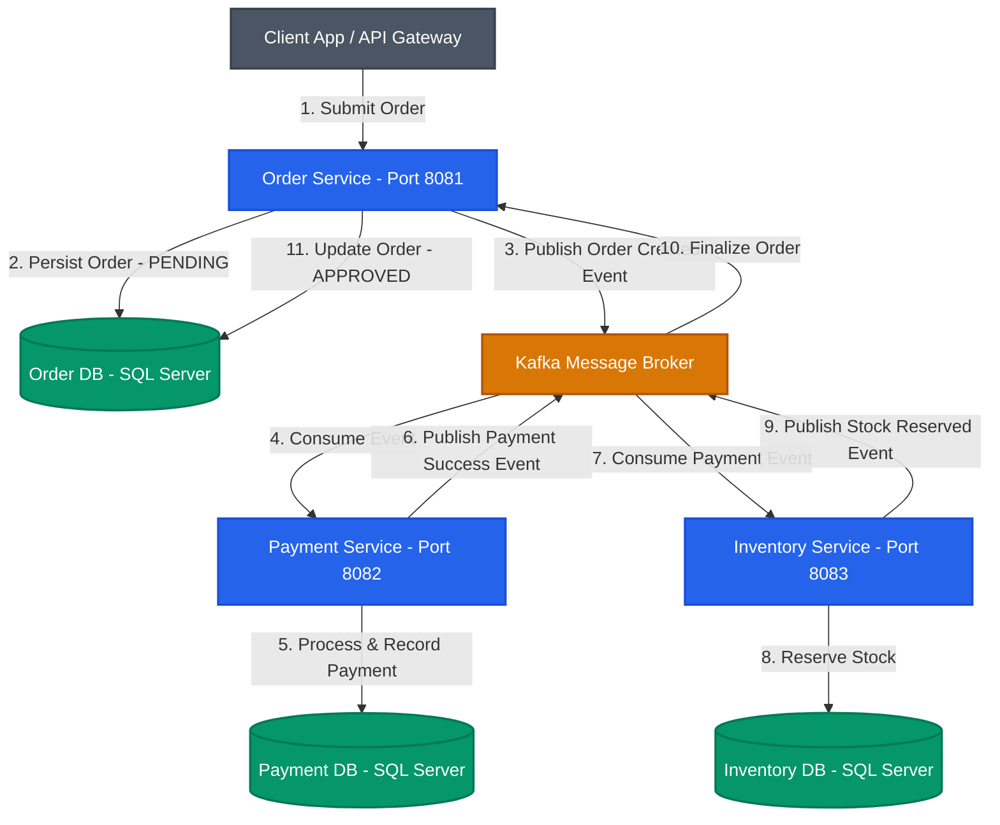
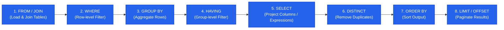
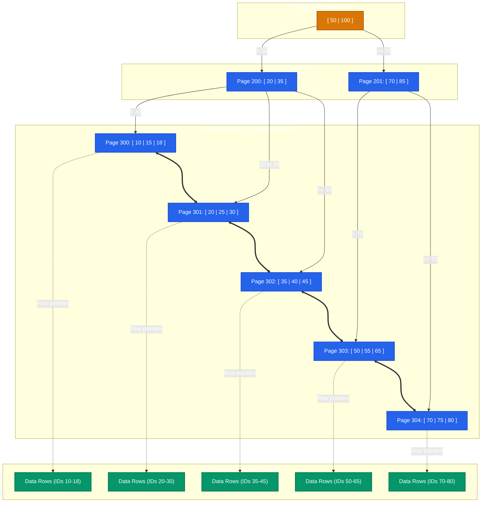
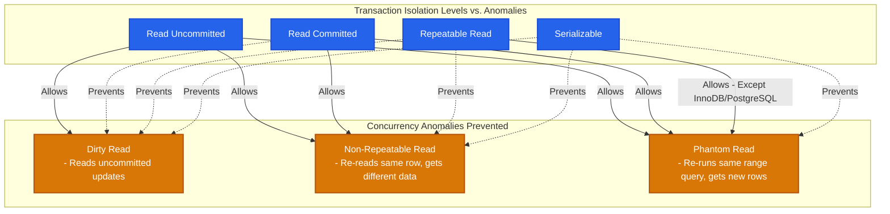
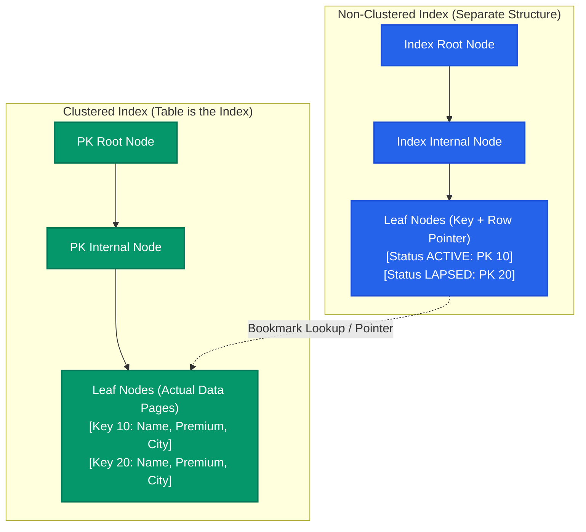

# SQL & DBMS - MASSIVE INTERVIEW PREPARATION (50 Questions)
> *For: 7+ Years Experience Level | Java Full Stack Developer · Based on: Insurance (National) + Retail (ICA/IKEA) Project Context*

---

## DATABASE ARCHITECTURE IN PROJECTS

In production environments, we follow the **Database-per-Service** pattern to ensure loose coupling, independent scalability, and schema isolation across microservices. 



### ICA (IKEA) Retail Domain (SQL Server)
*   **Order DB**: `orders`, `order_items`, `order_status_history`
*   **Product DB**: `products`, `categories`, `inventory`, `pricing`
*   **Payment DB**: `payments`, `refunds`, `payment_audit`

### National Insurance Domain (SQL Server / PostgreSQL)
*   **Policy DB**: `policies`, `coverages`, `endorsements`, `customers`
*   **Claim DB**: `claims`, `claim_documents`, `claim_history`
*   **Audit DB**: `audit_events`, `audit_trail`

No cross-service SQL `JOIN`s are allowed. Event-driven data synchronization is handled asynchronously via Kafka, and read-heavy cross-service queries are optimized using the CQRS pattern with dedicated read models.

---

## PART 1: SQL FUNDAMENTALS + INTERNALS (Q1-Q12)

#### Q1. SQL Query Execution Order (internal processing).
Although written in a different layout, SQL engines evaluate query clauses in a strict logical execution pipeline. Understanding this order is vital to write syntactically correct queries and avoid referring to projected column aliases in filtering stages.



**Why it matters:** 
The `SELECT` clause (where aliases are defined) runs *after* the `WHERE` clause. Therefore, you cannot reference a `SELECT` column alias inside the `WHERE` clause.
```sql
-- WRONG (Will throw: Column 'total_premium' does not exist):
SELECT customer_id, SUM(premium) AS total_premium 
FROM policies 
WHERE total_premium > 50000 
GROUP BY customer_id;

-- RIGHT:
SELECT customer_id, SUM(premium) AS total_premium 
FROM policies 
GROUP BY customer_id 
HAVING SUM(premium) > 50000;
```

---

#### Q2. Types of JOINs with insurance/retail examples.
*   **INNER JOIN**: Returns only rows where there is a match in both tables.
    ```sql
    -- Policies WITH claims
    SELECT p.policy_number, c.claim_number, c.amount
    FROM policies p 
    INNER JOIN claims c ON p.id = c.policy_id;
    ```
*   **LEFT OUTER JOIN**: Returns all rows from the left table, and matching rows from the right table. Non-matching right-side columns are filled with `NULL`.
    ```sql
    -- All policies, even those WITHOUT claims (useful to find claim-free policies)
    SELECT p.policy_number, c.claim_number
    FROM policies p 
    LEFT JOIN claims c ON p.id = c.policy_id;
    ```
*   **RIGHT OUTER JOIN**: Returns all rows from the right table, and matching rows from the left table. Non-matching left-side columns are filled with `NULL`.
*   **FULL OUTER JOIN**: Returns all rows when there is a match in either left or right table. Unmatched values on either side are filled with `NULL`.
*   **CROSS JOIN**: Produces a Cartesian product of both tables (each row of table A matched with every row of table B). Used for generating matrix grids.
*   **SELF JOIN**: A regular join in which a table is joined with itself (requires unique aliases).
    ```sql
    -- Employee to manager reporting hierarchy
    SELECT e.name AS employee_name, m.name AS manager_name
    FROM employees e 
    LEFT JOIN employees m ON e.manager_id = m.id;
    ```

---

#### Q3. Index types and when to use them.
*   **B-Tree Index (Default)**: Balanced-Tree structure. Excellent for high-cardinality columns, exact matches (`=`), and range queries (`BETWEEN`, `>`, `<`).
    ```sql
    CREATE INDEX idx_policies_status ON policies(status);
    ```
*   **Composite Index**: Multi-column index. Must follow the **left-most prefix rule**: an index on `(status, created_date)` can optimize queries filtering on `(status)` or `(status, created_date)`, but NOT queries filtering *only* on `(created_date)`.
    ```sql
    CREATE INDEX idx_policy_status_date ON policies(status, created_date);
    ```
*   **Unique Index**: Guarantees distinct values and implicitly speeds up searches.
    ```sql
    CREATE UNIQUE INDEX idx_policy_number ON policies(policy_number);
    ```
*   **Covering Index**: An index that contains all columns requested in the query, allowing the database engine to retrieve the data solely from the index leaf nodes without fetching the data page (Bookmark Lookup).
    ```sql
    -- SQL Server COVERING INDEX syntax
    CREATE INDEX idx_orders_customer ON orders(customer_id) INCLUDE (status, total_amount);
    ```
*   **Partial/Filtered Index (PostgreSQL/SQL Server)**: Indexes only a subset of rows meeting a predicate, reducing index size and overhead.
    ```sql
    CREATE INDEX idx_active_large_policies ON policies(premium) WHERE status = 'ACTIVE';
    ```

**When NOT to index:**
1.  **Low Cardinality Columns**: Columns like `gender` or `is_deleted` where values have low selectivity (index scan will spill to full scan anyway).
2.  **Small Tables**: Tables spanning less than a few memory pages (loading index costs more than direct Sequential Scan).
3.  **Frequently Updated Columns**: High index maintenance overhead during writing.

---

#### Q4. How does a B-Tree index work internally?
A B-Tree (Balanced Tree) is a self-balancing search tree database structure. It keeps data sorted and allows search, sequential access, insertion, and deletion in logarithmic time ($O(\log n)$).



*   **Lookup Mechanism**: To find `ID = 35`, the engine inspects the root. Since $35 < 50$, it traverses to Page 200. Since $35 \ge 35$, it traverses to Leaf Page 302, finds key `35`, and follows the row pointer.
*   **Range Scans**: Since Leaf nodes are horizontally linked via a doubly-linked list, range queries (`BETWEEN 20 AND 45`) traverse down once to key `20`, then scan horizontally to page 302 without revisiting internal nodes.
*   **Overhead**: Insertions/deletions require node splitting or merging to maintain tree balance, introducing physical disk write overhead.

---

#### Q5. EXPLAIN / EXPLAIN ANALYZE — query optimization.
Running `EXPLAIN` gives the estimated plan from the query optimizer. Running `EXPLAIN ANALYZE` executes the query and reports actual row counts, execution times, and resource usage.

*   **Seq Scan (Sequential Scan)**: Reads the entire table from disk. Bad for large tables; signals a missing index.
*   **Index Scan**: Traverses the index tree to locate matching keys, then fetches physical rows from table pages.
*   **Index Only Scan**: Fetches required columns directly from index pages; bypasses table lookup completely (sign of a covering index).
*   **Nested Loop**: Joins two tables by looping through each outer row and looking up matching inner rows. Good for small datasets.
*   **Hash Join**: Builds an in-memory hash table of the smaller table, then scans the larger table to find matches. Efficient for large unsorted datasets.
*   **Merge Join**: Merges two tables pre-sorted by the join column. High performance for large datasets.

**Tuning Checklist when a Query is Slow:**
1.  Verify if the execution plan shows sequential scans on large tables.
2.  Add composite indexes matching the `WHERE` and `JOIN` conditions.
3.  Check for **Implicit Type Conversions**: comparing a `VARCHAR` column to an integer value forces the DB engine to cast the column, disabling index usage.
4.  Keep optimizer statistics up to date:
    ```sql
    -- PostgreSQL
    ANALYZE policies;
    -- SQL Server
    UPDATE STATISTICS policies;
    ```

---

#### Q6. Normalization forms (1NF → 3NF → BCNF).
*   **1NF (First Normal Form)**: Atomic values; no repeating groups or comma-separated lists in a single column.
    *   *Bad*: `skills_column` = "Java, Spring, SQL"
    *   *Good*: Multiple rows or a separate related table.
*   **2NF (Second Normal Form)**: Must be in 1NF + no partial dependency (every non-key column must depend on the *entire* primary key, not a part of a composite primary key).
    *   *Bad*: Table with key `(student_id, course_id)` storing `course_duration` (depends only on `course_id`).
*   **3NF (Third Normal Form)**: Must be in 2NF + no transitive dependency (non-key columns must not depend on other non-key columns).
    *   *Bad*: `employee` -> `department_id` -> `department_name` (`department_name` depends on `department_id`, not the employee primary key).
*   **BCNF (Boyce-Codd Normal Form)**: Stricter version of 3NF. A table is in BCNF if and only if for every non-trivial functional dependency $X \rightarrow Y$, $X$ is a superkey.

**Microservices Context:** In microservices architecture, we deliberately **denormalize** read paths using the CQRS pattern. Denormalization reduces expensive multi-service calls or distributed database joins, boosting read efficiency.

---

#### Q7. Primary Key vs Unique Key vs Foreign Key.
| Feature | Primary Key | Unique Key | Foreign Key |
| :--- | :--- | :--- | :--- |
| **Purpose** | Uniquely identifies a row. | Enforces distinct values in columns. | Establishes referential integrity to another table. |
| **Max Count** | Exactly one per table. | Multiple unique keys per table. | Multiple foreign keys per table. |
| **Null Values** | Strictly forbidden (`NOT NULL`). | Allows one `NULL` (SQL Server) or multiple `NULL`s (Postgres). | Allows `NULL` unless configured otherwise. |
| **Default Index** | Clustered Index (by default). | Non-Clustered Index. | Does not automatically create an index (best practice to add manually). |

**Distributed Microservices Rule:** Physical Foreign Key constraints cannot cross service boundaries. Instead, we use application-level checks, Kafka-driven synchronization, and the Saga Pattern to maintain eventual consistency.

---

#### Q8. ACID properties with examples.
*   **Atomicity**: All operations in a transaction succeed or fail together.
    *   *Example*: When creating a claim, inserting into `claims` and writing to `audit_trail` must succeed together, or both rollback.
*   **Consistency**: A transaction must move the database from one valid state to another, preserving constraints, triggers, and foreign keys.
    *   *Example*: Account balance must not drop below $0 if a check constraint is defined.
*   **Isolation**: Concurrent execution of transactions must leave the database in the same state as if they were executed sequentially.
    *   *Example*: Preventing two claims processors from modifying the same policy record concurrently without lock isolation.
*   **Durability**: Once committed, transaction records are permanently stored in non-volatile memory and survive system failures. This is enforced by writing to a **Write-Ahead Log (WAL)** or Transaction Log before updating database blocks.

---

#### Q9. Transaction isolation levels — real scenarios.
SQL transactions use isolation levels to control visibility and lock settings.



*   **READ UNCOMMITTED**: Transaction A reads uncommitted modifications made by Transaction B. If B rolls back, A operates on dirty data (Dirty Read).
*   **READ COMMITTED**: Transaction A only reads committed changes. Prevents Dirty Reads. However, if Transaction A reads a row twice, and Transaction B commits an update in between, Transaction A gets different values (Non-Repeatable Read).
*   **REPEATABLE READ**: Shared locks are held on all read rows until the transaction ends. Prevents Dirty and Non-Repeatable reads. However, if Transaction A queries a range of rows, and Transaction B inserts a *new* row matching the filter, Transaction A sees new "phantom" rows in subsequent queries (Phantom Read).
*   **SERIALIZABLE**: Placed range locks prevent concurrent updates or inserts. Avoids all anomalies, but introduces high locking overhead.

```java
// Spring Boot propagation & isolation level declaration
@Transactional(isolation = Isolation.READ_COMMITTED, rollbackFor = Exception.class)
```

---

#### Q10. Clustered vs Non-Clustered Index.


| Feature | Clustered Index | Non-Clustered Index |
| :--- | :--- | :--- |
| **Data Storage** | Leaf node pages contain the actual data rows. | Leaf node pages contain key columns + pointers (RID or Clustered Key). |
| **Limit** | Maximum **one** per table (physical storage can only be sorted in one way). | **Multiple** per table (up to 999 in SQL Server). |
| **Lookup Performance** | Fastest (no secondary lookups). | Requires bookmark lookup to fetch data unless it is a covering index. |
| **Primary Key** | Created automatically on the Primary Key column by default. | Can be created on search/filter criteria. |

---

#### Q11. Views vs Materialized Views.
| Feature | Views (Virtual) | Materialized Views (Physical) |
| :--- | :--- | :--- |
| **Physical Storage** | No disk space. Stores only the SQL query template. | Saves data records physically on disk. |
| **Performance** | Executes the base query every time the view is queried. | High-speed read access; behaves like a cached table. |
| **Data Freshness** | Always real-time and fresh. | Eventual consistency; must be refreshed manually or on a schedule. |
| **Write Impact** | No impact on base write operations. | Refresh calls place execution load on base tables. |

```sql
-- PostgreSQL syntax
CREATE MATERIALIZED VIEW mv_monthly_claims AS
SELECT policy_type, SUM(amount) AS total_amount
FROM claims c JOIN policies p ON c.policy_id = p.id
GROUP BY policy_type;

-- Re-populate materialized view data
REFRESH MATERIALIZED VIEW mv_monthly_claims;
```

---

#### Q12. Stored Procedures vs Functions vs Triggers.
| Feature | Stored Procedures | User-Defined Functions | Database Triggers |
| :--- | :--- | :--- | :--- |
| **Execution** | Called explicitly using `EXEC` or `CALL`. | Called inline inside `SELECT`, `WHERE`, or `JOIN` statements. | Automatically invoked by DML events (`INSERT`, `UPDATE`, `DELETE`). |
| **Transactions** | Can perform `COMMIT` and `ROLLBACK` operations. | Cannot manage transactions (read-only side-effects). | Runs within the transaction block of the triggering statement. |
| **Return Value** | Optional. Returns zero, one, or multiple result sets. | Must return exactly one value or table. | Cannot return values directly to client applications. |
| **Parameters** | Accepts input (`IN`) and output (`OUT`) parameters. | Accepts input parameters only. | No parameters; accesses virtual tables (`inserted` / `deleted`). |

**Architecture Rule:** For scalable cloud microservices, keep stored procedures to a minimum. Maintain business logic in the application tier (Java/Spring Boot) to facilitate testing, load balancing, and version tracking.

---

#### Key Takeaways
- SQL evaluation starts at `FROM/JOIN`, goes to filtering via `WHERE` and grouping via `GROUP BY`, and projects values via `SELECT` near the end.
- Use covering indexes to bypass table lookups, and ensure statistics are up to date to prevent sequential scan fallbacks.
- Use `READ COMMITTED` or `REPEATABLE READ` to manage dirty reads and non-repeatable read anomalies, balancing performance with data isolation.

---

## PART 2: ADVANCED SQL QUERIES (Q13-Q25)

#### Q13. Window Functions — ROW_NUMBER, RANK, DENSE_RANK, LEAD, LAG.
Window functions perform calculations across a set of table rows related to the current row without merging them into aggregate rows.

*   `ROW_NUMBER()`: Assigns a sequential integer starting at 1. No duplicates for ties.
*   `RANK()`: Assigns a rank with gaps for ties (e.g., 1, 2, 2, 4).
*   `DENSE_RANK()`: Assigns a rank without gaps for ties (e.g., 1, 2, 2, 3).
*   `LAG()`: Fetches data from a previous row within the partition.
*   `LEAD()`: Fetches data from a subsequent row within the partition.

```sql
-- Retrieve the top 3 highest premium policies per city using a CTE
WITH RankedPolicies AS (
    SELECT city, policy_number, premium,
           DENSE_RANK() OVER (PARTITION BY city ORDER BY premium DESC) AS rnk
    FROM policies p
    JOIN customers c ON p.customer_id = c.id
)
SELECT city, policy_number, premium, rnk
FROM RankedPolicies
WHERE rnk <= 3;

-- Calculate running total premium by creation date
SELECT created_at, premium,
       SUM(premium) OVER (ORDER BY created_at ROWS UNBOUNDED PRECEDING) AS running_total
FROM policies;
```

---

#### Q14. Common Table Expressions (CTE) and recursive CTE.
CTEs improve query structure by breaking complex queries into readable virtual tables.

```sql
-- Recursive CTE to calculate reporting structure depth (SQL Server/PostgreSQL)
WITH RECURSIVE org_chart AS (
    -- Anchor Member: Root employee (CEO)
    SELECT id, name, manager_id, 1 AS depth_level
    FROM employees
    WHERE manager_id IS NULL
    
    UNION ALL
    
    -- Recursive Member: Join subordinates to managers
    SELECT e.id, e.name, e.manager_id, oc.depth_level + 1
    FROM employees e
    INNER JOIN org_chart oc ON e.manager_id = oc.id
)
SELECT id, name, manager_id, depth_level 
FROM org_chart 
ORDER BY depth_level, name;
```

---

#### Q15. Subqueries — correlated vs non-correlated.
*   **Non-Correlated**: Evaluates once independently. The output is fed directly to the outer query.
    ```sql
    -- Policies with premium higher than overall average
    SELECT * FROM policies 
    WHERE premium > (SELECT AVG(premium) FROM policies);
    ```
*   **Correlated**: References columns from the outer query. Evaluates iteratively for every candidate row, which can degrade performance.
    ```sql
    -- Policies with premium higher than their respective city's average
    SELECT p1.* 
    FROM policies p1
    WHERE p1.premium > (
        SELECT AVG(p2.premium) 
        FROM policies p2 
        JOIN customers c2 ON p2.customer_id = c2.id
        WHERE c2.city = (
            SELECT c1.city FROM customers c1 WHERE c1.id = p1.customer_id
        )
    );
    ```

---

#### Q16. Find Nth highest salary / premium — multiple approaches.
```sql
-- Approach 1: DENSE_RANK (Best practice, handles duplicate values correctly)
WITH RankedPremium AS (
    SELECT premium, DENSE_RANK() OVER (ORDER BY premium DESC) AS rnk
    FROM policies
)
SELECT DISTINCT premium FROM RankedPremium WHERE rnk = 3; -- 3rd highest

-- Approach 2: LIMIT OFFSET (PostgreSQL syntax)
SELECT DISTINCT premium 
FROM policies 
ORDER BY premium DESC 
LIMIT 1 OFFSET 2; -- Offset is N-1 (2 for 3rd highest)

-- Approach 3: Correlated Subquery (Universal SQL syntax)
SELECT DISTINCT p1.premium
FROM policies p1
WHERE 3 = (
    SELECT COUNT(DISTINCT p2.premium)
    FROM policies p2
    WHERE p2.premium >= p1.premium
);
```

---

#### Q17. Delete duplicate rows — keep one copy.
To remove duplicate rows (e.g., duplicate policy numbers) while keeping the row with the lowest primary key (`id`):

```sql
-- SQL Server/PostgreSQL implementation using CTE
WITH DuplicatesCTE AS (
    SELECT id, policy_number,
           ROW_NUMBER() OVER (PARTITION BY policy_number ORDER BY id) AS rn
    FROM policies
)
DELETE FROM policies
WHERE id IN (
    SELECT id FROM DuplicatesCTE WHERE rn > 1
);
```

---

#### Q18. UNION vs UNION ALL vs INTERSECT vs EXCEPT.
| Operator | Deduplication | Performance | Sorting |
| :--- | :--- | :--- | :--- |
| **UNION** | Yes (removes duplicate rows). | Slower (performs unique hash/sort pass). | Sorts data internally to isolate uniqueness. |
| **UNION ALL** | No (retains all duplicate rows). | Faster (streams results directly). | No internal sorting. |
| **INTERSECT** | Yes. Returns matching rows only. | Slower (requires duplicate filtering). | Sorts to extract intersection values. |
| **EXCEPT / MINUS**| Yes. Returns rows in query 1 not in query 2. | Slower. | Sorts to evaluate differences. |

**Performance Rule:** Prefer `UNION ALL` over `UNION` unless duplicates must be removed.

---

#### Q19. GROUP BY with ROLLUP, CUBE, GROUPING SETS.
*   **ROLLUP**: Generates hierarchical subtotals (left-to-right aggregation sequence) and a grand total.
    ```sql
    SELECT city, type, SUM(premium) AS total_revenue
    FROM policies p JOIN customers c ON p.customer_id = c.id
    GROUP BY ROLLUP(city, type);
    -- Outputs: (city, type) subtotal, (city) subtotal, and grand total
    ```
*   **CUBE**: Generates subtotals for all permutations of specified columns.
    ```sql
    GROUP BY CUBE(city, type);
    -- Outputs: (city, type), (city), (type), and grand total
    ```
*   **GROUPING SETS**: Produces specific groupings in a single query.
    ```sql
    GROUP BY GROUPING SETS((city), (type), ());
    ```

---

#### Q20. CASE WHEN — conditional logic in SQL.
Allows conditional branching inside query projections and sorting metrics.

```sql
SELECT policy_number, premium,
       CASE 
           WHEN premium >= 100000 THEN 'PLATINUM'
           WHEN premium >= 50000 AND premium < 100000 THEN 'GOLD'
           ELSE 'STANDARD'
       END AS premium_tier,
       CASE status
           WHEN 'ACTIVE' THEN 'In-Force'
           WHEN 'LAPSED' THEN 'Out-of-Force'
           ELSE 'Pending/Suspended'
       END AS status_display
FROM policies;
```

---

#### Q21. COALESCE, NULLIF, ISNULL — NULL handling.
*   `COALESCE(val1, val2, ...)`: Returns the first non-null argument in the parameter list.
    ```sql
    SELECT customer_id, COALESCE(phone, email, 'No Contact Details') AS communication_channel
    FROM customers;
    ```
*   `NULLIF(val1, val2)`: Returns `NULL` if `val1 = val2`. Used to prevent divide-by-zero crashes.
    ```sql
    SELECT claim_number, amount / NULLIF(deductible, 0) AS coverage_multiplier
    FROM claims;
    ```
*   `ISNULL(val, replacement)`: SQL Server specific. Replaces `NULL` with the second parameter.

---

#### Q22. EXISTS vs IN — performance comparison.
| Aspect | EXISTS | IN |
| :--- | :--- | :--- |
| **Execution Method** | Short-circuit evaluation: halts search once the first match is located. | Typically compiles the subquery list first, then compares. |
| **Best Used For** | Large subqueries or when outer tables are small. | Small static lists or small subquery tables. |
| **NULL Handling** | Safely evaluates conditions regardless of nulls. | Returns `NULL` if the subquery contains any `NULL` values when combined with `NOT IN`. |

```sql
-- EXISTS: Stops scanning on first policy match
SELECT c.* 
FROM customers c 
WHERE EXISTS (
    SELECT 1 FROM policies p WHERE p.customer_id = c.id
);
```

---

#### Q23. Pagination — OFFSET vs Keyset.
| Metric | OFFSET Pagination | Keyset (Seek-based) Pagination |
| :--- | :--- | :--- |
| **SQL Syntax** | `OFFSET 10000 ROWS FETCH NEXT 20 ROWS ONLY` | `WHERE id > 10000 ORDER BY id FETCH NEXT 20 ROWS ONLY` |
| **Time Complexity** | $O(N)$ — Engine scans and discards preceding rows. | $O(\log N)$ — Engine seeks directly to index position. |
| **Performance** | Degradation increases with page depth. | Stable execution time across pages. |
| **Data Drift** | Vulnerable to duplicate/missing rows if records are added/deleted. | Impervious to pagination drift anomalies. |

---

#### Q24. INSERT ... ON CONFLICT (UPSERT).
Executes insertion or switches to update on unique key conflicts.

```sql
-- PostgreSQL syntax
INSERT INTO policies (policy_number, status, premium)
VALUES ('POL-999', 'ACTIVE', 65000.00)
ON CONFLICT (policy_number) 
DO UPDATE SET 
    status = EXCLUDED.status,
    premium = EXCLUDED.premium;

-- SQL Server (MERGE) syntax
MERGE INTO policies AS Target
USING (SELECT 'POL-999' AS policy_number, 'ACTIVE' AS status, 65000.00 AS premium) AS Source
ON Target.policy_number = Source.policy_number
WHEN MATCHED THEN
    UPDATE SET Target.status = Source.status, Target.premium = Source.premium
WHEN NOT MATCHED THEN
    INSERT (policy_number, customer_id, type, status, premium, start_date, end_date)
    VALUES (Source.policy_number, 1, 'AUTO', Source.status, Source.premium, GETDATE(), DATEADD(year, 1, GETDATE()));
```

---

#### Q25. String functions frequently used.
Used for extraction, clean-up, and formatting of text fields.
*   `CONCAT(str1, str2)`: Merges strings. Handles null values safely.
*   `SUBSTRING(str, start, length)`: Extracts substrings.
*   `TRIM(str)` / `LTRIM` / `RTRIM`: Removes leading/trailing spaces.
*   `REPLACE(str, pattern, replacement)`: Replaces substrings.
*   `LIKE '%pattern%'`: Checks pattern matching.
*   `POSITION(pattern IN str)` (Postgres) / `CHARINDEX(pattern, str)` (SQL Server): Locates starting position of a pattern.

---

#### Key Takeaways
- Use `DENSE_RANK()` for ranking values to avoid gaps, and partition datasets without flattening rows.
- Use seek-based keyset pagination (`WHERE id > last_seen_id`) for deep-paging queries in large datasets.
- Avoid using `NOT IN` with subqueries that contain `NULL`s, as it will evaluate to empty results. Use `NOT EXISTS` instead.

---

## PART 3: DATABASE DESIGN + PERFORMANCE (Q26-Q38)

#### Q26. Design schema for Policy Management System.
This production-ready schema design for SQL Server and PostgreSQL establishes relational mapping and includes appropriate constraints and indexes.

```sql
-- Master Customer Table
CREATE TABLE customers (
    id BIGINT GENERATED BY DEFAULT AS IDENTITY PRIMARY KEY, -- PostgreSQL identity
    name VARCHAR(100) NOT NULL,
    email VARCHAR(100) NOT NULL,
    phone VARCHAR(20),
    city VARCHAR(50),
    created_at TIMESTAMP DEFAULT CURRENT_TIMESTAMP,
    CONSTRAINT uq_customer_email UNIQUE (email)
);

-- Master Policy Table
CREATE TABLE policies (
    id BIGINT GENERATED BY DEFAULT AS IDENTITY PRIMARY KEY,
    policy_number VARCHAR(30) NOT NULL,
    customer_id BIGINT NOT NULL,
    type VARCHAR(20) NOT NULL, -- LIFE, HEALTH, AUTO, HOME
    status VARCHAR(20) DEFAULT 'ACTIVE',
    premium DECIMAL(12, 2) NOT NULL,
    start_date DATE NOT NULL,
    end_date DATE NOT NULL,
    created_at TIMESTAMP DEFAULT CURRENT_TIMESTAMP,
    updated_at TIMESTAMP,
    CONSTRAINT uq_policy_number UNIQUE (policy_number),
    CONSTRAINT fk_policy_customer FOREIGN KEY (customer_id) 
        REFERENCES customers (id) ON DELETE RESTRICT,
    CONSTRAINT chk_premium CHECK (premium >= 0)
);

-- Master Claims Table
CREATE TABLE claims (
    id BIGINT GENERATED BY DEFAULT AS IDENTITY PRIMARY KEY,
    claim_number VARCHAR(30) NOT NULL,
    policy_id BIGINT NOT NULL,
    amount DECIMAL(12, 2) NOT NULL,
    status VARCHAR(20) DEFAULT 'SUBMITTED', -- SUBMITTED, APPROVED, REJECTED
    description TEXT,
    submitted_at TIMESTAMP DEFAULT CURRENT_TIMESTAMP,
    resolved_at TIMESTAMP,
    CONSTRAINT uq_claim_number UNIQUE (claim_number),
    CONSTRAINT fk_claim_policy FOREIGN KEY (policy_id) 
        REFERENCES policies (id) ON DELETE RESTRICT,
    CONSTRAINT chk_claim_amount CHECK (amount > 0)
);

-- Core Query Performance Indexes
CREATE INDEX idx_policies_customer_lookup ON policies(customer_id);
CREATE INDEX idx_policies_status_search ON policies(status);
CREATE INDEX idx_claims_policy_lookup ON claims(policy_id);
CREATE INDEX idx_claims_status_search ON claims(status);
```

---

#### Q27. Query optimization — slow query debugging.
If a query runs slowly in production, use this systematic checklist:
1.  **Extract the Query**: Isolate the raw SQL query string from log reports or JPA outputs.
2.  **Generate execution plan**: Run `EXPLAIN (ANALYZE, BUFFERS)` (PostgreSQL) or click "Display Estimated Execution Plan" (SQL Server).
3.  **Detect sequential scans**: Search for Seq Scan or Table Scan operations. Look for index recommends in SQL Server.
4.  **Analyze joins**: Check join patterns. Switch nested loops on large datasets to hash joins or merge joins.
5.  **Evaluate index usage**:
    *   Are the columns in `WHERE` and `JOIN` clauses indexed?
    *   Does the query bypass composite indexes due to violating the left-most prefix rule?
    *   Are functions applied to indexed columns (e.g., `WHERE YEAR(created_at) = 2024` prevents index seek)? Rewrite to `WHERE created_at >= '2024-01-01' AND created_at < '2025-01-01'`.
6.  **Verify type match**: Ensure data types match on both sides of a join or filter (e.g. integer to integer, not integer to varchar) to avoid implicit conversion scanning.
7.  **Optimize pagination**: Switch OFFSET queries to Keyset pagination.
8.  **Re-analyze table statistics**: Run analyze commands to update statistics on table size and distributions.

---

#### Q28. Deadlock — cause, detection, prevention.
A deadlock occurs when two or more transactions hold locks on resources the other transactions need, creating a circular dependency.

```text
Transaction A                        Transaction B
----------------------------         ----------------------------
1. Update Policy 10 (Lock PK 10)     1. Update Claim 20 (Lock PK 20)
2. Update Claim 20 (Wait for B)      2. Update Policy 10 (Wait for A)
```

*   **Detection**: The database engine runs a background daemon that periodically checks the lock graph for cycles. If a cycle is detected, it terminates one transaction (the **Deadlock Victim**), rolling it back so the other transaction can complete.
*   **Prevention**:
    1.  **Consistent Order**: Ensure all application code updates tables in the same logical order (e.g., always update `policies` first, then `claims`).
    2.  **Short Transactions**: Avoid making external network or API calls inside active transaction blocks to minimize lock duration.
    3.  **Optimistic Locking**: Use application-level optimistic locking (using a `@Version` column in Hibernate/JPA) instead of database-level pessimistic locks (`SELECT FOR UPDATE`).

---

#### Q29. Database partitioning — horizontal and vertical.
*   **Horizontal Partitioning (Sharding / Table Partitioning)**: Splits rows of a single table across multiple physical tables on disk based on a key.
    ```sql
    -- PostgreSQL Partitioning by Range
    CREATE TABLE claims (
        id BIGINT NOT NULL,
        claim_number VARCHAR(30) NOT NULL,
        submitted_at TIMESTAMP NOT NULL,
        amount DECIMAL(12,2)
    ) PARTITION BY RANGE (submitted_at);

    CREATE TABLE claims_y2024 PARTITION OF claims
        FOR VALUES FROM ('2024-01-01') TO ('2025-01-01');
    ```
    *   *Benefits*: Queries filtering on the partition key only scan the relevant partition (**Partition Pruning**), improving scan efficiency.
*   **Vertical Partitioning**: Splits columns of a table into multiple tables (e.g., separating large text fields or binary data from frequently queried columns).
    *   *Example*: Splitting `policies` into `policies_metadata` (id, policy_number, status) and `policies_payloads` (id, coverage_text, signed_documents_blob).

---

#### Q30. Connection pooling in production.
A connection pool manages a cache of database connections, reducing the overhead of creating and destroying connections. In Spring Boot, HikariCP is the default implementation.

**Key Parameters for Production (SQL Server/Postgres):**
*   `maximum-pool-size`: 10 to 50 connections.
    *   *Sizing Formula*: $\text{Connections} = ((\text{Core Count} \times 2) + \text{Effective Spindle Count})$. Excess connections increase context switching overhead.
*   `minimum-idle`: Match `maximum-pool-size` (avoids pool resizing overhead).
*   `connection-timeout`: 30000ms (30 seconds). The maximum time the application will wait for a connection from the pool before throwing an exception.
*   `max-lifetime`: 1800000ms (30 minutes). The maximum lifetime of a connection in the pool. Set this slightly lower than the database's idle timeout to prevent stale connection errors.

---

#### Q31. Read replicas for scaling reads.
To handle read-heavy applications (e.g., customer dashboards in National Insurance), database workloads are scaled horizontally by deploying a Primary (Write) database that replicates data asynchronously to one or more Read Replicas.

```text
             [ Client Request ]
                     |
                     v
             [ Spring Boot App ]
             /               \
 (Writes)   /                 \  (Reads)
           v                   v
     [ Primary DB ] ===(Async)===> [ Read Replica ]
```

*   **Routing in Spring Boot**: Use Spring's `AbstractRoutingDataSource` to inspect transaction contexts at runtime. If a transaction is marked as read-only, route it to the Read Replica; otherwise, route it to the Primary.
    ```java
    public class RoutingDataSource extends AbstractRoutingDataSource {
        @Override
        protected Object determineCurrentLookupKey() {
            return TransactionSynchronizationManager.isCurrentTransactionReadOnly() 
                ? "READ_ONLY" 
                : "WRITE_ONLY";
        }
    }
    ```
*   **Replication Lag**: Since replication is asynchronous, a replica may lag behind the primary by milliseconds to seconds. This can lead to stale reads.
*   **Consistency Mitigations**:
    *   **Read-After-Write Consistency**: Route critical reads (e.g., immediately after a user creates or updates a policy) to the primary database.
    *   **Session pinning**: Route queries from a user session to the primary for a few seconds after a write operation.

---

#### Q32. Database migration with Flyway.
Flyway manages version-controlled schema evolution using migration scripts.
*   **How it works**: On startup, Flyway creates a metadata table named `flyway_schema_history` to track applied migrations (version, description, script name, checksum, execution time, and status).
*   **Script Naming Conventions**:
    *   `V1_1_0__init_schema.sql`: Versioned migration (runs once).
    *   `R__refresh_views.sql`: Repeatable migration (runs whenever its file checksum changes).
    *   `U1_1_0__undo_init.sql`: Undo migration.
*   **Handling Checksum Failures**: If a migration script is modified after it has already run, Flyway detects a checksum mismatch on startup and halts execution.
    *   *Resolution*: Revert the modifications in the migration file and apply a new versioned migration for changes, or run `flyway repair` to align the checksum metadata in the database with the file.
*   **Out-of-Order Execution**: Setting `flyway.out-of-order=true` allows developer branches to merge older version migrations that were skipped without breaking execution order.

---

#### Q33. Soft delete vs Hard delete.
| Aspect | Soft Delete (`is_deleted = 1`) | Hard Delete (`DELETE FROM`) |
| :--- | :--- | :--- |
| **Data Recovery** | Trivial. Update flag back to `0`. | Requires restoring from backups or transaction logs. |
| **Referential Integrity**| Preserved (Foreign keys remain intact). | Complex. Can cause cascade deletion cascade failures. |
| **Index Efficiency** | Index scans can slow down due to index bloat unless using filtered/partial indexes. | High index efficiency as deleted rows are physically purged. |
| **Storage Cost** | High. Table and indexes grow continuously. | Low. Purges data pages. |

**Optimization (Filtered Index)**: Prevent index scans on deleted rows by defining filtered indexes:
```sql
CREATE INDEX idx_active_policies ON policies(customer_id) WHERE is_deleted = 0;
```

**JPA Integration**:
```java
@Entity
@SQLDelete(sql = "UPDATE policies SET is_deleted = true WHERE id = ?")
@Where(clause = "is_deleted = false")
public class Policy {
    private boolean isDeleted = false;
}
```

---

#### Q34. Audit trail table design.
Designing an audit trail system requires capturing who changed what data and when, while minimizing execution overhead.

**Production Database Schema Design:**
```sql
CREATE TABLE audit_trail (
    id BIGINT GENERATED BY DEFAULT AS IDENTITY PRIMARY KEY,
    table_name VARCHAR(100) NOT NULL,
    record_id BIGINT NOT NULL,
    action VARCHAR(20) NOT NULL, -- INSERT, UPDATE, DELETE
    changed_by VARCHAR(100) NOT NULL,
    changed_at TIMESTAMP DEFAULT CURRENT_TIMESTAMP,
    old_value JSONB, -- Storing previous state
    new_value JSONB  -- Storing modified state
);
```

**Implementation Approaches:**
1.  **Database Triggers (Pros/Cons)**:
    *   *Pros*: Captures all updates, including those from direct database connections, legacy applications, and admin tools.
    *   *Cons*: Difficult to test, hard to maintain, and can degrade database performance under heavy loads.
2.  **Application-Level Listeners (JPA / Hibernate Envers)**:
    *   *Pros*: Easy to test, clean integration, portable across databases, and simplifies capture of application user context.
    *   *Cons*: Bypassed by raw JDBC SQL calls, direct database updates, and batch processes.

---

#### Q35. Database backup strategy.
A robust backup strategy ensures disaster recovery capability while balancing storage costs and recovery times.

*   **Full Backup**: A complete copy of the entire database. Typically run weekly or daily during off-peak hours.
*   **Differential Backup**: Captures only the data changes that occurred since the last full backup. Usually run daily or every few hours.
*   **Transaction Log / Incremental Backup**: Captures all transaction log operations (WAL logs) since the last log backup. Usually run every 15 minutes.
*   **Point-in-Time Recovery (PITR)**: To recover a database to a specific point in time (e.g., right before an accidental drop table command):
    1.  Restore the latest **Full Backup** before the target time.
    2.  Restore the latest **Differential Backup** preceding the target time.
    3.  Apply the sequence of **Transaction Log Backups** in order, rolling forward transactions and halting at the target timestamp.

---

#### Q36. SQL injection prevention.
SQL Injection (SQLi) occurs when untrusted user input is concatenated directly into a SQL statement, allowing attackers to execute arbitrary SQL commands.

*   **How Prepared Statements Prevent SQLi**: Prepared statements compile the SQL command structure first:
    ```sql
    SELECT * FROM customers WHERE email = ?
    ```
    The database engine compiles and caches this template. When the parameter value is passed later, it is treated strictly as a literal value, never as executable SQL code.
*   **JPA Named Parameters**: Spring Data JPA uses positional or named parameters, translating them to prepared statements under the hood to prevent injection vulnerabilities.
    ```java
    @Query("SELECT p FROM Policy p WHERE p.policyNumber = :policyNum")
    Optional<Policy> findByPolicyNumber(@Param("policyNum") String policyNum);
    ```
*   **Vulnerability Risk**: Concatenating input directly within JPQL or Criteria API queries bypasses parameter binding, reintroducing injection risks:
    ```java
    // VULNERABLE:
    entityManager.createQuery("SELECT p FROM Policy p WHERE p.policyNumber = '" + userInput + "'");
    ```

---

#### Q37. Temporary tables vs Table variables in SQL Server.
| Feature | Temporary Tables (`#TempTable`) | Table Variables (`@TableVar`) |
| :--- | :--- | :--- |
| **Physical Location** | Stored in the `tempdb` system database. | Stored in memory (spills to `tempdb` if data exceeds size threshold). |
| **Statistics** | Generates optimizer statistics (highly efficient for joins and large datasets). | No statistics generated (optimizer assumes a single row, can cause poor plans). |
| **Indexes** | Allows creating additional indexes after creation. | Can only define indexes via primary key/unique constraints on declaration. |
| **Transaction Rollback**| Participates in database transactions. Rows revert on rollback. | Ignores transaction rollbacks. Retains values after rollback. |
| **Scope** | Visible to the current session (or global if `##TempTable`). | Visible only within the current batch/procedure execution. |

---

#### Q38. Execution plan caching and plan cache pollution.
The database engine compiles and caches the execution plan of a query to skip compilation costs on subsequent executions.
*   **Plan Cache Pollution**: If an application uses dynamically concatenated SQL values instead of parameters:
    ```sql
    SELECT * FROM policies WHERE id = 12053;
    SELECT * FROM policies WHERE id = 12054;
    ```
    The engine treats these as different queries and compiles separate execution plans for each. This pollutes the cache, wastes memory, and drives up CPU usage.
*   **Parameter Sniffing**: When compiling a parameterized query (`WHERE status = @p1`), the optimizer inspects (sniffs) the value of the first execution parameter to build an optimized plan. If the distribution of values is highly skewed, the cached plan may perform poorly for other parameter values.
    *   *Resolution*: Use optimizer hints like `OPTION (RECOMPILE)` or specify a representative default optimization value using `OPTIMIZE FOR`.

---

#### Key Takeaways
- Prevent deadlocks by updating tables in a consistent order and keeping transaction boundaries short.
- Use `AbstractRoutingDataSource` in Spring Boot to scale database reads by dynamically routing `@Transactional(readOnly=true)` connections to read replicas.
- Avoid plan cache pollution by using parameterized queries to ensure query plans are cached and reused efficiently.

---

## PART 4: SCENARIO-BASED QUERIES (Q39-Q50)

#### Q39. Find customers who have never filed a claim.
```sql
-- Approach 1: LEFT JOIN (Checks for NULL in matching columns)
SELECT c.id, c.name, c.email
FROM customers c
LEFT JOIN policies p ON c.id = p.customer_id
LEFT JOIN claims cl ON p.id = cl.policy_id
WHERE cl.id IS NULL;

-- Approach 2: NOT EXISTS (Highly optimized, stops search on first match)
SELECT c.id, c.name
FROM customers c
WHERE NOT EXISTS (
    SELECT 1 
    FROM policies p
    INNER JOIN claims cl ON p.id = cl.policy_id
    WHERE p.customer_id = c.id
);
```

---

#### Q40. Find policies expiring in next 30 days.
```sql
-- SQL Server Implementation
SELECT policy_number, end_date, status
FROM policies
WHERE end_date BETWEEN CAST(GETDATE() AS DATE) AND DATEADD(day, 30, CAST(GETDATE() AS DATE))
  AND status = 'ACTIVE';

-- PostgreSQL Implementation
SELECT policy_number, end_date, status
FROM policies
WHERE end_date BETWEEN CURRENT_DATE AND CURRENT_DATE + INTERVAL '30 days'
  AND status = 'ACTIVE';
```

---

#### Q41. Monthly premium revenue report.
```sql
-- PostgreSQL Implementation
SELECT TO_CHAR(created_at, 'YYYY-MM') AS month,
       SUM(premium) AS monthly_revenue,
       COUNT(*) AS policies_issued
FROM policies
GROUP BY TO_CHAR(created_at, 'YYYY-MM')
ORDER BY month;
```

---

#### Q42. Top 5 cities by claim amount.
```sql
SELECT c.city, SUM(cl.amount) AS total_claim_amount
FROM customers c
INNER JOIN policies p ON c.id = p.customer_id
INNER JOIN claims cl ON p.id = cl.policy_id
GROUP BY c.city
ORDER BY total_claim_amount DESC
LIMIT 5; -- SQL Server: use TOP 5 at SELECT
```

---

#### Q43. Year-over-year growth in policies.
Calculates YoY growth in policy count using CTEs and the `LAG()` window function.

```sql
WITH YearlyStats AS (
    SELECT EXTRACT(YEAR FROM created_at) AS policy_year,
           COUNT(*) AS policy_count
    FROM policies
    GROUP BY EXTRACT(YEAR FROM created_at)
)
SELECT policy_year,
       policy_count,
       LAG(policy_count) OVER (ORDER BY policy_year) AS previous_year_count,
       ROUND(
           (policy_count - LAG(policy_count) OVER (ORDER BY policy_year)) * 100.0 / 
           NULLIF(LAG(policy_count) OVER (ORDER BY policy_year), 0), 
           2
       ) AS yoy_growth_pct
FROM YearlyStats
ORDER BY policy_year;
```

---

#### Q44. Find consecutive days without claims (gap analysis).
Finds intervals where no claims were submitted to help optimize claim processing resource allocation.

```sql
WITH DistinctClaimDates AS (
    SELECT DISTINCT CAST(submitted_at AS DATE) AS claim_date 
    FROM claims
),
NextClaimDateCTE AS (
    SELECT claim_date,
           LEAD(claim_date) OVER (ORDER BY claim_date) AS next_claim_date
    FROM DistinctClaimDates
)
SELECT claim_date AS last_claim_date,
       next_claim_date AS next_claim_date,
       (next_claim_date - claim_date - 1) AS consecutive_days_without_claims
FROM NextClaimDateCTE
WHERE (next_claim_date - claim_date) > 1
ORDER BY consecutive_days_without_claims DESC;
```

---

#### Q45. Pivot: Claims count per status per month.
Pivots claims data to display monthly counts of claims by status (`SUBMITTED`, `APPROVED`, `REJECTED`).

```sql
-- Standard SQL / PostgreSQL Cross-tab Implementation (highly performant and portable)
SELECT TO_CHAR(submitted_at, 'YYYY-MM') AS month,
       SUM(CASE WHEN status = 'SUBMITTED' THEN 1 ELSE 0 END) AS submitted_count,
       SUM(CASE WHEN status = 'APPROVED' THEN 1 ELSE 0 END) AS approved_count,
       SUM(CASE WHEN status = 'REJECTED' THEN 1 ELSE 0 END) AS rejected_count,
       COUNT(*) AS total_claims
FROM claims
GROUP BY TO_CHAR(submitted_at, 'YYYY-MM')
ORDER BY month;
```

---

#### Q46. Running average of premium over last 7 days.
Computes a 7-day moving average of policy premiums.

```sql
WITH DailyAggregates AS (
    SELECT CAST(created_at AS DATE) AS policy_date,
           SUM(premium) AS daily_premium_sum
    FROM policies
    GROUP BY CAST(created_at AS DATE)
)
SELECT policy_date,
       daily_premium_sum,
       ROUND(
           AVG(daily_premium_sum) OVER (
               ORDER BY policy_date 
               ROWS BETWEEN 6 PRECEDING AND CURRENT ROW
           ), 
           2
       ) AS rolling_7day_avg
FROM DailyAggregates
ORDER BY policy_date;
```

---

#### Q47. Detect anomalous claims (amount > 3 standard deviations).
Identifies anomalous claim amounts ($> 3\sigma$) within each policy type using standard deviation.

```sql
WITH PolicyStats AS (
    SELECT p.type AS policy_type,
           AVG(c.amount) AS avg_amount,
           STDDEV_POP(c.amount) AS stddev_amount -- SQL Server: STDEV()
    FROM claims c
    INNER JOIN policies p ON c.policy_id = p.id
    GROUP BY p.type
)
SELECT c.claim_number,
       p.type AS policy_type,
       c.amount AS claim_amount,
       ROUND(ps.avg_amount, 2) AS policy_type_avg,
       ROUND(ps.stddev_amount, 2) AS policy_type_stddev,
       ROUND((c.amount - ps.avg_amount) / NULLIF(ps.stddev_amount, 0), 2) AS z_score
FROM claims c
INNER JOIN policies p ON c.policy_id = p.id
INNER JOIN PolicyStats ps ON p.type = ps.policy_type
WHERE c.amount > (ps.avg_amount + (3 * ps.stddev_amount))
ORDER BY z_score DESC;
```

---

#### Q48. Customer retention: Policies renewed vs lapsed per quarter.
Calculates quarterly customer retention metrics by checking the ratio of active to lapsed policies.

```sql
WITH PolicyQuarterlyStatus AS (
    SELECT EXTRACT(YEAR FROM end_date) AS expire_year,
           EXTRACT(QUARTER FROM end_date) AS expire_quarter,
           status
    FROM policies
)
SELECT CONCAT(expire_year, '-Q', expire_quarter) AS quarter,
       SUM(CASE WHEN status = 'ACTIVE' THEN 1 ELSE 0 END) AS active_renewed_count,
       SUM(CASE WHEN status = 'LAPSED' THEN 1 ELSE 0 END) AS lapsed_count,
       ROUND(
           SUM(CASE WHEN status = 'ACTIVE' THEN 1.0 ELSE 0.0 END) * 100.0 / 
           NULLIF(COUNT(*), 0), 
           2
       ) AS retention_rate_pct
FROM PolicyQuarterlyStatus
GROUP BY expire_year, expire_quarter
ORDER BY expire_year, expire_quarter;
```

---

#### Q49. Most common claim types per policy type.
Identifies the most common claim types for each policy category.

```sql
WITH RankedClaims AS (
    SELECT p.type AS policy_type,
           c.description AS claim_category,
           COUNT(*) AS category_count,
           DENSE_RANK() OVER (
               PARTITION BY p.type 
               ORDER BY COUNT(*) DESC
           ) AS rnk
    FROM claims c
    INNER JOIN policies p ON c.policy_id = p.id
    GROUP BY p.type, c.description
)
SELECT policy_type,
       claim_category,
       category_count
FROM RankedClaims
WHERE rnk = 1
ORDER BY policy_type;
```

---

#### Q50. Recursive: Organization hierarchy with total reportees count.
Calculates the total number of direct and indirect reportees for every manager in the company hierarchy.

```sql
-- PostgreSQL Recursive CTE Implementation
WITH RECURSIVE org_chart AS (
    -- Anchor Member: Initialize every employee as their own root ancestor
    SELECT id, manager_id, id AS ancestor_id
    FROM employees
    
    UNION ALL
    
    -- Recursive Member: Join subordinates to ancestors down the reporting tree
    SELECT e.id, e.manager_id, oc.ancestor_id
    FROM employees e
    INNER JOIN org_chart oc ON e.manager_id = oc.id
)
SELECT mgr.id AS manager_id,
       mgr.name AS manager_name,
       COUNT(*) - 1 AS total_subordinates_count -- Subtract 1 to exclude self-reference
FROM org_chart oc
INNER JOIN employees mgr ON oc.ancestor_id = mgr.id
GROUP BY mgr.id, mgr.name
ORDER BY total_subordinates_count DESC;
```

---

#### Key Takeaways
- Use window functions like `LEAD()` and `LAG()` to perform date difference calculations for gap analysis.
- Use `AVG()` and standard deviation aggregation to flag database records that fall outside acceptable bounds ($> 3\sigma$).
- Use recursive self-referential queries to model parent-child structures and count nodes across arbitrary hierarchy depths.

---

## HIGH-FREQUENCY INTERVIEW QUESTIONS INDEX

| Question | Core Concept | Quick Reference Link |
| :--- | :--- | :--- |
| **Q1. SQL Execution Order** | Logical pipeline execution details. | [Go to Q1](#q1-sql-query-execution-order-internal-processing) |
| **Q2. Types of JOINs** | Multi-table join patterns and samples. | [Go to Q2](#q2-types-of-joins-with-insuranceretail-examples) |
| **Q3. Index Types** | Standard index applications. | [Go to Q3](#q3-index-types-and-when-to-use-them) |
| **Q4. B-Tree Mechanism** | B-Tree search and range scan structures. | [Go to Q4](#q4-how-does-a-b-tree-index-work-internally) |
| **Q5. EXPLAIN Plans** | Execution plan analysis and query tuning. | [Go to Q5](#q5-explain--explain-analyze--query-optimization) |
| **Q6. Normalization** | Relational normalization forms (1NF-BCNF). | [Go to Q6](#q6-normalization-forms-1nf--3nf--bcnf) |
| **Q13. Window Functions** | Analytical windowing (`ROW_NUMBER`, `LAG`, `LEAD`). | [Go to Q13](#q13-window-functions--row_number-rank-dense_rank-lead-lag) |
| **Q14. CTE & Recursive CTE** | Query formatting and hierarchical tree traversal. | [Go to Q14](#q14-common-table-expressions-cte-and-recursive-cte) |
| **Q15. Subqueries** | Correlated vs non-correlated subquery paths. | [Go to Q15](#q15-subqueries--correlated-vs-non-correlated) |
| **Q16. Nth Highest Salary** | Distinct salary query approaches. | [Go to Q16](#q16-find-nth-highest-salary--premium--multiple-approaches) |
| **Q17. Delete Duplicates** | safe row deduplication using CTEs. | [Go to Q17](#q17-delete-duplicate-rows--keep-one-copy) |
| **Q26. Database Design** | Relational design schema structures. | [Go to Q26](#q26-design-schema-for-policy-management-system) |
| **Q27. Slow Query Debugging**| DB query diagnosis checklist. | [Go to Q27](#q27-query-optimization--slow-query-debugging) |
| **Q28. Deadlock Avoidance** | Detection and resolution of circular locking. | [Go to Q28](#q28-deadlock--cause-detection-prevention) |
| **Q39. Left Join Exclusions** | Identifying missing items via outer joins. | [Go to Q39](#q39-find-customers-who-have-never-filed-a-claim) |

---
## END OF SQL & DBMS ANALYSIS (50 Questions)
