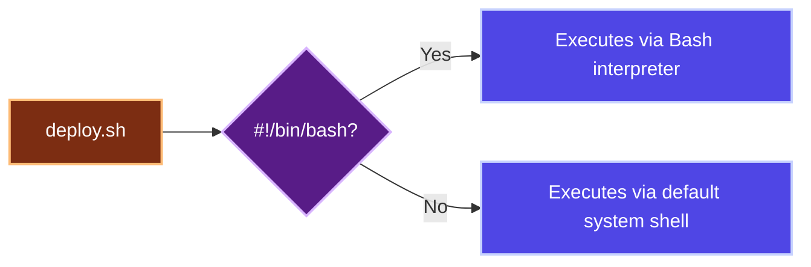
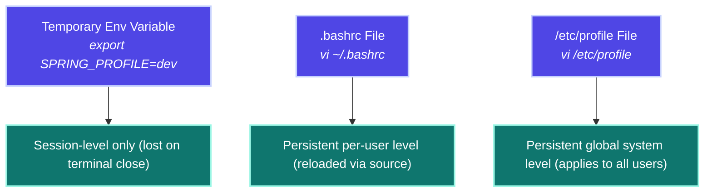
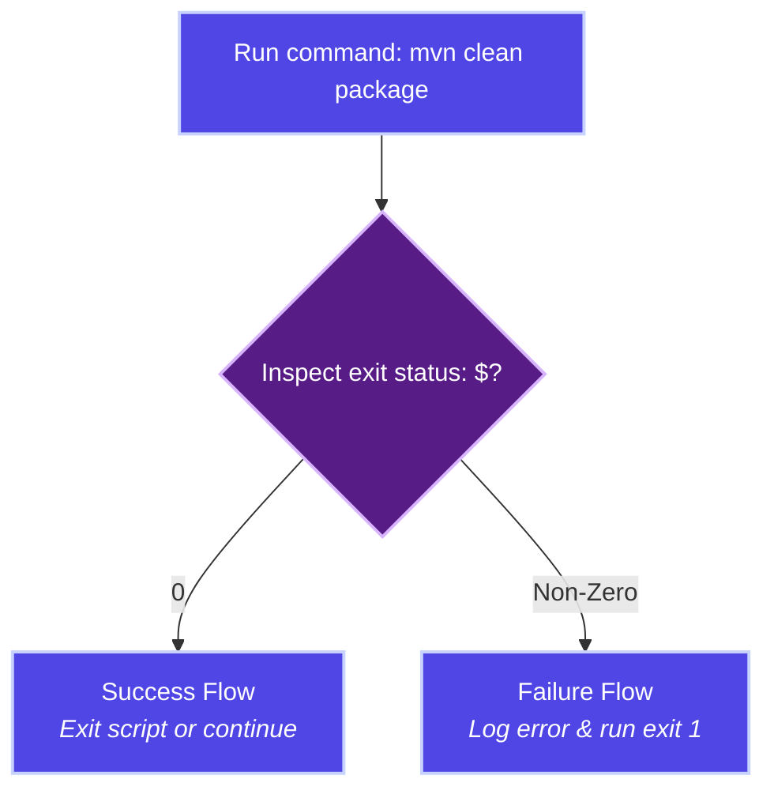
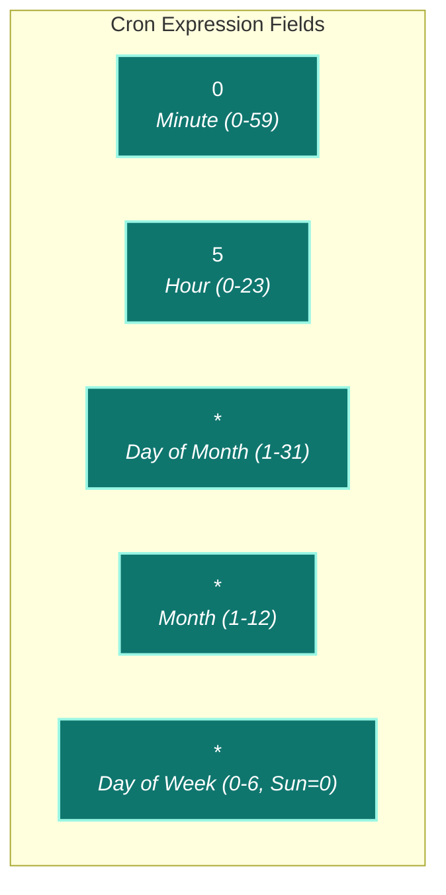
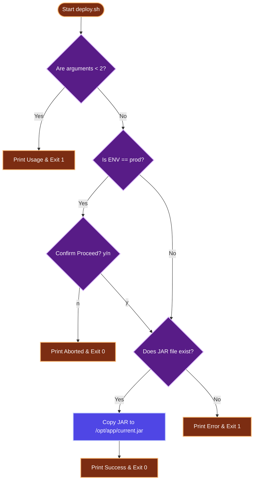

# SHELL SCRIPTING (BASH) - COMPREHENSIVE INTERVIEW & REVISION GUIDE

> [!NOTE]
> **Extracted & Refactored from:** `Linux and Shell Scripting.txt`
> **Target Audience:** DevOps Engineers | System Administrators | Java Full Stack Developers
> Shell scripting automates repetitive, multi-step command sequences into single-run executable scripts. It is a core skill for automating building, testing, deploying, and monitoring software on cloud and local instances.

---

## 1. Structured Concept Quick Reference

Below is a summarized inventory of core Shell Scripting concepts, command utilities, and task configurations:

| ID | Command / Concept | Description | Real-Time Usage Scenario | Priority |
| :---: | :--- | :--- | :--- | :---: |
| 1 | `#! /bin/bash` | Shebang - Tells OS which shell interpreter to run | Always placed at line 1 of scripts for server portability | High (⭐⭐⭐) |
| 2 | `sh <script.sh>` | Run script via Bourne shell interpreter | Run deployment: `sh deploy.sh` | High (⭐⭐⭐) |
| 3 | `bash <script.sh>` | Run script explicitly using Bash interpreter | Run script when execute flag or shebang is missing | High (⭐⭐⭐) |
| 4 | `chmod +x <script.sh>` | Make script file executable | `chmod +x deploy.sh; ./deploy.sh` | High (⭐⭐⭐) |
| 5 | `echo "message"` | Print text/variables to stdout | Log progress: `echo "Deployment started..."` | High (⭐⭐⭐) |
| 6 | `echo $SHELL` | Check path of active terminal shell | Confirm environment shell before script execution | Medium (⭐⭐) |
| 7 | Environment variables | Pre-defined system-wide variables | Use `$SHELL`, `$PATH`, `$USER`, `$HOME`, `$PWD` in pipelines | High (⭐⭐⭐) |
| 8 | User-defined variables | Custom-assigned storage (`NAME="value"`) | Maintain configuration constants dynamically | High (⭐⭐⭐) |
| 9 | `read VARIABLE` | Read user input into variable | Interactive CLI prompts: `read -p "Enter env: " ENV` | High (⭐⭐⭐) |
| 10 | `export VAR=value` | Set temporary environment variable | Pass properties: `export SPRING_PROFILE=prod` | High (⭐⭐⭐) |
| 11 | `.bashrc` | User-level persistent variables file | Persistently save variables like `JAVA_HOME` per user | High (⭐⭐⭐) |
| 12 | `/etc/profile` | System-wide variables configuration file | Global setup of variables for all active system users | Medium (⭐⭐) |
| 13 | Arithmetic operators | Perform mathematical operations via `$(( ))` | Calculate remaining disk space or instance loops | High (⭐⭐⭐) |
| 14 | Comparison operators | Perform evaluations inside conditional tests `[ ]` | Check threshold limits (e.g., memory usage > 90%) | High (⭐⭐⭐) |
| 15 | `-f <file>` | True if file exists and is a regular file | Check configuration exist before starting services | High (⭐⭐⭐) |
| 16 | `-d <dir>` | True if directory exists | Create log directory if missing | High (⭐⭐⭐) |
| 17 | `-e <path>` | True if path exists (any file type/folder) | Verify location existence | Medium (⭐⭐) |
| 18 | `-r / -w / -x` | True if file has read/write/execute rights | Check script authority before child executions | Medium (⭐⭐) |
| 19 | `if-else-fi` | Execute commands based on conditional tests | Branch scripts (deploy dev, staging, or production) | High (⭐⭐⭐) |
| 20 | `for` loop (C-style) | Standard iterative loop with count updates | Loop counts or standard index sequences | High (⭐⭐⭐) |
| 21 | `for-in` loop | Iterate over list of words, arrays, or files | Run task on list: `for srv in s1 s2; do ssh $srv; done` | High (⭐⭐⭐) |
| 22 | `while` loop | Loop executing while condition evaluates to true | Health checks: check if backend is UP with retry sleep | High (⭐⭐⭐) |
| 23 | Infinite loop | Unending loop (stopped via condition/break/sig) | Continuous server metrics monitoring daemon | Medium (⭐⭐) |
| 24 | `let NUM++` | Increment target integer variable by 1 | Update retry limits or loop counters | Medium (⭐⭐) |
| 25 | Function definition | Reusable modular code blocks | Separate core tasks like `deploy()`, `rollback()` | High (⭐⭐⭐) |
| 26 | Positional parameters | Access arguments passed to script at runtime | Retrieve inputs: `$0` (name), `$1`, `$2` (args), `$#` (count) | High (⭐⭐⭐) |
| 27 | `$?` | Exit code of last command (0=success, else=fail) | Validate build status: `mvn clean package; if [ $? -eq 0 ]` | High (⭐⭐⭐) |
| 28 | `exit 0` | Exit script indicating successful completion | Gracefully end pipeline run upon successful deployment | Medium (⭐⭐) |
| 29 | `exit 1` | Exit script indicating critical failure | Terminate and notify orchestrators of script errors | High (⭐⭐⭐) |
| 30 | CRON scheduling | Schedule automated recurring script runs | Configure automatic database backups and log cleaning | High (⭐⭐⭐) |
| 31 | `crontab -e` | Edit cron tab schedules for active user | Manage user backup and rotation triggers | High (⭐⭐⭐) |
| 32 | `crontab -l` | List all cron tab schedules for active user | Review active automation schedules | High (⭐⭐⭐) |
| 33 | `crontab -r` | Remove all cron tab schedules for active user | Clean up cron files during server decommission | Medium (⭐⭐) |
| 34 | `crontab -u root -e` | Edit cron tab schedule for a specific user (root) | Setup root-only system level automation routines | Medium (⭐⭐) |
| 35 | Absolute path | File path starting from system root `/` | **Mandatory** in cron configurations (lack environment context) | High (⭐⭐⭐) |
| 36 | Relative path | File path relative to current folder | Navigate and run local scripts during console sessions | Medium (⭐⭐) |

---

## 2. Shell Scripting Basics & Execution

A shell script is an executable text file containing sequences of system commands. 

### Interpreter Resolution (Shebang)
The first line of a shell script starts with a Shebang (`#!`). This tells the operating system's loader which interpreter to use when reading the file.



### Script Execution Methods
There are multiple ways to execute a script depending on filesystem permissions and shebang presence:

1. **Explicit shell execution (interpreter-based):**
   * Executes via the target interpreter even if the file is not marked executable.
   ```bash
   sh deploy.sh
   bash build.sh
   ```
2. **Direct execution (binary/system-based):**
   * Requires executable permissions. The system resolves the interpreter via the script's shebang.
   ```bash
   chmod +x deploy.sh
   ./deploy.sh
   ```

### Output Logging
The `echo` command prints output strings to standard output, making it crucial for execution logging:
```bash
echo "Current deployment environment: $ENV"
```

#### Key Takeaways
* Always include `#! /bin/bash` at the very top of scripts to avoid execution failures across different shell environments.
* Use `chmod +x` to secure execution capabilities, allowing scripts to be executed via standard absolute or relative paths.

---

## 3. Variables & Scope Configuration

Variables in shell scripts are dynamically typed (treated as strings unless evaluated inside arithmetic wrappers) and are case-sensitive.

### User-Defined Variables
* **Assignment Rules:** No spaces are allowed around the `=` sign.
* **Naming Conventions:** Must start with a letter or underscore (cannot start with a digit), and cannot contain special characters.
* **Convention:** Use UPPERCASE names for configuration constants.

```bash
# Correct assignment
APP_NAME="policy-service"
VERSION="2.0"

# Incorrect assignment (causes syntax errors)
APP_NAME = "policy-service" 

# Access variables using the $ prefix
echo "Deploying $APP_NAME version $VERSION"
```

### Pre-Defined Environment Variables (ENV)
The OS sets default environment variables representing system-level parameters:

| Variable | Description | Common DevOps Application |
| :--- | :--- | :--- |
| `$SHELL` | Current shell pathway (e.g. `/bin/bash`) | Verification of runtime interpreter |
| `$PATH` | Directories searched for executable programs | Troubleshooting missing executables |
| `$HOME` | Home directory pathway of current user | Referencing key files, credentials, SSH paths |
| `$USER` | Active user account name | Logging execution authority / ownership checks |
| `$PWD` | Current working directory pathway | Determining build and output paths |

### User Input & Interaction (`read`)
Use `read` to capture input from standard input:
```bash
#!/bin/bash
# Prompt input using the -p flag
read -p "Enter Target Deployment Environment (dev/prod): " ENV_NAME
echo "Preparing deployment for: $ENV_NAME"
```

### Scope Persistence Configuration
Variables created inside a running shell process or script are localized. To control persistence and scope, use:



* **Session-Level Variables:** Use `export` to expose variables to child processes of the current shell.
  ```bash
  export SPRING_PROFILE=prod
  ```
* **Persistent Per-User Variables:** Defined in `~/.bashrc`. Apply settings by reloading the configuration:
  ```bash
  vi ~/.bashrc
  # Add: export JAVA_HOME=/usr/lib/jvm/java-17
  source ~/.bashrc
  ```
* **Persistent System-Wide Variables:** Defined in `/etc/profile` to apply globally to all users on the server.

#### Key Takeaways
* Never place spaces around the `=` assignment character in Shell scripts.
* Use `source ~/.bashrc` to update variables without terminating the session.
* Always use `export` when child scripts or processes need access to parent shell variables.

---

## 4. Operators & Condition Logic

Operators are critical for script branching, status checks, and data comparisons.

### Arithmetic Operations
Math evaluations must be wrapped inside `$(( ))` syntax:

| Operator | Action | Sample Expression |
| :---: | :--- | :--- |
| `+` | Addition | `SUM=$((NUM1 + NUM2))` |
| `-` | Subtraction | `DIFF=$((NUM1 - NUM2))` |
| `*` | Multiplication | `PROD=$((NUM1 * NUM2))` |
| `/` | Integer Division (truncates fractional values) | `DIV=$((NUM1 / NUM2))` |
| `%` | Modulo Division (returns remainder) | `REM=$((NUM1 % NUM2))` |

```bash
#!/bin/bash
# Arithmetic Demo
read -p "Enter First Number: " N1
read -p "Enter Second Number: " N2
echo "Sum: $((N1 + N2))"
```

### Comparison & Evaluation Operators
Evaluations are placed within square brackets `[ ]` (note that spaces around the brackets are syntax-mandatory).

| Numeric Operator | String Operator | Evaluation | Sample Test Syntax |
| :---: | :---: | :--- | :--- |
| `-eq` | `==` | Check if values are equal | `[ $A -eq $B ]` or `[ "$X" == "prod" ]` |
| `-ne` | `!=` | Check if values are unequal | `[ $A -ne 0 ]` or `[ "$X" != "prod" ]` |
| `-gt` | *N/A* | Greater than check | `[ $MEM -gt 90 ]` (alert if RAM > 90%) |
| `-lt` | *N/A* | Less than check | `[ $DISK -lt 20 ]` (warn if disk space < 20%) |
| `-ge` | *N/A* | Greater than or equal to check | `[ $COUNT -ge 3 ]` |
| `-le` | *N/A* | Less than or equal to check | `[ $RETRIES -le 5 ]` |

> [!WARNING]
> Use numeric flags (`-eq`, `-gt`, etc.) exclusively for integers. String operators (`==`, `!=`) should only be used for string variables. Always wrap string variables in double quotes (`"$VAR"`) during checks to prevent syntax exceptions if the variable evaluates to null/empty.

### File Evaluation Operators
Validate the state, type, and access flags of target paths:

| Operator | True Condition | Real-Time Usage Scenario |
| :---: | :--- | :--- |
| `-f <path>` | File exists and is a regular file | Check properties file exists: `if [ -f "app.properties" ]` |
| `-d <path>` | Directory exists | Check folder exists: `if [ ! -d "/opt/logs" ]; then mkdir /opt/logs; fi` |
| `-e <path>` | Path exists (general file, folder, link, or socket check) | Verify artifact path is valid |
| `-r <path>` | Path is readable | Verify security credentials file is readable |
| `-w <path>` | Path is writable | Verify current folder allows write outputs |
| `-x <path>` | Path is executable | Check target script is runnable: `if [ -x "deploy.sh" ]` |

### Conditional Branching (`if-else-fi`)
Branch execution flow using the `if-elif-else-fi` structure:

```bash
#!/bin/bash
# Environment Branching Example
ENV=$1
if [ "$ENV" == "prod" ]; then
    echo "Alert: Target is PRODUCTION! Initiating sanity validations..."
elif [ "$ENV" == "staging" ]; then
    echo "Target is STAGING. Running deploy script..."
else
    echo "Target is DEV. Executing quick deploy..."
fi
```

#### Key Takeaways
* Numeric comparison flags (`-eq`, `-ne`, etc.) fail when applied to strings; use string operators (`==`, `!=`) instead.
* Always wrap conditions in spaces: `if [ $A -eq $B ]` is valid, whereas `if [$A -eq $B]` causes a parser error.
* Use `let` or `$(( ))` for increment loops to bypass string casting limitations.

---

## 5. Loop Structures & Iteration

Loops allow scripts to perform repetitive tasks, iterate over lists of files or servers, and implement retry logic.

### The C-Style Loop
Used for standard range iterations:
```bash
#!/bin/bash
# Print numbers from 1 to 5
for ((i=1; i<=5; i++))
do
    echo "Index: $i"
done
```

### The `for-in` Loop
Iterates over a list of strings, files, or variables:
```bash
#!/bin/bash
# Deploy to multiple instances
for SERVER in 10.0.1.1 10.0.1.2 10.0.1.3
do
    echo "Transferring application archive to $SERVER..."
    scp app.jar user@$SERVER:/opt/app/
done
```

### The `while` Loop & Retry Logic
Runs commands continuously while a condition evaluates to true. Often used for service polling:
```bash
#!/bin/bash
# Health Check Polling Routine
RETRIES=0
while [ $RETRIES -lt 10 ]
do
    # Get HTTP response status code
    STATUS=$(curl -s -o /dev/null -w "%{http_code}" http://localhost:8080/health)
    if [ "$STATUS" == "200" ]; then
        echo "Application is healthy and active!"
        break
    fi
    echo "Service unreachable ($STATUS). Retry attempt: $RETRIES/10..."
    sleep 5
    let RETRIES++
done
```

#### Key Takeaways
* Use `break` to exit loops immediately when a success condition is met.
* Always include `sleep` inside polling loops to prevent excessive CPU consumption.
* C-style loops require double parentheses `(( ))` for evaluations and updates.

---

## 6. Reusable Modular Functions

Functions wrap logic into reusable blocks, keeping scripts modular and maintainable.

### Syntax & Basic Definition
```bash
#!/bin/bash

# Define function
function log_alert() {
    local MSG=$1  # Use local scope variables inside functions
    echo "[ALERT] $(date '+%Y-%m-%d %H:%M:%S') - $MSG"
}

# Invoke function (do not use parentheses)
log_alert "Disk space threshold exceeded!"
```

### Conditional File Management Example
```bash
#!/bin/bash
# Function to inspect or initialize files
function manage_log_file() {
    read -p "Enter filename: " FNAME
    if [ -f "$FNAME" ]; then
        echo "File exists. Printing first 5 lines:"
        head -n 5 "$FNAME"
    else
        echo "File not found. Initializing new log file..."
        touch "$FNAME"
        echo "Initialized."
    fi
}
manage_log_file
```

#### Key Takeaways
* Do not use parentheses `()` when invoking a function; pass arguments as space-separated tokens: `my_func arg1 arg2`.
* Declare internal variables as `local` inside functions to prevent them from leaking into the global script scope.

---

## 7. Runtime Positional Parameters

Positional parameters capture arguments passed to a script at execution time.

```mermaid
flowchart TD
    subgraph Execution ["Command Line Input"]
        Cmd["sh deploy.sh prod v2.1"]
    end
    
    subgraph Parameters ["Mapped Variables"]
        Arg0["&#36;0 = deploy.sh"]
        Arg1["&#36;1 = prod"]
        Arg2["&#36;2 = v2.1"]
        ArgAll["&#36;* / &#36;&#64; = prod v2.1"]
        ArgCount["&#36;&#35; = 2"]
    end

    Cmd --> Arg0
    Cmd --> Arg1
    Cmd --> Arg2
    Cmd -.-> ArgAll
    Cmd -.-> ArgCount

    classDef client fill:#7C2D12,stroke:#FDBA74,color:#FFFFFF,stroke-width:2px;
    classDef layer fill:#4F46E5,stroke:#C7D2FE,color:#FFFFFF,stroke-width:2px;
    
    class Cmd client;
    class Arg0,Arg1,Arg2,ArgAll,ArgCount layer;
```



### Argument Mappings
* `$0`: The name of the script file itself.
* `$1` to `$9`: The first through ninth arguments passed to the script.
* `$*`: All arguments passed to the script, returned as a single string.
* `$@`: All arguments passed to the script, returned as individual quoted strings.
* `$#`: The number of arguments passed to the script.

### Input Mapping Example
```bash
#!/bin/bash
# args_demo.sh
echo "Script executing: $0"
echo "Total Arguments Received: $#"
echo "First Argument (Env): $1"
echo "Second Argument (Version): $2"
echo "All Arguments: $@"
```
*Run command:*
```bash
sh args_demo.sh prod v1.2
```
*Console output:*
```text
Script executing: args_demo.sh
Total Arguments Received: 2
First Argument (Env): prod
Second Argument (Version): v1.2
All Arguments: prod v1.2
```

#### Key Takeaways
* Use `$#` to validate that the required number of arguments were passed before executing the rest of the script.
* Use `$@` instead of `$*` when iterating over arguments that contain spaces, as `$@` preserves argument boundaries.

---

## 8. Status Checks & Error Handling

Every Linux command returns an exit status code (an integer from 0 to 255) upon completion.



* `$?`: Holds the exit status of the last executed command.
* `0`: Success (no errors).
* `1` to `255`: Failure (errors occurred).

### Automated Build Validation Example
```bash
#!/bin/bash
# Build verification script
echo "Starting Maven build sequence..."
mvn clean package -DskipTests

# Inspect build command status
if [ $? -eq 0 ]; then
    echo "Maven build completed successfully!"
else
    echo "ERROR: Maven build failed. Aborting deployment."
    exit 1  # Exit with error status to signal pipeline failure
fi
```

#### Key Takeaways
* Standardize exit codes: use `exit 0` to signal success, and `exit 1` (or another non-zero code) to signal errors.
* Checking `$?` is the standard way to handle errors in CI/CD pipelines (such as Jenkins, GitLab, or GitHub Actions).

---

## 9. Task Scheduling & Cron Configurations

The `cron` daemon executes scheduled scripts in the background.

### Cron Schedule Expression Syntax
A cron schedule consists of five space-separated fields:



### Common Schedule Examples
| Expression | Frequency | DevOps Automation Task |
| :--- | :--- | :--- |
| `0 5 * * *` | Every day at 5:00 AM | Daily database backup |
| `0 17 * * *` | Every day at 5:00 PM | End-of-day reports |
| `0 8 1 * *` | 1st of every month at 8:00 AM | Monthly database cleanup |
| `0 10 * * 1` | Every Monday at 10:00 AM | Weekly status generation |
| `0 0 15 * *` | 15th of each month at midnight | Mid-month log audit |
| `0 18 * * 1-5` | Monday through Friday at 6:00 PM | Weekday log rotation |
| `0 */2 * * *` | Every 2 hours | Routine application health checks |

### Crontab Commands
* `crontab -e`: Edit the active user's cron schedules.
* `crontab -l`: List active cron schedules.
* `crontab -r`: Delete all scheduled cron tasks for the active user.
* `crontab -u <user> -e`: Edit cron schedules for a specific user (requires root/sudo).

### Managing the Cron Daemon
```bash
# Start the cron daemon
sudo systemctl start crond

# Enable cron to start automatically at system boot
sudo systemctl enable crond
```

### Absolute vs. Relative Paths
Understanding pathing is critical for cron jobs, as cron runs scripts in a minimal shell environment without user path context.

| Feature | Absolute Path | Relative Path |
| :--- | :--- | :--- |
| **Definition** | Full path starting from the root directory (`/`) | Path relative to the current working directory |
| **Example** | `/home/appuser/scripts/deploy.sh` | `./deploy.sh` or `../scripts/deploy.sh` |
| **Cron Usage** | **Mandatory** (cron runs in a minimal environment without user path context) | **Avoid** (runs will fail due to incorrect context directory) |
| **CLI Usage** | Highly reliable but verbose | Fast and convenient for manual interactive runs |

#### Key Takeaways
* Always use absolute paths (e.g., `/usr/bin/tar` instead of `tar`) inside cron scripts, as cron runs with a minimal environment path setup.
* Redirect cron job outputs (`>/dev/null 2>&1` or to specific log files) to prevent the system from generating local mailbox logs for every run.

---

## 10. Enterprise DevOps Deployment Script

The script below demonstrates how variables, positional parameters, file validations, user inputs, functions, and exit statuses are combined in an enterprise deployment script.



```bash
#!/bin/bash
# ==============================================================================
# DevOps Deployment Script
# Usage: sh deploy.sh <env> <version>
# Example: sh deploy.sh prod 2.1
# ==============================================================================

# Parse arguments
ENV=$1
VERSION=$2
APP_NAME="policy-service"

# Define the deployment function
function deploy() {
    echo "========================================="
    echo "Starting Deployment of $APP_NAME v$VERSION to $ENV"
    echo "========================================="

    # Define path variables
    JAR_FILE="/opt/releases/${APP_NAME}-${VERSION}.jar"
    TARGET_PATH="/opt/app/current.jar"

    # Validate file existence
    if [ -f "$JAR_FILE" ]; then
        echo "Found artifact: $JAR_FILE"
        
        # Copy the deployment archive
        cp "$JAR_FILE" "$TARGET_PATH"
        
        # Verify execution success
        if [ $? -eq 0 ]; then
            echo "Artifact successfully deployed to $TARGET_PATH"
            echo "Deployment completed successfully!"
            exit 0
        else
            echo "ERROR: Failed to copy artifact to target destination."
            exit 1
        fi
    else
        echo "ERROR: Artifact file not found: $JAR_FILE"
        exit 1
    fi
}

# 1. Validate that the required arguments were passed
if [ $# -lt 2 ]; then
    echo "Usage Error: Missing arguments."
    echo "Correct Syntax: sh $0 <env> <version>"
    echo "Example: sh $0 prod 2.1"
    exit 1
fi

# 2. Require manual confirmation for production deployments
if [ "$ENV" == "prod" ]; then
    echo "WARNING: You are deploying to a PRODUCTION environment!"
    read -p "Are you sure you want to proceed? (y/n): " CONFIRM
    if [ "$CONFIRM" == "y" ]; then
        deploy
    else
        echo "Deployment aborted by user."
        exit 0
    fi
else
    # Automatically deploy without prompt for dev/staging
    deploy
fi
```

---

## 11. Common DevOps Automation Patterns

The following patterns represent standard solutions for common shell automation tasks in production environments.

### 1. Database Backup & Archive
Compresses and archives logs or backups, then schedules the task using cron.
```bash
#!/bin/bash
# backup_db.sh
BACKUP_DIR="/opt/backups"
DB_NAME="policy_db"
TIMESTAMP=$(date +%F_%H-%M-%S)

# Create backup directory if it does not exist
mkdir -p "$BACKUP_DIR"

# Run database dump (simulated) and compress the output
tar -czf "${BACKUP_DIR}/${DB_NAME}_${TIMESTAMP}.tar.gz" /var/lib/mysql/data
echo "Backup created successfully: ${BACKUP_DIR}/${DB_NAME}_${TIMESTAMP}.tar.gz"
```
*Cron entry (run nightly at 2:00 AM):*
```text
0 2 * * * /bin/bash /opt/scripts/backup_db.sh >/dev/null 2>&1
```

### 2. Log Rotation & Cleanup
Identifies and deletes files older than a specified threshold to prevent disk utilization issues.
```bash
#!/bin/bash
# cleanup_logs.sh
LOG_DIR="/opt/logs"

# Verify log directory exists before running cleanup
if [ -d "$LOG_DIR" ]; then
    echo "Searching for logs older than 30 days in $LOG_DIR..."
    
    # Find and delete files matching *.log extension modified over 30 days ago
    find "$LOG_DIR" -type f -name "*.log" -mtime +30 -exec rm -f {} \;
    echo "Cleanup completed."
else
    echo "ERROR: Log directory $LOG_DIR not found."
    exit 1
fi
```
*Cron entry (run weekly on Sunday at midnight):*
```text
0 0 * * 0 /bin/bash /opt/scripts/cleanup_logs.sh >/dev/null 2>&1
```

#### Key Takeaways

- Start scripts with a shebang (`#!/bin/bash`) and test exit codes using `$?` to catch failures early.
- Always use absolute paths in scripts scheduled via cron.
- Wrap string variables in double quotes (`"$VAR"`) during comparison checks.
- Declare variables inside functions as `local` to prevent global scope leakage.
