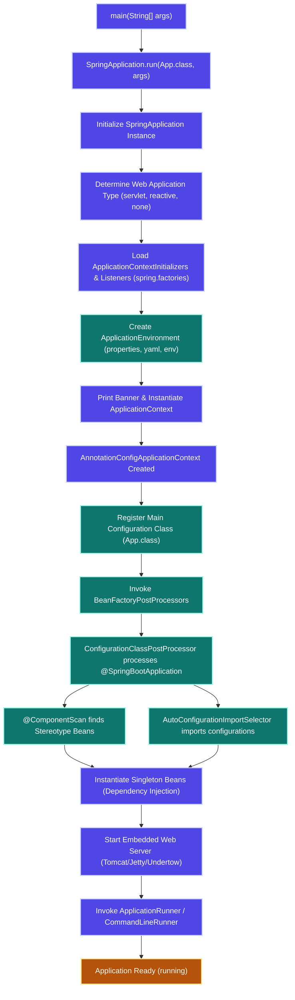
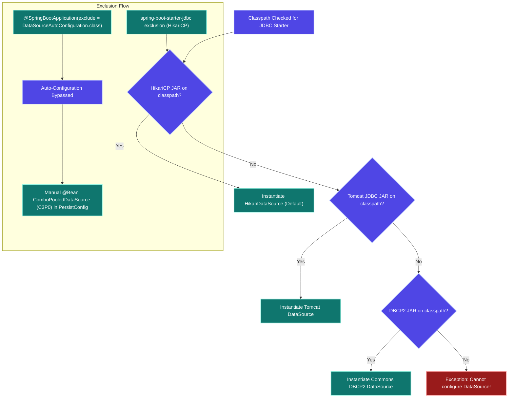
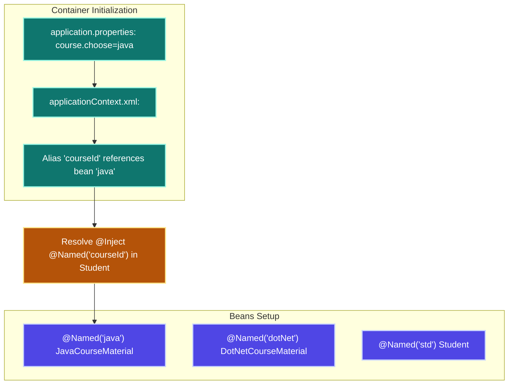
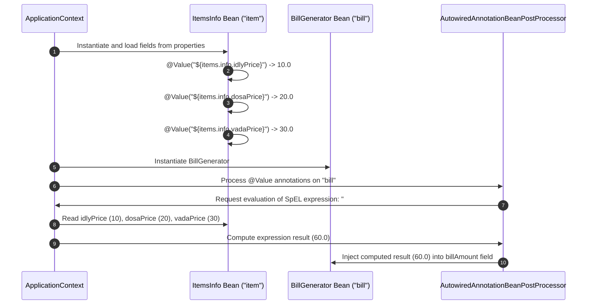
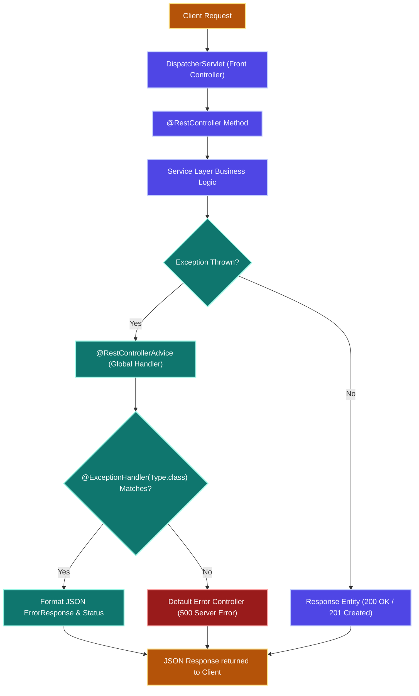

# SPRING BOOT - COMPREHENSIVE INTERVIEW & CERTIFICATION GUIDE
> *For: 7+ Years Experience Level | Senior Java Developer | Certification Candidate*

---

## SECTION 1: ARCHITECTURAL FOUNDATIONS & INTRODUCTION

### Spring Framework vs Spring Boot
Spring Boot is an opinionated, convention-over-configuration framework built on top of the Core Spring Framework. While Spring provides maximum flexibility and requires manual configuration (XML, Java Config, or hybrid), Spring Boot aims to minimize boilerplate setup and accelerate production-readiness through automated defaults.

| Feature / Metric | Spring Framework | Spring Boot |
| :--- | :--- | :--- |
| **Core Paradigm** | Flexible, modular application framework requiring explicit configurations. | Opinionated, convention-over-configuration framework for rapid setup. |
| **Configuration Style** | Declarative via XML schemas, `@Configuration` classes, or hybrids. | Dynamic Auto-Configuration based on dependencies found on the classpath. |
| **Server Setup** | Requires manual packaging into WAR and deployment on an external server. | Ships with embedded servers (Tomcat, Jetty, Undertow) for direct JAR execution. |
| **Dependency Management**| Manual definition of individual dependencies and versions in `pom.xml`. | Pre-packaged "Starters" that bundle compatible dependencies and manage versions. |
| **Production Readiness** | Requires manual integration of metrics, health checks, and monitoring. | Out-of-the-box support for health checks, metrics, and environment configurations via Actuator. |
| **Bootstrapping** | Programmatic initialization (e.g., `AnnotationConfigApplicationContext`). | Automatic bootstrapping via the static `SpringApplication.run()` interface. |

### Build Automation & Lifecycle Management
The build process compiles, tests, packages, and prepares applications for deployment.
- **Manual Build Limitations**: Time-consuming, error-prone, hard to manage transitive dependencies, and lacks dynamic library downloading.
- **Automation tools**:
  - **Batch Files (`.bat`)**: Automated scripts, but lack conditional dependency handling or dynamic artifact download.
  - **Apache Ant**: XML-based build tool, but requires writing verbose procedural steps.
  - **Apache Maven**: Declarative project management tool using a Project Object Model (`pom.xml`). It handles dependency resolution, directory conventions (Archetypes), and lifecycle phases automatically.

#### Common Maven Commands:
- `mvn clean`: Deletes the target output directory containing previous builds.
- `mvn compile`: Compiles all source code (`src/main/java`).
- `mvn test`: Runs unit tests (`src/test/java`).
- `mvn package`: Bundles compiled code into a deployable format (JAR/WAR).
- `mvn install`: Installs the packaged artifact into the local repository (`~/.m2`).
- `mvn dependency:tree`: Displays the project dependency hierarchy to diagnose conflicts.

---

### Project 1: FirstSpringBootProject
A baseline project demonstrating components, zero-parameter constructors, initialization order, main method startup, and basic lifecycle hooks.

#### 1. MessageGenerator.java (Service Component)
```java
package com.SpringBoot.MessageGenerator;

import java.time.LocalDateTime;
import org.springframework.beans.factory.annotation.Autowired;
import org.springframework.stereotype.Component;

@Component(value = "Wmg")
public class MessageGenerator {
    @Autowired
    private LocalDateTime date;

    static {
        System.out.println("MessageGenerator.class file is loading...");
    }

    public MessageGenerator() {
        System.out.println("MessageGenerator Object is Created: Zero Param Constructor...");
    }

    public String getMessage(String user) {
        int hour = date.getHour();
        if (hour >= 6 && hour <= 12) {
            return "Hello :: " + user + " Good Morning ";
        } else if (hour >= 12 && hour <= 16) {
            return "Hello :: " + user + " Good Afternoon ";
        } else if (hour >= 16 && hour <= 20) {
            return "Hello :: " + user + " Good Evening ";
        } else {
            return "Hello :: " + user + " Good Night ";
        }
    }
}
```

#### 2. FirstSpringBootProjectApplication.java (Main Bootstrapper)
```java
package com.SpringBoot;

import java.time.LocalDateTime;
import org.springframework.boot.SpringApplication;
import org.springframework.boot.autoconfigure.SpringBootApplication;
import org.springframework.context.ConfigurableApplicationContext;
import org.springframework.context.annotation.Bean;
import com.SpringBoot.MessageGenerator.MessageGenerator;

@SpringBootApplication
public class FirstSpringBootProjectApplication {

    static {
        System.out.println("FirstSpringBootProjectApplication.class file is loading...");
    }

    public FirstSpringBootProjectApplication() {
        System.out.println("FirstSpringBootProjectApplication Object is Created: Zero Param Constructor...");
    }

    @Bean(name = "dt")
    public LocalDateTime getSystemDateTime() {
        System.out.println("FirstSpringBootProjectApplication.getSystemDateTime()");
        return LocalDateTime.now();
    }

    public static void main(String[] args) {
        ConfigurableApplicationContext context = 
            SpringApplication.run(FirstSpringBootProjectApplication.class, args);
        System.out.println("*****Container started*******\n");
        
        MessageGenerator message = context.getBean(MessageGenerator.class);
        String msg = message.getMessage("Teja");
        System.out.println(msg);
        
        System.out.println("\n*****Container closed*******");
        context.close();
    }
}
```

#### Expected Application Startup Log Output:
```text
FirstSpringBootProjectApplication.class file is loading...
  .   ____          _            __ _ _
 /\\ / ___'_ __ _ _(_)_ __  __ _ \ \ \ \
( ( )\___ | '_ | '_| | '_ \/ _` | \ \ \ \
 \\/  ___)| |_)| | | | | || (_| |  ) ) ) )
  '  |____| .__|_| |_|_| |_\__, | / / / /
 =========|_|==============|___/=/_/_/_/
 :: Spring Boot ::                (v3.5.4)

2026-08-16T23:44:15.351+05:30 INFO 28844 --- [FirstSpringBootProject] [main] c.S.FirstSpringBootProjectApplication : Starting FirstSpringBootProjectApplication using Java 19...
2026-08-16T23:44:15.355+05:30 INFO 28844 --- [FirstSpringBootProject] [main] c.S.FirstSpringBootProjectApplication : No active profile set, falling back to 1 default profile: "default"
FirstSpringBootProjectApplication Object is Created: Zero Param Constructor...
MessageGenerator.class file is loading...
MessageGenerator Object is Created: Zero Param Constructor...
FirstSpringBootProjectApplication.getSystemDateTime()
2026-08-16T23:44:15.779+05:30 INFO 28844 --- [FirstSpringBootProject] [main] c.S.FirstSpringBootProjectApplication : Started FirstSpringBootProjectApplication in 0.893 seconds
*****Container started*******

Hello :: Teja Good Night 

*****Container closed*******
```

#### Key Takeaways
- Spring Boot uses convention-over-configuration to reduce XML and Java configuration.
- Maven manages the project lifecycle, dependency tree, and builds deployable JARs.
- Classloading occurs before instantiation: Application class loads, then static blocks execute, followed by constructor calls.

---

## SECTION 2: SPRING BOOT BOOTSTRAP & CORE MECHANICS

### The `@SpringBootApplication` Annotation
Annotating the main class with `@SpringBootApplication` activates three major features under a single meta-annotation:
1. **`@SpringBootConfiguration`**: Marks the class as a configuration source containing `@Bean` methods. It is a specialization of Spring's standard `@Configuration` annotation.
2. **`@EnableAutoConfiguration`**: Tells Spring Boot to dynamically configure beans based on library JARs found on the classpath.
3. **`@ComponentScan`**: Configures component scanning to automatically register classes annotated with `@Component`, `@Service`, `@Repository`, or `@RestController` in the class package and its sub-packages.

### The `SpringApplication.run()` Bootstrap Cycle
When `SpringApplication.run(App.class, args)` is invoked, it kicks off the following bootstrap pipeline:



#### Key Takeaways
- `@SpringBootApplication` is a meta-annotation composed of `@SpringBootConfiguration`, `@EnableAutoConfiguration`, and `@ComponentScan`.
- `SpringApplication.run()` dynamically detects whether the application is a Servlet-based web app, a Reactive Webflux app, or a standalone non-web app, creating the corresponding ApplicationContext.
- By default, all registered beans are instanced as **Singletons** at startup unless marked with another scope (e.g., `@Scope("prototype")`).

---

## SECTION 3: AUTO-CONFIGURATION & CONNECTION POOLING

### Internal Mechanics of Auto-Configuration
1. `@EnableAutoConfiguration` registers the `AutoConfigurationImportSelector` class.
2. The selector reads configuration classes registered in `META-INF/spring/org.springframework.boot.autoconfigure.AutoConfiguration.imports` (or `spring.factories` in older versions).
3. Every auto-configuration class is evaluated against conditional annotations:
   - `@ConditionalOnClass`: Activates only if specified classes are present on the classpath.
   - `@ConditionalOnMissingBean`: Declares a bean only if the user hasn't defined a custom one.
   - `@ConditionalOnProperty`: Activates configuration based on application properties.

### Connection Pool Auto-Configuration Priority
When `spring-boot-starter-jdbc` is included in the project dependencies, Spring Boot evaluates the classpath to determine which connection pool implementation to initialize. The priority order is:



---

### Project 2: BootProj08 - RealTimeDIUsingYML - Excluding HikariCP
This project demonstrates how to exclude the default connection pool (HikariCP) and configure an alternative one (Tomcat JDBC) using maven dependency exclusions and properties.

#### 1. pom.xml Exclusion Setup
```xml
<dependency>
    <groupId>org.springframework.boot</groupId>
    <artifactId>spring-boot-starter-jdbc</artifactId>
    <exclusions>
        <!-- Exclude HikariCP to force fallback -->
        <exclusion>
            <groupId>com.zaxxer</groupId>
            <artifactId>HikariCP</artifactId>
        </exclusion>
    </exclusions>
</dependency>
<!-- Add Tomcat JDBC and MySQL connector -->
<dependency>
    <groupId>org.apache.tomcat</groupId>
    <artifactId>tomcat-jdbc</artifactId>
</dependency>
<dependency>
    <groupId>com.mysql</groupId>
    <artifactId>mysql-connector-j</artifactId>
    <scope>runtime</scope>
</dependency>
```

#### 2. application.yml configuration
```yaml
spring:
  datasource:
    url: jdbc:mysql:///enterprisejavabatch
    username: root
    password: root123
    driver-class-name: com.mysql.cj.jdbc.Driver
```

#### 3. EmployeeDaoImpl.java (Repository checking connection pool type)
```java
package in.ineuron.comp;

import java.sql.Connection;
import java.sql.PreparedStatement;
import java.sql.ResultSet;
import java.util.ArrayList;
import java.util.List;
import javax.sql.DataSource;
import org.springframework.beans.factory.annotation.Autowired;
import org.springframework.stereotype.Repository;
import in.ineuron.dto.Employee;

@Repository("empDao")
public class EmployeeDaoImpl implements IEmployeeDAO {
    @Autowired
    private DataSource dataSource;

    @Override
    public List<Employee> findAllEmployees() throws Exception {
        // Output the class name to verify which pool is loaded
        System.out.println("DataSource class implementation in use :: " + dataSource.getClass().getName());
        
        List<Employee> empList = new ArrayList<>();
        try (Connection con = dataSource.getConnection();
             PreparedStatement ps = con.prepareStatement("SELECT eid, ename, eage, eaddress FROM employee");
             ResultSet rs = ps.executeQuery()) {
            
            while (rs.next()) {
                Employee emp = new Employee();
                emp.setEid(rs.getInt(1));
                emp.setEname(rs.getString(2));
                emp.setEage(rs.getInt(3));
                emp.setEaddress(rs.getString(4));
                empList.add(emp);
            }
        }
        return empList;
    }
}
```

#### Console Verification Output:
```text
DataSource class implementation in use :: org.apache.tomcat.jdbc.pool.DataSource
```

#### Key Takeaways
- Spring Boot Auto-Configuration is modular and dynamically evaluated at startup using `@Conditional` rules.
- Exclusion of default packages allows developers to swap components without changing Java source code.
- Default connection pool priority places HikariCP first, followed by Tomcat JDBC, and Commons DBCP2 third.

---

## SECTION 4: MANUAL DATASOURCE CONFIGURATION

In enterprise systems, automatic data sources might not fit specific security parameters, credential vaults, or pool configurations (e.g., using C3P0). To override Auto-Configuration entirely:
1. Exclude the default `DataSourceAutoConfiguration` and `JdbcTemplateAutoConfiguration` classes.
2. Manually define the `@Bean` method inside a custom `@Configuration` class, utilizing Spring's `Environment` to map database properties.

---

### Project 3: BootProj09 - RealTimeDIUsingYML - Manual DataSource Injection
This project demonstrates manual creation of a C3P0 connection pool, overriding the autoconfigured pool completely.

#### 1. pom.xml Setup
```xml
<dependency>
    <groupId>org.springframework.boot</groupId>
    <artifactId>spring-boot-starter-jdbc</artifactId>
    <exclusions>
        <exclusion>
            <groupId>com.zaxxer</groupId>
            <artifactId>HikariCP</artifactId>
        </exclusion>
    </exclusions>
</dependency>
<dependency>
    <groupId>com.mchange</groupId>
    <artifactId>c3p0</artifactId>
    <version>0.9.5.5</version>
</dependency>
```

#### 2. BootProj09RealTimeDIManualDataSourceApplication.java (Auto-Config Bypassed)
```java
package in.ineuron;

import org.springframework.boot.SpringApplication;
import org.springframework.boot.autoconfigure.SpringBootApplication;
import org.springframework.boot.autoconfigure.jdbc.DataSourceAutoConfiguration;
import org.springframework.boot.autoconfigure.jdbc.JdbcTemplateAutoConfiguration;
import org.springframework.context.ApplicationContext;
import in.ineuron.comp.IEmployeeDAO;

@SpringBootApplication(exclude = {
    DataSourceAutoConfiguration.class,
    JdbcTemplateAutoConfiguration.class
})
public class BootProj09RealTimeDIManualDataSourceApplication {
    public static void main(String[] args) throws Exception {
        ApplicationContext context = 
            SpringApplication.run(BootProj09RealTimeDIManualDataSourceApplication.class, args);
        IEmployeeDAO dao = context.getBean("empDao", IEmployeeDAO.class);
        System.out.println("Employees Count: " + dao.findAllEmployees().size());
    }
}
```

#### 3. PersistConfig.java (Custom Configuration Class)
```java
package in.ineuron.persist;

import com.mchange.v2.c3p0.ComboPooledDataSource;
import javax.sql.DataSource;
import org.springframework.beans.factory.annotation.Autowired;
import org.springframework.context.annotation.Bean;
import org.springframework.context.annotation.Configuration;
import org.springframework.core.env.Environment;

@Configuration
public class PersistConfig {
    @Autowired
    private Environment env;

    @Bean
    public DataSource createDS() throws Exception {
        System.out.println("PersistConfig.createDS() called manually...");
        ComboPooledDataSource dataSource = new ComboPooledDataSource();
        dataSource.setDriverClass(env.getProperty("spring.datasource.driver-class-name"));
        dataSource.setJdbcUrl(env.getProperty("spring.datasource.url"));
        dataSource.setUser(env.getProperty("spring.datasource.username"));
        dataSource.setPassword(env.getProperty("spring.datasource.password"));
        return dataSource;
    }
}
```

#### Console Verification Output:
```text
PersistConfig.createDS() called manually...
DataSource class implementation in use :: com.mchange.v2.c3p0.ComboPooledDataSource
```

#### Key Takeaways
- The `exclude` attribute of `@SpringBootApplication` bypasses auto-configuration engines.
- The `Environment` bean exposes unified access to properties configured in `application.yml`, OS env, and command-line inputs.
- Manual beans override auto-configured candidates, allowing custom class injection (e.g., C3P0 `ComboPooledDataSource`).

---

## SECTION 5: JSR-330 & NON-INVASIVE PROGRAMMING

### Invasive vs Non-Invasive Paradigms
- **Invasive Programming**: Tightly couples application source code to framework-specific dependencies (e.g., importing `org.springframework.stereotype.Component` or `org.springframework.beans.factory.annotation.Autowired`).
- **Non-Invasive Programming**: Keeps code loosely coupled by utilizing standard annotations that remain portable across various dependency injection containers (e.g., Java Standards JSR-330 and JSR-250).

### Annotation Mappings

| JSR Standard (javax.inject / jakarta.annotation) | Spring Equivalent | Scope / Support |
| :--- | :--- | :--- |
| `@Inject` | `@Autowired` | Injection at field, constructor, or setter level. Lacks "required" attribute. |
| `@Named("name")` | `@Component` / `@Qualifier` | Stereotype naming and dependency resolution mapping. |
| `@Resource(name="...")` | `@Autowired` + `@Qualifier` | Field or setter level injection only (no constructor support). |
| `@PostConstruct` | Custom init-method | Lifecycle callback method called after bean initialization. |
| `@PreDestroy` | Custom destroy-method | Lifecycle callback method called before container shutdown. |

---

### Project 4: BootProj07 - DependencyInjection - JSR-330 & Legacy XML Hybrid Setup
This project demonstrates dynamic strategy resolution using standard JSR-330 annotations integrated with an XML alias resolver configuration.



#### 1. pom.xml Dependencies
```xml
<dependency>
    <groupId>javax.inject</groupId>
    <artifactId>javax.inject</artifactId>
    <version>1</version>
</dependency>
```

#### 2. application.properties
```properties
course.choose=java
```

#### 3. applicationContext.xml (XML Bridge Configuration)
```xml
<?xml version="1.0" encoding="UTF-8"?>
<beans xmlns="http://www.springframework.org/schema/beans"
       xmlns:xsi="http://www.w3.org/2001/XMLSchema-instance"
       xsi:schemaLocation="http://www.springframework.org/schema/beans
                           https://www.springframework.org/schema/beans/spring-beans.xsd">
    <!-- Read application properties to dynamically map bean alias -->
    <alias name="${course.choose}" alias="courseId" />
</beans>
```

#### 4. ICourseMaterial.java & JavaCourseMaterial.java (Strategy & Implementation)
```java
package in.ineuron.dependent;

public interface ICourseMaterial {
    String courseContent();
    double price();
}
```
```java
package in.ineuron.dependent;

import javax.inject.Named;

@Named("java")
public final class JavaCourseMaterial implements ICourseMaterial {
    static {
        System.out.println("JavaCourseMaterial.class file is loading...");
    }
    public JavaCourseMaterial() {
        System.out.println("JavaCourseMaterial Object is Created...");
    }
    @Override
    public String courseContent() {
        return "1. oops 2. ExceptionHandling 3.Collection";
    }
    @Override
    public double price() {
        return 500.0;
    }
}
```

#### 5. Student.java (Target Bean Using JSR-330 Standard Injection)
```java
package in.ineuron.comp;

import javax.inject.Inject;
import javax.inject.Named;
import in.ineuron.dependent.ICourseMaterial;

@Named("std")
public class Student {
    static {
        System.out.println("Student.class file is loading...");
    }
    public Student() {
        System.out.println("Student Object is instantiated...");
    }

    @Inject
    @Named(value = "courseId")
    private ICourseMaterial material;

    public void preparation(String examName) {
        System.out.println("Preparation started for :: " + examName);
        String courseContent = material.courseContent();
        double price = material.price();
        System.out.println("Preparation in progress using :: " + courseContent + " | Price: " + price);
        System.out.println("Preparation completed for :: " + examName);
    }
    
    public ICourseMaterial getMaterial() { return material; }
}
```

#### 6. Main Bootstrapper
```java
package in.ineuron;

import org.springframework.boot.SpringApplication;
import org.springframework.boot.autoconfigure.SpringBootApplication;
import org.springframework.context.ApplicationContext;
import org.springframework.context.ConfigurableApplicationContext;
import org.springframework.context.annotation.ImportResource;
import in.ineuron.comp.Student;

@SpringBootApplication
@ImportResource(locations = "in/ineuron/cfg/applicationContext.xml")
public class BootProj07DependencyInjectionJavaConfigurationApplication {
    public static void main(String[] args) throws Exception {
        ApplicationContext context = 
            SpringApplication.run(BootProj07DependencyInjectionJavaConfigurationApplication.class, args);
        
        Student student = context.getBean(Student.class);
        System.out.println(student);
        student.preparation(student.getMaterial().getClass().getName());
        
        ((ConfigurableApplicationContext) context).close();
    }
}
```

#### Key Takeaways
- JSR-330 annotations (`@Inject`, `@Named`) make application code portable across DI engines (Spring, Guice, CDI).
- `@ImportResource` bridges Spring Boot with legacy XML setups, enabling dynamic features like XML-based aliasing.
- The standard annotation priority list goes: Java Config Standards (`@Inject`, `@Named`) -> Spring custom annotations -> third party configurations.

---

## SECTION 6: PROPERTIES, YAML & COLLECTION INJECTION

### application.properties vs application.yml

| Configuration Aspect | application.properties | application.yml |
| :--- | :--- | :--- |
| **Structure Style** | Flat, repetitive dot-notated key-value mappings. | Hierarchical indentation style representing nested nodes. |
| **Readability** | High for simple maps; low for complex, nested configurations. | Clean and organized for large, multi-level parameters. |
| **Document Splitting** | Requires profile-specific files (e.g., `application-dev.properties`). | Supported within a single file using the `---` separator. |
| **Collections / Maps** | Expressed using index notation (e.g., `list[0]=value`). | Native, readable list and map structures. |
| **Loading Order** | Loaded **after** YAML files, overriding any matching properties. | Loaded **before** properties files. |

---

### `@Value` vs `@ConfigurationProperties`

| Feature | `@Value` | `@ConfigurationProperties` |
| :--- | :--- | :--- |
| **Binding Style** | Annotation-driven mapping on individual fields. | Bulk-mapping of prefixes directly to Java class structures. |
| **SpEL Support** | Fully supported (`#Value("#{item.idlyPrice}")`). | Unsupported. |
| **Relaxed Binding** | Not supported (keys must match variable names exactly). | Supported (e.g., maps `emp-name`, `empName`, `emp_name` variables). |
| **Validation** | Manual or limited. | Supports standard JSR-380 validation (e.g., `@NotNull`). |
| **Collection Mapping** | Complex comma-separated list parser required. | Maps lists, maps, sets, and nested classes directly. |

---

### YAML Collection & Nested Object Injection Example
Using `@ConfigurationProperties` to bind hierarchical YAML objects directly to structured Java collections.

#### 1. application.yml definition
```yaml
employee:
  empName: Aravind
  empId: 21
  empSkills:
    - Core Java
    - Spring Boot
    - SQL
  empProjects:
    - Banking Finance System
    - Retail Merchandise System
  idDetails:
    aadhar: AD1234XYZ
    pan: PAN1234XYZ
    passport: PAS1234XYZ
```

#### 2. Employee.java Bean
```java
package com.SpringBoot.Vo;

import java.util.List;
import java.util.Map;
import org.springframework.boot.context.properties.ConfigurationProperties;
import org.springframework.stereotype.Component;

@Component
@ConfigurationProperties(prefix = "employee")
public class Employee {
    private String empName;
    private int empId;
    private List<String> empSkills;
    private List<String> empProjects;
    private Map<String, String> idDetails;

    // Getters, Setters, and toString() methods
    public String getEmpName() { return empName; }
    public void setEmpName(String empName) { this.empName = empName; }
    public int getEmpId() { return empId; }
    public void setEmpId(int empId) { this.empId = empId; }
    public List<String> getEmpSkills() { return empSkills; }
    public void setEmpSkills(List<String> empSkills) { this.empSkills = empSkills; }
    public List<String> getEmpProjects() { return empProjects; }
    public void setEmpProjects(List<String> empProjects) { this.empProjects = empProjects; }
    public Map<String, String> getIdDetails() { return idDetails; }
    public void setIdDetails(Map<String, String> idDetails) { this.idDetails = idDetails; }

    @Override
    public String toString() {
        return "Employee [empName=" + empName + ", empId=" + empId + 
               ", empSkills=" + empSkills + ", empProjects=" + empProjects + 
               ", idDetails=" + idDetails + "]";
    }
}
```

#### Key Takeaways
- YAML supports hierarchical structures, reducing property duplication.
- `@ConfigurationProperties` is ideal for binding groups of related configuration properties to type-safe beans.
- Relaxed binding maps variations (kebab-case, camelCase, snake_case) to standard Java variables.

---

## SECTION 7: SPRING EXPRESSION LANGUAGE (SpEL)

SpEL allows developers to write expressions that evaluate dynamically at runtime within the bean container.
- **`${key}` (Property Placeholder)**: Resolves static values declared in external resources (e.g. `application.properties`). Evaluated at compile/startup time.
- **`#{expression}` (SpEL Syntax)**: Dynamically evaluates logical, mathematical, or bean reference expressions within the ApplicationContext during the bean initialization phase.

---

### Project 5: BootProj10 - SpEL Cross-Bean Dependency Evaluation
Shows how `BillGenerator` evaluates fields from another bean `ItemsInfo` at runtime during the Dependency Injection lifecycle.



#### 1. ItemsInfo.java (Source Bean)
```java
package in.ineuron.dependent;

import org.springframework.beans.factory.annotation.Value;
import org.springframework.stereotype.Component;

@Component("item")
public class ItemsInfo {
    @Value("${items.info.idlyPrice}")
    public float idlyPrice;

    @Value("${items.info.dosaPrice}")
    public float dosaPrice;

    @Value("${items.info.vadaPrice}")
    public float vadaPrice;

    @Override
    public String toString() {
        return "ItemsInfo [idlyPrice=" + idlyPrice + ", dosaPrice=" + dosaPrice + 
               ", vadaPrice=" + vadaPrice + "]";
    }
}
```

#### 2. BillGenerator.java (Target Evaluation Bean)
```java
package in.ineuron.comp;

import org.springframework.beans.factory.annotation.Autowired;
import org.springframework.beans.factory.annotation.Value;
import org.springframework.stereotype.Component;
import in.ineuron.dependent.ItemsInfo;

@Component("bill")
public class BillGenerator {
    // Dynamically query properties from the 'item' bean and add them
    @Value("#{item.idlyPrice + item.dosaPrice + item.vadaPrice}")
    private Float billAmount;

    @Value("Accord")
    private String hotelName;

    @Autowired
    private ItemsInfo info;

    @Override
    public String toString() {
        return "BillGenerator [billAmount=" + billAmount + 
               ", hotelName=" + hotelName + ", info=" + info + "]";
    }
}
```

#### Key Takeaways
- `${key}` retrieves properties; `#{expression}` evaluates runtime SpEL statements.
- SpEL can invoke methods, evaluate mathematical formulas, perform logical checks, and access other beans' fields dynamically.
- SpEL evaluation occurs during the bean post-processing phase of the container initialization cycle.

---

## SECTION 8: REST APIs & LAYERED ARCHITECTURE

Enterprise Spring Boot applications implement separation of concerns across multiple layers:
1. **Presentation (Controller) Layer**: Exposes endpoints via `@RestController`, maps inputs (`@PathVariable`, `@RequestParam`, `@RequestBody`), and structures responses using `ResponseEntity`.
2. **Business (Service) Layer**: Implements business rules, defines transaction boundaries (`@Transactional`), and maps data structures (VO $\leftrightarrow$ DTO $\leftrightarrow$ BO).
3. **Data Access (Repository) Layer**: Interfaces with databases (via JDBC, Hibernate, or Spring Data).
4. **Database**: The physical persistence storage.

### Data Patterns: VO vs DTO vs BO

| Pattern | Scope | Purpose | Type Constraints |
| :--- | :--- | :--- | :--- |
| **VO (Value Object)** | Presentation / API Layer. | Captures raw user input from requests. | Values are typically mapped as flat Strings to prevent conversion errors during deserialization. |
| **DTO (Data Transfer Object)**| Presentation $\leftrightarrow$ Service. | Transfers structured, typed data between layers. | Formatted using strongly typed variables. Contains validation annotations. |
| **BO (Business Object / Entity)**| Service $\leftrightarrow$ DAO. | Maps directly to business rules and database schemas. | Formatted to match domain entities and database tables. |

---

### Complete CRUD RestController Example



```java
package com.SpringBoot.Controller;

import java.util.List;
import org.springframework.beans.factory.annotation.Autowired;
import org.springframework.http.HttpStatus;
import org.springframework.http.ResponseEntity;
import org.springframework.web.bind.annotation.*;
import com.SpringBoot.Vo.CustomerVo;
import com.SpringBoot.Service.CustomerService;

@RestController
@RequestMapping("/api/v1/customers")
public class CustomerRestController {

    @Autowired
    private CustomerService service;

    @GetMapping("/{id}")
    public ResponseEntity<CustomerVo> getCustomerById(@PathVariable int id) {
        CustomerVo customer = service.findById(id);
        if (customer != null) {
            return ResponseEntity.ok(customer);
        }
        return ResponseEntity.status(HttpStatus.NOT_FOUND).build();
    }

    @GetMapping
    public ResponseEntity<List<CustomerVo>> getAllCustomers() {
        return ResponseEntity.ok(service.getAllCustomers());
    }

    @PostMapping
    public ResponseEntity<String> insertCustomer(@RequestBody CustomerVo vo) {
        try {
            String result = service.processResult(vo);
            return ResponseEntity.status(HttpStatus.CREATED).body(result);
        } catch (Exception e) {
            return ResponseEntity.status(HttpStatus.INTERNAL_SERVER_ERROR)
                                 .body("Error inserting customer: " + e.getMessage());
        }
    }

    @DeleteMapping("/{id}")
    public ResponseEntity<String> deleteCustomer(@PathVariable int id) {
        int status = service.deleteById(id);
        return ResponseEntity.ok("Deleted customer with ID: " + status);
    }

    @PutMapping("/{id}")
    public ResponseEntity<CustomerVo> updateCustomer(@PathVariable int id) {
        CustomerVo updated = service.updateById(id);
        return ResponseEntity.ok(updated);
    }
}
```

#### Key Takeaways
- The presentation layer maps client payloads directly into Value Objects (VO) using String variables.
- Using `ResponseEntity` allows controllers to specify HTTP status codes (200 OK, 201 Created, 404 Not Found) alongside response bodies.
- Separation of concerns ensures each layer has a single responsibility, simplifying testing and maintenance.

---

## SECTION 9: ADVANCED FEATURES & PRODUCTION READINESS

### Profiles: Multi-Environment Configurations
Profiles allow developers to isolate configuration parameters for different environments (e.g., dev, test, prod).
- **Setup**: Define properties using the naming convention `application-{profile}.properties` or `application-{profile}.yml`.
- **Activation**: Set `spring.profiles.active=dev` in `application.properties` or execute the application with JVM flags:
  ```bash
  java -jar app.jar --spring.profiles.active=prod
  ```
- **YML Multi-profile Blocks**:
  ```yaml
  spring:
    profiles:
      active: dev
  ---
  spring:
    config:
      activate:
        on-profile: dev
  server:
    port: 8080
  ---
  spring:
    config:
      activate:
        on-profile: prod
  server:
    port: 443
  ```

### Spring Boot Actuator
Actuator exposes production-ready HTTP endpoints to monitor and interact with your application.
- **Core Endpoints**:
  - `/actuator/health`: Provides basic application health information (can show detailed subsystem status like DB, disk, or rabbitmq connections).
  - `/actuator/metrics`: Exposes metric category names (e.g., JVM memory heap usage, HTTP request count).
  - `/actuator/env`: Exposes environment configuration properties.
  - `/actuator/loggers`: View and modify application log levels at runtime.
- **Configuration**:
  ```properties
  management.endpoints.web.exposure.include=health,info,metrics,loggers
  management.endpoint.health.show-details=always
  ```
- **Custom Health Indicator**:
  ```java
  @Component
  public class CustomDbHealthIndicator implements HealthIndicator {
      @Override
      public Health health() {
          boolean databaseStatus = checkDatabaseConnection();
          if (databaseStatus) {
              return Health.up().withDetail("Database Status", "Active and Reusable").build();
          }
          return Health.down().withDetail("Database Status", "Unavailable/Timeout").build();
      }
      private boolean checkDatabaseConnection() {
          // implementation logic
          return true;
      }
  }
  ```

### Spring Boot Logging & Configuration
Spring Boot uses SLF4J (Simple Logging Facade for Java) with Logback as the default engine.
- **Log Levels**: `TRACE` < `DEBUG` < `INFO` < `WARN` < `ERROR`.
- **Properties configuration**:
  ```properties
  logging.level.root=INFO
  logging.level.org.springframework.web=DEBUG
  logging.file.name=logs/app-execution.log
  ```
- **Structured JSON Logging (ELK Stack integration)**:
  ```properties
  logging.pattern.console={"timestamp":"%d{yyyy-MM-dd HH:mm:ss.SSS}","level":"%p","thread":"%t","logger":"%logger","message":"%m"}%n
  ```

### Developer Tools (DevTools)
Spring Boot DevTools speeds up development through:
1. **Automatic Restart**: Triggers a context restart when files on the classpath change.
2. **LiveReload**: Auto-refreshes supported client browsers on resource changes.
3. **Property Defaults**: Sets development properties (like disabling templates cache) to standard debug modes.
4. **H2 Console**: Enables H2 database web interface.

### Reactive WebFlux vs Spring MVC
- **Spring MVC**: Servlet-based, blocking model using a thread-per-request architecture. Built on traditional Tomcat servers. Ideal for standard relational databases and synchronous operations.
- **Spring WebFlux**: Reactive, non-blocking framework built on Netty. Uses event-loop execution models, supporting backpressure. Perfect for high-concurrency systems, streaming services, and non-blocking databases (e.g. MongoDB, R2DBC).

### Testing Slices
Spring Boot provides testing annotations that load only specific layers of the ApplicationContext to keep tests fast and isolated:
- `@SpringBootTest`: Loads the complete ApplicationContext for full integration testing.
- `@WebMvcTest`: Focuses only on the controller layer, auto-configuring MVC infrastructure and mocking dependencies (uses `@MockBean`).
- `@DataJpaTest`: Loads only database layers (repositories), auto-configuring an in-memory database and running transactions that roll back by default.
- `@JsonTest`: Focuses only on JSON serialization and deserialization, auto-configuring Jackson/Gson objects.

#### Key Takeaways
- Profiles isolate configuration properties for dev, test, and production environments.
- Actuator exposes monitoring endpoints, and custom indicators can be registered to track system dependencies.
- Testing slices (`@WebMvcTest`, `@DataJpaTest`) keep test execution fast by loading only required layers of the context.

---

## ASPECT-ORIENTED PROGRAMMING (AOP) - COMPREHENSIVE INTERVIEW GUIDE

For: 5+ Years Experience Level | Senior Java Developer | Spring Boot
Appended: March 2026

## TABLE OF CONTENTS:

## SECTION 1  : AOP Basics (What, Why, Key Concepts)

## SECTION 2  : Types of Advice (Before, After, Around, etc.)

## SECTION 3  : Pointcut Expressions (Deep Dive)

## SECTION 4  : Proxy Mechanism (JDK vs CGLIB)

## SECTION 5  : Spring AOP vs AspectJ

## SECTION 6  : Real-Time Use Cases with Code

## SECTION 7  : Complete Mini Project (Logging + Performance + Exception)

## SECTION 8  : Advanced Interview Questions

## SECTION 9  : Best Practices & Anti-Patterns

## SECTION 10 : Quick-Fire Interview Q&A Reference

## SECTION 1: AOP BASICS - WHAT, WHY, KEY CONCEPTS

#### Q1. What is AOP (Aspect-Oriented Programming)? Why is it used?

ANSWER:
AOP is a programming paradigm that allows you to separate CROSS-CUTTING
CONCERNS from business logic. Cross-cutting concerns are functionalities
that span across multiple layers of an application (logging, security,
transactions, performance monitoring) and cannot be cleanly modularized
using OOP alone.

PROBLEM WITHOUT AOP (code pollution):
@Service
public class OrderService {
    public void placeOrder(Order order) {
        // Logging code (cross-cutting concern)
        log.info("START placeOrder: " + order);

        // Security check (cross-cutting concern)
        if (!user.hasRole("ORDER_PLACER")) throw new AccessDeniedException();

        // Performance monitoring (cross-cutting concern)
        long start = System.currentTimeMillis();

        // === ACTUAL BUSINESS LOGIC ===
        validateOrder(order);
        chargePayment(order);
        dispatchOrder(order);
        // ==============================

        // More cross-cutting concerns mixed in
        long end = System.currentTimeMillis();
        log.info("EXECUTION TIME: " + (end - start) + "ms");
        log.info("END placeOrder: SUCCESS");
    }
}
PROBLEM: Business logic is buried under cross-cutting concerns.
         Same boilerplate repeated in PaymentService, UserService, etc.

WITH AOP:
@Service
public class OrderService {
    public void placeOrder(Order order) {
        // PURE BUSINESS LOGIC ONLY
        validateOrder(order);
        chargePayment(order);
        dispatchOrder(order);
    }
}
// Logging, Security, Performance -> handled separately in Aspect classes

HOW AOP SOLVES IT:
- Extracts cross-cutting concerns into Aspect classes
- Applies them automatically without modifying business classes
- Results in Clean, DRY, maintainable code

REAL-TIME USE CASES:
1. Logging (method entry/exit/params/return values)
2. Performance Monitoring (execution time measurement)
3. Security / Authorization checks
4. Transaction management (@Transactional internally uses AOP)
5. Exception handling / Alert triggering
6. Caching (@Cacheable internally uses AOP)
7. API request/response tracking
8. Audit logging (who changed what, when)
9. Rate limiting
10. Retry logic

INTERVIEW TIP: AOP is one of the 2 core features of the Spring Framework.
The other is IoC (Inversion of Control / Dependency Injection).

#### Q2. Explain Key AOP Concepts: Aspect, Advice, JoinPoint, Pointcut, Weaving

ANSWER:

| CONCEPT | DEFINITION |
| --- | --- |
| Aspect | A class that contains cross-cutting concern logic. |
| Annotated with @Aspect. Example: LoggingAspect.java |  |
| Advice | The ACTUAL ACTION to take at a join point. |
| Types: @Before, @After, @Around, @AfterReturning, |  |
| @AfterThrowing. It is the METHOD inside an Aspect. |  |
| JoinPoint | A specific point in program execution where advice can |
| be applied. In Spring AOP, always a METHOD EXECUTION. |  |
| The JoinPoint object gives method name, args, target. |  |
| Pointcut | An EXPRESSION that defines WHERE advice should be applied. |
| Which methods? Which classes? Which packages? |  |
| Example: execution(* com.app.service.*.*(..)) |  |
| Weaving | The process of linking Aspect code with the target object. |
| Types: Compile-time, Load-time, Runtime (Spring uses Runtime) |  |
| Target Object | The object being advised (proxied). Example: OrderService |
| Proxy | Spring creates a proxy wrapping the target object. |
| This proxy intercepts method calls and applies advice. |  |

ANALOGY (Real-World):
Think of a TOLL BOOTH on a highway:
- Highway = Your application
- Vehicles (method calls) = JoinPoints
- Toll Booth = Aspect
- Rules at toll booth (collect fee, check permit) = Advice
- "All vehicles passing between 8AM-8PM" = Pointcut
- Installing the toll booth = Weaving

CODE EXAMPLE:
@Aspect                         // <-- This class is an Aspect
@Component
public class LoggingAspect {

    @Pointcut("execution(* com.app.service.*.*(..))")  // <-- Pointcut
    public void serviceLayer() {}                        // pointcut method

```text
    @Before("serviceLayer()")   // <-- Advice (Before type)
    public void logBefore(JoinPoint joinPoint) {          // <-- JoinPoint param

```
        System.out.println("Method called: " +
            joinPoint.getSignature().getName());
    }
}

INTERVIEW TRAP:
#### Q: "Can Spring AOP intercept field access or constructor calls?"
**A:** NO! Spring AOP only supports METHOD EXECUTION join points.
AspectJ supports more (field access, constructor call, etc.)

## SECTION 2: TYPES OF ADVICE

#### Q3. Explain all Types of Advice with examples.

ANSWER:

| TYPE | WHEN IT RUNS | USE CASE |
| --- | --- | --- |
| @Before | Before method executes | Auth checks, logging |
| @After | After method (always, like finally) | Cleanup, audit |
| @AfterReturning | After method returns successfully | Log return value |
| @AfterThrowing | After method throws exception | Alert, re-throw |
| @Around | Wraps method (most powerful) | Performance, retry |

@Before ADVICE:
Runs BEFORE the target method. Cannot prevent method execution
(unless exception thrown). Gets JoinPoint to inspect method details.

@Before("execution(* com.app.service.*.*(..))")
public void logMethodEntry(JoinPoint joinPoint) {
    String methodName = joinPoint.getSignature().getName();
    Object[] args = joinPoint.getArgs();
    log.info(">>> ENTERING: {} with args: {}", methodName,
             Arrays.toString(args));
}

REAL-TIME SCENARIO: Authorization check before every service method.
@Before("execution(* com.app.service.*.*(..))")
public void checkAuthorization(JoinPoint joinPoint) {
    Authentication auth = SecurityContextHolder.getContext()
                                               .getAuthentication();
    if (auth == null || !auth.isAuthenticated()) {
        throw new AccessDeniedException("Unauthorized access!");
    }
}

@After ADVICE:
Runs AFTER method execution REGARDLESS of outcome (success or exception).
Like a finally block. Cannot access return value.

@After("execution(* com.app.service.*.*(..))")
public void logMethodExit(JoinPoint joinPoint) {
    log.info("<<< EXITING: {}", joinPoint.getSignature().getName());
    // Cleanup resources, release locks, audit trail, etc.
}

@AfterReturning ADVICE:
Runs only when method RETURNS SUCCESSFULLY. Can access the return value
using the 'returning' attribute.

@AfterReturning(
    pointcut = "execution(* com.app.service.OrderService.placeOrder(..))",
    returning = "result"  // binds return value to this param name
)
public void logReturnValue(JoinPoint joinPoint, Object result) {
    log.info("Method: {} returned: {}",
             joinPoint.getSignature().getName(), result);
}

REAL-TIME SCENARIO: Track successful payment completions.
@AfterReturning(
    pointcut = "execution(* com.app.service.PaymentService.processPayment(..))",
    returning = "paymentResult"
)
public void trackSuccessfulPayment(Object paymentResult) {
    metricsService.incrementSuccessfulPayments();
    log.info("Payment processed: {}", paymentResult);
}

@AfterThrowing ADVICE:
Runs only when method THROWS AN EXCEPTION. Can access the exception
using the 'throwing' attribute.

@AfterThrowing(
    pointcut = "execution(* com.app.service.*.*(..))",
    throwing = "ex"    // binds exception to this param name
)
public void handleException(JoinPoint joinPoint, Exception ex) {
    log.error("EXCEPTION in method: {} | Error: {}",
              joinPoint.getSignature().getName(), ex.getMessage());
    alertService.sendAlert("Service layer exception: " + ex.getMessage());
}

NOTE: @AfterThrowing does NOT suppress the exception. It propagates.

@Around ADVICE (Most Powerful):
Wraps the method. You control WHEN and IF the method runs.
Must call proceed() to execute the target method.
Can modify input args, modify return values, suppress exceptions.

@Around("execution(* com.app.service.*.*(..))")
public Object measurePerformance(ProceedingJoinPoint pjp) throws Throwable {
    long start = System.currentTimeMillis();
    String method = pjp.getSignature().getName();

    log.info(">>> START: {}", method);
    try {
        Object result = pjp.proceed();  // <-- Execute the actual method
        long elapsed = System.currentTimeMillis() - start;
        log.info("<<< END: {} | Time: {}ms", method, elapsed);
        return result;
    } catch (Exception ex) {
        log.error("EXCEPTION in {}: {}", method, ex.getMessage());
        throw ex;  // re-throw
    }
}

IMPORTANT: @Around uses ProceedingJoinPoint (not JoinPoint) because
           it needs the proceed() method to invoke the target.

EXECUTION ORDER (when multiple advice applied to same method):
@Around (before proceed)
```text
  -> @Before
  -> TARGET METHOD EXECUTES
  -> @AfterReturning OR @AfterThrowing

```
@After
@Around (after proceed returns)

INTERVIEW TRAP:
#### Q: "When to use @Around vs @Before + @AfterReturning?"
**A:** Use @Around when you need to measure time (need before AND after),
retry logic (call proceed multiple times), or modify args/result.
Use @Before/@AfterReturning when concerns are independent.

## SECTION 3: POINTCUT EXPRESSIONS (DEEP DIVE)

#### Q4. Explain Pointcut Expressions with examples.

ANSWER:
Pointcut expressions tell Spring AOP WHICH methods to intercept.
They use AspectJ pointcut expression language.

SYNTAX OF execution() POINTCUT:
execution([access-modifier] return-type [declaring-type].method-name(params) [throws])

Wildcards:
*   = matches any single element (any class, any method, any return type)
..  = matches any number of anything (any params, any sub-packages)

EXAMPLES:

1. ALL methods in a specific class:
execution(* com.app.service.OrderService.*(..))
^          ^ ^                           ^ ^
|modifier  |return|class                |method|params

2. ALL methods in ALL classes in a package:
execution(* com.app.service.*.*(..))

3. ALL methods in package AND sub-packages:
execution(* com.app..*.*(..))
            ^^--- matches any sub-package

4. Specific method name pattern (starts with "get"):
execution(* com.app.service.*.get*(..))

5. Methods with specific param type:
execution(* com.app.service.*.*(Long, ..))
   // first arg is Long, rest can be anything

6. Methods with NO params:
   execution(* com.app.service.*.find())
   // empty parentheses = no params

7. Methods that return String:
   execution(String com.app.service.*.*(..))

8. Methods annotated with custom annotation:
   @annotation(com.app.annotation.Loggable)
   // intercepts methods annotated with @Loggable

9. Within a specific type:
   within(com.app.service.*)
   // any method within any class in service package

10. Bean name pattern:
bean(orderService)     // specific bean
bean(*Service)         // any bean ending with "Service"

COMBINING POINTCUTS (Logical Operators):
// AND: method in service package AND annotated with @Transactional
@Pointcut("within(com.app.service..*) && @annotation(org.springframework.transaction.annotation.Transactional)")
public void transactionalServiceMethods() {}

// OR: either service OR repository layer
@Pointcut("within(com.app.service..*) || within(com.app.repository..*)")
public void serviceOrRepository() {}

// NOT: exclude specific method
@Pointcut("within(com.app.service..*) && !execution(* com.app.service.*.findById(..))")
public void serviceExceptFindById() {}

REUSABLE POINTCUT DEFINITION:
@Aspect
@Component
public class PointcutDefinitions {

    @Pointcut("execution(* com.app.controller.*.*(..))")
    public void controllerLayer() {}

    @Pointcut("execution(* com.app.service.*.*(..))")
    public void serviceLayer() {}

    @Pointcut("execution(* com.app.repository.*.*(..))")
    public void repositoryLayer() {}

    @Pointcut("serviceLayer() || repositoryLayer()")
    public void serviceAndRepository() {}
}

// Used in another Aspect:
@Before("com.app.aspect.PointcutDefinitions.serviceLayer()")
public void logServiceMethods(JoinPoint jp) { ... }

INTERVIEW TRAP:
#### Q: "What's the difference between within() and execution()?"
**A:** execution() matches method signatures (return type, name, params).
within() matches based on the type (class/package) the method is in.
within(com.app.service.*) = any method in any class in service package.
execution(* com.app.service.*.*(..)) = same effect here, but
execution() gives more control over return type and params.

## SECTION 4: PROXY MECHANISM - JDK vs CGLIB

#### Q5. How does Spring AOP create proxies? JDK Dynamic Proxy vs CGLIB?

ANSWER:
Spring AOP works through PROXIES. When you apply advice to a bean,
Spring does not modify the original class. Instead, it creates a PROXY
object that wraps the original object and intercepts method calls.

TWO PROXY MECHANISMS:

JDK DYNAMIC PROXY:
- Used when target class IMPLEMENTS at least ONE INTERFACE
- Proxy implements the SAME INTERFACE as the target
- Uses java.lang.reflect.Proxy (JDK built-in)
- Proxy only intercepts methods defined in the INTERFACE

OrderService (interface)
^  implements
OrderServiceImpl (actual class)
^  proxied by
JDK Proxy (also implements OrderService)

CGLIB PROXY:
- Used when target class does NOT implement any interface
- Generates a SUBCLASS of the target class at runtime (bytecode generation)
- Uses CGLIB library (included in Spring Core)
- Cannot proxy FINAL classes or FINAL methods (subclassing restriction)

OrderServiceImpl (actual class)
^  subclassed by CGLIB at runtime
CGLIB Proxy (extends OrderServiceImpl, overrides all non-final methods)

WHICH ONE DOES SPRING CHOOSE?

```text
Target implements interface? -> YES -> JDK Dynamic Proxy (DEFAULT)
                             - NO  -> CGLIB Proxy

```
Force CGLIB always:
@EnableAspectJAutoProxy(proxyTargetClass = true)  // in config class
OR
spring.aop.proxy-target-class=true  // in application.properties

CODE (Proxy in action):
@Service
public class ProductService {  // No interface
    public String getProduct(Long id) { return "Product-" + id; }
}

// Spring creates CGLIB proxy for ProductService
// When you call productService.getProduct(1L) in controller,
// it actually calls CGLIB proxy -> advice applied -> then actual method

INJECTION TRICK:
@Autowired
private ProductService productService;  // CGLIB proxy injected here
// NOT the actual ProductService instance!

Check proxy type at runtime:
System.out.println(productService.getClass());
// Output: class com.app.service.ProductService$$EnhancerBySpringCGLIB$$...

SELF-INVOCATION PROBLEM (CRITICAL INTERVIEW QUESTION):
@Service
public class OrderService {

    public void placeOrder(Order order) {
        // Calls processPayment() directly (self-invocation)
        this.processPayment(order);  // <-- AOP will NOT intercept this!
    }

    @Transactional  // or @Cacheable, @Async
    public void processPayment(Order order) {
        // This advice is BYPASSED because self-call skips proxy!
    }
}

CAUSE: this.processPayment() bypasses the proxy. The proxy only
       intercepts calls coming FROM OUTSIDE the bean.

SOLUTIONS:
1. Inject self (ugly but works):
   @Autowired
   private OrderService self;  // inject proxy of itself
   self.processPayment(order); // goes through proxy

2. Extract to separate service (BEST PRACTICE):
   @Service public class PaymentService {
       @Transactional
       public void processPayment(Order order) { ... }
   }

3. Use AopContext (requires exposeProxy=true):
   @EnableAspectJAutoProxy(exposeProxy = true)
   // Then in method:
   ((OrderService) AopContext.currentProxy()).processPayment(order);

INTERVIEW TRAP:
#### Q: "Can Spring AOP intercept private methods?"
**A:** NO. Proxies override or implement interface methods. Private methods
are not visible to subclasses (CGLIB) or interfaces (JDK proxy).
If you annotate a private method with @Transactional, it's silently
IGNORED with no error. Use AspectJ for private method interception.

## SECTION 5: SPRING AOP vs ASPECTJ

#### Q6. What is the difference between Spring AOP and AspectJ?

ANSWER:

| FEATURE | SPRING AOP | ASPECTJ |
| --- | --- | --- |
| Weaving Type | Runtime (Proxy-based) | Compile-time or |
|              |                       | Load-time |
| JoinPoint Types | Method execution ONLY | Method, field access, |
|                 |                       | constructor, static |
|                 |                       | initializer, etc. |
| Private methods | CANNOT intercept | CAN intercept |
| Final classes/methods | CANNOT proxy | CAN advise |
| Performance | Slight overhead (proxy) | Better (bytecode) |
| Setup complexity | Simple (just Spring Beans) | Requires AspectJ |
|                  |                            | compiler or agent |
| Dependency | spring-boot-starter-aop | aspectjweaver + |
|            |                         | special build setup |
| Use case | 90% of enterprise needs | Complex requirements |
|          |                         | (private, final) |

SPRING AOP WEAVING FLOW (Runtime):
1. Spring Context starts
2. BeanPostProcessor (AnnotationAwareAspectJAutoProxyCreator) kicks in
3. For each bean, checks if any Advice matches any methods
4. If YES -> creates Proxy (JDK or CGLIB) instead of raw bean
5. Proxy stored in ApplicationContext
6. When method called -> proxy intercepts -> runs advice -> calls real method

ASPECTJ WEAVING TYPES:
- COMPILE-TIME WEAVING: AspectJ compiler (ajc) modifies .class files
during compilation. Most performant.
- POST-COMPILE WEAVING: Weaves aspects into already-compiled .class files
- LOAD-TIME WEAVING (LTW): Java agent intercepts classloading.
Use -javaagent:aspectjweaver.jar

WHEN TO USE ASPECTJ OVER SPRING AOP?
1. Need to intercept private methods
2. Need to advise final classes/methods
3. Extremely high performance requirements
4. Need field-level or constructor-level interception
5. Advising code not managed by Spring (e.g., domain objects)

INTERVIEW TIP:
Spring AOP USES AspectJ ANNOTATIONS (@Aspect, @Before, etc.) but does NOT
use AspectJ runtime. This is a common confusion. Spring AOP borrowed the
annotation syntax from AspectJ but implements advice via proxies, not
bytecode modification.

## SECTION 6: REAL-TIME USE CASES WITH CODE

#### Q7. Implement a Logging Aspect (Real-Time Example)

SCENARIO: Log every service method call with method name, arguments,
return value, and execution time across the entire application.

DEPENDENCY (pom.xml):
<dependency>
    <groupId>org.springframework.boot</groupId>
    <artifactId>spring-boot-starter-aop</artifactId>
</dependency>

IMPLEMENTATION:
@Aspect
@Component
@Slf4j
public class LoggingAspect {

    // Pointcut: all methods in service package
    @Pointcut("execution(* com.app.service.*.*(..))")
    public void serviceLayerPointcut() {}

    // Pointcut: all methods in controller package
    @Pointcut("execution(* com.app.controller.*.*(..))")
    public void controllerLayerPointcut() {}

    // Combined pointcut
    @Pointcut("serviceLayerPointcut() || controllerLayerPointcut()")
    public void applicationPointcut() {}

    @Around("serviceLayerPointcut()")
    public Object logAround(ProceedingJoinPoint joinPoint) throws Throwable {
        String className  = joinPoint.getTarget().getClass().getSimpleName();
        String methodName = joinPoint.getSignature().getName();
        Object[] args     = joinPoint.getArgs();

        log.info(">>> ENTER [{}.{}] args: {}",
                 className, methodName, Arrays.toString(args));

        long start = System.currentTimeMillis();
        try {
            Object result = joinPoint.proceed();
            long elapsed  = System.currentTimeMillis() - start;
            log.info("<<< EXIT  [{}.{}] result: {} | time: {}ms",
                     className, methodName, result, elapsed);
            return result;
        } catch (Exception ex) {
            log.error("!!! EXCEPTION [{}.{}] cause: {}",
                      className, methodName, ex.getMessage());
            throw ex;
        }
    }
}

> **OUTPUT (Console):**

>>> ENTER [OrderService.placeOrder] args: [Order{id=1, item='Book'}]
<<< EXIT  [OrderService.placeOrder] result: OrderResponse{status=SUCCESS} | time: 142ms

#### Q8. Performance Monitoring Aspect (Real-Time Example)

SCENARIO: Alert if any service method takes more than 2 seconds.

@Aspect
@Component
@Slf4j
public class PerformanceMonitoringAspect {

    private static final long THRESHOLD_MS = 2000L;

    @Around("execution(* com.app.service.*.*(..))")
    public Object monitorPerformance(ProceedingJoinPoint pjp) throws Throwable {
        long startTime = System.currentTimeMillis();
        Object result  = pjp.proceed();
        long duration  = System.currentTimeMillis() - startTime;

        String method  = pjp.getSignature().toShortString();

        if (duration > THRESHOLD_MS) {
            log.warn("SLOW METHOD DETECTED: {} took {}ms (threshold: {}ms)",
                     method, duration, THRESHOLD_MS);
            alertingService.sendSlowMethodAlert(method, duration);
        } else {
            log.debug("Performance OK: {} = {}ms", method, duration);
        }

        // Optionally record to Micrometer/Prometheus metrics
        meterRegistry.timer("method.execution.time",
            "class",  pjp.getTarget().getClass().getSimpleName(),
            "method", pjp.getSignature().getName())
            .record(duration, TimeUnit.MILLISECONDS);

        return result;
    }
}

#### Q9. Exception Handling Aspect (Real-Time Example)

SCENARIO: Catch all service exceptions, log them with context, send alert
to monitoring system (Slack/PagerDuty), wrap in custom exception.

@Aspect
@Component
@Slf4j
public class ExceptionHandlingAspect {

    @Autowired
    private AlertService alertService;

    @AfterThrowing(
        pointcut = "execution(* com.app.service.*.*(..))",
        throwing  = "ex"
    )
    public void handleServiceException(JoinPoint joinPoint, Exception ex) {
        String method    = joinPoint.getSignature().toShortString();
        Object[] args    = joinPoint.getArgs();
        String className = joinPoint.getTarget().getClass().getName();

        log.error("=== SERVICE EXCEPTION ===");
        log.error("  Method : {}", method);
        log.error("  Args   : {}", Arrays.toString(args));
        log.error("  Type   : {}", ex.getClass().getName());
        log.error("  Message: {}", ex.getMessage());

        // Send to PagerDuty / Slack
        String alert = String.format(
            "Exception in %s.%s: %s", className, method, ex.getMessage());
        alertService.sendCriticalAlert(alert);
    }
}

> **NOTE: @AfterThrowing does NOT stop exception propagation.**

Use @Around if you want to catch + return fallback value instead.

// @Around with exception suppression (fallback pattern)
@Around("execution(* com.app.service.InventoryService.*(..))")
public Object withFallback(ProceedingJoinPoint pjp) throws Throwable {
    try {
        return pjp.proceed();
    } catch (InventoryUnavailableException ex) {
        log.warn("Inventory service unavailable, returning default");
        return InventoryResponse.defaultResponse();  // fallback value
    }
}

#### Q10. Security / Authorization Aspect (Real-Time Example)

SCENARIO: Create custom @Secured annotation and use AOP to enforce role checks.

CUSTOM ANNOTATION:
@Target(ElementType.METHOD)
@Retention(RetentionPolicy.RUNTIME)
public @interface RequiresRole {
    String value();  // e.g., "ADMIN", "MANAGER"
}

ASPECT:
@Aspect
@Component
public class SecurityAspect {

    @Autowired
    private UserContextService userContextService;

    @Before("@annotation(requiresRole)")
    public void checkRole(JoinPoint joinPoint, RequiresRole requiresRole) {
        String requiredRole  = requiresRole.value();
        String currentRole   = userContextService.getCurrentUserRole();

        if (!currentRole.equals(requiredRole)) {
            throw new AccessDeniedException(
                "Required role: " + requiredRole +
                ", Current role: " + currentRole);
        }
        log.info("Access granted to {} for role {}",
                 joinPoint.getSignature().getName(), requiredRole);
    }
}

USAGE IN SERVICE:
@Service
public class AdminService {

    @RequiresRole("ADMIN")  // AOP intercepts this method
    public void deleteUser(Long userId) {
        userRepository.deleteById(userId);
    }

    @RequiresRole("MANAGER")
    public List<User> getAllUsers() {
        return userRepository.findAll();
    }
}

#### Q11. API Request/Response Tracking Aspect

SCENARIO: Track every incoming REST API request (URL, method, user, response time)
        for audit and analytics purposes.

@Aspect
@Component
@Slf4j
public class ApiTrackingAspect {

    @Around("execution(* com.app.controller.*.*(..))")
    public Object trackApiCall(ProceedingJoinPoint pjp) throws Throwable {

        HttpServletRequest request = ((ServletRequestAttributes)
            RequestContextHolder.currentRequestAttributes()).getRequest();

        String httpMethod  = request.getMethod();
        String requestURI  = request.getRequestURI();
        String clientIP    = request.getRemoteAddr();
        String user        = Optional.ofNullable(request.getHeader("X-User"))
                                     .orElse("anonymous");

        log.info("API REQUEST  -> [{} {}] | User: {} | IP: {}",
                 httpMethod, requestURI, user, clientIP);

        long start         = System.currentTimeMillis();
        Object response    = pjp.proceed();
        long duration      = System.currentTimeMillis() - start;

        log.info("API RESPONSE <- [{} {}] | Time: {}ms | Response: {}",
                 httpMethod, requestURI, duration, response);

        // Store in audit table
        auditService.saveApiAudit(httpMethod, requestURI, user, duration);

        return response;
    }
}

## SECTION 7: COMPLETE MINI REAL-TIME PROJECT EXAMPLE

#### Q12. Complete AOP Project: E-Commerce Order Management System

(Logging + Performance Monitoring + Exception Handling + Security)

PROJECT STRUCTURE:
com.ecommerce/
```text
  ├── annotation/
  │   └── RequiresRole.java
  ├── aspect/
  │   ├── LoggingAspect.java
  │   ├── PerformanceAspect.java
  │   └── SecurityAspect.java
  ├── controller/
  │   └── OrderController.java
  ├── service/
  │   └── OrderService.java
  ├── model/
  │   ├── Order.java
  │   └── OrderResponse.java
  └── EcommerceApplication.java

```
1. CUSTOM ANNOTATION:
package com.ecommerce.annotation;

@Target(ElementType.METHOD)
@Retention(RetentionPolicy.RUNTIME)
public @interface RequiresRole {
    String value() default "USER";
}

2. ORDER MODEL:
@Data
@AllArgsConstructor
@NoArgsConstructor
public class Order {
    private Long id;
    private String product;
    private int quantity;
    private double price;
}

@Data
@AllArgsConstructor
public class OrderResponse {
    private Long orderId;
    private String status;
    private String message;
}

3. ORDER SERVICE (PURE BUSINESS LOGIC - no cross-cutting concerns):
@Service
@Slf4j
public class OrderService {

    public OrderResponse placeOrder(Order order) {
        log.info("Processing business logic for order: {}", order.getId());
        // Simulate processing
        if (order.getQuantity() <= 0) {
            throw new IllegalArgumentException(
                "Quantity must be positive: " + order.getQuantity());
        }
        // Business logic only
        return new OrderResponse(order.getId(), "SUCCESS",
                                 "Order placed for " + order.getProduct());
    }

    public OrderResponse cancelOrder(Long orderId) {
        log.info("Cancelling order: {}", orderId);
        if (orderId == null) {
            throw new IllegalArgumentException("Order ID cannot be null");
        }
        return new OrderResponse(orderId, "CANCELLED", "Order cancelled");
    }

    public List<OrderResponse> getAllOrders() {
        // Simulate DB fetch
        return List.of(
            new OrderResponse(1L, "SUCCESS", "Book"),
            new OrderResponse(2L, "SUCCESS", "Laptop")
        );
    }
}

4. ORDER CONTROLLER:
@RestController
@RequestMapping("/api/v1/orders")
@Slf4j
public class OrderController {

    @Autowired
    private OrderService orderService;

    @PostMapping
    @RequiresRole("USER")
    public ResponseEntity<OrderResponse> placeOrder(@RequestBody Order order) {
        OrderResponse response = orderService.placeOrder(order);
        return ResponseEntity.status(HttpStatus.CREATED).body(response);
    }

    @DeleteMapping("/{orderId}")
    @RequiresRole("ADMIN")
    public ResponseEntity<OrderResponse> cancelOrder(
                                         @PathVariable Long orderId) {
        OrderResponse response = orderService.cancelOrder(orderId);
        return ResponseEntity.ok(response);
    }

    @GetMapping
    public ResponseEntity<List<OrderResponse>> getAllOrders() {
        return ResponseEntity.ok(orderService.getAllOrders());
    }
}

5. LOGGING ASPECT:
@Aspect
@Component
@Slf4j
public class LoggingAspect {

    @Pointcut("within(com.ecommerce.service..*) || " +
              "within(com.ecommerce.controller..*)")
    public void applicationLayer() {}

    @Around("applicationLayer()")
    public Object logExecutionDetails(ProceedingJoinPoint pjp)
                                      throws Throwable {
        String cls    = pjp.getTarget().getClass().getSimpleName();
        String method = pjp.getSignature().getName();
        Object[] args = pjp.getArgs();

        log.info("[LOG] >>> ENTERING {}.{} | ARGS: {}",
                 cls, method, Arrays.toString(args));

        long startTime = System.nanoTime();
        Object result;
        try {
            result = pjp.proceed();
            long durationMs = (System.nanoTime() - startTime) / 1_000_000;

            log.info("[LOG] <<< EXITING  {}.{} | RESULT: {} | TIME: {}ms",
                     cls, method, result, durationMs);
        } catch (Throwable t) {
            log.error("[LOG] !!! EXCEPTION in {}.{} | CAUSE: {}",
                      cls, method, t.getMessage(), t);
            throw t;
        }
        return result;
    }
}

6. PERFORMANCE MONITORING ASPECT:
@Aspect
@Component
@Slf4j
public class PerformanceAspect {

    private static final long SLOW_METHOD_THRESHOLD_MS = 500;

    @Around("execution(* com.ecommerce.service.*.*(..))")
    public Object monitorPerformance(ProceedingJoinPoint pjp) throws Throwable {
        long start    = System.currentTimeMillis();
        Object result = pjp.proceed();
        long elapsed  = System.currentTimeMillis() - start;

        String method = pjp.getSignature().toShortString();

        if (elapsed > SLOW_METHOD_THRESHOLD_MS) {
            log.warn("[PERF] SLOW ALERT: {} took {}ms > threshold {}ms",
                     method, elapsed, SLOW_METHOD_THRESHOLD_MS);
        } else {
            log.info("[PERF] {} completed in {}ms", method, elapsed);
        }
        return result;
    }
}

7. SECURITY ASPECT:
@Aspect
@Component
@Slf4j
public class SecurityAspect {

    // In real app, get from SecurityContextHolder / JWT token
    private String getCurrentUserRole() {
        return Optional.ofNullable(RequestContextHolder
            .getRequestAttributes())
            .map(a -> ((ServletRequestAttributes) a).getRequest()
                .getHeader("X-Role"))
            .orElse("USER");
    }

    @Before("@annotation(requiresRole)")
    public void enforceRoleCheck(JoinPoint jp, RequiresRole requiresRole) {
        String required = requiresRole.value();
        String current  = getCurrentUserRole();

        if (!current.equalsIgnoreCase(required) &&
            !current.equalsIgnoreCase("ADMIN")) {
            log.warn("[SECURITY] Access DENIED to {} - Required: {}, Got: {}",
                     jp.getSignature().getName(), required, current);
            throw new AccessDeniedException(
                "Role required: " + required + ", current: " + current);
        }
        log.info("[SECURITY] Access GRANTED to {} for role {}",
                 jp.getSignature().getName(), current);
    }
}

8. MAIN APPLICATION:
@SpringBootApplication
@EnableAspectJAutoProxy   // Enables AOP proxy creation
public class EcommerceApplication {
    public static void main(String[] args) {
        SpringApplication.run(EcommerceApplication.class, args);
    }
}

9. OUTPUT (when POST /api/v1/orders is called with Order body):
[SECURITY] Access GRANTED to placeOrder for role USER
[LOG]  >>> ENTERING OrderController.placeOrder | ARGS: [Order{id=1, product='Book', qty=2}]
[LOG]  >>> ENTERING OrderService.placeOrder | ARGS: [Order{id=1, product='Book', qty=2}]
[PERF] OrderService.placeOrder() completed in 12ms
| [LOG]  <<< EXITING  OrderService.placeOrder | RESULT: OrderResponse{status=SUCCESS} | TIME: 12ms |
| --- | --- | --- |
| [LOG]  <<< EXITING  OrderController.placeOrder | RESULT: <201 CREATED OrderResponse{...}> | TIME: 14ms |

HTTP RESPONSE: 201 Created
{
  "orderId": 1,
  "status": "SUCCESS",
  "message": "Order placed for Book"
}

FLOW EXPLANATION:
Request -> [SecurityAspect checks @RequiresRole]
- [LoggingAspect wraps controller method]
- [LoggingAspect wraps service method]
- [PerformanceAspect wraps service method]
- [Actual OrderService.placeOrder() runs]
<- PerformanceAspect logs time
<- LoggingAspect logs service result
<- LoggingAspect logs controller result
Response returned to client

## SECTION 8: ADVANCED INTERVIEW QUESTIONS

#### Q13. How does @Transactional internally use AOP?

ANSWER:
@Transactional is a perfect example of Spring's built-in AOP usage.
It is NOT magic - it is implemented using the exact same proxy mechanism.

INTERNAL FLOW:
1. Spring detects @Transactional on bean or method
2. Creates a proxy around the bean (JDK or CGLIB)
3. Proxy contains TransactionInterceptor (which implements MethodInterceptor)
4. When method called -> TransactionInterceptor.invoke() runs

BEFORE method: TransactionInterceptor calls:
- TransactionManager.getTransaction()  // BEGIN TRANSACTION
- Applies isolation level, propagation, readOnly settings

METHOD EXECUTES (actual business code)

ON SUCCESS:
- transactionManager.commit()  // COMMIT

ON EXCEPTION (matching rollbackFor):
- transactionManager.rollback()  // ROLLBACK

@Service
public class OrderService {
    @Transactional(
        propagation  = Propagation.REQUIRED,
        isolation    = Isolation.READ_COMMITTED,
        rollbackFor  = Exception.class,
        readOnly     = false,
        timeout      = 30
    )
    public void placeOrder(Order order) {
        // All DB operations in this method share ONE transaction
        orderRepository.save(order);
        paymentRepository.save(payment);
        inventoryRepository.deduct(order.getProductId(), order.getQuantity());
    }
}

// Internally equivalent to:
@Around("@annotation(Transactional)")
public Object handleTransaction(ProceedingJoinPoint pjp) throws Throwable {
    TransactionStatus tx = txManager.getTransaction(definition);
    try {
        Object result = pjp.proceed();
        txManager.commit(tx);
        return result;
    } catch (Exception ex) {
        txManager.rollback(tx);
        throw ex;
    }
}

INTERVIEW TRAP - @Transactional self-invocation:
@Service
public class OrderService {
    public void processOrders() {
        this.saveOrder();  // @Transactional on saveOrder() WILL NOT work!
    }

    @Transactional
    public void saveOrder() { ... }  // Proxy bypassed by this.saveOrder()
}

#### Q14. Explain the Order of Execution of Multiple Aspects.

ANSWER:
When multiple aspects apply to the same method, the ORDER matters.
Spring AOP uses the @Order annotation or Ordered interface to control it.

DEFAULT BEHAVIOR (no @Order):
Order is UNDEFINED when multiple aspects apply. Do not rely on it.

WITH @Order:
@Aspect
@Component
@Order(1)  // HIGHEST priority (runs first in Before, last in After)
public class SecurityAspect { ... }

@Aspect
@Component
@Order(2)  // Second
public class LoggingAspect { ... }

@Aspect
@Component
@Order(3)  // LOWEST priority (runs last in Before, first in After)
public class PerformanceAspect { ... }

EXECUTION ORDER with @Order(1) Security, @Order(2) Logging, @Order(3) Perf:
REQUEST:
```text
  @Before Security (Order 1) -> runs first
  @Before Logging  (Order 2) -> runs second
  @Before Perf     (Order 3) -> runs third

```
  [TARGET METHOD EXECUTES]
```text
  @After  Perf     (Order 3) -> runs first after
  @After  Logging  (Order 2) -> runs second after
  @After  Security (Order 1) -> runs last

```
Think of it like NESTED WRAPPERS:
Security {
  Logging {
    Performance {
      TARGET METHOD
    }
  }
}

Lower @Order number = Outermost layer = First Before, Last After

PRACTICAL EXAMPLE:
```text
@Order(1)  SecurityAspect   -> Auth check first (make sense to fail fast)
@Order(2)  LoggingAspect    -> Log after security passes
@Order(3)  AuditAspect      -> Audit after logging
@Order(100) PerformanceAspect -> Performance last (should not block others)

```
Use Ordered.HIGHEST_PRECEDENCE  (-2147483648) and
    Ordered.LOWEST_PRECEDENCE   (+2147483647) constants as anchors.

#### Q15. Proxy-Based AOP vs Compile-Time Weaving - When to choose?

ANSWER:

PROXY-BASED AOP (Spring AOP):
+ Simple setup, works with Spring beans out of the box
+ No special compiler needed
+ Hot-deploy friendly
- Only intercepts Spring-managed beans
- Only method execution join points
- Cannot intercept private/final/static methods
- Self-invocation problem
- Slight runtime performance overhead (proxy wrapping)

COMPILE-TIME WEAVING (AspectJ):
+ Intercepts anything: private, static, final, constructor, field
+ Zero runtime overhead (woven into bytecode)
+ Works on non-Spring objects (domain objects, utilities)
- Needs AspectJ compiler (ajc) in build pipeline
- More complex setup (Maven/Gradle AspectJ plugin)
- Harder to debug (bytecode level)

CHOOSE Spring AOP when:
- Standard enterprise application
- Cross-cutting on Spring beans (service, repository, controller)
- Team is comfortable with Spring
- 90% of real projects fall here

CHOOSE AspectJ when:
- Need private method interception
- Performance is critical (financial, HFT)
- Advising non-Spring managed objects
- Complex pointcut requirements not possible with method execution only

#### Q16. How does Spring create AOP proxies internally? (Spring Internals)

ANSWER:
The key internal class is: AnnotationAwareAspectJAutoProxyCreator
This is a BeanPostProcessor.

STEP-BY-STEP:
1. Application starts, Spring loads all bean definitions

2. For each bean being created, Spring calls
AnnotationAwareAspectJAutoProxyCreator.postProcessAfterInitialization()

3. This BeanPostProcessor checks:
a. Are there any @Aspect beans registered?
b. Do any of their @Pointcut expressions match this bean's methods?

4. If YES:
a. Collect all matching advisors (Advice + Pointcut pairs)
b. Create proxy:
```text
- If bean implements interface -> JDK Dynamic Proxy
- Otherwise -> CGLIB subclass

```
c. Return PROXY instead of original bean

5. The proxy is stored in ApplicationContext
(NOT the original bean)

6. All @Autowired injections get the PROXY

CONFIGURATION TO ENABLE:
@EnableAspectJAutoProxy  // registeres AnnotationAwareAspectJAutoProxyCreator

Spring Boot auto-enables this when spring-boot-starter-aop is on classpath
(via AopAutoConfiguration which uses @ConditionalOnClass(Advice.class))

DEBUGGING PROXY:
@Autowired OrderService orderService;
// orderService.getClass().getName()
// -> com.app.service.OrderService$$EnhancerBySpringCGLIB$$abc123
//    means CGLIB proxy
// -> com.sun.proxy.$Proxy42
//    means JDK Dynamic Proxy

## SECTION 9: BEST PRACTICES & ANTI-PATTERNS

#### Q17. Best Practices when using Spring AOP

ANSWER:

DO'S:
1. DEFINE REUSABLE POINTCUTS:
Create a dedicated class for pointcut definitions. Use them by reference.
Don't repeat pointcut expressions across aspect classes.

2. KEEP ASPECTS FOCUSED:
One aspect = one concern (SRP). LoggingAspect only logs.
Don't mix logging + security + performance in one aspect.

3. USE @Order TO CONTROL EXECUTION:
Always define @Order on aspects when multiple aspects apply
to the same methods. Security should run before Logging.

4. PREFER @Around FOR DUAL-PHASE OPERATIONS:
When you need both "before" and "after" logic (like timing),
use @Around instead of @Before + @After to keep context (start time).

5. USE CUSTOM ANNOTATIONS FOR TARGETED INTERCEPTION:
   @annotation(com.app.annotation.Loggable) is cleaner than broad
   execution() patterns. Makes it explicit what gets intercepted.

6. LOG ENOUGH CONTEXT:
   Always log class name, method name, and args (sanitized).
   Helps in production debugging.

7. HANDLE EXCEPTIONS IN @Around:
   Always re-throw or handle exceptions in @Around.
   Swallowing exceptions silently causes data consistency issues.

DON'T'S (Anti-Patterns):
1. DON'T use AOP for core business logic:
   If logic is part of "what the method does", put it in the method.
   AOP is for concerns that SURROUND business logic.

2. DON'T use overly broad pointcuts:
   execution(* *.*(..)) -> intercepts EVERYTHING including Spring internals.
   Always scope to your own packages.

3. DON'T use AOP for logic that needs GUARANTEED execution:
   If @Around advice throws before proceed(), the method never runs.
   Critical business flows should not depend on AOP for correctness.

4. DON'T create stateful aspects:
   Aspects are singletons by default. Instance variables are SHARED
   across all method calls. Use ThreadLocal if state is needed.

5. DON'T assume ordering without @Order:
   Without explicit ordering, aspect execution order is undefined.
   Always use @Order for predictability.

6. DON'T use AOP to replace proper design:
   If you find yourself advising 30 methods with complex conditional logic,
   reconsider your service layer design.

> **PERFORMANCE CONSIDERATIONS:**

1. Proxy creation overhead: One-time at startup, not at runtime
2. Method invocation overhead: ~microscecond level, negligible
3. Reflection in JoinPoint: Avoid calling joinPoint.getArgs()
   unless actually needed (array creation cost)
4. Broad pointcuts: Every method call goes through advice check.
   Be specific with pointcut expressions.
5. @Around is most expensive: Has proceed() invocation overhead.
   Use @Before/@After when @Around not needed.

WHEN NOT TO USE AOP:
1. Simple helper methods that rarely change
2. Internal utility classes
3. Performance-critical hot paths (tight loops, HFT)
4. When the cross-cutting logic needs access to method-local variables
   (AOP cannot access local variables inside methods)
5. When team is not familiar with AOP (maintenance problem)
6. When compile-time analysis is needed (AOP is runtime spring proxy)
7. When database triggers or queries are highly dynamic and vendor specific

CLEAN ARCHITECTURE WITH AOP:

| Layer | Aspect Applied |
| --- | --- |
| Controller | API request logging, response tracking, auth check |
| Service | Transaction, performance monitoring, audit logging |
| Repository | Query logging (via Spring Data), retry on failure |
| Cross-layer | Exception alerting, security enforcement |

## SECTION 10: QUICK-FIRE INTERVIEW Q&A REFERENCE

#### Q: What is a JoinPoint?
**A:** A point in execution where advice can be applied. In Spring AOP, always
a method execution. JoinPoint object provides method name, args, target.

#### Q: What is the difference between JoinPoint and ProceedingJoinPoint?
**A:** JoinPoint: read-only access to method info. Used in @Before, @After.
ProceedingJoinPoint: extends JoinPoint, adds proceed() method.
Used ONLY in @Around to actually invoke the target method.

#### Q: Can we have multiple @Before advices for same method?
**A:** YES. Multiple advices from same or different aspects can apply.
Order is controlled by @Order.

#### Q: What is Weaving?
**A:** Process of applying aspects to target objects. Runtime for Spring AOP
(proxy creation), Compile-time for AspectJ (bytecode modification).

#### Q: Does Spring AOP work without @EnableAspectJAutoProxy?
**A:** In Spring Boot, YES. AopAutoConfiguration enables it automatically
when spring-boot-starter-aop is on classpath.
In plain Spring, you need @EnableAspectJAutoProxy or XML config.

#### Q: Can AOP intercept a method annotated with @Transactional from SAME class?
**A:** NO. Self-invocation problem. The @Transactional advice is also proxy-based.
   this.method() bypasses proxy, so transaction is not applied.

#### Q: What is the "target" in JoinPoint?
**A:** The actual object being proxied (not the proxy).
   joinPoint.getTarget() returns original bean instance.
   joinPoint.getThis()   returns the proxy instance.

#### Q: What happens if @Around advice doesn't call proceed()?
**A:** The target method is NEVER executed. This is intentional design
   (used in rate limiting, circuit breaker, caching to skip method call).

#### Q: Can we apply multiple aspects to same method?
**A:** YES. Aspects are applied in order based on @Order.
   Lower number = higher priority (outermost in @Around chain).

#### Q: Why can't Spring AOP intercept private methods?
**A:** CGLIB creates a subclass - private methods are not accessible to subclass.
   JDK proxy implements interface - private methods not in interface.
   Use AspectJ compile-time weaving for private method interception.

#### Q: What is the difference between @After and @AfterReturning?
**A:** @After runs always (like finally block) - no access to return value.
   @AfterReturning runs only on successful return, CAN access return value
   via 'returning' attribute.

#### Q: Can @AfterThrowing suppress exceptions?
**A:** NO. It only observes exceptions but cannot suppress them.
   Use @Around with try-catch to suppress/replace exceptions.

#### Q: What is proxy-target-class=true in Spring AOP?
**A:** Forces CGLIB proxy even when target implements interface.
   Default: Spring uses JDK proxy if interface present.
   spring.aop.proxy-target-class=true overrides this.

#### Q: How does Spring @Cacheable work internally?
**A:** Same as @Transactional - uses AOP proxy. When @Cacheable method is called:
   CacheInterceptor checks cache for key. If hit: return cached value (skips
   method). If miss: proceed(), store result in cache, return result.

#### Q: What is @DeclareParents in AOP?
**A:** Introduction advice. Adds NEW methods/interfaces to existing beans
   without modifying them. Example: Add Auditable interface to all Services.

COMMON INTERVIEW SCENARIOS:
SCENARIO 1: "Add logging to all REST endpoints without modifying controllers"
ANSWER: Create @Aspect bean with @Around("within(com.app.controller..*)")
This wraps all controller methods automatically.

SCENARIO 2: "Measure DB query execution time at repository layer"
ANSWER: @Around("execution(* com.app.repository.*.*(..))")
Log before and after proceed() with time delta.

SCENARIO 3: "Send Slack alert when any service throws exception"
ANSWER: @AfterThrowing("within(com.app.service..*)", throwing="ex")
Call slackService.alert() in advice body.

SCENARIO 4: "Implement retry logic for payment service"
ANSWER: @Around("execution(* com.app.service.PaymentService.*(..))")
In advice: loop with pjp.proceed() + catch + retry up to N times.

SCENARIO 5: "@Transactional not working - what's the cause?"
ANSWER: Check for 3 things:
1. Self-invocation (this.method() - bypass proxy)
2. Private method (proxy cannot intercept)
3. Exception type not in rollbackFor (default: only RuntimeException)

## END OF AOP COMPREHENSIVE INTERVIEW GUIDE - Appended March 2026

## COMPLETE SPRING / SPRING BOOT ANNOTATIONS REFERENCE GUIDE

Added: 2026-04-22  |  Interview-Ready Cheat Sheet

## LEGEND:

[CORE]    = Spring Core / IoC / DI
[BOOT]    = Spring Boot specific
[MVC]     = Spring MVC / REST
[AOP]     = Aspect-Oriented Programming
[HIB]     = Hibernate ORM (javax.persistence / jakarta.persistence)
[JPA]     = Spring Data JPA
[SEC]     = Spring Security
[TX]      = Transaction Management
[VALID]   = Bean Validation (javax.validation)
[LOMBOK]  = Lombok (widely used alongside Spring Boot)

## SECTION A: SPRING CORE / IoC / DI ANNOTATIONS  [CORE]

1.  @Component
Package : org.springframework.stereotype
Definition : Generic stereotype to mark a class as a Spring-managed bean.
Auto-detected via component scanning and registered in the
ApplicationContext. Root annotation for @Service, @Repository,
             @Controller.
Use : Utility/helper classes not fitting any specific layer role.

2.  @Service
Package : org.springframework.stereotype
Definition : Specialization of @Component. Marks a class as a service-layer
bean holding business logic. Functionally identical to @Component
but adds semantic clarity.
Use : Business logic / use-case classes.

3.  @Repository
Package : org.springframework.stereotype
Definition : Specialization of @Component for the persistence layer.
Additionally activates Spring's PersistenceExceptionTranslation:
vendor-specific exceptions (HibernateException etc.) are
automatically translated into Spring's DataAccessException hierarchy.
Use : DAO classes; Spring Data JPA interfaces inherit this behavior.

4.  @Controller
Package : org.springframework.stereotype
Definition : Specialization of @Component for the presentation layer.
Marks a class as a Spring MVC controller returning view names
(for Thymeleaf / JSP rendering).
Use : Traditional MVC controllers returning HTML views.

5.  @RestController
Package : org.springframework.web.bind.annotation
Definition : Meta-annotation = @Controller + @ResponseBody.
All handler methods automatically serialize return values to
the HTTP response body (JSON/XML) — no per-method @ResponseBody needed.
Use : REST API controllers.

6.  @Autowired
Package : org.springframework.beans.factory.annotation
Definition : Instructs Spring to inject a dependency automatically by type.
Applicable to constructor, setter, or field.
Preferred style: constructor injection for immutability & testability.
Attribute  : required = false  (no NoSuchBeanDefinitionException if bean absent).

7.  @Qualifier
Package : org.springframework.beans.factory.annotation
Definition : Used alongside @Autowired when multiple beans of the same type
exist. Specifies which bean to inject by its name.
Example:
@Autowired
@Qualifier("mysqlDataSource")
private DataSource dataSource;

8.  @Primary
Package : org.springframework.context.annotation
Definition : Marks a bean as the default candidate when multiple beans of
the same type exist. Preferred when no @Qualifier is specified.

9.  @Bean
Package : org.springframework.context.annotation
Definition : Declares a method inside @Configuration as a bean factory.
The method return value is registered in the ApplicationContext.
Spring manages the bean's full lifecycle.

> **Note: In @Configuration classes, Spring intercepts @Bean calls via CGLIB**

to guarantee singleton semantics.

10. @Configuration
Package : org.springframework.context.annotation
Definition : Marks a class as a source of bean definitions (Java-based config).
Spring creates a CGLIB subclass to intercept @Bean methods
and enforce singleton contract.
Replaces : XML applicationContext.xml.

11. @Value
Package : org.springframework.beans.factory.annotation
Definition : Injects a scalar value from application.properties, environment
variables, or SpEL expression.
Examples:
@Value("${app.name}")               // from properties
@Value("${server.port:8080}")        // with default
@Value("#{systemProperties['os']}")  // SpEL

12. @PropertySource
Package : org.springframework.context.annotation
Definition : Adds a properties file to Spring's Environment.
Values accessible via @Value or Environment.getProperty().
Example : @PropertySource("classpath:db.properties")

13. @ComponentScan
Package : org.springframework.context.annotation
Definition : Configures component scanning. Spring scans specified base
packages (and sub-packages) for @Component-annotated classes.

> **Note: Included automatically by @SpringBootApplication.**

14. @Scope
Package : org.springframework.context.annotation
Definition : Defines the lifecycle scope of a Spring bean.
Values:
"singleton"   (default) : one instance per ApplicationContext
"prototype"             : new instance per request
"request"               : one per HTTP request  (web)
"session"               : one per HTTP session   (web)

15. @Lazy
Package : org.springframework.context.annotation
Definition : Delays bean initialization until first usage (default is eager).
Use : Expensive beans, break circular dependency, optional deps.

16. @DependsOn
Package : org.springframework.context.annotation
Definition : Forces specified beans to be initialized BEFORE this bean.
Used when ordering matters without a direct dependency link.

17. @PostConstruct
Package : javax.annotation (jakarta.annotation in Jakarta EE 9+)
Definition : Method called AFTER all dependencies are injected.
Runs once at bean initialization. Replaces InitializingBean.
Use : Cache warming, connection pool init, data load.

18. @PreDestroy
Package : javax.annotation
Definition : Method called BEFORE the bean is destroyed (shutdown).
Use : Resource cleanup, connection closing, graceful shutdown logic.

19. @Profile
Package : org.springframework.context.annotation
Definition : Registers a bean only when the specified Spring profile is active.
Activation: spring.profiles.active=dev  in application.properties.
Example:
@Bean @Profile("prod")
public DataSource prodDataSource() { ... }

20. @Conditional
Package : org.springframework.context.annotation
Definition : Registers a bean only when the given Condition.matches() returns true.
Base for all @ConditionalOn* variants used in auto-configuration.

## SECTION B: SPRING BOOT ANNOTATIONS  [BOOT]

21. @SpringBootApplication
Package : org.springframework.boot.autoconfigure
Definition : Meta-annotation bundling three annotations:
```text
  @SpringBootConfiguration  -> marks class as config source
  @EnableAutoConfiguration  -> activates auto-configuration
  @ComponentScan            -> scans from root package

```
Entry point of every Spring Boot application.

22. @EnableAutoConfiguration
Package : org.springframework.boot.autoconfigure
Definition : Triggers Spring Boot's auto-configuration mechanism.
Reads spring.factories / AutoConfiguration.imports and applies
configuration classes when classpath conditions are met
(e.g., auto-configures DataSource if JDBC driver present).

23. @SpringBootConfiguration
Package : org.springframework.boot
Definition : Specialization of @Configuration for Spring Boot.
Signals Spring Boot application-level @Bean definitions.
Only ONE allowed per application.

24. @ConditionalOnClass
Package : org.springframework.boot.autoconfigure.condition
Definition : Loads a bean/configuration ONLY when the specified class is
present on the classpath. Core of auto-config conditional loading.
Example : @ConditionalOnClass(DataSource.class)

25. @ConditionalOnMissingBean
Package : org.springframework.boot.autoconfigure.condition
Definition : Loads a bean ONLY if no bean of the given type already exists.
Enables users to override Spring Boot's default auto-configured beans.

26. @ConditionalOnProperty
Package : org.springframework.boot.autoconfigure.condition
Definition : Loads a bean only when a property matches the required value.
Example : @ConditionalOnProperty(name="feature.enabled", havingValue="true")

27. @ConfigurationProperties
Package : org.springframework.boot.context.properties
Definition : Binds external configuration (application.properties / YAML)
to a Java POJO using a prefix. Provides type-safe config.
Example:
@ConfigurationProperties(prefix = "app.mail")
public class MailProperties {
    private String host;
    private int port;   // binds app.mail.host and app.mail.port
}

28. @EnableConfigurationProperties
Package : org.springframework.boot.context.properties
Definition : Enables @ConfigurationProperties bean registration.
Auto-handled in Spring Boot 2.2+; explicit in older versions.

29. @SpringBootTest
Package : org.springframework.boot.test.context
Definition : Loads the entire ApplicationContext for integration testing.
Can spin up a real HTTP server via webEnvironment attribute.
Values : RANDOM_PORT | DEFINED_PORT | MOCK | NONE

30. @TestPropertySource
Package : org.springframework.test.context
Definition : Overrides application properties for a specific test.
Example : @TestPropertySource(properties="spring.datasource.url=jdbc:h2:mem:test")

## SECTION C: SPRING MVC / REST ANNOTATIONS  [MVC]

31. @RequestMapping
Package : org.springframework.web.bind.annotation
Definition : Maps HTTP requests to handler methods/controllers.
Supports URL path, HTTP method, consumes, and produces.
Parent annotation; @GetMapping etc. are shortcuts.

32. @GetMapping
Definition : Shortcut for @RequestMapping(method=GET).
Use : Fetch / query operations. Safe, idempotent.

33. @PostMapping
Definition : Shortcut for @RequestMapping(method=POST).
Use : Create a new resource. Request body carries the new data.

34. @PutMapping
Definition : Shortcut for @RequestMapping(method=PUT).
Use : Full replacement update of an existing resource.

35. @PatchMapping
Definition : Shortcut for @RequestMapping(method=PATCH).
Use : Partial update of an existing resource.

36. @DeleteMapping
Definition : Shortcut for @RequestMapping(method=DELETE).
Use : Delete a resource.

37. @PathVariable
Package : org.springframework.web.bind.annotation
Definition : Extracts a value embedded in the URI path (e.g., /users/{id})
and binds it to a method parameter.
Example : @GetMapping("/users/{id}") ... getUser(@PathVariable Long id)

38. @RequestParam
Package : org.springframework.web.bind.annotation
Definition : Binds an HTTP query parameter (?key=value) to a method param.
Attributes : name, required (default true), defaultValue.
Example : @GetMapping("/search") ... search(@RequestParam String keyword)

39. @RequestBody
Package : org.springframework.web.bind.annotation
Definition : Deserializes the HTTP request body (JSON/XML) to a Java object
using HttpMessageConverter (Jackson by default).
Use : Typically on POST/PUT methods.

40. @ResponseBody
Package : org.springframework.web.bind.annotation
Definition : Serializes method return value directly to HTTP response body.
@RestController applies this globally; no per-method usage needed.

41. @ResponseStatus
Package : org.springframework.web.bind.annotation
Definition : Sets HTTP status code on a method or exception handler.
Example : @ResponseStatus(HttpStatus.CREATED) on a @PostMapping method.

42. @RequestHeader
Package : org.springframework.web.bind.annotation
Definition : Binds an HTTP request header value to a method parameter.
Example : @RequestHeader("Authorization") String token

43. @CrossOrigin
Package : org.springframework.web.bind.annotation
Definition : Enables CORS (Cross-Origin Resource Sharing) on a controller
or specific handler method. Configures allowed origins, methods, headers.

44. @ExceptionHandler
Package : org.springframework.web.bind.annotation
Definition : Handles specific exceptions thrown from handler methods
in the same controller (or globally in @ControllerAdvice).

45. @ControllerAdvice
Package : org.springframework.web.bind.annotation
Definition : Global handler for @ExceptionHandler, @InitBinder, @ModelAttribute
across ALL controllers. Enables centralized exception handling.

46. @RestControllerAdvice
Package : org.springframework.web.bind.annotation
Definition : Meta-annotation = @ControllerAdvice + @ResponseBody.
Returns exception responses as JSON automatically.
Use : Global REST API exception handlers.

47. @Valid
Package : javax.validation
Definition : Triggers JSR-303/380 bean validation on a method parameter.
Throws MethodArgumentNotValidException on constraint violations.
Cascades to nested objects (@Valid on nested @NotNull fields).

48. @Validated
Package : org.springframework.validation.annotation
Definition : Spring's variant of @Valid. Supports validation groups.
Also enables class-level method argument validation via AOP proxy.

## SECTION D: AOP (ASPECT-ORIENTED PROGRAMMING) ANNOTATIONS  [AOP]

49. @Aspect
Package : org.aspectj.lang.annotation
Definition : Marks a class as an Aspect (container for cross-cutting concerns).
Must also have @Component for Spring to detect it as a bean.
Enables the class to contain @Before, @After, @Around etc.

50. @Before
Package : org.aspectj.lang.annotation
Definition : Advice that executes BEFORE the matched method runs.
Cannot prevent method execution unless it throws an exception.
Example : @Before("execution(* com.app.service.*.*(..))")

51. @After
Package : org.aspectj.lang.annotation
Definition : Advice that executes AFTER the matched method finishes —
whether it returned normally or threw an exception.
Equivalent to a finally block. No access to return value.

52. @AfterReturning
Package : org.aspectj.lang.annotation
Definition : Advice that runs ONLY on successful method return (no exception).
Can access the return value via the 'returning' attribute.
Example : @AfterReturning(pointcut="...", returning="result")

53. @AfterThrowing
Package : org.aspectj.lang.annotation
Definition : Advice that runs ONLY when the matched method throws an exception.
Access the exception via 'throwing' attribute.
CANNOT suppress the exception (use @Around for suppression).
Example : @AfterThrowing(pointcut="...", throwing="ex")

54. @Around
Package : org.aspectj.lang.annotation
Definition : Most powerful advice. Completely wraps the method call.
Must call pjp.proceed() to run the actual method.
Can modify arguments, return value, or catch/suppress exceptions.
Use : Timing, caching, retry, rate-limiting, transaction management.

55. @Pointcut
Package : org.aspectj.lang.annotation
Definition : Declares a reusable, named pointcut expression.
Keeps advice annotations DRY (no repeated expressions).
Example:
@Pointcut("execution(* com.app.service.*.*(..))")
public void serviceLayer() {}

56. @EnableAspectJAutoProxy
Package : org.springframework.context.annotation
Definition : Registers AnnotationAwareAspectJAutoProxyCreator which creates
AOP proxies (JDK or CGLIB) for beans matched by @Aspect pointcuts.
Auto-enabled in Spring Boot when spring-boot-starter-aop is present.

57. @Order
Package : org.springframework.core.annotation
Definition : Controls execution order across multiple aspects for the same join point.
Lower number = higher priority (runs first in @Before, last in @After).
Example : @Order(1) SecurityAspect runs before @Order(2) LoggingAspect.

## SECTION E: HIBERNATE / JPA ANNOTATIONS  [HIB]

Package base: javax.persistence (Java EE)  /  jakarta.persistence (Jakarta EE 9+)
Hibernate-specific: org.hibernate.annotations

58. @Entity
Definition : Marks a Java class as a JPA-managed persistent entity.
Mapped to a database table. Requires a no-arg constructor and @Id.

59. @Table
Definition : Specifies database table name, schema, and unique constraints.
Optional — defaults to the class name if omitted.
Example : @Table(name="orders", schema="public")

60. @Id
Definition : Marks a field as the primary key (PK) of the entity.

61. @GeneratedValue
Definition : Configures automatic PK generation strategy.
Strategies:
GenerationType.IDENTITY  : DB auto-increment column (MySQL, PostgreSQL)  [most common]
GenerationType.SEQUENCE  : DB sequence object (PostgreSQL preferred)
GenerationType.AUTO      : JPA picks based on DB dialect
GenerationType.TABLE     : Uses key-generation table (avoid — poor performance)

62. @Column
Definition : Maps a field to a specific database column. Customizes DDL and DML.
Attributes : name, nullable, unique, length, insertable, updatable, columnDefinition.
Example : @Column(name="email", nullable=false, unique=true, length=100)

63. @Transient
Definition : Excludes a field from persistence. Field exists only in Java,
never stored in or loaded from the database.

64. @OneToOne
Definition : Maps a one-to-one relationship. Each side holds a reference
to exactly one instance of the other entity.
Attributes : cascade, fetch(EAGER default), orphanRemoval, mappedBy.

65. @OneToMany
Definition : Maps one entity owning a collection of another entity.
The FK is on the child (many) side.
Attributes : mappedBy (child field name), cascade, fetch (LAZY default), orphanRemoval.
Example:
@OneToMany(mappedBy="department", cascade=CascadeType.ALL, fetch=FetchType.LAZY)
private List<Employee> employees;

66. @ManyToOne
Definition : Owning side of many-to-one. The FK column is in this entity's table.
Attributes : fetch (EAGER default — change to LAZY!), cascade, optional.
Example:
@ManyToOne(fetch=FetchType.LAZY)
@JoinColumn(name="dept_id")
private Department department;

67. @ManyToMany
Definition : Maps a many-to-many relationship. Requires a join table in the DB.
Attributes : mappedBy (non-owning side), cascade, fetch (LAZY default).
Example:
@ManyToMany
@JoinTable(name="student_course",
    joinColumns=@JoinColumn(name="student_id"),
    inverseJoinColumns=@JoinColumn(name="course_id"))
private List<Course> courses;

68. @JoinColumn
Definition : Specifies the FK column for @ManyToOne / @OneToOne associations.
Attributes : name (FK column name), referencedColumnName, nullable.

69. @JoinTable
Definition : Specifies the join/bridge table for @ManyToMany relationships.
Attributes : name, joinColumns, inverseJoinColumns.

70. @Embeddable
Definition : Marks a class as an embeddable value object. Its fields are
mapped into the owning entity's table (no separate table created).
Example : Address class embedded into Customer table.

71. @Embedded
Definition : Used IN the owning entity to embed an @Embeddable class.
Example : @Embedded private Address address;  // Address cols -> Customer table

72. @AttributeOverride / @AttributeOverrides
Definition : Overrides the column name mappings of an @Embeddable class
when the same embeddable is used in multiple places.

73. @Lob
Definition : Maps a field to a Large Object (CLOB for String/char[],
BLOB for byte[]). Used for document content, images, etc.

74. @Enumerated
Definition : Maps a Java Enum to a DB column.
Values:
```text
EnumType.ORDINAL : stores enum ordinal int  → FRAGILE (avoid)
EnumType.STRING  : stores enum name String  → PREFERRED

```
75. @Temporal  (deprecated in JPA 2.2+ in favour of java.time)
Definition : Maps java.util.Date / Calendar to DATE, TIME, or TIMESTAMP.

> **Note: Use LocalDate, LocalDateTime, ZonedDateTime with JSR-310 support instead.**

76. @Version
Package : javax.persistence
Definition : Marks a field as the optimistic lock version counter.
Hibernate auto-increments it on every UPDATE. Concurrent update
conflict throws OptimisticLockException.
Example : @Version private int version;

77. @CreationTimestamp   [Hibernate-specific]
Package : org.hibernate.annotations
Definition : Auto-populates the field with the current timestamp when the
entity is first INSERT-ed. Never updated after that.

78. @UpdateTimestamp   [Hibernate-specific]
Package : org.hibernate.annotations
Definition : Auto-updates the field with the current timestamp on every
UPDATE operation. Combined with @CreationTimestamp for audit fields.

79. @NaturalId   [Hibernate-specific]
Package : org.hibernate.annotations
Definition : Marks a business/natural identifier (e.g., email, username).
Enables efficient lookup via session.byNaturalId() with
second-level cache support.

80. @Cache   [Hibernate-specific]
Package : org.hibernate.annotations
Definition : Enables second-level (L2) cache for the entity.
Example : @Cache(usage=CacheConcurrencyStrategy.READ_WRITE)

81. @BatchSize   [Hibernate-specific]
Package : org.hibernate.annotations
Definition : Optimizes lazy collection loading. Instead of N+1 SELECT queries,
Hibernate fetches in batches of the specified size.
Example : @BatchSize(size=25) on a @OneToMany collection.

82. @NamedQuery
Package : javax.persistence
Definition : Declares static JPQL query at the entity class level.
Parsed and validated at startup (fail-fast).

## SECTION F: SPRING DATA JPA ANNOTATIONS  [JPA]

83. @Query
Package : org.springframework.data.jpa.repository
Definition : Declares a custom JPQL or native SQL query on a repository method.
Attributes:
```text
value         -> JPQL or SQL string
nativeQuery=true -> treats value as native SQL

```
Example:
@Query("SELECT e FROM Employee e WHERE e.department = :dept")
List<Employee> findByDepartment(@Param("dept") String dept);

84. @Param
Package : org.springframework.data.repository.query
Definition : Binds a method parameter to a named parameter (:name) in @Query.
Required when using named parameters in JPQL/SQL.

85. @Modifying
Package : org.springframework.data.jpa.repository
Definition : Required for @Query methods performing UPDATE or DELETE (DML).
Without it, Spring Data throws InvalidDataAccessApiUsageException.
Must be paired with @Transactional.
Example:
@Modifying
@Transactional
@Query("UPDATE Employee e SET e.salary = :sal WHERE e.id = :id")
int updateSalary(@Param("id") Long id, @Param("sal") double sal);

86. @EnableJpaRepositories
Package : org.springframework.data.jpa.repository.config
Definition : Enables Spring Data JPA repository scanning for specified packages.
Auto-configured in Spring Boot; explicit in plain Spring.

87. @EntityGraph
Package : org.springframework.data.jpa.repository
Definition : Overrides the default fetch plan for a specific query.
Fetches LAZY associations eagerly to avoid N+1 SELECT problem.
Example:
@EntityGraph(attributePaths = {"orders", "orders.items"})
@Query("SELECT c FROM Customer c WHERE c.id = :id")
Optional<Customer> findWithOrdersById(@Param("id") Long id);

88. @Lock
Package : org.springframework.data.jpa.repository
Definition : Applies a JPA lock mode to a repository query method.
Values :
LockModeType.PESSIMISTIC_WRITE  : SELECT ... FOR UPDATE (row-level DB lock)
LockModeType.OPTIMISTIC         : version-based optimistic locking

## SECTION G: TRANSACTION MANAGEMENT ANNOTATIONS  [TX]

89. @Transactional
Package : org.springframework.transaction.annotation
Definition : Wraps the annotated method in a DB transaction using AOP proxy.
On success -> COMMIT. On RuntimeException -> ROLLBACK.
Key attributes:
propagation  : REQUIRED(default), REQUIRES_NEW, NESTED, SUPPORTS,
               NOT_SUPPORTED, MANDATORY, NEVER
isolation    : DEFAULT, READ_UNCOMMITTED, READ_COMMITTED,
               REPEATABLE_READ, SERIALIZABLE
rollbackFor  : Exception classes that trigger rollback
               (default: RuntimeException and its subclasses)
noRollbackFor: Exceptions that must NOT trigger rollback
readOnly     : true for read queries (optimization hint)
timeout      : seconds before auto-rollback

90. @EnableTransactionManagement
Package : org.springframework.transaction.annotation
Definition : Activates Spring's annotation-driven transaction management.
Auto-enabled by Spring Boot.

## SECTION H: SPRING SECURITY ANNOTATIONS  [SEC]

91. @EnableWebSecurity
Package : org.springframework.security.config.annotation.web.configuration
Definition : Activates Spring Security's web security support on a
@Configuration class. In Spring Boot 3, mostly auto-configured.

92. @PreAuthorize
Package : org.springframework.security.access.prepost
Definition : Method-level security check BEFORE method execution.
Evaluates a SpEL expression against the SecurityContext.
Examples:
  @PreAuthorize("hasRole('ADMIN')")
  @PreAuthorize("hasAuthority('WRITE_PRIVILEGE')")
  @PreAuthorize("#userId == authentication.principal.id")  // owner check
Requires : @EnableMethodSecurity (Spring Boot 3+ / Spring Security 6+)

93. @PostAuthorize
Package : org.springframework.security.access.prepost
Definition : Method-level security check AFTER method execution.
Evaluates SpEL and can access the return value via returnObject.
Use : Verify returned resource belongs to the current user.
Example : @PostAuthorize("returnObject.ownerId == authentication.principal.id")

94. @Secured
Package : org.springframework.security.access.annotation
Definition : Simpler method-level security; restricts access by role name.
Less powerful than @PreAuthorize — no SpEL support.
Example : @Secured({"ROLE_ADMIN", "ROLE_MANAGER"})

95. @RolesAllowed   (JSR-250 standard)
Package : javax.annotation.security
Definition : Standard Java EE annotation for role-based access.
Similar to @Secured. Requires jsr250Enabled=true in
             @EnableMethodSecurity.
Example : @RolesAllowed("ADMIN")

96. @EnableMethodSecurity  (Spring Security 6 / Spring Boot 3)
Package : org.springframework.security.config.annotation.method.configuration
Definition : Enables @PreAuthorize, @PostAuthorize, @Secured, @RolesAllowed
at class/method level. Replaces deprecated @EnableGlobalMethodSecurity.

97. @AuthenticationPrincipal
Package : org.springframework.security.web.bind.annotation
Definition : Injects the currently authenticated user (UserDetails or custom
principal object) directly into a controller method parameter.
Avoids manual SecurityContextHolder.getContext().getAuthentication().
Example:
@GetMapping("/profile")
public UserDTO getProfile(@AuthenticationPrincipal UserDetails user) {
    return userService.getProfile(user.getUsername());
}

98. @WithMockUser   (spring-security-test)
Package : org.springframework.security.test.context.support
Definition : Populates the SecurityContext with a mock authenticated user
             for unit and integration tests. Avoids real authentication setup.
Example : @WithMockUser(username="teja", roles={"ADMIN"})

## SECTION I: BEAN VALIDATION (JSR-380) ANNOTATIONS  [VALID]

99.  @NotNull
Definition : Field must not be null. Does NOT reject empty strings ("").

100. @NotEmpty
Definition : String / Collection must not be null AND not empty ("" or []).

101. @NotBlank
Definition : String must not be null, empty, or whitespace-only.
Best annotation for validating String input fields.

102. @Size
Definition : Constrains the size of a String (length), Collection, Array, or Map.
Example : @Size(min=2, max=50)

103. @Min / @Max
Definition : Numeric field must be >= min / <= max.

104. @Email
Definition : String must be a well-formed email address.

105. @Pattern
Definition : String must match the specified regular expression.
Example : @Pattern(regexp = "^[A-Z]{2,3}$")

106. @Positive / @PositiveOrZero
Definition : Numeric value must be > 0 / >= 0.

107. @Negative / @NegativeOrZero
Definition : Numeric value must be < 0 / <= 0.

108. @Future / @FutureOrPresent
Definition : Date/time value must be in the future / present or future.

109. @Past / @PastOrPresent
Definition : Date/time value must be in the past / present or past.

## SECTION J: LOMBOK ANNOTATIONS  [LOMBOK]

Package : lombok

> **Note: Lombok annotations generate boilerplate code at compile time via**

annotation processing. Source code stays clean; bytecode has the methods.

110. @Data
Definition : Bundles: @Getter + @Setter + @EqualsAndHashCode +
             @ToString + @RequiredArgsConstructor.
Warning : Avoid @EqualsAndHashCode on JPA entities with bidirectional
          relationships (infinite recursion / hashCode instability).

111. @Getter / @Setter
Definition : Generates getter / setter for all (class-level) or a specific
field (field-level).

112. @NoArgsConstructor
Definition : Generates a no-argument constructor. Required by JPA entities.

113. @AllArgsConstructor
Definition : Generates a constructor with ALL fields as parameters.

114. @RequiredArgsConstructor
Definition : Generates a constructor for all final and @NonNull fields.
Perfect for Spring constructor injection:
@Service
@RequiredArgsConstructor
public class OrderService {
    private final OrderRepository repo; // injected by Lombok ctor
}

115. @Builder
Definition : Implements the Builder pattern for clean object construction.
Example : User.builder().name("Teja").email("t@t.com").build();

116. @Slf4j
Definition : Injects a SLF4J Logger named 'log' into the class.
Equivalent to:
private static final Logger log = LoggerFactory.getLogger(Foo.class);

117. @ToString
Definition : Generates toString(). Specific fields can be included/excluded
with @ToString.Include / @ToString.Exclude.

118. @EqualsAndHashCode
Definition : Generates equals() and hashCode() based on specified fields.
callSuper=true : includes superclass fields.

## QUICK INTERVIEW ANNOTATION CHEAT SHEET — ALL CATEGORIES

| CATEGORY | KEY ANNOTATIONS |
| --- | --- |
| Spring Core / DI | @Component, @Service, @Repository, @Controller, @Autowired, |
|                  | @Qualifier, @Primary, @Bean, @Configuration, @Value, @Scope, |
|                  | @PostConstruct, @PreDestroy, @Profile, @Lazy, @DependsOn |
| Spring Boot | @SpringBootApplication, @ConfigurationProperties, |
|             | @ConditionalOnClass, @ConditionalOnMissingBean, |
|             | @ConditionalOnProperty, @SpringBootTest |
| Spring MVC / REST | @RestController, @RequestMapping, @GetMapping, @PostMapping, |
|                   | @PutMapping, @PatchMapping, @DeleteMapping, @PathVariable, |
|                   | @RequestParam, @RequestBody, @ResponseBody, @ResponseStatus, |
|                   | @RequestHeader, @CrossOrigin, @ExceptionHandler, |
|                   | @ControllerAdvice, @RestControllerAdvice, @Valid, @Validated |
| AOP | @Aspect, @Before, @After, @AfterReturning, @AfterThrowing, |
|     | @Around, @Pointcut, @EnableAspectJAutoProxy, @Order |
| Hibernate / JPA | @Entity, @Table, @Id, @GeneratedValue, @Column, @Transient, |
|                 | @OneToOne, @OneToMany, @ManyToOne, @ManyToMany, |
|                 | @JoinColumn, @JoinTable, @Embeddable, @Embedded, |
|                 | @Lob, @Enumerated, @Version, @CreationTimestamp, |
|                 | @UpdateTimestamp, @NaturalId, @Cache, @BatchSize, @NamedQuery |
| Spring Data JPA | @Query, @Param, @Modifying, @EntityGraph, @Lock, |
|                 | @EnableJpaRepositories |
| Transactions | @Transactional, @EnableTransactionManagement |
| Spring Security | @EnableWebSecurity, @PreAuthorize, @PostAuthorize, |
|                 | @Secured, @RolesAllowed, @EnableMethodSecurity, |
|                 | @AuthenticationPrincipal, @WithMockUser |
| Bean Validation | @NotNull, @NotBlank, @NotEmpty, @Size, @Email, @Pattern, |
|                 | @Min, @Max, @Positive, @PositiveOrZero, @Future, @Past |
| Lombok | @Data, @Builder, @Slf4j, @NoArgsConstructor, |
|        | @AllArgsConstructor, @RequiredArgsConstructor, |
|        | @Getter, @Setter, @ToString, @EqualsAndHashCode |

## END OF ANNOTATIONS REFERENCE GUIDE -- 2026-04-22
