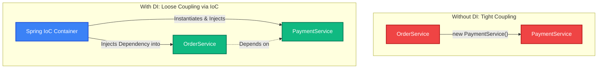
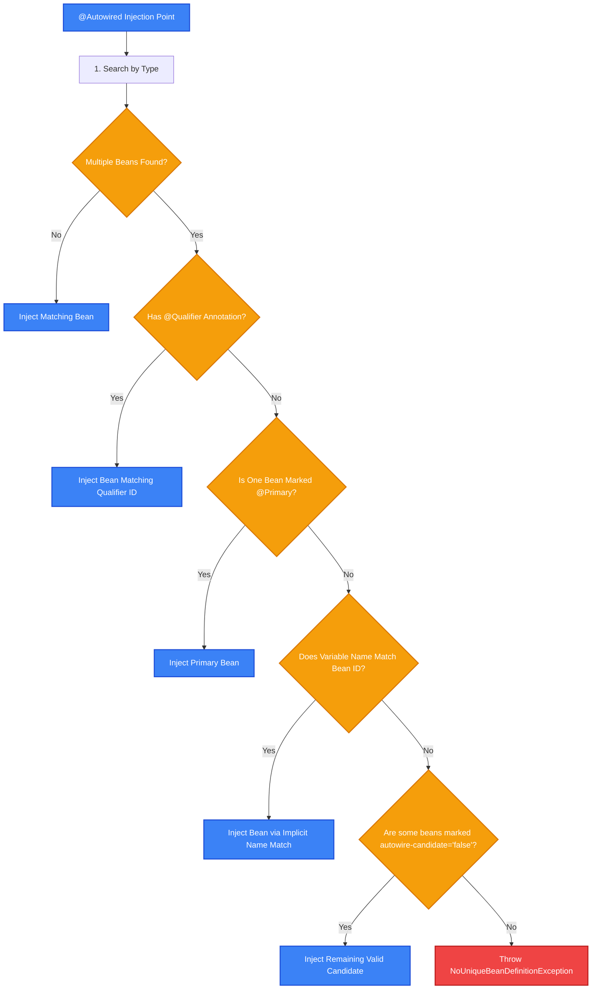
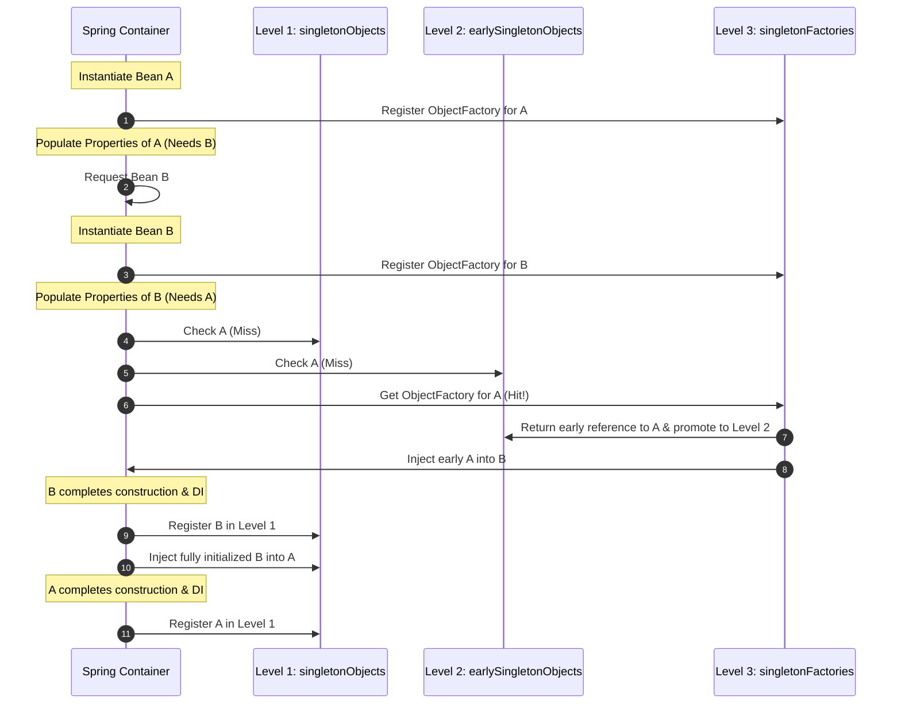
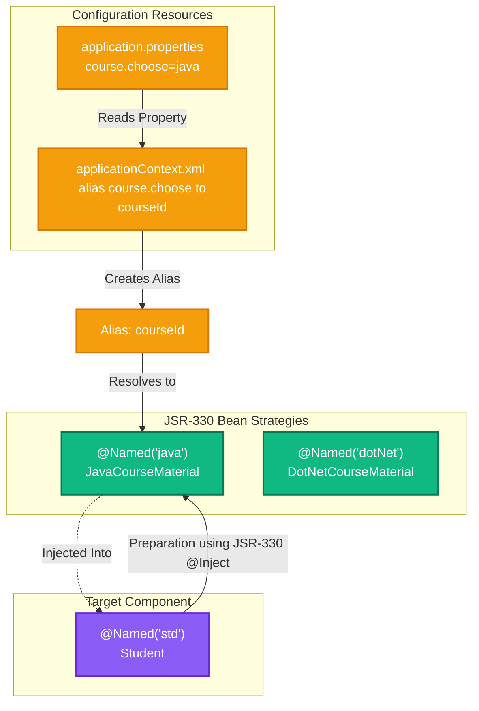
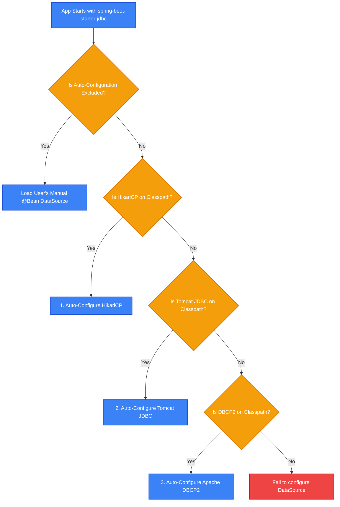
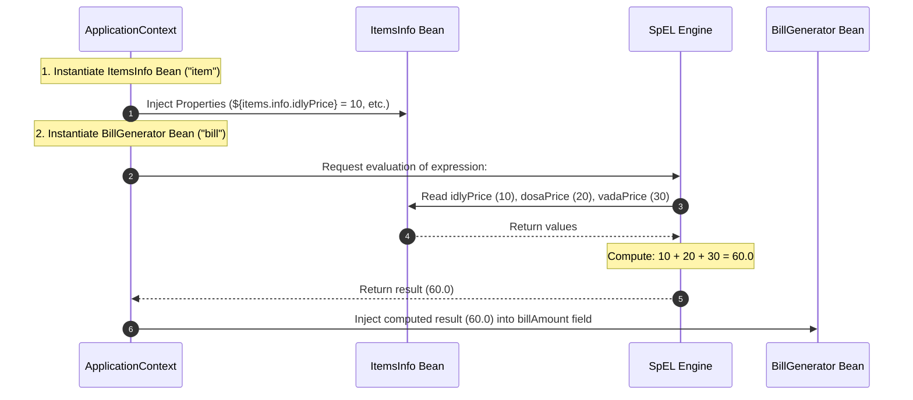
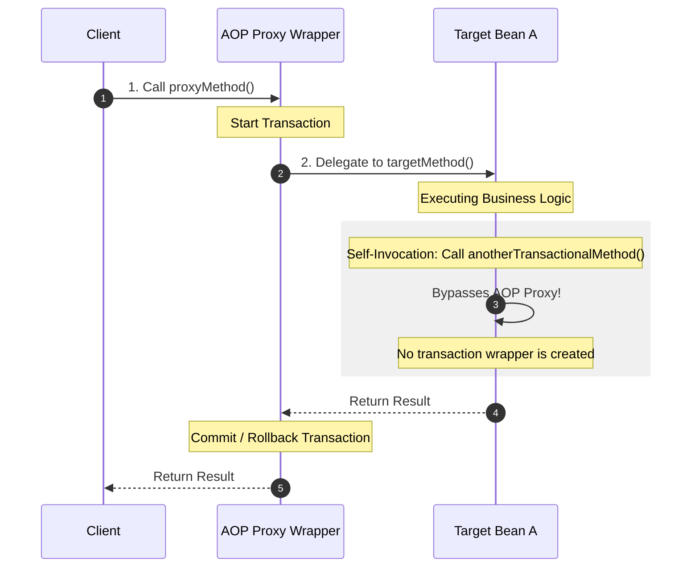

# Spring Framework & Spring Boot - Comprehensive Interview Preparation Guide
> **For: 7+ Years Experience Level | Lead Java & Microservices Developer**

---

## Section 1: Core Spring Framework Architecture

### 1.1 Inversion of Control (IoC) and Dependency Injection (DI)
**Inversion of Control (IoC)** is a design principle in which the control of object creation, configuration, and lifecycle management is transferred from the application developer to the framework container. 

**Dependency Injection (DI)** is a concrete design pattern implementing IoC. Instead of components instantiating their dependencies manually, dependencies are "injected" by the Spring container at runtime.

#### The Dependency Injection Paradigm


---

### 1.2 Setter Injection vs. Constructor Injection
Spring supports injecting dependencies through setter methods, constructor arguments, and direct field injection.

| Feature | Setter Injection | Constructor Injection |
| :--- | :--- | :--- |
| **Execution Order** | Executed *after* constructor instantiation. | Executed *during* bean construction. |
| **XML Configuration** | Configured using the `<property>` tag. | Configured using the `<constructor-arg>` tag. |
| **Mandatory Dependencies** | Not guaranteed. Fields can remain unitialized or null. | Guaranteed. All constructor parameters must be supplied. |
| **Partial Injection** | Supported. You can inject only some properties. | Not supported. All constructor parameters must be injected. |
| **Overrides** | Setter values will override constructor values if both target the same field. | Cannot be overridden unless setters are explicitly defined. |
| **Circular Dependencies** | Handled automatically via Spring's three-level cache. | Throws `BeanCurrentlyInCreationException`. |
| **Immutability** | Beans are mutable. Fields cannot be declared `final`. | Supports immutability. Dependencies can be declared `final`. |
| **Spring Recommendation** | Recommended for optional or mutable dependencies. | **Recommended for mandatory and immutable dependencies**. |

#### Code Comparison

##### Setter Injection (XML Config)
```xml
<bean id="msg" class="com.demo.MessageGenerator">
    <property name="name" value="Teja"/>
    <property name="id" value="10"/>
</bean>
```
```java
public class MessageGenerator {
    private String name;
    private int id;

    public void setName(String name) { this.name = name; }
    public void setId(int id) { this.id = id; }
}
```

##### Constructor Injection (XML Config)
```xml
<bean id="msg" class="com.demo.MessageGenerator">
    <constructor-arg name="name" value="Teja"/>
    <constructor-arg name="id" value="10"/>
</bean>
```
```java
public class MessageGenerator {
    private final String name;
    private final int id;

    public MessageGenerator(String name, int id) {
        this.name = name;
        this.id = id;
    }
}
```

---

### 1.3 XML-Based Collection & Null Injections
Spring supports injecting arrays, lists, sets, maps, and property files directly via XML configuration.

```xml
<bean id="emp" class="com.demo.Employee">
    <!-- Array / List: Allows duplicates, maintains insertion order -->
    <property name="skills">
        <list>
            <value>Java</value>
            <value>Spring</value>
            <value>Hibernate</value>
        </list>
    </property>

    <!-- Set: Excludes duplicate elements -->
    <property name="certifications">
        <set>
            <value>AWS</value>
            <value>Azure</value>
        </set>
    </property>

    <!-- Map: Key-Value pairs of arbitrary object types -->
    <property name="idDetails">
        <map>
            <entry key="aadhar" value="AD1234XYZ"/>
            <entry key="pan" value="PAN5678ABC"/>
            <entry key="passport-ref" value-ref="passportBean"/>
        </map>
    </property>

    <!-- Properties: String-only Key-Value pairs -->
    <property name="dbConfig">
        <props>
            <prop key="driver">com.mysql.cj.jdbc.Driver</prop>
            <prop key="url">jdbc:mysql:///mydb</prop>
        </props>
    </property>

    <!-- Explicit Null Injection -->
    <property name="address">
        <null/>
    </property>
</bean>
```

---

### 1.4 IoC Container Implementations: BeanFactory vs. ApplicationContext
The Spring container is represented by the `BeanFactory` interface and its sub-interface `ApplicationContext`.

| Feature | BeanFactory | ApplicationContext |
| :--- | :--- | :--- |
| **Bean Loading** | Lazy loading. Beans are initialized on demand via `getBean()`. | Eager loading. All singleton beans are pre-instantiated at startup. |
| **Memory Footprint** | Lightweight; suitable for resource-constrained systems. | Moderately heavier due to pre-instantiation. |
| **AOP Integration** | Basic, manual configurations. | Seamless integration with Aspect-Oriented Programming. |
| **Enterprise Services** | basic Dependency Injection only. | Supports i18n, Event handling, Application Listeners, and Profiles. |

#### Core ApplicationContext Implementations
*   `ClassPathXmlApplicationContext`: Loads bean definitions from XML configuration files located on the application classpath.
*   `FileSystemXmlApplicationContext`: Loads bean definitions from XML configuration files located at specified file system paths.
*   `XmlWebApplicationContext`: Used for Spring Web MVC architectures to load XML bean configs within a servlet context.
*   `AnnotationConfigApplicationContext`: Used in standalone Java applications to load configurations directly from `@Configuration` annotated classes.
*   `AnnotationConfigWebApplicationContext`: The web-aware counterpart of `AnnotationConfigApplicationContext` for modern Spring MVC applications.

#### Deferring Pre-Instantiation
By default, the `ApplicationContext` initializes singleton beans at startup. To override this behavior and initialize a bean only when first requested, use the `lazy-init` property:
```xml
<bean id="emp" class="com.demo.Employee" lazy-init="true"/>
```
In Java configuration, use the `@Lazy` annotation:
```java
@Bean
@Lazy
public Employee employee() { return new Employee(); }
```

---

### 1.5 XML Bean Configuration Inheritance
Spring bean configurations support property inheritance, enabling child beans to inherit properties, bindings, and configurations from parent beans. This is defined at the XML configuration level and does not require Java class inheritance.

```xml
<!-- Abstract Parent bean declaration -->
<bean id="baseEmp" class="com.demo.Employee" abstract="true">
    <property name="company" value="Tenjosaka Solutions"/>
    <property name="location" value="Hyderabad"/>
</bean>

<!-- Child bean inherits company and location properties from baseEmp -->
<bean id="empChild" class="com.demo.Employee" parent="baseEmp">
    <property name="ename" value="Teja"/>
    <property name="eno" value="101"/>
</bean>
```

#### Inheritance Rules
1.  **Abstract Attribute**: If a bean configuration has `abstract="true"`, it is treated strictly as a template. The container **will not instantiate** this bean. It can only be used as a parent definition.
2.  **No Multiple Inheritance**: A child bean can inherit configurations from only one parent bean (`parent` attribute accepts a single bean name).
3.  **Property Overriding**: Properties defined in the child bean override the matching properties inherited from the parent.

---

### 1.6 Autowiring Modes and Resolution Priority
Autowiring enables the Spring container to resolve and inject cooperating beans automatically.

| Mode | Description |
| :--- | :--- |
| **no** (Default) | No autowiring. Dependencies must be configured manually via `<property>` or `<constructor-arg>`. |
| **byName** | Spring searches for a bean whose ID matches the property name of the target bean. |
| **byType** | Spring searches for a bean whose class matches the property type of the target bean. Throws exceptions if multiple matching beans exist. |
| **constructor** | Similar to `byType`, but matches against constructor arguments. |

#### Autowired Bean Resolution Pipeline
When resolving a bean annotated with `@Autowired`, the container resolves dependencies in this order:


#### Key Takeaways
- **IoC** separates application logic from object instantiation. **DI** is the pattern used to supply dependencies.
- **Constructor Injection** guarantees fields are final and mandatory properties are set, making it the preferred injection style in production.
- **Circular Dependencies** are automatically resolved for setter injection using a three-level cache, but fail with constructor injection.
- **`ApplicationContext`** is the standard IoC container implementation because it builds upon `BeanFactory` and integrates enterprise services.

---

## Section 2: Bean Lifecycles & Circular Dependencies

### 2.1 The Complete Bean Lifecycle
A Spring bean undergoes a series of creation, initialization, and cleanup phases managed by the IoC container.

```mermaid
flowchart TD
    Start[1. Bean Definition Read] --> Instantiate[2. Instantiation <br> Constructor Called]
    Instantiate --> PopulateProps[3. Populate Properties <br> Dependency Injection]
    PopulateProps --> AwareInterfaces[4. Aware Interfaces <br> BeanNameAware, BeanFactoryAware, etc.]
    AwareInterfaces --> BPPBefore[5. BeanPostProcessor <br> postProcessBeforeInitialization]
    BPPBefore --> InitAnnotate[6. @PostConstruct <br> JSR-250 Init]
    InitAnnotate --> InitializingBean[7. InitializingBean <br> afterPropertiesSet]
    InitializingBean --> CustomInit[8. Custom init-method <br> XML / Bean annotation]
    CustomInit --> BPPAfter[9. BeanPostProcessor <br> postProcessAfterInitialization]
    BPPAfter --> Active[10. Bean is READY <br> Business Logic Executed]
    Active --> ContainerShutdown[11. Container Shutdown Initiated]
    ContainerShutdown --> PreDestroy[12. @PreDestroy <br> JSR-250 Cleanup]
    PreDestroy --> DisposableBean[13. DisposableBean <br> destroy]
    DisposableBean --> CustomDestroy[14. Custom destroy-method]
    CustomDestroy --> End[15. Bean Destroyed]

    classDef step fill:#3B82F6,stroke:#1D4ED8,stroke-width:2px,color:#FFFFFF;
    classDef active fill:#10B981,stroke:#047857,stroke-width:2px,color:#FFFFFF;
    classDef destroy fill:#EF4444,stroke:#B91C1C,stroke-width:2px,color:#FFFFFF;
    
    class Start,Instantiate,PopulateProps,AwareInterfaces,BPPBefore,InitAnnotate,InitializingBean,CustomInit,BPPAfter step;
    class Active active;
    class ContainerShutdown,PreDestroy,DisposableBean,CustomDestroy,End destroy;
```



#### VoterVerification Real-Time Example
This class demonstrates property injections, `@PostConstruct` checks, and `@PreDestroy` cleanups:
```java
package com.Voter.verification;

import java.util.Date;
import javax.annotation.PostConstruct;
import javax.annotation.PreDestroy;
import org.springframework.beans.factory.annotation.Value;
import org.springframework.context.annotation.PropertySource;
import org.springframework.stereotype.Component;

@Component(value = "voterVerification")
@PropertySource(value="classpath:com/Voters/Config/Voter.properties")
public class VoterVerification {
    
    @Value("${voterVerifier.name}")
    private String name;
    
    @Value("${voterVerifier.age}")
    private float age;
    
    private Date dateVerification;

    static {
        System.out.println("VoterVerifier.class file loaded.");
    }

    public VoterVerification() {
        System.out.println("VoterVerifier object instantiated.");
    }

    @PostConstruct
    public void ourInit() {
        System.out.println("Executing custom @PostConstruct init method...");
        dateVerification = new Date();
        // Validation check inside initialization phase
        if (name == null || age < 0) {
            throw new IllegalArgumentException("Invalid values provided for name or age.");
        }
    }

    public String checkEligibility() {
        if (age < 18) {
            return "Mr/Miss/Mrs " + name + ", you are not eligible to vote. Wait " + (18 - age) 
                    + " years to vote. Verification Date: " + dateVerification;
        } else {
            return "Mr/Miss/Mrs " + name + ", you are eligible to vote. Verification Date: " + dateVerification;
        }
    }

    @PreDestroy
    public void ourDestroy() {
        System.out.println("Executing custom @PreDestroy cleanup method...");
        // Releasing memory/resources
        name = null;
        age = 0.0f;
        dateVerification = null;
    }
}
```

---

### 2.2 Circular Dependencies & the Three-Level Singleton Cache
A **circular dependency** occurs when Bean A depends on Bean B, and Bean B depends on Bean A.
*   **Constructor Injection**: If constructor injection is used on both beans, Spring cannot instantiate either bean, throwing a `BeanCurrentlyInCreationException`.
*   **Setter Injection**: Resolved automatically using Spring's **Three-Level Cache**.

#### The 3-Level Cache Architecture


*   **singletonObjects (Level 1)**: Contains fully initialized, populated, and processed singleton bean instances.
*   **earlySingletonObjects (Level 2)**: Contains partially created beans (instantiated, but properties are not yet injected). These are exposed early to resolve circular references.
*   **singletonFactories (Level 3)**: Stores `ObjectFactory` delegates that lazily generate early references to instantiated beans.

#### Circular Dependency Resolution Workaround
If constructor injection cannot be avoided, use the `@Lazy` annotation on one of the injection points to break the initialization loop:
```java
@Component
public class BeanA {
    private final BeanB beanB;

    @Autowired
    public BeanA(@Lazy BeanB beanB) {
        this.beanB = beanB;
    }
}
```

#### Key Takeaways
- Bean lifecycles consist of distinct **Instantiation**, **Initialization**, and **Destruction** phases managed by Spring.
- Use `@PostConstruct` for runtime dependency validation after injection, and `@PreDestroy` for cleanups like closing connections.
- The **three-level cache** resolves circular dependencies for setter-injected singleton beans by exposing early references via factory lookups.

---

## Section 3: Configuration Approaches & Non-Invasive JSR Standards

Spring applications can be configured using XML, Annotations, pure Java Config, or Hybrid configurations.

### 3.1 JSR-330 Standard Annotations vs. Spring Stereotypes
To decouple applications from framework-specific APIs, Spring supports standard Java configurations (JSR-330 & JSR-250) alongside Spring-specific annotations. This approach is known as **Non-Invasive Programming**.

| Feature | JSR-330 Annotation | Spring Equivalent |
| :--- | :--- | :--- |
| **Component stereotyping** | `@Named("beanName")` | `@Component("beanName")` |
| **Dependency Injection** | `@Inject` | `@Autowired` |
| **Ambiguity Resolution** | `@Named("id")` | `@Qualifier("id")` |
| **Alternative DI** | `@Resource(name="id")` (JSR-250) | `@Autowired` + `@Qualifier("id")` |
| **Bean Scoping** | `@Singleton` | `@Scope("singleton")` |

#### JSR-330 Dependency Injection Strategy Pattern Flow
In the following flow, a property configuration decides which bean implementation to load. The JSR-330 client remains completely decoupled from Spring-specific classes.



#### Strategy Design Implementation

##### Maven Dependency (pom.xml)
```xml
<dependency>
    <groupId>javax.inject</groupId>
    <artifactId>javax.inject</artifactId>
    <version>1</version>
</dependency>
```

##### Dynamic Alias Config (applicationContext.xml)
```xml
<?xml version="1.0" encoding="UTF-8"?>
<beans xmlns="http://www.springframework.org/schema/beans"
       xmlns:xsi="http://www.w3.org/2001/XMLSchema-instance"
       xsi:schemaLocation="http://www.springframework.org/schema/beans 
                           https://www.springframework.org/schema/beans/spring-beans.xsd">
                           
    <!-- Dynamically aliases the bean matching properties config to courseId -->
    <alias name="${course.choose}" alias="courseId" />
</beans>
```

##### Beans Code (JSR-330)
```java
package in.ineuron.dependent;

import javax.inject.Named;

public interface ICourseMaterial {
    String courseContent();
    double price();
}

@Named("java")
public class JavaCourseMaterial implements ICourseMaterial {
    @Override
    public String courseContent() { return "1. OOPs 2. Exception Handling 3. Collections"; }
    @Override
    public double price() { return 500.0; }
}

@Named("dotNet")
public class DotNetCourseMaterial implements ICourseMaterial {
    @Override
    public String courseContent() { return "1. C# 2. ASP.NET 3. ADO.NET"; }
    @Override
    public double price() { return 450.0; }
}
```

```java
package in.ineuron.comp;

import javax.inject.Inject;
import javax.inject.Named;
import in.ineuron.dependent.ICourseMaterial;

@Named("std")
public class Student {
    
    // Inject dependency dynamically using JSR-330 annotations
    @Inject
    @Named(value="courseId")
    private ICourseMaterial material;

    public void preparation(String examName) {
        System.out.println("Preparation started for: " + examName);
        System.out.println("Using: " + material.courseContent() + " | Price: " + material.price());
    }
}
```

---

### 3.2 Stereotype Annotations Overview
To configure components via annotations, declare component scanning in Java configurations:
```java
@Configuration
@ComponentScan(basePackages = "com.demo")
public class AppConfig { }
```

*   `@Component`: The generic stereotype annotation for any Spring-managed bean.
*   `@Service`: Specializes `@Component`. Indicates a class containing business logic.
*   `@Repository`: Specializes `@Component`. Indicates a persistence layer DAO class. It enables **automatic exception translation** (translating database-specific exceptions into Spring's `DataAccessException` hierarchy).
*   `@Controller`: Specializes `@Component`. Marks a class as a Spring Web MVC controller.
*   `@RestController`: Replaces `@Controller` + `@ResponseBody` for REST APIs.

---

### 3.3 Layered Architecture Design Patterns: VO vs. DTO vs. BO
Spring applications use layered architectures to isolate concerns. Each layer should use its own dedicated data structure to prevent leakage of layer-specific models.

| Data Object | Layer | Property Types | Purpose |
| :--- | :--- | :--- | :--- |
| **VO** (Value Object) | Controller (Web UI) | Primarily `String` types. | Encapsulates raw form data submitted from client interfaces. |
| **DTO** (Data Transfer Object) | Service (Cross-layer) | Strongly typed fields (`Integer`, `Float`, etc.). | Transports data across network or service boundaries. |
| **BO** (Business Object) | Service & Repository | Strongly typed + business properties. | Holds domain state and encapsulates business logic. |
| **DAO** (Data Access Object) | Repository | Entity/DB structures. | Manages data operations on the persistence store. |

```text
Client Request (String Data) 
    ──> Controller: Binds to VO 
    ──> Controller: Parses types to DTO 
    ──> Service: Integrates business logic to BO 
    ──> Repository: Persists BO/Entity to Database
```

---

### 3.4 Internationalization (i18n) Support
Spring supports internationalization (i18n) via the `MessageSource` interface. Set up properties files using standard Locale formats:
- `App_en_US.properties`: `greet.msg=Hello, {0}!`
- `App_hi_IN.properties`: `greet.msg=नमस्ते, {0}!`
- `App_te_IN.properties`: `greet.msg=నమస్కారం, {0}!`

#### XML Configuration
```xml
<bean id="messageSource" class="org.springframework.context.support.ResourceBundleMessageSource">
    <property name="basenames">
        <list>
            <value>App</value>
        </list>
    </property>
</bean>
```

#### Accessing Messages at Runtime
```java
ApplicationContext context = new ClassPathXmlApplicationContext("applicationContext.xml");
String message = context.getMessage("greet.msg", new Object[]{"Teja"}, Locale.US);
System.out.println(message); // Prints: Hello, Teja!
```

#### Key Takeaways
- **Non-Invasive JSR-330** standard annotations (`@Inject`, `@Named`) make code portable by decoupling it from Spring-specific imports.
- Use `@Repository` to automatically translate low-level SQL exceptions into Spring's managed `DataAccessException` hierarchy.
- **DTOs** decouple database entity schemas from public API models, preventing security exposures and class leakage.

---

## Section 4: Spring Boot Auto-Configuration & Override Mechanics

### 4.1 Spring Boot Definition and Comparison
Spring Boot is a tool built on top of the Spring Framework designed to simplify development by providing auto-configuration, embedded application servers, and starter dependencies.

| Feature | Spring Framework | Spring Boot |
| :--- | :--- | :--- |
| **Goal** | Provides a comprehensive configuration model for Java enterprise applications. | Simplifies Spring development to get applications production-ready quickly. |
| **Configuration** | Requires manual XML configurations or explicit Java config classes. | Uses **Auto-Configuration** based on classpath dependency checks. |
| **Web Server** | Needs an external application server (Tomcat, JBoss, WebLogic) to run. | Contains **Embedded Servers** (Tomcat, Jetty, Undertow) to run as a standalone JAR. |
| **Starter POMs** | Dependencies must be added and managed manually in pom.xml. | Provides pre-packaged **Starter Dependencies** (e.g., `spring-boot-starter-web`). |
| **XML Support** | Natively designed around XML and Annotation configurations. | Does not support XML config directly; properties/YML configurations are preferred. |
| **AOP & Security** | Configured manually. | Auto-configured out-of-the-box. |

---

### 4.2 Auto-Configuration Mechanics: DataSource Selection Priority
When the `spring-boot-starter-jdbc` dependency is added to the classpath, Spring Boot automatically configures a database connection pool. It determines which pool to instantiate by checking the classpath in this order:



---

### 4.3 Swapping Default Connection Pools
To replace default HikariCP with an alternative pool (e.g. Tomcat JDBC or Commons DBCP2), exclude HikariCP from `spring-boot-starter-jdbc` in your `pom.xml`:

```xml
<dependency>
    <groupId>org.springframework.boot</groupId>
    <artifactId>spring-boot-starter-jdbc</artifactId>
    <exclusions>
        <exclusion>
            <groupId>com.zaxxer</groupId>
            <artifactId>HikariCP</artifactId>
        </exclusion>
    </exclusions>
</dependency>

<!-- Add Tomcat Connection Pool dependency -->
<dependency>
    <groupId>org.apache.tomcat</groupId>
    <artifactId>tomcat-jdbc</artifactId>
</dependency>
```

---

### 4.4 Disabling and Manually Overriding Auto-Configuration
To completely override Spring Boot's automatic configuration and define a custom connection pool (like C3P0), exclude `DataSourceAutoConfiguration` and `JdbcTemplateAutoConfiguration` and declare your own `@Bean`:

#### Main Class Configuration
```java
package in.ineuron;

import org.springframework.boot.SpringApplication;
import org.springframework.boot.autoconfigure.SpringBootApplication;
import org.springframework.boot.autoconfigure.jdbc.DataSourceAutoConfiguration;
import org.springframework.boot.autoconfigure.jdbc.JdbcTemplateAutoConfiguration;

@SpringBootApplication(exclude = {
    DataSourceAutoConfiguration.class,
    JdbcTemplateAutoConfiguration.class
})
public class ManualDataSourceApplication {
    public static void main(String[] args) {
        SpringApplication.run(ManualDataSourceApplication.class, args);
    }
}
```

#### Manual DataSource Bean Definition
```java
package in.ineuron.persist;

import com.mchange.v2.c3p0.ComboPooledDataSource;
import org.springframework.beans.factory.annotation.Autowired;
import org.springframework.context.annotation.Bean;
import org.springframework.context.annotation.Configuration;
import org.springframework.core.env.Environment;

@Configuration
public class PersistConfig {

    @Autowired
    private Environment env;

    @Bean
    public ComboPooledDataSource createDS() throws Exception {
        ComboPooledDataSource ds = new ComboPooledDataSource();
        // Read configuration values from Environment abstraction
        ds.setJdbcUrl(env.getProperty("spring.datasource.url"));
        ds.setUser(env.getProperty("spring.datasource.username"));
        ds.setPassword(env.getProperty("spring.datasource.password"));
        return ds;
    }
}
```

#### Key Takeaways
- **Spring Boot** builds upon Spring's features, using Auto-Configuration to remove boilerplate setup code.
- By default, **HikariCP** is the preferred database connection pool configured automatically by Spring Boot.
- Auto-configuration can be bypassed by excluding configuration classes in `@SpringBootApplication(exclude=...)`.

---

## Section 5: Properties Injection & Spring Expression Language (SpEL)

Spring Boot supports properties configuration in both `.properties` and `.yml` (YAML) formats (via the `snakeyaml` parser).

### 5.1 Properties Mapping: @Value vs. @ConfigurationProperties
Spring provides two main ways to inject external configuration properties into beans.

| Feature | @Value | @ConfigurationProperties |
| :--- | :--- | :--- |
| **Binding Type** | Injects individual property values. | Injects a group of related properties (bulk binding). |
| **Configuration Setup** | Simple annotations on fields. | Requires declaring getters, setters, and prefix configurations. |
| **Relaxed Binding** | Not supported (keys must match exactly). | Supported (e.g., `camelCase` in Java maps to `kebab-case` in properties). |
| **SpEL Support** | Fully supported (`#{expression}`). | Not supported. |
| **Nested Collections** | ❌ Does not support nested maps, lists, or object structures. | ✅ Fully binds arrays, lists, maps, sets, and child objects. |

---

### 5.2 Bulk Collection Binding with @ConfigurationProperties
This example demonstrates mapping structured lists, sets, arrays, maps, and nested objects using `@ConfigurationProperties`.

#### application.properties
```properties
emp.info.emp-id=21
emp.info.emp-name=Aravind

# Has-A Nested Object Injection
emp.info.emp-company.company-name=FirmTech Solutions
emp.info.emp-company.company-address=Hyderabad
emp.info.emp-company.size=27

# Array Object Injection
emp.info.emp-skills[0]=Core Java
emp.info.emp-skills[1]=Spring Boot
emp.info.emp-skills[2]=J2EE

# List Object Injection
emp.info.emp-projects[0]=Banking Finance System
emp.info.emp-projects[1]=Retail System

# Set Object Injection
emp.info.emp-mobile-numbers[0]=9652545272
emp.info.emp-mobile-numbers[1]=9652545273

# Map Object Injection
emp.info.id-details.aadhar=AD1234XYZ
emp.info.id-details.pan=PAN1234XYZ
```

#### Bean Configurations
```java
package com.AppConfig.Company_and_Employee;

import org.springframework.stereotype.Component;

@Component("company")
public class Company {
    private String companyName;
    private String companyAddress;
    private String size;

    // Getters, Setters, and toString() methods
    public String getCompanyName() { return companyName; }
    public void setCompanyName(String companyName) { this.companyName = companyName; }
    public String getCompanyAddress() { return companyAddress; }
    public void setCompanyAddress(String companyAddress) { this.companyAddress = companyAddress; }
    public String getSize() { return size; }
    public void setSize(String size) { this.size = size; }
}
```

```java
package com.AppConfig.Company_and_Employee;

import java.util.List;
import java.util.Map;
import java.util.Set;
import org.springframework.boot.context.properties.ConfigurationProperties;
import org.springframework.stereotype.Component;

@Component("emp")
@ConfigurationProperties(prefix = "emp.info")
public class Employee {
    private String empName;
    private long empId;
    private Company empCompany; // Has-A Relationship
    private String[] empSkills;
    private List<String> empProjects;
    private Set<Long> empMobileNumbers;
    private Map<String, Object> idDetails;

    // Getters and Setters for all fields
    public String getEmpName() { return empName; }
    public void setEmpName(String empName) { this.empName = empName; }
    public long getEmpId() { return empId; }
    public void setEmpId(long empId) { this.empId = empId; }
    public Company getEmpCompany() { return empCompany; }
    public void setEmpCompany(Company empCompany) { this.empCompany = empCompany; }
    public String[] getEmpSkills() { return empSkills; }
    public void setEmpSkills(String[] empSkills) { this.empSkills = empSkills; }
    public List<String> getEmpProjects() { return empProjects; }
    public void setEmpProjects(List<String> empProjects) { this.empProjects = empProjects; }
    public Set<Long> getEmpMobileNumbers() { return empMobileNumbers; }
    public void setEmpMobileNumbers(Set<Long> empMobileNumbers) { this.empMobileNumbers = empMobileNumbers; }
    public Map<String, Object> getIdDetails() { return idDetails; }
    public void setIdDetails(Map<String, Object> idDetails) { this.idDetails = idDetails; }
}
```

---

### 5.3 Spring Expression Language (SpEL)
**SpEL** is an expression language that supports querying and manipulating an object graph at runtime. It is evaluated during bean configuration processing using the `#{expression}` syntax.

#### SpEL Syntax Comparison
*   `@Value("literal")`: Injects a constant value (e.g., `@Value("Accord")`).
*   `@Value("${property.key}")`: Reads value from properties files.
*   `@Value("#{expression}")`: Evaluates a mathematical, conditional, or logic statement.
*   `@Value("#{beanName.field}")`: Evaluates cross-bean field values.

#### SpEL Cross-Bean Startup Evaluation
During application startup, SpEL expressions are evaluated in the container.



#### SpEL Implementation Code
```java
package in.ineuron.dependent;

import org.springframework.beans.factory.annotation.Value;
import org.springframework.stereotype.Component;

@Component("item")
public class ItemsInfo {
    @Value("${items.info.idlyPrice}")
    public float idlyPrice;   // 10
    
    @Value("${items.info.dosaPrice}")
    public float dosaPrice;   // 20
    
    @Value("${items.info.vadaPrice}")
    public float vadaPrice;   // 30
}
```

```java
package in.ineuron.comp;

import org.springframework.beans.factory.annotation.Autowired;
import org.springframework.beans.factory.annotation.Value;
import org.springframework.stereotype.Component;
import in.ineuron.dependent.ItemsInfo;

@Component("bill")
public class BillGenerator {
    
    // Evaluate cross-bean fields at startup
    @Value("#{item.idlyPrice + item.dosaPrice + item.vadaPrice}")
    private Float billAmount; // Evaluates to 60.0

    @Value("Accord")
    private String hotelName;

    @Autowired
    private ItemsInfo info;

    @Override
    public String toString() {
        return "BillGenerator [billAmount=" + billAmount + ", hotelName=" + hotelName + ", info=" + info + "]";
    }
}
```

#### Key Takeaways
- Use `@Value` for simple values and configuration parameters. Use `@ConfigurationProperties` for structured prefix configurations.
- SpEL expressions (`#{...}`) perform runtime evaluations on bean properties, whereas property placeholders (`${...}`) read configuration values directly.
- SpEL evaluation runs during the `BeanPostProcessor` initialization phase, after dependencies are instantiated.

---

## Section 6: Advanced Topics & System Design Scenarios

### 6.1 Transaction Management & Self-Invocation Pitfalls
Spring's transaction management relies on AOP proxies. When a bean is annotated with `@Transactional`, Spring creates a dynamic proxy around it (JDK Dynamic Proxy or CGLIB) to manage connection rollbacks.

#### Self-Invocation Failure
If a method within Bean A calls another `@Transactional` method in the same class directly (`this.method()`), the call bypasses the proxy container, causing the transactional logic to fail.



#### Resolution Strategies
1.  **Extract Method**: Move the `@Transactional` method to a separate Spring-managed bean.
2.  **Self-Injection**: Inject the proxy instance of the bean into itself (supported in Spring Boot 2.x+):
    ```java
    @Service
    public class OrderService {
        @Autowired
        private OrderService self;

        public void process() {
            self.executeTransaction(); // Invoked via proxy
        }

        @Transactional
        public void executeTransaction() { ... }
    }
    ```

---

### 6.2 Aspect-Oriented Programming (AOP) Internals
Spring AOP decouples cross-cutting concerns (logging, security, transactions) from core business logic.
*   **JDK Dynamic Proxy**: Standard mechanism used when the target bean implements at least one interface. It creates a proxy implementing the interface at runtime.
*   **CGLIB Proxy**: Used when the target class does not implement any interfaces. It generates a subclass of the target bean at runtime. It cannot intercept `final` classes or methods.
*   **Spring Boot Default**: Spring Boot defaults to using CGLIB proxies (`spring.aop.proxy-target-class=true`) to prevent interface casting exceptions.

---

### 6.3 Diagnostic FAQs and Troubleshooting Guide

#### Q1. When does `@Autowired` fail with `NoUniqueBeanDefinitionException`?
This occurs when multiple beans of the same type are declared in the IoC container and no `@Qualifier` or `@Primary` configuration is provided to resolve the ambiguity. To fix this:
1. Define a `@Primary` implementation.
2. Specify the target bean name using `@Qualifier("targetBean")`.

#### Q2. What is the difference between `@PostConstruct` and a Java Class constructor?
A class constructor runs when the class is first instantiated, at which point dependencies (fields annotated with `@Autowired` or `@Value`) are not yet injected. `@PostConstruct` methods run after instantiation and dependency injection are complete, making it the correct phase to validate properties or initialize resources that depend on injected values.

#### Q3. How do you disable a specific Auto-Configuration in Spring Boot?
Use the `exclude` attribute on the `@SpringBootApplication` annotation:
```java
@SpringBootApplication(exclude = { DataSourceAutoConfiguration.class })
```

#### Q4. Why is field injection discouraged in production environments?
Field injection makes classes tightly coupled to the Spring container, preventing manual instantiation in unit tests. It is difficult to mock dependencies without using reflection or initializing a Spring Context. Use **Constructor Injection** instead.

---

## END OF SPRING ANALYSIS
