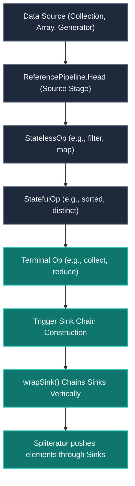
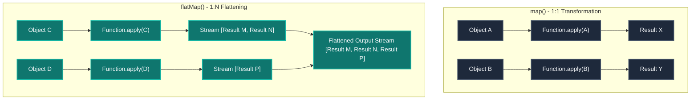
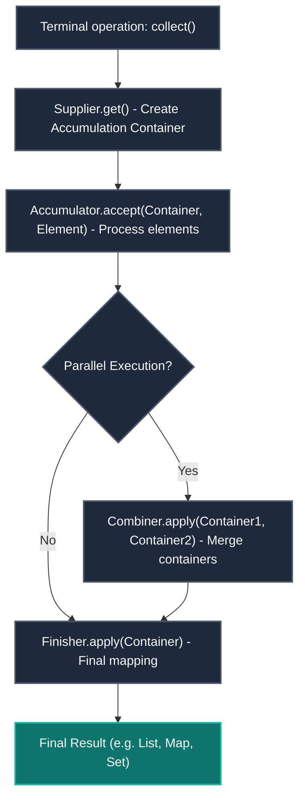
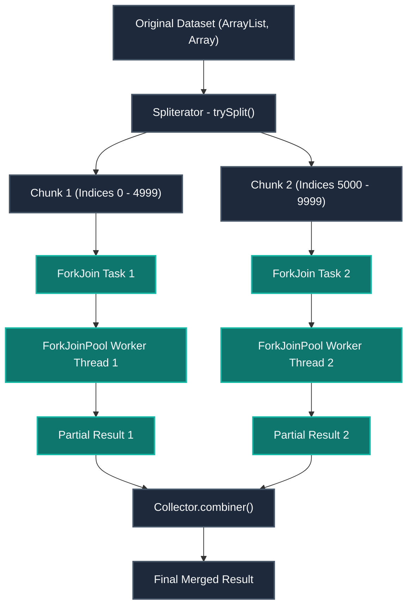
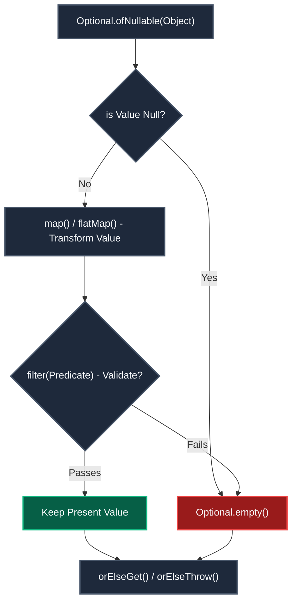

# Streams API & Optionals - Architecture, Deep Dive & Practice Guide
> *Designed for: 7+ Years Experience Level | Java Developer*

This guide provides a comprehensive framework for mastering Java Streams, Collectors, Parallel Streams, and Optionals, optimized for senior-level interview preparation, certification reviews, and production software engineering.

---

## Table of Contents
1. [Stream Pipeline Architecture](#stream-pipeline-architecture-internal-working)
2. [PART 1: Basic Stream Questions (Q1-Q10)](#part-1-basic-stream-questions-q1-q10)
3. [PART 2: Intermediate Operations Deep Dive (Q11-Q22)](#part-2-intermediate-operations-deep-dive-q11-q22)
4. [PART 3: Terminal Operations & Internal Working (Q23-Q35)](#part-3-terminal-operations--internal-working-q23-q35)
5. [PART 4: Parallel Streams & Performance (Q36-Q43)](#part-4-parallel-streams--performance-q36-q43)
6. [PART 5: Scenario-Based & Production Questions (Q44-Q50)](#part-5-scenario-based--production-q44-q50)
7. [Java 8 Optional Deep Dive (Q51-Q65)](#java-8-optional---deep-dive--interview-questions-q51-q65)
8. [Real-Time Scenario-Based Coding Problems (Problems 1-26)](#real-time-scenario-based-java-stream-coding-problems)
9. [Practiced Code & Duplication Frequency Analysis](#practiced-code----duplicate-frequency-detection-2026-04-25)
10. [Additional Production-Grade Snippets](#additional-snippets----real-scenarios--use-cases-2026-04-25)

---

## Stream Pipeline Architecture (Internal Working)

A Stream in Java is not a data structure; it is a pipeline of computational stages.



### Internal Core Pipeline Classes:
- **`AbstractPipeline`**: The base class implementing the common pipeline logic.
- **`ReferencePipeline`**: Implements reference-based streams.
  - **`ReferencePipeline.Head`**: Represents the source stage of the stream.
  - **`ReferencePipeline.StatelessOp`**: Represents intermediate stages where elements are processed independently (e.g., `filter`, `map`).
  - **`ReferencePipeline.StatefulOp`**: Represents intermediate stages requiring information about all elements before proceeding (e.g., `sorted`, `distinct`).
- **`Sink` Interface**: Chained callbacks (`begin()`, `accept(T)`, `end()`) driving the push-based stream execution model.

---

## PART 1: Basic Stream Questions (Q1-Q10)

#### Q1. What is a Stream in Java 8? How is it different from a Collection?
A Stream is a typed pipeline of lazy computations that processes elements from a source on-demand. It does not store elements and is designed to support functional operations.

##### Collection vs. Stream Matrix
| Feature | Collection | Stream |
| :--- | :--- | :--- |
| **Storage** | Stores elements in memory. | No storage. It is a conduit, not a container. |
| **Evaluation** | Eagerly evaluated upon modification. | Lazily evaluated (nothing executes until a terminal op). |
| **Consumption** | Reusable. Can be iterated over multiple times. | Single-use. Throws `IllegalStateException` on second reuse. |
| **Modification** | Can add, remove, or modify elements. | Cannot modify the original data source. |
| **Iteration** | External iteration (manual `for` or `while` loops). | Internal iteration (managed by the stream framework). |
| **Infinite Support**| Bound to memory limits; cannot be infinite. | Can represent infinite datasets (via `generate()` or `iterate()`). |

##### Code Example:
```java
List<String> names = List.of("Teja", "Pradeep", "Rakesh");

// Collection: External Iteration
for (String n : names) {
    if (n.length() > 4) {
        System.out.println(n);
    }
}

// Stream: Internal Iteration, Declarative
names.stream()
     .filter(n -> n.length() > 4)
     .forEach(System.out::println);
```

#### Q2. What are intermediate vs. terminal operations?
- **Intermediate Operations**: Return another `Stream` and are **lazy**. They establish pipeline stages but perform no processing until a terminal operation is called.
  - *Stateless*: Elements are processed one-by-one independently (e.g., `filter`, `map`, `flatMap`, `peek`).
  - *Stateful*: Elements cannot be fully processed without consuming prior elements to establish state (e.g., `sorted`, `distinct`, `limit`, `skip`).
- **Terminal Operations**: Trigger the traversal of the pipeline and produce a non-stream result (e.g., `collect`, `forEach`, `reduce`, `count`, `min`, `max`, `findFirst`, `anyMatch`).

```text
stream() → filter() [StatelessOp] → sorted() [StatefulOp] → collect() [Terminal triggers Sink Chain]
```

#### Q3. Explain lazy evaluation with proof code.
Intermediate stream operations are not evaluated until a terminal operation is invoked.

##### Proof Code:
```java
Stream<String> s = List.of("A", "B", "C", "D").stream()
    .filter(x -> {
        System.out.println("Filtering: " + x);
        return true;
    })
    .map(x -> {
        System.out.println("Mapping: " + x);
        return x.toLowerCase();
    });

System.out.println("Pipeline built — nothing printed yet!");
s.forEach(System.out::println); // Now execution triggers
```

##### Output:
```text
Pipeline built — nothing printed yet!
Filtering: A
Mapping: A
a
Filtering: B
Mapping: B
b
Filtering: C
Mapping: C
c
Filtering: D
Mapping: D
d
```
*Note: Elements flow vertically through the pipeline (element 'A' passes through all filter/map stages before 'B' starts).*

#### Q4. Why can a Stream be consumed only once?
After a terminal operation completes, the stream pipeline sets an internal flag `linkedOrConsumed` to `true`. Any subsequent terminal execution will check this flag and throw an `IllegalStateException`.

##### Code Example:
```java
Stream<String> s = List.of("A", "B").stream();
s.forEach(System.out::println); // OK
s.forEach(System.out::println); // Throws java.lang.IllegalStateException
```

##### Solution: Use a `Supplier` to construct fresh stream instances:
```java
Supplier<Stream<String>> streamSupplier = () -> List.of("A", "B").stream();
streamSupplier.get().forEach(System.out::println);
long count = streamSupplier.get().count(); // Works perfectly
```

#### Q5. How do you create Streams from different sources?
Streams can be generated from various structures:
```java
Stream<String> valStream = Stream.of("A", "B", "C");                     // From values
IntStream intStream = Arrays.stream(new int[]{1, 2, 3});                 // From primitive array
Stream<String> listStream = list.stream();                               // From Collection
Stream<String> emptyStream = Stream.empty();                             // Empty stream
Stream<Double> randoms = Stream.generate(Math::random);                  // Infinite Generator
Stream<Integer> evens = Stream.iterate(0, n -> n + 2);                    // Infinite Iterator
Stream<Integer> boundedEvens = Stream.iterate(0, n -> n < 100, n -> n+2);// Java 9 Bounded
Stream<String> lines = Files.lines(Path.of("data.csv"));                 // From file (Lazy I/O)
IntStream chars = "Hello".chars();                                       // IntStream of characters
Stream<String> words = Pattern.compile(",").splitAsStream("A,B,C");       // From regex pattern
```

#### Q6. What are primitive streams and why do they exist?
`IntStream`, `LongStream`, and `DoubleStream` exist to avoid performance overhead from auto-boxing wrappers (like `Integer`, `Long`, `Double`).

```java
// BAD: Boxing overhead for every element
int badSum = list.stream().map(String::length).reduce(0, Integer::sum);

// GOOD: Zero boxing overhead
int goodSum = list.stream().mapToInt(String::length).sum();
```
- **Specialized Methods**: `sum()`, `average()`, `min()`, `max()`, and `summaryStatistics()`.
- **Performance**: Primitive streams are often 3-5x faster than boxed collections for large datasets.

#### Q7. What is the difference between Stream.of() and Arrays.stream()?
- For **Primitive Arrays**:
  ```java
  int[] array = {1, 2, 3};
  Stream.of(array);      // Returns Stream<int[]> containing a single element
  Arrays.stream(array);   // Returns IntStream containing three elements (Correct)
  ```
- For **Object Arrays**:
  Both `Stream.of(array)` and `Arrays.stream(array)` yield `Stream<T>` and behave identically.

#### Q8. Explain the Stream.builder() pattern.
`Stream.builder()` is useful when you need to construct a stream dynamically with complex flow logic before executing it.
```java
Stream.Builder<String> builder = Stream.builder();
builder.add("Initial");
if (isAdmin) builder.add("AdminDetails");
builder.add("Final");
Stream<String> stream = builder.build();
// Adding elements after build() triggers an IllegalStateException.
```

#### Q9. Infinite streams — generate vs. iterate.
- `Stream.generate(Supplier)`: Elements are generated independently without depending on previous state.
  ```java
  Stream.generate(UUID::randomUUID).limit(5);
  ```
- `Stream.iterate(T seed, UnaryOperator)`: Elements are sequential, generated by applying a function to the previous element.
  ```java
  Stream.iterate(1, n -> n * 2).limit(5); // 1, 2, 4, 8, 16
  ```
*Warning: Running terminal operations on infinite streams without short-circuiting limits (like `limit()`) causes infinite loops or OutOfMemoryErrors.*

#### Q10. Stream.empty() — when and why?
Use `Stream.empty()` to safely avoid returning `null` from methods returning stream outputs.
```java
public Stream<Order> getOrders(Customer customer) {
    if (customer == null || customer.getOrders() == null) {
        return Stream.empty(); // Prevents NullPointerException downstream
    }
    return customer.getOrders().stream();
}
```

#### Key Takeaways: Stream Pipeline & Fundamentals
- Streams are pipeline constructs, not collections. They consume memory only for pipeline nodes, not data containers.
- Intermediate operations are lazy and stateless/stateful; terminal operations consume the stream and trigger execution.
- Auto-boxing can be a performance bottleneck; use `IntStream`, `LongStream`, and `DoubleStream` to process primitives efficiently.

---

## PART 2: Intermediate Operations Deep Dive (Q11-Q22)

#### Q11. filter() — internal working with Predicate.
`filter()` creates a `StatelessOp` pipeline stage. When an element is processed, the `Predicate.test()` method is invoked. If the return value is `true`, the element passes downstream; otherwise, it is dropped.

##### Reference Sync: Anonymous Inner Class vs. Lambda Expression
```java
// Synchronized from Stream_S1
// 1. Anonymous Inner Class Implementation
Predicate<Integer> predAnonymous = new Predicate<Integer>() {
    @Override
    public boolean test(Integer n) {
        if (n % 2 == 1) {
            return true;
        } else {
            return false;
        }
    }
};

// 2. Lambda Equivalent (Clean, functional)
Predicate<Integer> predLambda = n -> n % 2 == 1;

// Usage in Pipeline
List<Integer> numbers = List.of(1, 2, 3, 4, 5);
List<Integer> odds = numbers.stream().filter(predLambda).collect(Collectors.toList());
```

#### Q12. map() — internal working with Function.
`map()` transforms elements individually by invoking `Function.apply()`. It returns a transformed element to the next stage in the pipeline.

##### Reference Sync: Anonymous Inner Class vs. Lambda Expression
```java
// Synchronized from Stream_S1
// 1. Anonymous Inner Class Implementation
Function<Integer, Integer> mapAnonymous = new Function<Integer, Integer>() {
    @Override
    public Integer apply(Integer n) {
        return n * 2;
    }
};

// 2. Lambda Equivalent
Function<Integer, Integer> mapLambda = n -> n * 2;

// Usage in Pipeline
List<Integer> doubled = numbers.stream().map(mapLambda).collect(Collectors.toList());
```

#### Q13. map() vs. flatMap() — deep comparison.
- `map()` takes one element and outputs one element (1:1 mapping).
- `flatMap()` maps each input element to a stream of sub-elements, then flattens all intermediate streams into a single output stream (1:N mapping).



##### GFM Comparison: map vs. flatMap
| Criterion | map() | flatMap() |
| :--- | :--- | :--- |
| **Output Type** | `Stream<R>` | `Stream<R>` (Flattened output from nested structures) |
| **Function Signature**| `Function<T, R>` | `Function<T, Stream<R>>` |
| **Use Case** | Simple transformations (e.g., entity to DTO). | Flattening nested structures (e.g., `List<List<T>>` to `List<T>`). |

##### Code Example:
```java
List<List<String>> list = List.of(List.of("A", "B"), List.of("C", "D"));
// flatMap merges inner lists into a single continuous stream
List<String> flat = list.stream().flatMap(Collection::stream).toList(); // [A, B, C, D]
```

##### Additional Practical flatMap Examples:

###### 1. Basic Squaring Numbers from Nested Lists
A straightforward usage of `flatMap` that merges two nested integer lists into a single continuous stream of squared numbers.
```java
import java.util.*;
import java.util.stream.*;
import java.util.function.*;

public class Main
{
    public static void main(String[] args) {
      List<Integer> lanums = List.of(1,2,3,4,5);
      List<Integer> lbnums = List.of(6,7,8,9,10);
      
      List<List<Integer>> lcnums = List.of(lanums, lbnums);
      
      List<Integer> sqnums =  lcnums.stream()
                              .flatMap(nums -> nums.stream()
                               .map(num -> num*num))
                              .collect(Collectors.toList());
       System.out.println(sqnums); // Output: [1, 4, 9, 16, 25, 36, 49, 64, 81, 100]
    }
}
```

###### 2. Advanced Squaring with Null Handling, Logging, and Limits
A production-grade improvement of the previous example that prevents pipeline failures from `null` elements, logs internal stream iterations via `peek()`, and demonstrates short-circuit optimization with `limit()`.
```java
import java.util.*;
import java.util.stream.*;
import java.util.function.*;

public class Main
{
    public static void main(String[] args) {
      List<Integer> lanums = List.of(1,2,3,4,5);
      List<Integer> lbnums = List.of(6,7,8,9,10);
      List<Integer> ldnums = null;
      
      // Arrays.asList is used because List.of throws NPE if any element is null
      List<List<Integer>> lcnums = Arrays.asList(lanums, lbnums, ldnums);
      
      List<Integer> sqnums =  lcnums.stream()
                              .flatMap(nums -> nums == null ? Stream.empty() : 
                               nums.stream()
                               .map(num -> num*num))
                               .peek(n -> System.out.println("Processing : " + n))
                               .limit(5)
                              .collect(Collectors.toList());
       System.out.println(sqnums); // Output: [1, 4, 9, 16, 25]
    }
}
```

##### GFM Comparison: Basic vs. Advanced flatMap Snippet Differences
| Feature / Concept | Basic Example | Advanced Example |
| :--- | :--- | :--- |
| **Collection Factory** | `List.of(...)` (throws NPE if any parameter/element is null). | `Arrays.asList(...)` (allows null elements, returns a mutable list wrapper). |
| **Null Safety** | No null safety inside lambda; if `lcnums` contained null, calling `nums.stream()` throws `NullPointerException`. | Ternary validation check `nums == null ? Stream.empty() : nums.stream()` intercepts nulls safely. |
| **Flow Observability** | None. Runs quietly in-memory. | Logs processing actions for elements as they traverse downstream using `peek()`. |
| **Execution Bounds** | Eagerly consumes all elements. | Short-circuits using `limit(5)`, halting element evaluation once the threshold is satisfied. |

###### 3. Extracting Nested Collections (1-to-Many Relationships)
A common real-world scenario is extracting nested lists from objects (e.g., retrieving all email addresses from a list of users).
```java
public class User {
    private String name;
    private List<String> emails;

    public User(String name, List<String> emails) {
        this.name = name;
        this.emails = emails;
    }
    public List<String> getEmails() { return emails; }
}

// Extracting a distinct list of all email addresses from a list of users:
List<User> users = List.of(
    new User("Alice", List.of("alice@gmail.com", "alice@work.com")),
    new User("Bob", List.of("bob@yahoo.com")),
    new User("Charlie", List.of("charlie@gmail.com", "alice@gmail.com")) // Duplicate email
);

List<String> distinctEmails = users.stream()
    .flatMap(user -> user.getEmails().stream())
    .distinct()
    .collect(Collectors.toList());
// Output: [alice@gmail.com, alice@work.com, bob@yahoo.com, charlie@gmail.com]
```

###### 4. safe Parsing / Exception Handling (1-to-0 or 1 Mapping)
Using `flatMap` to transform input elements while discarding those that fail operations (like parsing) by returning `Stream.empty()` instead of throwing exceptions or returning null.
```java
List<String> inputStrings = List.of("10", "abc", "20", "xyz", "30");

List<Integer> validIntegers = inputStrings.stream()
    .flatMap(s -> {
        try {
            return Stream.of(Integer.parseInt(s));
        } catch (NumberFormatException e) {
            return Stream.empty(); // Discard invalid element safely
        }
    })
    .collect(Collectors.toList());
// Output: [10, 20, 30]
```

###### 5. Generating Cartesian Products (Pairwise Combinations)
Combining two independent lists into all possible pairs (1-to-N generation).
```java
List<String> suits = List.of("Spades", "Hearts", "Diamonds", "Clubs");
List<String> ranks = List.of("Ace", "King", "Queen");

List<String> deck = suits.stream()
    .flatMap(suit -> ranks.stream().map(rank -> rank + " of " + suit))
    .collect(Collectors.toList());
// Output: [Ace of Spades, King of Spades, Queen of Spades, Ace of Hearts, ...]
```

###### 6. Flattening Streams of Optionals (Java 9+)
Using `flatMap(Optional::stream)` to filter empty values and unwrap present values from a stream of `Optional` wrappers cleanly.
```java
List<Optional<String>> optionals = List.of(
    Optional.of("Java"),
    Optional.empty(),
    Optional.of("SpringBoot"),
    Optional.empty()
);

List<String> presentValues = optionals.stream()
    .flatMap(Optional::stream)
    .collect(Collectors.toList());
// Output: [Java, SpringBoot]
```

#### Q14. sorted() — stateful operation.
`sorted()` accumulates all elements of the stream in memory before sorting them (TimSort algorithm). Because it blocks element progression until all elements are collected, it is a stateful operation.

##### GFM Comparison: Stateless vs. Stateful Operations
| Operation Type | Behavior | Parallel Overhead | Memory Consumption | Examples |
| :--- | :--- | :--- | :--- | :--- |
| **Stateless** | Process each element independently. | Low. Easily distributable. | O(1) memory. | `filter`, `map`, `peek` |
| **Stateful** | Requires checking all elements to progress. | High. Requires thread sync. | O(N) memory. | `sorted`, `distinct`, `limit` |

#### Q15. distinct() — internal working.
`distinct()` keeps track of seen elements using an internal `LinkedHashSet`. It determines uniqueness using the `equals()` and `hashCode()` methods of the processed objects. Override these methods when processing custom objects to avoid unexpected duplicate behaviors.

#### Q16. peek() — debugging purpose only.
`peek(Consumer)` acts as an intermediate hook. It passes elements downstream unchanged. Do not use it for side-effects or state changes, as the JVM may skip evaluating it on short-circuit paths.
```java
List<String> upper = list.stream()
    .peek(val -> System.out.println("Processing: " + val))
    .map(String::toUpperCase)
    .toList();
```

#### Q17. limit() and skip() — short-circuit behavior.
- `limit(n)` halts the stream immediately after returning `n` elements.
- `skip(n)` drops the first `n` elements and passes the remaining elements downstream.
```java
// Stream pagination pattern (not recommended for large database datasets)
List<Employee> page = employees.stream()
    .skip(20)
    .limit(10)
    .toList();
```

#### Q18. mapToInt / mapToLong / mapToDouble.
These intermediate operations convert object streams into primitive streams to prevent performance drops caused by boxing/unboxing overhead.
```java
OptionalDouble average = employees.stream()
    .mapToDouble(Employee::getSalary)
    .average();
```

#### Q19. Stateless vs. Stateful operations — impact on parallel streams.
Stateful operations inside parallel streams require thread synchronization, which can lead to performance bottlenecks. Minimize `sorted()`, `distinct()`, and `limit()` operations in parallel pipelines for best performance.

#### Q20. How does flatMap handle null inner streams?
If the function passed to `flatMap()` returns `null`, the stream pipeline will throw a `NullPointerException`. Make sure to return an empty stream wrapper instead of null:
```java
// Safe flatMap null-checking:
list.stream()
    .flatMap(item -> item.getSublist() == null ? Stream.empty() : item.getSublist().stream());
```

#### Q21. mapMulti() (Java 16) — replacement for flatMap.
`mapMulti(BiConsumer)` maps each element to a consumer, replacing `flatMap`'s dynamic inner stream creations with a direct, single-pipeline execution step. It is highly recommended when mapping elements to a small number of values.
```java
numbers.stream()
       .<String>mapMulti((num, consumer) -> {
           if (num % 2 == 0) {
               consumer.accept("Even: " + num);
           }
       }).forEach(System.out::println);
```

#### Q22. Stream.concat() and reducing multiple streams.
`Stream.concat(s1, s2)` creates a lazily concatenated stream. However, combining multiple streams can be approached in different ways depending on scale and performance requirements.

##### Snippet A: Combining Arrays using `Stream.concat`
This approach uses the static helper `Stream.concat` to combine two boxed streams derived from primitive arrays.
```java
import java.util.*;
import java.util.stream.*;
import java.util.function.*;

public class Main
{
    public static void main(String[] args) {
      int arr1[] = {1,2,3,4,5};
      int arr2[] = {6,7,8,9,10};
      
      List<Integer> lcnums = Stream.concat(Arrays.stream(arr1).boxed(),
                             Arrays.stream(arr2).boxed())
                             .map(num -> num*num)
                            .collect(Collectors.toList());
       System.out.println("Clsit :" + lcnums); // Output: [1, 4, 9, 16, 25, 36, 49, 64, 81, 100]
    }
}
```

##### Snippet B: Combining Streams using `Stream.of` + `flatMap`
This approach nests the individual streams inside `Stream.of(...)` and then flattens them using `flatMap(Sms -> Sms)` (which is equivalent to `flatMap(Function.identity())`).
```java
import java.util.*;
import java.util.stream.*;
import java.util.function.*;

public class Main
{
    public static void main(String[] args) {
      int arr1[] = {1,2,3,4,5};
      int arr2[] = {6,7,8,9,10};
      
      Stream<Integer> s1 =  Arrays.stream(arr1).boxed();
      Stream<Integer> s2 =  Arrays.stream(arr2).boxed();
      List<Integer> lcnums = Stream.of(s1,s2)
                             .flatMap(Sms ->Sms)
                             .map(num -> num*num)
                            .collect(Collectors.toList());
       System.out.println("Clsit :" + lcnums); // Output: [1, 4, 9, 16, 25, 36, 49, 64, 81, 100]
    }
}
```

##### Deep Architectural Comparison: `Stream.concat` vs. `Stream.of().flatMap()`

| Metric / Dimension | `Stream.concat(s1, s2)` (Snippet A) | `Stream.of(s1, s2).flatMap(s -> s)` (Snippet B) |
| :--- | :--- | :--- |
| **Primary Use Case** | Concatenating exactly two streams. | Flattening nested streams or combining $N \ge 3$ streams. |
| **Spliterator Characteristics** | Preserves **`SIZED`** & **`SUBSIZED`** flags if both input streams have them. | Discards **`SIZED`** & **`SUBSIZED`** flags because `flatMap` represents a general 1:N mapping stage. |
| **Collection Allocation Optimization** | **High**: Collector (`toList()`) can pre-allocate the exact backing array size (e.g. $5 + 5 = 10$) without dynamic array resize copies. | **Low**: The collector must resize its internal container dynamically as elements are pulled through the pipeline. |
| **Stack Depth / Recursion Safety** | **Unsafe for nesting**: Chaining concatenations sequentially (e.g., `Stream.concat(s1, Stream.concat(s2, s3...))`) constructs a nested binary tree of spliterators, risking a `StackOverflowError` during execution if $N$ is large. | **Safe**: Evaluates streams at a single level of flattening without recursive depth, preventing stack overflow risks. |
| **Evaluation Overhead** | Extremely lightweight; delegates directly to a `ConcatSpliterator`. | Slightly higher overhead due to creating intermediary streams and invoking mapper functions for flattening. |

###### Stack Depth Issue Visualized
When you chain `Stream.concat` recursively:
```text
ConcatSpliterator
 ├── s1
 └── ConcatSpliterator
       ├── s2
       └── ConcatSpliterator
             ├── s3
             └── s4  <-- Deep lookup call stack
```
Every traversal step requires traversing down this nested left-leaning tree, which scales linearly with the number of streams ($O(N)$ stack frames). With `Stream.of(s1, s2, s3, s4).flatMap(...)`, the stream framework handles all elements within a single flattening loop.

#### Key Takeaways: Intermediate Operations
- Intermediate operations create new pipeline nodes. Stateless operations run in a single pass; stateful operations buffer elements.
- Always implement `hashCode()` and `equals()` when using stateful operations like `distinct()`.
- Use `mapMulti()` instead of `flatMap()` for small collections to avoid memory garbage from intermediate streams.

---

## PART 3: Terminal Operations & Internal Working (Q23-Q35)

#### Q23. forEach() — Consumer internal working.
`forEach(Consumer)` passes elements sequentially to `Consumer.accept(T)`.

##### Reference Sync: Anonymous Inner Class vs. Lambda Expression
```java
// Synchronized from Stream_S1
// 1. Anonymous Inner Class Implementation
Consumer<Integer> printAnonymous = new Consumer<Integer>() {
    @Override
    public void accept(Integer i) {
        System.out.println(i);
    }
};

// 2. Lambda Equivalent
Consumer<Integer> printLambda = i -> System.out.println(i);

// Execution
numbers.stream().forEach(printLambda);
```
*Note: `forEach` does not guarantee execution order in parallel streams. For strict execution order, use `forEachOrdered()`.*

#### Q24. reduce() — BinaryOperator internal working.
`reduce()` aggregates elements of a stream into a single value by applying an accumulator function.

##### Reference Sync: Anonymous Inner Class vs. Lambda Expression
```java
// Synchronized from Stream_S1
// 1. Anonymous Inner Class Implementation
BinaryOperator<Integer> sumAnonymous = new BinaryOperator<Integer>() {
    @Override
    public Integer apply(Integer accumulator, Integer element) {
        return accumulator + element;
    }
};

// 2. Lambda Equivalent
BinaryOperator<Integer> sumLambda = (accum, val) -> accum + val;

// Usage in Pipeline
int sum = numbers.stream().reduce(0, sumLambda);
```

#### Q25. collect() — Collector internal working.
`collect(Collector)` is a terminal operation that aggregates elements into a mutable container.



A collector is defined by four functions:
1. `supplier()`: Creates the mutable result container (e.g., `ArrayList::new`).
2. `accumulator()`: Adds an element to the container (e.g., `List::add`).
3. `combiner()`: Merges two containers together during parallel processing (e.g., `list1.addAll(list2)`).
4. `finisher()`: Performs an optional final transformation on the container (e.g., `Collections::unmodifiableList`).

#### Q26. Collectors.groupingBy() — deep dive.
`groupingBy()` organizes stream elements into groups based on a classifier function, returning a `Map`.

##### Multi-Level Grouping Example:
```java
Map<String, Map<String, List<Employee>>> multiGroup = employees.stream()
    .collect(Collectors.groupingBy(Employee::getDepartment,
             Collectors.groupingBy(Employee::getCity)));
```

##### Custom Reductions inside Grouping:
```java
Map<String, Double> deptAverageSalaries = employees.stream()
    .collect(Collectors.groupingBy(Employee::getDepartment,
             Collectors.averagingDouble(Employee::getSalary)));
```

#### Q27. Collectors.partitioningBy().
`partitioningBy` partitions elements into a map with boolean keys (`true` and `false`). It uses a specialized 2-element array map, making it faster than standard `groupingBy()`.

##### GFM Comparison: groupingBy vs. partitioningBy
| Feature | groupingBy() | partitioningBy() |
| :--- | :--- | :--- |
| **Key Type** | Any type `K` | `Boolean` (Always `true` and `false`) |
| **Internal Map** | Standard `HashMap` | 2-element array map wrapper |
| **Result Keys** | Depend on elements present in the stream. | Both keys (`true`/`false`) always exist, even if empty. |

#### Q28. Collectors.toMap() — handling duplicates.
Standard `toMap(keyMapper, valueMapper)` throws an `IllegalStateException` if duplicate keys are processed. Use a merge function to specify conflict resolution logic:
```java
Map<Integer, String> safeMap = employees.stream()
    .collect(Collectors.toMap(
        Employee::getId,
        Employee::getName,
        (existing, replacement) -> existing // First-wins strategy
    ));
```

#### Q29. Collectors.joining().
Constructs a unified string from elements using delimiters, prefixes, and suffixes. It uses `StringJoiner` internally for efficient string concatenation.
```java
String csv = names.stream().collect(Collectors.joining(", ", "[", "]"));
```

#### Q30. Custom Collector implementation.
You can implement custom collectors dynamically using `Collector.of()`:
```java
Collector<String, StringBuilder, String> csvCollector = Collector.of(
    StringBuilder::new,
    (sb, s) -> { if (sb.length() > 0) sb.append(","); sb.append(s); },
    (sb1, sb2) -> { if (sb1.length() > 0) sb1.append(","); sb1.append(sb2); return sb1; },
    StringBuilder::toString,
    Collector.Characteristics.CONCURRENT
);
```

#### Q31. Short-circuit terminal operations.
Short-circuit operations halt stream processing immediately after a matching element is found:
- `findFirst()` and `findAny()` stop matching after locating an element.
- `anyMatch(Predicate)` halts execution at the first `true` match.
- `allMatch(Predicate)` halts execution at the first `false` result.
- `noneMatch(Predicate)` halts execution at the first `true` match.

#### Q32. count() — optimization in Java 11+.
If the size of a stream source is known (e.g., collections), Java 11+ optimizes `count()` to return the source size directly without traversing the pipeline, unless intermediate filters are present.
```java
long countVal = list.stream().count(); // Optimized: list.size()
```

#### Q33. min() and max() with Comparator.
These operations return an `Optional` of the matched element based on a Comparator.
```java
Optional<Employee> maxEarner = employees.stream().max(Comparator.comparing(Employee::getSalary));
```

#### Q34. toArray() — typed array conversion.
```java
String[] array = stream.toArray(String[]::new); // Typed reference generator
```

#### Q35. Optional inside streams.
To transform and unwrap nested optionals inside streams:
```java
// Java 9+ Optional::stream bridges Optionals with Stream mapping
List<String> results = optList.stream()
    .flatMap(Optional::stream)
    .toList();
```

#### Key Takeaways: Terminal Operations & Collectors
- `collect()` operates on mutable reduction containers; `reduce()` works on immutable value updates.
- In parallel streams, the `combiner()` function is crucial for merging partial results.
- `groupingBy` is highly configurable, allowing nesting and custom downstream collectors.

---

## PART 4: Parallel Streams & Performance (Q36-Q43)

#### Q36. Parallel streams — internal working (ForkJoinPool + Spliterator).
Parallel streams break datasets down recursively using `Spliterator.trySplit()` and process chunks across worker threads in the common `ForkJoinPool`.



#### Q37. When to use / NOT use parallel streams.
- **Use When**:
  - Datasets are large ($N > 10,000$ elements).
  - CPU-intensive calculations are performed on each element.
  - The data source splits efficiently (e.g., `ArrayList`, arrays, `IntStream.range()`).
- **Avoid When**:
  - Processing small datasets (where thread coordination overhead exceeds gains).
  - Tasks are I/O bound (as this blocks ForkJoin worker threads). Use custom `ExecutorService` pools instead.
  - The data source does not split cleanly (e.g., `LinkedList`).
  - Pipeline depends on element ordering.

#### Q38. Spliterator — what is it and how does it work?
A `Spliterator` traverses and partitions elements for stream pipelines.
- `tryAdvance(Consumer)`: Processes a single element, returning `false` when no elements remain.
- `trySplit()`: Partitions elements to create a new `Spliterator`, distributing work across threads.
- `characteristics()`: Returns properties of the source (e.g., `ORDERED`, `DISTINCT`, `SORTED`, `SIZED`).

#### Q39. Thread safety pitfall in parallel streams.
Do not mutate shared state inside parallel stream operations:
```java
// CRITICAL BUG: ArrayList is not thread-safe
List<Integer> list = new ArrayList<>();
numbers.parallelStream().forEach(list::add); // Causes data loss or exceptions!

// CORRECT SOLUTION: Use thread-safe collection gathering
List<Integer> safeList = numbers.parallelStream().collect(Collectors.toList());
```

#### Q40. Stream vs. for-loop performance benchmarks.
- **Small Datasets ($N < 1,000$)**: Imperative `for` loops are generally faster because they have no pipeline overhead.
- **Large Datasets ($N > 100,000$)**: Parallel streams provide significant performance improvements for CPU-heavy tasks.

#### Q41. Stream debugging techniques.
- Inspect elements step-by-step using `.peek()`.
- Use the **Java Stream Debugger** plugin in IntelliJ to visualize pipeline transformations.
- Break down chained pipeline queries into separate variable steps for easier debugging.

#### Q42. Memory impact of stream operations.
Stateful operations like `sorted()` buffer all elements in memory, which can lead to high memory consumption. When processing large datasets, perform sorting at the database query level (`ORDER BY`) to reduce JVM memory usage.

#### Q43. Stream reuse and side effects — common mistakes.
- Reusing a stream after a terminal operation causes an `IllegalStateException`.
- Modifying the underlying collection source during stream execution causes a `ConcurrentModificationException`.
- Blockages can occur when running I/O operations inside the default ForkJoin common pool.

##### GFM Comparison: groupingBy vs. groupingByConcurrent
| Feature | groupingBy | groupingByConcurrent |
| :--- | :--- | :--- |
| **Map Type** | Standard `HashMap` | `ConcurrentHashMap` |
| **Thread-Safety** | Thread-safe via merging downstream containers | Thread-safe via concurrent writes |
| **Order Preserved** | No | No |
| **Performance** | Best for sequential streams. | Best for parallel streams with high throughput. |

#### Key Takeaways: Parallel Streams & Performance
- Parallel streams split data using `trySplit()`. Avoid using them with poorly splittable structures like `LinkedList`.
- Do not perform blocking I/O calls inside the ForkJoin common pool.
- Use `groupingByConcurrent` in parallel streams to reduce merge overhead.

---

## PART 5: Scenario-Based & Production Questions (Q44-Q50)

#### Q44. Scenario: Flatten nested DTOs into a report.
Given a structure of `Department -> Employees -> Skills`, construct a map grouping employees by department name who possess the skill `"Java"`.
```java
Map<String, List<String>> javaDevsByDept = departments.stream()
    .flatMap(d -> d.getEmployees().stream()
        .filter(e -> e.getSkills().contains("Java"))
        .map(e -> Map.entry(d.getName(), e.getName())))
    .collect(Collectors.groupingBy(
        Map.Entry::getKey,
        Collectors.mapping(Map.Entry::getValue, Collectors.toList())
    ));
```

#### Q45. Scenario: Process CSV file with streams.
Process a file line-by-line using `Files.lines()`, skip the header, split the values, and calculate summary statistics.
```java
try (Stream<String> lines = Files.lines(Path.of("claims.csv"))) {
    Map<String, DoubleSummaryStatistics> report = lines
        .skip(1)
        .map(line -> line.split(","))
        .filter(parts -> parts.length >= 4)
        .collect(Collectors.groupingBy(
            parts -> parts[2], // Status column
            Collectors.summarizingDouble(parts -> Double.parseDouble(parts[3])) // Claim amount
        ));
}
```

#### Q46. Scenario: Find second highest salary.
```java
Optional<Double> secondHighest = employees.stream()
    .map(Employee::getSalary)
    .distinct()
    .sorted(Comparator.reverseOrder())
    .skip(1)
    .findFirst();
```

#### Q47. Scenario: Word frequency count from text.
Find the top 5 most frequent words in a text block, ignoring case:
```java
Map<String, Long> wordCounts = Arrays.stream(text.split("\\s+"))
    .map(String::toLowerCase)
    .collect(Collectors.groupingBy(Function.identity(), Collectors.counting()));

wordCounts.entrySet().stream()
    .sorted(Map.Entry.<String, Long>comparingByValue().reversed())
    .limit(5)
    .forEach(e -> System.out.println(e.getKey() + ": " + e.getValue()));
```

#### Q48. Scenario: Convert Map to sorted list of values.
Flatten map values into a list sorted by the map's keys:
```java
List<Employee> sortedByDeptKey = deptMap.entrySet().stream()
    .sorted(Map.Entry.comparingByKey())
    .flatMap(entry -> entry.getValue().stream())
    .collect(Collectors.toList());
```

#### Q49. Scenario: Implement pagination with streams (and why not to).
```java
List<Employee> page = items.stream()
    .skip(offsetValue)
    .limit(pageSize)
    .toList();
```
*Production Note: This is an $O(N)$ operation inside the JVM. It is far better to perform pagination at the database query level using SQL `LIMIT` / `OFFSET` constraints.*

#### Q50. Scenario: Batch process with streams.
Process large datasets in chunks to prevent memory consumption spikes:
```java
int batchSize = 1000;
List<Policy> allPolicies = policyRepository.findAll();
IntStream.range(0, (allPolicies.size() + batchSize - 1) / batchSize)
    .mapToObj(i -> allPolicies.subList(
        i * batchSize, Math.min((i + 1) * batchSize, allPolicies.size())))
    .forEach(this::processBatch);
```

#### Key Takeaways: Scenario-Based Engineering
- Perform operations (like filtering and sorting) at the database layer whenever possible rather than processing raw data in memory inside the JVM.
- `Files.lines` reads files lazily line-by-line, preventing high memory usage when processing large files.
- Batch processing using sublist indices provides simple chunk-based stream iterations.

---

## Java 8 Optional - Deep Dive + Interview Questions (Q51-Q65)

`Optional<T>` is a value container that represents the presence or absence of a value. It contains either a non-null reference or is empty.



#### Q51. Why was Optional introduced? What problem does it solve?
Optional is a type-level wrapper designed to make API return types explicit about the potential absence of a value, helping developers avoid `NullPointerExceptions`.

```java
// Pre-Java 8: Can return null, risking NPEs
public User findUser(Long id) { return users.get(id); }

// Java 8+: Explicitly signals that a value may be absent
public Optional<User> findUser(Long id) { return Optional.ofNullable(users.get(id)); }
```

#### Q52. Optional.of() vs. ofNullable() vs. empty() — with real-time examples.
- `Optional.of(value)`: Wraps a non-null value. Throws a `NullPointerException` immediately if the value is null.
- `Optional.ofNullable(value)`: Wraps a nullable value. Returns `Optional.empty()` if the value is null.
- `Optional.empty()`: Returns a statically cached empty optional instance.

#### Q53. orElse() vs. orElseGet() vs. orElseThrow() — performance critical question.
- `orElse(T)`: Always evaluates the default value parameter, even if the Optional contains a valid value.
- `orElseGet(Supplier)`: Evaluates the default value lazily only when the Optional is empty.
- `orElseThrow()`: Throws a `NoSuchElementException` (or a custom exception) if the Optional is empty.

##### GFM Comparison: orElse vs. orElseGet vs. orElseThrow
| Method | Execution Model | Performance Cost | Recommended Use |
| :--- | :--- | :--- | :--- |
| **`orElse(T)`** | Eagerly evaluated. | High (if default values are expensive to construct). | Use only with simple, pre-constructed constants. |
| **`orElseGet(Supplier)`** | Lazily evaluated. | Low (only runs when empty). | Preferred choice for database queries or API default logic. |
| **`orElseThrow(Supplier)`**| Lazily evaluated. | Low (only throws when empty). | Preferred method when missing values should trigger errors. |

##### Example:
```java
// BAD: new Policy() is always instantiated, even if opt contains a value
Policy p1 = opt.orElse(new Policy("DEFAULT_NAME"));

// GOOD: the creation supplier is only executed if the optional is empty
Policy p2 = opt.orElseGet(() -> new Policy("DEFAULT_NAME"));
```

#### Q54. Optional.map() vs. flatMap() — deep comparison with real-time code.
- `map(Function)`: Applies the function and wraps the result in an `Optional`.
- `flatMap(Function)`: Use this when the mapper function itself returns an `Optional` to prevent returning nested Optionals (`Optional<Optional<T>>`).

```java
// Using flatMap to cleanly chain methods that return Optionals:
Optional<String> city = customerRepository.findById(id) // Returns Optional<Customer>
    .flatMap(Customer::getAddress)                      // Returns Optional<Address>
    .map(Address::getCity);                             // Returns Optional<String>
```

#### Q55. Optional.filter() — conditional validation chain.
`filter` evaluates the optional's value against a predicate. If the predicate matches, it returns the same optional; otherwise, it returns an empty optional.
```java
Optional<Policy> activePolicy = policyRepository.findById(id)
    .filter(p -> "ACTIVE".equals(p.getStatus()))
    .filter(p -> p.getCoverage().compareTo(BigDecimal.ZERO) > 0);
```

#### Q56. ifPresent() and ifPresentOrElse() — Java 9.
- `ifPresent(Consumer)`: Executes the consumer logic only if a value is present.
- `ifPresentOrElse(Consumer, Runnable)`: (Java 9) Executes the consumer if present, otherwise runs the default runnable logic.
```java
policyRepository.findById(id).ifPresentOrElse(
    this::processPolicy,
    () -> logger.warn("Policy ID not found")
);
```

#### Q57. isPresent() vs. isEmpty() (Java 11).
- `isPresent()`: Returns `true` if a value is present.
- `isEmpty()`: (Java 11) Returns `true` if no value is present.
*Anti-Pattern*: Calling `if (opt.isPresent()) { T val = opt.get(); ... }`. Use map operations or `orElse` instead to write cleaner, more functional code.

#### Q58. Optional.or() — chaining alternative Optionals (Java 9).
Returns the first Optional that contains a value. If all are empty, it returns an empty Optional.
```java
Optional<Policy> policy = cacheRepository.findById(id)
    .or(() -> databaseRepository.findById(id))
    .or(() -> archiveRepository.findById(id));
```

#### Q59. Optional.stream() — bridge to Stream API (Java 9).
Converts an `Optional` into a `Stream` containing either zero elements or one element, allowing you to easily map and unwrap Optionals in stream pipelines.
```java
List<Policy> validPolicies = ids.stream()
    .map(policyRepository::findById)
    .flatMap(Optional::stream)
    .toList();
```

#### Q60. Optional anti-patterns — what NOT to do.
1. **Never use Optional as a method parameter**: This forces callers to wrap values, cluttering the API. Use standard annotations like `@Nullable` instead.
2. **Never use Optional as a class field**: `Optional` does not implement `Serializable`, which can cause issues with serialization frameworks.
3. **Do not call `.get()` directly**: This throws a `NoSuchElementException` if the Optional is empty. Use safer alternatives like `orElseGet` or `orElseThrow`.
4. **Avoid wrapping collection outputs**: Return empty collections (e.g., `Collections.emptyList()`) instead of an empty Optional wrapper.

#### Q61. Optional in Spring Data JPA repository — real project usage.
```java
public interface PolicyRepository extends JpaRepository<Policy, Long> {
    Optional<Policy> findByPolicyNumber(String policyNumber);
}
```

#### Q62. Real-time scenario: Insurance claim validation chain with Optional.
```java
public ClaimResponse processClaim(String policyNumber, BigDecimal claimAmount) {
    return policyRepository.findByPolicyNumber(policyNumber)
        .filter(p -> "ACTIVE".equals(p.getStatus()))
        .filter(p -> p.getCoverage().compareTo(claimAmount) >= 0)
        .map(p -> claimService.registerClaim(p, claimAmount))
        .orElseThrow(() -> new ClaimException("Claim validation failed for policy: " + policyNumber));
}
```

#### Q63. Complex chaining — nested Optional from service layer.
```java
public BigDecimal getCustomerDiscount(Long customerId) {
    return customerRepository.findById(customerId)
        .map(Customer::getPolicies)
        .flatMap(policies -> policies.stream()
            .filter(p -> "ACTIVE".equals(p.getStatus()))
            .max(Comparator.comparing(Policy::getPremium)))
        .map(Policy::getDiscountRate)
        .orElse(BigDecimal.ZERO);
}
```

#### Q64. Null vs. Optional — when to choose which.
- **Use Optional**: For public API return values that may be absent.
- **Use Null**: For private class fields, internal helper method returns, or inside performance-critical paths where object instantiation overhead must be minimized.

#### Q65. Optional + Stream — top combination patterns.
Chaining fallback lookups:
```java
Optional<Policy> activePolicy = Stream.<Supplier<Optional<Policy>>>of(
        () -> cache.find(policyId),
        () -> db.find(policyId),
        () -> archive.find(policyId))
    .map(Supplier::get)
    .flatMap(Optional::stream)
    .findFirst();
```

#### Key Takeaways: Java 8 Optionals
- Optional is an API design tool used to declare nullable returns, not a general replacement for all null references.
- Always use `orElseGet(Supplier)` rather than `orElse(T)` for dynamic default values to prevent unnecessary evaluations.
- Never use Optionals as parameters, class fields, or wraps for collection outputs.

---

## Real-Time Scenario-Based Java Stream Coding Problems

This section details 26 key scenario-based stream solutions, starting with basic queries and progressing to advanced data transformations.

### Section A -- Beginner (Problems 1-9)

#### Problem 1 (Beginner): Filter Active Products from a Catalog
**Scenario**: Filter an e-commerce catalog to retrieve names of products that are `"ACTIVE"` and have stock greater than 0.
```java
List<Product> products = List.of(
    new Product("Laptop", "ACTIVE", 10),
    new Product("Phone", "INACTIVE", 0),
    new Product("Tablet", "ACTIVE", 5)
);

List<String> activeNames = products.stream()
    .filter(p -> "ACTIVE".equals(p.getStatus()) && p.getStock() > 0)
    .map(Product::getName)
    .toList(); // Output: [Laptop, Tablet]
```

#### Problem 2 (Beginner): Calculate Total Order Value
**Scenario**: Find the total price of all order entries.
```java
List<Order> orders = List.of(new Order("O1", 1500.0), new Order("O2", 800.0));
double sumVal = orders.stream().mapToDouble(Order::getAmount).sum(); // Output: 2300.0
```

#### Problem 3 (Beginner): Remove Duplicate Employee IDs
**Scenario**: Deduplicate a list of employee IDs and return them sorted in ascending order.
```java
List<Integer> ids = List.of(101, 203, 101, 305, 203);
List<Integer> uniqueSorted = ids.stream().distinct().sorted().toList(); // Output: [101, 203, 305]
```

#### Problem 4 (Beginner): Find the Most Expensive Product
**Scenario**: Locate the highest-priced product in stock.
```java
Optional<Product> topProduct = products.stream()
    .max(Comparator.comparingDouble(Product::getPrice));
```

#### Problem 5 (Beginner): Convert a List of Names to Uppercase CSV
**Scenario**: Combine a list of strings into an uppercase, comma-separated string.
```java
List<String> names = List.of("Teja", "Pradeep", "Rakesh");
String csv = names.stream().map(String::toUpperCase).collect(Collectors.joining(", "));
```

#### Problem 6 (Beginner): Count Transactions Above a Threshold
**Scenario**: Count the number of financial transactions that exceed a value of 10,000.
```java
long highTxCount = transactions.stream().filter(t -> t > 10000.0).count();
```

#### Problem 7 (Beginner): Check if Any Order is Pending
**Scenario**: Quickly check if at least one order in a queue is flagged as `"PENDING"`.
```java
boolean hasPending = orders.stream().anyMatch(o -> "PENDING".equals(o.getStatus()));
```

#### Problem 8 (Beginner): Find Average Salary of All Employees
**Scenario**: Calculate the average salary across the company.
```java
OptionalDouble averageSalary = employees.stream().mapToDouble(Employee::getSalary).average();
```

#### Problem 9 (Beginner): Sequence Breaker -- Find Elements Just Before Each Gap
**Scenario**: Find elements in a sorted list of consecutive integers that occur immediately before a gap in sequence.
```java
// Version 1: Find items immediately before a gap (excluding the last element)
public static List<Integer> sequenceBreaker(List<Integer> list) {
    return IntStream.range(0, list.size() - 1)
        .filter(i -> list.get(i) + 1 != list.get(i + 1))
        .mapToObj(list::get)
        .collect(Collectors.toList());
}

// Version 2: Find items immediately before a gap (including the final element)
public static List<Integer> sequenceBreakerFull(List<Integer> list) {
    List<Integer> result = IntStream.range(0, list.size() - 1)
        .filter(i -> list.get(i) + 1 != list.get(i + 1))
        .mapToObj(list::get)
        .collect(Collectors.toCollection(ArrayList::new));
    result.add(list.get(list.size() - 1));
    return result;
}

// Version 3: Find all missing numbers in the list using flatMap
public static List<Integer> missingNumbersFlatMap(List<Integer> list) {
    return IntStream.range(0, list.size() - 1)
        .flatMap(i -> IntStream.range(list.get(i) + 1, list.get(i + 1)))
        .boxed()
        .collect(Collectors.toList());
}
```

---

### Section B -- Intermediate (Problems 10-19)

#### Problem 10 (Intermediate): Group Employees by Department
**Scenario**: Construct a map grouping employee names under their respective department name key.
```java
Map<String, List<String>> byDept = employees.stream()
    .collect(Collectors.groupingBy(
        Employee::getDepartment,
        Collectors.mapping(Employee::getName, Collectors.toList())
    ));
```

#### Problem 11 (Intermediate): Find the Highest-Paid Employee per Department
**Scenario**: Identify the top earner within each department.
```java
Map<String, Optional<Employee>> topPaid = employees.stream()
    .collect(Collectors.groupingBy(
        Employee::getDepartment,
        Collectors.maxBy(Comparator.comparingDouble(Employee::getSalary))
    ));
```

#### Problem 12 (Intermediate): Partition Orders into High-Value and Low-Value
**Scenario**: Partition orders into high-value ($\ge 5000$) and low-value arrays.
```java
Map<Boolean, List<Order>> splitOrders = orders.stream()
    .collect(Collectors.partitioningBy(o -> o.getAmount() >= 5000.0));
```

#### Problem 13 (Intermediate): Sort Employees by Salary DESC, Then Name ASC
**Scenario**: Sort employees by salary descending, using their name as a tiebreaker in ascending alphabetical order.
```java
List<Employee> sortedEmps = employees.stream()
    .sorted(Comparator.comparingDouble(Employee::getSalary).reversed()
                      .thenComparing(Employee::getName))
    .toList();
```

#### Problem 14 (Intermediate): Character Frequency Count
**Scenario**: Count occurrences of each character in a string.
```java
public static Map<Character, Long> countChars(String str) {
    return str.chars()
        .mapToObj(c -> (char) c)
        .collect(Collectors.groupingBy(Function.identity(), Collectors.counting()));
}
```

#### Problem 15 (Intermediate): Word Frequency Count in a Sentence
**Scenario**: Count the frequency of words in a sentence, case-sensitively.
```java
public static Map<String, Long> countWords(String str) {
    return Arrays.stream(str.split("\\s+"))
        .collect(Collectors.groupingBy(Function.identity(), Collectors.counting()));
}
```

#### Problem 16 (Intermediate): Avg Salary per Department with Minimum Threshold
**Scenario**: Find average salaries by department, filtering out departments where the average is below 60,000.
```java
Map<String, Double> highSalaryDepts = employees.stream()
    .collect(Collectors.groupingBy(Employee::getDepartment, Collectors.averagingDouble(Employee::getSalary)))
    .entrySet().stream()
    .filter(e -> e.getValue() > 60000.0)
    .collect(Collectors.toMap(Map.Entry::getKey, Map.Entry::getValue));
```

#### Problem 17 (Intermediate): Find Second Highest Salary
**Scenario**: Identify the second highest distinct salary value in the system.
```java
Optional<Double> secondHighest = employees.stream()
    .map(Employee::getSalary)
    .distinct()
    .sorted(Comparator.reverseOrder())
    .skip(1)
    .findFirst();
```

#### Problem 18 (Intermediate): Build Employee ID-to-Name Map (Handling Duplicates)
**Scenario**: Map employee IDs to names. If duplicate IDs exist, retain the first occurrence.
```java
Map<Integer, String> idToName = employees.stream()
    .collect(Collectors.toMap(
        Employee::getId,
        Employee::getName,
        (existing, replacement) -> existing
    ));
```

#### Problem 19 (Intermediate): Null-Safe Processing with Optional
**Scenario**: Safely retrieve a customer's city in uppercase, returning `"UNKNOWN"` if the address or city is null.
```java
String city = Optional.ofNullable(customer)
    .map(Customer::getAddress)
    .map(Address::getCity)
    .map(String::toUpperCase)
    .orElse("UNKNOWN");
```

---

### Section C -- Expert (Problems 20-26)

#### Problem 20 (Expert): Find Missing Numbers -- Single-Gap Version
**Scenario**: Identify the first missing number within each sequence gap.
```java
public static List<Integer> missingNumbersSingle(List<Integer> list) {
    return IntStream.range(0, list.size() - 1)
        .filter(i -> list.get(i) + 1 != list.get(i + 1))
        .mapToObj(i -> list.get(i) + 1)
        .toList(); // Input: [1, 2, 3, 6, 7, 9] -> Output: [4, 8]
```

#### Problem 21 (Expert): Find ALL Missing Numbers -- Multi-Gap Version
**Scenario**: Find all missing elements across sequence gaps that span multiple consecutive values.
```java
public static List<Integer> missingNumbersAll(List<Integer> list) {
    return IntStream.range(0, list.size() - 1)
        .flatMap(i -> IntStream.range(list.get(i) + 1, list.get(i + 1)))
        .boxed()
        .toList(); // Input: [1, 2, 3, 6, 7, 9] -> Output: [4, 5, 8]
```

#### Problem 22 (Expert): Flatten Department -> Employee -> Skills into a Report
**Scenario**: Group unique skills collected from all employees under their department name.
```java
Map<String, Set<String>> deptSkills = departments.stream()
    .collect(Collectors.toMap(
        Department::getName,
        d -> d.getEmployees().stream()
              .flatMap(e -> e.getSkills().stream())
              .collect(Collectors.toSet())
    ));
```

#### Problem 23 (Expert): Transaction Summary Statistics per Customer
**Scenario**: Compute transaction count, total sum, minimum, maximum, and average values per customer in a single pass.
```java
Map<String, DoubleSummaryStatistics> customerStats = transactions.stream()
    .collect(Collectors.groupingBy(
        Transaction::getCustomerId,
        Collectors.summarizingDouble(Transaction::getAmount)
    ));
```

#### Problem 24 (Expert): Policy Batch Processing + Status Partition Report
**Scenario**: Process large collections in batches, then run a partitioned query to count active and lapsed accounts.
```java
int sizeChunk = 500;
IntStream.range(0, (policies.size() + sizeChunk - 1) / sizeChunk)
    .mapToObj(i -> policies.subList(i * sizeChunk, Math.min((i + 1) * sizeChunk, policies.size())))
    .forEach(this::processBatch);

Map<Boolean, Long> statusReport = policies.stream()
    .collect(Collectors.partitioningBy(
        p -> "ACTIVE".equals(p.getStatus()),
        Collectors.counting()
    ));
```

#### Problem 25 (Expert): Detecting Duplicate Transactions (Amount + Time Window)
**Scenario**: Flag duplicate transactions from the same customer for the same amount that occur within 5 minutes of each other.
```java
Map<String, List<Transaction>> grouped = transactions.stream()
    .collect(Collectors.groupingBy(t -> t.getCustomerId() + "_" + t.getAmount()));

List<Transaction> duplicateList = grouped.values().stream()
    .filter(g -> g.size() > 1)
    .flatMap(g -> {
        List<Transaction> sorted = g.stream()
            .sorted(Comparator.comparing(Transaction::getTimestamp))
            .toList();
        return IntStream.range(0, sorted.size() - 1)
            .filter(i -> Duration.between(sorted.get(i).getTimestamp(), sorted.get(i + 1).getTimestamp()).toMinutes() < 5)
            .mapToObj(i -> sorted.get(i + 1));
    })
    .toList();
```

#### Problem 26 (Expert): PartitioningBy of Employees based on Salary
**Scenario**: Partition employees into groups earning $\ge 90,000$ and those earning less.
```java
Map<Boolean, List<Employee>> salarySplit = employees.stream()
    .collect(Collectors.partitioningBy(e -> e.getSalary() >= 90000.0));
```

---

### Section D -- Advanced (Problems A-F)

#### Advanced Problem A: flatMap -- Flatten Nested Order -> Items List
**Scenario**: Flatten item lists from multiple customer orders into a single list of item names.
```java
List<String> items = orders.stream()
    .flatMap(o -> o.getItems().stream())
    .toList();
```

#### Advanced Problem B: mapToObj -- Convert IntStream Char Codes to String Tokens
**Scenario**: Convert character code integers into uppercase string tokens.
```java
String val = "HELLO";
List<String> stringTokens = val.chars()
    .mapToObj(c -> String.valueOf((char) Character.toUpperCase(c)))
    .toList();
```

#### Advanced Problem C: mapToInt / mapToDouble -- Salary Stats Without Boxing
**Scenario**: Calculate summary statistics on employee salaries without using boxed objects.
```java
DoubleSummaryStatistics stats = employees.stream()
    .mapToDouble(Employee::getSalary)
    .summaryStatistics();
```

#### Advanced Problem D: parallelStream -- Bulk Email Notification Processing
**Scenario**: Process email notification templates in parallel using a custom thread pool to avoid blocking the common pool.
```java
ForkJoinPool customPool = new ForkJoinPool(8);
customPool.submit(() ->
    policies.parallelStream()
        .filter(p -> "ACTIVE".equals(p.getStatus()))
        .forEach(emailService::sendReminder)
).get();
customPool.shutdown();
```

#### Advanced Problem E: Stream vs. parallelStream -- Performance Benchmark
**Scenario**: Compare execution times for calculating the sum of squares across 10 million values using sequential vs. parallel streams.
```java
List<Long> values = LongStream.rangeClosed(1, 10_000_000).boxed().toList();

// Sequential
long startSeq = System.currentTimeMillis();
long seqSum = values.stream().mapToLong(n -> n * n).sum();
long durationSeq = System.currentTimeMillis() - startSeq;

// Parallel
long startPar = System.currentTimeMillis();
long parSum = values.parallelStream().mapToLong(n -> n * n).sum();
long durationPar = System.currentTimeMillis() - startPar;

System.out.println("Sequential: " + durationSeq + "ms | Parallel: " + durationPar + "ms");
```

#### Advanced Problem F: Converting Nested Collections into Flat Structures
**Scenario**: Flatten a nested layout of `Course -> Modules -> Lessons` into a single list of lesson titles.
```java
List<String> lessonTitles = courses.stream()
    .flatMap(c -> c.getModules().stream())
    .flatMap(m -> m.getLessons().stream())
    .map(Lesson::getTitle)
    .toList();
```

---

### Scenario Coding Problems Reference Matrix
| Level | ID | Topic | Primary Operators |
| :--- | :--- | :--- | :--- |
| **Beginner** | 1 | Filter Active Products | `filter`, `map`, `toList` |
| **Beginner** | 2 | Total Order Value | `mapToDouble`, `sum` |
| **Beginner** | 3 | Deduplicate IDs | `distinct`, `sorted`, `toList` |
| **Beginner** | 4 | Most Expensive Product | `max`, `comparingDouble` |
| **Beginner** | 5 | CSV Join | `map`, `joining` |
| **Beginner** | 6 | Count Threshold Matches | `filter`, `count` |
| **Beginner** | 7 | Any Match Check | `anyMatch` |
| **Beginner** | 8 | Average Salary | `mapToDouble`, `average` |
| **Beginner** | 9 | Sequence Gap Breaker | `IntStream.range`, `mapToObj` |
| **Intermediate** | 10 | Group by Department | `groupingBy`, `mapping` |
| **Intermediate** | 11 | Department Top Earner | `groupingBy`, `maxBy` |
| **Intermediate** | 12 | Value Partitioning | `partitioningBy` |
| **Intermediate** | 13 | Multi-Sort Chaining | `sorted`, `thenComparing` |
| **Intermediate** | 14 | Character Frequency Map | `chars`, `mapToObj`, `groupingBy` |
| **Intermediate** | 15 | Word Frequency Map | `split`, `groupingBy`, `counting` |
| **Intermediate** | 16 | Grouped Filter Threshold | `groupingBy`, `filter`, `toMap` |
| **Intermediate** | 17 | Find Second Highest Salary | `distinct`, `sorted`, `skip`, `findFirst` |
| **Intermediate** | 18 | Map Unique Duplicates | `toMap`, `mergeFunction` |
| **Intermediate** | 19 | Null-Safe Optional Extraction| `ofNullable`, `map`, `orElse` |
| **Expert** | 20 | Single Gap Sequence Finder | `IntStream.range`, `filter`, `mapToObj` |
| **Expert** | 21 | Multi Gap Sequence Finder | `IntStream.range`, `flatMap`, `boxed` |
| **Expert** | 22 | Deep Nested Collection Grouping | `flatMap`, `toSet`, `toMap` |
| **Expert** | 23 | Grouped Summary Statistics | `groupingBy`, `summarizingDouble` |
| **Expert** | 24 | Chunk Processing & Report | `IntStream.range`, `subList`, `partitioningBy` |
| **Expert** | 25 | Composite Deduplication Window | `groupingBy`, `flatMap`, `Duration` |
| **Expert** | 26 | Salary Partitioning Map | `partitioningBy` |
| **Advanced** | A | Flatten Order Items | `flatMap` |
| **Advanced** | B | Char-to-String Tokenizer | `chars`, `mapToObj` |
| **Advanced** | C | Primitive Summary Statistics | `mapToDouble`, `summaryStatistics` |
| **Advanced** | D | Custom ForkJoin Submissions | `ForkJoinPool`, `parallelStream` |
| **Advanced** | E | Performance Comparison | `stream`, `parallelStream`, `currentTimeMillis` |
| **Advanced** | F | Multi-Level Nested Flattening | `flatMap`, `flatMap`, `map` |

#### Key Takeaways: Coding Scenarios
- Iterating over indices using `IntStream.range` is highly effective when comparing adjacent elements in list processing algorithms.
- Custom merge functions inside `Collectors.toMap` resolve duplicate key errors.
- Always use `DoubleSummaryStatistics` or `IntSummaryStatistics` to calculate aggregated values in a single pass.

---

## Real Interview Question (Asked in Last Interview) -- 2026-04-22

**Problem**: Construct a character frequency map from a string, filter out duplicate characters, find the first unique character, and print it in uppercase.

```java
import java.util.*;
import java.util.stream.*;
import java.util.function.*;

class Main {
    public static void main(String[] args) {
        String str = "abcghta";

        // Step 1: Group and count character frequencies using a LinkedHashMap to preserve order
        Map<Character, Long> freqMap = str.chars()
            .mapToObj(c -> (char) c)
            .collect(Collectors.groupingBy(
                Function.identity(),
                LinkedHashMap::new, // Guarantees character encounter order
                Collectors.counting()
            ));

        // Step 2 & 3: Find the first character with a frequency count of 1
        Optional<Character> firstUnique = freqMap.entrySet().stream()
            .filter(entry -> entry.getValue() == 1)
            .map(Map.Entry::getKey)
            .map(Character::toUpperCase)
            .findFirst();

        System.out.println(freqMap); // Output: {a=2, b=1, c=1, g=1, h=1, t=1}
        firstUnique.ifPresentOrElse(
            System.out.println,
            () -> System.out.println("No unique character found")
        ); // Output: B
    }
}
```

---

## Practiced Code -- Duplicate Frequency Detection (2026-04-25)

Below is the compilation of practiced stream processing patterns for duplicate identification and handling.

```java
import java.util.*;
import java.util.stream.*;
import java.util.function.*;

class Main {
    public static void main(String[] args) {
        List<Integer> numbers = Arrays.asList(1, 2, 2, 3, 4, 4, 4);
        
        // 1. Frequency mapping sorted using a TreeMap
        Map<Integer, Long> mapRes = numbers.stream()
            .collect(Collectors.groupingBy(
                num -> num,
                TreeMap::new,
                Collectors.counting()
            ));
        System.out.println("Frequency Map: " + mapRes); // {1=1, 2=2, 3=1, 4=3}

        // 2. Filter elements appearing more than once
        List<Integer> ResultList = mapRes.entrySet().stream()
            .filter(entry -> entry.getValue() > 1)
            .map(Map.Entry::getKey)
            .collect(Collectors.toList());
        System.out.println("Duplicates: " + ResultList); // [2, 4]

        // 3. Extract duplicates into a Set directly
        Set<Integer> sets = numbers.stream()
            .collect(Collectors.groupingBy(Function.identity(), Collectors.counting()))
            .entrySet().stream()
            .filter(entry -> entry.getValue() > 1)
            .map(Map.Entry::getKey)
            .collect(Collectors.toSet());
        System.out.println("Duplicate Set: " + sets); // [2, 4]

        // 4. Parallel Stream processing for large datasets
        List<Integer> ResultLists = numbers.parallelStream()
            .collect(Collectors.groupingBy(Function.identity(), Collectors.counting()))
            .entrySet().stream()
            .filter(entry -> entry.getValue() > 1)
            .map(Map.Entry::getKey)
            .collect(Collectors.toList());
        System.out.println("Parallel Duplicates: " + ResultLists);

        // 5. Memory efficient lookup using HashSet filter side-effect (Sequential only)
        Set<Integer> seen = new HashSet<>();
        Set<Integer> InList = numbers.stream()
            .filter(num -> !seen.add(num)) // seen.add returns false if duplicate
            .collect(Collectors.toSet());
        System.out.println("Filtered Duplicates (add trick): " + InList); // [2, 4]

        // 6. Imperative two-pass baseline implementation
        List<Integer> ressList = new ArrayList<>();
        Map<Integer, Integer> mapress = new HashMap<>();
        for (Integer num : numbers) {
            mapress.put(num, mapress.getOrDefault(num, 0) + 1);
        }
        for (Integer num : numbers) {
            if (mapress.get(num) > 1) {
                ressList.add(num);
            }
        }
        System.out.println("Imperative Occurrences: " + ressList); // [2, 2, 4, 4, 4]

        // 7. Concurrent collection using groupingByConcurrent
        List<Integer> clist = numbers.parallelStream()
            .collect(Collectors.groupingByConcurrent(num -> num, Collectors.counting()))
            .entrySet().stream()
            .filter(entryV -> entryV.getValue() > 1)
            .map(Map.Entry::getKey)
            .collect(Collectors.toList());
        System.out.println("Concurrent Duplicates: " + clist);
    }
}
```

---

## Analysis of Practiced Code -- Approaches Compared (2026-04-25)

#### Approach 1: groupingBy + counting → TreeMap
- **Description**: Groups elements and counts them, storing results in a sorted map.
- **Key Points**:
  - `TreeMap::new` guarantees sorted keys.
  - Returns `Long` counts.
  - Execution complexity is $O(N \log K)$ because of TreeMap insertions.

#### Approach 2: groupingBy → entrySet filter → Set
- **Description**: Uses standard grouping into a `HashMap`, followed by an entry set filter.
- **Key Points**:
  - Fast $O(N)$ execution.
  - Order is not guaranteed.

#### Approach 3: parallelStream() + groupingBy
- **Description**: Uses parallel streams to process grouping steps concurrently.
- **Key Points**:
  - The collector handles merging intermediate thread maps internally.
  - Good for CPU-bound tasks on large collections.

#### Approach 4: HashSet.add() trick (Stateful Filter)
- **Description**: Uses a side-effect filter to track uniqueness in a temporary `HashSet`.
- **Key Points**:
  - Extremely fast and memory efficient ($O(N)$ runtime, single pass).
  - *Warning*: Not thread-safe. Never run this approach inside parallel streams.

#### Approach 5: Normal Map + List (Classic Imperative Approach)
- **Description**: Standard two-pass iteration logic using a map counter.
- **Key Points**:
  - Retains all occurrences of duplicate elements instead of returning a set of distinct values.
  - Safe, readable, and easy to debug.

#### Approach 6: groupingByConcurrent + parallelStream
- **Description**: Uses parallel streams to write concurrently to a shared `ConcurrentHashMap`.
- **Key Points**:
  - Minimizes map combining overhead in highly parallel workloads.
  - Ideal for large datasets where encounter ordering is not required.

##### Duplicate Detection Approaches Matrix
| Approach | Return Type | Ordered | Thread-Safe | Best For |
| :--- | :--- | :--- | :--- | :--- |
| **`groupingBy` + `TreeMap`** | `Map<K, Long>` | Yes | No | When you need sorted frequency statistics. |
| **`groupingBy` + `HashMap`** | `Map<K, Long>` | No | No | General frequency tracking. |
| **`groupingBy` → Set filter**| `Set<K>` | No | No | Extracting unique duplicate values. |
| **`parallelStream` + `groupingBy`**| `Map<K, Long>` | No | Yes | Processing large, CPU-bound collections. |
| **`groupingByConcurrent`** | `ConcurrentMap<K, Long>`| No | Yes | High-throughput parallel workloads. |
| **`HashSet.add()` trick** | `Set<K>` | No | No | Low memory usage on sequential streams. |
| **Imperative Loops** | `List<K>` | Yes | No | Legacy Java systems; retaining duplicate elements. |

---

## Additional Snippets -- Real Scenarios & Use Cases (2026-04-25)

#### Snippet 1: Find TOP N most frequent elements
```java
List<String> top3Terms = searchLogs.stream()
    .collect(Collectors.groupingBy(Function.identity(), Collectors.counting()))
    .entrySet().stream()
    .sorted(Map.Entry.<String, Long>comparingByValue().reversed())
    .limit(3)
    .map(Map.Entry::getKey)
    .toList();
```

#### Snippet 2: Popular Products (Frequency > 1, Sorted DESC)
```java
Map<String, Long> popularItems = views.stream()
    .collect(Collectors.groupingBy(Function.identity(), Collectors.counting()))
    .entrySet().stream()
    .filter(e -> e.getValue() > 1)
    .sorted(Map.Entry.<String, Long>comparingByValue().reversed())
    .collect(Collectors.toMap(
        Map.Entry::getKey,
        Map.Entry::getValue,
        (a, b) -> a,
        LinkedHashMap::new // Retains sorted order
    ));
```

#### Snippet 3: Detect Anagram Groups
```java
Map<String, List<String>> anagrams = words.stream()
    .collect(Collectors.groupingBy(word -> {
        char[] chars = word.toCharArray();
        Arrays.sort(chars);
        return new String(chars); // Returns the sorted characters as key
    }));
```

#### Snippet 4: Null-Safe Duplicate Detection
```java
Set<Integer> duplicates = list.stream()
    .filter(Objects::nonNull) // Ignores null values
    .collect(Collectors.groupingBy(Function.identity(), Collectors.counting()))
    .entrySet().stream()
    .filter(e -> e.getValue() > 1)
    .map(Map.Entry::getKey)
    .collect(Collectors.toSet());
```

#### Snippet 5: Intersection of Two Lists
```java
Set<Integer> setA = new HashSet<>(listA);
Set<Integer> commonElements = listB.stream()
    .filter(setA::contains) // O(1) lookups
    .collect(Collectors.toSet());
```

#### Snippet 6: Concurrent IP Request Tracker
```java
ConcurrentMap<String, Long> requestCounts = logEntries.parallelStream()
    .collect(Collectors.groupingByConcurrent(Function.identity(), Collectors.counting()));
```

#### Snippet 7: Adaptive Stream Processing for Highly Skewed Data
If one value dominates a dataset (e.g., 99% values are identical), thread contention on hash map buckets can cause parallel streams to run slower than sequential processing. Use adaptive selection:
```java
long distinctSize = dataset.stream().distinct().limit(100).count();
boolean isSkewed = distinctSize < 5; // Low cardinality check

Stream<String> targetStream = isSkewed ? dataset.stream() : dataset.parallelStream();
Map<String, Long> frequencies = targetStream.collect(Collectors.groupingBy(Function.identity(), Collectors.counting()));
```
