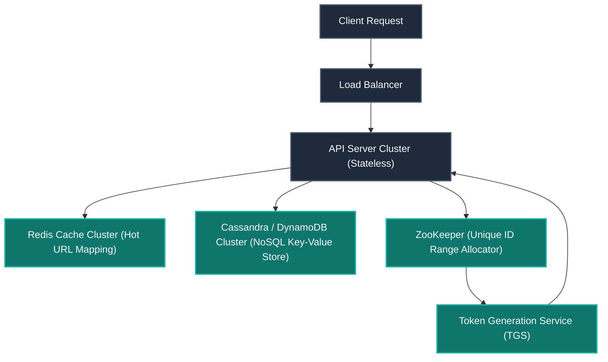
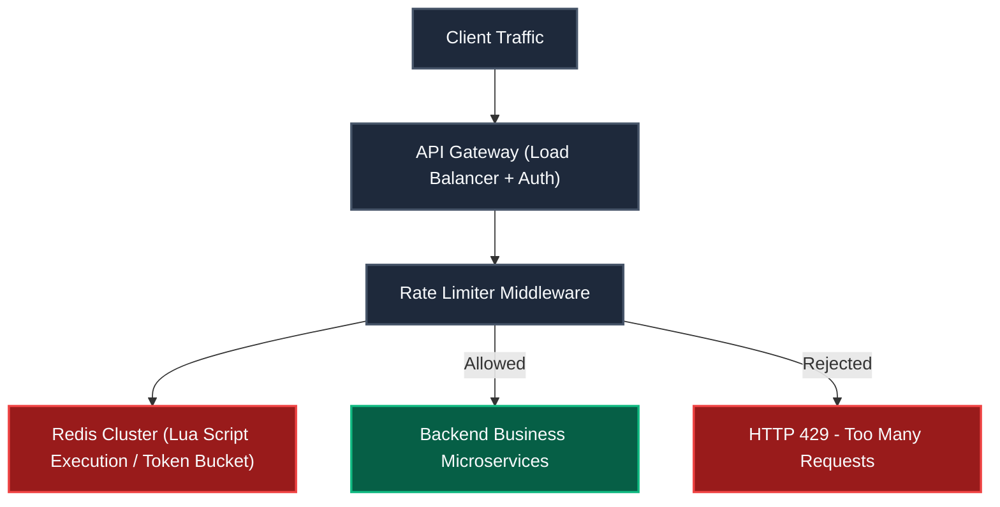
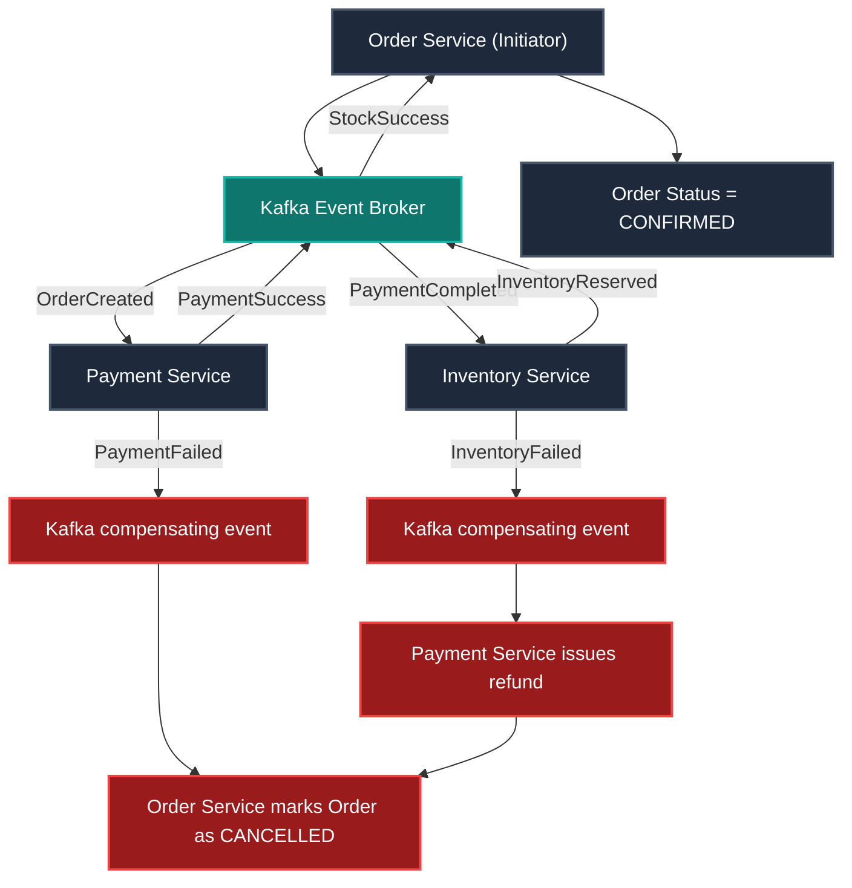
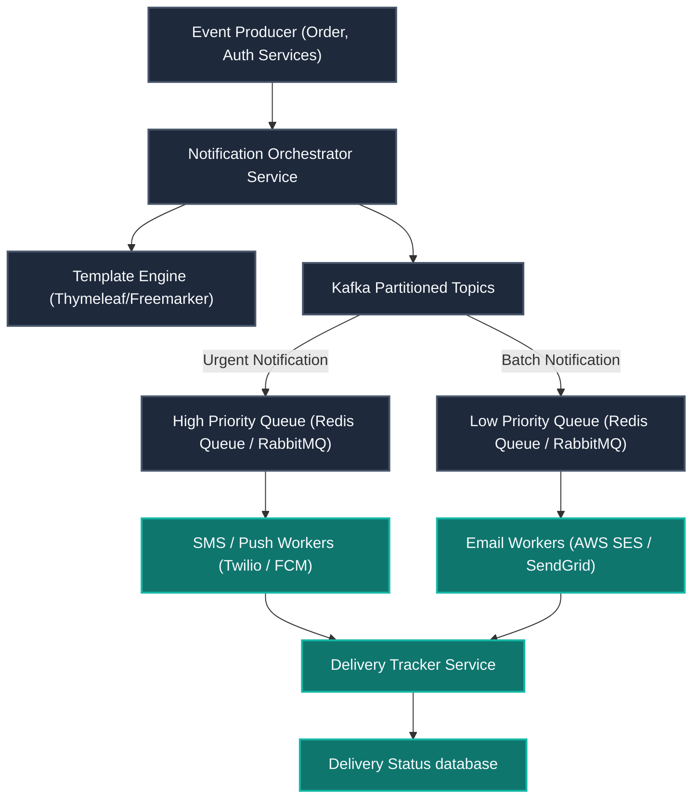
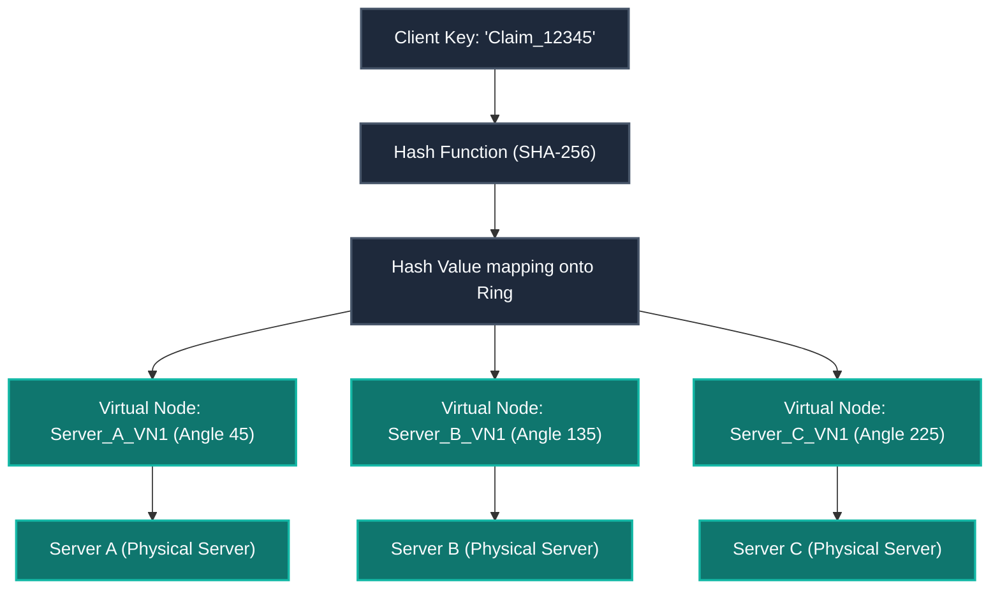

# System Design - Interview Preparation Guide
> *Designed for: 7+ Years Experience Level | Java Developer*

This guide serves as a comprehensive system design reference tailored for senior engineers. It covers structural fundamentals, architectural questions, scale estimation, and production-grade implementation examples using the Java ecosystem.

---

## Table of Contents
1. [Section 1: System Design Fundamentals](#section-1-system-design-fundamentals)
2. [Section 2: Core System Design Scenarios](#section-2-core-system-design-scenarios)
   - [Q1. Design a URL Shortener](#q1-design-a-url-shortener-like-bitly)
   - [Q2. Design a Distributed Rate Limiter](#q2-design-a-distributed-rate-limiter)
   - [Q3. Design an E-Commerce Order System (Saga Pattern)](#q3-design-an-e-commerce-order-system)
   - [Q4. Design a Real-Time Chat Application](#q4-design-a-chat-application)
   - [Q5. Design an Enterprise-Grade Notification System](#q5-design-an-enterprise-grade-notification-system)
   - [Q6. CAP Theorem Deep Dive](#q6-cap-theorem---deep-explanation-with-examples)
   - [Q7. Design a Distributed Cache (Redis-based)](#q7-design-distributed-cache-redis-architecture)
   - [Q8. Load Balancing Algorithms](#q8-load-balancing-algorithms)
   - [Q9. Database Sharding Strategies](#q9-database-sharding-strategies)
   - [Q10. Consistent Hashing](#q10-consistent-hashing)
3. [Section 3: Expanded Architectural Patterns](#section-3-expanded-architectural-patterns)
   - [Q11. Design a Scalable News Feed (e.g., Twitter)](#q11-design-twitter-feed-fan-out-on-write-vs-fan-out-on-read)
   - [Q12. Design Uber/Ride-Sharing Location Service](#q12-design-uberride-sharing-matching-algorithm-location-service)
   - [Q13. Design a Distributed File Storage System (e.g., S3-like)](#q13-design-file-storage-s3-like-chunking-replication-metadata-service)
   - [Q14. Design Search Autocomplete (Trie-based)](#q14-design-search-autocomplete-trie-data-structure-pre-computed-suggestions)
   - [Q15. ACID vs. BASE Systems](#q15-acid-vs-base-basically-available-soft-state-eventually-consistent)
   - [Q16. Content Delivery Networks (CDN)](#q16-cdn-content-delivery-network-edge-caching-origin-server-cache-invalidation)
   - [Q17. Hot Spot & Celebrity Performance Issues](#q17-hot-spot-detection-and-solutions-celebrity-problem-cache-rate-limit)
4. [Section 4: Scale Estimation Techniques](#section-4-estimation-techniques)

---

## Section 1: System Design Fundamentals

Building scalable distributed systems requires aligning infrastructure across several core dimensions:

##### GFM Comparison: Horizontal vs. Vertical Scaling
| Dimension | Horizontal Scaling (Scale Out) | Vertical Scaling (Scale In) |
| :--- | :--- | :--- |
| **Concept** | Adding more machines to the server pool. | Increasing CPU, RAM, or Disk on an existing node. |
| **Cost Profile** | Linear, commodity hardware pricing. | Exponential, proprietary server configurations. |
| **Scaling Limit** | Practically infinite (limited by network routing). | Hard hardware limits (e.g., max RAM slots on motherboard). |
| **Fault Tolerance**| Built-in (no Single Point of Failure). | Poor (if the single node fails, the system goes down). |
| **Complexity** | High (load balancing, network state, consistency). | Low (processes run locally on a single machine). |

##### GFM Comparison: SQL vs. NoSQL Databases
| Feature | SQL Databases (RDBMS) | NoSQL Databases |
| :--- | :--- | :--- |
| **Data Model** | Relational, strict tabular schemas. | Key-Value, Document, Columnar, or Graph models. |
| **Transactions** | Strict ACID compliance. | Eventual consistency (BASE) with tunable trade-offs. |
| **Scaling** | Typically vertical; horizontal sharding is complex. | Horizontally scalable by partition key design. |
| **Joins** | Native SQL join queries. | Denormalization or application-level aggregation. |
| **Examples** | PostgreSQL, MySQL, MS SQL Server, Oracle. | Cassandra, MongoDB, DynamoDB, Neo4j. |

#### Key Takeaways: Fundamentals
- Scalability is about routing traffic efficiently; horizontal scaling is preferred for enterprise backends.
- RDBMS is used when consistency is non-negotiable; NoSQL is preferred for scale-out storage.
- Load Balancing and Caching are the primary tools used to scale systems.

---

## Section 2: Core System Design Scenarios

### Q1. Design a URL Shortener (like bit.ly)

**Goal**: Shorten long URL links, handle redirection with low latency, and collect request analytics.

##### Requirements:
- **Write Path**: 100M URLs generated per month.
- **Read Path**: $100:1$ Read/Write ratio (10B redirects/month). Redirection latency must be $<50\text{ ms}$.



##### Design Components:
1. **API Server Cluster**: Stateless servers handling generation (POST) and redirects (GET HTTP 301).
2. **Token Generation Service (TGS)**: A distributed coordinator using Apache ZooKeeper to allocate unique ID ranges (e.g., Server 1 gets IDs 1–1,000,000; Server 2 gets 1,000,001–2,000,000). This avoids lock contention.
3. **Encoding Model**: Converts ZooKeeper incremented numerical IDs to string tokens using Base62 encoding (`[a-zA-Z0-9]`). A 7-character string supports $62^7 \approx 3.5\text{ Trillion}$ unique URLs.
4. **Caching Layer**: Redis cluster stores hot mapping entries (`short_token -> long_url`). Eviction follows the Least Recently Used (LRU) policy to align with the 80/20 rule (20% of URLs drive 80% of redirects).
5. **NoSQL Database**: Cassandra or DynamoDB stores URL maps. Cassandra's write speed fits our write load, using the short token as the partition key.

---

### Q2. Design a Distributed Rate Limiter

**Goal**: Protect service backends from spam, DDoS attacks, and resource abuse.

##### Design Components:
- **Token Bucket Algorithm**: A bucket with capacity $C$ refills at $R$ tokens/sec. Requests consume a token; if empty, requests are rejected with an HTTP 429 error.
- **Distributed Coordination**: Uses a centralized cache (Redis) with Lua scripting to perform atomic checks, avoiding race conditions under concurrent requests.



##### Java Snippet: Redis Lua script-based Rate Limiter runner
```java
public class RedisRateLimiter {
    private final JedisPool jedisPool;
    
    // Atomically evaluates token count, compares against limit, and sets TTL
    private static final String LUA_LIMITER_SCRIPT = 
          "local key = KEYS[1] "
        + "local limit = tonumber(ARGV[1]) "
        + "local window = tonumber(ARGV[2]) "
        + "local current = redis.call('get', key) "
        + "if current and tonumber(current) >= limit then "
        + "    return 0 " // Rate limit exceeded
        + "else "
        + "    redis.call('incr', key) "
        + "    if not current then "
        + "        redis.call('expire', key, window) "
        + "    end "
        + "    return 1 " // Allowed
        + "end";

    public RedisRateLimiter(JedisPool pool) {
        this.jedisPool = pool;
    }

    public boolean isAllowed(String userId, int limit, int windowSeconds) {
        try (Jedis jedis = jedisPool.getResource()) {
            Object result = jedis.eval(LUA_LIMITER_SCRIPT, 
                List.of("rate:" + userId), 
                List.of(String.valueOf(limit), String.valueOf(windowSeconds)));
            return Long.valueOf(1).equals(result);
        }
    }
}
```

##### Java Snippet: Resilience4j RateLimiter Configuration
```java
@Configuration
public class RateLimiterConfig {
    @Bean
    public RateLimiterRegistry rateLimiterRegistry() {
        RateLimiterConfig config = RateLimiterConfig.custom()
            .limitRefreshPeriod(Duration.ofSeconds(1))
            .limitForPeriod(100) // Max 100 requests per second
            .timeoutDuration(Duration.ofMillis(0)) // Drop immediately if exceeded
            .build();
        return RateLimiterRegistry.of(config);
    }
}
```

---

### Q3. Design an E-Commerce Order System

**Goal**: Coordinate order creation, payments, and inventory management reliably without transactional issues.

##### Saga Pattern (Orchestration-based):
Since databases are partitioned per microservice, distributed transactions cannot use standard 2-Phase Commit (2PC) locks. Instead, we use an **Orchestration Saga** where the Order Service coordinates state transitions and triggers compensating tasks if a step fails.



##### Java Snippet: Saga Compensation Simulation in Spring Boot
```java
@Service
@RequiredArgsConstructor
public class OrderSagaOrchestrator {
    private final KafkaTemplate<String, Object> kafkaTemplate;
    private final OrderRepository orderRepository;

    @Transactional
    public void startSaga(Order order) {
        order.setStatus(OrderStatus.PENDING);
        orderRepository.save(order);
        // Trigger payment process
        kafkaTemplate.send("payment-request-topic", new PaymentRequestEvent(order.getId(), order.getTotalAmount()));
    }

    @KafkaListener(topics = "payment-failure-topic")
    public void handlePaymentFailure(PaymentFailureEvent event) {
        // Compensating transaction: Cancel order and notify user
        orderRepository.findById(event.getOrderId()).ifPresent(order -> {
            order.setStatus(OrderStatus.CANCELLED);
            order.setCancelReason("PAYMENT_FAILED");
            orderRepository.save(order);
            kafkaTemplate.send("notification-topic", new NotificationEvent(order.getUserId(), "Order cancelled due to payment failure"));
        });
    }
}
```

---

### Q4. Design a Real-Time Chat Application

**Goal**: Deliver low-latency messages between concurrent users and maintain user status state.

##### Architecture Components:
- **WebSocket Servers**: Manages long-lived bidirectionally active WebSocket connections from clients.
- **Message Broker (Kafka)**: Decouples servers. When User A (on Server 1) messages User B (on Server 2), the message is routed through a Kafka partition.
- **User Presence Service**: Manages user status (online/offline) in Redis using simple string entries (`user:presence:123 -> "ONLINE"` with a 60-second TTL updated via keep-alive pings).
- **Message Store**: MongoDB is used to store chat history because of its flexible document structure and high write throughput.

---

### Q5. Design an Enterprise-Grade Notification System

**Goal**: Deliver transactional emails, SMS, push notifications, and in-app alerts reliably at scale.



##### Core Features:
- **Rate Limiting**: API gateway limits notifications to a maximum of 5 requests per hour per user to prevent spam.
- **Template Management**: Centralized rendering service using engines like Thymeleaf or FreeMarker.
- **Retry with Exponential Backoff**: SMS/Email providers can fail. Failed worker delivery tasks are retried after increasing delays (e.g., $2\text{s}, 4\text{s}, 8\text{s}$) to avoid overloading downstream systems.

---

### Q6. CAP Theorem - Deep Explanation with Examples

The CAP Theorem states that distributed data stores can guarantee at most two of the following three properties:
- **Consistency (C)**: Every read returns the most recent write or an error.
- **Availability (A)**: Every non-failing node returns a response, without guaranteeing it contains the most recent write.
- **Partition Tolerance (P)**: The system continues to operate despite network partitions (dropped or delayed messages).

```text
       Consistency (C)
            /\
           /  \
  RDBMS   /    \  MongoDB / HBase
  (no P) /  CP  \ (no A during partition)
        /________\
       /    AP    \
      /____________\
 Availability (A)   Partition Tolerance (P)
                  Cassandra / DynamoDB (Tunable)
```

##### Selection Choices:
- **CP (Consistency + Partition Tolerance)**: Returns an error or blocks write confirmations if it cannot guarantee consistent data across nodes. *Example: MongoDB, HBase, BigTable.*
- **AP (Availability + Partition Tolerance)**: Nodes accept local writes and reads during network partitions, resolving inconsistencies once the network recovers. *Example: Cassandra, DynamoDB.*
- **CA (Consistency + Availability)**: Cannot handle network partitions. Real-world distributed systems must tolerate network failures, meaning **CA is not a viable option in distributed environments**.

---

### Q7. Design Distributed Cache (Redis Architecture)

A distributed cache scales read-heavy workloads by keeping frequently accessed data in memory.

##### Caching Topology Options:
1. **Sentinel**: Provides master-replica monitoring and automatic failover for high availability.
2. **Cluster Mode**: Data is distributed across master nodes using consistent hashing across 16,384 logical hash slots, allowing the cache to scale horizontally.

##### GFM Comparison: Caching Strategies
| Strategy | Read Flow | Write Flow | Pros | Cons |
| :--- | :--- | :--- | :--- | :--- |
| **Cache-Aside** | App checks cache; on miss -> loads from DB -> writes to cache. | App updates DB -> invalidates cache key. | Simple; safe from cache pollution. | Potential cache miss latency on first read. |
| **Write-Through**| App reads from cache. | App writes to cache -> cache updates DB immediately. | Cache always contains fresh data. | Write latency (waiting for both updates to complete). |
| **Write-Behind** | App reads from cache. | App writes to cache -> cache queues update -> async writes to DB. | Very low write latency. | Risk of data loss if the cache node crashes before updating the DB. |
| **Read-Through** | App reads from cache library; library loads from DB on miss. | App writes directly to DB or uses write-through. | Cleaner application code. | Requires custom cache provider integrations. |

##### Java Snippet: Cache-Aside Implementation in Java using Jedis
```java
public class CacheAsideService {
    private final JedisPool jedisPool;
    private final DatabaseRepository dbRepo;

    public CacheAsideService(JedisPool pool, DatabaseRepository repo) {
        this.jedisPool = pool;
        this.dbRepo = repo;
    }

    public UserData getUser(String userId) {
        try (Jedis jedis = jedisPool.getResource()) {
            String cacheKey = "user:" + userId;
            String cachedJson = jedis.get(cacheKey);
            if (cachedJson != null) {
                return deserialize(cachedJson); // Cache Hit
            }
            
            // Cache Miss
            UserData dbData = dbRepo.findById(userId);
            if (dbData != null) {
                jedis.setex(cacheKey, 3600, serialize(dbData)); // Write to cache with 1hr TTL
            }
            return dbData;
        }
    }
}
```

---

### Q8. Load Balancing Algorithms

Load balancers distribute incoming network requests across backend server pools.

##### GFM Comparison: Load Balancing Algorithms
| Algorithm | Routing Strategy | Pros | Cons |
| :--- | :--- | :--- | :--- |
| **Round Robin** | Routes requests sequentially through the server pool. | Simple, zero overhead. | Assumes all servers have identical hardware. |
| **Least Connections** | Routes requests to the node with the fewest active connections. | Good for long-running connections (e.g., FTP, SQL). | Does not account for server hardware differences. |
| **IP Hash** | Hashes the client's IP address to map them to a specific server. | Enables sticky session routing. | Can cause uneven load distributions. |
| **Consistent Hashing** | Maps clients and servers to a logical hash ring. | Minimal data movement when scaling the server pool. | Complex routing logic. |

---

### Q9. Database Sharding Strategies

Sharding divides a large database into smaller, faster database instances (shards) to distribute load.

- **Horizontal Sharding (Range-Based)**: Splits rows by value ranges (e.g., IDs 1–1M go to Shard 1, 1M–2M go to Shard 2). This can create hot spots on active ranges.
- **Algorithmic Sharding (Hash-Based)**: Applies a hash function to a partition key (e.g., `hash(userId) % totalShards`). This distributes data evenly but makes scaling the shard count complex.
- **Directory-Based Sharding**: Uses a lookup service to map shard keys to database nodes. This simplifies resharding but introduces a central point of failure.

---

### Q10. Consistent Hashing

Standard hashing schemes (`hash(key) % N`) require remapping all keys when database nodes are added or removed. **Consistent Hashing** maps keys and servers to a virtual ring, ensuring that only a fraction ($K/N$) of keys need to be reallocated during scaling events.



##### Java Snippet: Consistent Hashing Ring Implementation using TreeMap
```java
public class ConsistentHashRing<T> {
    private final HashFunction hashFunction;
    private final int numberOfReplicas; // Number of virtual nodes per server
    private final SortedMap<Long, T> circle = new TreeMap<>();

    public ConsistentHashRing(HashFunction hashFunction, int numberOfReplicas, Collection<T> nodes) {
        this.hashFunction = hashFunction;
        this.numberOfReplicas = numberOfReplicas;
        for (T node : nodes) {
            addNode(node);
        }
    }

    public void addNode(T node) {
        for (int i = 0; i < numberOfReplicas; i++) {
            // Create a unique virtual node name and hash it
            long hashVal = hashFunction.hash(node.toString() + "-VN-" + i);
            circle.put(hashVal, node);
        }
    }

    public void removeNode(T node) {
        for (int i = 0; i < numberOfReplicas; i++) {
            long hashVal = hashFunction.hash(node.toString() + "-VN-" + i);
            circle.remove(hashVal);
        }
    }

    public T getNode(String key) {
        if (circle.isEmpty()) {
            return null;
        }
        long hashVal = hashFunction.hash(key);
        if (!circle.containsKey(hashVal)) {
            // Find the next server clockwise on the ring
            SortedMap<Long, T> tailMap = circle.tailMap(hashVal);
            hashVal = tailMap.isEmpty() ? circle.firstKey() : tailMap.firstKey();
        }
        return circle.get(hashVal);
    }
}
```

#### Key Takeaways: Core Scenarios
- Centralized coordinate allocation (like ZooKeeper) prevents ID collisions without database locks.
- Centralized Redis clusters running Lua scripts prevent race conditions in distributed rate limiters.
- Consistent hashing rings minimize database reshuffling when scaling nodes.

---

## Section 3: Expanded Architectural Patterns

### Q11. Design a Scalable News Feed (e.g., Twitter)

**Goal**: Deliver a chronological feed of posts from followed users with low latency.

##### GFM Comparison: Fan-Out on Read vs. Fan-Out on Write
| Metric | Fan-Out on Read (Pull Model) | Fan-Out on Write (Push Model) |
| :--- | :--- | :--- |
| **Approach** | Users fetch and merge posts from friends on-demand when loading their feed. | Posts are pushed directly to the home feed cache of all followers when published. |
| **Write Cost** | $O(1)$ (posts are written once to the database). | $O(F)$ where $F$ is the follower count (high for active users). |
| **Read Cost** | $O(F)$ (expensive queries to fetch and sort posts from all friends).| $O(1)$ (fast cache read of a pre-built feed). |
| **Latency** | High read latency for users with many friends. | Low read latency, but high write latency for popular users. |

```text
--- HYBRID NEWS FEED PIPELINE ---

Active User Post (Push) --> Follower Home Feed Caches
Celebrity Post (Pull)   --> Celebrity Message Queue --> Read-time merge on Client request
```

##### Production Hybrid Strategy:
- **For Standard Users**: Use **Fan-Out on Write**. When a user posts, push it directly to their followers' feed caches in Redis.
- **For Celebrities**: Use **Fan-Out on Read**. Do not push posts to millions of followers. Instead, write celebrity posts once to a separate store, and merge them into the follower's feed only when they request a read.

---

### Q12. Design Uber/Ride-Sharing Location Service

**Goal**: Track moving drivers in real time and match them with nearby riders.

##### Geospatial Indexing Strategies:
1. **Geohashing**: Divides the Earth into a grid of hierarchical zones represented by base32 string hashes. Matching nearby users is simplified by checking prefix strings (e.g., `wtw3sj`).
2. **Google S2 Geometry**: Projects the Earth onto a cube using Hilbert curves. It represents locations as 64-bit integer cell IDs, allowing fast geospatial queries using simple range comparisons.

```text
Driver Tracker Event -> Kafka Location Topic -> Spatial Cache (Redis Geospatial Index: GEOADD)
                                                            |
Query Nearby (GEORADIUS) <-- Dispatch Matcher <-- Rider Request Event
```

##### Operational Flow:
Drivers send latitude/longitude updates every 4 seconds. The updates are pushed through Kafka to load balance writes, then stored in a geospatial cache (like Redis's `GEOADD`). Riders requesting a pickup query nearby drivers using spatial commands like `GEORADIUS`.

---

### Q13. Design File Storage (S3-like): Chunking, Replication, Metadata Service

**Goal**: Store petabytes of unstructured files reliably.

```text
Client Upload --> Metadata Server (Saves Key, Size, Chunk Locations to PostgreSQL)
              --> Data Node Server 1 (Writes Chunk 1 to Local Disk)
              --> Data Node Server 2 (Async replicates Chunk 1 copy)
```

##### Architectural Model:
1. **Chunking**: Files are split into fixed-size chunks (e.g., 64 MB) to simplify disk space management.
2. **Replication**: Chunks are replicated across different racks and availability zones to prevent data loss. Nodes coordinate availability using periodic heartbeats.
3. **Decoupled Metadata**: File names, size, mapping details, and chunk locations are stored in a relational database, while raw chunks are stored directly on dedicated object servers.

---

### Q14. Design Search Autocomplete: Trie Data Structure, Pre-computed Suggestions

**Goal**: Return top query suggestions in real time as the user types.

##### System Implementation:
- **Data Structure**: A **Trie** (prefix tree) stores search query patterns. Nodes store prefixes along with query frequencies.
- **Prefix Search Optimization**: Traversing a large Trie at query time is too slow. To achieve low latencies, we precompute the top 10 most common query completions for each node and store them directly in the Trie node itself, avoiding full tree traversals.

```text
    [Root]
     /
   [c] (Precomputed: "claim", "car")
   /
 [cl] (Precomputed: "claim", "classic")
```

---

### Q15. ACID vs. BASE (Basically Available, Soft State, Eventually Consistent)

Distributed architectures select database storage models based on their consistency requirements:

##### GFM Comparison: ACID vs. BASE
| Dimension | ACID (Pessimistic Strictness) | BASE (Optimistic Eventual Consistency) |
| :--- | :--- | :--- |
| **Focus** | Data Consistency and Transaction Safety. | System Availability and Scalability. |
| **State Model**| Consistent state transitions; data locks during writes. | Soft state; data can change dynamically without active writes. |
| **Consistency**| Immediate Consistency (guaranteed for all reads). | Eventual Consistency (data synchronizes over time). |
| **Use Cases** | Core transactional data (e.g., billing, ledger). | Collaborative data (e.g., social feeds, chat logs). |

---

### Q16. CDN (Content Delivery Network): Edge Caching, Origin Server, Cache Invalidation

**Goal**: Deliver static assets (e.g., images, video files, scripts) to users with low latency.

```text
User Request --> CDN Edge Edge Cache (Hit? Returns asset)
             --> (Miss? CDN fetches from Origin Web Server -> Caches at Edge)
```

##### Architectural Design:
- **Edge Caching**: Resolves request IP routing to the nearest edge server (using GeoDNS) to serve cached content locally.
- **Cache Invalidation**:
  - **Pull (TTL)**: Edge servers cache assets until an expiration timeout (Time-To-Live) completes, then fetch the updated asset from the origin on the next request.
  - **Push (Purge API)**: Origin servers push API requests to invalidate and update edge cached assets immediately when content changes.

---

### Q17. Hot Spot Detection and Solutions (Celebrity Problem)

**Goal**: Prevent write bottlenecks and read performance degradation on hot partitions.

##### Causes of Hotspots:
- A database shard gets overloaded because it hosts a trending celebrity account or active item record.

##### Technical Mitigation Strategies:
1. **Salting**: Append a random suffix (e.g., `_1`, `_2`) to partition keys to distribute writes evenly across different shards.
2. **Local Caching (L1)**: Cache celebrity profile information directly in the memory of the application server (e.g., using Caffeine Cache) to bypass Redis or database calls entirely for highly active keys.
3. **Rate Limiting**: Apply strict rate limits to concurrent read requests on hot partition ranges to protect system resources.

---

## Section 4: Scale Estimation Techniques

Before designing any system, perform back-of-the-envelope calculations to estimate resource needs:

##### Common Baseline Constants:
- **1 Day**: $\approx 100,000\text{ seconds}$ (exactly $86,400$).
- **1 Month**: $\approx 2.5\text{ Million seconds}$.
- **Data Size Estimate**: 1 Char = 1 Byte (ASCII), 1 Long ID = 8 Bytes.

##### Example Estimation: URL Shortener Storage (5 Years)
- **Assumed Rate**: 100M URLs generated per month.
- **Data Size**: $500\text{ Bytes}$ per record mapping.
- **Calculation**:
  $$\text{Total Records} = 100\text{M} \times 12\text{ months} \times 5\text{ years} = 6\text{ Billion Records}$$
  $$\text{Total Storage} = 6\text{B} \times 500\text{ Bytes} = 3\text{ Terabytes (TB)}$$
- **IOPS Estimation**:
  $$\text{Write IOPS} = \frac{100\text{M}}{2.5\text{M seconds}} = 40\text{ writes/second}$$
  $$\text{Read IOPS (100:1)} = 40 \times 100 = 4,000\text{ reads/second}$$
- **Memory Requirements (Cache 20% Hot Data daily)**:
  $$\text{Daily Writes} = 100\text{M} / 30 \approx 3.3\text{M URLs/day}$$
  $$\text{Daily Reads (100:1)} = 330\text{M reads/day}$$
  $$\text{Memory needed (20%)} = 66\text{M reads} \times 500\text{ Bytes} \approx 33\text{ Gigabytes (GB) of RAM}$$
